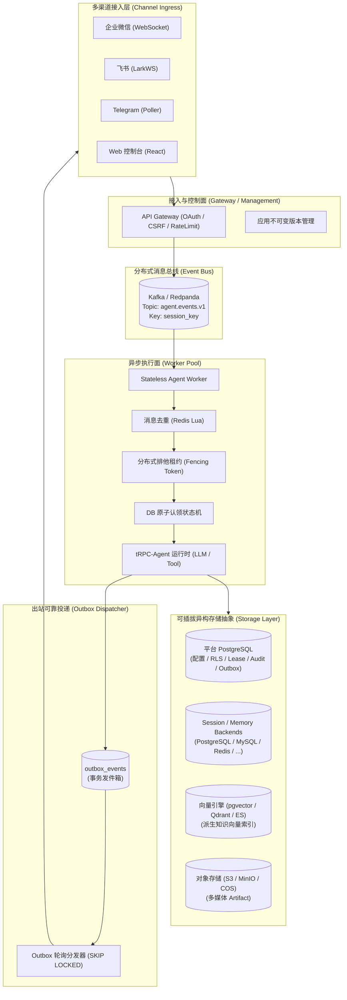

# tRPC-Agent-Go 多租户分布式 Agent 平台

[](https://golang.org)
[](https://nodejs.org)
[](https://react.dev)
[](https://www.docker.com)
[](LICENSE)

面向企业级生产环境的高可用、多租户、分布式 AI Agent 运行时协同治理平台。

本项目基于 [tRPC-Agent-Go](https://github.com/trpc-group/trpc-agent-go) 框架构建，采用“API Gateway 接入与控制面 + Kafka 分布式消息总线 + 无状态 Worker 执行池 + 事务发件箱 (Outbox)”的分层解耦架构。平台统一管理 Agent 运行、模型调度、Tool/MCP 治理、Session/Memory 状态、知识库向量检索及多渠道接入，提供多租户隔离、可恢复执行与可观测的数据一致性边界。

---

## 核心特性 (Key Features)

- **🏢 强多租户数据与执行隔离**：支持行级安全（RLS）动态数据隔离；应用配置随执行固化为不可变版本快照，杜绝在途会话被篡改；敏感密钥统一脱敏解析。
- **⚡ 异步解耦与弹性伸缩**：Gateway 负责身份认证与入队列，Kafka 削峰填谷；Worker 不持有必须留在本机的业务状态，可通过副本数、Kafka 分区与 `WORKER_CONCURRENCY` 横向扩展。
- **🛡️ 两级幂等与防并发脑裂**：Redis Lua 短路租约 + 数据库 CAS 原子状态机认领；单调递增 `fencing_token` 阻断网络分区与 GC 导致的并发脑裂；事务发件箱（Outbox）提供可恢复的至少一次投递，并通过请求幂等键、租约和回执尽量收窄外部重复发送窗口。
- **🔌 可插拔异构多存储驱动**：平台采用多后端存储抽象层，支持将 Session、Memory、Knowledge 与 Artifact 四大存储域分别路由至关系型数据库 (PostgreSQL / MySQL / SQLite)、缓存/NoSQL (Redis / MongoDB / ClickHouse)、向量数据库 (pgvector / Qdrant / Elasticsearch) 及对象存储 (S3 / COS)。
- **💬 多渠道接入**：原生集成企业微信智能机器人 WebSocket 长连接、飞书 LarkWS 事件长连接、Telegram Bot API 长轮询及 React Web 控制台。
- **📊 生产级安全治理与可观测性**：工具调用动态白名单机制与运行时熔断；内置 OpenTelemetry 全链路追踪、Prometheus 指标导出与 Langfuse 观测支持。

---

## 快速上手 (Quick Start)

### 1. 准备环境与配置

项目开发依赖 Go `1.24.x`、Node.js `22.x`（与官方 Docker `node:22-alpine` 基线一致）与 Docker Compose。在项目根目录下初始化本地配置文件：

```bash
cp deploy/.env.example deploy/.env
mkdir -p data
cp deploy/.env data/platform.env
```

### 2. 配置真实大模型 (Model Configuration)

平台原生支持 OpenAI-compatible、腾讯混元与 HuggingFace 三类 Provider。DeepSeek 等提供 OpenAI-compatible 接口的模型可按兼容端点接入；Provider 类型与模型能力均由平台目录显式声明，不根据模型名称猜测。

在 `deploy/.env`（或环境变量）中配置模型访问秘钥：

```bash
MODEL_API_KEY=sk-your-real-api-key
```

在 `configs/platform.json` 的 `model_providers` 中指定对应供应商的端点与模型：

```json
{
  "model_providers": [
    {
      "id": "openai-primary",
      "type": "openai",
      "base_url": "https://api.openai.com/v1",
      "api_key_ref": "env:MODEL_API_KEY",
      "models": [
        {
          "name": "gpt-4o-mini",
          "prompt_cost_micros_per_million_tokens": 150000,
          "completion_cost_micros_per_million_tokens": 600000
        }
      ]
    }
  ]
}
```

### 3. 启动本地基础组件

通过 Docker Compose 启动默认的基础设施环境（包含数据库、Redis、Redpanda 消息队列与 MinIO 对象存储）：

```bash
docker compose --env-file deploy/.env -f deploy/compose.yaml up -d --wait postgres redis redpanda minio
docker compose --env-file deploy/.env -f deploy/compose.yaml run --rm minio-init
```

### 4. 编译与启动应用

```bash
# 编译前端并构建 Go 二进制文件
./build.sh

# 执行数据库迁移
./bin/trpc-service migrate

# 启动本地服务（默认后台运行，输出日志至 data/platform.log）
./start.sh

# 检查服务就绪探针
curl --fail http://127.0.0.1:8080/readyz
```

服务就绪后，在浏览器访问管理控制台：👉 **`http://127.0.0.1:8080/console/`**

> **本地开发 Mock 登录**：
> 本地未配置企业微信或飞书等企业 OAuth 登录时，可在环境配置中启用 Mock 登录以快速进入控制台（详见下文「企业登录与安全认证」）。

### 5. 停止服务

```bash
./stop.sh
# 停止容器（默认保留 Volume 数据；若需彻底清空本地数据可追加 --volumes）
docker compose --env-file deploy/.env -f deploy/compose.yaml down
```

---

## 系统架构拓扑 (Architecture)



---

## 技术文档体系 (Documentation)

平台的深入技术设计、数据模型规范、并发机制与高可用运维方案详见 [`docs/`](docs/) 目录：

- **[系统架构设计文档 (Architecture)](docs/architecture.md)**：深入阐述系统的分层解耦拓扑、全景架构设计、**企业微信端到端全链路时序图**、服务接口契约与 Kubernetes 部署伸缩。
- **[数据模型设计文档 (Data Model)](docs/data-model.md)**：包含完整的领域实体关系图 (ER Diagram)、核心数据库表结构 DDL 及不可变配置快照、执行 Trace、发件箱 Payload 的标准 JSON Schema。
- **[数据同步与幂等机制 (Data Sync & Idempotency)](docs/data-sync-and-idempotency.md)**：基于源码说明多级去重（Redis Lua 原子租约 + DB 状态机认领）、排他租约与 Fencing Token、防重复执行、事务发件箱（Outbox）及 Session/Knowledge 在线迁移。
- **[多后端存储适配方案 (Multi-Backend Storage)](docs/multi-backend-storage.md)**：详述 SQL、NoSQL、向量库与对象存储的领域职责边界、多存储适配器抽象（Storage Adapter）及租户专属隔离机制。
- **[生产运维与风险防范指南 (Production Guide & Risk Register)](docs/production-risk-register.md)**：梳理 12 项涵盖并发脑裂、IM 重连/重投、大模型限流、跨租户越权、存储宕机和 goroutine 生命周期等生产风险。
- **[部署与容量评估 (Deployment & Capacity)](deploy/README.md)**：给出最小可运行部署、Kubernetes 分角色部署、Secret 注入、容量公式与真实压测入口。

---

## 异构多存储驱动支持 (Storage Drivers)

平台将数据持久化抽象为四大功能域，支持租户按需将不同域绑定到特定的后端驱动 Profile：

| 数据域 (Domain) | 职责与数据内容 | 支持的驱动 (Drivers) |
| :--- | :--- | :--- |
| **Session** | 会话元数据、对话消息历史与流式状态 | `postgres`, `mysql`, `sqlite`, `redis`, `mongodb`, `clickhouse`, `inmemory` |
| **Memory** | 长期用户偏好、用户画像与实体记忆 | `postgres`, `mysql`, `redis`, `mem0`, `chromadb`, `tencentdb`, `inmemory` |
| **Knowledge** | 知识库文档分块切片与高维嵌入向量 | `pgvector`, `qdrant`, `elasticsearch` |
| **Artifact** | 对话输入输出富媒体、生成图片及中间文件 | `postgres`, `s3`, `cos`, `inmemory` |

基线数据库内置 `platform-postgres`（Session / Memory / Artifact）与 `platform-pgvector`（Knowledge）两个 Profile；Redis 同时承担平台幂等、限流等低延迟共享状态。S3 / COS 等对象存储可由管理员按需新增 Artifact Profile。

---

## 管理控制台与前端开发 (Web Console)

平台内置现代化单页面管理控制台（React + TypeScript + Vite），支持通过嵌入式 SPA 或独立前后端分离开发：

- **核心功能**：
  - **应用编排与版本发布**：创建/编辑机器人，绑定渠道接入。应用配置以单调递增版本持久化，支持候选版本、按用户/入口与比例灰度，以及从历史版本重新发布形成新的稳定版本。
  - **异步对话流**：`POST /api/v1/chat` 强制要求客户端携带 UUID `request_id`，成功入队后返回独立的 `/api/v1/chat/stream` SSE 地址；SSE 支持 `Last-Event-ID` 断线续传，防止弱网重试重复推理或重复展示增量。
  - **知识库管理**：按租户应用管理向量切片。文本/Markdown/DOCX 复用内置 Reader；PDF/PPTX/XLSX/图片支持通过 Docling 抽取后分块索引；单文件上限 16 MiB。
  - **会话与审计视图**：集中管理 Web、企业微信、飞书、Telegram 真实会话与执行记录，普通用户仅可见个人会话，管理员具备全局审计看板。

### 前端本地独立开发

```bash
cd webui
npm ci           # 安装前端依赖
npm run dev      # 启动 Vite 开发服务器 (默认反向代理 API 至 127.0.0.1:8080)
npm run build    # 编译前端生产静态资源
```

---

## 渠道连接器集成 (Channel Connectors)

所有外部 IM 渠道均收敛为**长连接 / 长轮询 Connector 模式**。生产部署由 `SERVICE_ROLE=channel` 的节点运行 `channelConnectorManager`，并通过 Redis 租约选举连接所有者，无需为当前三类 IM 配置公网消息回调域名：

- **企业微信智能机器人**：
  - 基于官方 **WebSocket 长连接**（`wss://openws.work.weixin.qq.com`）；
  - 凭据包含 `bot_id` 与 `secret`，建立连接后发送 `aibot_subscribe` 握手并维持 30 秒心跳；
  - 自动识别单聊与群聊，支持 Markdown 渲染，多媒体附件统一暂存为 Artifact；出站调用 `aibot_send_msg` 投递。
- **飞书开放平台**：
  - 基于飞书官方 SDK **WebSocket 长连接**（`larkws.NewClient`）；
  - 凭据包含 `app_id` 与 `app_secret`，群聊自动校验 `@bot` 过滤，出站调用官方 API 发送富文本与卡片。
- **Telegram Bot**：
  - 基于官方 Bot API **长轮询**（`getUpdates`）；
  - 凭据包含 `bot_token`，仅在消息成功入队或跳过后推进 `offset`；具备针对 429 `retry_after` 的退避处理；超长文本由 Outbox 按 4000 rune 的安全余量分段发送，避免越过 Telegram 4096 字符限制。
- **本地契约测试**：
  - 渠道模块均具备完整的本地测试与 Mock 网关契约测试（`channel_connectors_test.go`），无需真实机器人凭证即可验证全链路握手、保活与收发消息。

---

## 企业级身份认证 (Enterprise Authentication)

平台基于 Redis 维护跨节点共享的分布式会话：
- 会话 Cookie 采用 `HttpOnly + SameSite=Lax`；敏感写操作强制执行 CSRF 双提交校验（Cookie `csrf_token` 与 Header `X-CSRF-Token`）。
- 支持企业微信、飞书、OIDC 以及开发调试专用的 Mock 四种认证源。

### 1. 飞书登录与扫码接入
- **重定向 URL 严格校验**：飞书后台配置的重定向 URL 必须与 `LOGIN_CALLBACK_URL` 严格一致（如 `http://localhost:5173/api/v1/auth/callback`）。
- **页面内扫码登录**：开启后登录页直接渲染二维码，无需整页跳转：
  ```bash
  LOGIN_FEISHU_QR_MODE=sdk_redirect   # 启用页面内二维码扫码模式 (默认 off)
  ```

### 2. 企业微信自建应用登录
1. 企业微信管理后台 →「应用管理」→ 创建**自建应用**，获取 `AgentId` 与 `Secret`；
2. 「网页授权及 JS-SDK」设置可信域名（与控制台对外访问域名一致）；
3. 「可见范围」配置允许登录的企业成员；
4. 配置 `WECOM_LOGIN_CORP_ID`、`WECOM_LOGIN_AGENT_ID` 与 `LOGIN_CALLBACK_URL`，Secret 放入 `WECOM_LOGIN_SECRET` 环境变量；多 Provider JSON 则只保存 `secret_ref: "env:WECOM_LOGIN_SECRET"`，不把 Secret 明文写进配置文件。

### 3. 本地 Mock 登录支持
在本地开发或私有环境中，若尚未接入企业微信/飞书/OIDC，可开启 Mock 登录快速进行功能联调：
```bash
# 方式 A：纯开发模式快捷配置
LOGIN_PROVIDER=mock

# 方式 B：在配置了正式 Provider 的同时，允许在登录页显示额外的 Mock 调试入口
LOGIN_MOCK_ENABLED=true
MOCK_LOGIN_SUBJECT_ID=mock-admin
MOCK_LOGIN_DISPLAY_NAME="Mock Admin"
```

### 4. 系统管理员初始化与配置参考

首次部署时可通过环境变量预设超级管理员身份：
```bash
SYSTEM_ADMIN_PROVIDER_ID=wecom
SYSTEM_ADMIN_SUBJECT_ID=ZhangSan
```

| 环境变量 | 默认值 | 说明 |
| :--- | :--- | :--- |
| `LOGIN_PROVIDER` | — | 单入口快捷设置：`feishu` / `wecom` / `oidc`；`mock` 用于本地开发 |
| `LOGIN_PROVIDERS_FILE` / `JSON` | — | 多 Provider 详细配置文件路径或 JSON 字符串 |
| `LOGIN_CALLBACK_URL` | — | 各 Provider 共用的统一回调 URL（路径必须固定为 `/api/v1/auth/callback`） |
| `LOGIN_MOCK_ENABLED` | `false` | 是否在登录界面显示 Mock 登录入口（生产环境必须为 `false`） |
| `LOGIN_SESSION_TTL` | `8h` | 登录会话过期时间（如 `8h`, `24h`） |
| `LOGIN_SECURE_COOKIE` | `false` | Cookie 是否添加 `Secure` 属性（生产 HTTPS 环境必须启用） |
| `LOGIN_STATE_SECRET` | — | 用于 OAuth 事务 HMAC 签名防伪的密钥 |

---

## 可观测性体系 (Observability)

平台原生打通 OpenTelemetry 观测体系：

```bash
# 1. 导出全链路 Tracing 与 Metrics 至 OTLP Collector (生产推荐)
OTEL_EXPORTER_OTLP_ENDPOINT=http://127.0.0.1:4318

# 2. 直接在服务的 /metrics 端点暴露 Prometheus 指标
PROMETHEUS_ENABLED=true

# 3. 接入 LLM 观测平台 Langfuse
LANGFUSE_PUBLIC_KEY=pk-...
LANGFUSE_SECRET_KEY=sk-...
LANGFUSE_HOST=cloud.langfuse.com:443
```

平台的日志、审计投影、Execution Trace 与 Prometheus 标签不记录模型密钥、原始提示词或会话正文；模型 Provider 在正常推理调用中仍会按应用配置接收必要的 Prompt 内容。

---

## 生产部署与注意事项 (Deployment Notes)

### 1. 后端 Profile 需显式授权 (重要)
系统默认不会自动向新创建的租户授权所有底层存储 Profile。
若新建租户在应用配置中引用了特定的存储 Profile（例如自定义的 MySQL、Redis 或 Qdrant Profile），需由管理员在控制台「数据后端」页面为该租户勾选授权，或在数据库中插入授权记录：
```sql
INSERT INTO tenant_backend_profiles (tenant_id, profile_id) VALUES ('your_tenant', 'platform-postgres');
```

### 2. 数据库结构迁移
数据库结构演进与升级统一通过服务内置的迁移器执行：
```bash
./bin/trpc-service migrate
```
该命令会自动检查当前数据库版本并执行前向迁移。

---

## 项目代码结构 (Directory Structure)

```txt
.
├── build.sh                  # 项目一键构建 (编译前端 + 链接 Go 二进制)
├── start.sh                  # 本地服务启动与状态监控
├── stop.sh                   # 停止本地服务
├── clean.sh                  # 清理中间编译产物与缓存
├── format.sh                 # 格式化 Go 代码 (gofmt)
├── lint.sh                   # 静态代码检查 (go vet)
├── coverage.sh               # 运行全量单测并输出原子覆盖率报告
├── cmd/
│   └── trpc-service/         # 服务入口组合根与命令行工具 (serve / migrate)
├── trpcservice/              # 平台核心业务与领域模型实现
│   ├── agent/                # Agent 运行时状态机、心跳维系与原子认领
│   ├── assembly/             # 租户配置快照解析、会话迁移与存储装配器
│   ├── channels/             # 企业微信 (wecombot)、飞书 (larkws)、Telegram 连接器
│   ├── dbscope/              # 数据库租户上下文注入与安全作用域
│   ├── governance/           # 工具权限动态白名单策略、审计脱敏与流控
│   ├── identity/             # 企业身份 Provider (WeCom / Feishu / OIDC / Mock)
│   ├── messaging/            # 事务性发件箱 (Outbox) 与 IM 进度推送引擎
│   ├── storage/              # 多后端存储适配 (PostgreSQL, MySQL, Redis, S3, Qdrant 等)
│   └── web/                  # Web 控制台管理 API、异步对话 SSE 与版本控制
├── webui/                    # React + TypeScript 现代化管理控制台
├── migrations/               # 数据库 DDL 基线、安全策略与迁移测试
├── configs/                  # 平台及租户配置文件规范 (platform.json / README.md)
├── deploy/                   # 生产部署清单 (Docker Compose, Kubernetes, Kind, OTel)
├── docs/                     # 系统架构设计、数据模型、存储适配与高可用运维文档
├── scripts/                  # 核心脚本实现与端到端自动化验收套件
└── tests/                    # 浏览器 E2E、真实中间件集成测试与压测套件
```

---

## 质量验证与测试 (Testing)

```bash
# 1. 运行核心单元测试并进行竞态检测 (-race)
go test -race ./cmd/... ./trpcservice/...

# 2. 执行数据库模式与迁移集成测试
go test -v ./migrations/ -run TestPostgresSchemaAndMigrations

# 3. 运行静态代码检查与格式化
./lint.sh
./format.sh

# 4. 生成代码覆盖率统计报告
./coverage.sh

# 5. 执行前端单元测试与构建验证
cd webui && npm test && npm run build
```

---

## 开源协议 (License)

本项目遵循 [Apache License 2.0](LICENSE) 开源协议。
