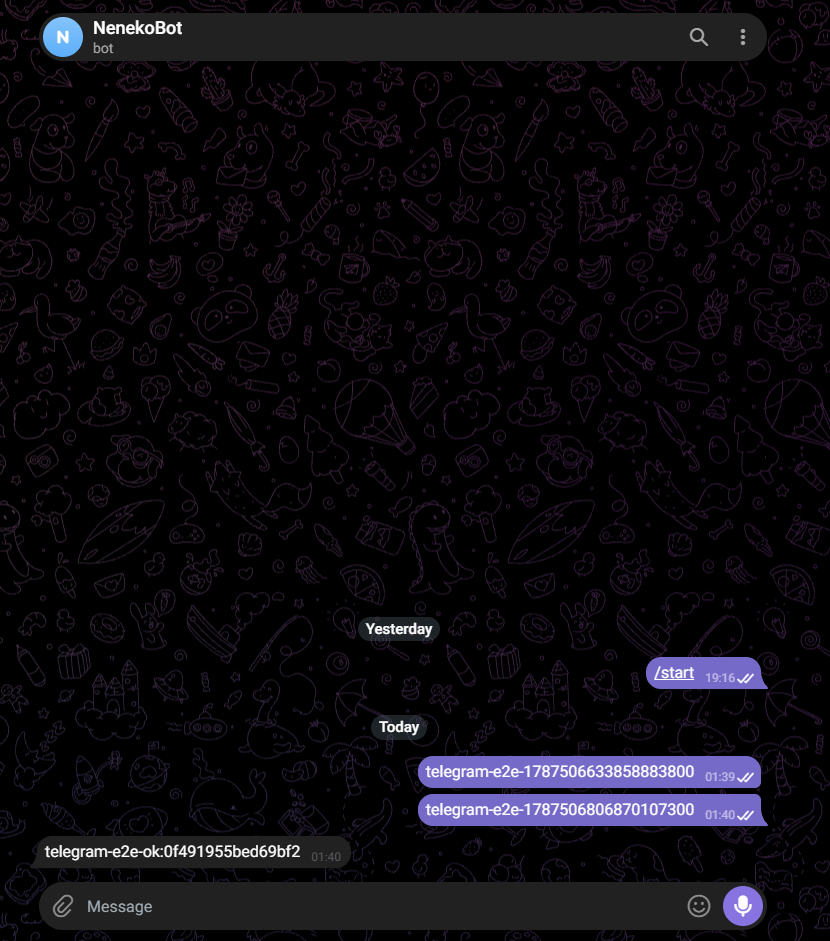
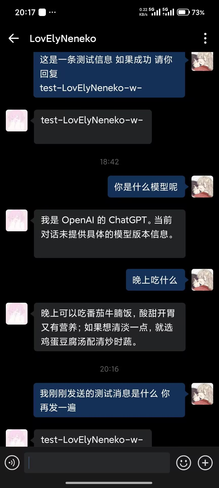

<div align="center">
  <h1>tRPC Agent Service</h1>
  <p>面向生产落地的多租户、节点化 Agent 部署平台</p>

  <p>
    <a href="https://github.com/XnLemon/trpc-agent-service/actions/workflows/ci.yml"></a>
    <a href="https://github.com/XnLemon/trpc-agent-service/actions/workflows/docs.yml"></a>
    <a href="https://codecov.io/gh/XnLemon/trpc-agent-service"></a>
    <a href="https://github.com/XnLemon/trpc-agent-service/actions/workflows/publish-image.yml"></a>
  </p>
</div>

**tRPC Agent Service** 将 [tRPC-Agent-Go](https://github.com/trpc-group/trpc-agent-go) 的 Agent、Runner、Tool 和 Session 能力装配成一个可部署的平台服务。它把租户、Agent 应用、模型、数据后端和 IM 通道纳入同一套受控配置，并通过版本化执行快照、共享运行时状态、幂等和可观测性支撑多节点运行。

它适合希望把单个 Agent 原型演进为团队或企业服务的场景：对话 API、企业微信/Telegram 接入、按租户的配置与审计，以及 Docker Compose 和 Kubernetes 部署都由同一套平台边界承载。

## 为什么使用它

- **多租户控制面**：Tenant、Agent App、Revision、Model Profile、Backend Profile 和 Channel Binding 均有明确的租户边界、版本和状态迁移规则。
- **无状态 Agent Worker**：Gateway 负责鉴权、路由、限流、幂等和执行计划；Worker 使用共享 Session/Event/Outbox 状态，可以独立扩展和恢复。
- **安全的配置链路**：控制面只保存无密钥配置和 `secret_ref`；模型密钥、IM 凭据和数据库连接信息在受控 resolver 边界注入，不进入快照、日志或 trace。
- **可演进的运行时**：Model/Backend/Channel 使用 provider registry 和 capability adapter，配置发布、回滚、灰度和缓存失效保持可审计。
- **服务化入口**：提供普通 `/v1/chat`、SSE `/v1/chat/stream`、Admin API、健康检查和 readiness；企业微信与 Telegram 适配器复用同一 Gateway 执行链路。
- **可观测与可运维**：贯穿请求、模型、工具、存储和回复投递的 trace、metrics、结构化日志、Outbox 重试和死信边界。

## 架构总览

控制面管理“允许执行什么”，数据面处理“现在执行什么”。一次请求在建立可信租户主体后，加载不可变的 `ExecutionPlan`，再交给 Runner/Agent/Tool 和租户作用域的存储能力。


```text
Admin API -> SQL Control Plane -> Registry / Cache -> Execution Plan
                                                     |
IM / HTTP -> Channel Adapter -> Gateway -> Queue/Outbox -> Agent Worker
                                                     |
                                    Runner -> Model / Tool / Guardrail
                                                     |
                         Session / Event / Memory / Knowledge / Artifact / Audit
```

详细的组件职责、可信路由和消息时序见[生产架构设计](docs/docs/architecture.md)。

## 当前能力

当前仓库已经完成并持续由代码测试、部署清单或 E2E workflow 覆盖的能力包括：

- PostgreSQL 控制面、migration、显式 `init` 初始化和受认证的 Admin API；
- Tenant/App/Revision 的草稿、发布、回滚、灰度候选和乐观锁；
- OpenAI 模型 provider，以及不访问外部服务的 deterministic fake provider；
- InMemory、PostgreSQL 与 tenant-scoped Redis runtime storage；Redis 当前覆盖 Session/Event、Memory、Reply Outbox 和租约恢复；
- 普通及流式 HTTP Chat API，企业微信自建应用文本 webhook，Telegram 文本 long polling；
- Telegram webhook、媒体/富事件 fallback、WeCom 多账号/群聊/回执对账、WeChat provider boundary 和原生图片/文档回复；
- OpenTelemetry trace/metrics、Prometheus/Grafana 配置、跨 Outbox traceparent、审计事件和脱敏错误；
- Outbox worker、重试/DLQ、lease recovery、fencing、分段回复恢复和取消安全；
- Docker Compose 本地验证、Kubernetes Kustomize base、部署清单预检和版本 tag 触发的 GHCR 镜像发布；
- 常规 CI 的 format/lint、secret scan、构建、覆盖率、PostgreSQL/MySQL live smoke、race、部署 golden path 和文档构建；
- 独立的故障注入 E2E、Telegram live E2E 和 WeCom deterministic callback E2E。

## 真实渠道接入

以下截图记录了服务通过同一 Gateway 执行链路完成的端到端 IM 对话验证。

**图 1：Telegram 实际接入（文本 long polling）**

<p align="center">
  
</p>

**图 2：企业微信实际接入（自建应用文本 webhook）**

<p align="center">
  
</p>

**图 3：企业微信 AI Bot 实际接入（WebSocket 长连接）**

<p align="center">
  
</p>

## 前端多租户渠道验收

下面的步骤验证两个租户分别使用各自 Agent，通过 Telegram 和企业微信 AI Bot 完成真实会话。完整的命令、日志证据和故障排查见[多租户多 Agent Telegram / WeCom 验收链路](docs/docs/multitenant-telegram-acceptance.md)。

### Telegram

1. 使用 `deploy/service.env` 启动服务，并确认 `http://localhost:8080/readyz` 返回 `ready`。
2. 打开 `http://localhost:8080`，以管理员账号登录，选择目标租户并确认 Agent 已发布且为 active。
3. 选择 **Telegram**，填写 BotFather 提供的 Bot ID 和 Bot Token，点击 **Connect channel**。
4. 页面显示 `Your agent is connected` 后，打开 Telegram 向该 Bot 发送唯一 marker，例如 `tenant-a-session-001`。
5. 确认 Bot 回复，并检查服务日志中的 `tenant_id`、`app_id` 与所选租户/Agent 一致。
6. 切换到第二个租户，使用第二个 Telegram Bot 重复步骤 2–5；确认两边的消息和会话不会串用。

### WeCom AI Bot

1. 在 WebUI 选择已配置并发布 Agent 的租户，选择 **WeCom** channel。
2. 填写企业微信 **AI Bot ID** 和同一个 Bot 的 **AI Bot Secret**，点击 **Connect channel**。
3. 不要填写 Corp ID、Agent ID、应用 Secret、回调 Token 或 EncodingAESKey；此入口使用 `wss://openws.work.weixin.qq.com` AI Bot 长连接。
4. 页面显示 `Your agent is connected` 后，打开企业微信客户端找到该 AI Bot，发送唯一 marker，例如 `wecom-tenant-b-session-001`。
5. 确认 Bot 在同一会话回复，并检查日志中的认证状态、`tenant_id`、`app_id` 与所选租户/Agent 一致。
6. 为第二个租户连接它自己的 AI Bot，重复步骤 1–5，确认两个租户的会话和 Agent 行为保持隔离。

服务重启会清除进程内保存的 Telegram/AI Bot Secret；重启后需在前端重新连接对应 Bot，再发送新 marker 验收。

## 快速开始：离线 Golden Path

该路径使用 PostgreSQL、fake model 和固定响应验证从空数据库到第一条对话，不需要 OpenAI、IM 或 Secret Manager 凭据。

```bash
git clone https://github.com/XnLemon/trpc-agent-service.git
cd trpc-agent-service

./scripts/quickstart.sh --demo
```

脚本会构建镜像、启动 PostgreSQL、幂等创建 Tenant/App/Model/Backend/Revision，等待 `/healthz` 和 `/readyz`，然后实际调用 `/v1/chat`。成功响应为：

```json
{
  "text": "Hello from the tRPC Agent Service demo.",
  "status": "complete",
  "done": true
}
```

发送一条自己的请求：

```bash
body='{"content":"hello from the local golden path","external_user_id":"quickstart-user","conversation_kind":"direct","external_peer_id":"quickstart"}'
api_token="${TRPC_API_TOKEN:-local-api-token}"

curl -i \
  -H "Authorization: Bearer ${api_token}" \
  -H 'Content-Type: application/json' \
  --data "$body" \
  http://127.0.0.1:8080/v1/chat
```

Windows/WSL、Docker 清理和完整验证说明见[部署、配置与快速开始](docs/docs/deployment.md)。

## 最小可用配置流程

下面的配置只使用 PostgreSQL 和确定性 fake model，适合第一次启动、接口联调和部署检查，
不需要外部 IM 或 Secret Manager：

```bash
cp deploy/example.env deploy/service.env
./scripts/quickstart.sh --demo deploy/service.env
```

成功标准是 Compose 服务通过 `/healthz` 和 `/readyz`，并由脚本完成一条真实的
`POST /v1/chat`，返回 `Hello from the tRPC Agent Service demo.`。服务运行后可以手动检查：

```bash
curl --fail http://127.0.0.1:8080/healthz
curl --fail http://127.0.0.1:8080/readyz
api_token="$(awk -F= '$1 == "TRPC_API_TOKEN" {sub(/^[^=]*=/, ""); sub(/\r$/, ""); print; exit}' deploy/service.env)"
curl --fail \
  -H "Authorization: Bearer ${api_token:-local-api-token}" \
  -H 'Content-Type: application/json' \
  --data '{"content":"hello","external_user_id":"quickstart-user","conversation_kind":"direct","external_peer_id":"quickstart"}' \
  http://127.0.0.1:8080/v1/chat
```

停止并清理本地服务：

```bash
docker compose --env-file deploy/service.env -f deploy/docker-compose.yml down
```

使用真实模型时，保留同一 Compose 配置，将 `TRPC_MODEL_PROVIDER`、
`TRPC_MODEL_API_KEY`、`TRPC_MODEL_NAMES` 和 `TRPC_MODEL_ENDPOINT_HOSTS` 换成真实值，
先执行 `trpc-service init --confirm` 创建首个 Tenant/App，再通过 Admin API 创建并发布
Model Profile、Backend Profile 和 Revision，最后以非 demo 模式启动服务。

## 真实模型与生产部署

真实部署遵循“显式初始化 → Admin API 配置 → 发布 Revision → 正常启动”的顺序：

1. 准备 PostgreSQL、模型 provider、API/Admin token 和 Secret 管理方案；
2. 使用 `trpc-service init --confirm` 创建首个 Tenant 和 draft App；
3. 通过 Admin API 创建 Model Profile、Backend Profile 和 Agent Revision，并发布 Revision；
4. 将生成的 Tenant/App ID 和运行时凭据注入服务，启动非 demo 模式；
5. 通过 `/readyz`、普通 API 和审计/metrics 验证服务。

准备好 Secret、已发布的镜像 tag/digest 和 Kubernetes overlay 后：

```bash
# 生产镜像由版本 tag 触发 .github/workflows/publish-image.yml 发布到 GHCR。
# Kubernetes 部署使用已发布的 tag 或 digest，不要使用本地 CI 镜像名。
kubectl apply -k deploy/kubernetes
```

从零配置、Secret 约束、Kubernetes overlay 和 Admin API 字段见[部署文档](docs/docs/deployment.md)与[首次运行初始化](docs/docs/issue-67-first-run-init.md)。

## 可观测性

运行时 dashboard、trace 和 metrics 示例位于 `docs/docs/assets/issue-88/`：

| Metrics | Runtime dashboard | Trace |
| --- | --- | --- |
|  |  |  |

这些截图对应[生产可观测性文档](docs/docs/issue-79-observability.md)和 [Prometheus 说明](docs/docs/issue-88-prometheus.md)。

## 项目结构

```text
cmd/trpc-service/       CLI：init、demo 和服务进程
trpcservice/bootstrap/  数据库、provider、runtime 和 HTTP 装配
trpcservice/tenant/     多租户模型与 repository
trpcservice/agent/      tRPC-Agent-Go Agent/Runner 组装、调用与事件适配
trpcservice/model/      Model Profile 与无密钥执行契约
trpcservice/backend/    Backend Profile 与无密钥能力契约
trpcservice/gateway/    鉴权、路由、Dispatch、HTTP/SSE
trpcservice/channels/   Telegram、企业微信 Channel Adapter
trpcservice/runtime/    Execution Plan、调度、lease、执行协调、Queue、Outbox、Storage
trpcservice/runtime/model/  Secret/Model 运行时物化适配器与 Provider Registry
trpcservice/runtime/storage/factory/  Storage capability 物化与 Provider Registry
trpcservice/runtime/runner/  通用 Runner Registry、lease、失效与关闭
trpcservice/admin/      Admin API 与管理员认证
migrations/             PostgreSQL/MySQL schema 与 migration
deploy/                 Compose、Kubernetes、OTel/Prometheus 配置
examples/               fault-injection、Telegram、WeCom E2E
docs/                   架构、协议、运维和验收文档
```

## 开发与验证

需要 Go 1.21 或更高版本。常用本地检查：

```bash
go test ./... -count=1
go test -race ./... -count=1
go vet ./...
go build ./...
python -m mkdocs build --strict -f docs/mkdocs.yml
```

CI 在 push/PR 时执行格式、静态检查、测试、覆盖率、race 和部署 smoke test；故障注入、Telegram live E2E、WeCom E2E 和文档构建有独立 workflow。提交代码前请阅读 [CONTRIBUTING.md](CONTRIBUTING.md)。

## 文档导航

- [生产架构设计](docs/docs/architecture.md)：控制面、数据面、可信路由、执行计划和恢复模型
- [部署、配置与快速开始](docs/docs/deployment.md)：Compose、Kubernetes、环境变量和 GHCR 镜像
- [首次运行初始化](docs/docs/issue-67-first-run-init.md)：`trpc-service init` 与幂等边界
- [Gateway、Execution Plan 与 HTTP/SSE](docs/docs/gateway.md)：请求契约、鉴权、限流和流式响应
- [多租户多 Agent Telegram / WeCom 验收链路](docs/docs/multitenant-telegram-acceptance.md)：前端配置、双渠道连接、真实会话验证和故障排查
- [PostgreSQL 控制面与启动装配](docs/docs/postgresql-control-plane.md)：migration、repository 和 bootstrap
- [原始任务书](docs/docs/project-brief.md)：项目最初的背景、要求、交付物和验收标准
- [完整文档站](https://xnlemon.github.io/trpc-agent-service/)
