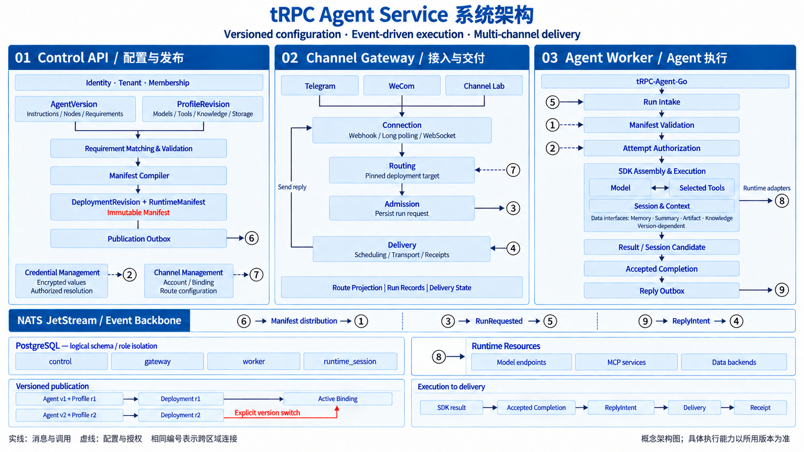
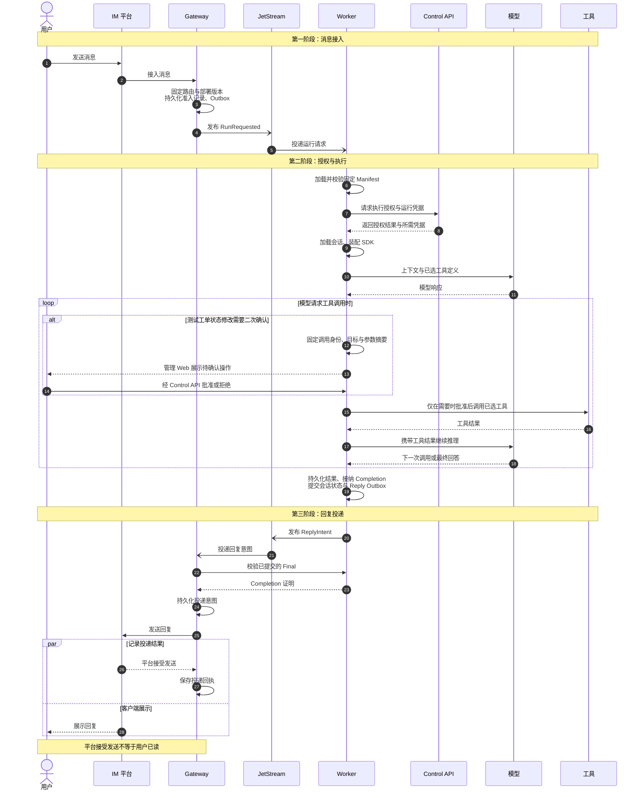

# tRPC Agent Service

**把 Agent 从一份定义，变成可配置、可发布、可在聊天渠道中使用的服务。**

面向自托管场景的多租户 Agent 服务平台，基于 Go 与 tRPC-Agent-Go 构建执行服务，
使用 Next.js 提供管理控制台和独立文档站。你可以在 Web 中定义 Agent、配置模型与运行资源、
发布固定版本，再通过 Telegram、企业微信或本地 Channel Lab 与它交互。

[开始使用](docs/user-guide/v1/README.md) · [部署平台](deploy/compose/MANAGED_LOCAL.md) · [用户参考](docs/site/README.md) · [架构设计](docs/architecture-next/README.md) · [API 契约](api/README.md)

> **项目状态**：处于持续开发中的 V1。本文是项目入口，不是稳定性承诺或某个部署实例的健康报告。
> 配置字段、执行能力与迁移要求以所使用提交的代码、契约及部署文档为准。

## 为什么使用它

将一个 Agent 接到真实用户面前，不只需要调用模型，还需要管理配置、凭据、版本、会话和消息渠道。
tRPC Agent Service 把这些环节组织成一条明确的发布与运行流程：

- **在控制台管理，而不只在脚本里运行**：提供账号、租户、成员、Agent、运行配置、部署和渠道页面。
- **把行为与资源分开**：Agent 声明要做什么，Runtime Profile 配置模型、工具、知识资源和存储。
- **固定版本，显式升级**：Deployment 绑定已发布的 AgentVersion 与 ProfileRevision，生成不可变运行快照。
- **让同一个 Agent 接入不同渠道**：由 Channel Account 管理机器人接入，由 Channel Binding 指向明确的部署版本。
- **先在本地验证消息链路**：Channel Lab 提供 Telegram 风格的本地模拟服务和聊天界面，不必先准备公网 Webhook。
- **保留清晰的服务边界**：管理、执行和渠道交付分别由独立 Go 服务负责，通过版本化契约协作。

适合希望自托管 Agent 服务、为团队管理多个 Agent，或研究 Agent 从配置到执行全过程的使用者与开发者。

## 核心能力

| 能力 | 你可以做什么 |
| --- | --- |
| 身份与多租户 | 登录、管理平台用户与租户、维护 OWNER / MEMBER 成员关系 |
| Agent 编辑与版本 | 编辑 AgentSpec、声明资源需求、保存 Draft、校验并发布不可变版本 |
| Runtime Profile | 配置模型及运行资源，单独管理凭据，发布可复用的资源配置版本 |
| Deployment | 选择 Agent 和 Profile 的明确版本，完成匹配、校验、编译与发布 |
| Channel 管理 | 配置 Telegram / 企业微信账号，进行接入预检，管理接入与消息路由 |
| Worker 执行 | 消费运行请求，使用固定 Manifest 执行 Agent，持久化会话与执行结果并生成回复意图 |
| 普通 MCP 工具 | 配置 Streamable HTTP 服务及明确选中的工具，按节点需求匹配并调用 |
| 危险工具二次确认 | 对测试工单状态修改固定目标和参数摘要，由租户 OWNER 在管理 Web 批准或拒绝 |
| 多 Agent 编排 | 使用 Sequence、有显式汇总的 Parallel、固定轮数 Loop 组合 LLM 节点 |
| 会话与数据能力 | 显式配置 Session Summary、PostgreSQL / Redis Memory、S3 Artifact 与 Qdrant Knowledge |
| 本地全栈启动 | 用统一入口启动管理、执行、渠道服务及 PG / NATS / Redis / Qdrant / MinIO |
| 本地联调 | 使用 Channel Lab 验证消息收发；可选确定性 Echo 模型或接入实际模型 |
| 独立文档站 | 阅读图文教程和主题参考，可静态部署，并从控制台“帮助文档”跳转 |

**资源能填写，不等于当前 Worker 已支持执行。** 新能力需要同时具备 Agent 声明、Profile 配置、
Deployment 编译和 Worker 实现。不要仅根据编辑器选项判断某个组合已经可用；具体边界参见
[Worker 实施状态](docs/architecture-next/agent-worker/implementation-status.md)。

当前已交付的数据能力、普通工具及编排的验证范围见
[编排与组合验收记录](docs/architecture-next/agent-worker/orchestration-acceptance-v1.md)。
Knowledge 的外部 Embedding 配置与语义检索验收仍需单独完成；Loop 的真实模型输出要求
仍有未通过记录。确定性模型、本地 Lab 和真实 IM 的结果分别记录，不概括为所有组合均已验收。

## 工作原理

[](docs/assets/readme/system-architecture-research-v1.png)

*点击图片查看大图。实线表示消息与调用，虚线表示配置与授权，相同编号表示跨区域连接。
这是概念图，不是完整数据库或部署清单；当前本地全栈还包含 Memory schema 和独立数据后端，
具体布局见 [Managed Local V1](deploy/compose/MANAGED_LOCAL.md)。*

### 从定义到发布

```text
Agent Draft                     Runtime Profile Draft
    │ 定义行为与资源需求             │ 配置模型、资源与凭据
    ▼                               ▼
AgentVersion                    ProfileRevision
    └──────────────┬────────────────┘
                   │ 同类别、同名资源匹配与服务端校验
                   ▼
          DeploymentRevision
          + RuntimeManifest
                   │ 绑定明确的发布版本
                   ▼
             Channel Binding
```

- **Agent** 回答“如何工作”；**Runtime Profile** 回答“使用哪些资源”。
- **Deployment** 固定两者的已发布版本，不自动追随最新 Draft 或最新版本。
- **Channel Account** 管理机器人身份与接入；**Channel Binding** 管理消息送往哪个部署。
- 编辑、发布新版本与切换线上目标是不同操作。升级或回退时，需要明确选择目标版本。

### 从消息到回复



Control API 负责管理与发布，以及向运行服务提供授权后的配置与凭据。
Web 控制台只连接 Control API；文档站不依赖管理 API、登录会话或运行数据库。

| 组件 | 职责 | 入口 |
| --- | --- | --- |
| Control API | 身份、租户、Agent、Profile、Deployment、Channel 管理与发布 | [服务文档](services/control-api/README.md) |
| Channel Gateway | 机器人连接、消息路由、运行准入与回复交付 | [模块说明](docs/architecture-next/channel-gateway/module-introduction.md) |
| Agent Worker | Manifest 消费、Agent 执行、会话与结果持久化 | [服务文档](services/agent-worker/README.md) |
| Web Console | 面向使用者的管理界面 | [前端说明](web/README.md) |
| Documentation Site | 项目主页、教程与参考文档的静态站点 | [站点说明](site/README.md) |
| Channel Lab | 本地 Telegram 风格模拟服务与聊天界面 | [使用说明](tools/channel-lab/README.md) |

## 快速开始

按你的目标选择入口；**预览文档或启动 Channel Lab 不需要先部署整个平台**。

### 1. 已有平台账号：发布自己的 Agent

1. 登录控制台并选择租户。
2. 创建 Agent，填写指令，声明模型与所需资源槽位；校验并发布 Agent Version。
3. 创建 Runtime Profile，配置与槽位同名的资源及必要凭据；校验并发布 Profile Revision。
4. 创建 Deployment，选择上述两个已发布版本，校验并发布。
5. 创建渠道账号，配置 Telegram 或企业微信，完成接入预检。
6. 将 Channel Binding 指向明确的 Deployment Revision，启用接入与消息路由。
7. 发送消息，确认收到真实回复；再发送第二轮消息，检查需要的会话连续性。

完整逐页教程见 [V1 部署与使用指南](docs/user-guide/v1/README.md)。
Telegram 可选择长轮询，接收消息不要求公网回调地址，但仍需服务能够访问 Telegram。

### 2. 本地预览主页与文档

准备 Git、Node.js 和 npm。前端依赖版本以各工程的 `package.json` 与锁文件为准。

```bash
git clone https://github.com/JFSAS/trpc-agent-service.git
cd trpc-agent-service

npm --prefix site ci
npm --prefix site run dev -- --hostname 127.0.0.1 --port 13642
```

浏览器打开 `http://127.0.0.1:13642`。这是独立文档站，不会启动后端或修改业务数据。

### 3. 本地体验 Channel Lab

准备 Docker 与 Docker Compose，从仓库根目录执行：

```bash
docker compose -p channel-lab-dev \
  -f deploy/compose/compose.channel-lab.yaml \
  --profile testing up -d --build
```

浏览器打开 `http://127.0.0.1:18090`，创建测试 Bot、选择用户并发送消息。
**单独启动 Lab 不会生成 Agent 回复**；需要按 [Channel Lab 指南](tools/channel-lab/README.md)
连接 Gateway、Worker 和已发布的部署。Lab 验收与真实 Telegram / 企业微信验收应分别记录。

### 4. 一键启动评审演示（`just demo`）

演示环境用一条命令拉起整条链路：管理控制台、Control API、Agent Worker（含工作区沙箱）、
Channel Gateway、Channel Lab 模拟 IM，以及 PostgreSQL、NATS、Redis、Qdrant、MinIO 数据后端。
它自带一个租户、一个已发布的 Agent 和一个已启用的模拟 IM 绑定，适合评审者和首次接触项目的人
直接验证"发消息 → 执行 → 回复"。

前置工具：

- Docker Engine 或 OrbStack，以及支持 `!reset` 的 Docker Compose v2；
- Go 1.25+（以 `go.mod` 指定的工具链为准）、Python 3.11+、OpenSSL；
- [`just`](https://github.com/casey/just)：macOS 用 `brew install just`，装有 Rust 工具链时也可
  `cargo install just`，其他平台参考其 README 的安装方式。

从仓库根目录执行：

```bash
just demo                 # 构建镜像、启动全栈并播种演示数据；保留已有数据与命名卷
just demo --skip-build    # 已构建过镜像时，直接重启并复用镜像
just demo-status          # 复检容器状态与 HTTP 就绪探针
just demo-stop            # 停止演示栈，保留私有 state 与命名卷
just demo-reset           # 销毁容器、数据卷与私有 state，再构建并播种一个全新环境
```

启动成功后终端会打印访问入口与账号，密码按环境随机生成：

- **管理控制台**：`http://127.0.0.1:24000`；
- **模拟 IM（Channel Lab）**：`http://127.0.0.1:18090`；
- **Gateway 管理**：`http://127.0.0.1:29091`；
- **租户账号**：`demo-owner`（评审建议使用），**平台管理员**：`managed-admin`；
- **凭据文件**：`~/.local/share/trpc-agent-service/managed-review/review-credentials.json`。

演示环境提供的内容：

- 一个租户及其 OWNER 账号，一个用于平台管理的管理员账号；
- 一个已发布的 Agent（Demo Assistant）+ Runtime Profile + Deployment Revision，
  默认指向 Channel Lab 的确定性模型 `lab-echo`，不需要任何外部密钥；
- 一个已启用的 Channel Lab Bot 与指向该 Deployment Revision 的 Channel Binding；
- 支持 `workspace_exec`、`workspace_save_artifact` 的 Worker 沙箱，以及 PostgreSQL / Redis Memory、
  S3 Artifact、Qdrant Knowledge 和会话摘要等已交付的数据能力；
- 独立的数据后端与私有证书，全部运行在本机并只监听回环地址。

验证一条消息：用 `demo-owner` 登录控制台，打开 Channel Lab 选择 Demo Lab Bot 发送消息，
消息会经 Channel Gateway 进入 Agent Worker 执行，再把回复写回 Lab。

### 5. 替换为真实模型与真实 IM 发布

演示环境默认使用本地确定性模型和模拟 IM。要换成真实 API Key 与真实渠道，建议按下面顺序操作；
凭据只通过控制台写入，不要写进仓库文件或脚本。

**真实模型（Runtime Profile）**

1. 编辑 Runtime Profile 的 Draft，把 `models.primary` 的 `base_url` 与 `model` 改成真实的
   OpenAI 兼容服务；
2. 在对应凭据项写入 API Key，凭据为只写字段，服务端加密存储，读取接口不返回明文；
3. 校验并发布新的 Profile Revision；
4. 选择原有 Agent Version 与新的 Profile Revision，发布新的 Deployment Revision，再把
   Channel Binding 指向该 Revision。

同一平台契约下发布新 Revision 不需要重启 Worker，Binding 切换后新消息即按新版本执行；
历史 Revision 不会被改写，可以随时把 Binding 切回旧版本。

也可以在播种时直接使用真实模型（只影响 `just demo-reset` 之后新建的环境）：

```bash
DEMO_MODEL_BASE_URL=https://api.deepseek.com \
DEMO_MODEL_NAME=deepseek-v4-pro \
DEMO_MODEL_API_KEY=... \
just demo-reset
```

**真实 IM**

- **Telegram**：向 @BotFather 创建 Bot 并取得 Bot Token；在控制台创建 Telegram 渠道账号，
  接收方式选长轮询（不需要公网回调地址），写入 Token；运行接入预检，启用账号与 Binding，
  然后在 Telegram 里给 Bot 发送消息。
- **企业微信（智能机器人长连接）**：在企业微信管理后台的智能机器人页面取得 Bot ID 与 Secret；
  在控制台创建企业微信账号，填写 Bot ID 和 `wecom.bot_secret`；**先停用账号**，再运行"预检"
  并勾选允许连接探测；预检通过后启用账号并把 Binding 指向目标 Deployment Revision。
  预检会对同一个机器人发起一次真实订阅，可能替换该机器人已有的连接，确认影响后再执行；
  Secret 通常只显示一次，重置后必须同步更新，且不要把它填成 Bot ID（会被判定
  `WECOM_AUTH_REJECTED`）。长连接模式同样不需要公网回调地址。

**安全提示**

- 渠道与模型凭据通过控制台写入并加密存储，读取接口不返回明文；
- 不要提交 `.env`、真实 Token、API Key、私钥或业务数据，也不要复制
  `~/.local/share/trpc-agent-service/` 下的 state、证书或凭据文件进仓库。

### 6. 自行部署完整平台

演示环境适合评审和本地联调；长期使用请走托管本地全栈，它使用独立的 Compose 项目与配置目录。
前置工具与上面的 `just`、Docker、Go、Python、OpenSSL 相同。从仓库根目录执行：

```bash
just managed-up
```

`just managed-up` 首次执行会构建镜像、生成独立配置与内部证书，并启动 **Web、Control、Worker、Gateway、
PostgreSQL、NATS、Redis、Qdrant、MinIO**。无需额外 profile，也不需要单独启动 Web。
Go 服务在宿主构建，Web 在镜像构建阶段安装依赖并完成构建。

- **管理控制台**：`http://127.0.0.1:23000`，未登录时进入登录页面。
- **默认 Compose 项目**：`trpc-agent-managed-local`，使用自己的网络与持久卷。
- **配置目录**：`~/.local/share/trpc-agent-service/managed-local`，位于仓库之外。
- **首次登录**：用户名见配置目录的 `metadata.json`，初始密码见
  `secrets/bootstrap_password`；首次登录按提示修改密码，之后使用修改后的密码。

启动成功只表示平台基础设施就绪。**聊天模型、Embedding 和 Telegram / 企业微信等渠道
仍需你显式配置**；启动脚本不会替你创建 Agent、发布 Deployment 或接管现有机器人。
文档站与 Channel Lab 是前面单独说明的入口，不在此默认服务组合中。

先登录并创建租户。对于尚未发布业务的独立新环境，需要使用托管数据后端时，
用控制台中的实际 Tenant ID 授权目录访问：

```bash
just managed-grant ACTUAL_TENANT_ID
```

该操作更新静态后端目录与发布契约，并重启 Control、Worker；**不要直接对已承载业务的
环境套用**。Knowledge 还需按实际 Embedding 配置维度、Collection 等参数，具体选项与
首次初始化顺序见 [Managed Local V1](deploy/compose/MANAGED_LOCAL.md)。
完成授权后，在 Profile 中选择后端并填写相应用途的凭据，再按前面的发布流程配置 Agent。

常用维护命令：

```bash
just managed-config                 # 校验配置，不输出展开后的秘密
just managed-status                 # 查看服务状态
just managed-stop                   # 停止服务，保留容器和持久卷
just managed-restart-backends       # 同卷重启 PostgreSQL/Redis/Qdrant/MinIO
just managed-up --skip-build        # 已完成首次构建时，复用镜像与配置启动
```

请保留配置目录和持久卷，不通过删除配置目录来“重置”已有数据库的身份与密码。
端口调整、独立项目、后端授权、外部服务配置及同卷重启检查，见
[完整本地全栈指南](deploy/compose/MANAGED_LOCAL.md)。
手动组合 Compose、内部通信和数据库迁移的进阶说明分别见
[Worker V1 部署](deploy/compose/WORKER_V1.md) 与
[数据库部署与迁移](docs/architecture-next/operations/database-v1.md)。

## 文档导航

### 面向使用者

| 我想…… | 阅读 |
| --- | --- |
| 从头部署并使用一个 Agent | [完整图文教程](docs/user-guide/v1/README.md) |
| 离线阅读或打印教程 | [独立 HTML 指南](docs/user-guide/v1/部署与使用指南.html) |
| 理解 Agent、Profile、Deployment 与 Channel | [核心概念](docs/site/concepts.md) |
| 编辑 Agent、管理版本 | [Agent 与版本](docs/site/agent.md) |
| 配置模型、资源与凭据 | [运行配置与资源](docs/site/runtime-profile.md) |
| 发布、升级和回退 | [部署与生命周期](docs/site/deployment.md) |
| 接入 Telegram 或企业微信 | [渠道接入](docs/site/channels.md) |
| 管理用户、租户和权限 | [账号与权限](docs/site/administration.md) |

### 面向开发者与部署维护者

- [文档总索引](docs/README.md) · [架构入口](docs/architecture-next/README.md) · [架构约束](docs/architecture-next/constraints.md)
- [API 与协议入口](api/README.md)：OpenAPI、JSON Schema、事件与运行时协议。
- [一键本地全栈](deploy/compose/MANAGED_LOCAL.md) · [Compose 配置](deploy/compose/README.md) · [完整 Worker 部署](deploy/compose/WORKER_V1.md)
- [数据库隔离与迁移](docs/architecture-next/operations/database-v1.md) · [运行追踪](deploy/compose/TRACING_V1.md)
- [站点构建与 GitHub Pages](site/README.md)：用户文档独立构建，管理 Web 通过 `DOCS_SITE_URL` 跳转。

网站只发布 `docs/site/` 的六篇用户参考和 `docs/user-guide/v1/` 的教程，
不会自动发布 `docs/architecture-next/` 的内部设计与历史验收记录。

## 仓库结构

```text
.
├── services/
│   ├── control-api/         # 管理、授权、发布与配置供应
│   ├── channel-gateway/     # 接入、路由、准入与消息交付
│   └── agent-worker/        # Agent 执行、会话、结果与回复意图
├── web/                    # Next.js 管理控制台
├── site/                   # 独立主页与文档站，静态导出
├── api/                    # OpenAPI、Schema、事件与运行时契约
├── gen/                    # 协议生成代码
├── platform/               # 公共协议与基础能力
├── deploy/                 # Compose、服务部署及基础设施配置
├── tools/channel-lab/       # 本地消息联调环境
├── scripts/                # 构建辅助、迁移与验收脚本
├── tests/                  # 跨模块测试
├── docs/
│   ├── architecture-next/  # 领域设计、实施说明与架构决策
│   ├── site/               # 网站参考文档的 Markdown 源文件
│   └── user-guide/v1/      # 完整教程、插图及离线 HTML
├── .env.example            # 环境配置模板
├── go.mod                  # 根 Go Module 与工具链版本
└── justfile                # 常用开发与验证命令
```

## 开发与验证

以下命令从仓库根目录运行。Go 命令使用 `go.mod` 指定的工具链；Web 和文档站分别安装依赖。

```bash
# Go 单元测试与静态检查
go test ./...
go vet ./services/... ./api/... ./platform/...

# 管理控制台
npm --prefix web ci
npm --prefix web run lint
npm --prefix web test -- --maxWorkers=2
npm --prefix web run build

# 文档站：内容生成、测试、静态构建与链接检查
npm --prefix site ci
npm --prefix site test
npm --prefix site run build
npm --prefix site run verify

# Channel Lab
python3 -m unittest discover -s tools/channel-lab/tests -v
```

也可安装 `just`，运行 `just --list` 查看快捷入口。
需要数据库、消息队列或外部账号的集成测试应按各服务文档准备环境；普通测试中的跳过项不算完成集成验收。

修改文档正文后运行 `npm --prefix site run docs:sync`。该命令同时更新在线页面和离线 HTML；
若新增网站主题，还需登记生成列表和导航。详见 [文档维护](docs/site/README.md)。

## 参与贡献

欢迎通过 [Issues](https://github.com/JFSAS/trpc-agent-service/issues) 反馈问题、提出改进，
或提交 [Pull Request](https://github.com/JFSAS/trpc-agent-service/pulls)。

- **报告问题**：附上提交 SHA、复现步骤、预期与实际结果，以及去除凭据的必要日志。
- **提交改动**：先阅读对应模块文档，尽量保持一个 PR 解决一个明确问题，并补充相关测试。
- **涉及接口或配置**：同步更新 OpenAPI / Schema、消费端和使用说明，不只修改表单或单侧实现。
- **涉及运行能力**：说明验证覆盖到了配置、发布、执行还是实际渠道回复，区分模拟服务和外部服务结果。
- **提交信息**：使用 `feat(scope): ...`、`fix(scope): ...`、`docs(scope): ...` 等格式。

数据库迁移、凭据和通信配置是部署的一部分。请勿将本地 `.env`、真实 Token、私钥或业务数据提交到仓库。

## 许可证

当前仓库根目录尚未包含 `LICENSE` 文件，项目的授权条款仍待明确。
本文不将依赖项目的许可证视为本项目的许可证；正式分发或复用前，请先确认项目授权条款。
