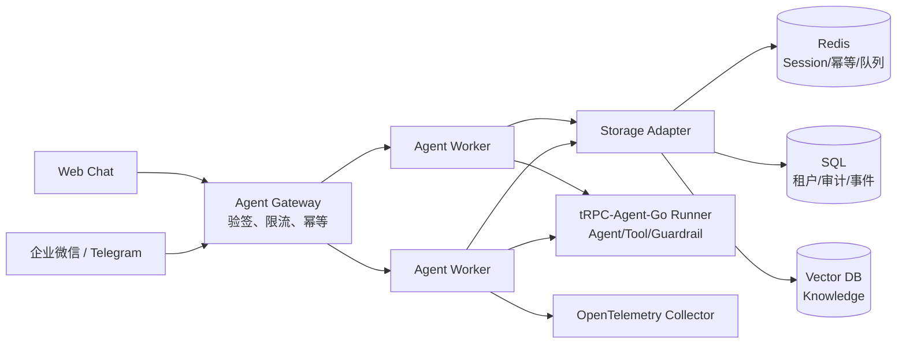
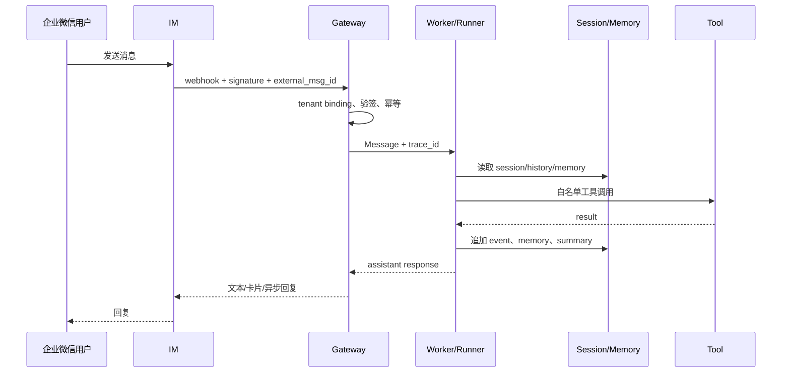

# 多租户 Agent 平台落地设计

## 1. 当前实现与边界

服务当前提供一个可运行的 Go HTTP 服务：`/healthz`、`POST /api/tenants`、`POST /api/chat`，以及 `POST /webhook/{channel}/{tenant_id}`。入口支持 `web`、`wecom` 和 `telegram`，统一转换为 `platform.Message`，由无状态 `platform.Runner` 执行。默认 `EchoResponder` 仅用于本地联调，生产环境必须替换为 tRPC-Agent-Go Runner 或模型服务 Responder。

当前 `MemoryStore` 是开发后端。`Store` 接口是 Worker 的状态边界，生产实现应使用 Redis 或 SQL；`VectorStore` 用于知识检索。服务不把会话状态放在 goroutine 或进程全局，因此 Worker 可以水平扩展，但生产仍需共享存储和租户级限流。

## 2. 拓扑



Gateway 只负责身份识别、验签、消息大小限制、重试和路由；Worker 负责 Runner 生命周期；Adapter 负责外部消息协议；Storage Adapter 按租户配置选择 Redis、SQL 和向量库。Session ID 为 `sha256(tenant_id|channel|chat_id-or-user_id)`，同一个租户内群聊和单聊天然分离，跨租户永不复用。

## 3. 数据模型

生产 SQL 至少需要以下表（所有业务主键均带 tenant_id）：

```sql
create table tenant (tenant_id varchar(64) primary key, name varchar(200) not null,
  config_json text not null, backend_json text not null, version bigint not null,
  created_at timestamp not null, updated_at timestamp not null);
create table agent_app (tenant_id varchar(64), app_id varchar(64), name varchar(200),
  model_json text not null, tool_allowlist_json text not null, status varchar(20),
  primary key (tenant_id, app_id));
create table channel_binding (tenant_id varchar(64), channel varchar(32), binding_id varchar(128),
  secret_ref varchar(256) not null, enabled boolean not null, primary key (tenant_id, channel, binding_id));
create table session (tenant_id varchar(64), session_id varchar(128), channel varchar(32),
  external_chat_id varchar(256), version bigint not null, summary text, updated_at timestamp not null,
  primary key (tenant_id, session_id));
create table message_event (tenant_id varchar(64), event_id varchar(256), session_id varchar(128),
  sequence bigint not null, role varchar(20), payload_json text not null, created_at timestamp not null,
  primary key (tenant_id, event_id), unique (tenant_id, session_id, sequence));
create table memory (tenant_id varchar(64), memory_id varchar(128), content text not null,
  embedding_ref varchar(256), version bigint not null, updated_at timestamp not null,
  primary key (tenant_id, memory_id));
create table audit_log (tenant_id varchar(64), audit_id varchar(128), trace_id varchar(128),
  channel varchar(32), user_id varchar(256), session_id varchar(128), agent_name varchar(128),
  tool_name varchar(128), decision varchar(32), latency_ms bigint, error_type varchar(128),
  cost_cents bigint, created_at timestamp not null, primary key (tenant_id, audit_id));
```

## 4. 一致性、同步和幂等

- 入站事件先以 `(tenant_id, channel, external_message_id)` 写幂等键，再追加 session event；重复投递直接返回已处理结果。
- 同一 session 用 SQL 乐观锁 `version` 或 Redis Lua compare-and-set 保证 event 顺序。不要依靠 sticky session；共享 Session/Memory 后端使 Worker 无状态。
- 事件顺序是 `user.received -> agent.started -> tool.* -> assistant.completed`。summary 只在事件成功追加后异步更新，读取时以最新已提交事件为准。
- Redis 适合热 session、锁、限流和短期幂等；SQL 适合租户、配置、审计和不可变事件；向量库只保存 embedding 与 metadata，原文和租户权限仍以 SQL 为准。
- Redis 到 SQL 迁移采用双写校验、按 tenant/session 分片回放事件、校验 checksum 后切读；向量库迁移采用 SQL 原文重嵌入、批量 upsert、抽样召回对比后切换 index。迁移期间禁止直接复制 Redis 内部结构。

## 5. IM 链路



企业微信通常要求回调验签、加解密和在超时窗口内快速应答，模型执行应转任务队列，完成后调用发送消息 API；Telegram 使用 bot token、可选 secret header 和 `update_id` 去重，受发送频率和消息长度限制；Web 可使用 SSE 输出 Runner event。文件和图片先落对象存储，Agent 只拿受控引用。

## 6. 治理、观测和恢复

租户配置包含工具白名单、用户/群映射、预算和脱敏策略。Guardrail 在模型前后检查敏感信息，危险工具需要审批 token；API key 只保存 secret manager 引用。日志只记录 hash、长度和 trace_id，不记录 token、Authorization 或原始密钥。Trace 从 webhook/API 创建，传播到 Runner、Tool、Store 和发送端；指标包括请求量、P95 延迟、模型 token/cost、工具错误、IM 投递成功率、幂等命中率和后端延迟。

context 取消必须向模型和工具传播；每个执行 goroutine 有明确 owner、超时和退出路径，Runner event channel 必须由消费者排空或在取消时关闭。模型超时返回可重试状态，工具失败按工具策略降级，数据库短暂不可用使用有限指数退避和死信队列，IM 重试依赖幂等键。节点失效由队列重投；配置发布保存版本，按 tenant 灰度并支持回滚。

## 7. 部署

开发环境：`./build.sh && HTTP_ADDR=:8080 ./bin/trpc-service`。

生产最小方案：两个无状态 Worker/Gateway 副本、Redis、PostgreSQL、向量库、反向代理和 OTEL Collector；所有实例使用相同 secret manager、健康检查和滚动发布。推荐 Kubernetes Deployment + HPA，Redis/PostgreSQL 使用托管高可用服务，备份和恢复演练至少按月执行。容量估算按 `峰值消息数 × 平均执行秒数` 计算并发，按每次模型 token 数估算成本，再为重试、工具峰值和故障转移预留 30% 以上余量。

## 8. 风险清单

| 风险 | 缓解 |
| --- | --- |
| 租户 ID 被伪造 | webhook binding、签名验证、服务端映射，禁止信任用户输入 |
| 重复或乱序投递 | 幂等键、session 版本锁、事件序列号 |
| 工具越权 | 租户白名单、参数校验、审批和沙箱 |
| 密钥泄漏 | secret manager 引用、日志/trace 脱敏、定期轮换 |
| 模型超时和成本失控 | context deadline、并发/预算配额、降级模型 |
| Redis/SQL 故障 | 高可用、重试、死信、事件回放、备份演练 |
| IM 限频或长度限制 | 消息切分、发送队列、速率限制、失败重试 |
| 节点重复执行 | 共享幂等状态和任务租约 |
| 向量召回越权 | metadata tenant filter，原文访问二次授权 |
| 配置误发布 | 版本化、灰度、健康门禁、一键回滚 |
