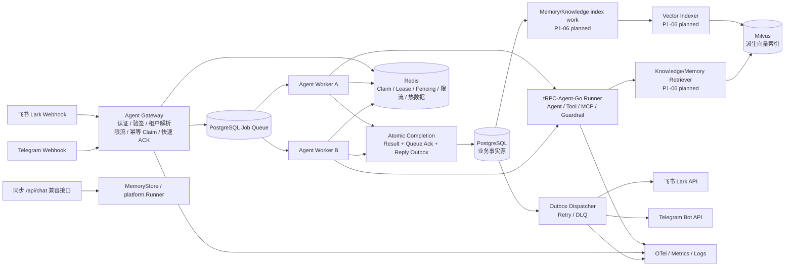

# 多租户节点化 Agent 平台架构

> 本文是当前目标架构和实现边界的权威说明。当前代码核对见 [`project-status.md`](project-status.md)，实施顺序见 [`implementation-plan.md`](implementation-plan.md)。历史计划只用于追溯，不覆盖当前状态。

## 1. 设计目标与边界

平台面向多个租户提供可配置的 Agent 应用。每个租户可以绑定一个或多个 IM 应用、选择数据后端、发布 Agent 版本并配置工具与治理策略。平台的关键约束是：Worker 无状态、租户边界不可绕过、消息至少一次投递下业务幂等、同一 Session 不发生并发覆盖、外部发送可重试且可追踪。

当前首个生产版本的通道目标是：

- 飞书（Lark）机器人；
- Telegram Bot。

Web Chat 不再作为首个生产通道，也不纳入生产异步端到端目标。现有 `POST /api/chat` 作为同步、内存、开发兼容接口保留；它不是生产 Web Chat/SSE 能力。

PostgreSQL 是业务事实源，Redis 负责协调和热数据层；Milvus 是计划接入的向量索引后端，保存可由 PostgreSQL Memory/Knowledge 事实重建的派生投影。tRPC-Agent-Go Runner、Tool/Guardrail、审计、OTel、Docker Compose 和恢复流程按实施计划逐步接入。多 Region 强一致、微信公众号/微信客服、任意 Shell/代码执行和未经认证的公网管理接口不在当前首个生产版本范围内。

## 2. 当前状态摘要

P0-01 至 P0-06 基础层已完成。P0-07/P0-08 的 Runtime、Execution、Job、Queue、Worker、Gateway 主要完成了合同和可验证切片；P0-09A 至 P0-09F 已完成真实 PostgreSQL result、Queue、Outbox、Dispatcher、Retry、DLQ 和三事实 atomic completion 边界；P0-09G-A/B/C 的 channel/Sender/assembly boundary 保持既有状态；P0-09G-D 的 process lifecycle、历史 recovery 与本轮 owner-scoped same-network G-D recovery 均保持 verified/current PASS。production ObjectStore composition、Artifact metadata repository、真实 MinIO object gate 与 Redis restart failover boundary 已通过；full ordinary/race 在 synthetic prerequisites 下均 PASS。按本轮 scope decision，P0-09G-R/P0-09 在定义的 P0 closure boundary 内为 `verified`：scheduler/background lifecycle cleanup 不属于本轮 P0 门禁，ObjectStore/G-D 为并列 boundary，enabled-object 联合故障是后续 evidence；真实 Provider、provider-side dedup、完整业务 Repository、生产认证、framework global Wait/Done、云/IAM/TLS/cluster failover 和 Milvus 仍未证明。详见 [`P0-09G-R最终总审查报告.md`](P0-09G-R最终总审查报告.md)。

当前仍不是完整生产服务：`/api/chat` 继续使用内存业务 Store 和同步 Runner 兼容链路；设置 `DATABASE_URL` 并提供完整 `BOOTSTRAP_*`/SecretRef 后，主进程已装配 PostgreSQL Queue、Worker、Atomic Completion、Outbox、Dispatcher、Lark/Telegram webhook、真实 Sender constructors，以及按 `BOOTSTRAP_OBJECT_BACKEND=s3` 启用的 production ObjectStore 与 ArtifactMetadataRepository。default `none` 不构造 object client，enabled object 缺失配置 fail-closed；runtime/start/readiness 持有并 probe 同一 ObjectStore。current owner-scoped same-network G-D ordinary/race 已 PASS，本轮 Provider transport 仍为 deterministic fake，真实外部 send 为 0。完整业务 Repository、鉴权、Telemetry、Milvus 向量索引、provider-side UUID dedup 和 framework global Wait/Done 仍未完成或证明。

## 3. 逻辑拓扑



图中的 `Vector Indexer`、`Retriever` 和 `Milvus` 是 P1-06 的目标组件，不是当前 P0-09G-C/D 已接入的运行路径。它们只消费 PostgreSQL 已提交事实或由事实驱动的索引任务；Milvus 不参与 Queue Ack、execution result 或 reply Outbox 的原子 completion。

### 组件职责

| 组件 | 负责 | 不负责 |
| --- | --- | --- |
| Gateway | 入口认证/验签、Binding 解析、租户 Context、body 限制、限流、Dedup Claim、Job 投递、快速 ACK | 模型调用、长时间 Tool、直接信任请求中的 tenant ID、直接发送最终回复 |
| Lark Adapter | 飞书回调/发送协议、认证材料、事件解析、destination 和 provider response contract | 租户配置存储、Agent 决策、跨租户查询 |
| Telegram Adapter | Telegram webhook/Bot API 协议、secret、update/destination 规则和 provider response contract | 租户配置存储、Agent 决策、跨租户查询 |
| Channel Registry | 有限 channel 白名单、tenant/channel policy 和 sender adapter lookup | Secret 获取、持久化 Outbox 状态、Agent 执行 |
| Agent Job Queue | 投递、可见性超时、重试、消费者竞争和分区提示 | 业务事实数据、最终 IM 发送状态 |
| Worker | 获取 Job、Session Lease、加载上下文、运行 Agent、构造结果和 reply Outbox、提交 atomic completion | 本地 Session 事实源、绕过 fencing、直接调用外部 Sender |
| Runner Adapter | 平台类型与 tRPC-Agent-Go Runner 的适配、Event 消费、Context/trace 传播 | 决定租户权限、直接读写未授权后端 |
| Vector Indexer / Retriever | 生成和查询受租户过滤保护的 Milvus 派生索引；处理索引重试、滞后和重建 | 修改 PostgreSQL 事实、绕过 TenantContext、把向量索引当作唯一事实源 |
| Storage Adapter | tenant 条件、Repository、事务、事实源和索引边界 | 隐式猜测租户、允许调用方覆盖过滤条件 |
| Outbox Dispatcher | Claim 已提交 Outbox、调用 channel Sender、处理 Delivered/Retryable/Permanent/Unknown、retry 和 DLQ | 在无 Outbox 记录时直接发送、直接持有业务事实 |
| Sync Compatibility Layer | 保留 `MemoryStore -> platform.Runner -> EchoResponder` 和当前 `/api/chat` | 伪装成生产异步 Queue/Outbox/真实 IM |
| Admin/API | 后续租户、Agent、Binding、配置发布和审计管理 | 接受未经认证的租户创建或改变已提交 Session 版本 |
| Telemetry | Trace、Metric、结构化日志、成本和审计关联 | 写入 Secret、Prompt、Authorization 或完整 Provider body |

Worker 之间不使用 sticky session。共享事实源和 Session Lease 使 Worker 可以水平扩展；Lease 只用于同一 Session 的执行串行化和故障接管，不能替代事实源事务。

## 4. 租户边界

入口在真实 Lark/Telegram 验证或 API 认证后解析 `TenantContext`。Context 至少包含：`TenantID`、`AgentAppID`、`BindingID`、Channel、外部/内部用户、外部 Chat、可选外部 Thread、SessionID、RequestID、MessageID、TraceID、配置版本、权限和 BackendPolicy。

所有下列边界都必须带 `tenant_id`：

- PostgreSQL 主键条件、外键条件、索引和未来的 RLS session variable；
- Redis key：固定前缀 `tenant:{tenant_id}:...`，禁止使用未经校验的用户输入拼接全局 key；
- 对象 key：`tenants/{tenant_id}/artifacts/{artifact_id}`；
- 向量 metadata：不可缺失 `tenant_id`，查询 filter 由服务端生成；
- 日志、Trace、Audit 和指标：tenant 作为受控属性；外部 ID 需脱敏或采样；
- Tool 凭据：只通过 Secret Manager 引用注入，不能由用户文本或模型输出决定。

Repository、Gateway 和 Channel Adapter 即使收到已验证 Context，也必须做二次校验。任何跨租户 ID、Binding、Session 或 Artifact 访问都返回拒绝，而不是返回空结果。

## 5. 核心领域模型

```text
Tenant 1 --- N AgentApp 1 --- N AgentRelease
Tenant 1 --- N ChannelBinding 1 --- N UserIdentity
Tenant 1 --- N Session 1 --- N SessionEvent
Tenant 1 --- N Memory
Memory 1 --- 0..N VectorProjection
Session 1 --- 1 Summary
Session 1 --- N Artifact
Tenant 1 --- N AuditLog
Tenant 1 --- N OutboxMessage 1 --- 0..1 DeadLetter
Tenant 1 --- N CoordinationEpoch
Session 1 --- 0..1 SessionLease
```

`ChannelBinding` 的生产通道范围为 Lark 和 Telegram；历史 `wecom` 占位适配器不构成当前生产目标。新通道必须使用服务端 Binding 映射，不得从 payload 接受 tenant ID。

Outbox reply payload 当前采用 schema v4，至少表达 tenant/session/job/execution/request/message/trace、binding、channel、destination、可选 Telegram thread、reply text 和 sender routing version；旧 schema v3 Web/Lark payload 仍可解码。`agent.reply` 的 durable identity 与 tenant-scoped execution dedup 保持稳定；provider-facing idempotency key 仍需由每个真实 Provider 单独证明。

完整 Tenant/Binding/Identity/Session/Event/Memory/Summary/Artifact/Audit Repository 尚未完成，当前数据库迁移和独立 P0-09 slices 不能被描述为完整业务 Unit of Work。

## 6. 一致性和协调

### 6.1 入站幂等

真实 Gateway 验证 Binding 后，以 `(tenant_id, channel, binding_id, external_message_id)` 进行 Claim。首次 Claim 获得 owner、epoch 和 fencing token；重复消息不能再次运行 Agent。Claim 记录和事件写入在完整生产 Repository 接入前仍是后续装配边界。

### 6.2 Session 串行化

Session ID 使用版本化规则；同一 Session 获取带 epoch/fencing 的 Lease，执行期间续租；Lease 续租失败或 epoch 被提升时必须取消 Context。提交事件、状态版本和 assistant 结果时再次校验 fencing，旧 Worker 必须被拒绝。

### 6.3 事实源和 Outbox

P0-09F 已验证以下三项在同一个 PostgreSQL `pgx.Tx` 内提交：

```text
execution_result + job_queue ACK + reply outbox_message
```

P0-09E/G-A 已验证已提交 Outbox 的 claim、sender outcome、bounded retry 和 DLQ contract。正常 completion 失败时不应产生可发送的半状态；commit unknown 必须对 result/queue/outbox 做只读 reconciliation。Redis 不是 Outbox 事实源，Fake transport 不代表 Provider 已接受消息。Milvus 索引任务也不得改变三事实 completion 的 owner；它只能消费已提交事实，失败时保留可重试/可重建状态。

Milvus 只保存 PostgreSQL Memory/Knowledge 事实的派生向量投影。P1-06 必须为每条投影定义稳定的 tenant-scoped document identity、embedding model/version、source sequence、content hash、deleted/tombstone 状态和 schema version；同一索引任务重复执行必须幂等。Memory 事实提交与 Milvus 写入不共享 SQL transaction，索引任务通过已提交事实驱动的 Outbox 或可重建扫描投递。Milvus 不可用时，业务事实仍可提交；检索请求必须有明确的降级/失败语义，不能返回跨租户结果，也不能把 stale index 当作强一致 Memory。

`migrations/000011_p2_02_restore_trigger_compat` 将 000009 的 tenant_config_version insert 守卫替换为仅在存在 tenant GUC 时拒绝非 draft 插入：runtime 角色的可见行为逐字不变（P2-01 FORCE RLS 已使 runtime 无 GUC 时无法写入任何 tenant 行），而离线恢复 owner 的 data-only COPY 可以恢复 published 等最终态行。这是当前 release 的最新 schema 增量（migration 目录 1..11）。

### 6.4 后端职责

| 后端 | 事实/加速职责 | 一致性策略 |
| --- | --- | --- |
| PostgreSQL | 租户、配置、Agent release、Session、Event、Memory 原文、Summary、Artifact 元数据、Audit、Job Queue、execution result、Outbox、DLQ | 事务、CAS、唯一约束、行锁；后续启用 RLS |
| Redis | Claim、Lease、epoch、fencing、限流、热 Session/配置缓存和 Job 协调 | Lua/CAS、TTL、失败关闭；不可作为唯一业务事实源 |
| Milvus | Memory/Knowledge 的 embedding、chunk 和受租户过滤的检索索引；只保存可重建的派生投影 | 最终一致；由确定性文档 ID、版本/删除标记、Outbox 重试和 reconciliation 保证收敛；查询 filter 必须由服务端从 `TenantContext` 生成 |
| Object Storage | 文件和大 Artifact 内容 | 内容 hash、租户前缀、短期签名 URL、生命周期清理 |

Object Storage 当前分为两个边界：独立 S3-compatible adapter 与 production composition 均已通过本轮真实 MinIO gate。production `s3` 配置使用 endpoint/bucket/region 与 `env://` credential refs，缺失 endpoint、bucket、region 或 credential ref fail-closed；default `none` 不构造 client。runtime 持有唯一 ObjectStore，MinIO SDK client 无需要单独关闭的进程外资源，Stop 只需继续执行既有 pool/worker/dispatcher cleanup；Start 与 `/healthz` 使用 bounded authenticated probe，`/livez` 仍只反映进程存活；ArtifactMetadataRepository 复用现有 `artifact` schema，验证 tenant/session/message relation、pending -> ready、pending -> failed、object MIME/size/SHA mismatch、ready 丢失 object -> expired 和 status-gated presign。current owner-scoped same-network G-D ordinary/race 已 PASS。ObjectStore 与 G-D 是并列 boundary，enabled-object 联合故障未执行但按 scope decision 不属于本轮 P0 强制门禁；不得据此声称跨 PostgreSQL/MinIO exactly-once。

## 7. 消息链路

目标生产链路为：

```text
Lark/Telegram webhook
  -> channel verification + Binding/TenantContext
  -> inbound Dedup Claim
  -> PostgreSQL durable Job Queue
  -> Worker + Session Lease
  -> tRPC-Agent-Go Runner
  -> PostgreSQL atomic result + Queue Ack + reply Outbox
  -> Outbox Dispatcher
  -> Lark Sender 或 Telegram Sender
  -> provider response classification
  -> completed / bounded retry / DLQ
```

当前实际可运行链路分为两条：

```text
POST /api/chat -> MemoryStore -> platform.Runner -> EchoResponder/runner responder
/webhook/*    -> channel verification -> bootstrap Binding/TenantContext
              -> PostgreSQL Claim/Queue -> Worker/Runner
              -> atomic result + Queue Ack + reply Outbox
              -> Dispatcher -> selected channel Sender
```

第二条已由 P0-09G-C 在测试 PostgreSQL 和 deterministic fake Provider transport 下验证；真实外部 send 仍不在本轮。Web Chat 不进入目标异步链路，`trace_id`、`request_id`、`message_id`、`execution_id` 和 `outbox_id` 在已验证的测试 composition root 中贯穿入口、Job、Worker、Runner、Repository 和发送端。

## 8. IM Adapter 设计

### 飞书（Lark）

P0-09G-B1 已固定 Lark tenant/binding/config/SecretRef contract、schema v3 routing、user/chat destination、文本发送、固定 HTTPS base URL、官方 `uuid` 字段和响应分类。Secret 只能通过服务端 SecretRef 获取；Sender 不持有 Repository，OutcomeUnknown 不完成 Outbox。显式门禁测试 `trpcservice/channels/lark/lark_real_test.go` 已使用授权测试租户验证 token flow、真实消息 2xx/Delivered 和稳定 UUID replay；provider-side dedup、exactly-once、webhook challenge/签名/解密和生产装配仍待后续验收。该测试仅在 `LARK_B1_REAL=1` 执行，门禁关闭时不发起真实请求。

### Telegram

P0-09G-B2 已完成 Telegram Sender/Adapter real boundary：固定 `https://api.telegram.org`，使用 `getMe`/`sendMessage`，Binding 只引用服务端 Bot Token SecretRef，routing 固定 numeric chat ID，plain text 按 4096 字符上限拒绝超长消息，429/5xx/400/401/403/timeout/unknown 映射为有限 safe outcome。webhook adapter 精确校验 `X-Telegram-Bot-Api-Secret-Token`，解析 `update_id`、Message/User/Chat/text，并提供 tenant-scoped dedup key projection；tenant 由服务端 Binding/path 映射，不信任 body tenant。private/group/supergroup chat-level routing 已覆盖，private/supergroup topic 使用 schema v4 的正式 `message_thread_id` 字段，普通 group thread 明确不支持。username 不能作为稳定主身份。

- Telegram `sendMessage` 没有本项目可依赖的 provider-side idempotency/dedup contract，因此 exactly-once 不支持，OutcomeUnknown retry 仍有重复发送风险。B2 的真实 `getMe`/`sendMessage` evidence 与本轮 G-C fake Provider evidence 分开记录，本轮没有重跑真实 gate。Telegram webhook、Worker、Outbox 和 Dispatcher 已通过测试 composition root 接入；历史 `wecom` 仅保留为当前测试/占位代码，不再作为首个生产通道计划。

## 9. Agent、Tool 与治理

`AgentRuntime` 负责平台与 tRPC-Agent-Go 的适配：创建租户/Agent 版本对应的 Runner，传递 Context，消费并排空 Event channel，将模型/Tool 错误映射为平台事件。所有 goroutine 都必须有 owner、取消路径和退出测试；framework global Wait/Done 仍未由公开合同证明。

Tool 执行前按 TenantContext 和 Agent Release 的 Tool Policy 做白名单、参数 schema、用户权限和预算检查。危险操作需要审批 token，首个生产版本默认关闭任意 Shell/代码执行。Guardrail 覆盖模型输入、Tool 参数、Tool 输出和最终回复；日志/Trace/Audit 只保留脱敏摘要、hash、长度和决策。

## 9A. P1-08 配置发布边界

P1-08 使用 PostgreSQL 作为 tenant configuration revision、rollout、operation idempotency 和历史状态的唯一事实源。revision 内容 immutable，状态转换和单 active invariant 由 repository transaction、CAS 和 database guards 共同保护。managed tenant 的 canary assignment 基于 tenant identity 的 deterministic bucket；ingress、queue、worker、execution、completion 和 reply outbox 共享同一 `ConfigVersion`，旧 nullable rows 保持兼容。`CONFIGPUB_ENABLED` 默认关闭；Redis/Docker/production binary integration gates 已在真实 disposable fixture 矩阵中通过，默认关闭行为保持不变。

## 10. 可观测性与安全

Trace 至少覆盖入口、Claim、Lease、Runner、模型调用、Tool、Session/Memory 读写、Outbox 和 IM 发送。指标使用低基数标签；外部用户、Session 和 message ID 不作为无限增长的 metric label。最低指标集包括入口量、Claim、Lease、Agent/Tool、模型成本、存储延迟、Outbox retry/DLQ、IM 发送结果、限流拒绝和 Worker 并发。

Secret 只保存 Secret Manager 引用；错误、日志和 trace 禁止记录 API key、Authorization、IM token、数据库密码、完整 Prompt、History、Provider body 和文件内容。审计记录 allow/deny/error、操作者、资源、理由、延迟、成本和 trace 关联。

## 11. 故障、恢复和部署

- 模型超时：传播 Context，有限重试或降级；不重试不可重放的 Tool；
- Redis/PostgreSQL 故障：使用有限退避和 readiness；状态不确定时 fail-closed；
- Worker 故障：Job 可见性超时后重投，依赖 Lease takeover 和 fencing；
- 外部发送不确定：Outbox 保留、有限 retry/DLQ；provider-side dedup 需真实通道证明，不能把 PostgreSQL dedup写成 exactly-once；
- Milvus 故障或索引滞后：不影响 PostgreSQL Memory/Knowledge 事实提交；索引任务通过 Outbox 重试和 reconciliation 收敛，检索按明确策略降级或失败关闭，不返回跨租户结果，也不把 stale index 当作强一致事实；
- 退出：production composition root 使用 coordinator 停止新入口，先原子进入 draining，再在一个明确 process deadline 内排空 HTTP、停止 Worker Receive、停止 Dispatcher Claim/Send，最后关闭 PostgreSQL pool；HTTP 超时后仍执行 runtime cleanup，未发送的 pending Outbox 保留在 PostgreSQL。P0-09G-D 的 coordinator/Worker/Dispatcher contract、真实 binary startup/listen failure、真实 Linux SIGTERM clean subprocess、历史与本轮 owner-scoped same-network PostgreSQL recovery 和 SIGKILL reclaim 已有独立证据；
- 隔离 PostgreSQL restart/reconnect 只覆盖本阶段拥有的测试资源，不等于完整 OS crash、生产集群 failover 或 framework global Wait/Done；本轮 owner-scoped same-network G-D production chain ordinary/race 已通过 `503`、fresh pool/`SELECT 1`、healthz、Queue/Outbox reclaim、stale delivery fencing 和 final facts。固定 loopback host-mapped endpoint regression ordinary/race 通过，历史 dynamic-port transport failure 未被全局忽略，仍单独作为 transport boundary。

备份恢复与事件回放已作为 P2-02 本地边界交付：`cmd/trpc-recovery`（backup/verify/restore/replay）在隔离目标上执行一致性快照 data-only 备份、migrations-first 单事务恢复与有界 session-event replay（详见 `docs/P2-02运行文档.md`）；它不属于业务运行面，也不代表生产 DR。入站容量保护已作为 P2-03 本地边界交付：webhook ingress 在服务端 TenantContext 之后、dedup claim 之前接入三维 Redis rate limiter（RATE_LIMIT_REDIS_URL，后端不可用 fail closed）与进程内 global/tenant/binding 三域 admission 预算（快速拒绝、幂等释放），区分 rate_limited/capacity_exhausted/dependency_unavailable 三类结果；Worker/Dispatcher 并发与批量参数可配置且有界。跨进程 queue-depth、租户公平调度与 production 容量上限 NOT PROVEN。 集成/压力/安全测试与运维手册已作为 P2-04 本地边界交付：8 链集成矩阵、有界 soak/故障演练、secret/compose/运行时安全审计、发布门禁脚本与本地/预生产运维手册（`docs/P2-04运行文档.md`）；生产集成/部署/运维从未执行。生产部署、Secret Manager、production 备份调度/retention/加密/异地复制、PITR/WAL 归档、容量保护和 production Compose 仍按 `implementation-plan.md` 的后续阶段实施。当前 CMD composition root 已注册生产 Queue/Worker/Dispatcher/Sender，并由 P0-09G-D coordinator 管理 listener 和 shutdown；本轮 production ObjectStore composition、Artifact metadata boundary、Redis restart failover 和 owner-scoped same-network G-D recovery 已通过，full ordinary/race 也通过。Redis restart 语义是 PostgreSQL authority epoch + Redis physical lease 的组合；epoch-aware acquire 解决旧 key 阻塞，old-owner fencing 与 durable fact check 通过。按 scope decision，自动 reconciliation scheduler/background lifecycle cleanup 是 deferred、非本轮 P0 门禁；ObjectStore/G-D 是并列 boundary，enabled-object 联合故障是后续 evidence，因此 P0-09G-R/P0-09 在定义范围内为 `verified`。真实 Provider 联合证据、provider-side dedup、完整业务 Repository、认证、framework global Wait/Done 和云/IAM/TLS/cluster failover 仍是独立未证明边界，详见 `docs/P0-09G-R最终总审查报告.md`。

## 12. 主要风险

| 风险 | 缓解 |
| --- | --- |
| tenant ID 伪造或跨租户读取 | Binding/API 认证映射、Context、Repository 二次校验、RLS |
| 重复/乱序消息 | Dedup Claim、Session Lease、事件序号和 fencing |
| Redis 与 PostgreSQL 双 owner | epoch authority、租约校验、fail-closed、故障切换演练 |
| Tool 越权或提示注入 | 白名单、参数校验、审批、Guardrail、默认关闭危险 Tool |
| Secret/Prompt 泄露 | SecretRef、统一 Redactor、禁止原文日志 |
| 模型超时和成本失控 | Context deadline、租户预算、并发配额、降级和告警 |
| IM 限频和不确定发送 | Outbox、provider idempotency key、分片、retry_after、DLQ |
| Milvus 故障或索引滞后 | PostgreSQL 事实源、Outbox 重试、lag/reconciliation、受控重建和明确检索降级；不返回跨租户结果 |
| Summary/Vector 最终一致 | SQL 事实源、covered_seq、Outbox 重建和 SQL 回退 |
| 数据库/Redis 不可用 | readiness、有限退避、备份恢复、迁移和事件回放 |
| 配置误发布 | immutable release、灰度健康门禁、指针回滚和审计 |
| Artifact 越权或恶意文件 | 租户前缀、短期 URL、MIME/大小/hash 检查、生命周期清理 |
| goroutine/Event channel 泄漏 | owner/取消契约、事件排空、race 和故障测试 |

## 13. 本轮 PostgreSQL Recovery 证据

本轮在授权 `Ubuntu-20.04` WSL2 Linux 进程与 owner-scoped Docker runner 中使用 WSL-native root-owned Docker Engine Unix socket，未使用 Windows Docker Desktop named pipe。历史 G-D 同 network runner 的 PostgreSQL recovery evidence、本轮 current same-network G-D evidence 与 production object evidence 分开记录；production object test 使用唯一 owner-labeled MinIO container/volume/network、内部 `minio` alias、仅绑定 127.0.0.1 的固定 loopback port，ready/S3 probe、真实 bytes、presigned actual GET、Artifact metadata transitions、object restart/reconnect 和 cleanup 后 owner resources 均 PASS。current G-D ordinary/race 也 PASS；本轮未修改 PostgreSQL、Queue、Worker、Outbox 或 Dispatcher 生产实现。

## 9. P1-04 Channel Binding、Identity 和 SecretRef 当前证据

P1-04 当前保持 `partial`。生产目标通道限定为 Lark 和 Telegram。Binding 由服务端根据 channel/provider external identity 查找，caller 不得覆盖 tenant、binding、channel 或 destination；Identity 由 tenant/channel/binding/external user 映射，Telegram private/group/supergroup/topic 的 chat/thread scope 在 Claim 前确认。`/api/chat` 继续保持同步 `MemoryStore -> platform.Runner -> EchoResponder` 兼容路径。

`000006_p1_04_binding_identity` 在不改变 `000001` 至 `000005` 历史语义的前提下增加 Binding 状态/version/expiry/target、Identity scope/version/internal ID 及 tenant-scoped Binding Audit。PostgreSQL 是 metadata 事实源，Redis 不是唯一来源；Binding 更新使用 tenant context 和 version/CAS。provider identity 使用仅适用于 Lark/Telegram 的 partial unique index，以兼容历史 `web` fixture。

SecretRef 当前分为 reference validation 和 resolver 两层：`env://` 由 startup `EnvironmentSecretResolver` 解析；`secret://` 只被验证为合法引用并明确返回 unresolved；不声称云 Secret Manager/KMS/Vault/IAM。可选 channel 默认关闭；enabled Binding 的必要 ref/value 缺失时 fail closed，disabled optional Binding 不创建 webhook/sender、不阻塞 startup；dynamic reload、rotation 生效和 reconcile deferred。

当前 ordinary/race evidence 已覆盖真实 PostgreSQL migration/repository、Ingress/composition、full suite、CAS/lifecycle、scope conflict、Audit/redaction、rollback/cancellation，以及无 Claim 的 pre-enqueue rejection。P0-09G-R 和 P0-09 仍分别保持 `verified (defined P0 closure boundary)` 与 `verified (defined durable, assembly and recovery boundary)`；P1-04 为 `verified (functional Binding/Identity/SecretRef boundary)`，P1-05 为 `verified (functional Tool Policy/Guardrail boundary)`，P1-06/Milvus 为 `ready / not started`；Lark、Telegram、Model Provider 请求均为 `0`，没有创建 Milvus resource，也没有修改 P0-09F、Queue、Worker、Completion、Outbox、Dispatcher 核心算法。

## 10. P1-04 最终证据与限制

本节保留 P1-04-R 前的历史状态和 Queue PostgreSQL concurrent Receive full-race failure：当时 P1-04 不能标记 verified，唯一 failure 位于 `claim candidate` 的 bounded `i/o timeout`，无 `DATA RACE`；一次 targeted queue race diagnostic 通过但不覆盖 full-race failure。P1-04-R 后续完成 test-only 修复，最终 focused/package/affected/full ordinary 和两次独立 full race 均通过。

`env://` 是唯一真实 local SecretResolver；`secret://` 只 validated-but-unresolved。channel enabled 默认 `false`，enabled SecretRef 缺失或 value 缺失 fail closed，disabled optional Binding 不创建 adapter/sender 且不阻塞 startup；dynamic reload、Secret rotation 生效、reconcile、Admin API、认证和云 Secret Manager/KMS/Vault/IAM 均 deferred。P1-05 为 `verified (functional Tool Policy/Guardrail boundary)`，P1-06/Milvus 为 `ready / not started`。

P0-09G-R 和 P0-09 继续保持 defined boundary 的 `verified`。本轮真实 Lark、Telegram、Model Provider 请求均为 `0`，没有创建 Milvus resource，没有修改 P0-09F、Queue、Worker、Completion、Outbox、Dispatcher 核心算法。govulncheck 仍有 5 个可达依赖漏洞，gitleaks/deadcode clean；没有把安全扫描 findings 写成 clean。

## P1-04-R Final Closure Investigation

P1-04 Queue final race investigation 已完成。历史 `ConcurrentReceive` full-race timeout 保留为 stage=`claim candidate`、category=`database transport i/o timeout`、last_stage=`Postgres concurrent Receive write`、deadline=`true`、`DATA RACE=false`。源码路径证明 Queue 使用独立 schema/pool、`FOR UPDATE SKIP LOCKED`、conditional claim update 和 transaction rollback/commit；失败来自 full-suite scheduling 下过窄 test context 的 pgx deadline error shape，不是 durable claim/lock semantics defect。

仅在 `trpcservice/queue/postgres_queue_integration_test.go` 增加 ready barrier、严格的 context-expired timeout 分类和安全 pool statistics；Queue production、P0-09F、Worker、Completion、Outbox、Dispatcher、Redis fencing、PostgreSQL recovery、Sender、ObjectStore 和 `/api/chat` 均未改。最终 focused/package/affected/full ordinary、两次 full race 均通过，无 DATA RACE。

`govulncheck` 的 5 个 reachable findings 及 fixed versions 已写入验收报告；它们分别是 grpc GHSA/GO-2026-6061、x/text CVE-2026-56852/GO-2026-5970、pgx CVE-2026-41889/GO-2026-5004、OTel CVE-2026-24051/GO-2026-4394、go-redis CVE-2025-29923/GO-2025-3540。它们均非 P1-04 新引入；依赖升级、Go baseline、framework telemetry、PostgreSQL 和 Redis blast radius 需要单独授权，当前没有 security clean 结论。

P1-04 functional closure 为 `verified`，项目 release/security closure 为 `partial`，仅表示独立 govulncheck remediation 尚未完成；P0-09G-R/P0-09 保持各自 defined boundary `verified`，P1-05 为 `verified (functional Tool Policy/Guardrail boundary)`，P1-06 为 `ready / not started`。没有发起真实 provider 请求，没有创建 Milvus resource。

## jscpd 最终统计更正

全仓 jscpd 最终覆盖 140 个 Go 文件，exit 0，`252 exact clones`、`2038 duplicated lines`、`5.29%`。此前 bounded 子集统计不再作为全仓结论；govulncheck findings 仍是独立 project release/security blocker。

## P1-04 当前架构状态

PostgreSQL 是 Binding/Identity metadata 的 durable fact source，Redis 不是唯一事实源。Lark/Telegram Ingress 使用 server-owned Binding、TenantContext 和 external Identity；caller 不能覆盖 tenant、binding、channel 或 destination，disabled/expired/invalid Binding、Identity conflict 和 SecretRef failure 在 Claim 前 fail closed。`env://` 是唯一真实 EnvironmentSecretResolver；`secret://` 只有格式校验，属于 validated-but-unresolved，不等于 Secret Manager/KMS/Vault/IAM 集成。

startup configuration 是当前 snapshot；dynamic reload、Secret rotation、automatic reconcile、Admin API、完整认证和 cloud secret management deferred。Audit 只写有限 metadata/fingerprint，不写 webhook body、prompt、history、provider body、Authorization、DSN、token 或 raw secret；Audit failure 不绕过安全拒绝。`/api/chat` 保持同步 `MemoryStore -> platform.Runner -> EchoResponder`，Ingress 不直接调用 Runner、Model Provider 或 Sender；P1-04 不改变 P0-09F completion transaction。Milvus 仍是未来派生索引，当前未开始且没有 resource evidence。

## 10. P1-05 治理和统一脱敏边界

当前 Tool 执行必须经过 `TenantContext`、server-owned `tool.Registry`、版本化 `PolicyResolver`、pre-tool `Guardrail`、bounded budget reservation、Tool implementation、post-tool Guardrail/redaction 和安全 Audit sink。`agent.ToolInvoker` 的业务参数不包含权限、tenant、approval 或 budget owner；模型/user 文本不能改变这些字段。生产默认没有注册 Tool implementation，也没有 fake allow fallback，unknown/disabled/missing/unavailable/stale policy 均拒绝。

本轮新增的 policy/guardrail contract 是 provider-neutral 的功能边界：policy 以 tenant、AgentApp、release/config version、Tool identity/version/capability 和 bounded expiry 形成 decision；Guardrail 校验 TenantContext、Agent 声明、schema、大小、敏感字段、credential/DSN、路径 traversal 和危险 capability，并在结果返回前执行大小限制和统一 Redactor。Audit 只接收安全 ID、category、policy/tool version、size、latency 和 fingerprint，不接收 prompt、history、webhook/provider body、完整 Tool input/output、token 或 raw backend error。

当前源码没有 durable policy/approval/budget Repository、Admin/API 或完整 production AuditRepository，因此 PostgreSQL/Redis 的 P1-05 durable fact boundary 尚未宣称完成，也没有新增 migration。Approval、durable policy/budget/audit persistence、token/cost/provider billing、真实 Tool/provider、完整 DLP/content moderation 和 Redis coordination/cache 接入均 deferred。P1-05 的 process-local budget 只用于 bounded count/time/concurrency/input/output admission contract，不能当作重启后 durable quota 或外部账单。

P1-05 不加入 P0-09F 的 `execution_result + job_queue ACK + reply outbox` transaction；外部 Tool、模型和网络调用仍在 SQL transaction 外。`/api/chat` 仍是同步 MemoryStore/Runner 兼容路径，Lark/Telegram Sender/Dispatcher 和 P0-09G-D 生命周期顺序不变。P1-06/Milvus 仍未开始。

## P1-06A 当前边界

当前已实现的 A 边界位于 `trpcservice/vector`，不改变既有运行图。`memory.Memory` 仍是 PostgreSQL durable fact；`MemorySource` 将其映射为 derived projection 输入，读取 `Version`、`SourceSeq`、`Content`、`Deleted`，但不改变 `vector_ref` 的 opaque 兼容语义。当前仓库没有 Knowledge durable source，因此没有创建假 Knowledge 表或映射。

Vector document identity 为 server-owned、版本化的 `vd-v1-` digest，输入为 tenant、source type/id、projection scope、model/version、dimension 和 schema；content hash、source version、sequence、operation 不进入 identity。这样同一 source 的 retry/update 保持 ID 稳定，内容 hash/version 仍可检测旧 projection，模型或 schema 变更不会复用不兼容 projection。delete 使用同一 source identity 的 tombstone operation。

derived index metadata 是 bounded allowlist，仅含 tenant filter 所需 tenant、source type、不可逆 source reference、version/sequence、content hash、model/version、dimension 和 schema；不含正文、原始 source ID、prompt/history、provider body、credential 或 vector。tenant filter 从 validated `TenantContext` server-side 生成，public `SearchRequest` 不暴露 tenant、collection、partition、raw expression 或 arbitrary filter。

A 的 `VectorStore` 是 provider-neutral 的 `Ready/Upsert/Delete/Search/Close` contract，不泄漏 Milvus SDK；`DeterministicEmbedder` 只用于 local contract tests，fixed dimension、bounded input、明确 model/version，不代表真实 provider 质量。`BackendPolicy.Vector=none` 返回 no-client `DisabledStore`，不构造 client、不连接、不 probe、不启动 worker；enabled backend 缺 endpoint/collection/credential/model/version/dimension/schema/timeout 等配置时 fail closed。

B-E 仍未接入 architecture runtime：当前没有 vector task durable fact、Milvus adapter、hydration retrieval、vector worker、reconciliation、rebuild 或 production Milvus resource。Milvus 只可作为 future PostgreSQL fact 的最终一致 derived index，不能参加 P0-09F completion、Queue Ack、reply Outbox、Audit 或业务 fact authority；`/api/chat` 继续保持 `MemoryStore -> platform.Runner -> EchoResponder` 同步兼容路径。
## Webhook 并发回归分类

当前 webhook 失败不是 Lark Verify、readiness 或 fixture 污染：两个同 payload 请求中的一个在 identity repository 并发 upsert 收到 PostgreSQL unique conflict，Ingress 将其安全映射为 `401`，另一个返回 `202`。仅有一套 identity/claim/job/audit，未发现重复 durable fact；通过路径验证单 runner、单 execution 和单 outbox。

该问题是独立 P1-04 identity repository production regression，保留为 ordinary regression blocker；本轮没有改 P1-04 contract、Ingress、P0-09F transaction、Queue/Worker/Completion/Outbox/Dispatcher 核心算法，也没有开始 P1-06B-E。P1-06A 仍仅为 contract/projection/fake-embedding boundary。
## P1-04 concurrent identity resolution 当前修复与验收

当前权威状态为：`P1-04: verified (functional Binding/Identity/SecretRef boundary)`；`P1-04 concurrent identity resolution: verified`。本节不覆盖历史 failure：原始 `TestProductionPostgresWebhookFailureWindows/duplicate_concurrent_webhook_has_one_logical_winner` 曾出现 `concurrent accepted responses=1`、`[401,202]`，有界 ordinary 为 `5 PASS / 5 FAIL`；失败快照为 `identity_rows=1, claims=1, jobs=1, executions=0, outboxes=0, audits=1`，根因是 `TenantRegistry.ResolveIdentity` 并发 identity insert 的 unique conflict。

修复位于 `trpcservice/storage/postgres/tenant_registry.go`：使用 `(tenant_id, channel, binding_id, external_user_id)` 的原子 `ON CONFLICT (...) DO UPDATE`（保留 `last_seen_at/updated_at`）；仅在 upsert 未返回行或明确 `user_identity_pkey` 冲突时，对完整 canonical key 做一次 bounded 查询。明确识别的 `user_identity_pkey` 冲突也仅允许进入同一 exact-key 查询；查不到 canonical row、identity ID/internal user ID 不匹配、scope/chat/thread 不匹配或其他错误均 fail closed。没有把所有 `23505`、`storage.ErrConflict` 或 `401` 转成成功，也没有修改 immutable fields。

新增 PostgreSQL barrier+WaitGroup 并发 resolver、canonical constraint、unknown primary-key conflict、immutable identity mismatch 和 category-only error tests。修复后 targeted webhook ordinary `-count=10`、targeted race `-count=10`、repository identity ordinary/race、`cmd/trpc-service` ordinary/race、`trpcservice/storage/postgres` ordinary/race、tenant/gateway/audit/tool/queue/execution/outbox/worker affected ordinary/race、full ordinary/race 均 `PASS`；原有 webhook accepted=2、runner=1、logical winner/durable exactly-one assertions 保持并通过，未观察 duplicate execution/outbox，`DATA RACE` 未观察。

本修复不修改 P0-09F、Queue、Worker、Completion、Outbox、Dispatcher、Ingress contract、P1-05、P1-06A、`/api/chat`、migration、`go.mod` 或 `go.sum`；没有新增 migration/dependency/config，P1-06B 仍 `blocked/unavailable`，C `not started`，D/E `blocked`。

本轮所有 owner-scoped PostgreSQL/Redis test resources 均已 cleanup：containers/networks/volumes/pending 为 `0`；没有 Milvus resource。Lark、Telegram、Model Provider、Embedding provider requests 均为 `0`；历史 govulncheck findings 保留，`security clean` 未声明，project release/security state 仍为 `partial`。

## P1-06B Milvus adapter boundary

P1-06B 当前为 `blocked/unavailable`。`trpcservice/vector/milvus` 隔离 `milvus/client/v2@v2.5.0`，只实现 provider-neutral `VectorStore` 的 bounded `Ready/Upsert/Delete/Search/Close`；公共 vector/tenant/channel/tool contract 不含 SDK 类型。

Milvus 是可删除、可重建的 derived index，不是 Memory、Knowledge、policy、approval、execution、outbox 或 embedding source fact。collection/schema/index 由 server-owned config/fixed allowlist 决定，生产 Ready 只验证不 provision；tenant predicate 来自可信 context，结果只返回 validated projection metadata，不返回 content、query vector 或 backend error。

本轮 SDK dependency gate 和 unit ordinary/race 通过，但真实 local Milvus 无法 provision：固定 v2.5.0 image 拉取因远程宿主磁盘空间不足失败。故未声明 Milvus readiness、CRUD、restart/reconnect、production endpoint、HA/TLS/IAM 或 P1-06 完成；P1-06C 未开始，D/E blocked。

## P1-06B 存储释放后复验边界（当前）

`trpcservice/vector/milvus` 在真实 standalone Milvus v2.5.0（认证启用）上验证：Ready 仅校验 server-owned collection/schema/properties/index/load；Upsert/Delete/Search 请求的 dimension/model/modelVersion/schemaVersion 必须与 server-owned config 完全一致，否则 SDK 调用前 fail-closed；Search 使用 expression template 绑定可信 tenant，Delete 使用严格 validated 精确 literal expression（拒绝 quote/backslash/控制字符/表达式操作符）；repeated delete 返回 unknown（不声称 provider-side exactly-once）。Milvus 仍是可删除、可重建的 derived index，不进入 P0-09F transaction，不作为任何业务事实源。bounded restart 采用 factory rebuild（非 same-client 自动重连），不声称 HA/failover。production 默认 backend 仍为 `vector=none`。P1-06B 边界为 local adapter/integration；Production Milvus/Cloud IAM/TLS/HA NOT RUN；vector task/worker、retrieval/hydration、rebuild NOT IMPLEMENTED。

## P1-06C durable vector task boundary（当前）

`trpcservice/vector/task` 提供持久化 vector projection task 边界：migration `000007_vector_projection_task`（状态机/lease 身份/attempt 预算/安全类别 CHECK 与 ready/lease-expiry/document-head 索引）、server-derived `vt-v1-` task 身份（document identity 与内容 hash 解耦）、`PostgresRepository`（tenant-scoped 条件更新、owner+epoch+fence CAS、到期 reclaim、attempt 耗尽 CTE 归档 DLQ、document-head NOT EXISTS guard）、注入式 SourceProjector seam 与 `Worker`（poll→Redis lease→durable claim→事务外 load/embed/`VectorStore` 调用→fenced complete/fail/release→release lease；renewal 失败立即中止执行路径；bounded retry/backoff/DLQ；取消归类 release 并回退未执行 attempt）。任务表不保存 source content、embedding、提示词、凭据、provider 原始错误或 query vector；(version, sequence, delete-dominance) 为唯一 ordering，禁止 wall-clock 参与 stale 判定。本轮以真实 PostgreSQL/Redis integration、真实 local Milvus worker E2E、全量 ordinary/race 与真实二进制 migration fail-closed 链验证（详见 `docs/P1-06C验收报告.md`）。production Memory/Knowledge source projector、production enqueue producer、production vector worker 接线、retrieval/hydration（P1-06D）、rebuild/reconciliation（P1-06E）仍 NOT IMPLEMENTED；production backend 仍为 `vector=none`。

## P1-06D retrieval/hydration boundary（当前）

`trpcservice/vector/retrieval` 提供 server-owned 检索边界：可信 TenantContext→bounded 请求校验（query/TopK/MinScore/source allowlist 全部 server-owned，caller 无 tenant/collection/filter 字段）→注入式 Embedder（dimension/model/version 一致性校验）→provider-neutral `VectorStore.Search`（tenant filter 由 server-owned context 生成，PostgreSQL 事务外，bounded rounds/candidates）→candidate validation（document ID/tenant/model/schema/dimension/score/duplicate 全部过滤）→PostgreSQL 权威 hydration（tenant-scoped batch 读取 `memory` 表；missing/deleted/tombstoned/stale/content-hash 漂移过滤；content freshness 以 `vector.ContentHash` 重算证明）→确定性排序（score 降序、document ID 升序）。Milvus hit 只是 derived candidate，不是业务事实；`memory.vector_ref` 保持 opaque； hydration 只读、有界、不在事务内调用 embedding/搜索。已以真实 PostgreSQL（含 outage/restart 恢复与 tenant A/B 并发隔离）与真实 local standalone Milvus v2.5.0 端到端验证（详见 `docs/P1-06D验收报告.md`）。production Memory write path/enqueue composition、production retrieval 接线、Knowledge durable source、rebuild/reconciliation（P1-06E）仍 NOT IMPLEMENTED/blocked；production 默认 vector=none 且无 retrieval 路由；semantic retrieval quality NOT TESTED。

## P1-06D-P production composition boundary（当前）

生产组装新增默认关闭的 vector composition（`cmd/trpc-service/vector_composition.go`）：`VECTOR_BACKEND=none`（默认）且 worker/retrieval 未启用时不构造任何 Milvus client、credential、Redis 连接或 goroutine；enabled 路径要求 backend=milvus、endpoint/collection/model/version/schema/dimension/Redis 完整且经 assembly seam 注入 production Embedder，任一缺失 fail closed（真实二进制验证：无 Embedder 的 enabled 配置启动即退出）。生产 Memory 写路径（`storage/postgres/memory.go`）在同一 PostgreSQL 事务内提交权威 Memory 事实与 vector projection task（server-owned version/seq 单调推进、tombstone/delete 幂等、tenant-scoped）；P1-06C task repository 新增 `EnqueueTx` 与 `Enqueue` 共享同一 SQL/校验；production `PostgresSourceProjector` 供 worker 加载权威 Memory（stale/tombstone 安全分类）。runtime 生命周期：Start = queue worker → vector store Ready → vector worker → dispatcher → readiness（enabled 时含 vector probe）；Stop 反向且有界。deterministic fake Embedder 仅存在于测试 seam，不可能是 production 默认。Memory/task 原子提交不等于跨系统 exactly-once；rebuild/reconciliation 仍属 P1-06E，未开始。

## P1-06E durable rebuild/reconciliation boundary（当前）

`trpcservice/vector/rebuild` 提供 durable 重建与 reconciliation 控制面：migration `000008_vector_rebuild_run`（server-owned run id、projection fingerprint、phase 状态机、keyset cursor、fenced lease 身份、safe category 约束）、keyset 分页扫描（无 OFFSET/长事务/表锁），每批 "task enqueue + cursor 推进" 同一 PostgreSQL 事务并复用 P1-06C stable document ID/dedup/head guard；crash 后从 durable cursor 恢复；run 生命周期由 Redis epoch/fencing 保护，旧 owner 不得推进 cursor/complete/repair。`IdentityReader`（additive 内部边界，P1-06A VectorStore 不变）提供 bounded scalar identity 观察：missing/stale/tombstoned-present/wrong-projection/orphan/invalid 分类；repair 一律经 `RedriveTx` 走既有 task 边界（succeeded 任务幂等重投影；dead-letter/stale 不被 maintenance 复位）；orphan 默认 report-only。`Router` 作为 server-owned projection registry 支持多 projection 路由与 per-projection embedder 解析（worker additive `EmbedderRegistry`）。bounded reconciliation 零漂移且无非终态任务才 complete——scan 完成不标记成功。真实证据（含 outage 恢复与 pre-provisioned target rebuild）见 `docs/P1-06E验收报告.md`。cutover/alias 协议 BLOCKED；生产自动触发 NOT IMPLEMENTED；production 默认全部 disabled；semantic quality NOT TESTED。

## P1-07 observability boundary（当前）

新增 `trpcservice/telemetry`：server-owned TracerProvider/MeterProvider/结构化 JSON logger/低基数 instrument registry/幂等有界 Shutdown。默认 `TELEMETRY_MODE=none`：不解析 credential、不连 collector、无 export goroutine、probe 不执行，instrumentation 走 no-op；显式 `otlp` 要求 endpoint、environment allowlist、bounded sampling/batch/timeout，`insecure` 仅限 loopback。跨边界 correlation：`AgentJob` 可选 `TelemetryCarrier`（W3C traceparent only，baggage 不传播，caller carrier 不接受）——webhook server span → gateway producer span（carrier 注入）→ worker attempt span（link；missing/invalid 记录 context_state）→ completion → dispatcher；业务 TraceID/RequestID 仅以有界 Fingerprint 关联，不作为 metric label。低基数 attributes 仅 allowlist（route 模板/status class/channel allowlist/error category 等），raw ID/URL/error 禁止。instrumentation 全部 additive/nil-safe decorator + 窄 hook（web middleware、gateway、worker、completion/sender/memory 组合装饰），不改变 P0-09F、Queue、Worker、Completion、Outbox、Dispatcher 业务算法；telemetry 失败不改变业务结果、readiness 不依赖 exporter。启动先 telemetry 后业务组件，停止反向且有界 ForceFlush/Shutdown。验证与边界见 `docs/P1-07验收报告.md`。

## 9B. P1-09 本地部署边界

P1-09 交付可重复的本地 Docker/Compose 部署边界：`Dockerfile` 多阶段构建的固定 digest 非 root 镜像只携带 `trpc-service`、`trpc-migrate`、migration 文件与 CA 证书；`docker-compose.yml` 以 core profile 编排 PostgreSQL、Redis、独立 `migrate` 生命周期步骤和应用，`depends_on` 保证 PostgreSQL healthy 且 migration 成功后应用才启动；`telemetry` profile（默认关闭）提供本地 OTel collector，不参与业务 readiness；不存在 vector/Milvus 服务，`VECTOR_BACKEND` 默认 `none`。readiness/liveness 由 `/livez` 与 `/healthz` 分担：liveness 只表达进程存活，readiness 在 drain、依赖 outage 或 migration mismatch 时 fail closed（503）。PostgreSQL 密码经 Docker secret 文件（宿主 0600）注入，wrapper 读取后经 `su-exec` 以非 root 用户执行服务进程；`docker compose config` 输出、镜像层与容器 inspect 环境均不含密码或完整 DSN。`cmd/trpc-migrate` 以稳定退出码和脱敏类别暴露 migration gate 结果，并在 checksum mismatch、版本缺失或超前时 fail closed 阻断应用启动。

## 9C. P2-01 数据库强制租户隔离边界

P2-01 在 PostgreSQL 层为全部 24 张 tenant 表启用并 FORCE ROW LEVEL SECURITY，policy 以事务本地 GUC `trpc.tenant_id` 为准（`set_config(..., true)`），缺失或为空时读零行、写拒绝。应用层 tenant predicate 全部保留，RLS 是额外的数据库防线。部署模型分离 migration owner 与 `trpc_runtime`（NOSUPERUSER/NOBYPASSRLS/非表 owner）角色：应用业务池只接受受限角色（启动时 `EnsureRuntimeRoleLimits` fail closed），migration gate 使用 owner 凭据，`trpc-migrate` 可在迁移后供给 runtime 角色与最小授权。跨租户能力仅保留三个固定 SECURITY DEFINER 函数（queue 全局 claim、vector task candidate、pre-tenant binding resolve），由专用 NOLOGIN BYPASSRLS 角色持有，静态 SQL、有界返回、REVOKE PUBLIC。
