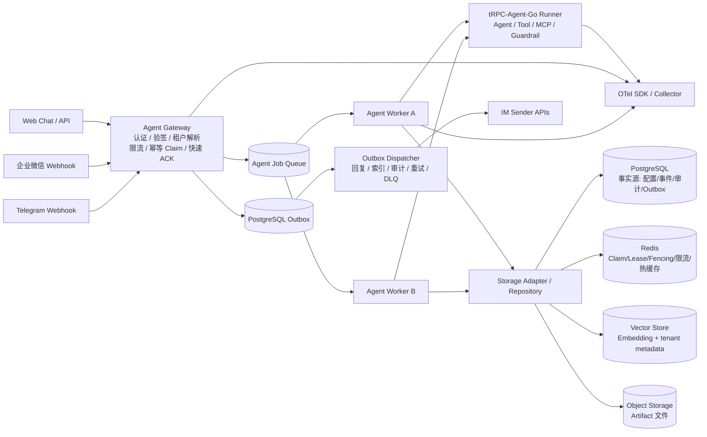
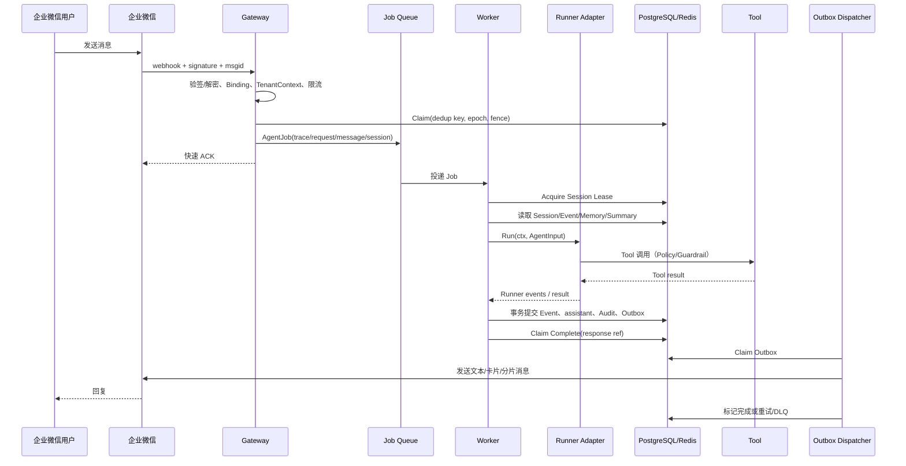

# 多租户节点化 Agent 平台架构

> 本文是目标架构和当前实现边界的权威说明。当前代码核对见 [`project-status.md`](project-status.md)，实施顺序见 [`implementation-plan.md`](implementation-plan.md)。

## 1. 设计目标与边界

平台面向多个租户提供可配置的 Agent 应用。每个租户可以绑定一个或多个 IM 应用、选择数据后端、发布 Agent 版本并配置工具与治理策略。平台的关键约束是：Worker 无状态、租户边界不可绕过、消息至少一次投递下业务幂等、同一 Session 不发生并发覆盖、外部发送可重试且可追踪。

首个生产版本的范围：Web Chat、企业微信、Telegram；PostgreSQL 作为业务事实源，Redis 作为协调和热数据层，一个向量后端和一个对象存储实现；tRPC-Agent-Go Runner、Tool/Guardrail、审计、OTel、Docker Compose 和基本恢复流程。

不在首个生产版本：多 Region 强一致、微信公众号/微信客服、任意 Shell 或代码执行工具、未经认证的公网管理接口、让 Agent 自主修改租户配置。

## 2. 当前状态摘要

P0-01 至 P0-06 已完成：质量基线、租户和领域模型、存储契约、PostgreSQL 迁移，以及 Redis/PostgreSQL Claim、Lease、epoch/fencing、故障切换、熔断和三维限流。它们组成后续实现的基础层。

当前主进程仍是同步演示链路：`MemoryStore -> platform.Runner -> EchoResponder`。`DATABASE_URL` 目前只启用迁移 readiness，不会切换业务 Repository。`channels` 中的企业微信和 Telegram 是最小协议占位，不能用于真实平台接入。

目标架构从 P0-07 开始实现，不改变已发布的 v1 Session ID、DedupKey、Claim 和 Lease 语义；需要扩展时使用版本化字段和向前兼容迁移。

## 3. 逻辑拓扑



### 组件职责

| 组件 | 负责 | 不负责 |
| --- | --- | --- |
| Gateway | 入口认证、Channel 验签、Binding 解析、租户 Context、body 限制、限流、Dedup Claim、Job 投递、Web 快速响应 | 模型调用、长时间 Tool 执行、直接信任请求中的 tenant ID |
| Channel Adapter | 外部协议解析、签名/加密、身份和会话 scope 提取、消息能力声明、发送请求构造 | 租户配置存储、Agent 决策、跨租户查询 |
| Agent Job Queue | 投递、可见性超时、重试、消费者竞争和分区提示 | 业务事实数据、最终 IM 发送状态 |
| Worker | 获取 Job、Session Lease、加载配置和上下文、运行 Agent、提交事件、创建 Outbox | 保有本地 Session 作为事实源、绕过 fencing 提交旧结果 |
| Runner Adapter | 将平台 `AgentInput` 映射到 tRPC-Agent-Go Runner，消费 Event，传播 Context 和 trace | 决定租户权限、直接读写未授权后端 |
| Storage Adapter | 根据 BackendPolicy 路由 Repository，强制 tenant 条件，管理事实源和索引边界 | 隐式猜测租户、允许调用方覆盖向量过滤条件 |
| Outbox Dispatcher | 使用租户和消息 dedup key 发送回复、索引 Memory、投递审计，处理有限重试和 DLQ | 在没有 Outbox 记录时直接发送不可追踪消息 |
| Admin API | 租户、Agent、Binding、配置版本、发布/回滚、审计查询 | 接受未经鉴权的租户创建或改变已提交 Session 的 Agent 版本 |
| Telemetry | Trace、Metric、结构化日志、成本和审计关联 | 写入 Secret、完整 Prompt、Authorization 或未脱敏文件内容 |

Worker 之间不使用 sticky session。共享 Session/Memory 和 Lease 使 Worker 可以水平扩展；Lease 只用于同一 Session 的执行串行化和故障接管，不能替代事实源事务。

## 4. 租户边界

入口在签名验证或 API 鉴权后解析 `TenantContext`。Context 至少包含：`TenantID`、`AgentAppID`、`BindingID`、Channel、外部/内部用户、外部 Chat、SessionID、RequestID、MessageID、TraceID、配置版本、权限和 BackendPolicy。

所有下列边界都必须带 `tenant_id`：

- PostgreSQL 主键条件、外键条件、索引和未来的 RLS session variable。
- Redis key：固定前缀 `tenant:{tenant_id}:...`，禁止使用用户输入拼接未校验的全局 key。
- 对象 key：`tenants/{tenant_id}/artifacts/{artifact_id}`，Presigned URL 必须二次校验。
- 向量 metadata：写入不可缺失 `tenant_id`，查询 filter 由服务端生成且不可被调用方覆盖。
- 日志、Trace、Audit 和指标：tenant 作为受控属性；高基数的外部 ID 只做脱敏或采样记录。
- Tool 凭据：只通过 Secret Manager 引用注入，不能由用户文本或模型输出决定。

Repository 和 Adapter 即使收到已验证 Context，也必须做二次校验。任何跨租户 ID、Binding、Session 或 Artifact 访问都返回拒绝，而不是返回空结果。

## 5. 核心领域模型

当前领域包和迁移已固定以下关系，后续实现应以它们为基础：

```text
Tenant 1 --- N AgentApp 1 --- N AgentRelease
Tenant 1 --- N ChannelBinding 1 --- N UserIdentity
Tenant 1 --- N Session 1 --- N SessionEvent
Tenant 1 --- N Memory
Session 1 --- 1 Summary
Session 1 --- N Artifact
Tenant 1 --- N AuditLog
Tenant 1 --- N OutboxMessage 1 --- 0..1 DeadLetter
Tenant 1 --- N CoordinationEpoch
Session 1 --- 0..1 SessionLease
```

### 关键字段和约束

- `Tenant`：状态、配置版本、默认 Agent、BackendPolicy、预算。
- `AgentApp`/`AgentRelease`：Agent 版本、模型配置引用、System Prompt 引用、Tool Policy、Guardrail。
- `ChannelBinding`：Channel、外部 App/Bot ID、Secret 引用、启用状态；外部 App 在租户内唯一。
- `Session`：Agent 版本、Channel、Binding、外部 Chat/User、state version、summary version、last event sequence。
- `SessionEvent`：不可变 event ID、Session sequence、event type、message/execution/parent event ID、attempt、trace ID、脱敏 payload。
- `message_dedup`：`tenant + channel + binding + external_message_id` 唯一；Claim 状态为 acquired/in_flight/completed。
- `Memory`：session/user/tenant scope、内容、vector ref、version、source sequence、删除标记；PostgreSQL 保存原文事实。
- `Summary`：covered sequence 和 version；只能使用“比现有 covered sequence 更新”的写入覆盖。
- `Artifact`：对象 key、MIME、大小、SHA-256、状态和过期时间；数据库保存元数据，二进制在对象存储。
- `AuditLog`：trace/request/execution、租户、Channel、用户、Session、Agent、Tool、decision、延迟、成本、错误和脱敏 metadata。
- `OutboxMessage`：kind、aggregate、payload、attempt、next attempt、lock 和状态；同一业务动作使用 dedup key。

PostgreSQL 迁移已经创建这些表；完整 Repository 和事务编排仍是后续任务。

## 6. 一致性和协调

### 6.1 入站幂等

Gateway 验证 Binding 后，以 `(tenant_id, channel, binding_id, external_message_id)` 进行 Claim。首次 Claim 获得 owner、epoch 和 fencing token；重复消息：

- `completed`：返回已保存的 response reference，不能再次运行 Agent。
- `in_flight`：返回已接受或由平台重试；不能启动第二个执行。
- Claim 过期：只有符合 takeover 条件的新 owner 才能接管，旧 owner 的 token 不能完成或失败该 Claim。

Claim 记录和事件写入应在生产 Repository 中形成可证明的事务边界；外部 IM 的“已发送”仍以 Outbox/dedup 处理至少一次语义。

### 6.2 Session 串行化

Session ID 的 v1 规则为：

```text
base64url(SHA-256("v1|" + tenant_id + "|" + channel + "|" + binding_id + "|" + scope))
```

私聊 scope 为外部用户；群聊 scope 为外部群；Telegram Forum Topic 需要再加入 `message_thread_id`。同一 Session 获取带 epoch/fencing 的 Lease，执行期间续租；Lease 续租失败或 epoch 被提升时必须取消 Context。提交事件、状态版本和 assistant 结果时再次校验 fencing，旧 Worker 必须被拒绝。

### 6.3 事件、状态和 Summary

建议的事件顺序为：

```text
user.received -> agent.started -> tool.started/tool.completed -> assistant.completed
                                                \-> agent.failed
```

Session event sequence 由事实源分配并受唯一约束保护。Assistant 事件和 Session 状态更新在有限事务中提交，不能持有模型执行期间的长事务。Summary 在事件提交后异步生成，按 `covered_seq` 单调更新；Summary 过期或生成失败不能阻止事实事件读取。

### 6.4 后端职责

| 后端 | 事实/加速职责 | 一致性策略 |
| --- | --- | --- |
| PostgreSQL | 租户、配置、Agent release、Session、Event、Memory 原文、Summary、Artifact 元数据、Audit、Outbox、DLQ | 事务、CAS、唯一约束、行锁；后续启用 RLS |
| Redis | Claim、Lease、epoch、fencing、限流、热 Session/配置缓存和 Job 协调 | Lua/CAS、TTL、失败关闭；不可作为唯一业务事实源 |
| Vector DB | Embedding 和带租户过滤的索引 | 最终一致；写入失败由 Outbox 重试，回退 SQL 最近记忆 |
| Object Storage | 文件和大 Artifact 内容 | 内容 hash、租户前缀、短期签名 URL、生命周期清理 |

Redis 到 SQL 迁移按租户/Session 回放事件，双写期间做 checksum 和读比对，验证后切读。向量迁移从 SQL 原文重新 embedding 并批量 upsert，不复制向量库内部结构。

## 7. 消息链路



`trace_id` 在 webhook、Job、Worker、Runner、Tool、Repository 和发送端传播；`request_id` 标识入口请求，`message_id` 标识外部消息，`execution_id` 标识一次 Agent 执行，`outbox_id` 标识一次可重试外部动作。

## 8. IM Adapter 设计

### 企业微信

Adapter 必须支持回调 URL 校验、`token/timestamp/nonce/signature` 验证、加密回调解密、文本/图片/文件/群聊消息解析、消息 ID 去重和超时内 ACK。模型执行不得阻塞平台回调窗口；回复通过 Outbox 调用企业微信发送 API，并处理消息长度、频率限制、429/5xx 和分片。

### Telegram

Adapter 必须校验 `X-Telegram-Bot-Api-Secret-Token` 与 Binding Secret，按 `update_id` 幂等，解析 private/group/supergroup/topic scope，使用 Bot API 发送回复，并处理 `retry_after`、400/403、消息长度和文件下载取消。Telegram username 不能作为稳定主身份，主身份使用 Bot API 提供的 numeric ID。

两类 Adapter 都不能从 payload 接受 tenant ID；租户必须由 webhook path 的 external app/bot ID 和服务端 Binding 映射得到。

## 9. Agent、Tool 与治理

`AgentRuntime` 接口负责平台与 tRPC-Agent-Go 的适配：创建租户/Agent 版本对应的 Runner，传递 Context，消费并排空 Event channel，将模型/Tool 错误映射为平台事件。所有 goroutine 都必须有 owner、取消路径和退出测试。

Tool 执行前按 `TenantContext` 和 Agent Release 的 Tool Policy 做白名单、参数 schema、用户权限和预算检查。危险操作需要审批 token，首个生产版本默认关闭任意 Shell/代码执行。Guardrail 覆盖模型输入、Tool 参数、Tool 输出和最终回复；日志/Trace/Audit 只保留脱敏后的摘要、hash、长度和决策。

## 10. 可观测性与安全

Trace 至少覆盖入口、Claim、Lease、Runner、模型调用、Tool、Session/Memory 读写、Outbox 和 IM 发送。指标使用低基数标签：tenant 可按受控租户数使用，外部用户、Session 和 message ID 不作为无限增长的 metric label。最低指标集：入口量、Claim 命中率、Lease 冲突、Agent/Tool 延迟和错误、模型 token/cost、Session/Memory/Redis/PostgreSQL 延迟、Outbox retry/DLQ、IM 发送成功率、限流拒绝和 Worker 并发。

Secret 只保存 Secret Manager 引用；错误、日志和 trace 禁止记录 API key、Authorization、IM token、数据库密码、完整 Prompt 和文件内容。审计记录 allow/deny/error、操作者、资源、理由、延迟、成本和 trace 关联，且审计写入失败必须有告警和可恢复路径。

## 11. 故障、恢复和部署

- 模型超时：传播 `context.Context`，有限重试或降级模型；不重试不可重放的 Tool。
- Tool 失败：按工具类型分类，允许 Agent 受控降级；危险 Tool 失败不得自动重复。
- Redis/PostgreSQL 短暂故障：使用有限退避和 readiness；协调状态不确定时 fail-closed，禁止双 owner。
- Worker 故障：Job 可见性超时后重投，依赖 Claim takeover 和 fencing；保留事件与失败审计。
- 外部发送不确定：Outbox 以 provider message key 去重；无法确认时进入 retry/DLQ 并告警，不能无限发送。
- 配置发布：保存 immutable config/release，先校验和健康门禁，再按租户灰度；失败时移动 release pointer，保留旧版本。
- 退出：停止接收新 Job，等待或取消受控执行，停止续租，排空事件和 Outbox 消费，最后关闭 HTTP 和依赖连接。

开发环境以 Docker Compose 提供 PostgreSQL、Redis、向量后端、对象存储和可选 OTel Collector；生产推荐 Kubernetes Deployment + HPA，两个以上 Gateway/Worker 副本，托管高可用 PostgreSQL/Redis，受限网络、Secret Manager、readiness/liveness、备份和恢复演练。

容量以峰值消息速率乘以平均执行时间估算并发，再为重试、工具峰值和故障转移预留至少 30% 余量；租户级并发、token/cost 和 IM 发送配额先于全局容量保护执行。

## 12. 主要风险

| 风险 | 缓解 |
| --- | --- |
| tenant ID 伪造或跨租户读取 | Binding/API 鉴权映射、Context、Repository 二次校验、RLS |
| 重复/乱序消息 | Dedup Claim、Session Lease、事件序号和 fencing |
| Redis 与 PostgreSQL 双 owner | epoch authority、租约校验、fail-closed、故障切换演练 |
| Tool 越权或提示注入 | 白名单、参数校验、审批、Guardrail、默认关闭危险 Tool |
| Secret/Prompt 泄露 | Secret Manager 引用、统一 Redactor、禁止原文日志 |
| 模型超时和成本失控 | Context deadline、租户预算、并发配额、降级和告警 |
| IM 限频和不确定发送 | Outbox、provider dedup key、分片、retry_after、DLQ |
| Summary/Vector 最终一致 | SQL 事实源、covered_seq、Outbox 重建和 SQL 回退 |
| 数据库/Redis 不可用 | readiness、有限退避、备份恢复、迁移和事件回放 |
| 配置误发布 | immutable release、灰度健康门禁、指针回滚和审计 |
| Artifact 越权或恶意文件 | 租户前缀、短期 URL、MIME/大小/hash 检查、生命周期清理 |
| goroutine/Event channel 泄漏 | owner/取消契约、事件排空、race 和故障测试 |
