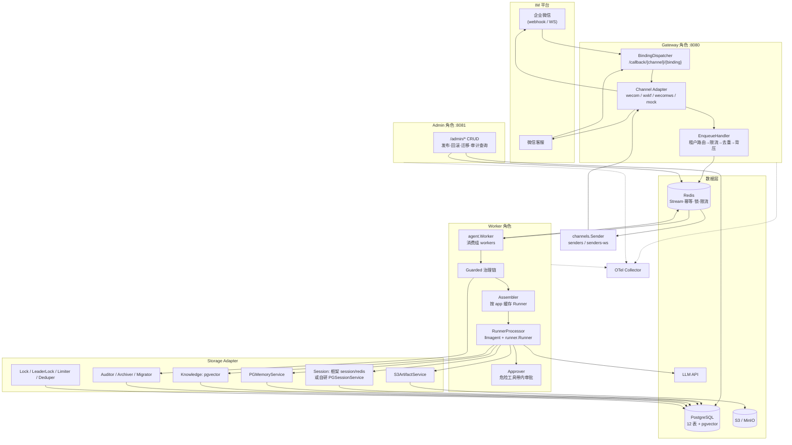
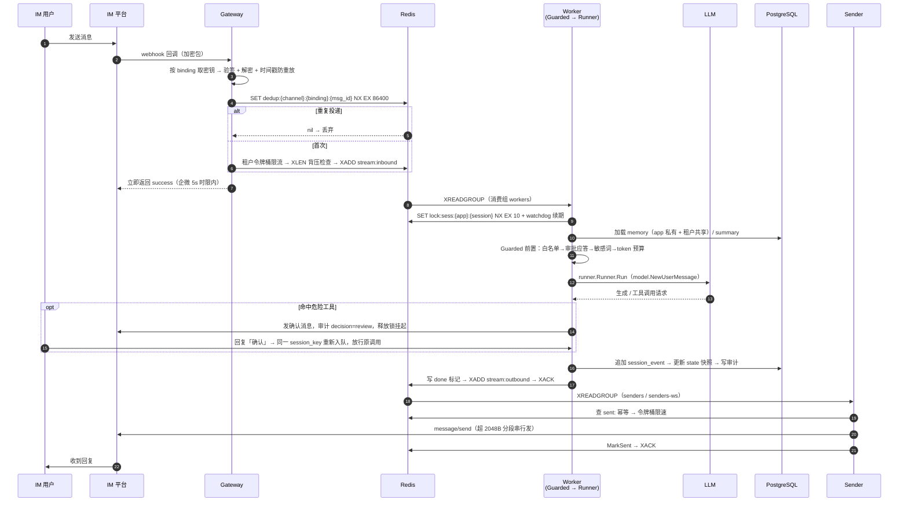

# 架构设计与模块说明

本文按**代码的实际实现**描述平台架构，是 [`design.md`](./design.md)（完整技术方案：选型对比、
容量推算、协议细节、取舍论证）的落地对照版。此处只给结论与代码落点。

## 1. 实现范围

单二进制、多角色：`cmd/trpc-service/main.go` 的 `serve(role)` 支持 `all`（单进程兼任全部角色，
本地演示）、`gateway`（IM 回调接入）、`worker`（Agent 执行）、`admin`（管理 API），生产按角色拆
Deployment 分别扩缩。三个监听口彼此分离，这本身是安全设计：

| 监听 | 环境变量 | 默认值 | 用途 |
|---|---|---|---|
| 回调口 | `TRPC_HTTP_ADDR` | `:8080` | IM webhook，公网可达，靠验签而非 token |
| Admin 口 | `TRPC_ADMIN_ADDR` | `127.0.0.1:8081` | `/admin/*`，Bearer token，仅内网 |
| Metrics 口 | `TRPC_METRICS_ADDR` | `127.0.0.1:8082` | `/metrics`，Prometheus 与探针 |

指标带 `tenant_id` 维度，故单独内网监听、不挂公网回调口。Admin token 未配置时进程**拒绝启动**
（fail-closed），本地须显式写哨兵值 `dev-insecure`，且仅绑 loopback 时接受。

配置全部来自环境变量（`config.Load()` 集中读 60 个 `TRPC_*`，全量参考见 `docs/configuration.md`），仓库内无配置文件。密钥不落库、
不落配置，只存**引用**（`token_ref`/`aeskey_ref`/`dsn_ref`/`TRPC_MODEL_APIKEY_REF`），运行时经
`config.SecretResolver` 解析：本地 `FileResolver`（读 `data/secrets/`）、生产 `KMSResolver`，
两者都套 `CachedResolver`（TTL 1m）。

## 2. 系统架构

| 模块 | 职责 | 与框架的关系 |
|---|---|---|
| `channels` | 四类适配器：验签/加解密、消息归一化、主动发送、分段 | 自建 |
| `web` | Gateway 入站管线、Admin API、多租户回调分发 | 自建 |
| `tenant` | 租户/应用/绑定模型、快照缓存与路由 | 自建（框架无租户概念） |
| `agent` | Worker 消费、Assembler 装配、Guarded 治理、Approver 审批 | 复用 `llmagent`+`runner`+`tool.Callbacks` |
| `storage` | Session/Memory/Knowledge/Artifact 多后端 + 审计/归档/迁移/锁 | 实现框架 `session`/`memory`/`artifact` 接口 |
| `tool` | 工具注册表、租户级白名单、危险工具标记 | 复用 `tool/function` |
| `metrics` `log` | OTel 初始化、Prometheus 指标、zap 脱敏 | 复用 `telemetry/trace` |

**租户与 session 路由**：回调路径 `/callback/{channel}/{binding_id}` 是唯一入口凭据。
`tenant.Resolver` 维护租户/应用/绑定的全量内存快照（TTL 30s + Redis pub/sub `tenant:invalidate`
失效广播），按 `webhook_path` 查出绑定行，把 `tenant_id`/`app_id`/`binding_id` 盖到归一化消息上，
随 Stream JSON 透传到 Worker。session 身份是 `(app_id, session_key)`，app 隶属租户，故**跨租户
天然隔离**——同一微信用户出现在两个租户的渠道里，落在两个不同 app 命名空间下。

**不需要 sticky session**：Worker 无状态，session 与 memory 都读共享后端，任意节点可接管任意会话；
代价是必须处理并发写同一会话（见第 5 节）。

## 3. 核心链路时序

**`trace_id` 贯穿异步边界**：Gateway 入队前生成 span，把 W3C `traceparent` 写进 Stream 消息体；
Worker 消费时 `Extract` 续链，之后 `runner`/`tool`/`model` 调用由框架 `telemetry/trace` 的 Hooks
自动产生子 span；Sender 同样从消息体续链。单条 trace 因此串起「回调 → 队列 → Runner → Tool →
Session/Memory 读写 → IM 回复」，`trace_id` 同时落 `audit_log` 供对账。OTLP Collector 是**硬依赖**，
不可用时进程拒绝启动。

## 4. 数据模型

Schema 见 `deploy/db/init.sql`——冻结的 **000001 基线**，12 张业务表加一张 `schema_migrations`
版本表；`seed.sql` 灌演示租户。基线之后的变更一律以编号迁移落在 `deploy/db/migrations/`，由
`deploy/db/migrate.sh`（golang-migrate）应用，CI 同步执行，`init.sql` 本身不再改。

| 表 | 说明 | 关键约束 |
|---|---|---|
| `tenant` | 租户 + 6 个 JSONB 策略列：`model_config`/`tool_policy`/`audit_policy`/`guardrail_policy`/`rate_policy`/`storage_config` | `id` 主键 |
| `agent_app` | 应用与版本配置（prompt/模型/工具） | `(tenant_id,name,version)` 唯一；`(tenant_id,name) WHERE status='published'` 部分唯一索引，同名应用最多一个已发布版本 |
| `channel_binding` | 渠道↔应用绑定，密钥字段只存引用 | `webhook_path` 全局唯一 |
| `session` | 会话状态快照 | `(app_id,session_key)` 唯一 |
| `session_event` | 事件流水，**只追加写** | `(session_id,event_seq)` 唯一 |
| `memory_item` | 记忆；`app_id` 非空为应用私有、NULL 为租户共享；软删除 | 部分索引 `(tenant_id,user_id,app_id) WHERE deleted_at IS NULL` |
| `memory_embedding` | `vector(1536)` + HNSW，异步写入 | `memory_id` 唯一 |
| `summary` | 摘要 + `covered_event_id` 压缩游标 | `session_id` 主键 |
| `audit_log` | 审计明细：`tenant_id`/`channel`/`user_id`/`session_id`/`agent_name`/`tool_name`/`decision`/`latency_ms`/`error_type`/`cost`/`prompt_tokens`/`completion_tokens`/`trace_id`/`detail` | `(tenant_id,created_at)`、`trace_id` 索引 |
| `storage_migration` | 后端迁移状态机 | `(tenant_id,resource)` 活跃唯一 |
| `*_archive` ×2 | `session_event`/`audit_log` 同构归档表，月度搬运 | 无外键，避免阻塞归档 |

`session_event` 不用声明式分区：PG 要求分区键包含在所有唯一约束中，与 `(session_id,event_seq)`
幂等约束冲突，**保约束弃分区**，改用 `Archiver` 分批搬运（`INSERT...SELECT` + 限流 `DELETE`）。

| Redis Key | 类型 | TTL | 用途 |
|---|---|---|---|
| `stream:inbound`/`outbound`/`deadletter` | Stream | MAXLEN ~100000 | 入站、出站、死信队列 |
| `dedup:{channel}:{binding}:{msg_id}` | String | 24h（wxkf 4 天） | 入口幂等，挡 IM 重推 |
| `done:{channel}:{binding}:{msg_id}` | String | 24h（wxkf 4 天） | 执行层幂等，挡 Stream 重投 |
| `sent:{channel}:{binding}:{msg_id}` | String | 24h（wxkf 4 天） | 出站幂等，防重复回复 |
| `lock:sess:{app_id}:{session_id}` | String | 10s | 会话锁，watchdog 每 TTL/3 续期 |
| `lock:leader:{name}` | String | 15s | wecomws leader 竞选 |
| `approval:{app_id}:{session_key}` | Hash | 5min | 危险工具待审批 |
| `tenant:invalidate` | Pub/Sub | — | 配置失效广播 |

幂等键都带 `binding` 维度：`msg_id` 唯一性由 IM 按 corp/应用保证，同一数字 ID 可合法出现在同通道的
两个绑定上。锁带 `app_id` 维度同理——一个租户的长任务不该让另一个租户排队。

## 5. 多后端适配与数据同步

| 角色 | 实现 | 承载数据 | 一致性语义 |
|---|---|---|---|
| 热数据/协调 | Redis | Stream、幂等键、会话锁、限流令牌、leader 锁、审批记录；可选作 session 后端（框架 `session/redis`） | 单线程串行 → 操作级强一致；哨兵切换窗口可能丢少量异步复制写，由事件唯一约束兜底 |
| 结构化数据 | PostgreSQL | 租户/应用/绑定、`session_event`、state、memory、summary、audit_log | 单库事务强一致（事件追加与快照更新可同事务）；memory 读强制走主库 |
| 向量检索 | pgvector | Knowledge 向量、`memory_embedding` | 最终一致：embedding 异步生成、召回滞后秒级；按 `embedding_id` 回表读 content 走强一致 |
| 对象存储 | S3 / MinIO | Artifact、IM 素材 | 写后读强一致；不做元数据索引（元数据在 PG） |

租户级选择收敛为**受控菜单**（`tenant.storage_config`）：session 二选一（redis/pg）、knowledge
二选一（pgvector/qdrant，后者仅接口预留）、artifact 固定 s3。多数租户该字段为空走默认栈；例外由运维
经 Admin API 设置，连接串只存 `dsn_ref`，且**禁止改配置生切**。

**统一语义「事件追加 + 状态快照」**：`session_event` 是唯一 source of truth，`session.state` 只是
物化快照。更新顺序固定为「加锁 → 追加 event → 更新 state → 推进 summary 游标 → 释放锁」；崩溃后以
event 重放重建 state，且从 `summary.covered_event_id` 之后增量重放，长会话不做全量重放。

**并发写同一 session**：`SET NX EX 10` 加锁，拿不到锁短暂自旋、超时重新入队而非报错；watchdog 每
TTL/3 续期（长工具调用不掉锁），Worker 崩溃则锁随 TTL 过期不死锁；释放用 Lua 校验 value 是自己的
再 DEL，防误删他人锁。锁失效的极端场景由 `(session_id,event_seq)` 唯一约束兜住。

**三层幂等，职责不同**：入口层 `dedup:` 挡 IM 重推（企微重推间隔可达分钟级、最多 3 次，TTL 24h
覆盖全窗口，wxkf 例外——游标丢失时 `sync_msg` 会重拉 3 天历史，其三层幂等键 TTL 加宽到 4 天）；执行层 `done:` 挡 Stream 重投——重投会触发全新 LLM 运行和全新事件 ID，事件唯一约束在
这种场景数学上永远拦不住，`done` 标记才是真正实现，唯一约束只兜「同一事件对象被重复追加」；出站层
`sent:` 发送成功先写标记再 XACK，「发送成功但 ACK 前崩溃」的重投不会让用户收到重复回复。

**背压界定「不丢」的边界**：`XADD` 前查 `XLEN`，达上限 80% 即拒收并返回 IM 失败让其重推；入队前还有
租户级令牌桶，防单租户灌量撑满全局队列波及其他租户。背压生效期间消息进不了队，也就不存在被 MAXLEN
截断的可能；触达截断的极端场景按 SLA 接受丢失、告警，并用 `dedup:` 与 `session_event` 对账定位。

**后端迁移**（`storage.Migrator` + `FanoutSessionService`）：状态机
`dual_write → backfilling → observing → done`——双写开启（读仍走旧后端）→ 回填存量（只搬发起时刻
水位线之前的数据，增量归双写，撞同一 `(session_id,event_seq)` 时 `ON CONFLICT DO NOTHING`）→
质检通过才切读（比对每 session 事件数、`max(event_seq)`、state hash、summary 游标）→ 观察窗口后
停双写。半边失败以读端后端为权威：写权威失败则整体失败、消息不 XACK 重试；写另一端失败不阻塞主流程，
进补偿队列重放。Migrator 用 `FOR UPDATE SKIP LOCKED` 选主，多副本安全。

## 6. IM 通道接入

已实现四类适配器，对上层暴露统一归一化消息模型（channel、msg_id、binding_id、session_key、
user_id、内容类型、reply_token），差异收敛在适配器内部：

| 维度 | `wecom` 企微自建应用 | `wxkf` 微信客服 | `wecomws` 企微智能机器人 | `mock` |
|---|---|---|---|---|
| 连接方向 | IM 回调平台 | IM 回调平台 | **平台主动出站长连接** | 本地 HTTP |
| 协议 | 加密 XML，AES-256-CBC + msg_signature（`wxbizmsgcrypt`） | XML 事件回调 + `kf/sync_msg` 拉取（见下方实测状态） | WS 帧，BotID/Secret 订阅鉴权 | 明文 JSON |
| 应答约束 | **5 秒内应答**，重推 ≤3 次 | 返回 200 即可，无业务时限 | 无（且无平台重推） | — |
| 回复方式 | `message/send`（单聊，审批通知渲染 template_card 卡片）/`appchat/send`（群聊） | `kf/send_msg`，48h 窗口内 | `aibot_respond_msg` **stream** 类型，须透传回调 `req_id` | 内存收件箱 |
| 会话形态 | 单聊 + 群聊 | 仅单聊 | 单聊 + 群聊 | 任意 |
| 媒体 | 已支持（`media/get` → Artifact） | 非文本降级为占位文本（媒体拉取是 follow-up） | 降级为占位文本 | — |
| 启用条件 | 配 `TRPC_WECOM_CORP_ID` | 配 `TRPC_WXKF_CORP_ID`+`KF_ACCOUNT` | 配 `TRPC_WECOMWS_ADDR` | **默认关闭** |
| **实测状态** | 未实测；协议与官方文档逐项核对无发现 | 未实测；inbound 已重写为官方 event+pull 协议 | **已端到端实测**（2026-09-07：订阅、心跳、收发、审批外链路均验证） | 实测（全链路） |

> **实测状态说明**：`wecomws` 在真实企微智能机器人上完整走通（发现并修复了 5 个协议 bug：
> 握手头大小写、订阅 ack 无 cmd、errcode 位置、心跳 req_id 前缀约定、回复必须是 stream 类型——
> 明文 `text` 回复被平台以 errcode 40008 拒收）。`wecom` 的加解密、URL 验证、5s 应答、
> `message/send`/`appchat/send`（均支持 markdown、内容 ≤2048B）、`media/get`、撤回事件
> 逐项对照官方文档无发现，但**没有真实 corp 验证过**。`wxkf` 初版曾误判 inbound 为「加密 JSON
> 直推」，已重写为官方「`kf_msg_or_event` 事件回调 + `kf/sync_msg` 拉取」协议（游标持久化、
> 幂等 TTL 加宽到 4 天），未经真实客服账号实测。

四类通道统一走「异步消费 + 主动发送」：LLM 生成 P95 远超企微 5s 应答时限，且被动回复一次回调只能回
一条，覆盖不了分段与审批等多轮场景。

**`session_key` 规则**（`channels.SessionKey`）：单聊 `dm:{channel}:{external_userid}`，群聊
`group:{channel}:{chatid}`（全群共享上下文，需按人隔离的租户可配 `group:{channel}:{chatid}:{user}`）。
平台 `user_id` 取 `{channel}:{external_userid}`——同一用户在两通道下是两个平台用户，天然不串会话；
前缀不是冗余：`memory_item` 按 `(tenant_id,user_id,app_id)` 检索、不带 channel 维度，前缀保证跨通道
身份不会合并记忆。

**平台限制与对策**：2048 字节长度上限 → `channels.SplitText` 按字节切（UTF-8 不切坏），在同一条出站
消息处理内**串行**分段发送，分段共享同一 trace；发送接口限流 → `senders` 按 `{channel,tenant}`
令牌桶限速，超限在 Stream 内排队不丢弃；图片/文件只给 `media_id` → 拉素材落 Artifact，消息体只带
引用；格式能力不一（企微支持 markdown、微信客服不支持）→ 通道级渲染降级；撤回事件 → 记审计并在 state
打标记，不回删 event。出站错误经 `channels.ScrubError` 打码 URL 里的密钥后才落日志。

**危险工具带内审批**（`agent.Approver`）：工具用 `Dangerous` 标记，经框架
`tool.Callbacks.RegisterBeforeTool` 拦截。命中后当轮收尾：发确认消息、写
`approval:{app_id}:{session_key}`（带 app 维度，跨租户即使会话键相同也互不可见）、审计记
`decision=review`、**释放会话锁**——挂起期间不持锁，Worker 保持无状态。用户回复作为普通消息进入同一
`session_key`，仅精确匹配「确认/拒绝」才消费为答复，**非答复消息不打断审批**；同一会话同时只允许一个
pending，冲突直接 `deny`（`error_type=approval_conflict`）；超时 5 分钟按拒绝记 `review_timeout`；
群聊仅发起人或租户配置的审批人确认有效。

**`wecomws` 特殊性**：企微每 bot 只允许一条连接、新连接踢旧连接，故全局单 leader 持有全部连接
（`storage.LeaderLock`：SetNX 带抖动竞选 + TTL/3 续期 + Lua owner 校验释放），leader 循环内嵌于
gateway 副本，其余副本空转待命。出站用独立消费组 `senders-ws`，`Sender` 参数化 `Group` 与 `Skip`
钩子分流，不变量是 **Skip 命中必须 ack**，否则会被 reaper 抢走、误入死信。WS 入站无平台重推，
`Handle` 失败在读循环内退避重试（1s 倍增、封顶 30s），但**最多 5 次**（`inboundRetryMax`），
超限大声丢弃并记 error——派发 worker 是串行的，无界重试会让一条毒消息劫持该连接上所有后续消息。
重试耗尽与重试期间崩溃都会丢该条消息，二期方向是落独立 Redis list 重放。

## 7. 治理、可观测与审计

**治理链**（`agent.Guarded`）是平台自建包装链，未用框架 Plugin/Guardrail 扩展点，顺序为：记忆召回 →
租户策略加载 → 用户白名单（`guardrail_policy.input_allow_users`）→ 审批应答匹配 → 输入敏感词 →
token 预算 → 内层 Processor → 输出脱敏与拒绝词 → 审计落库。工具权限用
`tool.Registry.Allowed(policies...)` 两级过滤：`tenant.tool_policy.allow` 先收窄，
`agent_app.config.tools` 再收窄，非空 Allow 即白名单。模型端点受平台级白名单约束
（`TRPC_MODEL_BASE_URL_ALLOW`，须 https 且 host 精确命中），Admin 写路径与 Worker 装配时**双重
校验**——会话原文全部流向该端点，端点选择权必须留在平台层。

**指标**（OTel + Prometheus exporter，带 `channel`/`tenant_id` 标签）：`im_inbound_total`、
`im_dedup_dropped_total`、`im_outbound_total`、`im_end_to_end_duration`、`worker_process_duration`、
`worker_process_error_total`、`llm_tokens_total`、`gateway_rejected_total`、
`send_rate_limited_total`、`audit_dropped_total`，执行链路细分指标 `llm_call_duration`
（模型调用耗时，tenant_id/model/result）、`tool_call_duration`（工具调用耗时，
tenant_id/tool/result，经框架 tool/model Callbacks 埋点）、`session_store_duration`
（Session 后端读写延迟，backend/op/result，存储装饰器埋点）、`llm_cost_usd_total`
（每租户成本，tenant_id/model），队列采集器每 15s 产出 `stream_length`、
`stream_pending`、`stream_oldest_pending_seconds`。`deploy/prometheus/alerts.yml` 提供 12 条告警
规则（积压、pending 卡死、死信、端到端 P95、错误率、投递成功率、模型调用 P95、Session 后端
错误率等；逐条处置手册见 `docs/operations.md` §4）。

**审计**分两路：常规 `allow` 事件走内存缓冲异步批量写（满 100 条或 1 秒触发），不在关键路径上；
`deny`/`review`/`review_timeout`/危险工具调用等关键决策**同步写入**，宁可增加毫秒级延迟也不接受丢失
（合规红线）。`cost` 由 `agent.CostUSD` 按 `TRPC_MODEL_PRICES` 计价；Admin 写操作记变更前后内容到
`audit_log.detail`。

**日志脱敏**（`log.redactCore`）在 zap Core 层按**字段名精确匹配**（token/secret/api_key/password/
aeskey/authorization/cookie 等）替换为 `***`，覆盖 `Write` 与 `With` 两条路径，配合 `ScrubError`
处理 URL 内嵌密钥。OTel span 属性走白名单制。

## 8. 故障恢复与运维

| 故障场景 | 检测 | 动作 | 用户感知 |
|---|---|---|---|
| Worker 节点故障 | 消费组 pending 超时 | 存活节点 `XAUTOCLAIM` 接管，state 从 event 重放 | 延迟数秒，不丢 |
| IM 重推回调 | `dedup:` 命中 | 丢弃并返回 success | 无感知 |
| PG 短暂不可用 | 写失败/超时 | 指数退避重试；消息不 XACK 留在 Stream，持续故障则暂停消费并告警 | 回复延迟 |
| Redis 不可用 | 连接失败 | 无法去重入队，返回 IM 失败让其重推 | 回复延迟 |
| 模型超时 | context deadline（默认 60s） | 取消本次生成、重试 1 次；仍失败回「服务繁忙」并记审计 | 降级回复 |
| 工具执行失败 | tool 返回 error | 失败结果回灌 LLM，由模型如实告知；危险工具不自动重试 | 说明性回复 |

**Go 并发安全**（Worker 是长进程，泄漏会累积）：Runner 传入带 deadline 的 `context.Context`，取消
信号沿 Runner → Tool → HTTP 全程传播；`runOnce` 保证**事件通道消费到关闭**，提前取消也排空，否则框架
侧 goroutine 阻塞泄漏；watchdog、流式转发等附属协程随会话结束统一回收，禁止 fire-and-forget 起裸
goroutine；退出时先停拉新消息、排空在途会话再退出。专门盯 goroutine 数作泄漏监控。

**灰度与回滚**：`agent_app` 新版本先存 `draft` → 仅对灰度租户 `published` → 观察该租户错误率、延迟、
token 成本 → 无异常全量；切换原子（部分唯一索引保证同名最多一个 published）。回滚即把旧版本重新置
`published`，经 pub/sub 广播失效，Worker 立即丢缓存、下次请求重载，秒级生效（TTL 自然过期作兜底）。
重载失败时继续服务旧快照（stale beats down）并按 `ReloadBackoff`（默认 5s）推迟重试，避免 PG 故障期
每个请求都在写锁下重跑四表全量加载。Gateway/Worker 无状态滚动更新，在途消息靠 Stream pending 交接。

**容量**（假设 50 租户、峰值 1000 msg/s、每条 2 轮 LLM 调用约 2500 token）：Redis 峰值约 10k ops/s，
单实例余量一个数量级，无需集群；PG 峰值写入 <5k TPS（审计已批量折算），单实例可承担；Worker 瓶颈是
LLM 生成时长而非 CPU，单节点 200 并发 session × 10 节点 = 2000 并发；事件约 5KB/条、日均 43GB，靠
月度归档控制在线量（保留 1 个月约 1.3TB）。HPA 按 Stream 积压扩容，CPU 仅兜底——负载大头是等 LLM 的
IO，CPU 低不代表有余量。

**部署**：最小可运行 = `docker-compose.yml` 起五个依赖容器 + 本机 `./start.sh` 跑 all-in-one；
生产用 `deploy/k8s/`（三角色 Deployment、worker HPA 2–10 副本、幂等 db-init Job、Ingress 唯一公网
入口，KMS bootstrap token 挂 `/etc/trpc/secrets`）。部署与回滚的操作手册见 `docs/operations.md`，
K8s 清单说明见 `deploy/k8s/README.md`。

**质量门禁**：CI（`.github/workflows/test.yml`）起真实 pgvector + Redis + MinIO 跑全量
`go test -race`，zero-skip、总覆盖率 ≥85% 且只升不降、PR 增量 ≥85%（实测 87.5%）；
检查项细节与本地自查方式见 `docs/development.md` §2。

## 9. 风险清单

| # | 风险 | 影响 | 缓解措施（代码落点） |
|---|---|---|---|
| 1 | Redis 单点故障 | 去重、队列、锁、限流全失效 | 生产部署哨兵；故障期返回失败利用 IM 重推兜底 |
| 2 | 分布式锁失效（watchdog 崩溃、TTL 过短） | 同一会话被两个 Worker 并发写 | `storage/lock.go` 续期 + Lua 安全释放；事件唯一约束兜底，state 重放修复 |
| 3 | Stream 积压（Worker 打满、下游故障、单租户灌量） | MAXLEN 截断丢消息并波及其他租户 | 租户令牌桶 + 80% 背压拒收；积压与最老 pending 告警；HPA 扩容；死信人工介入 |
| 4 | `session_event`/`audit_log` 膨胀 | 查询变慢、成本失控 | `storage.Archiver` 月度搬归档表；按 `audit_policy` 配保留期 |
| 5 | LLM 超时、限流、成本失控 | P95 破 15s，租户账单超标 | context deadline + 重试 1 次；`storage/budget.go` 预算；`llm_tokens_total` 按租户告警 |
| 6 | KMS 不可用 | 验签解密失败，渠道收发全停 | `CachedResolver` 短 TTL 缓存；轮换期双引用并存；本地 FileResolver 兜底 |
| 7 | 密钥泄漏进日志或 trace | 触碰合规红线 | 密钥只存引用；`log.redactCore` 脱敏；`ScrubError` 打码 URL；span 属性白名单 |
| 8 | 租户误改 `storage_config` 路由到错误后端 | 会话/记忆读不到，表现为数据丢失 | 强制走 Migrator 四步流程，禁止生切；写操作记审计 |
| 9 | 企微/微信接入依赖（测试号、认证、权限）超预期 | IM 联调阻塞进度 | mock 通道先跑通全链路，真实接入并行开发 |
| 10 | `wecomws` 每 bot 仅一条连接，多副本互斗或 leader 失联 | 企微反复踢线，或切换窗口内停摆 | `lock:leader:wecomws` 单持有者 + 失锁即关连接 + 退避重竞选；`senders-ws` 积压告警 |
| 11 | WS 入站无平台重推 | 重试 5 次耗尽后主动丢弃，或重试期间崩溃丢消息 | 退避重试上限 `inboundRetryMax`=5，超限记 error 日志（可观测可告警）；上限的理由是派发 worker 串行，无界重试会让一条毒消息劫持该连接全部后续消息；二期落 Redis list 重放 |
| 12 | `wecomws` 回复依赖 `req_id` 时效与分条部分失败 | 超窗或中间段失败导致回复缺失 | 重试路径 ≪24h、超窗死信告警；分段失败报 partial delivery 并留 PEL |
| 13 | Admin 错误响应泄漏数据库细节 | 表名/列名/DSN host 被贴进工单群聊 | 驱动原文只进日志，响应体只回 `"<操作名> failed"`；列表接口必须查 `rows.Err()`，否则读失败会答成 200 空列表 |

## 10. 当前边界

如实记录代码现状与方案的差距，均单独立项跟进、不影响验收标准：

- **Agent 编排**只用 `agent/llmagent` 单 Agent，未用 `agent/graph`、Chain/Parallel/Cycle，也未接
  `server/openai`、`server/agui`、`server/a2a`。
- **工具**只有 `tool.DemoTools()` 两个 stub（`get_weather`、`delete_user_data`，后者标记 `Dangerous`
  用于验证审批链路）；未接 MCP。README 目录树中的 `skill/`、`workspace/` 未交付，已从代码树移除。
- **存储后端**实际只有 Redis + PostgreSQL + S3：session 支持 redis/pg，memory/knowledge/audit 仅 PG；
  MySQL/MongoDB/Qdrant/Milvus 未实现（Qdrant 仅接口预留）。
- **通道**为 wecom/wxkf/wecomws/mock 四类，无 Telegram 与微信公众号；`wxkf` 与 `wecomws`
  的非文本入站均降级为占位文本（媒体内容拉取是 follow-up）。
- **通道实测状态**（2026-09-08）：`wecomws` 已在真实企微智能机器人上端到端实测（收发、心跳、审批）；
  `mock` 全链路实测；`wecom` 未实测（协议逐项对照官方文档无发现，需真实 corp 验证）；`wxkf` 未实测——
  inbound 已重写为官方「`kf_msg_or_event` 事件回调 + `kf/sync_msg` 拉取」协议（`next_cursor` 经
  Redis 持久化、三层幂等 TTL 加宽到 4 天以覆盖 3 天重拉窗口），需真实客服账号验证；出站
  `kf/send_msg` 与文档一致。协议细节见 `docs/channels/wxkf.md`。
- **出站发送密钥为通道级**：wecom/wxkf 发送侧 corpsecret 逐字段回退 env 全局配置（回调验签已按 binding
  隔离），同通道接多个 corp 时需补绑定级密钥；企微入站素材拉取仍用全局 token。
- **预算窗口**为「首次使用后 48h 滑动窗」而非自然日，消息粒度前置拦截、run 中无中断点；Allow/Record
  非原子，并发超支可达 N 倍。
- **归档表读路径**只服务 summary 回放——存活超保留期且无 summary 的会话历史不可重放（审计数据在归档表
  完整保留）。
- **Worker 消费串行**，单副本内逐条处理、无租户公平调度；回调链路无 Handler 超时，依赖
  `ReadTimeout`/`IdleTimeout` 兜底；`web` 只有 JSON API，无前端页面。

## 11. 索引

阅读顺序建议：**新接触项目**按 `quickstart` → `guide` → `design`（跑通 → 会用 → 懂原理）；
**接入 IM 通道**直接看 `channels/` 下对应通道的接入文档；**运维与上线**看 `operations`。

| 内容 | 位置 |
|---|---|
| **第一次使用：跑通第一条消息 → 看到回复 → 建自己的租户** | `docs/quickstart.md` |
| **使用与开发指南：危险工具审批、观测、接真实 IM、自定义工具与通道、按角色部署 + Admin API 速查 / 配置 / 排查 / 重置附录** | `docs/guide.md` |
| 完整技术方案、选型论证、容量推算、协议细节 | `docs/design.md` |
| 开发手册：开发环境、测试与 CI 门禁、提交规范（给改代码的人） | `docs/development.md` |
| 环境变量全量参考：每个变量的默认值、必填性与作用（给部署/配置的人） | `docs/configuration.md` |
| Admin API 完整参考：全部端点的请求体、响应结构、错误码（给写管理端/运维脚本的人） | `docs/api.md` |
| 通道接入·企业微信自建应用（webhook）：密钥、回调 URL、实测状态 | `docs/channels/wecom.md` |
| 通道接入·微信客服：event+pull 协议、cursor 管理、48h 窗口 | `docs/channels/wxkf.md` |
| 通道接入·企微智能机器人（WebSocket）：免公网回调、bot 绑定、leader 机制 | `docs/channels/wecomws.md` |
| 运维手册：部署形态、监控告警、值班排查、备份归档（给 SRE/值班） | `docs/operations.md` |
| 安全说明：威胁模型、密钥管理、鉴权与网络边界、合规设计（给安全评审） | `docs/security.md` |
| 数据库 schema 基线 / 演示数据 | `deploy/db/init.sql`、`deploy/db/seed.sql` |
| 增量 schema 迁移（约定、CI、接管老库） | `deploy/db/migrations/README.md`、`deploy/db/migrate.sh` |
| K8s 部署（db-init Job、HPA、Secret 挂载、Ingress） | `deploy/k8s/README.md`、`deploy/k8s/ingress.yaml` |
| 告警规则 / 抓取配置 | `deploy/prometheus/alerts.yml`、`prometheus.yml` |
| 本地依赖编排 | `docker-compose.yml` |
| 作业题目原文（本平台的任务要求） | 仓库根 `README.md` |
