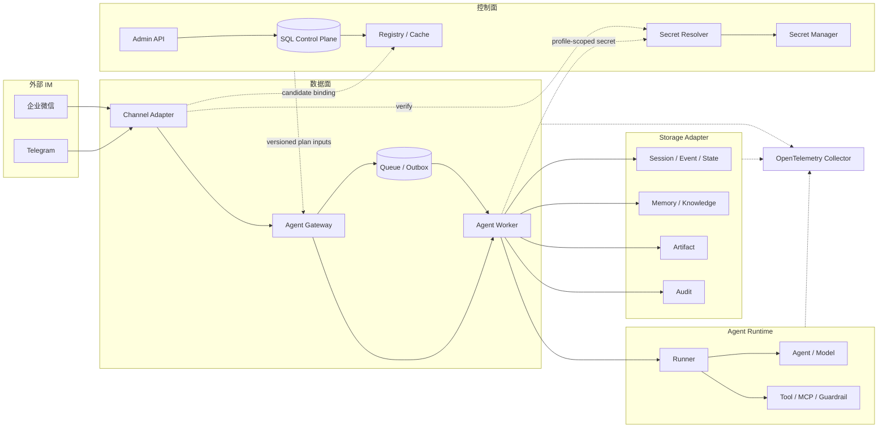

# 生产架构设计

本页描述 tRPC-Agent-Service 的长期生产架构。它回答四个问题：系统如何分层、一次请求如何流转、
租户和运行时状态如何保持边界、平台将如何从当前能力演进到生产规模。

具体 API 字段、数据库表、供应商协议和测试命令属于对应的开发文档；本页只在“实施路线图”中
列出 issue/PR，作为设计到实现的追踪入口。

## 设计目标与原则

平台把 tRPC-Agent-Go 的 Agent 运行时包装成一个多租户、可恢复、可观测的执行平台。设计目标是：

- 租户、应用、版本、模型、后端和通道配置可以独立演进，并且任何请求都不能跨租户读取或执行；
- 一次执行使用开始时确定的不可变配置快照，配置发布、回滚和密钥轮换只影响后续执行；
- Channel、Gateway、Worker、Storage 各自拥有清晰职责，验签、路由、幂等、重试和持久化不重复实现；
- Worker 可以水平扩展，节点故障后能从共享状态和队列恢复，而不是依赖本地内存或 sticky session；
- 业务请求与审计、指标、日志、trace 解耦，telemetry 故障不能阻塞执行或关闭。

三个不变量贯穿所有实现：

1. **身份先于执行**：外部输入只能发现候选绑定；只有完成协议校验和验签后，才能建立可信的
   `tenant_id`、`binding_id` 和执行主体。
2. **快照先于副作用**：Gateway 在执行开始时装配 `ExecutionPlan`，Worker 只使用该 plan，
   不在执行中重新读取“当前配置”。
3. **共享状态是真相**：Session、幂等、队列、Outbox 和租约状态保存在共享后端；本地缓存
   只用于性能优化，不能承担授权或一致性。

## 分层架构

系统分为控制面、接入与数据面、Agent 运行时、存储适配和可观测性五个层次。控制面管理
“允许做什么”，数据面处理“现在执行什么”。两者通过版本化、无密钥的快照连接。

### 组件职责

| 组件 | 架构职责 | 关键边界 |
| --- | --- | --- |
| Admin API | 管理租户、Agent App、Revision、Profile、Binding，执行发布、回滚和状态迁移 | 认证主体决定租户范围；写入经过 Repository、乐观锁和审计 |
| Control Plane Repository | 持久化控制面对象和版本，提供同租户引用校验 | 不接受请求体覆盖可信租户；不向 Worker 暴露密钥值 |
| Registry / Config Cache | 按租户和版本路由 Model、Backend、Channel provider，传播精确失效 | 缓存键包含版本与摘要；不缓存明文 Secret |
| Secret Resolver | 在固定租户和用途范围内解析短时 Secret 或 verifier handle | 不参与租户选择；错误和日志脱敏 |
| Channel Adapter | 解析供应商协议、验签/解密、统一消息格式、发送回复 | 不直接调用 Runner；不创建未验证的租户上下文 |
| Agent Gateway | 限流、可信主体建立、幂等、快照装配和任务投递 | 只把已授权的 `ExecutionPlan` 交给 Worker |
| Queue / Outbox | 承载执行任务、回复发送、重试和死信 | 使用幂等键、租约和退避；不改变执行语义 |
| Agent Worker | 消费固定 plan，驱动 Runner、Tool、Model 和 Storage，产出回复事件 | 无状态；不枚举控制面，不自行选择租户 |
| Runner / Agent / Tool | Agent 编排、模型调用、工具/MCP、取消和事件 | 复用 tRPC-Agent-Go 能力，受平台策略链约束 |
| Storage Adapter | 为 Session、Event、State、Memory、Knowledge、Artifact、Audit 提供租户分区 | 访问必须带租户和能力范围；后端可替换 |
| Policy / Guardrail | 输入、工具、输出和资源使用治理 | 策略结果可审计，不能绕过身份和快照边界 |
| Telemetry | 统一 trace、metric、log、采样和脱敏 | 低基数标签；不承载合规审计真相 |

### 控制面与数据面

控制面保存 `Tenant`、`Agent App`、不可变 `Revision`、`Model Profile`、`Backend Profile`、
`Channel Binding` 和发布策略。管理操作显式携带资源身份，经过状态门禁、版本检查、事务和
审计后产生新的版本或失效信号。

数据面只接受已规范化且已验证的消息。Gateway 根据可信主体加载当前有效对象，生成包含版本、
内容摘要、Provider 引用和租户范围的 `ExecutionPlan`，随后同步执行或投递队列。配置变更
不会修改已经接受的 plan；取消、超时和回复收尾按执行自己的租约处理。

## 请求生命周期

### 入站与可信路由

1. Channel Adapter 接收供应商回调或轮询结果，生成 `request_id` 并规范化协议字段。
2. Adapter 只用公开 route、账号或 corp 标识查询候选 Binding，得到不含 `tenant_id` 和
   Secret 的 `CandidateBindingContext`。
3. Secret Resolver 按候选范围和用途返回一次性验签/解密能力。Adapter 校验签名、时间窗、
   nonce、密文和供应商身份；失败请求不能访问租户级 Session、Memory 或 Audit。
4. 验签成功后建立可信 `tenant_id + binding_id`，把外部用户、群组和线程 ID 编码为绑定作用域
   的 Runner identity，再交给 Gateway。
5. Gateway 以 `tenant_id + channel + external_message_id`（或等价稳定键）执行幂等写入，
   首次投递创建执行，重复投递返回已有状态。

Adapter 只负责协议适配和出站能力探测；租户路由、幂等、重试和执行调度属于 Gateway/Queue。
这样可以增加新的 IM 通道而不复制平台安全逻辑。

### 执行与回复

```text
规范化消息
  -> Gateway: 可信主体、限流、幂等
  -> PlanResolver: Tenant/App/Revision/Model/Backend 快照
  -> Queue 或 Worker: 固定 ExecutionPlan
  -> Runner: Agent / Model / Tool / Guardrail
  -> Storage Adapter: Session / Event / Memory / Artifact / Audit
  -> Reply Event
  -> Outbox: 发送、重试、死信
  -> Channel Adapter: 供应商回复
```

长执行不占用供应商回调连接。入口先确认或记录接受，再由 Outbox 按通道能力发送文本、卡片、
媒体或分段回复。所有发送都带 provider、binding 和外部消息关联，重试不会重复产生业务执行。

## 租户边界与数据模型

所有可寻址对象使用显式 `(tenant_id, object_id)` 作用域。`Agent App` 通过不可变 Revision 发布；
Profile 只保存无密钥配置和 `secret_ref`；Binding 将外部账号稳定映射到同一租户 App。

外部用户、群组和线程身份先以 `binding_id` 编码，再交给 Runner 的 user/session identity：

- 单聊使用供应商稳定的 user ID；
- 群聊把 chat ID 纳入 session；
- 线程/话题把 thread ID 纳入 session；
- 跨 Binding、跨 Tenant 永不复用 Runner UserID 或 SessionID。

控制面和运行时对象都拒绝跨租户引用。公开路由索引只能缩小候选集合，不能作为授权凭据；
普通 API token、Admin principal、Channel verifier 和 Worker capability 是不同的信任域。

## 快照、Provider Registry 与缓存

`ExecutionPlan` 是一次执行的配置合同，至少固定：

```text
tenant + tenant_version
app + app_version + revision + agent_content_digest
model_profile + version + model_content_digest
backend_profile + version + backend_content_digest
storage/provider references + policy digest
```

plan、日志、trace、缓存键和事件中不出现 Secret 值、live client 或连接池。Provider Registry
按 `(tenant, capability, provider)` 路由工厂；Storage Factory 使用 plan 的防御性副本物化
Session 等能力，并在 Runner 关闭时释放。

发布、回滚、暂停、Binding 变更和 Secret rotation 产生最小范围的失效信号。失效会阻止新的
相同键命中，但不强行中断已经借出的 Runner；最后一个 lease 释放后才关闭旧实例。正在构造
的实例若在构造期间失效，完成后立即关闭并重试。

## 存储一致性与水平扩展

共享 SQL 保存控制面、审计和需要事务语义的运行时事实；Redis 或等价后端承载幂等、租约、
队列和热点 Session；向量库保存可重建索引；对象存储保存 Artifact。具体 provider 可以替换，
但能力接口、租户分区和关闭语义保持稳定。

同一 Session 的写入使用 CAS、事务或等价原子脚本。事件顺序由版本/序列号表达，Memory 和
向量索引的最终一致性不能用作权限判断。消费、回复和审计写入都有幂等键，租约包含 owner、
heartbeat、过期时间和 fencing 信息。

因此 Worker 可在 Kubernetes 中无状态扩展：节点只从共享队列领取任务，按租户并发额度和全局
容量伸缩；节点故障后由租约恢复和 Outbox 重试接管。sticky session 可以优化远程读，但不
是授权、一致性或恢复的前提。

## 部署拓扑与生命周期




开发和集成环境可以把入口、Gateway、Worker 和 Admin API 放在一个进程，但仍保留上述接口。
生产环境按 Gateway、Adapter、Worker、Admin API 独立伸缩；SQL、Redis、向量库、对象存储和
OTel Collector 使用各自的高可用部署。

启动顺序是“配置校验 -> 数据库与 migration -> Repository/Registry -> Resolver/Factory ->
PlanResolver -> RunnerRegistry/Dispatcher -> HTTP 服务 -> readiness”。依赖不完整时不接收
流量；关闭顺序是“摘除入口 -> 停止领取新任务 -> 等待有界执行和 Outbox 收尾 -> 释放 Runner
与连接池”。`/healthz` 只表示进程存活，`/readyz` 才是业务流量闸门。

## 重点技术选择

| 领域 | 选择 | 原因 |
| --- | --- | --- |
| Agent runtime | tRPC-Agent-Go Runner、Agent、Tool/MCP、Session 抽象 | 复用成熟编排能力，把平台重点放在租户和生命周期 |
| 配置一致性 | 不可变 Revision + ExecutionPlan + 内容摘要 | 可审计、可回滚，执行过程中不会发生配置漂移 |
| 多租户路由 | 显式复合键、可信 Binding、候选后验签 | 防止由 URL、payload 或可变昵称推导租户 |
| Provider 解耦 | Tenant-scoped Registry + Factory | 同一运行时支持多租户、多模型和多后端，便于替换供应商 |
| 可靠交付 | Queue/Outbox + lease + backoff + DLQ | 把回调时限、执行时长和供应商失败隔离 |
| 可观测性 | OpenTelemetry + 结构化日志 + 低基数指标 | 统一诊断并避免高基数和敏感数据泄露 |
| 部署 | Kubernetes 无状态 Worker + 共享状态后端 | 支持水平扩展、故障恢复和租户级容量控制 |

## 预期效果

- **安全**：未验签请求无法获得租户语义；跨租户引用、Secret 泄露和错误提权在边界处失败。
- **一致性**：每次执行可追溯到明确的 Tenant/App/Model/Backend 版本，发布和回滚不会改变历史事实。
- **可靠性**：入口快速确认，执行和回复可重试；节点、Provider 或 telemetry 故障不会扩大为全局中断。
- **扩展性**：新增通道、模型、存储后端只实现对应 Adapter/Provider，不改变 Gateway 和 Runner 契约。
- **运维性**：readiness、租约、Outbox、审计和低基数 telemetry 提供可验证的恢复与容量信号。

## 实施路线图

路线图是架构到代码的追踪关系；issue/PR 记录放在这里，不作为前文设计前提。每个阶段都应
保持上一阶段的不变量，并以对应开发文档和测试矩阵验收。

| 阶段 | 架构增量 | 追踪实现 |
| --- | --- | --- |
| 1. 运行时基础 | Tenant/App/Revision/Profile、Secret 边界、Runner 与 ExecutionPlan | Issue #22、Issue #24、PR #25 |
| 2. 可信接入 | Channel Binding、候选路由、Gateway、HTTP/SSE、基础 Channel Adapter | Issue #26、Issue #28、Issue #31、Issue #64 |
| 3. 可恢复控制面 | PostgreSQL 控制面、真实 bootstrap、readiness、Admin API、首次初始化、重启恢复 | Issue #37/#38、Issue #41、Issue #67/#68 |
| 4. 多租户运行时 | 多 identity bootstrap、Tenant-scoped Provider Registry、Storage Factory、精确缓存失效 | Issue #69、Issue #70、Issue #71/#73、Issue #72 |
| 5. 可靠交付与治理 | Reply Outbox、重试/DLQ、租户审计、用量成本和可观测性 | Issue #50、Issue #54/PR #55、Issue #45 |
| 6. 生产扩展 | 分布式队列与失效广播、更多 IM/模型/存储 Adapter、容量与灾备演练 | 后续规划，按独立 issue/PR 交付 |

详细实现边界见 [数据模型](data-model.md)、[Channel Binding](channel-binding.md)、
[Gateway 契约](gateway.md)、[PostgreSQL 控制面](postgresql-control-plane.md)、
[可靠回复交付](issue-50-reliable-delivery.md)、[审计与用量](audit-usage.md) 和
[运行时可观测性](observability.md)。这些页面可以记录具体代码和验收证据，但不改变本页的
分层、不变量与演进方向。
