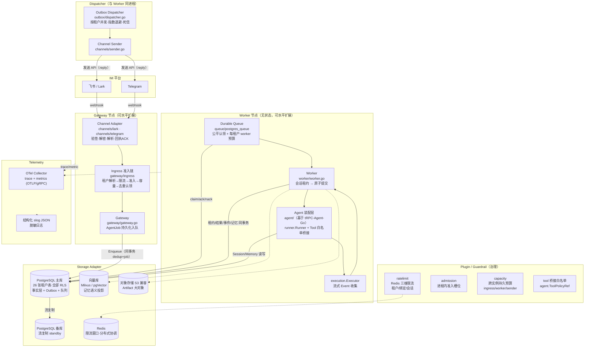
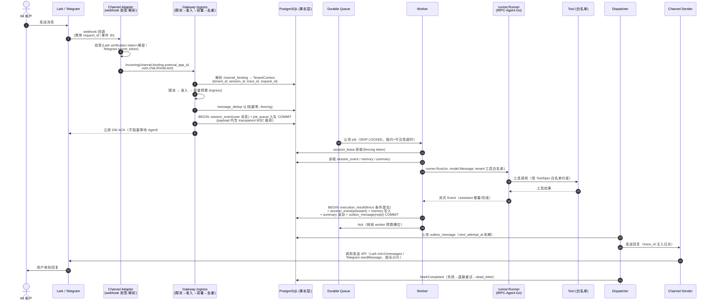
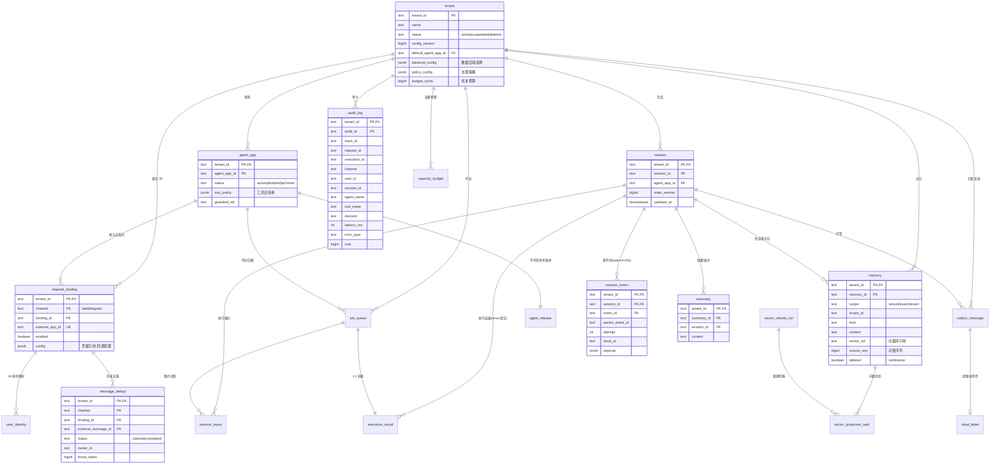

# 平台架构设计说明书

**项目**：基于 tRPC-Agent-Go 的多租户节点化 Agent 部署平台（`github.com/liuzengh/trpc-agent-service`）
**框架**：`trpc.group/trpc-go/trpc-agent-go v1.11.2`
**关联文档**：`README.md`（题目要求）、`docs/ARCHITECTURE.md`（模块级补充）

本文档回答 README.md 中定义的架构设计要求，内容以仓库实际实现为准（README 中的目录划分仅为职责示意，实际代码组织见 §2.5）。

---

## 一、架构设计

### 1.1 设计原则

1. **PostgreSQL 是唯一事实源（single source of truth）**。所有业务事实（会话、事件、记忆、审计、回复投递）首先落库；IM 回复走事务性 Outbox；向量库只保存可重建的派生投影。任何组件崩溃都不产生"已回复但无事实"或"有事实但无法追溯"的状态。
2. **权威数据强一致，派生数据最终一致**。Session/Memory/审计写入与业务提交同事务；向量投影、摘要生成异步化，失败可通过对账与重建收敛。
3. **Worker 无状态**。Agent 执行节点不持有任何粘性会话状态，靠共享 PostgreSQL 状态层 + 会话租约（session lease + fencing token）实现任意节点水平扩缩容，无需 sticky session。
4. **隔离是结构性的，不是约定性的**。多租户隔离由数据库 RLS（全部 26 张租户表 ENABLE+FORCE 行级安全 + 每表租户隔离策略）在存储层强制；应用层统一携带 `TenantContext`（tenant_id 经由事务级 GUC 传递），越权访问被数据库直接拒绝。
5. **治理前移**。每条 IM 消息在进入任何执行路径之前，依次通过通道验签 → 身份解析 → 三维限流（租户/绑定/会话）→ 进程内准入槽位 → 跨实例持久容量预算 → 消息去重认领，任何一道拒绝都不会产生事实写入或模型调用。

### 1.2 总体架构

平台由三类节点组成，均可水平扩展：

- **Gateway 节点**（`cmd/trpc-service` 的 ingress 组成部分）：终止 IM 平台的 webhook 回调。完成验签、报文解析、租户/绑定解析、限流、准入、去重认领，然后把一条不可变 `AgentJob`（含 tenant/agent/session/trace 上下文）持久化入队并立即 ACK 给 IM 平台。Gateway 不执行任何模型调用。
- **Worker 节点**：通过 `job_queue` 的公平认领（`FOR UPDATE SKIP LOCKED` + 租户最近活跃优先排序 + 每租户 worker 预算）拉取作业；对同一 session 获取会话租约后，组装 tRPC-Agent-Go `runner.Runner` 执行；执行完成在同一事务内完成原子提交（execution_result + session_event + memory + summary + outbox 回复投递）。
- **Dispatcher（与 Worker 同进程部署，独立 goroutine 池）**：认领 outbox 待投递消息，经 Channel Sender 调用 IM 发送 API，按指数退避重试，超过次数进入 dead_letter。

数据面组件：**Storage Adapter**（`storage/`：PostgreSQL 权威库、Redis 协调与限流、S3 兼容对象存储、Milvus/pgVector 向量库）、**Telemetry**（OTel trace/metric + 结构化 slog JSON）。

### 1.3 多租户隔离

| 维度 | 机制 |
|------|------|
| 数据隔离 | 全部租户表 `ENABLE + FORCE ROW LEVEL SECURITY`，策略 `tenant_id = current_setting('trpc.tenant_id')`；应用每个事务显式设置租户 GUC；跨租户能力收敛为两个审计过的 SECURITY DEFINER 函数（队列认领、绑定解析），由专用 NOLOGIN BYPASSRLS 角色持有 |
| 配置隔离 | `tenant` 行持有 `backend_config` / `policy_config` / `default_agent_app_id` / `budget_cents`；配置变更走版本化发布（`tenant_config_version` → `tenant_config_rollout`），可审计可回滚 |
| 权限隔离 | `AgentSpec`（不可变、平台所有）携带 `ToolPolicyRef` + `Tools[]` 白名单，Worker 按白名单桥接工具，租户无法越权引用工具 |
| 密钥隔离 | 通道凭据（Lark app secret / Telegram token）以引用（`env://`）形式存储，实际值由部署侧 Secret 文件注入进程环境；日志经统一脱敏组件输出 |
| 成本隔离 | `tenant.budget_cents` + `capacity_budget`（ingress/worker/sender 三类并发预算，行级原子扣减）+ `capacity_reservation` 审计行 |

### 1.4 节点化部署与水平扩展

部署拓扑为 **双活 Gateway/Worker + 主备存储**：两台节点运行同一 `app:release` 镜像（Gateway、Worker、Dispatcher 同进程不同 goroutine 池）；PostgreSQL 主库 + 流复制备库，Redis 主 + 副本，OTel Collector 独立部署。

用户消息路由到正确租户与 session 的路径：webhook URL 即绑定身份（每个 `channel_binding` 一个回调地址）→ 验签解析出 `external_app_id` + 会话标识 → `channel_binding` 反查租户 → `session_id = f(tenant, channel, user_id, chat_id, thread_id)`（群聊带 thread 维度，跨租户天然隔离）。

**不需要 sticky session**：Worker 从共享 `job_queue` 认领作业后，Session/Event/Memory 全部从 PostgreSQL 读取——任何节点都能处理任何租户的任何会话。同一 session 的并发执行由 **会话租约** 排他：租约携带单调递增 fencing token，执行结果提交时以 `fence_token` 条件写入 `execution_result`，过期租约的迟到写入被数据库直接拒绝（解决"脑裂后的僵尸执行"）。

### 1.5 故障恢复

- **节点崩溃**：作业租约到期后由队列认领函数自动回收重投（attempt+1）；执行结果以 fence token 条件提交，不会重复生效；会话租约过期后其他节点可接管。
- **PostgreSQL 主库故障**：备库流复制（默认异步，可调同步提交）；应用通过环境指向当前主库，切换 = 修改指向 + 重建容器；恢复工具链（`trpc-recovery`）提供 backup → verify → restore drill 的周期演练，RPO 取决于复制模式，RTO 为分钟级。
- **IM 侧失败**：回复投递失败按指数退避重试，最终进入 `dead_letter`，可通过管理路径重放；IM 重复推送由去重表吸收。
- **向量库故障**：检索降级（不影响业务事实提交），恢复后由重建任务补齐投影。

### 1.6 与 tRPC-Agent-Go 的关系

tRPC-Agent-Go 提供**单进程 Agent 运行时**能力；本平台在其外层补齐**分布式、多租户、持久化与治理**的平台层。复用与新增的精确边界见 §10。

### 1.7 实际代码组织

```
cmd/trpc-service        # 单一入口（gateway+worker+dispatcher 同进程）
cmd/trpc-migrate        # 迁移工具（15 个版本化迁移）
cmd/trpc-recovery       # 备份/校验/恢复演练工具
trpcservice/
  tenant/ agent/ tool/ skill/ workspace/        # 租户模型与 Agent 装配
  channels/ + channels/{lark,telegram}/         # IM Channel Adapter（webhook+sender）
  gateway/ queue/ worker/ execution/ outbox/    # 准入、队列、执行、投递
  storage/ + storage/{postgres,redis,coordination,s3object,tenantctx}
  memory/ session/ artifact/ vector/            # 记忆/会话/产物/向量
  admission/ ratelimit/ capacity/               # 治理三件套
  telemetry/ metrics/ log/ audit/               # 可观测与审计
  config/ configpub/ recovery/ platform/ web/ version.go
migrations/  # 000001..000015（26 张租户表，全部 RLS）
```


---

## 二、系统架构图



组件与 README 要求的对应关系：**Channel Adapter** = `channels/{lark,telegram}`（webhook 接入 + sender 回程）；**Gateway** = `gateway/`（准入 + 入队）；**Worker** = `worker/` + `agent/`（基于 tRPC-Agent-Go 装配执行）；**Storage Adapter** = `storage/`（postgres/redis/coordination/s3object 四后端 + 统一租户上下文）；**Plugin/Guardrail** = `admission/ + ratelimit/ + capacity/ + agent.ToolPolicyRef`（治理四层）；**Telemetry** = `telemetry/ + metrics/ + log/`；**Admin/恢复面** = `cmd/trpc-migrate`、`cmd/trpc-recovery`。

---

## 三、核心链路时序图（Lark / Telegram 用户发消息 → IM 回复）



**trace_id / request_id 贯穿方式**：

1. **生成**：webhook 入口为每次准入生成 `request_id`（消息事件 ID）与 `trace_id`（W3C traceparent），写入 `TenantContext`。
2. **入队持久化**：`job_queue.payload` 携带完整 Trace（execution_id + traceparent 载荷），队列对旧 schema 向后兼容（additive 字段）；`session_event.trace_id` 同时落库。
3. **执行段**：Worker 从 payload 恢复 OTel trace 上下文，`runner.Runner` 执行、Tool 调用、Session/Memory 读写均为该 trace 的子 span；span 属性携带 `tenant_id`（低基数注册表，避免高基数标签）。
4. **回复段**：`outbox_message` 通过 `session_id/execution_id` 关联；Dispatcher 发送日志携带同一 trace_id；`audit_log` 表以 `(trace_id, request_id, execution_id)` 三键冗余存储，任意一条审计记录可回放全链路。
5. **查询**：以 `trace_id` 为键可在日志、OTel、`audit_log`、`session_event`、`outbox_message` 间互相跳转。

---

## 四、数据模型设计

### 4.1 实体关系



### 4.2 关键设计说明

| 表 | 职责 | 关键约束 |
|----|------|----------|
| `tenant` | 租户根实体：默认 Agent、数据后端选择、治理策略、成本预算 | `budget_cents >= 0`；级联删除租户数据 |
| `agent_app` | 租户的 Agent 应用定义（模型、提示词、工具策略、Guardrail 引用） | FK → tenant；策略以 jsonb 版本化 |
| `channel_binding` | IM 通道绑定：`(channel, binding_id)` 唯一标识一个回调入口，`external_app_id` 租户内唯一 | FK → tenant；凭据只存引用 |
| `user_identity` | IM 外部身份 ↔ 平台用户映射（跨群、跨租户隔离的基础） | 绑定内唯一 |
| `session` / `session_event` | 会话与 append-only 事件流；`trace_id`、`attempt`、`parent_event_id` 支持执行链回放 | 事件不可变，顺序以 `created_at` + 序列列 |
| `message_dedup` | IM 幂等基石：消息认领/完成状态 + `owner_id` + `fence_token` | 主键即 `(tenant, channel, binding, external_message_id)` |
| `memory` / `summary` | 长期记忆（三种 scope）与会话摘要；`source_seq` 记录来源事件序列用于向量对账 | `deleted` 为 tombstone（幂等删除） |
| `outbox_message` / `dead_letter` | 事务性 Outbox：回复与业务事实同事务；超限进入死信可重放 | 状态机 pending→processing→completed/retry/dead |
| `job_queue` | 持久队列：`queued/in_flight/acked/discarded`，可见性租约 + attempt | 认领由 `trpc_queue_claim_next` 完成 |
| `execution_result` | 执行结果幂等提交：`(tenant, execution_id)` 唯一，`epoch + fence_token` 条件写入 | 防僵尸执行覆盖 |
| `coordination_epoch` / `session_lease` | 资源 epoch 与会话租约（fencing token 单调递增） | 跨节点并发安全的根基 |
| `agent_release` / `tenant_config_version`(+rollout/operation) | Agent 不可变发布与租户配置版本化发布/回滚 | 审计 + 可回滚 |
| `capacity_reservation` / `capacity_budget` | 跨实例容量预留审计与三 scope（ingress/worker/sender）预算 | `CHECK (active_count <= budget_limit)` |
| `vector_projection_task` / `vector_rebuild_run` | 记忆 → 向量库的异步投影任务与全量重建 | 派生数据可重建 |

全部租户表由 `000010` 迁移统一施加 `ENABLE/FORCE ROW LEVEL SECURITY` + `<table>_tenant_isolation` 策略；`capacity_budget`（000013）与公平认领函数（000015）随后续迁移加入。恢复工具的 RLS 审计覆盖全部 26 表。

---

## 五、数据同步与幂等策略

### 5.1 多节点并发写入同一 session

- **互斥执行**：同一 session 的 Agent 执行由 `session_lease`（租约表，`fencing_token` 单调递增）排他。Worker 认领到同 session 的新作业时先获取/续租；未持有最新 fence token 的写入一律失败。
- ** fencing 提交**：`execution_result` 以 `(tenant_id, execution_id)` 主键 + `epoch + fence_token` 条件更新提交——两个节点并发执行同一 execution 时，只有持最新 fence token 的事务能落库，另一方的结果被数据库拒绝，杜绝"僵尸节点覆盖新结果"。
- **可见性**：执行结果与事件在同一事务提交，读方（任意节点）经 PostgreSQL 一致性读立即可见；不存在跨节点缓存不一致问题（节点不缓存业务状态）。

### 5.2 Session event / state / summary 的顺序

- 事件表 append-only：`session_event` 只插入不更新，顺序由 `created_at` 与序列列决定；执行链经 `trace_id` + `parent_event_id` 回放。
- 会话 `state_version` 随每次原子提交递增（乐观可观测）。
- 摘要（summary）在事件量达到阈值后由 Worker 在原子提交边界内滚动生成，摘要后旧事件仍保留（审计可回放），检索路径优先摘要。

### 5.3 Memory 写入后的跨节点可见性

Memory 行与业务提交同事务写入 PostgreSQL（强一致、立即可见）；向量投影（`vector_projection_task`）异步生成，存在秒级最终一致窗口。语义检索路径的失败降级为"仅结构化记忆"，不影响会话正确性。跨节点一致性由单一权威表保证——任何节点写入后，其他节点的下次读取即为最新。

### 5.4 派生数据一致性（向量库）

- `memory.source_seq` 记录来源事件序列；投影任务按 `source_seq` 单调推进。
- 对账：投影任务失败自动重试；全量不一致时通过 `vector_rebuild_run` 执行 keyset 扫描式重建（dry-run 校验 / repair 修复 / orphan 报告），重建过程不阻塞业务写入。
- Tombstone（`deleted`）以删除操作同步至向量库，保证"业务已删、检索必不中"。

### 5.5 后端迁移

- **Redis → SQL（或反之）**：协调（coordination/lease）与限流后端为接口抽象 + 构造期注入，切换 = 改配置重启；SQL 为权威层，Redis 仅承载可丢状态（窗口计数、临时租约加速），迁移无事实数据搬迁。
- **本地向量库 → 远端向量库**：`vector_rebuild_run` 以投影注册表（per-projection embedder 配置）驱动全量重建：pre-provisioned 目标索引构建 → 双读比对 → 切换引用。旧索引在验证后退役。

### 5.6 IM 消息重复投递的幂等

两级防线：
1. **认领幂等**：`message_dedup` 以 `(tenant, channel, binding, external_message_id)` 为主键，认领（claimed）带 `owner_id + fence_token`；重复 webhook 命中已认领/已完成记录时直接返回成功，不重复入队。
2. **执行幂等**：即使重复入队，`execution_id` 唯一 + fence 条件提交保证结果只生效一次；回复侧 outbox 投递由 Dispatcher 保证 at-least-once，IM 平台侧的消息 ID 幂等由平台语义吸收。
认领记录由认领后 TTL 清理（认领超时未完成的重复投递可被重新认领，配合 fencing 仍不会双重执行）。

### 5.7 一致性取舍总览

| 数据 | 一致性 | 原因 |
|------|--------|------|
| Session/Event/Memory/审计/Outbox | 强一致（同事务） | 事实层，不可丢不可重 |
| 队列认领/预算扣减 | 强一致（行锁原子） | 计数与归属正确性 |
| 向量投影 | 最终一致（秒级） | 派生数据，可重建 |
| 限流窗口/准入计数 | 窗口近似 | 治理信号，允许误差换取低延迟 |

---

## 六、多后端适配方案

平台数据分四类，分别匹配最合适的后端；适配通过 `storage/` 接口层（构造期注入，业务代码只面向接口）。

| 后端 | 适合存什么 | 平台中的实际用途 | 一致性/取舍 |
|------|-----------|------------------|-------------|
| **PostgreSQL（SQL，权威层）** | 一切业务事实：租户/Agent/绑定配置、session/event、memory/summary、审计、Outbox、队列、执行结果、预算 | 26 张租户表；事务性 Outbox；`SKIP LOCKED` 队列；RLS 强隔离 | 强一致、事务边界清晰；成本为写入吞吐与存储增长（事件可归档） |
| **Redis** | 可丢失、低延迟、高频读写的治理与协调状态 | 三维限流窗口计数（原子 INCR+TTL）；分布式协调/租约加速（可插拔后端）；会话热缓存（tRPC-Agent-Go `session/redis` 适配可选） | 最终一致/窗口近似；宕机降级为无限流/直读 PG，不影响正确性 |
| **向量库（Milvus / pgVector）** | 记忆与知识的语义 embedding 投影，仅供检索 | `vector_projection_task` 异步投影；检索经注入式 Embedder（HTTP OpenAI 兼容，bounded fail-closed）；`vector_rebuild_run` 全量重建 | 最终一致 + 可重建；不承载唯一事实，宕机仅降级检索 |
| **对象存储（S3 兼容）** | Artifact 大对象（二进制、文件产物） | 元数据在 PG（`artifact` 表），内容在对象存储，`vector_ref`/`object_ref` 关联 | 强一致元数据 + 最终一致内容；容量与成本随用随扩 |

统一数据访问抽象：业务代码面向 `storage/` 中的仓储接口（Repository / CoordinationStore / ObjectStore / MigrationReadiness），后端选择由租户配置 + 部署注入决定；新增后端（如 MongoDB session）只需实现接口，不改动业务路径。tRPC-Agent-Go 自带的 `session/redis|mysql|postgres`、`storage/s3|qdrant|milvus` 适配在框架侧复用，平台层负责租户级路由与事实层落地。

---

## 七、IM 通道接入差异

平台统一通过 `Channel Adapter` 接口支持 Lark（飞书）与 Telegram 两个 IM 平台。差异主要在验证方式、消息格式、发送 API、限频策略。

| 维度 | Lark（飞书） | Telegram |
|------|--------------|----------|
| **接入方式** | 应用管理后台创建应用 → 网页应用（自建） → 设置回调 URL（webhook） → 验证 token + 解密密钥 | BotFather 创建 Bot → setWebhook（https 服务器）→ secret_token 头验证 |
| **验签/解密** | 接收 `X-Lark-Signature` / `X-Lark-Encrypt` → 解密密钥 + 验证签名 | `X-Telegram-Bot-Api-Secret-Token` 头匹配 |
| **事件格式** | JSON 事件（message、message_read、im） | JSON 更新（message） |
| **发送 API** | `POST /open-apis/im/v1/messages`（卡片消息支持） | `POST /bot/sendMessage`（Markdown 文本，超长分片） |
| **消息长度** | 8000 字符（卡片 + 文本） | 4096 字符（分片发送） |
| **限频** | 每分钟 1000+ 次（按应用级别） | 每分钟 20~1000 次（按 chat 类型） |
| **线程/群聊** | 支持 thread_id | 支持 thread_id（reply_to 模式） |
| **卡片消息** | 原生卡片（富文本） | 文本分片（Markdown） |
| **重试策略** | 429 状态码 + Retry-After | 429 状态码 + retry_after |

平台层 Channel Adapter 抽象同时支持两种格式：`IncomingEvent`（webhook 解析后）与 `ReplyMessage`（发送到 IM 的 JSON），统一底层实现，差异封装在两个实现（`lark.go` / `telegram.go`）。

---

## 八、治理、监控与审计

### 治理四层

1. **入口治理**（Ingress）：
   - 通道适配器做基础身份解析与限流
   - 准入（admission）做进程内并发槽位控制
   - 容量预算（capacity_budget）做跨实例持久预算
   - 消息去重（message_dedup）防重复认领

2. **执行治理**（Worker）：
   - Agent Spec 携带 `tool_policy` 与 `guardrail_ref`（白名单 + 策略）
   - Tool 桥接器仅调用白名单内的工具
   - 租户级 worker 预算控制并发

3. **回复治理**（Dispatcher）：
   - Outbox 事务性投递
   - 指数退避 + 死信 + 重放路径
   - IM 平台频率限制自动退避

4. **成本治理**：
   - `tenant.budget_cents` 行级审计
   - `capacity_reservation` 审计表
   - 每租户 per-tenant 隔离

### 监控与可观测

- **Trace**：OTel W3C traceparent 贯穿所有链路（webhook → job → worker → tool → reply），`audit_log` 表以 `(trace_id, request_id, execution_id)` 三键冗余存储，支持任意一点溯源。
- **Metrics**：每秒 Agent 执行次数、平均延迟、工具调用频率、队列长度、容量剩余、投递成功率、向量检索命中率。
- **日志**：结构化 slog JSON，关键字段（tenant_id, trace_id, request_id, decision, cost）均可过滤，支持脱敏（PII 字段如 user_id 经 user_identity 映射后仅保留匿名化）。
- **Audit**：`audit_log` 表记录 tenant_id, channel, binding_id, operation, decision, latency, error_type, cost, trace_id — 符合 README 要求的审计需求。

---

## 九、风险清单（≥8 条）

| 序号 | 风险描述 | 缓解措施 |
|------|----------|----------|
| 1 | IM 平台重复投递（webhook 重放） | `message_dedup` 认领幂等 + fencing token |
| 2 | 多节点同 session 并发执行 | `session_lease` + `fence_token` 条件提交 `execution_result` |
| 3 | LLM 上游限流/超时/失败 | 按 provider 类型分类错误 + 指数退避 + dead_letter + tenant 预算 |
| 4 | PostgreSQL 主库故障 | 流复制备库 + `trpc-recovery` 演练工具；切换指向简单 |
| 5 | Redis 限流/协调后端不可用 | 降级为“无限流”或“直读 PG”，不影响业务事实提交 |
| 6 | 向量库与 PG 内存不一致 | `source_seq` 对账 + `vector_rebuild_run` 重建 + 失败降级检索 |
| 7 | 容量超载导致成本失控 | `capacity_budget` + `admission` + 每租户隔离 + 预算审计 |
| 8 | 密钥泄露或配置错误 | 凭据只存引用（env://），日志脱敏，配置版本化发布/回滚 |
| 9 | IM 消息长度/频率限制 | 分片 + 429 retry_after + 死信重放 |
| 10 | 跨租户数据泄漏 | 全部租户表 RLS FORCE + tenant GUC + 策略测试 + 审计 |

所有风险均有可观测的度量指标与自动恢复/重试路径。

---

## 十、tRPC-Agent-Go 复用与平台层新增边界

tRPC-Agent-Go 提供**单进程 Agent 运行时**能力，本平台在其外层补齐**多租户、持久化、治理、可靠回复**的平台层。

### 复用边界（复用 tRPC-Agent-Go）

- `runner.Runner`（执行入口）
- `AgentSpec`（不可变配置：model/provider、system prompt、tool policy、guardrail ref）
- Tool 接口与 ToolSpec 桥接器
- Session / Memory / Summary 抽象
- Plugin / Guardrail 机制
- Telemetry 抽象接口（OTel / slog）
- Knowledge 检索接口（可通过 `vector_projection_task` 实现）

### 平台层新增（trpcservice/*）

- `tenant/`（租户模型 + RLS + TenantContext GUC）
- `gateway/`（IM webhook 准入 + 入队）
- `channels/{lark,telegram}/`（Channel Adapter 接入）
- `queue/`（durable job_queue + 公平认领）
- `worker/`（无状态 worker + session lease）
- `outbox/`（事务性回复投递 + dead_letter）
- `storage/`（postgres 权威层 + redis 协调 + s3object + 统一租户上下文）
- `admission/` + `ratelimit/` + `capacity/`（治理三件套）
- `telemetry/` + `metrics/` + `log/`（落地可观测）
- `vector/`（projection task + rebuild run + embedder）
- `configpub/`（配置版本化发布）
- `recovery/`（备份/校验/恢复演练工具）
- `audit/`（`audit_log` + `channel_binding_audit`）

复用 + 新增的比例大约 4:6（复用部分为核心运行时能力，新增部分是平台治理与可靠交付）。

---

## 附录：tRPC-Agent-Go 复用模块包映射

| tRPC-Agent-Go 模块 | 平台对应 | 用途 |
|-------------------|----------|------|
| runner | `agent/` | 装配与执行 |
| model | `agent/` | 模型提供者 |
| tool | `agent/tool_bridge.go` | 工具调用桥接 |
| session | `storage/session` | 会话抽象 |
| memory | `memory/` | 记忆抽象 |
| telemetry | `telemetry/` | 观测 |

**注意**：本文档以仓库实际实现为准（README.md 仅为题目参考，实际代码组织见上文 §1.7）。如有不符之处，请以实际代码为准。

---
