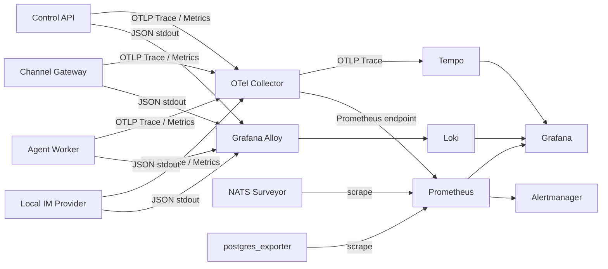

# 可观测性与 Telemetry 设计

- **设计状态**：已接受
- **实现状态**：部分实现。Worker 已有结构化日志与可选 OTLP Metrics；M1 进程 Traces/SDK 接线通过本地技术验证；IM 端到端 Trace、Collector/Tempo/Grafana 查询链及完整运维栈尚待实施。
- **增量交付**：[IM 运行链路 Tracing V1](im-runtime-tracing-v1-plan.md)（2026-09-08）；M0–M5 本工作树开发及首版验收完成，原手测实例已接入。真实 Telegram/DeepSeek、正式 Session、恢复/退化/旧构建回退证据见[完成审计](im-runtime-tracing-v1-acceptance.md)。Memory 与完整运维平台继续后置。
- **确认日期**：2026-08-31
- **适用范围**：所有生产 Workload、异步协议、Compose/Kubernetes 部署和运维验收

本文定义平台必须具备的生产级可观测性框架，并细化
[`ARC-203`](../constraints.md#arc-203基础设施连接由服务共享) 中日志、Tracing 和
Metrics 的职责。Telemetry 是部署基础设施，不是业务事实存储或新的业务子领域。

## 1. 目标与边界

平台必须做到：

1. 分别串联 Control 发布链路和每条 IM 输入的跨进程调用；发布与运行通过不可变发布标识关联，不将所有 Run 挂在同一个发布 Trace 下。
2. 使用低基数 Metrics 观察容量、延迟、错误率、积压和依赖健康。
3. 集中检索结构化日志，并通过 `trace_id`、`run_id` 等内部标识关联诊断。
4. 为 Gateway、Worker、PostgreSQL、NATS JetStream 和 Telemetry 自身提供 Dashboard
   与可操作告警。
5. 保证 Secret、原始 Prompt、完整 Tool 参数和敏感 IM Payload 不进入观测后端。
6. 在普通 Telemetry 后端故障时保持业务可用，并将不可采样 Audit 留在独立的业务
   持久化路径中。

本设计不要求自研 Trace、Metrics 或日志平台，也不允许使用 Trace、日志或 Metrics
替代 PostgreSQL Audit、Usage Ledger、Run 状态或 Outbox 等权威业务事实。

## 2. 必须保留的组件

自托管完整部署的终态包含以下组件；IM Tracing V1 先交付 Collector、Tempo、Grafana，
完整日志、指标、告警栈不作为该纵向切片的前置条件：

| 层次 | 组件 | 必须承担的职责 |
| --- | --- | --- |
| Instrumentation | OpenTelemetry SDK | 在 Go 和服务端 Web Workload 中产生 Trace、Metrics 和 Resource |
| Collection | OpenTelemetry Collector | 接收 OTLP、批处理、采样、过滤并导出 Trace 和 Metrics |
| Log collection | Grafana Alloy | 收集容器或 Kubernetes stdout 日志并发送到 Loki |
| Metrics | Prometheus | 存储 Metrics、执行 PromQL 和告警规则 |
| Traces | Tempo | 持久化分布式 Trace；平台不同时维护 Jaeger |
| Logs | Loki | 存储和检索结构化日志 |
| Visualization | Grafana | 统一查询 Prometheus、Tempo 和 Loki，并提供 Dashboard |
| Alerting | Alertmanager | 告警分组、抑制、路由和通知 |
| NATS metrics | NATS Surveyor | 暴露 JetStream Stream、Consumer、Lag、Pending 和 Redelivery 指标 |
| PostgreSQL metrics | postgres_exporter | 暴露连接、事务、锁、容量和查询相关指标 |

这些组件不计入 `ARC-001` 的业务 Workload 数量，也不允许承载业务所有权。生产环境
可以用兼容托管服务替换存储、展示或告警组件，但应用仍然只依赖标准 OTLP、
Prometheus scrape 和结构化日志接口。

## 3. 信号拓扑



应用禁止直接持有 Tempo、Loki 或 Grafana 凭证。Trace 和应用 Metrics 先进入
Collector；结构化 stdout 日志由 Alloy 收集。Prometheus 直接抓取 Collector、
NATS Surveyor、postgres_exporter 以及必要的基础设施端点。

## 4. 代码所有权与初始化

每个 Go Workload 的 bootstrap 拥有独立进程级遥测生命周期；服务本地
`internal/infra/telemetry/` 提供日志/Metrics，Gateway/Worker 复用
`platform/telemetrytrace` 的无业务依赖 Trace 实现，避免维护两份过滤器/exporter：

- 创建 Logger、TracerProvider、MeterProvider 和 OTLP Exporter。
- 设置统一 Resource Attributes。
- 将 `trace_id`、`span_id` 写入结构化日志上下文。
- 管理 Batch、Queue、Flush 和 Shutdown。
- 应用统一的敏感字段过滤规则。
- 向 bootstrap 返回显式 Provider 和关闭函数，不使用全局 Service Locator。

SDK 兼容接线是显式例外：bootstrap 在业务启动前将 trpc-agent-go 的独立 Tracer
绑定到进程 Provider；全局桥接不进入业务模块，不为 SDK 再启动一套 exporter。

业务模块定义本领域 Span、Metric 和日志事件的业务含义。`infra/telemetry` 禁止定义
Deployment 发布规则、Run 状态迁移、Tool 决策或 Channel Binding 语义。

进程 bootstrap 必须先初始化 Telemetry，再组装业务模块，并在关闭 HTTP、NATS
Consumer 和后台任务后有界 Flush Telemetry。Flush 超时不得导致进程无限阻塞。

## 5. Resource、关联字段与基数

所有 Workload 必须至少设置：

```text
service.name
service.version
service.instance.id
service.namespace
deployment.environment.name
```

推荐的 `service.name` 为：

```text
control-api
channel-gateway
agent-worker
local-im-provider
control-web
local-im-web
```

Trace 和结构化日志可以携带经过授权的内部关联 ID：

```text
tenant_id
request_id
command_id
run_id
session_id
agent_version_id
deployment_revision_id
channel_binding_id
```

这些值禁止默认成为 Prometheus Label。Metrics Label 只允许低基数维度，例如
`environment`、`service`、`operation`、`channel_type`、`run_status`、`result`、
`error_class`、`model_profile` 和 `backend_type`。

禁止把 `tenant_id`、`user_id`、`run_id`、`session_id`、`trace_id`、URL、异常正文或
自由文本作为通用 Metrics Label。

## 6. Trace 传播

内部 HTTP 使用 W3C `traceparent` 和 `tracestate`；外部 IM 入口建立平台本地根。
NATS 通过 Header 传播 Carrier，持久化交接在各自数据库记录中保存可空 Carrier 列。
当前封闭的 RunRequested/ReplyIntent JSON payload 不增加 Trace 字段，业务摘要和去重
身份不变。禁止序列化 SDK Span 对象或依赖进程内 `context.Context` 自动跨队列传播。

四处持久化、不可变消息创建 context、重复消息及进程重启规则见
[IM Tracing V1 §4–5](im-runtime-tracing-v1-plan.md#4-carrier-传输协议)。

### 6.1 Control 发布链路

```text
Control HTTP Request
  -> Deployment Application
  -> PostgreSQL Transaction
  -> Control Outbox
  -> NATS Relay
  -> Gateway Projection Consumer
```

### 6.2 IM 运行链路

```text
IM Receive
  -> Gateway Authenticate / Resolve Binding / Admit Run
  -> Run Outbox
  -> NATS JetStream
  -> Worker Claim / Execute
  -> Model / Tool / Storage
  -> Persist Run Result / ReplyIntent
  -> NATS JetStream
  -> Gateway Reply Delivery
```

跨异步边界的 Consumer 从 Header 提取上游消息创建 context，并创建新的 Consumer Span。
IM Tracing V1 的单消息处理明确采用 creation context 为 parent，并保留 Link；Relay 每次
实际发送形成独立 Span，消息创建 Carrier 不因重试改写。Worker 调度和 Gateway Delivery
从各自持久化记录恢复 context。消息重投产生新的处理 Span，业务 ID 与首次 Carrier 保持稳定。

平台至少覆盖以下语义阶段；名称以各切片已确认的埋点表为准：

```text
control.deployment.publish
control.outbox.publish
gateway.message.receive
gateway.run.admit
gateway.reply.deliver
worker.run.claim
worker.run.execute
chat <model>                 # SDK LLM Span，避免重复包同义 Span
execute_tool <tool>          # SDK Tool Span，仅实际执行时
worker.session.load
worker.session.stage
worker.session.commit
```

优先复用 OpenTelemetry Semantic Conventions。自定义 Attribute 必须使用稳定命名，
禁止把完整 Payload 放入 Span Event。

## 7. Metrics 基线

### 7.1 Control API

- HTTP 请求量、错误率、延迟和并发。
- 登录成功、失败、限流和 Session 创建结果。
- Deployment 发布成功率与耗时。
- Outbox Pending、Retry、Failed 和 Oldest Age。
- PostgreSQL 连接池使用率和等待时间。

### 7.2 Channel Gateway

- IM 入站量、重复量、鉴权失败和 Binding 解析失败。
- Run Admission 成功率、拒绝率和延迟。
- 路由投影版本落后时间。
- Reply 成功、Retry、429、永久失败和投递延迟。

### 7.3 Agent Worker

- 活跃 Worker、活跃 Run 和 Drain 时间。
- Queue Wait、Run Duration、成功、失败、超时和中断。
- Model 调用、TTFT、Latency、Token Usage 和 Error。
- Tool 调用、Allow、Deny、Approval、Latency 和 Error。
- Fence Conflict、Redelivery 和重复完成抑制。

### 7.4 基础设施与 Telemetry

- JetStream Stream Size、Consumer Pending、Ack Pending、Redelivery 和 Oldest Age。
- PostgreSQL Connection、Transaction、Lock、Deadlock、Disk 和 Replication 状态。
- Collector Receiver Accepted/Refused、Exporter Failed、Queue Size 和 Dropped Data。
- Prometheus、Tempo、Loki、Alloy 和 Alertmanager 自身健康与容量。

Tenant、Agent 和 Model 的准确计费数据由 PostgreSQL Usage Ledger 负责。Prometheus
只承担运行观测和聚合趋势，不是计费权威来源。

## 8. 结构化日志与敏感数据

所有服务写 JSON 到 stdout/stderr，不直接写容器内长期日志文件。日志至少包含：

```text
timestamp
severity
message
service.name
service.version
service.instance.id
deployment.environment.name
trace_id
span_id
event
error.type
```

存在可信上下文时可以补充内部 `tenant_id`、`request_id`、`run_id` 和 `command_id`。
错误必须使用稳定 `error.type` 分类；原始内部错误只在完成脱敏后记录。

以下内容禁止进入日志、Trace、Metric、Collector Debug Exporter 或 Grafana Annotation：

- 密码、Session Token、API Key、Bot Token、数据库 DSN 和 Secret Value。
- 完整 Prompt、Response、Tool 参数与结果。
- 原始 IM Webhook Body、临时媒体 URL、企业微信 AES Key。
- 未经过滤的 HTTP Header、Cookie、NATS Payload 和 SQL 参数。

Emitter 负责第一道数据最小化；Collector/Alloy 过滤只是第二道防线，不能成为允许应用
先发送 Secret 的理由。

## 9. Sampling、保留与故障语义

Local 和 Staging 可以保留 100% Trace。Production 使用 Parent-Based Sampling，并在
Collector 对错误、超时、慢请求、Tool Deny、审批和高风险操作执行 Tail Sampling。
具体比例和保留天数属于环境配置，但禁止使用无限保留作为默认值。

普通 Telemetry 使用 fail-open 语义：

- Collector、Tempo、Loki、Prometheus 或 Grafana 不可用时，业务请求继续。
- 应用 Exporter 使用有界 Batch 和 Queue；队列满时丢弃普通 Telemetry 并增加失败指标。
- 应用 readiness 不依赖观测后端；生产发布验收仍必须验证观测栈可用。
- Telemetry 恢复后不使用无界内存补发全部历史数据。

Audit、Usage Ledger、Run 状态和 Outbox 不经过这条 fail-open 通道。Required Audit
的失败行为由业务规则决定，禁止因为 Tempo 或 Loki 中存在相似记录而绕过 Audit。

## 10. 多租户查询与访问控制

Grafana 是 Platform Operator 和运维人员使用的观测入口，不是 Tenant 用户直接访问的
业务 API。生产环境必须：

- 关闭匿名访问和默认管理员密码。
- 使用 OIDC 或等价身份接入，并配置最小权限。
- 只通过受保护的 Ingress 暴露 Grafana。
- 将 Collector、Prometheus、Tempo、Loki、Alloy、Alertmanager 和 Exporter 保持在
  内部网络。
- 对生产 OTLP 使用 TLS 与认证；Compose 本地环境可以依赖隔离网络。
- 对 Dashboard、Alert Rule 和 Data Source 配置进行版本控制。

未来 Control Web 展示运行监控时，必须通过 Control API 的 Tenant-scoped Query 或
授权后的深链接访问；禁止把共享 Grafana、Tempo、Loki 或 Prometheus 查询能力直接暴露
给 Tenant 浏览器。

## 11. 部署组织

完整部署目录以[部署目录结构](deployment.md)为准：

```text
deploy/
├── compose/
│   ├── compose.yaml
│   ├── compose.local.yaml
│   └── compose.observability.yaml
├── nats/
│   ├── streams.yaml
│   └── permissions.yaml
├── observability/
│   └── ...
└── helm/
    └── agent-platform/
```

本设计拥有的 Collector、Prometheus、Tempo、Loki、Alloy、Alertmanager、Grafana、
Dashboard 和告警规则配置全部进入 `deploy/observability/`，并由
`deploy/compose/compose.observability.yaml` 或 Helm Chart 组装。

`compose.observability.yaml` 是完整自托管部署的组成部分。单独存放是为了允许生产环境
替换为托管服务，而不是把 Observability 降级为可选功能。所有镜像必须固定版本，所有
持久化后端必须显式配置 Volume、Retention、容量上限和备份策略。

应用只接收 Collector Endpoint 和标准 OTel 配置；Tempo、Loki、Prometheus 的连接与
凭证不得进入业务 Workload。

## 12. 必备 Dashboard 与告警

至少交付以下 Dashboard：

1. Control API：HTTP、Identity、Deployment、Outbox、PostgreSQL Pool。
2. Channel Gateway：IM Ingress、Admission、Projection Lag、Reply Delivery。
3. Agent Worker：Queue、Run、Model、Tool、Token、Fence 和 Drain。
4. NATS JetStream：Stream、Consumer、Lag、Pending、Redelivery。
5. PostgreSQL：连接、事务、锁、容量和慢查询趋势。
6. Telemetry Pipeline：Collector、Prometheus、Tempo、Loki、Alloy 自身状态。

至少配置以下告警：

- 服务不可用、错误率或 p95/p99 延迟超过阈值。
- Run、Reply、Control Outbox 或 JetStream Consumer 积压及最老消息超时。
- Reply 429、永久失败或 Redelivery 持续增加。
- PostgreSQL 连接池饱和、锁等待、Deadlock 或磁盘容量不足。
- Worker 无可用副本、Drain 超时或 Fence Conflict 异常。
- Collector Export Failure、Queue Saturation 或 Telemetry Drop。
- Prometheus、Tempo、Loki、Alertmanager 自身不可用。

阈值必须按环境和容量测试结果配置；禁止用未经验证的固定数字冒充生产容量结论。

## 13. 验收标准

完整部署至少通过：

1. 从 Control API 发起一次发布，并在 Tempo 中查询到发布、Outbox、NATS 和 Gateway
   Projection Span。
2. 从 Local IM 发起一次 Run，并以同一 `trace_id` 串起 Gateway、NATS、Worker、
   Model/Tool/Storage 和 Reply。
3. 在 Prometheus 中查询到 Control、Gateway、Worker、NATS 和 PostgreSQL 核心指标。
4. 使用 `trace_id` 从 Grafana Trace 跳转到对应 Loki 日志。
5. 人工触发一条测试告警并确认 Alertmanager 完成路由。
6. 停止 Collector 后验证业务继续、队列有界且产生 Export Failure 指标。
7. 扫描日志和 Trace，确认不包含配置的 Secret、密码和原始敏感 Payload。
8. 验证未授权 Tenant 用户不能直接查询共享观测后端。

容器全部启动或 Dashboard 文件存在不构成验收完成。

## 14. 当前不引入的组件

为避免重复栈和责任重叠，当前不引入：

- Jaeger 或 Zipkin：Tempo 是唯一 Trace Backend。
- Mimir：Prometheus 满足当前 Metrics Backend。
- Elasticsearch/OpenSearch：Loki 是日志 Backend。
- Langfuse：可作为未来 Agent 调试工具，但不替代平台 Observability 或 Audit。
- Pyroscope：持续性能分析另行决策。
- 云厂商专用 Agent：只能作为标准接口后的部署替代，不能进入业务代码。

## 15. 实现顺序

当前实施优先级以 [IM Tracing V1](im-runtime-tracing-v1-plan.md) 为准：

1. M1：Gateway/Worker 统一 Provider、Resource、SDK 桥接、字段过滤与日志关联。
2. M2：IM 入站、Run Outbox Header、Worker 持久接纳与调度恢复。
3. M3：Runner/LLM、Session 分层、Completion 及失败恢复。
4. M4：Reply Outbox、Gateway 持久 Delivery、分片发送与重试。
5. M5：Collector/Tempo/Grafana 最小部署，真实 Telegram、重启/重放、导出故障与回滚验收。
6. 后续：Control 发布链、完整日志/指标/告警栈与基础设施 exporter；Tool/Memory 随对应
   运行能力实现埋点，不因观测需求提前扩大 Worker V1。

上述阶段的 Gateway、Worker、传输和部署修改由当前 Worker task 在自己的工作树完成；
其他工作树只可咨询，不承接本轮修改或同步实施。

文档已接受不代表组件已经部署或代码已经接入。实现状态必须以 Compose/Kubernetes
现场验证、查询结果、告警路由和跨 Workload Trace 证据为准。
