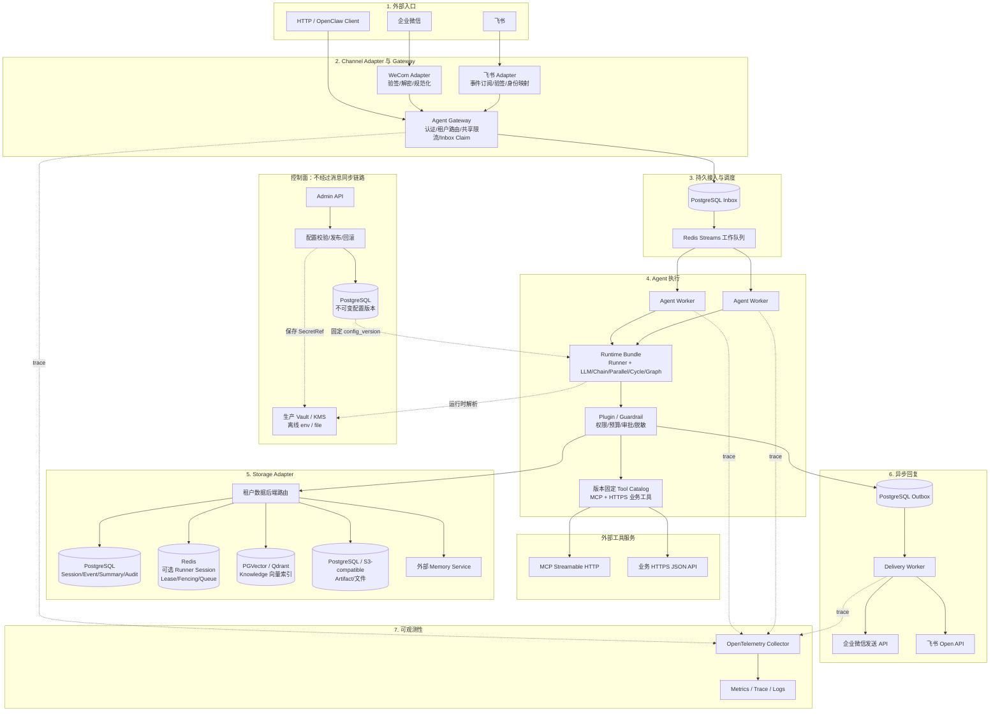
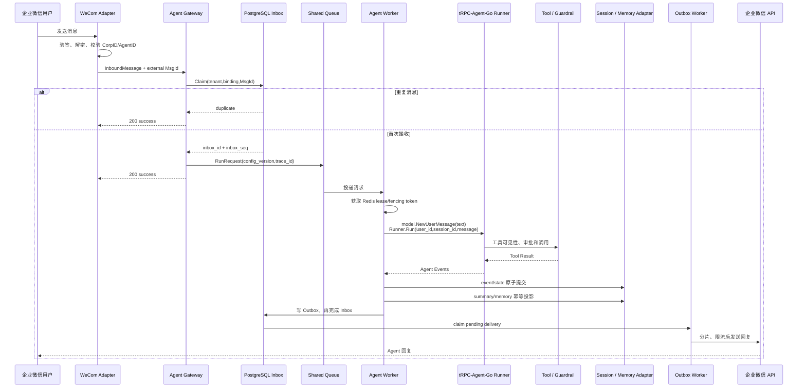

# 多租户节点化 Agent 平台架构设计

> 本文描述当前代码对应的架构、核心时序、数据模型、幂等策略、多后端边界和验收状态。配套材料包括[数据模型](data-model.md)、[消息运行时](message-runtime.md)、[治理与可观测性](governance.md)、[生产 MCP 与业务工具](mcp-tools.md)、[风险清单](risks.md)、[企业微信](wecom.md)、[飞书](feishu.md)和[部署说明](deployment.md)。

## 1. 目标与边界

平台面向多租户、多 IM 入口和可扩缩 Worker，解决数据隔离、节点重启、IM 重投及配置发布时的重复执行和状态倒退问题。

平台以 tRPC-Agent-Go 为执行内核，复用 `runner.Runner`、LLMAgent、Chain/Parallel/Cycle/Graph Agent、Tool、Session、Memory、Artifact、Knowledge、Plugin 和 OpenTelemetry 接口。租户管理、声明式工作流、消息幂等、节点调度、fencing、配置版本、后端路由、IM 账号绑定、审计与成本治理由平台层实现。

## 2. 系统拓扑

系统分成控制面和数据面。控制面负责租户配置的发布与回滚，不进入每条消息的同步调用；数据面接收消息并运行 Agent。两者共享 PostgreSQL 中的不可变配置版本，Worker 执行一次请求时固定使用消息入站时记录的 `config_version`。下图画的是目标拓扑，虚线边框组件属于后续扩展，当前实现边界在第 9 节单独说明。

Agent Gateway 和 Worker 都是无状态节点，不要求负载均衡器提供 sticky session。Gateway 只根据已认证的 `channel_binding` 得到 `tenant_id`、`app_id` 和配置版本，再生成 canonical user/session。实际状态保存在共享后端；任何 Worker 取得队列消息和 session lease 后都能继续执行。

## 3. 租户、配置与隔离

`tenant_id` 是最高隔离边界。一个租户可以有多个 Agent App，每个 App 保存模型配置、系统指令、工具策略、IM 绑定、存储路由和审计策略。配置发布后不可修改；`config_versions` 保存完整的 canonical 配置和内容摘要，`tenants.current_config_version` 是发布头。并发发布使用 expected version 做 CAS，回滚会创建一个新版本，而不是覆盖旧记录。

隔离规则落实在接口和数据模型中：Repository 的每个方法都显式接收 `tenant_id`；SQL 的主键、唯一键、外键和索引以租户字段开头；Runtime Bundle 的键是 `(tenant_id, app_id, config_version)`；工具在展示和执行两个阶段都经过租户策略；模型密钥、IM token 和数据库凭据只保存 `SecretRef`。env/file Resolver 仅用于离线开发和测试；持久化生产配置只接受 Vault/KMS，并强制 key 位于 `tenant_id/app_id/...` namespace。模型、Storage、迁移、IM、Audit 和 Tool 在解析时使用相同 scope，旧发布版本读取时再次校验，Provider 未配置或解析失败时 fail-closed。Vault/KMS bootstrap token 只从部署环境注入，也不能进入发布配置、日志或 trace。日志与 trace 禁止记录 secret value，消息内容是否进入审计由租户的 `AuditPolicy` 决定。

每个 App 可选择单 `llm` 或 `chain`、`parallel`、`cycle`、`graph` 工作流。组合节点、边、Aggregator、循环次数和并发上限都属于不可变配置版本；Parallel 强制最终 Aggregator，Cycle 强制有限迭代，Graph 在发布前校验 entry/finish 和边引用。所有形态仍通过同一 Runner、Session 和治理管线执行。

用户身份和会话身份分别生成：`user_id = {channel_type}/{binding_id}/{external_user_id}`，企业微信的 `channel_type` 是 `wecom`；单聊 `session_id` 为 `dm/{binding_id}/{external_user_id}`，群聊为 `group/{binding_id}/{conversation_id}`，thread/topic 再追加 `/thread/{thread_id}`。`tenant_id` 和 `app_id` 来自服务端绑定，客户端不能自定义 `session_id`。因此同一人在不同群、绑定或租户中不会共享会话作用域。

## 4. 消息执行链路

`trace_id` 在回调时生成或从可信上游提取，随后写入 Inbox、RunRequest、Runner context、Tool span、Session/Memory 写入、Outbox 和审计日志。`request_id` 使用租户作用域的 Inbox ID。这样一次 IM 回调即使跨过 Gateway、队列、Worker 和发送节点，仍能在 trace 中还原。

Adapter 把验签后的企业微信 XML 或飞书事件 JSON 转成 `InboundMessage`。文本直接构造 `model.NewUserMessage`；受控下载的图片在模型显式支持多模态时构造成 image ContentPart，基础文档提取为有界文本。随后调用 `Runner.Run(ctx, user_id, session_id, message, WithRequestID, WithAppName)`。Agent Event 被投影成 `RunEvent`：delta 进入 SSE，最终回复写入 Outbox；飞书 binding 可选择文本或基础交互卡片。

同一 session 的并发写由 Redis fencing token 和 PostgreSQL session head 共同约束。Worker 取得 lease 后先推进 `last_fence`；提交时必须在同一事务中检查 token，并要求 `inbox_seq = last_event_seq + 1`。暂停后恢复的旧 Worker 即使继续运行，也会因 fence 过期而无法写入。

Gateway 和恢复 Poller 把已持久化、已 claim 的请求写入 Redis Streams consumer group，多个
Worker 节点竞争消费。Stream 只负责即时调度，PostgreSQL Inbox 才是可靠事实源；节点崩溃后
由 lease 到期和 `SKIP LOCKED` 生成新 claim。请求状态和取消意图写入 PostgreSQL，Redis
command bus 只做低延迟通知。预算和工具审批同样使用 PostgreSQL 原子 Store，不依赖进程内状态。

提交顺序固定为：Runner 完成后保存 `runner_committed` 回复，`message event + state` 原子提交，随后更新 Summary/Memory 并保存 `derived_committed`，接着创建 Outbox 并保存 `outbox_committed`，最后在审计策略允许时把 Inbox 标记为 completed。Summary 使用 `(version, cutoff_event_seq)` CAS；Memory 以 source event 做幂等；Outbox 以 `(tenant_id, dedupe_key)` 去重。节点在这些持久阶段之间崩溃时从已保存回复恢复，不再次调用 Runner。

这不是对所有外部副作用的绝对 exactly-once 承诺：如果模型或 Tool 已成功、但进程在首次保存 `runner_committed` 前退出，重试仍可能再次执行该调用。tRPC 同一运行内按 Event ID 去重，但重跑会产生新的 Invocation/Event ID，不能仅按共享的 `RequestID` 丢弃一整轮中的合法多事件。因此生产 MCP 发布必须声明幂等，带副作用的 HTTPS 业务工具必须接受稳定 `X-Idempotency-Key`；平台 event、memory 和 outbox 则按稳定 Inbox/source key 保证幂等。详细约束见 [多节点消息运行时](message-runtime.md) 和 [数据模型](data-model.md)。

### 4.1 企业微信与飞书的接入差异

两种通道共用 `InboundMessage -> Inbox -> RunRequest -> Outbox` 主链路，但协议细节由各自 Adapter 处理，不能把外部用户 ID、重试规则或发送限制直接带进 Worker。

| 项目 | 企业微信自建应用 | 飞书自建应用 |
| --- | --- | --- |
| 入站格式 | XML 回调，SHA1 验签并使用 AES-CBC 解密 | JSON 事件订阅回调，校验 `X-Lark-Signature`、Encrypt Key、Verification Token 与 app_id |
| 幂等键 | 优先使用 `MsgId`；事件使用发送者、时间和事件字段派生稳定 ID | 使用事件头 `event_id` 与消息 `message_id` |
| 身份与会话 | `FromUserName`、`ChatId/RoomId` 经过 binding 作用域映射 | `open_id`、`chat_id`、thread/Topic 经过 app binding 作用域映射 |
| 回调处理 | 快速完成验签、Inbox claim 并返回 `200 success` | URL 验证与挑战应答后快速返回 2xx，执行与回复仍走异步 Worker/Outbox |
| 主动回复 | 获取 `access_token` 后调用 `message/send` 或 `appchat/send` | 使用 tenant_access_token 调用 `im/v1/messages`，支持文本与交互式卡片 |
| 平台限制 | 文本按 UTF-8 字节分片，处理成员频率限制和 token 刷新 | 处理消息长度、频控与 token 缓存刷新，群聊需要 @机器人才触发事件 |
| 当前状态 | Adapter、Sender 和协议自动化测试已实现；真实账号 E2E 待部署方复验 | Adapter、Sender 和协议自动化测试已实现；真实账号 E2E 待部署方复验 |

企业微信和飞书的图片/文件在认证后通过固定平台 API 受控下载，媒体标识不会进入 Inbox、日志或审计；类型、大小、超时、临时文件与模型能力边界见 [IM 媒体与飞书卡片](media.md)。未识别语音仍转为安全占位，撤回等事件只确认接收，不触发 Runner；未来若同步撤回状态，应追加 tombstone event，已发生的 Tool 副作用不能自动撤销。

## 5. 最小数据模型

平台逻辑模型中的运行数据都带 `tenant_id`，跨表关系使用租户前缀的复合键。tRPC-Agent-Go Adapter 自带的运行表通过包含租户信息的 canonical `app_name` 隔离。下表是方案验收需要的最小逻辑模型，完整字段、索引和迁移约束见[数据模型](data-model.md)及仓库中的 [`migrations`](../migrations/)。

| 表 | 关键字段 | 主要约束与用途 |
| --- | --- | --- |
| `tenants` | `tenant_id`, `name`, `enabled`, `current_config_version` | 租户根实体；发布头使用乐观并发控制 |
| `agent_apps` | `tenant_id`, `app_id`, `config_version`, `enabled` | 一个租户可发布多个 Agent App |
| `config_versions` | `tenant_id`, `version`, `config_yaml`, `config_sha256`, `status`, `created_by` | 配置版本不可变；回滚创建新版本 |
| `channel_bindings` | `tenant_id`, `app_id`, `binding_id`, `channel_type`, `provider_account_id` | IM 账号绑定租户和 App，凭据只保存 `SecretRef` |
| `session_heads` | `tenant_id`, `app_id`, `user_id`, `session_id`, `last_event_seq`, `last_fence`, `state_version` | Session 顺序、fencing 与 state CAS 坐标 |
| `message_events` | `tenant_id`, `session_id`, `event_id`, `inbox_id`, `event_seq`, `payload_json`, `trace_id` | 追加式事件流；event、Inbox 和序号均租户内唯一 |
| `session_summaries` | `tenant_id`, `session_id`, `summary_version`, `cutoff_event_seq`, `content` | 仅允许以更新的 cutoff/version 替换摘要 |
| `memory_entries` | `tenant_id`, `app_id`, `user_id`, `memory_id`, `source_event_id`, `version`, `content` | 稳定 memory ID；按来源 event 幂等写入 |
| `inbox_messages` | `tenant_id`, `binding_id`, `external_message_id`, `inbox_seq`, `status`, `attempts`, `execution_stage`, `execution_reply`, `execution_event_id` | 吸收 IM 重投并保存 Runner/派生/Outbox 恢复状态 |
| `outbox_messages` | `tenant_id`, `outbox_id`, `dedupe_key`, `binding_id`, `status`, `retry_at` | 回复可靠投递、去重、重试和 DLQ |
| `audit_logs` | `tenant_id`, `channel`, `user_id`, `session_id`, `agent_name`, `tool_name`, `decision`, `latency_ms`, `error_type`, `cost_micros`, `config_version`, `policy_version`, `trace_id` | 记录治理决定、调用结果、成本和版本链路 |
| `run_statuses` / `worker_nodes` | request 状态、cancel intent、worker、heartbeat、draining | 跨节点控制与节点失联观测 |
| `policy_budget_*` / `tool_approvals` | period、request、reserved/actual cost、tool | 原子共享预算与人工审批 |

Session/Event 的事实记录在 PostgreSQL 事务中提交。Summary、Memory、Knowledge 和 Artifact 是从已提交 event 派生的投影：投影失败不会回滚事实事件，而是保留任务和 checkpoint 后重试。这一划分避免向量库或对象存储的短暂故障拖住主会话事务。

PostgreSQL Memory 提交后对其他 Worker 可见；外部 Memory 和向量索引采用最终一致，并用 source event、checkpoint 与索引水位跟踪进度。当前 turn 直接使用 Runner event，不等待异步投影。

## 6. 多后端适配

平台使用按数据域拆分的 Adapter，不设计一个包办所有后端的通用 KV 接口。Session 需要顺序和事务，Knowledge 需要向量召回，Artifact 需要大对象读写；强行统一会丢失各后端真正需要的语义。

`storage.Router` 已实现 PostgreSQL/Redis Runner Session 路由，Artifact 支持 S3-compatible，Knowledge 支持 PGVector/Qdrant 与 OpenAI-compatible Embedding，Memory 支持 PostgreSQL 或外部 HTTPS 服务。Runtime Bundle 按 `(tenant_id, app_id, config_version)` 固定连接和工具；Redis Session 和每个 Knowledge index 都具有独立物理 namespace，Knowledge 还在 metadata filter 再次强制 tenant/App scope。Audit 以 PostgreSQL 为在线事实源，并可同步归档到外置 HTTPS WORM。

目标接口如下，业务代码不应直接依赖 PostgreSQL、Redis 或某个向量库 SDK：

| 接口 | 最小能力 | 必须保留的语义 |
| --- | --- | --- |
| `SessionStore` | `Load`, `CommitTurn`, `ListEvents` | expected seq、fencing token 和 event/state 原子提交 |
| `SummaryStore` | `Get`, `CompareAndSwap` | summary version 与 `cutoff_event_seq` 单调增加 |
| `MemoryStore` | `List`, `UpsertBySource`, `Delete` | tenant/user/app 过滤和 source event 幂等 |
| `ArtifactStore` | `PutRevision`, `Open`, `Delete` | revision、内容摘要、租户权限和短时访问地址 |
| `KnowledgeStore` | `Index`, `Search`, `DeleteVersion` | tenant namespace、文档版本、metadata filter 和索引水位 |
| `AuditStore` | `Append`, `Query`, `PruneTenant` | 只追加、脱敏、保留期和 trace 关联 |

Adapter 可以替换实现，但不能削弱这些语义。某个后端无法提供原子 CAS 时，平台必须在其上增加事务、Lua 脚本或单写协调层；不能用一次“先读再写”伪装成并发安全。

| 数据域 | 生产后端 | 存储内容 | 一致性与取舍 |
| --- | --- | --- | --- |
| Tenant / Config / Channel Binding | PostgreSQL | 租户、App、不可变配置版本、IM 绑定 | 强一致；发布频率低，适合事务和审计 |
| Inbox / 平台 Event / state / Summary 投影 / Audit | PostgreSQL | 幂等消息、会话头、事实事件流、派生摘要、审计 | 事务强一致；热点 session 可能产生行锁竞争 |
| Runner Session / Summary | PostgreSQL 或 Redis | tRPC-Agent-Go 对话上下文和 Runner 摘要 | PG 强一致且易恢复；Redis 延迟低但需 AOF/多副本并接受恢复复杂度 |
| Lease / Fencing / Queue / 热点缓存 | Redis Cluster | Worker 所有权、单调 token、短期状态、命令与事件总线 | 低延迟；fence 最终由 PostgreSQL 校验，Redis 故障时执行 fail-closed |
| Memory | PostgreSQL 或外部 Memory 服务 | 用户长期事实、source event、版本状态 | SQL 便于强隔离；外部服务通常最终一致，读取要接受短暂不可见 |
| Knowledge | PGVector / Qdrant | embedding、文本 chunk、metadata | ingest 完成后可见；物理 namespace 与强制 metadata filter 双重隔离 |
| Artifact | PostgreSQL / S3-compatible | 图片、文件、工具产物 | revision 强一致分配；S3 跨节点分配由共享 PostgreSQL advisory lock 协调 |

默认选择 PostgreSQL Runner Session；低延迟租户可选择 Redis Session，但必须配置独立 namespace、同步写、AOF 和多副本。平台 Event/state/fencing 始终保留在 PostgreSQL，因此 Redis 故障不会破坏 Inbox、提交顺序或已发送记录；当前版本尚未自动用平台 Event 重建丢失的 Redis 对话历史，启用方必须把这项恢复复杂度纳入取舍。Knowledge 与 Artifact 不进入主事务：event 提交后创建派生任务，异步更新向量索引或对象元数据。

后端迁移采用 `dual write -> snapshot/backfill -> verify -> cutover -> rollback window`。先发布带 `migration_target` 的配置版本，新 Bundle 从主库读取并同步双写目标；再通过 Admin API 创建租户/App/domain 任务。多个 Migration Worker 使用 PostgreSQL claim lease 和 `SKIP LOCKED` 分批处理，checkpoint 可恢复。任务完成后，下一次配置发布才能把目标提升为主路由。copier 代码覆盖 Redis ↔ PostgreSQL Runner Session/State/Event/Track/Summary、PostgreSQL Memory、PostgreSQL ↔ S3 Artifact 和 PGVector ↔ Qdrant Knowledge；当前真实容器集成只覆盖 Redis/PostgreSQL，向量库和对象存储仍需目标环境验证。

## 7. 治理、可观测性与故障处理

Worker 在 Runner 之前执行身份和预算预检，在 Tool 展示与执行时再次应用白名单、危险工具审批和权限校验，Runner `GovernancePlugin` 与最终输出层都会脱敏。审计记录 tenant、channel、user、session、agent、tool、decision、latency、error type、cost 和 trace ID。租户可选择 `audit.fail_closed`：关闭时审计失败只产生指标；开启时成功回复必须先完成幂等审计 append，失败会保留 Inbox 重试且不会重复已提交 Runner/Outbox 阶段。

监控覆盖请求量与错误率、模型首 token/总耗时、Tool 调用耗时、IM 回调与投递成功率、token 用量、Session/Memory 后端延迟、Inbox/Outbox/DLQ 积压和 Worker/数据库健康。`agent.cost.micros` 按配置版本中固定的输入/输出价格和 provider usage 计算，并与月度预算核销；`agent.model.usage_missing` 监测无法精确核销的模型响应。Metrics 只使用 tenant、app、channel、operation、status 等受控标签；user、session 和 message 不进入遥测，request/correlation ID 在 trace 中只记录不可逆短 hash，避免时序库基数失控和调用者借标识注入正文或 Secret。原始关联仅保留在受权限保护、按租户隔离的业务表和 audit 中。指标与审计字段见[治理、审计与可观测性](governance.md)。

节点收到取消或超时时调用 `ManagedRunner.Cancel(request_id)`，然后在有界时间内排空事件 channel。Tool 必须接受 `context.Context`，外部副作用使用业务幂等键，不能靠 goroutine 脱离请求继续执行。模型超时、数据库短暂不可用和 Outbox 投递失败进入分类重试；不可重试错误写入 DLQ，并保留原始 request/trace 关联。

配置灰度以租户或 App 为单位。新版本发布后，新消息固定进入新 Bundle，旧请求继续持有旧 Bundle lease，直到执行结束才关闭。回滚仍发布新配置版本。容量评估以四组数据为准：IM 回调峰值、每节点活跃 Runner 数、平均/高分位 token 与工具耗时、PostgreSQL/Redis/向量库 QPS。扩容信号优先看队列等待时间和 Outbox backlog，而不是只看 CPU。

主链路上线前优先处理以下风险；完整的 18 项清单、监测项和演练方法见[生产风险清单](risks.md)。

| 编号 | 生产风险 | 主要缓解措施 |
| --- | --- | --- |
| R1 | 旧 Worker 越权写入 | Redis fencing；PostgreSQL 校验 `last_fence` |
| R2 | IM 重投触发重复执行 | Inbox 唯一键；仅首次 claim 入队 |
| R4 | 数据库故障或热点锁竞争 | 有界超时、连接池限额、顺序消费和积压告警 |
| R6 | 模型/Tool 卡住 goroutine | 传播 context、Cancel、有界排空 event channel |
| R8 | IM 超时、限流或超长 | 快速 ACK；Outbox 分片、限流、退避、DLQ |
| R9 | 密钥泄漏 | 只存 `SecretRef`；日志、trace、错误脱敏 |
| R10 | 查询遗漏租户条件 | tenant 参数、复合键、向量 filter、双租户测试 |
| R15 | 已发送但状态未落库 | 两阶段状态；未知结果进入 `uncertain` |

## 8. 部署方案

最小可运行环境使用根目录的 Docker Compose：默认保留一个 Gateway/Worker 合并进程；`multinode` profile 提供一个 Gateway、两个 Worker、共享 PostgreSQL/Redis 和一次性 migration。两个角色均无本地会话状态，不依赖 sticky session。模型、IM 和数据库密钥从外部环境或挂载的 secret 文件读取。启动与验证命令见 [PostgreSQL + Redis 部署](deployment.md)。

生产可用 `--role gateway` 和 `--role worker` 拆分入口与 Runner：Gateway 只写 Redis Stream，不构造 Runtime 或启动消费者；Worker 不监听业务 HTTP 端口，负责消费、Inbox recovery、Runner、Outbox 和当前后台维护任务。Kubernetes 基线为两个角色提供独立 Deployment、PDB 和 HPA。`--role all` 只用于 Compose 兼容和小规模环境。Outbox 与 maintenance 独立角色、自定义队列指标 HPA 仍待后续增量。PostgreSQL、Redis、对象存储和向量库使用托管或高可用集群。Pod 不挂载会话本地盘，也不依赖 sticky session。配置发布先进入少量租户，指标越过阈值即停止灰度并发布回滚版本。数据库迁移由独立 Job 串行执行，不能放在每个应用 Pod 启动流程中并发运行。

## 9. 框架复用、平台新增与当前边界

| 能力 | 直接复用 tRPC-Agent-Go | 平台负责 |
| --- | --- | --- |
| Agent 执行 | Runner、LLMAgent、Chain/Parallel/Cycle/Graph Agent、Event stream、Tool/MCP | 声明式工作流配置、Runtime Bundle、版本固定、节点调度和取消转发 |
| 状态能力 | Session、Memory、Artifact、Knowledge 接口 | 租户后端路由、fencing、迁移任务和数据隔离 |
| 治理 | Plugin、Guardrail、Tool Filter/Permission | 租户策略、预算账本、审批存储和审计规则 |
| 服务协议 | OpenClaw 与服务化接口 | IM 验签、账号绑定、Inbox/Outbox 和身份映射 |
| 可观测性 | OpenTelemetry hook | 跨节点传播、低基数指标、token 统计、版本化成本和日志脱敏 |

当前仓库已经实现配置版本、控制面数据模型、LLM/Chain/Parallel/Cycle/Graph Runtime Bundle、PostgreSQL + Redis 组合器、Inbox/fencing/Outbox、三阶段执行恢复与 DLQ、Outbox Delivery Worker、Redis Streams 跨节点调度、共享 cancel/status/预算/审批、节点心跳、Gateway Redis 跨节点入口限流、租户 Runner 动态并发配额、多 PostgreSQL Storage Router、S3 Artifact、PGVector/Qdrant Knowledge/RAG、可恢复双向迁移 Worker、外部 Memory、外置 Audit/WORM、租户级 Audit fail-closed、Vault/KMS-compatible HTTPS Secret Provider、治理 Plugin 与自动保留期清理、OpenTelemetry SDK/Collector、Prometheus/Grafana、生产 Admin 控制面与动态 Bundle 切换、Gateway/Worker 角色拆分、生产 MCP Registry、HTTPS JSON 业务工具，以及企业微信和飞书两个 Channel Adapter/Sender。复杂格式文档解析、投递异常 Web 运维页、Delivery/maintenance 独立角色和队列自定义指标 HPA 属于后续增强，不是本次基础验收的必要项。`skill`、`web`、`workspace` 目录目前不是已交付能力，不纳入完成项。

## 10. 验收目标与当前状态

目标是让 Gateway/Worker 无状态扩容，IM 重投不重复执行，旧 Worker 不能覆盖新状态。配置、数据、工具和密钥按租户隔离；`trace_id` 串起回调、模型、Tool、存储与回复。token 与租户成本按不可变配置版本形成预留、实际 usage 核销、Metrics 和 Audit 闭环。

验收时使用以下结果判断链路是否成立：

| 目标 | 验证方式 | 通过条件 |
| --- | --- | --- |
| 租户隔离 | 两个租户使用相同外部用户、session 和 message ID 并发请求 | 数据互不可见，且不会互相命中幂等键 |
| 消息可靠性 | 并发重投、Worker 中断、Outbox 发送失败回放 | event、Memory 和可确认的 IM 回复不重复；超限任务进入 DLQ/uncertain |
| 节点扩展 | 启动多节点并制造 lease 转移 | 新节点可以恢复任务，旧 fencing token 写入被拒绝 |
| 配置安全 | 并发发布、回滚、禁用租户/App | 冲突返回明确错误；历史版本不被覆盖；禁用对象不能运行 |
| 可观测性 | 执行一次含 Tool 的完整消息 | callback、Runner、Tool、存储和投递共享同一 trace |
| 可部署性 | Compose 启动后执行 HTTP smoke、迁移回放和测试 | PostgreSQL/Redis 链路可运行，migration 可重复执行 |

当前代码已覆盖表中基础实现目标，企业微信与飞书协议自动化已纳入 CI。真实平台 E2E、目标环境容量标定和专用 kind 集群验收仍需部署方执行并留存脱敏证据；生产部署还需完成托管依赖高可用配置、告警通知渠道和外部密钥系统接入。
