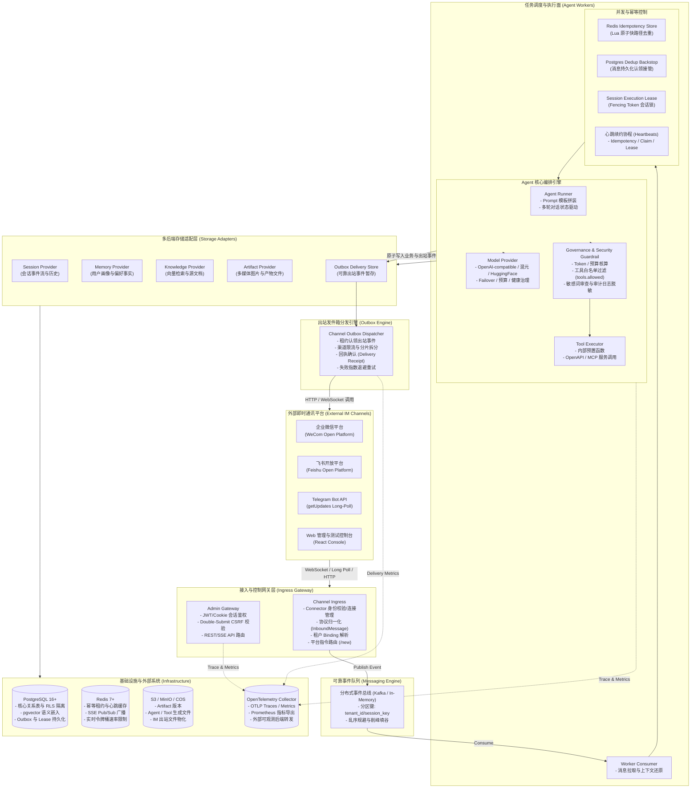
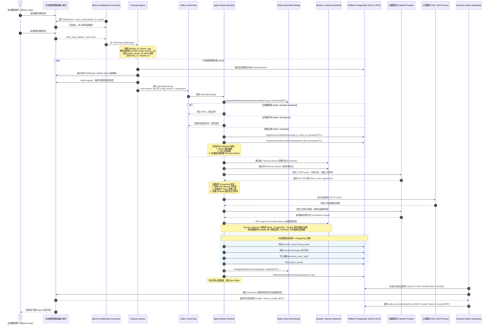
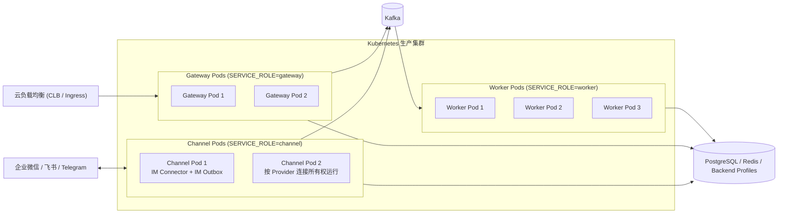

# tRPC Agent Service 架构设计文档

## 1. 系统概述与设计哲学

### 1.1 系统定位
`trpc-agent-service` 是面向企业级应用场景的多租户 AI Agent 托管与连接服务平台。平台基于腾讯开源分布式 RPC 框架生态及 Go 现代化并发体系构建，向下整合企业微信（WeCom）、飞书（Feishu）、Telegram 等主流即时通讯通道，向上沉淀多租户隔离、动态大模型编排、工具准入治理、长短期记忆召回、知识库检索增强（RAG）以及全链路审计的统一控制与运行时基座。

### 1.2 核心设计哲学
1. **多租户数据主权与强隔离（Multi-tenant Sovereignty）**：所有业务模型、凭证、路由、执行痕迹与存储后端均严格按 `tenant_id` 进行边界划分。持久层依托 PostgreSQL 行级安全性策略（Row Level Security, RLS）与连接上下文注入，杜绝跨租户越权。
2. **两级幂等与确定性故障自愈（Two-tier Idempotency & Fencing）**：利用 Redis 原子租约与数据库持久状态机实现前向去重与后向接管，通过单调递增的 Fencing Token 阻止失去租约的旧执行提交平台最终状态。
3. **事务性消息发件箱模式（Transactional Outbox Pattern）**：外部 IM 通道通常具备网络延迟高、限流严格、部分通道不支持跨步幂等的特性。平台将业务状态演进与回复事件持久化绑定在同一个强一致事务内，由独立的可靠 Outbox 发送引擎驱动回复，达成 At-least-once 可靠投递。
4. **控制面与数据面解耦（Control-Data Plane Decoupling）**：Gateway / Channel Connector 负责协议终结、身份校验、消息标准化与入站派发；Worker 负责耗时的大模型推理、Tool / MCP 调用与知识检索；独立调度器与探针维护节点生命周期，支持服务平滑缩扩容。
5. **派生数据可重建与模块化多存储（Derivable Indexes & Storage Pluggability）**：Knowledge 向量索引与 Summary 等派生状态可从权威源重建；Session、Memory、Knowledge、Artifact 则通过各自 Backend Profile 选择合适的一致性与运维边界。

---

## 2. 系统全景架构图

平台整体拓扑分为 **接入网关层（Ingress Gateway）**、**消息中枢与事件总线（Message Bus & Outbox）**、**执行与治理运行时（Worker & Guardrail）**、**适配抽象层（Storage & Channel Adapters）** 以及 **基础设施底座（Infrastructure）**：



---

## 3. 核心时序图：企业微信消息全链路闭环

以下展示当前代码实际采用的**企业微信智能机器人 WebSocket 长连接**链路。`traceparent` 在入站 Connector 创建消息时进入平台上下文，随后写入 Kafka Envelope，并继续传递到 Worker、模型/工具调用与 Outbox 投递。



---

## 4. 系统分层架构与核心模块设计

### 4.1 接入网关层（Ingress Gateway）
接入层负责把各渠道的连接生命周期和协议差异收敛为统一消息契约：
1. **多渠道 Connector**：
   - **企业微信智能机器人**：通过 `wss://openws.work.weixin.qq.com` 建立 WebSocket，使用 `bot_id + secret` 完成 `aibot_subscribe`，连接中断后按退避策略重连；
   - **飞书**：使用官方 Lark WebSocket/Channel SDK 接收消息与卡片事件，出站通过官方 API 发送或更新消息；
   - **Telegram**：使用 Bot API `getUpdates` 长轮询，持久化单调递增 offset，并依据 `retry_after` 处理 429；
   - **Web 控制台**：基于 `Cookie` 会话鉴权 + Double-Submit CSRF，异步聊天通过 HTTP 入队与 SSE 订阅结果。
2. **入站对象标准化**：将异构报文清洗为平台通用的 `InboundMessage` 统一结构（提取 `MessageID`、`SenderID`、`ConversationID`、`ConversationScope` 等），解耦底层业务与通道差异。
3. **前置进度感知（Progress Sender）**：在耗时推理前创建渠道原生的进度消息或 typing 状态；最终回复尽可能更新同一条进度消息，减少用户看到多条中间消息。

当前三类 IM 的接入差异如下。租户配置只保存 `credential_ref`，实际 Secret 在 Connector 构造时才由 `SecretResolver` 解析，既不进入租户配置快照，也不写入日志或 Trace：

| 渠道 | 入站方式 | Credential 内容 | 群聊处理 | 出站特点 |
| --- | --- | --- | --- | --- |
| 企业微信智能机器人 | WebSocket 长连接 | `bot_id`, `secret` | 识别群会话与触发用户，支持当前 callback token | 支持可更新的流式进度消息/卡片 |
| 飞书 | 官方 Lark WebSocket | `app_id`, `app_secret` | 保留群/单聊 scope 与卡片 Action | REST API 创建/更新消息与交互卡片 |
| Telegram | `getUpdates` 长轮询 | `bot_token` | 群聊可按触发策略过滤，offset 持久化 | `sendChatAction` + 消息发送/编辑，显式处理 429 `retry_after` |

`channel_bindings` 用 `(tenant_id, app_code, channel_type, binding_id)` 把一个外部机器人账号绑定到唯一租户应用；`channel_identities` 再把 `(channel_type, binding_id, external_user_id)` 映射到平台用户。未建立可信身份映射时，渠道外部 ID 只在当前租户/应用命名空间内作为会话参与者使用，不会据此跨租户合并历史。群聊还会单独保留触发者（actor）与群会话身份，避免把群成员身份等同于群 Session 所有者。

渠道限制由 `ChannelDeliveryPolicy` 与具体 Sender 统一调度：Telegram 文本按安全字符上限拆分并适配 `retry_after` 限流响应，企业微信与飞书优先使用原生进度卡片或流式更新能力，图片与文件附件则先转存至租户绑定的 Artifact 存储域。统一 `Sender` 契约聚焦于消息投递、富媒体卡片展示与进度流式刷新；针对各渠道专属的差异化操作（如消息撤回、卡片高级交互等），后续可通过扩展特定 Provider 的定制 Action 实现。新增外部通讯通道时，应在 Connector 内部实现协议归一化与验签解密，保持 Agent Runtime 契约纯粹无污染。

### 4.2 执行面调度与 Worker 架构
1. **去中心化无状态 Worker**：Worker 节点之间完全对等，基于一致性分区键（`tenant_id + session_key`）消费消息总线任务，保障同一会话的时序确定性。
2. **分布式执行租约（Session Execution Lease）**：
   - 即使消息被错误地广播至多个 Worker，PostgreSQL 中的 `session_execution_leases` 表也只允许单个实例获取排他锁；
   - 伴随租约获取，颁发严格单调递增的 `fencing_token`；
   - 后台守护协程按 `TTL/3` 的时间窗口对租约进行心跳保活；
   - 若 Worker 出现 GC 停顿或网络分区导致租约过期，旧 Worker 的平台最终状态提交会因 `fencing_token` 不匹配被拒绝，避免它覆盖新持有者已经确认的执行结果。

3. **不依赖 Sticky Session**：Gateway 在入站阶段已经解析出稳定的 `session_key`，并把它与不可变 `config_version` 一起写入 Kafka Envelope。任意 Worker 都可以从共享 Session / Memory 后端恢复上下文，因此负载均衡器无需把同一用户固定到同一 Pod。Kafka 以 `session_key` 作为分区键维持队列内顺序，数据库 Session Lease 则作为跨分区、重试和故障接管时的最终并发栅栏。

4. **Session 标识与单聊/群聊隔离**：平台 Session 使用 `tenant_id/app_code/session/<uuid>` 的渠道无关主键，外部渠道 ID 单独存入 `channel_conversations`。单聊路由可在可信身份绑定后归属到平台用户；群聊按租户、应用、渠道绑定和群会话维护独立路由，不与个人单聊自动合并。任何路由都先受 `tenant_id + app_code` 命名空间约束，跨租户不会共享 Session。

### 4.3 治理与运行时安全护栏（Guardrail Engine）
平台在调用大模型与工具执行的前后，挂载管道式拦截器（Pipeline Interceptors）：
1. **工具白名单准入（Tool Allowlist）**：Runner 装配阶段只暴露租户允许的 Tool / MCP，运行时再通过框架 Tool Callbacks、Guardrail 与审批 Reviewer 校验角色、调用预算以及 `require_confirmation` 策略。
2. **多租户预算与配额管控（Budget & Cost Ledger）**：按租户跟踪请求速率、并发 Run、小时 Token 预算、预留 Token 和实际 Provider 用量；超限请求在进入模型执行前被治理层拒绝。
3. **审计与隐私边界**：Session 仍保存 Agent 正常工作所需的租户会话内容；Audit、Metric 与持久化 Execution Trace 不复制原始 Prompt、Tool 参数、模型输出或密钥，只记录路由标识、决策、耗时、用量和脱敏摘要。

### 4.4 可靠出站发件箱（Channel Outbox Dispatcher）
为应对 IM 通道网络闪断、速率限制（Rate Limiting）及外部服务不可用：
1. **事务内生成发件任务**：业务逻辑产出回复后不直接将结果视为已送达，而是在平台控制面状态事务中原子写入 `outbox_events`。底层框架 Session 与 Memory 独立对接租户存储适配器，通过分层解耦避免引入脆弱的跨异构分布式事务。
2. **分片与退避投递**：
   - 独立调度器以 `SELECT ... FOR UPDATE SKIP LOCKED` 方式批量获取任务；
   - 针对不同渠道的单消息长度限制（如企业微信 2048 字符）执行语义友好的分段拆分；
   - 遇到限流或网关异常时，依据指数退避算法（Exponential Backoff）重试，保留重试次数与最后错误堆栈。
3. **外部回执跟踪与 At-least-once 保障**：发送成功后记录外部平台返回的物理 Receipt。面对跨网络边界的不可靠通信，系统基于 At-least-once 原则设计：通过全局请求幂等键、可复用更新的进度占位卡片、严格的投递租约及 Receipt 确认机制，在保障高可用的同时将重复发送概率降至最低。

---

## 5. 多租户隔离体系与数据安全

### 5.1 租户逻辑边界划分
每个接入实体划分为 `tenant_id`，一个租户内部可创建多个独立的 Agent 应用（`app_code`）。租户间数据在以下维度实现全生命周期隔离：
- **元数据层**：应用配置快照、版本历史、API 凭据均带 `tenant_id` 复合主键；
- **计算层**：Worker 上下文注入租户身份，模型网关分租户计量统计；
- **存储层**：关系数据库启用 PostgreSQL RLS。平台控制表使用 `app.tenant_id`，框架 Session / Memory 表使用租户应用级 `app.app_name`，事务进入数据库前由 `dbscope` 注入对应作用域；
- **外发层**：IM 回复通过租户独占的渠道凭证（AppID / Secret）进行调用，严禁混用通道。

### 5.2 审计与可观测性体系
1. **全链路分布式追踪**：基于 OpenTelemetry 规范，在请求入站处生成全局唯一的 `trace_id`，穿透网关、消息队列、Worker、LLM 调用与出站投递。
2. **指标集**：服务使用 OpenTelemetry Meter 定义 `agent.execution.*`、`channel.inbound.*`、`channel.delivery.*`、`platform.store.*`、`model.tokens.*`、`model.cost.microunits`、`tool.execution.*`、`messaging.kafka.consumer.lag`、`outbox.pending.events` 等指标；Prometheus exporter 会按其命名规则转换成 Prometheus 指标名。模型调用本身同时复用 tRPC-Agent-Go 的 GenAI 标准指标，平台自定义指标主要补充租户、Provider、成本、治理和后端容量维度。

---

## 6. 核心接口契约规范

### 6.1 入站消息契约 (`InboundMessage`)
```go
type InboundMessage struct {
    MessageID          string            // 渠道唯一消息 ID（去重主键）
    Channel            Channel           // 渠道枚举 (wecom / feishu / telegram / web)
    ConversationID     string            // 渠道会话/群聊 ID
    ConversationScope  ConversationScope // 作用域 (direct / group)
    SenderID           string            // 渠道外部发送人标识
    Text               string            // 归一化文本正文
    Files              []InboundFile     // 附件文件元信息
    ProviderReplyToken string            // 通道被动回复所必需的瞬时凭证
    ProgressMessageID  string            // 进度占位消息 ID
}
```

### 6.2 幂等认领契约 (`ExecutionDedupStore`)
```go
type ExecutionDedupStore interface {
    Begin(ctx context.Context, tenantID, appCode, channel, bindingID, messageID, traceID string, window time.Duration) (BeginResult, error)
    Abort(ctx context.Context, tenantID, channel, bindingID, messageID, traceID string) error
    Fail(ctx context.Context, tenantID, channel, bindingID, messageID, traceID string) error
    Renew(ctx context.Context, tenantID, channel, bindingID, messageID, traceID string) error
}
```

### 6.3 会话锁契约 (`SessionExecutionLeaser`)
```go
type SessionExecutionLeaser interface {
    AcquireSessionExecutionLease(ctx context.Context, tenantID, sessionKey, ownerID string, ttl time.Duration) (SessionExecutionLease, error)
    RenewSessionExecutionLease(ctx context.Context, lease SessionExecutionLease, ttl time.Duration) (SessionExecutionLease, error)
    ReleaseSessionExecutionLease(ctx context.Context, lease SessionExecutionLease) error
}
```

---

## 7. tRPC-Agent-Go 复用边界

平台原则是“框架负责 Agent 机制，平台只补企业级控制面与分布式边界”，避免复制 tRPC-Agent-Go 已有能力：

| 能力 | 直接复用 tRPC-Agent-Go | 平台新增职责 |
| --- | --- | --- |
| Agent 执行 | `runner.Runner`、`llmagent`、流式 Event、Execution Trace、Context 取消 | 按不可变租户版本缓存/装配 Runner，Kafka Worker 调度 |
| Session / Summary | `session.Service` 与 PostgreSQL / Redis / MySQL / SQLite / MongoDB 等实现，框架 Summary | Backend Profile 选择、渠道到 Session 路由、排他 Lease、在线迁移；Summary 作为派生数据随主 Session 后端重建 |
| Memory | `memory.Service`、Session Ingestor、Memory Tool | 租户后端选择、群聊安全边界、用量与健康治理 |
| Knowledge | `knowledge.Knowledge`、Reader / Source、VectorStore、Reranker | 租户知识源策略、SSRF/路径白名单、异步摄取、向量后端迁移 |
| Artifact | `artifact.Service` | 租户 Profile 路由、S3/COS 凭据解析、IM 出站文件物化 |
| Model | OpenAI / Hunyuan / HuggingFace、Failover、Model Callbacks | Provider 目录、输入能力声明、成本计量、跨请求后端健康熔断 |
| Tool / MCP | Function Tool、MCP ToolSet、Tool Callbacks、Plugin / Guardrail / Approval | 租户白名单、角色策略、Secret 注入、副作用 Ledger 与审计 |
| Telemetry | tRPC-Agent-Go OpenTelemetry / GenAI 指标与 Trace | 平台租户、Kafka、Outbox、存储、成本和治理指标 |
| IM | 复用框架“Channel/Gateway 分责”的设计思想 | 落地企业微信、飞书、Telegram Connector 并定义统一 `InboundMessage` / `Sender` 契约 |

tRPC-Agent-Go 框架的 `server/openai`、`server/agui` 等服务化扩展可作为未来外部协议接入前端；当前平台管理面、Web Chat 与 IM 交互由平台统一 API Gateway 承载调度。

---

## 8. 部署、灰度与故障恢复



- **水平扩缩容（HPA）**：Gateway 与 Worker 不持有必须留在本机的业务状态，依据 CPU、内存、Kafka Lag 与 Worker Slot 使用率扩缩容；真正的并发上限同时受 Kafka 分区数、`WORKER_CONCURRENCY` 和租户 `max_concurrent_runs` 约束。
- **Outbox 架构与连接绑定**：Outbox 作为逻辑组件根据节点角色按需加载（Web 回复由 Gateway 认领分发，IM 回复由 Channel 角色处理）。对于依赖持久长连接的通道（如企业微信 WebSocket 与飞书长连接），Outbox 任务认领机制与 Connector 的连接所有权进行绑定仲裁，确保由持有活跃长连接的实例执行任务投递与进度刷新。
- **优雅停机（Graceful Drain）**：节点收到 `SIGTERM` 后停止认领新任务，等待已经认领的 Kafka Delivery / Outbox Delivery 完成。执行路径统一使用 `context.Context` 取消；后台 goroutine 通过 `safego` 管理 panic 边界；Runner 事件在调用方提前返回时继续排空，避免生产者因无人消费而泄漏。
- **租户级灰度**：应用先创建唯一候选版本，再通过 `application_rollouts` 固化 `stable_version`、`candidate_version`、`basis_points`、测试用户与入口范围。入站时完成稳定选择并把 `config_version + rollout_generation` 固化到 Envelope，执行中途不会因管理员再次发布而漂移。
- **回滚**：停止灰度不会删除候选版本；管理员可丢弃候选、将候选提升为稳定版本，或从任意历史快照重新发布一个新的递增版本。运行中的消息继续使用入站时已经冻结的版本。
- **依赖故障**：PostgreSQL / Redis / 模型 / 外部存储均按错误类型进入重试、熔断或失败路径；不会在依赖不可用时伪造成功。Kafka 可重试消息只有在业务结果持久化或成功写入 DLQ 后才提交 Offset。
- **模型超时 / Provider 故障**：模型调用继承请求 `context.Context`；超时或上游取消会终止当前执行。配置了 Failover Candidate 时由 tRPC-Agent-Go Failover 处理符合条件的 Provider 失败；平台 Backend Health 负责跨请求快速失败与恢复探测，持续故障不会被包装成成功回复。
- **Tool / MCP 失败**：普通只读 Tool 错误作为 Agent Event 继续进入框架错误路径；有副作用 Tool 额外写入执行 Ledger，若网络中断导致结果未知则记录 `outcome_unknown`，禁止把未知结果当作安全重试条件。需要人工批准的 Tool 通过 Guardrail / Approval Reviewer 暂停在调用前，而不是执行后补审计。
- **数据库短暂不可用**：涉及租约、持久幂等、审计或 Outbox 的关键写入失败时本轮执行不提交完成态；Kafka Worker 保留可重试语义，Outbox 已持久任务在数据库恢复后继续认领。该策略优先保证“不要确认一个没有落盘的成功”，而不是返回过期缓存伪造可用性。
