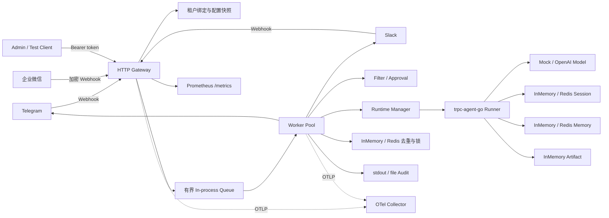
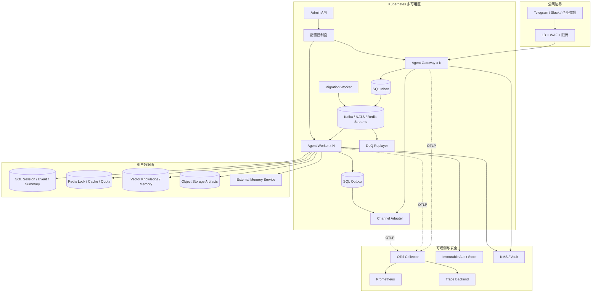
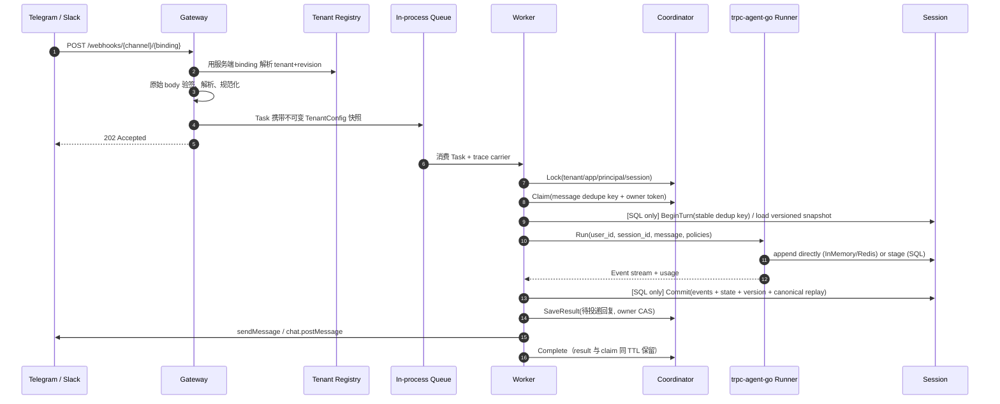
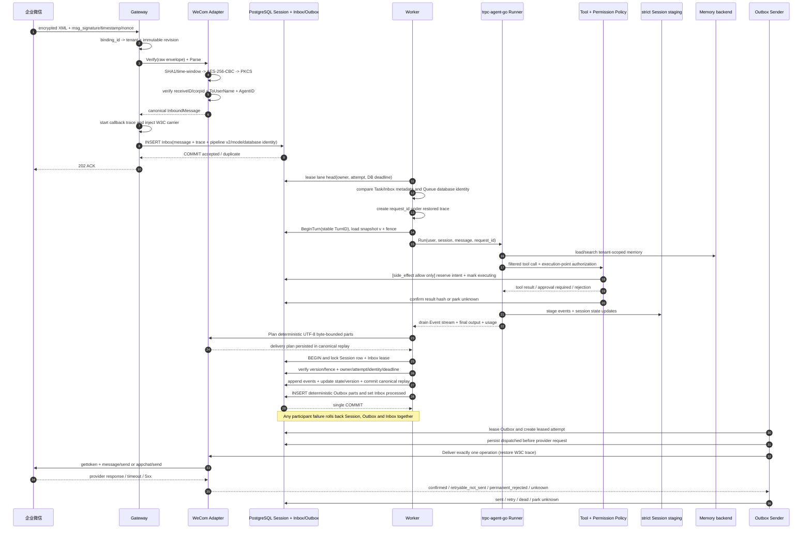
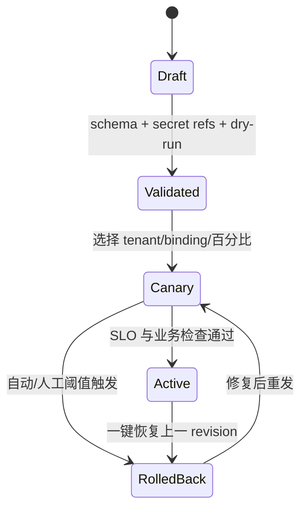

# 多租户 Agent 平台架构设计

本文给出基于 `trpc-agent-go` 的多租户、多 IM Agent 平台设计。为避免把方案描述成已经完成的功能，全文使用以下标记：

- **最小实现**：当前 `solution/` 中可运行、可由测试或接口直接验证的行为。
- **部分实现**：已有接口、配置或单机语义，但尚不满足生产级持久化、多节点或完整治理要求。
- **生产推荐**：赛题要求的目标架构；需要替换或增加基础设施后才能获得所述保证。

## 1. 目标、边界与不变量

平台允许同一组 Gateway/Worker 服务多个租户，每个租户独立选择 Agent、模型、工具、IM 绑定、数据后端、预算和审计策略。最重要的不变量是：

1. 外部请求不能自行声明 `tenant_id`。Webhook 路径中的 `(channel, binding_id)` 必须先命中服务端绑定，再由绑定反推出租户。
2. 每个存储键、队列分区键、锁键和缓存键都包含不可伪造的租户命名空间。
3. 同一逻辑 session 的写入按顺序提交；不同 session 可并行。
4. 工具权限在执行点再次校验，不能只依赖提示词或工具列表隐藏。
5. 秘密只保存引用，正文默认不进入日志、指标或 trace。
6. 配置修订在一次请求内固定，热更新不能改变正在执行的请求。

当前代码已落实 1、2、4、5 的主要路径；`postgres`/`memory` Durable 队列与 Worker 锁共用完整 Session lane。选择 `queue.backend=postgres`、`data.session.type=sql` 且二者引用同一 `dsn_env` 时，Session events/state/version/canonical replay、确定性 Outbox 与 Inbox processed 已在一个 PostgreSQL 事务提交，并同时校验 Session fencing 与 Inbox lease/身份。Task/Inbox 再持久化 pipeline version、atomic mode 和无凭据 database identity，使新 required 记录在能力或数据库发生漂移时 fail-closed。外部工具副作用使用独立的 tenant-scoped operation ledger 在最终授权后持久化 dispatch fence；模型用量由同一 Queue PostgreSQL 的 006 账本独立持久化，Redis coordination 提供跨节点 RPM；007 配置控制面持久化 revision/release、generation CAS、稳定灰度和节点 ACK；008 持久化 Summary、水位、SQL Audit 链和迁移对账。它们阻止盲目重放，但不冒充 Session 组合事务的一部分。生产环境已通过 Redis 共享审批状态，仍需验证 Redis 持久化/故障切换并补 provider reconciliation。

## 2. 租户模型

当前 `config.TenantConfig` 已覆盖赛题要求，YAML 使用 `KnownFields(true)` 拒绝未知字段：

| 维度 | 当前字段 | 用途与隔离边界 |
| --- | --- | --- |
| 租户标识 | `tenant_id`, `version`, `enabled` | 稳定主键、配置修订、启停开关 |
| 应用 | `app.name`, `agent_name`, `description`, `instruction` | Agent 实例和框架 app namespace |
| 模型 | `provider`, `name`, `variant`, `base_url`, `api_key_env`, token/价格参数 | 每租户模型、凭据引用与成本计算 |
| 工具 | `allow`, `deny`, `require_confirmation`, `side_effects` | 可见性过滤、执行点授权、二次确认与持久副作用 fencing |
| IM | `type`, `binding_id`, token/签名 secret 的环境变量名、允许用户、长度 | 账号绑定、验签、身份准入 |
| 数据 | `session`, `memory`, `summary`, `artifact`, `knowledge`, `audit_log` | 每类数据单独选后端与 namespace |
| 审计 | `enabled`, `sink`, `path`, `redact_patterns`, `log_content` | 租户级审计去向和脱敏策略 |
| 预算 | RPM、最大输入字符、月成本上限 | 请求、输入和成本治理 |

`tenant_id`、app 名、agent 名和 `binding_id` 仅接受受限的安全字符。相同 `(channel, binding_id)` 不能属于两个租户。生产推荐把配置存为带版本和签名的不可变文档，并维护 `desired_revision`、`active_revision`、审批人和发布时间，而不是以本地 YAML 作为唯一事实源。

## 3. 组件与部署拓扑

### 3.1 当前最小实现

当前二进制将逻辑组件装配在一个进程中，适合本地演示和单节点验收：



`Gateway`、`Channel Adapter`、队列、`Worker`、`Storage Adapter` 装配和 Admin API 都已存在，但仍是同进程模块；默认 `inmemory` 队列、审批 nonce、限流、InMemory 模式的 Session/Memory 和 Artifact 在进程重启后丢失。切换 `queue.backend=postgres` 后 Inbox/Outbox、预算账本和 007 配置控制面可跨进程恢复；`/healthz` 只检查进程存活，`/readyz` 还会检查 drain、控制面初始同步、Durable Store，以及 production 配置中 Session/Memory/Summary/Artifact/Knowledge/Content Safety/Audit 等已配置依赖，并刷新低基数依赖和队列深度指标。local/demo 的按需后端只报告 degraded，不阻塞零依赖冒烟。

### 3.2 生产推荐拓扑



组件职责如下：

| 组件 | 责任 | 扩缩容键 |
| --- | --- | --- |
| Agent Gateway | 验签、绑定解析、规范化消息、持久 Inbox 后快速 ACK | callback RPS、验签 CPU、Inbox 延迟 |
| Channel Adapter | 平台协议和通用消息模型互转、限频、拆包、重试 | 每平台发送 QPS/积压 |
| Durable Queue | 按 session 分区、有序重投、背压、DLQ | backlog、consumer lag |
| Agent Worker | 治理、Runner、模型/工具调用、状态提交、生成 Outbox | 活跃 run 数、模型等待时间 |
| Storage Adapter | 统一 Session/Memory/Summary/Artifact/Knowledge/Audit 能力 | 各后端 QPS/容量 |
| Admin API/配置控制面 | 校验、发布、灰度、回滚、审计 | 配置变更率；不在数据面热路径 |
| Telemetry Collector | 采集、尾采样、脱敏、导出 | spans/s、日志字节/s |

## 4. 一条消息如何运行

### 4.1 默认进程队列路径

默认 `queue.backend=inmemory` 的执行顺序如下。此模式的 Webhook `202` 只表示任务进入本进程队列，ACK 后崩溃可能丢任务，预算和控制面也只适合本地/demo；切换为 `postgres` 时，图中的入队步骤替换为持久 Inbox INSERT 提交后再 ACK，并启用 006 模型用量账本、007 配置控制面和 008 生命周期账本。



当前 `queue.backend=postgres` 将接收替换为 `INSERT Inbox ON CONFLICT (dedup_key) DO NOTHING` 与事务提交后 ACK；Inbox relay 按 Session lane 消费。普通 InMemory/Redis Session 租户仍在独立的 Inbox 完成事务中批量写入确定性 Outbox。Sender lease 时原子写 `leased` attempt，调用平台前提交 `dispatched`，再把四态结果与主行原子完成：confirmed→sent、retryable_not_sent→retry、permanent_rejected→dead、unknown→无租约停车。dispatched 崩溃也按 unknown 恢复，因此不会自动重复可能已成功的发送；同 Session 后继被阻塞，其他 Session 继续运行，管理员可经 CAS 决议。

### 4.2 企业微信 + strict SQL + PostgreSQL Queue 核心时序

下图是当前已经实现的最强一致路径，适用条件严格限定为 `queue.backend=postgres`、租户 `data.session.type=sql`，且两者使用相同 `dsn_env`。图中的数据库事务不包括 Memory、审计/用量结算和工具的外部副作用；企业微信发送也不可能与本地数据库形成原子提交，因此不能据此宣称端到端 exactly-once。



首次提交时，Worker 在 strict Session 的事务中调用 PostgreSQL Queue participant；participant 复核完整 Inbox lease 身份和数据库 deadline，再写分片 Outbox，最终以 Inbox processed 作为最后的数据变更。若 Turn 已由并发胜者提交，participant 读取并解码数据库中的 canonical replay，在当前有效 Inbox lease 下补齐同一 Outbox，而不是使用输家的本地输出。提交后的 Coordinator result 仅是缓存/清理状态，失败不会把已经原子完成的 Inbox 重新武装。

### 4.3 滚动升级协议：旧记录可恢复，新记录不降级

Queue 在接收边界覆盖调用方提供的 rollout 字段。Task payload 保存 `pipeline.schema_version`、`pipeline.atomic_commit_mode`、`pipeline.database_identity`，Inbox 独立列保存相同语义的 `pipeline_schema_version`、`atomic_commit_mode`、`database_identity`；Relay 必须逐项比较两份数据，不能只信任 JSON payload。当前协议版本为 2，`database_identity` 是 host、port、database、search_path 的凭据无关摘要，故 Queue 与 Session 可以使用不同最小权限角色，但不能指向不同数据库或 schema。

| 持久记录 | Relay/Worker 行为 | 可观测与结果 |
| --- | --- | --- |
| legacy：Task 无 `pipeline`，Inbox 的 `pipeline_schema_version=0` 且模式/身份为空 | 不附加 transaction participant；若为 strict SQL，先提交 Session Turn，再用 canonical replay 在第二个事务完成 Inbox/Outbox | 可恢复但存在短暂中间状态；增加 `queue_inbox_legacy_pipeline_total`，排空后才可删除兼容代码 |
| v2 `disabled` | 明确使用当前非组合路径；必须不携带 database identity/participant | 正常执行，不冒充同事务 |
| v2 `postgres_same_database_v1` 且能力完备 | Task/Inbox 元数据、Queue identity、Session runtime identity、事务连接 identity 和 transaction participant 必须全部匹配 | 在同一 PostgreSQL 事务提交 Session/Inbox/Outbox，不得静默转为双事务 |
| 未来 pipeline 版本，或 required 的能力/identity 暂时不匹配 | 不运行模型或写 Turn，释放当前租约并按停放延迟重试 | 不消耗 Inbox 死信尝试预算；等待全量升级、能力恢复或数据库配置修复 |
| 当前 v2 的部分空字段、非法模式/identity 组合或 Task/Inbox 漂移 | 视为持久记录格式损坏或当前协议元数据被篡改 | 以稳定 pipeline 错误类别进入 dead letter，等待修复/显式迁移 |

legacy 兼容是由持久记录自身选择的历史语义，不是新 Worker 的自动降级开关。新提交的 SQL + PostgreSQL 任务若 Store 不能同时提供 transaction participant 和 database identity，Gateway 的持久提交直接失败；已接收 required 记录若部署期间能力或数据库 identity 改变，Relay/Worker 必须停放而不是执行一次不符合接收时承诺的 Turn。停放与普通处理失败重试分开，不因反复被旧 Worker/错误数据库实例领取而耗尽 dead-letter attempt budget；当前 v2 格式/两份元数据自身矛盾则不会随扩容恢复，因此直接死信。

`runtime_inbox`、`runtime_outbox*` 与 `session_turn_*` 由不可变 [002_runtime_pipeline.sql](../migrations/002_runtime_pipeline.sql) 管理，`tool_operation*` 由追加式 [003_tool_operations.sql](../migrations/003_tool_operations.sql) 管理，迁移状态与 object ledger 由 [004_data_migrations.sql](../migrations/004_data_migrations.sql) 管理，Artifact 的跨 PostgreSQL/S3 恢复状态由 [005_artifact_objects.sql](../migrations/005_artifact_objects.sql) 管理，模型调用预算由 [006_usage_budget.sql](../migrations/006_usage_budget.sql) 管理，配置 revision/release/node ACK 由 [007_config_control_plane.sql](../migrations/007_config_control_plane.sql) 管理，Summary/Memory watermark/Audit/reconciliation 由 [008_data_lifecycle.sql](../migrations/008_data_lifecycle.sql) 管理，内容安全租约与节点接管由 [009_production_safety.sql](../migrations/009_production_safety.sql) 管理。只有独立 `trpc-migrate` 在共同 advisory transaction lock 下按序应用它们并写入 `schema_migrations(version, checksum)`；Queue、Session、工具账本、用量账本、配置控制面、生命周期 Adapter、内容安全和 Artifact 启动只执行校验，缺版本、checksum、强制 RLS 或权限即 fail-closed。Compose 用 allowlist 实际授予 migration ledger SELECT 与显式 data-plane DML；K8s 分离 migration/runtime DSN，并要求数据库 IaC 配置等价授权。运行账号不再需要 CREATE/ALTER/DROP。

## 5. 租户与 session 路由

### 5.1 租户路由

Webhook 路径是：

```text
POST /webhooks/{channel}/{binding_id}
```

查找键为 `channel + "/" + binding_id`。只有查到启用的服务端绑定后才调用对应 Adapter 验签并写入 `tenant_id`；客户端 body 中即使含有租户字段也不会被信任。当前管理/测试入口 `POST /v1/chat/{tenant}` 受 Admin Bearer token 保护，不应作为公开多租户 API。

生产推荐在边缘层也限制每个 binding 的来源 IP/证书，并使用不可枚举的 webhook 路径别名；但路径别名不能替代验签。绑定缓存应以配置 revision 为版本，从控制面通过 watch/pubsub 失效，缓存未命中时回源强一致配置库。

### 5.2 身份与 session 路由

当前代码将外部标识散列为不透明内部 ID：

- 单聊 principal：`H(tenant, binding, channel, external_user_id)`。
- 群聊 principal：`H(tenant, binding, channel, "group", conversation_id)`，因此同一群成员共享 Runner user/session 视图，发送者另存为审计身份。
- session：`H(tenant, app, binding, channel, scope, conversation_id, thread_id)`。
- app namespace：`ta_ + H(tenant, app)`，避免框架 app 名发生跨租户碰撞。

`H` 当前为截断 SHA-256，能提供稳定不透明标识，但不是带密钥的伪匿名化。生产推荐改为 `HMAC-SHA-256(tenant-scoped key, canonical identity)`，支持密钥轮换版本，同时保留外部 ID 的加密映射表供合规删除使用。

Durable 队列的当前分区键与 Worker 锁共用 `opaque_app_namespace:principal_id:session_id`，其中每一部分都由可信 tenant/app/binding/channel/scope/conversation/thread 派生。PostgreSQL 租约只允许每个 lane 最早的 active 记录通过，同一 Session FIFO、不同 Session 自然并行；`queue_sequence` 提供稳定持久化次序，协调锁是管理 API 或其他非 Durable 入口并发写时的第二道防线。平台源端若自身乱序，仍需额外的 provider sequence 才能纠正，队列只保证持久化接收顺序。

### 5.3 是否需要 sticky session

生产推荐**不需要 HTTP sticky session**。Gateway 无状态，Worker 从共享 Redis 或 strict SQL Session 与共享 Memory 后端恢复上下文；任务本身携带 tenant revision、标准消息和 trace context。负载均衡器可把任意请求发往任意 Gateway。

以下情况只能作为例外：

- 使用 InMemory Session/Memory/队列/协调器时，必须单进程运行；所谓 sticky 也无法抵抗进程重启，不能冒充高可用。
- 流式 WebSocket/SSE 的单条连接在生命周期内天然固定到一个 Gateway，但后续消息仍通过共享 session 恢复，不构成业务 sticky。

## 6. 与 `trpc-agent-go` 的集成边界

每个 `(tenant_id, config_revision, canonical_config_digest)` 懒加载一个 Runtime。`RuntimeManager` 用 per-key 构造预约在全局锁外打开后端，同 key 等待者可以取消；缓存及构造预约合计最多 128 个实例。达到上限时回收最久未使用、无引用且状态持久化的实例，迟到任务可按原配置快照重建。含 InMemory Session/Memory/Artifact 的实例保持固定；全部活跃或固定时返回容量错误。实例生命周期、Agent/Runner 装配、后端构造分别由 `agent/manager.go`、`runtime_factory.go`、`backend_factory.go` 负责。Runner 调用明确设置：

- `agent.WithAppName(opaque tenant app namespace)`；
- `agent.WithRequestID(request_id)`；
- `agent.WithRuntimeState(tenant_id, config_revision, channel, sender_id)`；
- `agent.WithKnowledgeFilter(tenant_id, app_name)`；
- `agent.WithToolFilter(...)`、组合 `agent.WithToolPermissionPolicy(...)` 与 runner-scoped side-effect Plugin；
- `agent.WithMaxRunDuration(...)` 和低基数 span 属性。

当前 Runtime 真正接通的后端为：Session 的 InMemory/Redis/strict SQL，Memory 的 InMemory/Redis/外部 Mem0（持久 PG/Redis 路径额外提供可验证 visibility watermark），Artifact 的 InMemory/S3-compatible + PostgreSQL 恢复账本，Knowledge 的 PostgreSQL/PGVector + OpenAI-compatible Embedder，以及 Audit 的 stdout/file/SQL。SQL Summary 复用 strict SQL Session 并由 008 持久化覆盖范围、边界版本、source hash 和可租约恢复的作业；SQL Audit 失败转 0600 fsynced spool，重启后 drain。外部 Memory 仍只声明 eventual/accepted，Artifact/Knowledge 业务连接均 verify-only。本地版本化 JSONL 向量可通过 `trpc-data-migrate` 迁移到 PGVector，按 session epoch/sequence 防旧摘要覆盖并支持逐对象对账、续跑和 selective rollback。具体一致性和迁移见 [data-consistency.md](data-consistency.md)。

## 7. 五层租户隔离

| 层 | 最小实现 | 生产强化 |
| --- | --- | --- |
| 配置 | immutable revision、request/task 固定 revision、generation CAS、稳定 canary、节点 ACK | OIDC/RBAC、四眼审批、Secret Manager/KMS、容量/TTL/排空策略 |
| 数据 | app/session/lock/dedupe key 带租户；不同租户 Runtime | SQL 复合主键/RLS；Redis 独立 ACL/前缀；向量服务端强制 tenant filter；对象桶前缀 IAM |
| 工具 | allow/deny 过滤，执行点 permission policy，危险工具一次性确认 | 平台∩租户∩用户∩资源权限；工具独立服务账号、egress allowlist、沙箱和超时 |
| 日志/trace | 审计只写 hash，Reason/Error 脱敏；trace 丢弃 LLM request/response/messages | Collector 二次脱敏、租户访问控制、不可变 WORM 审计、保留期/删除策略 |
| 密钥 | YAML 只保存 `*_env` 引用，运行时读环境变量；常量时间验签 | Vault/KMS/Secret Manager、短期凭据、租户独立密钥、双密钥轮换、禁止 core dump |

配置隔离不等于物理数据隔离。对强监管租户，应允许独立数据库/schema、向量 collection、对象桶和 KMS key；普通租户可共享集群，但必须使用服务端强制的 `tenant_id` 复合键和数据库 RLS，调用者不能覆盖过滤条件。

## 8. 配置热更新、灰度与回滚

`control_plane.backend=postgres` 时，Queue PostgreSQL 的 007 迁移是租户配置事实源；YAML 只用于首次 bootstrap 和显式 import。`config_tenant_revisions` 只追加 immutable revision，`config_tenant_state` 用 generation CAS 保存 active/canary/rollout，release/event/node/heartbeat 表保存发布历史与节点状态。`POST /admin/v1/reload` 重新读取 YAML 并创建全量 release；`POST /admin/v1/tenants/{tenant}/rollback` 创建新的 rollback release，不删除历史。控制器用 PostgreSQL `LISTEN/NOTIFY` 及时刷新，并用定时轮询在通知连接重连期间兜底。

发布是两阶段状态机：节点先加载并写 `prepared` ACK，所有目标节点 prepared 后事务性推进 generation；节点加载新 active/canary 后写 `applied` ACK，全部 applied 才把 release 标记为 `verified`。稳定灰度桶使用 `SHA256(tenant_id + "\x1f" + app_name + "\x1f" + session_id)[:8] % 100`，canary 只显式 promote。Ingress 在验签后选择配置，并把完整 tenant snapshot、`config_revision` 和 generation 写入 Task/Inbox；refresh/rollback 不改变已入队任务。节点需要稳定 `TRPC_CONFIG_NODE_ID` 和每次启动独立 boot_id，未加载当前 generation 时 readiness 摘除新入口流量。

`control_plane.backend=inmemory` 仅用于本地/demo/单元测试；生产 PostgreSQL 连接或 007 checksum/迁移校验失败时启动失败，不静默降级为内存控制面。Admin 仍使用现有 Bearer 认证，发布结果为异步 pending/verified；节点故障或 ACK 超时只能保持未验证/失败，不能伪造成功。

生产控制面发布状态建议为：



同一 session 必须固定在一个 revision，至少直到当前 run 结束；涉及提示词、工具和模型的灰度以 `H(tenant + app + session)` 稳定分桶。回滚只切新请求的 active revision；在途引用的旧 Runtime 不回收，闲置且状态持久化的 Runtime 可按缓存容量淘汰并重建。历史 revision、数据 schema 与迁移路径必须保留至 drain 窗口结束。Runtime 升级必须先由 `trpc-migrate` 应用当前 `LatestVersion`（现为 009），同时观察 legacy/rejected/blocked pipeline、tool unknown、usage unknown、release pending/failed、Summary job lag、watermark stalled、Audit spool backlog、content-safety pending/unknown 和 Artifact recovery backlog，并保持旧 protocol 支持至 legacy Inbox 归零；blocked 或未确认节点持续增长应冻结扩量并修复版本、能力或数据库路由，不能伪造 verified 或耗尽尝试预算后落入 DLQ。详细运维阈值见 [security-operations.md](security-operations.md)。

## 9. 最小部署与生产部署

### 最小可运行

- 单个 `platform` 进程，`coordination.backend=inmemory`；
- mock 模型可零外部依赖演示；OpenAI 模式通过环境变量注入 key；
- InMemory Session/Memory/Artifact，审计 stdout；也可把 Session、Memory 与 coordination 一起切到 Redis 做共享后端演示；
- Telegram/Slack token 和 signing secret 通过环境变量注入；
- 可选 Redis 用于 coordination、Session 和 Memory；
- `/metrics` 由 Prometheus 抓取，可选 OTLP Collector。

纯 InMemory 模式的目标是复现功能和单机并发，不承诺 ACK 后任务不丢、跨节点 Memory 可见或重启后回滚历史仍在；Redis 模式已经能共享 Session/Memory，但内存队列和配置历史的故障窗口仍存在。

### 生产推荐

- Gateway、Worker、Outbox dispatcher 和各 Channel Adapter 独立 Deployment，跨至少两个可用区；
- SQL Inbox/Outbox/Session 为事实源，Redis Memory 或生产 Memory 服务跨节点共享长期记忆；Redis 同时承载限流、短缓存和租约，durable queue 按 session 分区；
- 以追加式不可变 [002 runtime pipeline](../migrations/002_runtime_pipeline.sql)、[003 tool operations](../migrations/003_tool_operations.sql)、[004 data migrations](../migrations/004_data_migrations.sql)、[005 artifact objects](../migrations/005_artifact_objects.sql)、[006 usage budget](../migrations/006_usage_budget.sql)、[007 config control plane](../migrations/007_config_control_plane.sql)、[008 data lifecycle](../migrations/008_data_lifecycle.sql) 与 [009 production safety](../migrations/009_production_safety.sql) 管理 data-plane/迁移/Artifact/生命周期/内容安全恢复表并校验 checksum；由独立 migrator 先扩 schema，再发布 reader/Worker，全部 Worker 就绪后才启用新写路径，legacy 指标归零后才收缩兼容面；
- 启用 PDB、反亲和、HPA/KEDA，优雅停机先摘流量再停止消费并等待在途 run；
- Secret Manager CSI/Workload Identity，服务间 mTLS，NetworkPolicy 与最小权限服务账号；
- OTel Collector、Prometheus、trace/log 后端和不可变审计存储；
- 自动备份、PITR、恢复演练、迁移校验和 DLQ 回放。

生产就绪判断不是“能启动多个副本”，而是：依赖均共享（coordination 用 Redis，Session 用 Redis 或 strict SQL，Memory 用 Redis/生产服务，不残留 InMemory）、消息已持久化后才 ACK、状态提交可防陈旧写、投递由可重试 Outbox 驱动、配额与审批为分布式原子状态、配置修订在所有节点可追踪。
