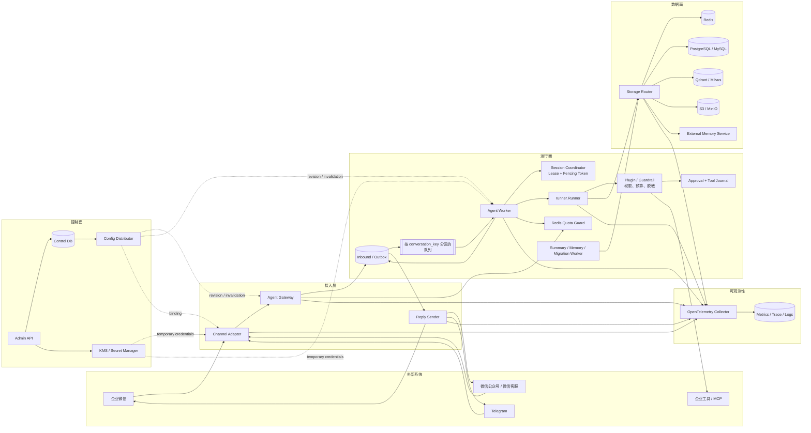

# 多租户节点化 Agent 平台总体架构

## 1. 设计目标

平台面向多个部门、业务线和外部 IM 入口，允许租户独立创建 Agent 应用，选择模型、工具、知识库和数据后端。运行面需要横向扩展，任意 Worker 都能处理任意租户的请求；节点退出后，其他节点可以接管未完成任务。平台还要保留完整的审计链路，避免租户配置、数据、工具权限和密钥相互串用。

本方案以 tRPC-Agent-Go `v1.11.x` 为运行内核。框架负责 Agent 编排、Runner 事件流、Session、Memory、Artifact、Knowledge、Tool/MCP、Plugin/Guardrail 和 OpenTelemetry 埋点。平台层负责租户注册、配置发布、消息路由、分布式并发控制、后端选择、持久化任务、IM 账号绑定、审计与运维。

设计遵循四条约束：

1. Worker 不保存会话真相。配置可以缓存，Session、Memory 和任务状态必须落在共享后端。
2. 同一会话同一时刻只允许一个 turn 推进。数据库单次写入原子性不能代替整段 Agent 执行的串行化。
3. 外部回调先持久化，再返回成功。不能在消息尚未可靠入库时向 IM 平台确认接收。
4. 所有租户边界由平台注入并校验，不能相信请求中的 `tenant_id`、`appName`、知识库过滤条件或工具参数。

## 2. 系统架构图



## 3. 控制面模型

租户配置不直接覆盖旧值，而是发布不可变 revision。`agent_app` 保存当前稳定版本和灰度规则，`agent_revision` 保存某次发布的完整快照，包括 Agent 类型、提示词、模型、工具、知识库、Memory、预算和治理策略。这样可以按 revision 重建运行环境，也能在几秒内回滚。

每个租户至少包含以下配置：

- `tenant_id`、状态、套餐、配额和数据驻留区域；
- Agent App 及其不可变 revision；
- 模型供应商、模型名、超时、重试和 Secret 引用；
- 工具可见列表、执行权限、MCP Server 和危险工具审批策略；
- IM Channel Binding，包括账号、回调参数、用户映射方式和回复能力；
- Session、Memory、Knowledge、Artifact、Audit 的后端绑定；
- 日志保留期、脱敏规则、审计级别和成本上限。

当前实现通过 Repository 读取和 `revision_id + checksum` 本地缓存编译结果；binding/revision version 变化自然产生新 cache key。生产规模继续扩大时可以增加 Config Distributor 主动失效。一次运行从开始到结束固定使用同一个 revision，不能在中途读取“最新配置”。

## 4. 接入层

Channel Adapter 只处理协议差异。它验证签名、解密消息、下载受控媒体、规范化用户和群聊标识，再生成统一的 `InboundEnvelope`。回调 URL 使用不可猜测的 `channel_binding_id`，由平台反查租户和 Agent App，URL 中不暴露租户名称。

Agent Gateway 执行以下工作：

1. 校验 Channel Adapter 生成的可信身份上下文；
2. 根据 binding 解析 `tenant_id`、`app_id` 和发布 revision；
3. 生成稳定 `request_id`、`session_id` 与 `conversation_key`；
4. 在同一数据库事务中写入 inbound message 和 outbox；
5. 提交成功后向 IM 平台返回 ACK；
6. 由 outbox relay 将任务投递到消息队列。

Reply Sender 与 Agent Worker 分离。Worker 只写标准化回复到 outbound outbox，Sender 负责长度切分、卡片渲染、频率限制、媒体上传、发送重试和失败对账。这样即使 IM API 暂时不可用，也不会占住 Agent Worker。

## 5. 运行面与 Runner

消息队列按 `conversation_key` 分区。推荐键为：

```text
tenant_id | app_id | runtime_user_id | session_id
```

分区可以让同一会话的消息按顺序到达，但在消费者 rebalance、超时重投和网络分区时仍可能短暂出现双消费者。因此 Worker 在调用 Runner 前必须取得 Session Coordinator 发放的租约和单调递增 fencing token。后续更新 `agent_run`、conversation 水位和 outbound message 时都要检查 token，旧 Worker 即使恢复连接也不能覆盖新 Worker 的结果。

平台可以使用一个共享 Runner，并在请求级注入 Agent、模型和治理策略：

```go
events, err := sharedRunner.Run(
    ctx,
    runtimeUserID,
    sessionID,
    message,
    agent.WithAppName(storageScope),
    agent.WithAgent(compiledAgent),
    agent.WithModel(tenantModel),
    agent.WithRequestID(requestID),
    agent.WithRuntimeState(runtimeState),
    agent.WithToolFilter(visibleToolFilter),
    agent.WithToolPermissionPolicy(permissionPolicy),
    plugin.WithPlugins(tenantPlugins...),
    agent.WithMaxRunDuration(runTimeout),
    agent.WithSpanAttributes(traceAttributes...),
)
```

`storageScope` 固定为 `t/{tenant_id}/a/{app_id}`。它在框架内部充当 `AppName`，负责隔离 Session 和 Memory；发布 revision 不放入该字段，以免灰度或回滚后读不到历史会话。Agent 对象按 `revision_id` 编译并缓存，缓存对象必须不可变且并发安全。

## 6. Storage Router

tRPC-Agent-Go 的 Runner 在构造时接收 Session、Memory 和 Artifact Service。为了支持租户选择不同后端，平台提供组合路由器，实现相同接口并根据 `AppName` 或 `SessionInfo.AppName` 选择真实服务。

路由过程必须包含两次校验：先解析内部 `storage_scope`，再核对 context 中的 `tenant_id` 和 `app_id`。两者不一致时直接拒绝，不能继续访问后端。连接池按 backend binding 复用，配置变更创建新实例，旧实例在所有引用释放后关闭。

共享后端采用逻辑隔离：Redis key prefix、SQL `tenant_id/app_id` 条件、向量 metadata filter、对象存储 prefix。高安全租户可以选择独立数据库、schema、Redis 集群、bucket 或 vector collection。向量库还要使用包装器强制注入租户过滤条件，并给文档 ID 加命名空间，不能依赖调用方传入 `KnowledgeFilter`。

## 7. 会话路由与 sticky session

平台不要求负载均衡层 sticky session。消息队列分区、共享 Session 后端和 Session Coordinator 已经提供正确性；Gateway 和 Worker 可以任意扩缩容。可以使用一致性哈希提高 Agent、配置和连接缓存命中率，但哈希结果失效时，其他节点仍能从共享后端继续执行。

单聊默认使用真实用户作为 `runtime_user_id`。群聊提供两种模式：

- `PER_USER_IN_CHAT`：同一群内每个用户有独立上下文，`runtime_user_id` 是用户，`session_id` 包含群和话题；
- `SHARED_CHAT`：全群共享上下文，`runtime_user_id` 是合成群主体，真实发送者放入 runtime state 和审计字段。

这是因为框架的 Session 主键实际由 `AppName + UserID + SessionID` 组成，仅让群成员使用相同 `session_id` 并不会自动共享会话。共享模式下默认关闭个人自动 Memory，避免把某个成员的信息写入群主体记忆。

## 8. 租户隔离

配置隔离通过 Control DB 的 `tenant_id` 外键、不可变 revision 和服务端授权实现。数据隔离通过 Storage Router 强制命名空间实现。工具隔离不能只依赖工具列表：`WithToolFilter` 控制模型可见性，`WithToolPermissionPolicy` 和 Tool 自身的 `PermissionChecker` 才是执行边界。

密钥只保存 Secret Manager 引用。Worker 在调用模型、MCP 或 IM API 前按需取回短期凭据，使用后不写入 Session、Memory、日志或 trace。日志记录规范化 ID 和参数摘要；需要留存原始内容时，写入独立加密审计仓库，并受更严格的访问控制和保留期约束。

## 9. 可复用能力和平台新增能力

| 领域 | 直接复用 tRPC-Agent-Go | 平台新增 |
| --- | --- | --- |
| Agent 编排 | LLMAgent、GraphAgent、Chain、Parallel、Cycle | Agent App 注册、revision 编译和灰度 |
| 执行 | `runner.Runner`、Event 流、取消、恢复 | Worker 调度、session 租约、事件排空 |
| Session | inmemory、Redis、MySQL、PostgreSQL、SQLite、MongoDB 等 | Storage Router、幂等 journal、迁移 |
| Memory | 内置接口、Redis/SQL、Mem0、Extractor | 租户路由、持久化提取任务和水位 |
| Knowledge | Source、Chunking、Embedder、Retriever、VectorStore | 知识库控制面、强制租户过滤和迁移 |
| Artifact | InMemory、COS、S3 等 | 版本分配、配额、病毒扫描和生命周期 |
| Tool/MCP | Function Tool、MCP Tool、运行时过滤 | 工具目录、租户授权、密钥注入和审批 |
| 治理 | Plugin、Guardrail、Callbacks | 策略中心、预算、审计和 IM 身份校验 |
| 协议 | OpenAI、AG-UI、A2A、OpenClaw 模型 | 统一 Gateway、企业微信/微信 Channel |
| 可观测性 | OpenTelemetry spans/metrics | 租户成本、审计索引、告警和 SLO |

## 10. 部署形态

最小部署使用一个服务进程承载 Admin API、Gateway、Channel、Worker 和 Job Worker，外接 PostgreSQL、Redis、MinIO、Qdrant 与 OpenTelemetry Collector。它适合本地开发和功能验收，但不用于高可用生产。

生产部署清单将 Gateway、Admin、Relay、Worker、Reply Sender 和 Jobs 分别扩缩容；企业微信/Telegram 协议代码当前随 Gateway/Sender 运行。Worker 可继续按普通对话、长工具、代码执行等负载分池。HPA 初始使用 CPU，生产应接入队列 lag、active run、模型并发和投递延迟。PostgreSQL、Redis、对象存储和向量库采用托管或高可用形态，并定期做恢复演练。

完整时序、数据模型、一致性、后端适配和运维细节见本目录其他文档。
