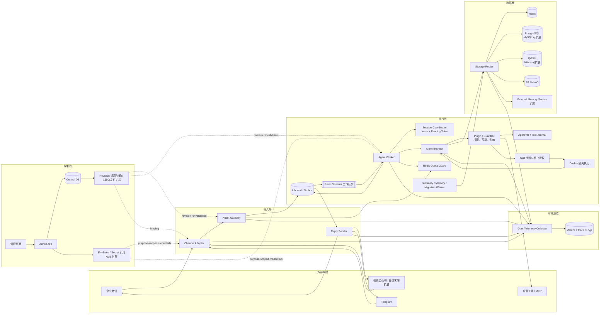

# 多租户节点化 Agent 平台总体架构

## 1. 设计目标

平台面向多个部门、业务线和外部 IM 入口，允许租户独立创建 Agent 应用，选择模型、工具、知识库和数据后端。运行面需要横向扩展，任意 Worker 都能处理任意租户的请求；节点退出后，其他节点可以接管未完成任务。平台还要保留完整的审计链路，避免租户配置、数据、工具权限和密钥相互串用。

本方案以 tRPC-Agent-Go `v1.11.x` 为运行内核。框架负责 Agent 编排、Runner 事件流、Session、Memory、Artifact、Knowledge、Tool/MCP、Plugin/Guardrail 和 OpenTelemetry 埋点。平台层负责租户注册、配置发布、消息路由、分布式并发控制、后端选择、持久化任务、IM 账号绑定、审计与运维。

图中标注“扩展”的后端、渠道和密钥服务是生产方案选项，不表示本版已接入。实际复用范围见第 9 节，验证层级见[验收说明](acceptance.md)。

设计遵循四条约束：

1. Worker 不保存会话真相。配置可以缓存，Session、Memory 和任务状态必须落在共享后端。
2. 同一会话同一时刻只允许一个 turn 推进。数据库单次写入原子性不能代替整段 Agent 执行的串行化。
3. 外部回调先持久化，再返回成功。不能在消息尚未可靠入库时向 IM 平台确认接收。
4. 所有租户边界由平台注入并校验，不能相信请求中的 `tenant_id`、`appName`、知识库过滤条件或工具参数。

## 2. 系统架构图



## 3. 控制面模型

租户配置不直接覆盖旧值，而是发布不可变 revision。`agent_app` 保存当前稳定版本和灰度规则，`agent_revision` 保存某次发布的完整快照，包括 Agent 类型、提示词、模型、工具、知识库、Memory、预算和治理策略。这样可以按 revision 重建运行环境，也能在几秒内回滚。

每个租户至少包含以下配置：

- `tenant_id`、状态、套餐、配额和数据驻留区域；
- Agent App 及其不可变 revision；
- 模型供应商、模型名、超时、重试和 Secret 引用；
- 工具可见列表、执行权限、MCP Server 和危险工具审批策略；
- IM Channel Binding，包括账号、回调参数、用户映射方式和回复能力；
- Session、Memory、Knowledge、Artifact、Audit 的后端绑定；
- 日志保留期、脱敏规则、审计级别和成本上限。

当前实现通过 Repository 读取和 `revision_id + checksum` 本地缓存编译结果；binding/revision version 变化自然产生新 cache key。生产规模继续扩大时可以增加 Config Distributor 主动失效。一次运行从开始到结束固定使用同一个 revision，不能在中途读取“最新配置”。

## 4. 接入层

Channel Adapter 处理协议验证和消息规范化：Telegram 验证 Webhook Secret，企业微信自建应用验签/解密，托管消息 MCP 使用授权的主动读取。回调路径使用 `callback_key`，平台反查对应 Binding 和租户，不能将 URL 当作授权凭证。Adapter 产出统一的 `InboundEnvelope`；可选 Telegram 附件由独立的受控导入流程保存 Artifact，不是各通道均可任意下载媒体。

Agent Gateway 执行以下工作：

1. 校验 Channel Adapter 生成的可信身份上下文；
2. 根据 binding 解析 `tenant_id`、`app_id` 和发布 revision；
3. 生成稳定 `request_id`、`session_id` 与 `conversation_key`；
4. 在同一数据库事务中写入 inbound message 和 outbox；
5. 提交成功后向 IM 平台返回 ACK；
6. 由 outbox relay 将任务投递到消息队列。

Reply Sender 与 Agent Worker 分离。Worker 写标准化回复到 outbound outbox，Sender 负责完整文本的长度切分、限流退避、受控重试和分段发送事实记录。当前没有卡片渲染、媒体上传/发送或消息编辑；这几项是可选扩展。发送结果 unknown 时不盲目重发，必须核对外部事实。IM API 暂时不可用不会持续占住 Agent Worker。

## 5. 运行面与 Runner

会话协调以 `conversation_key` 定位，逻辑字段为：

```text
tenant_id | app_id | runtime_user_id | session_id
```

当前 Redis Streams 消费组不保证按会话分区，正确性依赖 Coordinator。在重投和网络分区时可能短暂出现双消费者，因此 Worker 调用 Runner 前必须取得会话租约和单调递增 fencing token；关键提交核对所有权，旧 Worker 恢复后不能覆盖新 Worker 的结果。分区可作为未来降低争用的优化，不能替代这些检查。

平台可以使用一个共享 Runner，并在请求级注入 Agent、模型和治理策略：

```go
events, err := sharedRunner.Run(
    ctx,
    runtimeUserID,
    sessionID,
    message,
    agent.WithAppName(storageScope),
    agent.WithAgent(compiledAgent),
    agent.WithModel(tenantModel),
    agent.WithRequestID(requestID),
    agent.WithRuntimeState(runtimeState),
    agent.WithToolFilter(visibleToolFilter),
    agent.WithToolPermissionPolicy(permissionPolicy),
    plugin.WithPlugins(tenantPlugins...),
    agent.WithMaxRunDuration(runTimeout),
    agent.WithSpanAttributes(traceAttributes...),
)
```

`storageScope` 固定为 `t/{tenant_id}/a/{app_id}`。它在框架内部充当 `AppName`，负责隔离 Session 和 Memory；发布 revision 不放入该字段，以免灰度或回滚后读不到历史会话。Agent 对象按 `revision_id` 编译并缓存，缓存对象必须不可变且并发安全。

## 6. Storage Router

tRPC-Agent-Go 的 Runner 在构造时接收 Session、Memory 和 Artifact Service。为了支持租户选择不同后端，平台提供组合路由器，实现相同接口并根据 `AppName` 或 `SessionInfo.AppName` 选择真实服务。

路由过程必须包含两次校验：先解析内部 `storage_scope`，再核对 context 中的 `tenant_id` 和 `app_id`。两者不一致时直接拒绝，不能继续访问后端。后端服务按 Binding/配置摘要复用；当前旧服务随 Router 关闭，不承诺引用计数式热淘汰。密钥或连接配置更新应配合受控重启，不能把缓存重建机制当作在线密钥轮换。

共享后端采用逻辑隔离：Redis key prefix、SQL `tenant_id/app_id` 条件、向量 metadata filter、对象存储 prefix。高安全租户可以选择独立数据库、schema、Redis 集群、bucket 或 vector collection。向量库还要使用包装器强制注入租户过滤条件，并给文档 ID 加命名空间，不能依赖调用方传入 `KnowledgeFilter`。

## 7. 会话路由与 sticky session

平台在共享 Session、协调器、队列和控制面的部署下不要求负载均衡 sticky session，正确性不依赖消息队列按会话分区。Gateway 和 Worker 可以水平扩展；同一会话由 Coordinator 串行协调，其他 Worker 可读取共享历史。InMemory 配置只适用于单进程，不具备这种跨节点保证。

当前 `channels.RuntimeIdentity` 将 Binding 和上游用户映射为不透明的 `runtime_user_id`；单聊 session_id 由 Binding、会话类型、用户和线程生成，群聊则由 Binding、会话类型、群和线程生成。

框架完整 Session Key 为 `AppName + UserID + SessionID`，所以同群成员即使 session_id 相同，仍有各自的会话历史；Telegram Topic 进一步区分线程，跨 Binding/租户继续隔离。当前没有 `SHARED_CHAT` 全群共享模式的配置与实现；若扩展，必须同时调整用户主体以及个人 Memory、工具和审计边界，不能只让成员共用 session_id。

## 8. 租户隔离

配置隔离通过 Control DB 的 `tenant_id` 外键、不可变 revision 和服务端授权实现。数据隔离通过 Storage Router 强制命名空间实现。工具隔离不能只依赖工具列表：`WithToolFilter` 控制模型可见性，`WithToolPermissionPolicy` 和 Tool 自身的 `PermissionChecker` 才是执行边界。

控制面只保存密钥引用；当前 EnvStore 按租户/用途精确授权，相关角色按需解析，不写入 Session、Memory、日志或 trace。短期凭据、Workload Identity 与 KMS 是生产扩展目标。日志记录规范化 ID 和参数摘要，原始内容留存须单独配置加密、访问控制与保留期。

## 9. 可复用能力和平台新增能力

| 领域 | 直接复用 tRPC-Agent-Go | 平台新增 |
| --- | --- | --- |
| Agent 编排 | LLMAgent；其他编排可扩展 | Agent App 注册、revision 编译和灰度 |
| Skill | SKILL.md Repository、WithSkills、skill_load | 不可变授权快照、强制审批、容器入口；显式禁止本地执行器自动回退 |
| 执行 | `runner.Runner`、Event 流、取消、恢复 | Worker 调度、session 租约、事件排空 |
| Session | InMemory、Redis、PostgreSQL；其他后端可扩展 | Storage Router、幂等 journal、迁移 |
| Memory | 内置接口、InMemory、Redis/PostgreSQL、Extractor | 租户路由、持久化提取任务和水位 |
| Knowledge | Source、Chunking、Embedder、Retriever、VectorStore | 知识库控制面、强制租户过滤和迁移 |
| Artifact | InMemory、S3-compatible | 版本锁与受控附件导入；完整扫描/生命周期待扩展 |
| Tool/MCP | Function Tool、MCP Tool、运行时过滤 | 工具目录、租户授权、密钥注入和审批 |
| 治理 | Plugin、Guardrail、Callbacks | 策略中心、预算、审计和 IM 身份校验 |
| 协议 | OpenAI-compatible 模型、MCP；server/*/OpenClaw 可扩展 | 统一 Gateway、Telegram/企业微信 Channel |
| 可观测性 | OpenTelemetry spans/metrics | 租户成本、审计索引、告警和 SLO |

平台组件在仓库中的实际对应关系如下，代码模块不必各自成为独立进程：

| 要求组件 | 实际代码/配置 | 运行位置 |
| --- | --- | --- |
| Agent Gateway | `gateway`、`routing`、`controlplane` | gateway / all |
| Agent Worker | `worker`、`agent` | worker / all |
| Channel Adapter | `channels`、受控附件导入 `attachments` | Gateway 接入、Worker 导入、Sender 回复 |
| Storage Adapter | `storage`、`embedding` 及框架后端 | 按角色和功能初始化 |
| Admin API | `admin`、`controlplane` | admin / all |
| Telemetry Collector | `telemetry`、`metrics`、`audit` 与 `deploy/compose` 配置 | 应用埋点及独立 Collector |

管理页面内嵌在 `admin/ui`，由启用的 Admin/all 角色提供，真实数据仍走租户授权 API。`skill` 使用 tRPC 的正文加载和渐进注入，执行由平台固定入口 `skill_run` 连接 `workspace` Docker 沙箱；明确关闭框架的宿主机执行器自动回退。每次调用使用独立 tmpfs，不挂载宿主目录、不继承宿主密钥；Local 临时目录仅存 Docker CLI 状态，不作为安全隔离或执行回退。README 原文保持不变，边界见[验收范围](acceptance.md)。

## 10. 部署形态

最小离线演示使用 all 进程、Mock Model 和 InMemory。持久化平台使用 all 进程加 PostgreSQL/Redis；MinIO、Qdrant 和 Collector 按启用的附件、知识库、观测功能选用，不是每次启动的必需依赖。以上均不等于高可用生产部署。

生产部署清单将 Gateway、Admin、Relay、Worker、Reply Sender 和 Jobs 分别扩缩容；企业微信/Telegram 协议代码当前随 Gateway/Sender 运行。Worker 可继续按普通对话、长工具、代码执行等负载分池。HPA 初始使用 CPU，生产应接入队列 lag、active run、模型并发和投递延迟。PostgreSQL、Redis、对象存储和向量库采用托管或高可用形态，并定期做恢复演练。

完整时序、数据模型、一致性、后端适配和运维细节见本目录其他文档。
