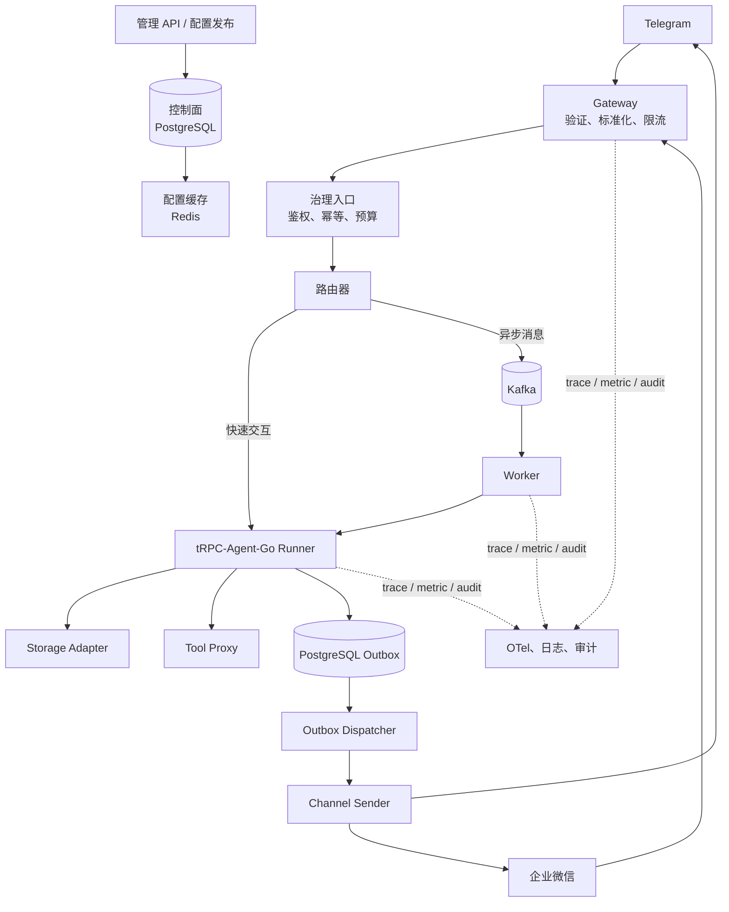
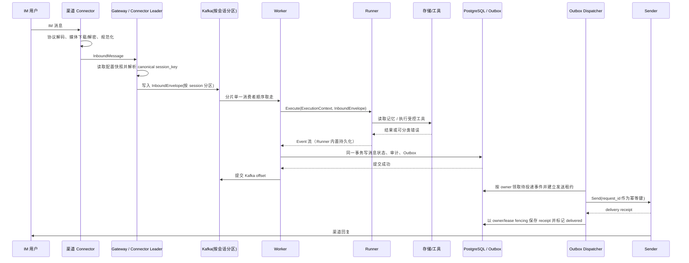

# 项目规格与工程约束（多租户节点化 Agent 平台）

> **定位**：本项目唯一的项目规格 / 架构约束 / 验收入口。只写**项目特有**的事实、决策、不变量与验收证据，不重复通用工程流程（TDD、code-review、to-spec 等由 [mattpocock/skills](https://github.com/mattpocock/skills) 的 skill 提供）。
>
> **当前实现状态**：一律以 [`docs/acceptance.md`](acceptance.md) 为准，本文不复制任何状态快照。
> **术语表**：[`CONTEXT.md`](../CONTEXT.md)（登录/身份域）；架构决策见 [`docs/adr/`](adr/)。
> **工程流程**：`grill-with-docs/domain-modeling` → `to-spec` → `to-tickets` → `implement/tdd` → `code-review`（见 [`AGENTS.md`](../AGENTS.md)）。

---

## 1. 项目范围

### 1.1 交付目标

一套可被多租户、多应用、多 IM 渠道共同使用的 Agent 服务底座：租户配置、渠道消息、Agent 运行、工具调用、数据读写、审计观测和故障处理形成一条一致、可验证、可扩展的链路。平台应能在不修改核心业务代码的前提下，为新租户创建应用、绑定渠道、指定模型与工具策略；合法消息进入后按照对应配置执行 Agent，回复原路返回，并能通过 tenant、message、trace 三个维度追踪。横向增加 Gateway / Worker 节点不应造成会话丢失、重复回复或跨租户数据读取。

### 1.2 本期范围

| 范畴 | 本期交付 | 明确不做 |
| --- | --- | --- |
| 多租户 | 租户、应用、渠道绑定、配置版本、隔离测试 | 完整运营后台 UI 之外的企业 IAM 产品 |
| Agent | 基于 tRPC-Agent-Go 的 Runner 装配、模型/工具策略、FakeModel 测试 | 自研模型训练、模型供应商全量覆盖 |
| IM | Telegram 与企业微信两个适配器、统一契约、可测试 Sender | 覆盖所有即时通信平台 |
| 数据 | PostgreSQL、Redis、向量库/对象存储的稳定抽象及关键实现 | 自研分布式存储引擎 |
| 异步 | 统一消息信封、Kafka Worker、重试、DLQ、Outbox | 复杂工作流编排引擎 |
| 治理 | 鉴权、工具白名单、预算、限流、审计脱敏 | 完整的企业 IAM 产品 |
| 运维 | OpenTelemetry、指标、优雅退出、Compose/Kubernetes 样例、运行手册 | 自建监控平台 |

> 登录与身份体系（企业微信 / 飞书 / OIDC、会话 / CSRF、系统管理员与部门角色）**已被 ADR-0001 覆盖**，属该 ADR 的当前决定；本文不重复其内容。

## 2. 架构拓扑与消息生命周期

### 2.1 分层拓扑



| 层次 | 职责 | 不应承担的职责 |
| --- | --- | --- |
| 控制面 | 保存租户、应用、渠道、策略和版本；发布配置 | 直接维护 IM 连接或执行模型 |
| Gateway | 维护外部 Connector、标准化消息、解析 Session、写 Kafka、异步出站 | 直接拼装 Agent 或执行模型 |
| 执行面 | 按配置装配 Runner，管理模型与工具调用 | 了解 Telegram/企业微信的原始协议 |
| 数据面 | 会话、记忆、知识、运行产出、审计和消息状态 | 决定租户策略或渠道协议 |
| 治理/观测 | 拒绝无权限行为、记录可追溯证据 | 隐式改变业务回复内容 |

### 2.2 统一写路径与消息生命周期

**核心机制：所有入口写入同一条按 canonical Session 分区的 Kafka 消息流。** 页面请求走 `202 + SSE`；外部 IM 由常驻 Connector 接收并标准化，Worker 完成后由 Outbox/Sender 推送。



**职责分配**：`Receiver` 只把不同 IM 的方言翻译为平台标准消息；`Runner` 只处理 Agent；Worker 不直接调用 Sender，而是在完成事务内写 PostgreSQL Outbox；唯一的 `Outbox Dispatcher` 通过发送租约领取事件，再由 `Sender` 把标准回复翻译回 IM 协议。成功回执必须持久化为 delivery receipt，租约续期或完成均校验 owner，防止过期 Dispatcher 覆盖新投递者。渠道支持外部幂等键时必须使用稳定 `request_id`；不支持时明确接受“发送成功但 receipt 入库前崩溃”导致的极低概率重复。供应商 SDK 类型不得越过 `channels` 包。

**节点解耦与并发脑裂防护（Fencing Token & Execution Manifest）**：
- **Fencing Token 乐观锁断言**：所有进入 Worker 执行的消息均关联会话级单调递增防护令牌。持久化层在提交会话变更（`sessions` 表）时断言当前 token 严格高于数据库已记录版本；若因 Kafka Rebalance 或 Worker 停顿导致旧 Worker 试图提交过期状态，存储层直接拦截并抛出 `ErrStaleFencingToken`，杜绝旧状态覆盖新状态。
- **签名 Execution Manifest**：Gateway 写入总线或派发执行时封装带 HMAC 签名的不可变执行清单（包含 Tenant、App、ConfigVersion、FencingToken、TraceID、Signature），Worker 验签执行，实现控制面与执行面的彻底解耦与版本固化。
- **统一 Connector 体系（长连接/长轮询）**：外部 IM 通道统一收敛为各平台最常规、最稳定的单一规范用法（企业微信智能机器人 WebSocket `wss://openws.work.weixin.qq.com`、Telegram Bot API `getUpdates` 长轮询、飞书官方 SDK WebSocket），无需公网 IP 和回调域名验签，由 Gateway 节点通过 Redis 分布式租约统一选举 Leader 运行连接器管理进程。

## 3. 领域模型与隔离键

### 3.1 身份、配置与隔离键

```text
app_name    = tenant_id + "/" + app_code
session_key = tenant_id + "/" + app_code + "/session/" + session_id
idempotency_key = tenant_id + "/" + channel + "/" + binding_id + "/" + message_id
```

平台内部使用全局唯一、稳定的 `platform_user_id` 表示“同一个人”。企业微信 OAuth 返回的 `corpid + userid` 只是登录身份；Telegram、飞书、企业微信智能机器人里的发送者 ID 只是渠道身份。租户权限只挂在 `tenant_members(tenant_id, platform_user_id)` 上。

> **当前规格**：外部 `channel/binding/conversation` 不编码进 Session identity，而由 `channel_conversations` 单独映射。身份解析只统一 `platform_user_id` 与长期 Memory 边界；不同 Channel/Binding 的 direct Conversation 默认保持独立 Session，不自动合并聊天历史。未关联外部身份保持独立。群聊始终按群 conversation 独立，Actor 只表示谁触发了某条消息，不取得群 Session 所有权。

### 3.2 核心数据模型

| 模型 | 核心字段 | 规则 |
| --- | --- | --- |
| `Tenant` | `id`、`display_name` | `id` 是稳定机器标识，`display_name` 用于 Console 展示 |
| `PlatformUser` | `platform_user_id`、status | 全平台唯一的人；登录身份、渠道身份与租户角色都引用它 |
| `LoginIdentity` | `provider_id`、`subject_id`、`platform_user_id` | 企业微信 / 飞书 / OIDC 登录身份统一映射到平台用户；一个部署只激活一个正式 Provider |
| `TenantMember` | `tenant_id`、`platform_user_id`、role | 平台用户在不同租户拥有独立角色 |
| `ChannelIdentity` | tenant/channel/binding/external user、`platform_user_id` | 租户内可信渠道身份关联；同一外部身份最多归属一个平台用户 |
| `Application` | `tenant_id`、`app_code`、`status` | `(tenant_id, app_code)` 唯一 |
| `TenantConfig` | `tenant_id`、`app_code`、`config_version`、模型/工具/渠道策略 | 发布后为不可变快照 |
| `ChannelBinding` | `tenant_id`、`app_code`、`channel`、外部标识、可选可信企业边界 | 一个外部入口只能匹配一个生效应用；企业微信只有在可信企业边界与登录身份 `corpid` 一致时才能自动归一身份 |
| `ChannelConversation` | channel/binding/external conversation/session/scope/ended_at | 外部入口到 canonical Session 的历史映射；只允许一条当前有效关联 |
| `InboundMessage` | `message_id`、`channel`、`conversation_id`、`sender_id`、scope、trigger、text/files | Receiver 标准化输出；群消息保留 Actor 与 `direct/mention/command` 触发方式；不得携带渠道 SDK 类型或文件本体进 Kafka |
| `ExecutionContext` | tenant/app、角色、预算、策略版本、trace ID | 每个模型/工具调用都必须携带 |
| `AuditEvent` | `tenant_id`、trace、action、result、脱敏 detail | 只写最小必要信息 |

建议表结构（控制面事实源）：

| 表 | 主键/唯一键 | 关键列 | 说明 |
| --- | --- | --- | --- |
| `tenants` | `id` | `display_name`、`created_at` | 租户根对象；应用启停状态只属于 `applications` |
| `platform_users` | `platform_user_id` | status、first_seen、last_login | 与具体登录/消息渠道无关的稳定平台用户 |
| `login_identities` | `(provider_id,subject_id)` | `platform_user_id` | 正式登录身份到平台用户的统一映射 |
| `tenant_members` | `(tenant_id,platform_user_id)` | role | 租户权限事实源 |
| `channel_identities` | `(tenant,channel,binding,external_user)` | `platform_user_id`、linked_at | 当前租户内的渠道身份关联；未关联身份不伪造平台用户 |
| `applications` | `(tenant_id, app_code)` | `status`、`active_config_version` | 租户下的 Agent 应用 |
| `application_configs` | `(tenant_id, app_code, version)` | `config_json`、`checksum`、`published_at` | 不可变配置快照 |
| `channel_bindings` | `(channel_type, external_binding_id)` | tenant/app/channel | 渠道到应用的映射 |
| `sessions` | `(tenant_id, session_key)` | tenant/app、framework subject、可选 owner platform user、最后消息、修订号、归档状态 | 可恢复会话管理投影；群 Session 没有个人 owner；摘要不在此表 |
| `channel_conversations` | `(tenant,app,channel,binding,external conversation,session)` | subject/scope/started/ended | 外部会话与 canonical Session 的可结束历史关联 |
| `messages` | `(tenant_id, channel, binding_id, message_id)` | 状态、trace、更新时间 | binding 级幂等/执行状态；同一供应商不同 Bot 的 message ID 不互相碰撞 |
| `execution_traces` | `(tenant_id, channel, binding_id, message_id)` | app、trace、安全投影、更新时间 | framework ExecutionTrace 的安全结构投影，定位键与消息幂等键一致 |
| `outbox_events` | `id` | 聚合键、payload、request_id、状态、delivery_attempts、lease_owner/lease_until、receipt、delivered_at | PostgreSQL 可靠异步投递事实源；Dispatcher 只能以当前租约 owner 完成或失败投递 |
| `audit_events` | `id` | tenant、trace、action、result、redacted_detail | 安全与排障证据 |

所有数据库索引和查询条件都应包含 `tenant_id`。对 `config_json`、原始对话和工具参数应按数据分类决定脱敏、加密或只保存摘要；不得把令牌和完整授权信息写入任意表。

> **当前规格**：开发阶段只维护当前数据库形态；历史开发 migration 已收敛为唯一的 `migrations/000001_init.sql` baseline 文件。建立正式发布兼容边界前，Schema 直接表达当前设计，不保存开发过程中的升级或 down 历史。

## 4. 不变量（不可违反）

以下不变量是所有任务的共同验收条件，也是 `code-review` 的重点核查项。

| 编号 | 不变量 | 验证方式 |
| --- | --- | --- |
| INV-01 | 所有业务状态读取、写入、缓存、日志、审计均带 `tenant_id`；不存在“默认租户” | 双租户集成测试、代码评审 |
| INV-02 | `session_key` 构成稳定；**存储时必须以 `tenant_id/` 开头**；同一消息最多产生一次业务副作用 | 单元测试、并发/重放测试 |
| INV-03 | 请求进入时绑定 `config_version`，在途执行不被新配置覆盖 | 配置切换/版本隔离测试 |
| INV-04 | `message_id` 的重复投递不产生重复业务回复（幂等） | 并发/重放测试 |
| INV-05 | 所有外部调用都有 Context、超时和错误分类；关闭时不遗留 goroutine | 故障注入、race/关闭测试 |
| INV-06 | 渠道原始类型不进入 Agent/领域层 | 第二个渠道接入回归、包依赖审查 |
| INV-07 | 密钥与敏感字段不进入日志、审计明文或测试 fixture | 拒绝路径测试、日志快照断言 |
| INV-08 | 可观察的副作用都能关联 `trace_id` 与审计 | trace/日志断言 |
| INV-09 | 可恢复性：不可重试错误进入 DLQ；重试有退避；无真实密钥与网络依赖 | 故障注入、可复现命令 |

## 5. 依赖方向与代码结构

### 5.1 依赖方向（红线）

```text
cmd → web/channels/messaging → agent/governance → tenant/storage/tool/assembly 的接口
```

- `web` / `channels` / `messaging` 只能依赖 `agent`、`governance`、`tenant`、`storage`、`tool`、`assembly` 暴露的**接口**。
- 基础设施实现（Redis、Kafka、IM SDK、SQL 客户端、具体渠道）只能位于适配器/基础设施实现层。
- `domain` 规则必须保持纯粹：不得依赖 HTTP、ORM、渠道 SDK。
- `cmd` 是唯一允许把具体实现连接起来的位置（组合根；负责依赖注入与关闭流程）。
- 非法依赖模式：`tenant` 或 `agent` 直接导入 Telegram SDK、Kafka consumer 或 `*sql.DB`；每个 struct 配一个仅用一次的接口；`common / utils` 万能包。

### 5.2 目标代码结构（当前以 `trpcservice/` 实际包为准）

```text
cmd/trpc-service/        # 组合根：加载配置、创建依赖、注册关闭流程
trpcservice/
  config/                # 配置解析和校验
  tenant/                # 租户、配置版本、控制面仓储
  channels/              # Receiver / Sender 契约及 Telegram/WeCom/Feishu 实现
  web/                   # HTTP 路由与控制台 API
  assembly/              # TenantConfig -> tRPC Runner 工厂
  agent/                 # 标准执行用例与结果映射
  tool/                  # Tool 注册与受控调用入口
  storage/               # Memory / Audit / Artifact / Knowledge 接口和实现、幂等键
  messaging/             # Envelope、Outbox、Kafka、Worker
  governance/            # 鉴权、限流、预算、脱敏、策略判断
  log/                   # 结构化日志字段规范
  metrics/               # OTel、指标语义
  netpolicy/             # 远端 HTTPS / DNS / 私网访问安全策略
  identity/              # 登录/身份（见 ADR-0001）
internal/testutil/       # fake、fixture、可控时钟、测试构造器
configs/                 # 仅含无密钥示例/本地配置
migrations/              # PostgreSQL 迁移（含执行声明 fencing、identity）
deploy/                  # Compose、Kubernetes、运行配置
tests/e2e/               # 仅验证跨模块业务场景
docs/                    # 见本文件；状态/验收证据在 docs/acceptance.md
```

## 6. 当前设计取舍（规格 / 已由 ADR 覆盖）

| 主题 | 当前规格（取舍） | 依据 / 备注 |
| --- | --- | --- |
| 统一写路径 | 所有入口写入同一条按会话分区的 Kafka 消息流；顺序由分区键 `hash(app_name:session_id)` 提供，正确性由 `run_dedup` 唯一约束保证 | Kafka 原生提供同 key 分区顺序、消费者接管与可重放日志 |
| 消息流选型 | messaging 接口；**首期默认 Kafka**（按 app:session 分区、consumer group 消费、成功持久化后提交 offset）；Redis Streams 作为可选实现，不与 Kafka 双写 | Redis Streams 需额外维护分片租约、PEL/XAUTOCLAIM 恢复与串行化逻辑 |
| 网页同步等待 | 客户端为每次用户发送生成稳定 UUID `request_id`；入口先获取短租约再入队，重试返回相同 `event_id` 且不重复发布；随后返回 `202 + SSE`，Worker 完成后经 Redis Stream 扇出（先落库再发布，SSE 重连用 `Last-Event-ID` 补齐） | 避免连接级粘附与双击/网络重试重复执行 |
| 不重（幂等） | **`run_dedup` 租约状态机（数据库，非分片租约）**，不是单纯唯一约束；`UNIQUE(app_name, user_id, session_id, request_id)` + `status(running/done)` + `lease_expires_at` | 业务副作用经框架 `session.Service` 写入 Event/State，事务边界在框架内部，无法与去重检查同事务（0 fork 代价）。租约到期后接管者合法抢占重跑，防止 `running` 悬挂行导致消息永久丢失 |
| 不丢 | 业务副作用落库后才提交 Kafka offset；未提交记录由 consumer group 接管，`run_dedup` 租约到期后可重跑 | 崩溃重跑期间可能产生部分重复 Session Event——有意接受（宁可重复不可丢），重复事件按 `event_id` 在读取侧去重，重复回复由 Sender 按 `request_id` 幂等出站拦截 |
| 分片租约 | 降级为**性能优化**：租约失效导致的双消费是安全的，因为 `run_dedup` 会拒绝重复 Run。分片租约无需 fencing token（仅 Redis Streams 可选实现时生效） | 与 `run_dedup` 租约（正确性防线）层次不同，勿混淆 |
| 存储后端 | PostgreSQL 是平台控制面、审计、可靠消息与管理投影事实源；Session 可按租户选择框架 PostgreSQL/Redis/InMemory，Memory 可选 PostgreSQL/InMemory/Mem0，Knowledge VectorStore 可选 pgvector/Qdrant；非默认后端连接必须使用平台受管 `connection_ref`。Artifact 可按租户选择 PostgreSQL/S3/COS。InMemory 只用于测试/单进程开发 | 见 `docs/acceptance.md` 当前已具备/未具备清单 |
| 会话生命周期 | 空闲窗口自动归档（默认可配，30 天）；归档生成摘要作重入线索，原文按事件 ID 可检索兜底；**禁止“摘要的摘要”** | 会话模型/归档/渠道隔离详见下方第 7 节 |
| RLS 范围 | 所有带 `tenant_id` 的平台表都必须 `ENABLE + FORCE RLS`，CI/单测从当前 baseline 自动扫描；平台跨租户后台任务使用 `BYPASSRLS` 角色，租户作用域事务显式 `SET LOCAL ROLE trpc_tenant + app.tenant_id`。框架自有 Session/Memory 表保持上游 schema，通过 `AppName=tenant/app` 隔离；平台自有 pgvector 表额外使用 RLS + tenant/app metadata | 不修改框架 schema，同时把平台表的漏配风险变成自动门禁 |
| 登录/身份 | 正式登录同时支持本地账号、企业微信、飞书、OIDC，可在一个部署中并存；Mock 仅开发测试。公开登录页只展示已启用方式；管理员登录设置负责配置引导和真实 OAuth 验证。平台用户、租户成员、登录身份、渠道路由严格分离 | 以 [ADR-0001](adr/0001-enterprise-login-identity.md)、[ADR-0003](adr/0003-platform-user-channel-identity.md)、[ADR-0005](adr/0005-channel-identity-linking.md) 为准 |

> 标注约定：以上“当前规格”仅描述当前设计取舍；若某项决策已被 ADR 覆盖（如登录/身份），一律以 ADR 为准，本文不重复其结论。

## 7. 渠道边界与会话规则

### 7.1 渠道契约与 Connector 体系

外部 IM 通道统一收敛为单一规范的常驻 Connector 体系，由 Gateway 节点通过 Redis 分布式租约（`channelConnectorManager`）选举 Leader 调度运行。各通道 Connector 负责长连接/长轮询保活、协议解密与标准化，将事件统一解析为协议无关的 `channels.InboundMessage` 并注入 Kafka `Envelope`。出站回复经由统一的 `channels.Sender` 契约与持久化 Outbox 投递。**渠道组件不创建 Runner、不访问业务表**；渠道 SDK 类型不得进入 Agent / 领域层。

```go
type Sender interface {
    Send(ctx context.Context, target ReplyTarget, message OutboundMessage) (SendReceipt, error)
}
```

### 7.2 会话/隔离规则

- Session identity 由平台生成的 canonical `session_id` 决定，不携带渠道名称。`channel_conversations` 保存来源 `(channel,binding,conversation)`；Web 明确创建自己的 session_id。
- **平台身份只来自登录体系**：支持本地账号、企业微信、飞书和 OIDC；本地账号可按部署策略开放自助注册。Channel/Binding 不提供 `/link` 或“消息身份绑定”，机器人不参与平台账号归属。
- **外部 IM 身份只用于消息路由与访问控制**：默认以 `(tenant, channel, binding, external_user_id)` 隔离。不得按昵称、手机号或相似字符串猜测平台用户。企业微信只有在可信企业边界与已验证登录身份完全一致时，才可利用官方企业成员 ID 做确定性解析；其他情况保持外部身份。
- **会话保持渠道边界**：Web、企业微信、Telegram、飞书按各自 `(channel,binding,conversation)` 维持独立 Session，不自动跨渠道合并。
- **群聊例外**：群 Session 按 `(channel,binding,conversation)` 独立。每条群消息可保存 Actor 与 `mention/command` 触发方式，但不会因此建立平台账号绑定。
- **Console 不提供独立会话目录**：用户通过 Web 对话页恢复自己的网页会话；Session 仍作为运行时、幂等、摘要与审计的底层状态存在。
- 出站在唯一 Outbox Dispatcher 中按平台长度限制分片，并通过 Redis 对 `(channel,binding,conversation)` 做跨 Gateway pacing；图片文件先落临时 Artifact；发送失败由 Outbox lease/重试状态机处理。

### 7.3 渠道协议规范（单一规范用法）

各通道只保留一种最常规、最稳定的用法，杜绝多重变种和无法落地的 Webhook 伪支持：

- **企业微信 (WeCom)**：唯一采用**企业微信智能机器人 WebSocket 长连接**（`wecombot`，`wss://openws.work.weixin.qq.com`）。由 Leader 节点以 `bot_id` + `secret` 发起 `aibot_subscribe` 握手并以 30 秒心跳保活；断线按官方 1/2/4/8/16/30 秒节奏指数退避，成功认证后重置退避。入站消息（`aibot_msg_callback`）区分 `single` 与 `group`；流式回复使用 `aibot_respond_msg`，主动投递使用 `aibot_send_msg`，审批卡片使用原生模板卡片与 `aibot_respond_update_msg`。无需公网 IP 与回调验签。
- **Telegram**：唯一采用官方 Bot API **长轮询**（`telegram.Poller`，`getUpdates`）。以 `bot_token` 轮询拉取 Update，本地维护单调递增 `offset`，遇到 429 自动指数退避自愈；出站回复统一通过 `sendMessage` API 投递（支持个人与群组 `chat_id`）。
- **飞书 (Feishu)**：唯一采用飞书开放平台官方 `channel-sdk-go`。同一 Binding 的 `feishu.Connector` 复用同一个 Channel 实例完成 WebSocket 事件接收和标准消息发送：SDK 负责事件分发、去重、`@bot` 判定、Markdown→Post 转换、长文本分片、发送重试以及图片/文件/音视频上传。平台只在持久 Outbox 需要按稳定 `message_id` 跨进程更新或撤回既有消息时通过 Channel 的 `RawClient()` 调用底层 OpenAPI，不维护第二套普通消息 Sender。
- **Web 控制台**：控制台已认证会话，通过 `/api/v1/chat/async` 异步入队 Kafka，经 Worker 执行并由持久化 Outbox 保证最终一致性，前端通过 Redis 扇出消费 SSE 流式增量。

## 8. 治理、安全、并发、Context 与 Trace 标准

### 8.1 治理与安全

- 入口构造 `ExecutionContext`；所有 Tool 调用经框架 `tool.Callbacks`，依次执行租户/角色授权、白名单、参数验证、确认名单、速率与预算检查；执行前后写脱敏审计。
- **总原则：模型只是“提议引擎”，所有确定性决策在框架回调 / Guardrail Plugin 中完成**（对齐 OWASP LLM Top 10 2025 纵深防御）。
- 治理顺序固定：**装配白名单（模型不可见未允许工具）→ 预算（路由前 RPM + 调用 unit）→ 框架 Guardrail approval（`tools.require_confirmation`）→ Tool Callbacks（角色授权 / 参数风险 / 调用预算 / 副作用账本 / 审计）→ 执行**。`require_confirmation` 只表达“此工具需要人工确认”，不得在 Tool Callback 再做第二次确认；角色限制独立由 `tools.allowed_roles` 决定。Web 使用角色 Reviewer，外部 IM 通过原发起人的原生交互卡片完成确认。
- 三条铁律：① 顺序固定不改；② 审计是旁路不是链节（拒绝或异常都落账，try/finally 语义）；③ 治理插件自身异常按 **fail-closed** 处理（拒绝 + 告警，绝不放行）。
- 安全默认拒绝：签名、身份、渠道绑定、工具权限和预算任一缺失即拒绝执行。未绑定 IM 用户以隔离 subject + `member` 运行；如工具还需限制角色，必须显式配置 `tools.allowed_roles`，不能把 `require_confirmation` 当作角色授权。密钥只存 `env:` 引用。
- 密钥：配置只保存 `*_ref`，密钥由 KMS/密钥管理运行时解析，信封加密；IM token、模型 API key、数据库密码不得进入配置明文、日志、Trace 或错误报告。
- 当前仍处于未发布开发阶段，不维护历史开发数据库升级兼容；Schema 只保留当前运行路径需要的字段与约束。禁止在自动部署中执行未经备份/确认的破坏性数据操作。

### 8.2 并发与 goroutine

- 同一会话消息在同一分片内单一消费者顺序处理，写入串行；跨会话并行互不影响。不依赖负载均衡器粘性会话，任何健康 Worker 都能从共享后端恢复任何分片。
- 每个请求从入口 `context.Context` 派生超时上下文，并传递给 Runner、模型、Tool 和 Sender；出现模型超时、客户端断连或 Tool 失败时先 `cancel()`，再持续消费 Event channel 直至关闭，由 `errgroup`/等待组等待所有派生 goroutine 退出后才 ACK。
- 服务关闭顺序：停止接收 → 等待在途 → 提交完成工作 → 关闭依赖。禁止直接 `break` 读取事件循环留下 goroutine 或 channel 阻塞。

### 8.3 Trace / 可观测性

- 以 OpenTelemetry 统一运维 trace：HTTP Adapter 创建根 Span，**W3C `traceparent` 注入 Kafka 信封**，Worker 提取后延续到 `agent.runtime.handle`、框架 Runner/LLM/Tool Span、平台 Store 与 `channel.sender.send`。外部入口只把经过长度/控制字符校验的渠道原生 Request ID 写入 Span 的 `external.request.id`，不得写入 metric label；框架 Session/Memory/Knowledge PostgreSQL Client 通过同一 `StoreObserver` 输出按 tenant/component/operation 分类的 Span 与指标，禁止记录 SQL、参数或内容。tRPC-Agent-Go 的 TracerProvider 与 MeterProvider 必须直接接到平台同一组 OTel SDK Provider，不再维护第二套 Model/Tool tracing。产品运行图仍是 Framework ExecutionTrace，不伪造 Agent step。
- 日志经统一 redactor；禁止记录完整 Authorization/Token、DSN 密码或用户隐私正文。
- 框架 GenAI 指标直接调用 `telemetry/metric.InitMeterProvider` 初始化，至少保留 `gen_ai.client.operation.duration`、`gen_ai.client.token.usage`、TTFT、单输出 token 耗时（TPOT）与输出 token 速率；不得在平台层重新估算模型解码速度。平台指标只补充 HTTP、租户执行、每租户成本、Store、Outbox 与渠道投递等框架不知道的业务事实。
- `OTEL_EXPORTER_OTLP_ENDPOINT` 配置时，Trace 与 Metric 统一经 OTLP/HTTP 发往 Collector；部署中的 Collector 再导出 Prometheus。`PROMETHEUS_ENABLED=true` 仅提供同一 MeterProvider 的可选 `/metrics` 直出模式，禁止与 Collector 对同一实例重复采集。
- Langfuse 直接复用框架 `telemetry/langfuse`，作为同一 SDK TracerProvider 的额外 SpanProcessor；平台不得复制 Prompt、Completion、Token 或步骤 Trace 再发送第二份。`LANGFUSE_PUBLIC_KEY`、`LANGFUSE_SECRET_KEY` 与 `LANGFUSE_HOST` 必须同时提供，否则启动失败。Langfuse 会接收框架 LLM observation 中的 Prompt/Output，因此只允许显式启用，并可用 `LANGFUSE_OBSERVATION_LEAF_VALUE_MAX_BYTES` 控制单个 observation 叶值大小。
- 审计字段：`tenant_id`、`channel`、`user_id`、`session_id`、`agent_name`、`tool_name`、`decision`、`latency_ms`、`error_type`、`cost_micros`、`trace_id`、`request_id`；对话相关 `redacted_detail` 只存 HMAC-SHA256。
- 健康检查：`/healthz`（进程存活，不检查外部依赖）与 `/readyz`（必要依赖的有界就绪检查）。

## 9. 关键模块实现规格

> 本节为模块接口/实现约束（参考），当前实现状态一律以 `docs/acceptance.md` 为准。

### 9.1 配置与控制面

以 PostgreSQL 保存不可变配置快照，`applications.active_config_version` 指向当前激活版本。发布配置的事务顺序：校验配置 → 写入新版本 → 更新激活指针 → 写 Outbox → 提交。消费者/节点收到失效事件后删除 Redis 缓存；缓存键必须包含 tenant、app 和 version。

```go
type TenantConfigRepository interface {
    GetActive(ctx context.Context, tenantID, appCode string) (TenantConfig, error)
    GetVersion(ctx context.Context, tenantID, appCode string, version int64) (TenantConfig, error)
    Publish(ctx context.Context, config TenantConfig) (TenantConfig, error)
}
```

必须测试：非法配置拒绝、发布版本单调递增、双租户隔离、在途请求使用旧版本、缓存失效后读取新版本。

### 9.2 Agent 装配与执行

`RunnerFactory` 根据不可变 `TenantConfig` 与 `config_version` 创建/缓存 Runner。租户快照只能选择 `provider_id + model name`；Provider 配置与动态发现模型统一保存在一份平台级 `ModelCatalog` 中，Validator 与 Runtime 不再各维护一份动态目录。当前锁定的 `trpc-agent-go v1.11.2` 直接复用 OpenAI-compatible、腾讯混元、HuggingFace、Failover 与 Provider Token Tailoring；Hedge 暂不启用，不自研 GPT OAuth。模型名视为供应商定义的 opaque ID，因此允许 HuggingFace 等上游使用 `org/model` 形式，而平台自有的 provider/tenant/app ID 仍按内部命名规则校验。

OpenAI-compatible endpoint 与 `api_key_ref`、HuggingFace `api_key_ref`、混元 `secret_id_ref + secret_key_ref` 均由 Provider Catalog 管理；endpoint 只允许 HTTPS（loopback 开发例外）、不得携带 userinfo/query/fragment。模型密钥只由 allowlist `SecretResolver` 在 `ManagedModelProvider` 内解析，`app.go` 不直接读取或解释模型凭据。OpenAI-compatible 的 `/models` 同步也由同一 ModelProvider 解析凭据并更新共享 Catalog。模型价格由平台 Catalog 固定，`cached_prompt_cost_micros_per_million_tokens` 缺省时按普通 Prompt 价格计费，显式配置后仅对 Provider 报告且不超过 Prompt 总量的 cache-read tokens 使用缓存价格；账本同时保存该 token 分量以便对账。

长会话上下文直接使用框架链路：`Session Summary → BranchFilterModeAll → Context Compaction → Provider Token Tailoring`。Runner 开启 `WithAddSessionSummary(true)` 和 `WithEnableContextCompaction(true)`；由于平台生成的是框架全会话摘要（空 filter key），单 Agent Runner 显式使用 `BranchFilterModeAll`，保证后续请求确实读取这份摘要。平台不增加第二套摘要、裁剪或压缩实现。Failover 只使用框架 `model/failover`，并要求真实 429、5xx、连接失败行为测试验证备用模型能接管，而不是只验证 wrapper 可构造。

工具层只保留一条 `TenantConfig → ToolSurface → LLMAgent` 主链。`ToolSurface` 同时承载普通 Tool 与框架 ToolSet：平台内置网页搜索直接注册框架 `duckduckgo_search`；业务 Go 工具直接使用框架 `tool/function`；简单外部 HTTP 工具只允许固定 HTTPS JSON POST，由极薄 Adapter 转成框架 Function Tool；复杂外部能力使用框架 `tool/mcp`，仅开放 Streamable HTTP 与 SSE，禁止 stdio、本机命令、环境变量和进程启动。MCP 的 Initialize/ListTools/CallTool/重连/Schema 转换均归框架，平台不得再实现第二套 MCP Client。

自定义 HTTP/MCP URL 经过统一 `netpolicy`，禁止代理绕过、私网/loopback/link-local/multicast 目的地和 DNS rebinding；凭据配置只保存 `tool_credential_refs` 中的 `env:` 引用，由 `SecretResolver` 在实际调用时解析。MCP ToolSet 按不可变 `config_version` 构造，模型只看到 `tools.allowed` 精确列出的 `{server}_{remote_tool}`，不启用 MCP Broker 的 ad-hoc URL，也不在每轮对话自动扩大工具面。静态工具与最终 MCP Tool 共用同一套 Guardrail 人工确认，以及 Tool Callbacks 的角色授权、调用预算、超时、副作用账本、审计和 Trace 治理；两层职责不得重复。未知名称或同名冲突在装配阶段失败。

当前产品明确不注册 `codeexecutor` / CodeAct、E2B、本地/容器 sandbox、`tool/file`、`workspaceexec`、`hostexec`、`todo`、`dynamicworkflow`。Agent-as-Tool 属框架可选能力，当前没有明确编排需求，不为“可能以后使用”预建平台胶水。缓存淘汰或新版本发布不可影响已经开始的执行。框架 API 以当前 `go.mod` 锁定版本的 `go doc`/编译验证为唯一依据。

### 9.3 会话、记忆与幂等

对话历史与摘要由 `trpc-agent-go session.Service` 负责，平台 `sessions` 只保存租户/应用/session/framework subject、可选 owner platform user、最后消息、修订号和归档状态等管理投影，不再保存第二份 summary。Session 后端由不可变 `StoragePolicy` 选择 PostgreSQL/Redis/InMemory；在线切换时平台只编排 dual-write/backfill/verify/cutover，实际读写仍调用框架 `session.Service`，且搬迁单个 Session 时与 Runtime 共用 execution lease，避免迁移和正常执行并发覆盖。迁移完成前发布新的不可变应用配置，迁移路由不成为长期第二配置源。

已关联 direct 用户的 framework subject 统一使用 `platform_user_id`。Memory 同样按 `StoragePolicy` 选择 PostgreSQL/InMemory/Mem0：前两者直接使用框架 `memory.Service`，Mem0 遵循框架 ingest-first `SessionIngestor + Tools` 契约，不伪造 Service。未关联外部用户继续使用稳定 fallback subject；群 Session 使用群级 subject，且不得把 Actor 的个人长期偏好加载或写入群上下文。平台覆盖默认 extractor prompt，只保留明确稳定的偏好、长期约束和确有持续价值的背景信息。自动提取至少积累多条消息后才触发，每轮仅预载少量高相关项；平台不维护 `profile`、`last_reply` 或第二套 KV Memory 表。

### 9.4 数据同步与多后端

Knowledge 只保留一条框架 RAG 主链：持久 `knowledge_ingest_jobs` 负责异步任务、lease/retry/fencing，并固定任务创建时选定的 VectorStore 后端；Worker 将 URL、Repo、目录、上传文件或文本转换为框架 `Source`，由框架 Reader / Docling、Chunking、Embedder 与 pgvector/Qdrant VectorStore 完成解析、切片、向量化与持久化。首次成功读取 Source 后同时持久化 canonical document snapshot，作为后端迁移时的稳定重建事实源，避免 URL/Repo 再抓取到不同内容。查询继续由框架 `BuiltinKnowledge`、Query Enhancer 与 TopK/Cohere/Infinity Reranker 完成，平台不维护第二套 Retriever、分块模型、全文评分或 Prompt 拼接逻辑。

Knowledge VectorStore 是派生索引，因此 pgvector→Qdrant 切换不使用 Session 式长期 dual-write：迁移启动前要求文档全部 ready，迁移期间冻结 Knowledge 写入，从 canonical snapshot 在目标后端重建并逐文档核对 chunk 数，校验成功后发布新的不可变应用配置。`knowledge_documents` 只保存生命周期投影；pgvector 的真实切片与 embedding 位于框架 schema 对齐的 `knowledge_vectors`，其 RLS 同时隔离 tenant/app、隐藏未完成索引并使用 ingest job lease 阻止过期 Worker 写入。URL/Repo/目录入口额外经过平台安全策略，因为 SSRF、来源 allowlist、执行超时与规模限制属于平台安全 seam，而不是 RAG 算法。

Artifact 统一使用框架 `artifact.Service` 的 `SessionInfo + filename + version` 契约。租户只选择已注册后端：官方 `artifact/s3`、官方 `artifact/cos`，以及平台 PostgreSQL Adapter。Agent/Tool 写出的文件属于 Runtime Artifact；聊天/IM 输入附件属于短生命周期 `input/` Artifact，Kafka 只保存引用，执行成功后回收，失败重试时保留，控制台产出列表不展示输入附件。单对象上限 16 MiB。

Runner 每次执行显式开启框架 ExecutionTrace，平台只把 Runner completion 中的状态、调用/节点关系、时序和 usage 保存为安全投影；输入输出快照、工具敏感载荷和原始错误文本不进入普通执行详情。claim、retry、Outbox 和投递状态继续作为独立可靠性事实展示，不伪造成 Agent step。平台 PostgreSQL 运行时只保留一个数据库、一个 `DATABASE_URL` 和一套数据库凭据；跨租户控制面操作使用基础平台角色，平台租户事务通过 `SET LOCAL ROLE trpc_tenant` 切换到内部 `NOLOGIN` 角色，再设置 `app.tenant_id`，继续强制 RLS 而无需第二套数据库地址或账号。框架 Session/Memory Service 可以基于同一 DSN 管理自己的连接池。Schema 始终只由 `migrations/000001_init.sql` 这一份当前 baseline 定义；开发阶段直接更新这一文件，不新增旧 Schema 升级链、down 文件或双写迁移逻辑。需要异步传播的配置、审计或回复事件统一写入 Outbox，再由独立投递器发往 Kafka。

### 9.5 异步消息与节点部署

普通消息封装为版本化 `InboundEnvelope` 并按 `session_key` 分区写入 Kafka；Worker 成功完成持久副作用后才提交偏移。反序列化失败也必须形成带原始 payload 和 `invalid_json` 分类的 DLQ 记录，成功写入 DLQ 后才提交该 offset，且不得阻塞同分区后续合法记录。可重试错误退避后重试，不可重试和超过阈值的消息进入 DLQ；回放显式确认并保留原 trace。

## 10. 完成定义（DoD）与验收

任何功能只有同时满足以下条件才算“完成”：

- **有规格**：目标、边界、数据变化和失败语义已记录（经 matt 流程 `to-spec` / `to-tickets`）；
- **有代码**：实现位于正确模块，依赖方向正确；
- **有测试**：正常、拒绝、重试/重放和隔离路径得到自动化覆盖（`tdd`）；Go 与前端覆盖率报告用于识别薄弱路径，页面和跨页交互由 Playwright 关键场景验证；
- **有证据**：`gofmt`、`go vet ./...`、`go test ./...`、`scripts/check-go-coverage.sh`、`npm --prefix webui run test:coverage` 结果可复现；
- **有审查**：独立评审已检查 diff 与不变量（`code-review`）；
- **有文档**：配置、运行、故障处理或接口变化已同步；
- **无泄漏**：无真实密钥、个人绝对路径、不可复现依赖或调试输出。

**验证入口**：[`docs/acceptance.md`](acceptance.md) 定义提交前必须重复执行的验收步骤（基础质量门禁、核心业务验收、可选真实基础设施验证、提交前人工复核）。当前已具备 / 部分具备 / 未声明为“已验收”的能力清单以该文件为准，不在本文复制。

### 可复制的验证命令（入口）

```bash
# 基础质量门禁
go mod verify && go vet ./... && go test ./... && go test -race ./...
scripts/check-go-coverage.sh
npm --prefix webui ci --no-audit --no-fund
npm --prefix webui run test:coverage

# 核心业务验收（示例，以 acceptance.md 为准）
go test ./trpcservice/agent -run TestRuntimeRoutesBindingsToIsolatedTenantRunnersAndRejectsDuplicate
go test ./trpcservice/channels/... ./trpcservice/web
go test ./trpcservice/tool -run 'TestGovernanceCallbacks'
go test ./trpcservice/messaging
```

> 涉及真实 PostgreSQL/Kafka/S3 的集成测试仅在显式提供环境变量时运行；默认单测绝不访问网络；CI 必须拉起隔离基础设施执行这些测试（见 `docs/acceptance.md` 第三节）。
