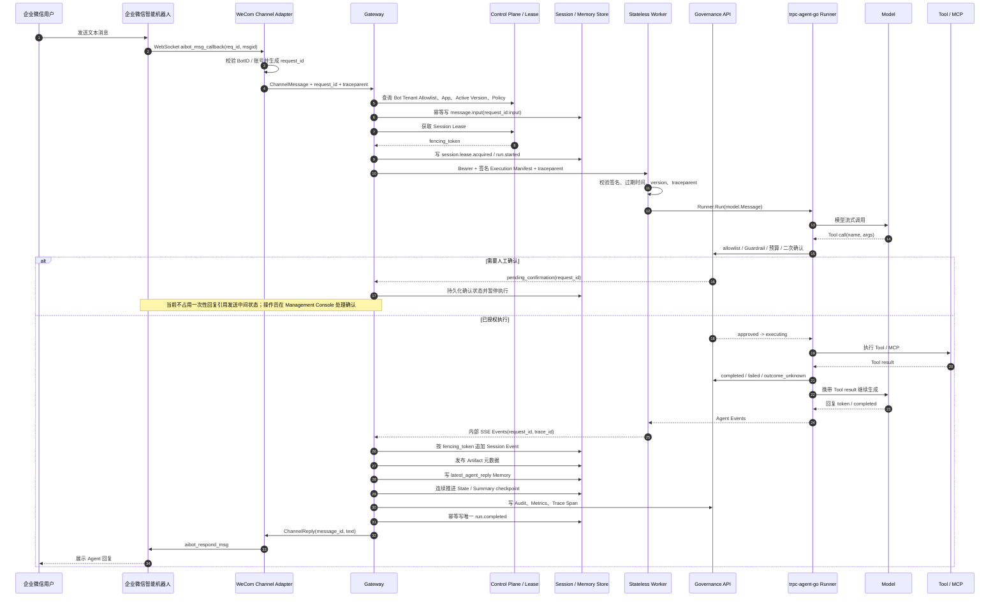

# 企业微信消息核心时序图

本文展示“企业微信用户发消息 → Agent 执行 → Tool 调用 → Session / Memory 写入 → IM 回复”的完整链路。组件职责见[架构设计文档](architecture.md)，事件和字段定义见[数据模型设计](data-model.md)。

## 完整链路

## 关联标识

| 标识 | 生成与传播 | 用途 |
| --- | --- | --- |
| `request_id` | 由 provider `msgid`/`req_id` 稳定派生，经 Gateway、Worker、事件、治理和回复传播 | 业务幂等、重试查询、Tool 状态关联 |
| `trace_id` | Gateway 为请求建立平台 trace，并写入 Manifest、Audit、Artifact | 跨组件检索一次执行 |
| `traceparent` | 入口接收或生成 W3C 上下文，Manifest 固定后传给 Worker | OpenTelemetry 父子 span 传播 |
| `idempotency_key` | 每一步由 `request_id` 加阶段名派生 | 同内容重试返回原结果，不同内容冲突 |
| `fencing_token` | Control Plane 每次授予 Session Lease 时单调递增 | 拒绝失去 Lease 的旧 Gateway 写入 |

## 成功与异常语义

只有 Session Event、Artifact、`latest_agent_reply` Memory 和连续投影全部成功后，Gateway 才写唯一 `run.completed` 并调用 Channel Adapter 回复。Storage 写入失败、Lease 丢失或治理拒绝都不能发送成功回复。重复的企业微信消息复用同一 `request_id`：若事实源已有相同 input 或终态，则返回已有结果；相同 ID 但内容不同返回幂等冲突。

危险 Tool 在产生副作用前必须从 approved 原子进入 executing。若 Worker 在 executing 后失联，平台记录 `outcome_unknown`，不会自动重放。Gateway 失去 Lease 时取消 Runner；即使旧 goroutine 未及时退出，存储层也通过更高 fencing token 拒绝其后续事件和 Memory 写入。

真实 IM 当前只发送最终成功回复，不转发 `message.delta`，也不发送确认、失败或取消状态；完整 Provider 认证、Session 规则和限制矩阵见 [IM Channel Adapter 设计](im-channel-adapter.md)。
