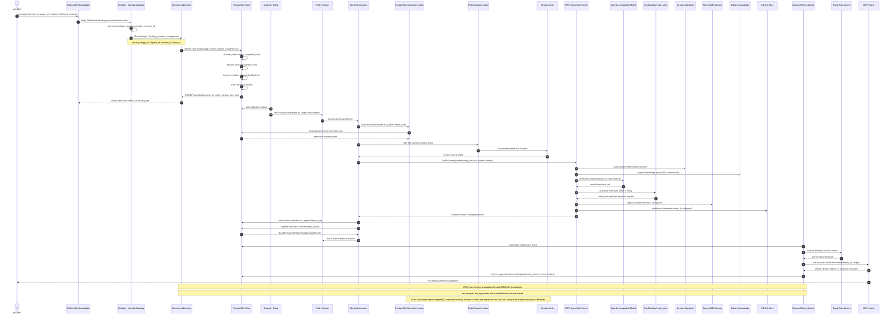
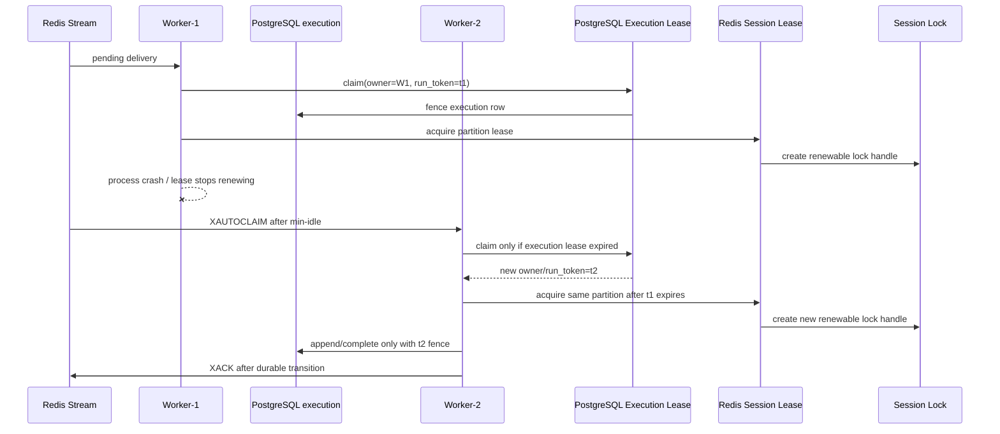
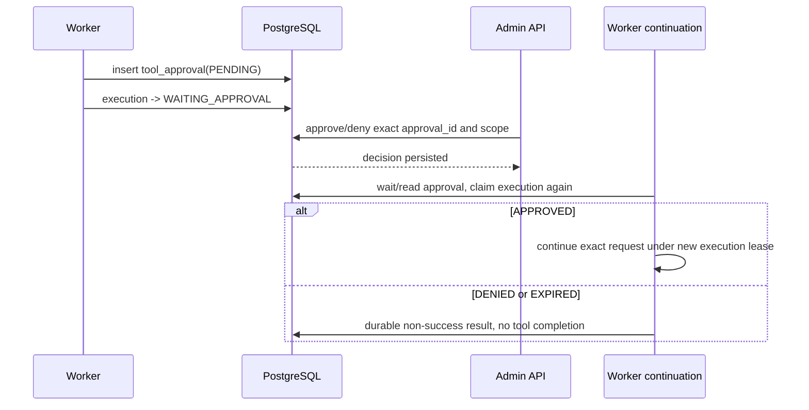

# 核心时序

主链以当前 WeCom/Feishu 官方 WebSocket/long connection 为例；HTTP OpenAI 请求在 `Gateway Admission` 处汇合。Channel Adapter 是独立的单 owner 运行角色，但收到消息后复用同一个 `gateway.Gateway` Admission、PostgreSQL outbox、Redis Stream 和 Worker 链路，不发现具体 Worker。每条消息都必须携带或生成以下上下文：

`tenant_id/app_id`：由 API credential 或 verified channel binding 得到；`request_id`：入口生成并在 execution/outbox/event 中保持；`session_id`：HTTP header 或 direct/group/topic 映射得到；`config_version`：Admission pin 后持久化；`trace_id`：从 W3C trace context 提取或由入口生成，并以 `traceparent/tracestate` 随 dispatch 传播。

当前 IM 模式不提供 HTTP webhook URL；WeCom/Feishu 认证由官方 WebSocket/SDK 使用 binding 的 external account 与 scoped secret 完成。因此 README 中 webhook URL 和 HTTP callback signature verification 对当前模式为 `NOT_APPLICABLE`，不能将 WebSocket protocol authentication 描述成 webhook 验签。

## 主时序图

源文件：[core-sequence.mmd](diagrams/core-sequence.mmd)，查看版：[core-sequence.svg](diagrams/core-sequence.svg)。

## Admission 事务的实际含义

同一个 IM message 的 identity mapping、inbox、session lane、execution、artifact reservation 和 dispatch outbox 不是分散的 best-effort 写入。PostgreSQL 提交是线性化点：事务失败后 Relay 没有可发布的 outbox；事务成功后即使 Gateway 进程退出，Relay/Worker 仍可继续。HTTP 入口用 `(tenant, app, source, source_id, idempotency_key)` 唯一键；Channel 用 `(tenant, app, binding, external_message_id)` 和 payload hash。

## 辅助时序：Worker crash 接管

旧 Worker 即使恢复，也不能用 t1 写入新的 execution 状态；已启动且外部副作用状态不明时，系统选择 `UNCERTAIN`，而不是自动重放。

## 辅助时序：Human Approval

