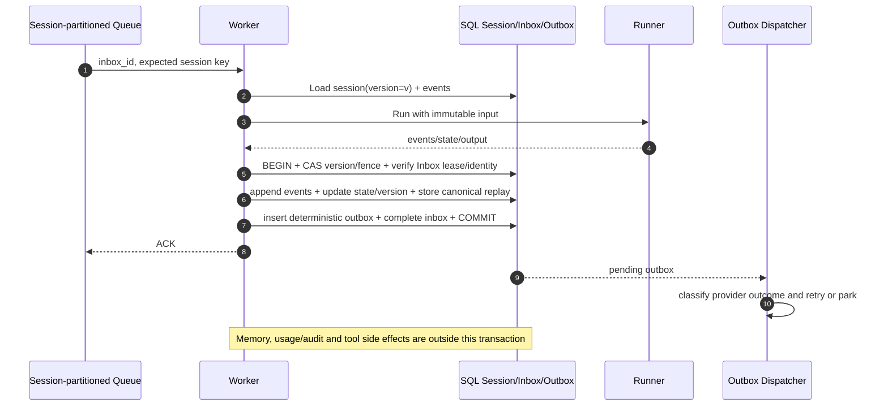
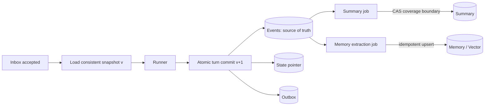
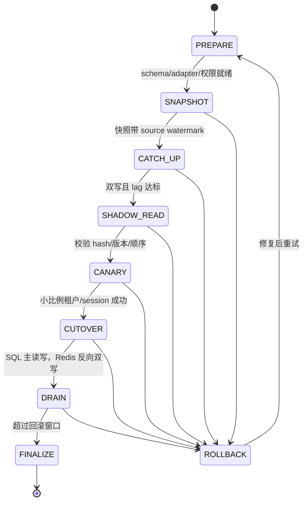

# 数据抽象、一致性与迁移设计

本文描述 Session、Memory、Summary、Artifact、Knowledge 和 Audit Log 的统一访问模型，以及多节点并发、幂等、迁移和最小表结构。文中的保证分为“当前最小实现”和“生产推荐”，两者不能混用。

## 1. 当前能力真值表

配置模型允许声明多种 backend type，但当前 Runtime 并未实现所有适配器。实际能力如下：

| 数据域 | 当前实际后端 | 当前保证 | 生产推荐 |
| --- | --- | --- | --- |
| Session event/state | `trpc-agent-go` InMemory/Redis，或平台 strict PostgreSQL Session | InMemory 仅单进程；Redis 跨节点但依赖协调锁；SQL 将单 turn 的 events/state/version/replay 以 expected-version + fencing 原子提交；与同 DSN PostgreSQL Queue 组合时再把 Inbox processed/Outbox insert 纳入同一事务 | 完成跨节点故障演练与 Summary 生命周期 |
| Summary | InMemory/Redis 中复用所选 Session Service；strict SQL 可使用同一 PostgreSQL 的 008 Summary | SQL 记录覆盖序号、末事件 ID、boundary/generator/model/prompt version 与 source/summary hash；读取拒绝越界、版本不兼容和 hash 漂移；job 使用租约 + `SKIP LOCKED` 可重启续跑 | 生产环境继续补模型/provider 对账和容量治理 |
| Memory | `trpc-agent-go` InMemory/Redis，或外部 Mem0；PG/Redis visibility adapter | InMemory 仅 Runtime/进程可见并明确声明 node-local；PG/Redis 按 tenant/app/principal 持久化单调 watermark，可用 `min_watermark` 跨节点验证写后读并在超时返回 degraded；Mem0 仍只声明 eventual/accepted | 补熔断、导出/恢复和外部 provider 演练 |
| Artifact | InMemory 或 S3-compatible Object Artifact Service | 对象键的 AppName 使用平台 `tenant/app` namespace；支持 workload identity 或 env-ref 静态凭据；对象版本列表由 S3 adapter 管理 | 增加 SQL 元数据、KMS key 策略和 orphan reconciliation |
| Knowledge | PostgreSQL/pgvector + OpenAI-compatible Embedder | 运行时只读校验预迁移表，SQL 查询无条件附加 `tenant_id AND app_name`；Upsert/Delete 使用相同服务端 scope，删除写 tombstone | 增加管理面 ingestion、shadow retrieval 指标和远端向量供应商适配 |
| Audit Log | stdout、权限 `0600` 的 JSONL 文件或 Queue PostgreSQL SQL sink | SQL 008 为追加 hash chain；数据库故障写入 fsynced 本地 spool，启动/后台 drain 只在提交后删除，损坏行隔离；SQL 与 spool 同时失败时业务返回可重试错误 | WORM 归档、容量告警和外部 provider reconciliation |
| Inbox/Outbox | 默认进程队列；可选 Memory/PostgreSQL Store。PostgreSQL 模式具备持久 ACK、事务性 Inbox→分片 Outbox、send attempt/resolution ledger、fencing/续租、Retry-After、unknown 停车与 DLQ | PostgreSQL 队列可跨节点恢复；strict SQL Session 且同 `dsn_env`/database identity 时与 Session turn 共用 COMMIT；Task/Inbox v2 元数据让 rolling upgrade 对 legacy 显式兼容、对 required fail-closed | 平台自动 reconciliation，以及审批控制面的独立一致性协议；007 配置 revision 控制面已提供持久 CAS/release/node ACK |
| 工具副作用 | 单机使用 Memory、`queue.backend=postgres` 使用 PostgreSQL `tool_operation*` ledger | tenant-scoped intent key、单 key 租约/fencing、confirmed replay、普通执行错误转 unknown、CAS 人工决议；只持久化 hash/安全标签 | Provider 查询/reconciliation connector；工具后端同时接收 operation key 作为原生幂等键 |

`DataConfig` 按数据域 fail-closed：Session 允许 InMemory/Redis/SQL；Memory 允许 disabled/InMemory/Redis/外部 Mem0（外部写工具不开放）；Artifact 允许 InMemory/S3-compatible object；Knowledge 允许 disabled/PGVector。SQL Session 的 `summary: sql` 必须与 Session 使用同一 `dsn_env`，InMemory/Redis Summary 必须与 Session 的 type/DSN/namespace 一致。Queue PostgreSQL 是 008 Summary、Memory watermark 和 SQL Audit 的事实源；缺迁移、checksum 或连接能力时启动失败，不静默切换到内存。每个生产 backend 必须给出明确 provider、secret env reference 和 namespace，缺一项即拒绝启动，不静默降级。

## 2. 统一访问抽象

生产实现建议把租户配置解析成一个不可变 `BackendBundle`，一次请求只持有同一 revision 的 Bundle：

```text
BackendBundle
├── SessionStore    AppendEvents / Load / CompareAndSetState / CommitTurn
├── SummaryStore    Get / PutIfCoveredVersion / Invalidate
├── MemoryStore     Search / Upsert / Delete / VisibilityWatermark
├── ArtifactStore   Put / Get / Delete / SignedURL
├── KnowledgeStore  Retrieve / Upsert / Delete
├── AuditSink       Append
├── InboxStore      Accept / MarkProcessing / Complete / Fail
└── OutboxStore     Enqueue / Lease / MarkDelivered / Reschedule
```

所有方法都接收由平台构造而非调用者传入的 `Scope`：

```text
Scope = {
  tenant_id, app_name, config_revision,
  principal_id, session_id, request_id, trace_id
}
```

统一抽象并不强迫所有后端提供相同强度。每个 Adapter 在启动时声明 capability，例如 `transactional_turn_commit`、`compare_and_set`、`linearizable_read`、`delete_tombstone`、`cursor_scan`。控制面根据租户要求拒绝不兼容组合：例如要求强顺序的 Session 不能绑定只有最终一致、又没有 CAS 的外部 Memory 服务。

`trpc-agent-go` 的 `session.Service`、`memory.Service`、`artifact.Service` 和 Knowledge 接口作为 Runner 侧 SPI；平台 Adapter 负责租户 scope、版本、迁移双写和指标。不要把裸客户端直接暴露给 Agent 或工具。

## 3. 命名空间与隔离键

每条记录的逻辑主键至少含 `tenant_id`。推荐键如下：

| 数据 | 逻辑键 |
| --- | --- |
| app | `(tenant_id, app_name)` |
| session | `(tenant_id, app_name, session_id)` |
| event/message | `(tenant_id, app_name, session_id, sequence)`，另有唯一 `(tenant_id, channel, binding_id, external_message_id)` |
| summary | `(tenant_id, app_name, session_id, summary_version)` |
| memory | `(tenant_id, app_name, principal_id, memory_id)` |
| channel binding | `(channel, binding_id)` 全局唯一，同时保存 `tenant_id` |
| artifact | `(tenant_id, app_name, artifact_id)` |
| audit | `(tenant_id, occurred_at, audit_id)` |

Redis key 使用版本化前缀，例如 `tap:v1:{tenantHash}:session:{sessionHash}`。若使用 Redis Cluster，hash tag 只包围需要同槽事务的租户/session 摘要，不要把整个租户塞入单槽。SQL 使用复合主键和 RLS 双重保护；向量检索必须由 Adapter 在服务端合并不可删除的 `tenant_id AND app_name` 过滤，不能信任模型生成的 filter；对象存储使用 `tenant/<tenant_id>/app/<app_name>/...` 前缀、IAM condition 和租户 KMS key。

## 4. 同一 session 的并发一致性

### 4.1 InMemory/Redis 路径

Worker 对 `appNamespace:principalID:sessionID` 加协调锁，然后在锁内执行完整 Runner 和投递前处理。InMemory 协调器只在单进程有效；Redis 协调器通过 `SET NX PX` 获取租约、按 `TTL/3` 续约，并用 compare-delete 释放。队列虽然有多个 worker，但测试验证同一 session 在该锁下形成连续 turn。

该实现仍有三个生产风险：

1. Redis 锁没有 fencing token；持锁者暂停超过租约后恢复，可能以过期所有者身份写入。
2. 续约错误或 compare-renew 返回 0 时，`LockLease.Lost` 会取消当前 Runner；但取消与底层 Session 写之间仍有竞态，没有后端 fencing/CAS 就不能证明陈旧写绝不会落库。
3. In-process queue 不按 session 分区且不持久，顺序完全依赖锁，ACK 后进程崩溃会丢任务。

因此 Redis 协调器是可演示的多节点串行化手段，不是严格的线性一致提交证明。该边界仍适用于 InMemory/Redis Session，不代表下述 SQL 路径。

### 4.2 已实现：strict PostgreSQL Session turn

`trpcservice/sessionturn` 以 `(app_namespace, principal_id, session_id)` 作为 Session key，以完整 key + Worker message dedup key 派生稳定 Turn ID。`BeginTurn` 在行锁下读取 session version/state/event sequence 并签发单调 fencing token；对 active Turn ID 的新 Begin 会接管并使旧 Handle 失效，已 committed Turn 则返回 canonical replay。

SQL `session.Service` 适配层把 turn marker 放入 context。Runner 的 `AppendEvent`/`UpdateSessionState` 只深拷贝并修改 turn-local Session；即使 Runner 取消清理使用 `context.WithoutCancel`，marker 仍在，而已 Abort/封口的 scope 会拒绝晚到写入。Worker 必须排空 event channel，检查 run/lock context 与 sticky staging error，才执行 Commit。

不带 Queue participant 时，Commit 在一个 PostgreSQL 事务内完成：

1. 锁定 Session 行，校验 expected version、Turn fencing token 和当前 Session token。
2. 按连续 sequence 追加本 turn events，替换 session-level state。
3. `version = version + 1`，保存带 schema/version/租户路由身份的 Worker replay，将 Turn 置 committed。
4. 之后才保存 Coordinator result、记录 allow 审计。若没有下节所述的 Queue participant，Outbox 也在之后的队列事务生成；若进程在相邻步骤间崩溃，重试从 Turn replay 恢复同一 request/output，不运行模型。

真实 PostgreSQL 集成测试覆盖并发 schema、commit/replay、重复 commit、version conflict、takeover fencing、整事务 rollback、local-only Abort 后重试、event 深拷贝、state overlay/CRUD 与过滤分页。008 Summary 额外校验 boundary version、覆盖范围、末事件 ID、source hash 和最大兼容覆盖；app/user scoped state 有独立表与 CRUD，不允许在 active turn 中通过 StateDelta 偷渡写入。

### 4.3 已实现：与 PostgreSQL Inbox/Outbox 同事务（限定组合）

当且仅当 `queue.backend=postgres`、租户 `data.session.type=sql`、两者引用相同 `dsn_env`，且持久 `database_identity` 与当前 Queue/Session runtime 都一致时，Durable relay 才把 Queue participant 附加到 strict Turn。配置在 DSN 环境变量名不一致时 fail-closed，持久协议再防止滚动部署期间 DSN 指向、database 或 search_path 漂移。Memory Store 不实现该扩展，跨数据库事务也不在支持范围。当前算法为：

1. 接收时由 Queue 覆盖并持久化 Task `pipeline`，同时镜像到 Inbox 三列；relay 租用 Inbox 后先比较两份 metadata、Queue capability/identity，固定 `inbox_id + owner + attempt_count + tenant/channel/binding/dedup/partition + pipeline identity`，再从 payload 恢复不可变 tenant revision 和消息。
2. Worker 取得 Runtime 后再次比较 strict Session database identity；required 记录缺 participant 或 identity 不匹配时在 `BeginTurn`/Runner 前返回 blocked disposition，由 Durable 停放且不扣死信预算。验证通过后，`BeginTurn` 读取 Session snapshot/version/fence；运行 Runner/工具，将 Session event/state 暂存在本地。外部有副作用的工具尚未进入本事务，不能因事务回滚而盲目重跑。
3. Worker 先用 Adapter `Plan` 生成确定性分片，把完整 delivery plan 与 request/usage/output 编入版本化 canonical replay。
4. strict Session 开启 PostgreSQL 事务，锁 Session 行；fresh Turn 校验 expected version/fence 后追加 events、更新 state/version 并保存 replay，已 committed Turn 则选用数据库中的 canonical replay，而不是调用方候选值。
5. 同一事务内，Queue participant 从所选 canonical replay 重建 Outbox，锁定 Inbox，并校验 owner、attempt、全部路由身份和数据库 lease deadline。
6. 按顺序插入或核对确定性 Outbox；最后执行带相同 fence 和 deadline 条件的 Inbox `processed` UPDATE；任一失败使 Session、Outbox 与 Inbox 全部回滚。
7. 提交成功后才保存 Coordinator result/完成 claim。该步骤是缓存与清理，不在上述事务中；失败不会把已经 processed 的 Inbox 重新武装。

重复或并发提交者必须复用数据库已提交的 canonical replay。该事务只解决本地 PostgreSQL 状态的原子可见性，不覆盖 Memory、用量/审计、工具外部副作用或 IM 平台发送，因此仍不是端到端 exactly-once。



如果使用租约锁，应让协调器返回单调递增 `fencing_token`，并让所有状态写带 `WHERE last_fencing_token < token`；只在 Redis 校验“锁仍存在”不足以阻止陈旧客户端。数据库行锁/CAS 比跨系统分布式锁更容易证明。

## 5. event、state、summary 与 memory 的更新顺序

### 5.1 规范顺序

1. **持久接收**：Inbox 去重并保存原始消息 hash、规范化消息和配置 revision。
2. **读取水位**：读取 `session.version`、事件到 `last_event_sequence`、有效 summary 及其 `covers_through_sequence`。
3. **执行**：Runner 只基于该一致快照运行。
4. **原子 turn 提交**：events → state → session version → Outbox → Inbox completed 在一个事务中；若后端不能跨记录事务，用 event log 为事实源并以 CAS 发布 state pointer。
5. **摘要**：异步任务从确定的 event 范围生成 summary，写入时校验起止序号和 source hash。新摘要只替换覆盖范围更大、模型/提示词版本兼容的旧摘要。
6. **长期记忆**：事务提交后发 durable extraction job；`memory_id = H(tenant, session, source_event_ids, extractor_version)`，幂等 upsert。失败不回滚已完成对话，但要重试并暴露 lag。

当前 strict SQL + 同 DSN PostgreSQL Queue 路径已实现第 2、3、4：events/state/session version/canonical replay、确定性 Outbox 和 Inbox processed 在同一事务中提交。008 Summary、Memory watermark、Audit 和向量迁移拥有各自可恢复边界，不伪装成 Session COMMIT 的参与者；所有组合中的用量/审计、Memory、Summary 和 tool 副作用仍需分别对账。



不能采用“先更新 summary，再落原始 event”的顺序；摘要失败或模型幻觉时必须可从不可变 event 重建。state 是加速视图而非唯一事实源。

### 5.2 Memory 跨节点可见性

当前 Memory 可选 InMemory、Redis 或外部 Mem0：InMemory 只在创建它的 Runtime/进程中可见；Redis Memory 使用 `dsn_env` 与租户 namespace，可由多节点 Runtime 共享；Mem0 作为 `session.Ingestor + memory.Reader` 装配，turn 完成后摄取，并只向 Agent 暴露租户允许的 `memory_search/memory_load`。外部 Mem0 的 add/update/delete/clear 配置会在启动校验阶段被拒绝，避免把供应商不支持的写语义伪装成成功。OpenAI Agent 对 Redis/外部 Memory 都会预加载最多 20 条记忆。008 的 `memoryvisibility.Store` 在 Redis 或 Queue PostgreSQL 上为每次成功写入生成单调水位，读端可携带 `min_watermark` 并等待跨节点可见；超时返回 `degraded`，InMemory 明确只声明 node-local，Mem0 仍只能声明 eventual/accepted。

生产提供两个读取等级：

- `committed`：写 API 返回前，主存储已提交；同租户所有节点读主库或满足 read-your-write token 的副本，适合用户显式“记住”。
- `eventual`：向量索引异步刷新，响应携带 `memory_watermark`；查询可指定 `min_watermark` 等待有限时间，超时则回退 SQL 关键词/最近记忆并标记 degraded。

监控 `memory_index_lag_seconds`、待提取任务数和水位差。检索结果必须带 source event、embedding model/version、created revision，便于审计和迁移。

Redis/InMemory Summary 已通过框架 `WithSummarizer` 接线，20 条可摘要事件触发框架异步生成，按 Runner 的 app namespace 分支键保存和读取；`disabled` 不生成。Redis 已持久化的摘要可由独立 Runtime 读取，但异步队列本身是进程内的，崩溃/回收后尚未完成的任务需后续调用重新触发，不能等同于下述 SQL 作业恢复保证。

### 5.3 008 生命周期账本与恢复边界

`migrations/008_data_lifecycle.sql` 是追加且 checksum 校验的生命周期迁移，包含三组事实源：

- `session_turn_summaries` 用 `(tenant, app, user, session, filter, coverage, generator, summary_version)` 幂等写入。写入前锁定 Session 并校验边界版本、事件连续范围、末事件 ID 和 source hash；读取只选择版本兼容、未越界且 source/summary hash 仍匹配的最大覆盖摘要。`session_summary_jobs` 保存租约、attempt、重试时间和错误，节点重启后通过 `FOR UPDATE SKIP LOCKED` 续跑。
- `memory_visibility_watermarks` 以 `(tenant, app, principal)` 保存 backend epoch、单调 watermark、更新时间和最后错误。两个独立 Runtime 连接同一 PostgreSQL 或 Redis 可互相读取并验证水位；故障和等待超时不会伪造可见性。
- `audit_tenant_heads` + `audit_records` 是追加式 hash chain。SQL sink 先完成数据库事务；数据库不可用时只在 redaction 后写入权限 `0600`、fsync 完成的本地 JSONL spool，启动/后台 drain 仅在数据库提交后删除记录，损坏行进入 `.corrupt` 隔离文件。稳定 `audit_id` 使 replay 幂等，跨节点读取可校验 payload、sequence、前链 hash 和 record hash；数据库和 spool 都不可用时 Worker 返回可重试错误。

`trpc-data-migrate` 的 `knowledge` 资源接受版本化 JSONL。每条对象携带 `session_epoch`、`through_sequence`、`summary_version`、embedding model/dimension 与 content hash；目标用稳定 document ID 和 SQL epoch/sequence predicate 防止旧会话/旧摘要覆盖新内容。每个对象写入 source/target hash 和 `data_migration_reconciliations`，失败可从 opaque cursor 续跑；rollback 只删除本次 migration 写入且 hash 未变化的对象，已被新写入替代的对象保留并记录 `rollback_conflict`，可逐对象对账。

## 6. IM 重投与端到端幂等

### 6.1 当前最小实现

幂等键为规范化后的 `(tenant, binding, channel, external_message_id)` 哈希。Worker 先取得完整 session 锁，再进入 claim/result 流程，避免排队时间耗尽 processing TTL。Coordinator 维护 `processing/completed` claim 和 TTL；processing claim 带随机 owner token，只有当前 owner 才能保存 pending result、完成或释放，旧 Worker 不能覆盖新 claim：

- 已 completed 的重投标记 `Duplicate=true`；在已取得 session lane 后仍看到 processing，视为孤儿/并行 claim 并返回可重试错误，不能把尚未处理的消息静默当成功。
- Runner 输出先暂存为包含稳定 request ID 和 usage 的 result，并立即记录 Agent 完成用量/allow 审计，再调用 IM；发送失败会释放 claim 但保留 result，下次重投加载 result 并只重发，不重跑 Agent。已有自动测试覆盖此路径。
- 成功后把 claim 标为 completed，并让暂存 result 与 completed claim 保持相同 TTL。普通 Session 路径在 `Worker.Process` 返回后提交 Inbox/Outbox；strict SQL + 同 DSN PostgreSQL Queue 路径则在 `Worker.Process` 内随 Session Turn 一起提交，之后的 claim/result 仅作缓存与清理。canonical replay 或保留 result 都能重建完全相同的 Outbox，而不重新运行 Agent。InMemory Coordinator 按周期清理过期 claim/result，Redis 依赖 key TTL。
- processing TTL 取 run timeout/锁窗口的安全倍数而不是 24 小时 completed TTL；崩溃 claim 会较快过期，同时 owner token 防止过期 Worker 删除或完成继任 claim。

局限：只有 strict SQL + 同 DSN PostgreSQL Queue 将 Session turn 与 Inbox/Outbox 合并；claim、用量账本/审计、Memory、工具副作用账本和平台投递结果仍在该 Session 事务之外。006 用量账本自身保证跨节点 reserve/settle/unknown 的原子状态转换，canonical replay 会携带已落账的 usage 汇总且不会重新调用模型；它不把外部 provider 与 Session 本地数据库原子提交。工具 ledger 已将 crash 窗口收敛为 confirmed replay 或 unknown 停车，但不能把外部 provider 与本地数据库原子提交。崩溃留下的 processing claim 到 TTL 前只能失败重试；completed 过期后极晚重投可能再执行非 ledger 数据域。`inmemory` 队列仍是“至少一次尝试 + 常见窗口去重”；平台/provider 没有原生幂等键时不能宣称严格 exactly-once。

### 6.2 已实现的工具副作用 operation ledger

租户配置用 `tools.side_effects` 显式声明可能改变外部状态的工具，且所有 `require_confirmation` 工具必须同时属于该集合。两者相互独立：确认回答“这次是否授权”，operation ledger 回答“这次授权后的外部效果能否安全重放”。当前执行顺序为：

1. runner-scoped `BeforeTool` 用 `(tenant, app namespace, session, stable turn, config revision, tool, canonical arguments hash)` 派生 opaque intent key，先查账；confirmed 返回非空通用 replay 结果并跳过真实工具，executing/unknown fail-closed。revision 入 key，避免一次旧授权的确认结果跨配置/策略版本复用。
2. 组合 `PermissionPolicy` 先执行 allow/deny/ask。deny/ask 不写账；只有 allow 才 `Reserve → LeaseOperation(single key) → MarkExecuting`，随后框架调用工具。opaque operation key 同时放入 Context，真实工具可传给支持幂等键的 provider。
3. 工具成功后，Plugin 对最终 model-facing tool message 只保存 SHA-256 并把 operation 置 confirmed；普通 timeout/network/error 一律置 unknown。只有显式实现“确定未应用”类型契约的错误才进入 `retryable_not_applied`。
4. 执行中 lease 过期由 `ReclaimExpired` 转 unknown，不会自动再租。管理员通过 `GET /admin/v1/tool-operations/uncertain?tenant_id=...` 查看无正文投影，再用 `POST /admin/v1/tool-operations/{key}/resolve` 加 resolution ID 与 expected version CAS 选择 confirm、retry_not_applied 或 reject。

同一 stable turn 中相同工具和规范参数被视为同一业务意图，即使模型重试后生成了新的 ToolCallID，也不会重复执行；确实需要两次相同副作用时，参数必须携带不同的业务 idempotency/resource ID。账本不保存原始参数、provider response、错误正文或 lease owner capability，只保存 payload/result/owner hash、受限标签、attempt 与 resolution。跨进程 confirmed replay 只返回“already_applied + operation key”的安全通用结果，不伪造已丢失的 provider 响应；需要原始资源 ID 的工具应把它写入受 KMS 保护的结果 vault 或通过 provider idempotency query 恢复。

### 6.3 已实现的持久 Inbox/Outbox（`queue.backend=postgres`）

`store` 包实现了下述 6.5 设计的运行时子集，Docker Compose 默认启用。`runtime_inbox`、`runtime_outbox*` 与 `session_turn_*` 由 [002_runtime_pipeline.sql](../migrations/002_runtime_pipeline.sql) 定义，工具账本由追加式 [003_tool_operations.sql](../migrations/003_tool_operations.sql) 定义：

- Webhook 在 `Submit` 将消息写入 `runtime_inbox`（dedup key 唯一约束，命中唯一冲突视为平台重投并直接 ACK）成功后才返回 accepted；崩溃不丢已确认消息。Queue 在序列化前覆盖 Task `pipeline`，并把 `schema_version/atomic_commit_mode/database_identity` 镜像为 Inbox 独立列，避免 payload 自声明能力。
- `Submit` 先用可信 Tenant/Binding 规范化消息，再通过与 Worker 锁相同的 `SessionPartitionKey` 写入 `partition_key`。Inbox 只允许每个 lane 最早的 `received/retry/processing` 记录被租，Outbox 对 `pending/retry/sending` 做同样前驱检查；队首即使退避到未来或仍持租约也会阻塞同 Session 后继，而其他 lane 可被 `SKIP LOCKED` 并发领取。`created_at + queue_sequence` 定义持久化顺序。
- 每个 relay Worker 只租用一条可立即处理的 Inbox，避免一批记录在本地排队时提前消耗租期。每次尝试使用独立随机 `lease_owner`，长任务按 `lease_ttl/3` 续租；续租失败会取消运行，陈旧尝试不能完成继任者的记录。
- 对 `data.session.type=sql` 的租户，配置要求 Session 与 PostgreSQL Queue 使用相同 `dsn_env`。Runner 输出和确定性 delivery plan 编入 canonical Turn replay；Session events/state/version/replay、完整 Inbox lease/身份/deadline 校验、`runtime_outbox` 插入和 Inbox processed 由 Queue participant 在同一事务提交。已提交 Turn 的补齐路径使用数据库 canonical replay；InMemory/Redis Session 仍由独立 Inbox 完成事务和 Coordinator result 重放。
- relay 用任务中的不可变 binding snapshot 调用 Adapter `Plan`，先按 rune（Telegram/Slack）或 UTF-8 byte（企业微信）确定分片；每片具有稳定 `operation_key`、确定性 Outbox ID、part index/count 和 payload hash，并在一次 Inbox 完成事务中按序写入。Adapter `Deliver` 此后严格只执行一个平台请求，消除了“前片成功、后片失败、整条回复从头重发”的隐藏重复窗口。
- sender Worker 同样每次只租用一条 Outbox 并自动续租。Lease 与 `leased` attempt 原子创建；按 `(tenant_id, channel_type, binding_id)` 解析当前绑定后、首次可能发出请求字节前，必须先把 attempt 提交为 `dispatched`。绑定键被其他租户接管时只做发送前的安全重试/入 dead letter，绝不使用新租户凭据发送旧回复。
- Outbox 持久化 W3C `traceparent/tracestate`，sender 恢复上下文后再调用 Adapter，因此异步 `im.send` 与原 callback/Runner 保持同一 trace；不持久化可能携带业务数据的 baggage。
- Adapter 返回四种结构化结果：`confirmed` 保存平台 message/request ID；`retryable_not_sent`（例如明确 429）按 `max(provider Retry-After, policy backoff)` 重试；`permanent_rejected` 进入 dead letter；`unknown`（网络/timeout、2xx 响应不可解析等）保留旧调度状态 `sending` 但清空租约并停止自动重试。reclaim 只把过期 `leased` attempt 安全转 retry；`dispatched` 或无 phase 的遗留发送转 unknown。unknown 因旧状态仍为 sending，会继续阻塞同 Session lane 的后继，但不影响其他 lane。
- unknown 只能通过受 Admin Bearer 保护的 API 处理：列表不返回正文、target 或 trace；决议携带唯一 resolution ID、expected state version 和 attempt number，CAS 选择 `assume_delivered`、显式接受重复风险的 `retry` 或 `cancel`，并写不可变 resolution ledger。两个管理员并发决议只有一个可成功。
- PostgreSQL 是队列时间的唯一事实源：插入、due 判断、租约 deadline、续租和 reclaim 使用 `clock_timestamp()`；调用方的 `now/retryAt` 只用于表达相对 retry delay。完成、续租、重试和 dead-letter 先在事务中取得 attempt 行锁，再用新的数据库时间检查 lease，防止 SQL 在等待行锁前冻结时间并让已过期尝试提交。
- 独立 `trpc-migrate` 在 transaction-scoped advisory lock 内顺序调用 `ApplyAll`，登记 002–009 的 SHA-256；Queue、Session、用量账本、配置控制面、Summary/Memory/Audit 生命周期、内容安全和工具业务连接调用 `VerifyAll`，Artifact 连接还验证 005 表结构、强制 RLS 和 DML 权限。同 version checksum 不一致或缺 migration 均 fail-closed。Artifact 版本由 SQL 串行分配，上传/删除先写 pending 状态，跨 S3/SQL 的半失败由后台 reconciliation 幂等收敛；读路径只读 ready 行并核对 size/SHA-256。滚动升级期间旧 writer 产生的空 partition key 被视为 tenant/channel/binding 范围的保守 lane。Compose 的迁移账号持有 DDL，runtime 账号只获 `schema_migrations` SELECT 与 allowlisted data-plane DML；生产分别注入 migration/runtime secrets。
- 自动化测试已加入 pipeline metadata validation、当前 v2 Task/Inbox drift 死信、future/capability/database mismatch 停放、legacy 双事务 drain、migration checksum、共享 schema upgrade，以及 Durable→Worker→Session/Inbox/Outbox 组合提交用例。带 `TEST_POSTGRES_DSN` 的完整 PostgreSQL 套件覆盖 008 Summary、水位和 SQL Audit、009 Content Safety 包，发布时必须显式运行；未提供数据库导致的 skip 不能作为这些用例通过的证据。
- 未实现的部分：IM send 与 tool side-effect operation ledger 已实现，但外部平台没有统一可依赖的 provider idempotency/query 能力，unknown 仍需对账或人工决议；Memory、Summary 与 Session/Queue 的业务写入不是一个跨域事务，预算账本也不与 Session COMMIT 合并；非 SQL Session、非 PostgreSQL Queue 或不同数据库不具备组合事务；网络分区、进程 SIGKILL、COMMIT ACK 不确定和恢复 drain 仍需部署级演练。

### 6.4 已实现的 rolling-upgrade 协议

当前 `DurablePipelineVersion=2`。三种可接受状态及其迁移语义为：

1. **legacy**：Task 无 `pipeline`（反序列化为零值），Inbox 的 `pipeline_schema_version=0`、`atomic_commit_mode=''`、`database_identity=''`。只有三者全部为零/空才成立；部分空值是损坏，不会被宽松当成 legacy。新 relay 不附加 participant，strict SQL backlog 沿“Session Turn Commit → canonical replay → Inbox/Outbox Commit”双事务排空，失败能重放但中间状态短暂可见，并增加 `queue_inbox_legacy_pipeline_total`。
2. **v2 disabled**：当前记录明确不要求组合事务，`database_identity` 必须为空，也不能携带 participant。它用于非组合后端，不会在升级后被宣传为同事务。
3. **v2 required**：`atomic_commit_mode='postgres_same_database_v1'` 且 `database_identity` 非空。Relay 比较 Task 与 Inbox、Queue identity 和 capability；Worker 在获得 Runtime 后再比较 Session identity，并在提交点校验事务连接 identity。只有 Task/Inbox 元数据完全一致且 Queue、Session、事务连接指向同一 database identity、transaction participant 可用时才执行组合事务；不会静默退回 legacy 双事务。

拒绝执行还必须区分“滚动发布可恢复”和“持久记录已损坏”：未来 pipeline 版本、required 的 strict SQL/participant 等能力暂缺，或 Queue/Session/事务连接 identity 不匹配时，Inbox 释放租约后停放重试，不运行模型且不消耗死信尝试预算；这允许旧 Worker、未完成迁移的实例或临时错误数据库配置在修复后继续 drain。当前 v2 的部分空字段、非法 mode/identity 组合、Task/Inbox 两份元数据漂移属于格式损坏，直接进入 dead letter。两类路径都增加 pipeline 拒绝观测并保持 fail-closed，但只有后一类占用 DLQ。

`database_identity` 不保存 DSN、凭据或角色，只摘要 PostgreSQL host/port/database/search_path。角色被排除是为了允许 Queue/Session 使用不同的最小权限账号；search_path 被纳入则防止“同库不同 schema”误共享事务。Task 与 Inbox 双份保存不是两套事实源，而是防篡改/升级一致性检查：当前 v2 的任一差异都要求人工修复或显式 migration，并进入 dead letter，不能把其中一份覆盖另一份后继续运行。

migration 002 先给旧表增加默认 `0/空/空` 列并保留 legacy trigger，003 只追加工具 operation/attempt/resolution 表。推荐发布顺序是：用独立迁移身份执行 `trpc-migrate` 至当前 LatestVersion → 发布能读 legacy/v2 且会停放未来协议的 reader/Worker → 确认全部 Worker 具备 required atomic 与 side-effect guard 能力 → 才启用对应写路径 → 观察 legacy backlog/metric 归零 → 禁止旧 writer。未来版本或能力/identity 暂缺造成的 parked backlog 必须单独告警；回滚 binary 不得回滚或篡改已登记 checksum 的 migration 文件。

### 6.5 生产 Inbox/Outbox（完整设计）

Inbound 使用数据库唯一约束：

```text
UNIQUE (tenant_id, channel, binding_id, external_message_id)
```

同一事务内：首次插入返回 accepted，冲突则返回已有状态并立即 ACK。Outbound 用稳定的 `outbox_id` 和平台支持时的 client message id；Dispatcher 租约领取、指数退避、识别可重试/永久错误，最终进入 DLQ。业务语义只能做到“effectively once”：

- 平台支持幂等发送键时传 `outbox_id`；
- 平台不支持时记录 send attempt 与平台 message ID，发送超时采用查询/对账后再决定重试；
- 对撤回、编辑、工具副作用分别维护 operation ledger 和幂等键。

不得把 dedupe TTL 当数据保留期。Inbox 唯一键至少保留平台最大重投窗口加安全余量；若归档，保留 compact tombstone/hash。

## 7. 后端一致性取舍

| 后端 | 典型一致性 | 延迟/吞吐 | 成本与运维 | 适用场景 |
| --- | --- | --- | --- | --- |
| InMemory | 单进程内强一致；跨进程无一致性 | 最低延迟 | 最低成本，重启丢失 | 单元测试、本地演示 |
| Redis | 单主写可提供较强读写顺序；副本读可能滞后；Lua/CAS 可原子化单槽 | 低延迟、高 QPS | 需持久化、哨兵/Cluster、热 key 治理 | 锁、限流、短期 dedupe/cache；小型 Session |
| SQL | 事务、唯一约束、行锁/CAS，易实现强一致 turn | 中等延迟，需索引与分片 | 成熟但要做容量、PITR、连接池 | Inbox/Outbox、Session、事件、配置事实源 |
| 向量库 | 索引刷新多为最终一致 | 检索快，写后可见有延迟 | embedding/索引成本与召回调优 | Knowledge、长期 Memory 检索 |
| 对象存储 | 新对象通常强读后写，列表/跨区域复制可能滞后 | 大对象友好，首字节较慢 | 低单价，需生命周期和 KMS | Artifact、审计归档、迁移快照 |
| 外部 Memory 服务 | 取决于供应商，常为最终一致 | 网络与供应商尾延迟 | 接入快但有锁定、合规和配额风险 | 非关键长期记忆；必须有熔断/导出能力 |

选择原则：对“会影响下一轮回答顺序”的 Session event/state 使用强一致或可验证 CAS；Summary、向量索引和分析型 Audit 可最终一致，但必须暴露水位和 lag；Artifact 元数据强一致、二进制对象可通过 content hash 校验。

## 8. Redis → SQL 迁移

迁移由控制面管理单调状态，所有步骤可重入。`trpcservice/datamigration.Engine` 已实现阶段推进、opaque checkpoint、累计计数、generation CAS/fencing、失败重试、显式 rollback 和 shadow/canary/drain/finalize mismatch 门禁；任意验证批次出现 mismatch 都会立即暂停，不会被后续批次覆盖。`004_data_migrations.sql` 持久化 job 与 object ledger；008 追加 source epoch/sequence、target version、逐对象 reconciliation 和 rollback 状态。`trpc-data-migrate` 已把 Redis Session 的 HashIdx/legacy zset 目录扫描、完整读取、strict SQL 原样导入和逐对象 SHA-256 对账接入该 Engine，并提供版本化 JSONL 向量 → PGVector 的 resume/verify/rollback 路径；Worker 会读取 coordination Redis 中的持久租户冻结，冻结后的新请求按 blocked 停放，命令还要求冻结持续超过 drain 窗口。目标已有不同会话或 app/user overlay 时导入失败，不能覆盖活跃写入；向量导入还拒绝旧 session epoch/sequence，rollback 仅删除本次 migration 且 hash 未变化的对象。发布系统仍负责在冻结期间修改配置；cutover/rollback phase 只在当前配置分别显示 `sql`/`redis` 时确认。在线双写与 Redis Memory mutation journal 不在本轮范围，因此 Redis→SQL 当前路径仍是计划停机迁移；本地向量迁移支持逐对象续跑与选择性回滚。状态机如下：



步骤细节：

1. **PREPARE**：冻结序列化格式版本；SQL 建表/索引/RLS；迁移 ledger 保存 tenant、object、source version、hash、状态。先验证备份和回滚路径。
2. **SNAPSHOT**：按稳定 cursor 扫描 Redis；每条记录携带 `source_version`、event sequence、TTL 绝对到期时间和 content hash，SQL `UPSERT` 幂等导入。不能用 `KEYS *` 阻塞生产实例。
3. **CATCH_UP**：应用先 source-write Redis，再写 mutation journal/SQL；更推荐在启迁前已经把所有写抽象成带 write_id 的双写。比较高水位而不是只看 key 数。
4. **SHADOW_READ**：线上仍返回 Redis，异步读取 SQL 并比较事件序号、state hash、summary coverage；采样不得泄漏正文。
5. **CANARY**：按稳定 session hash 把 1%→5%→25% 读流量切到 SQL，写保持双向或以 journal 可回放；观察错误、P99 和差异率。
6. **CUTOVER/DRAIN**：SQL 主读写；为可回滚，短期反向写 Redis 或持续记录可回放 journal。禁止此时删除 Redis 数据。
7. **FINALIZE**：超过最长 session/rollback 窗口且 reconciliation 为零差异后，只读归档并按审批清理。

回滚只改变读主源，不逆序覆盖较新版本。冲突选择最大单调 version/event sequence，并记录人工审计；绝不能用迁移开始时的旧快照覆盖线上新状态。

## 9. 本地向量库 → 远端向量库迁移

当前 `trpc-data-migrate -resource-kind knowledge` 沿用同一状态机，输入是版本化 JSONL、目标是预迁移的 PGVector 表；对象单位是 document/chunk/vector：

1. 固定 canonical `document_id/chunk_id`，保存原文 content hash、chunker version、embedding model/version、维度与删除 tombstone。
2. 若远端 embedding 模型和维度相同，可批量导出/import；不同则从授权的原文对象重新 embedding，不能把不同空间的向量直接混用。
3. Snapshot 后开启带 `mutation_id` 的双写，upsert/delete 均幂等；删除 tombstone 必须先于最终清理传播，避免数据复活。
4. Shadow query 同时检索两端，对比 Top-K overlap、NDCG/人工黄金集命中率、过滤正确率、P95/P99，而不是比较浮点向量是否完全相等。
5. Canary 按租户/session 稳定分桶；远端超时回退本地，并记录 `retrieval_backend` 与 degraded 指标。
6. Cutover 后保留本地只读索引和 mutation journal 至回滚窗口结束；完成租户级导出、数量/hash/tombstone 对账后再清理。`Engine` 支持 `advance`、失败恢复和显式 `rollback`；opaque JSONL 行号 cursor 使重启不会跳过对象。

向量迁移的硬门槛包括：`tenant_id` filter 穿透测试 100% 通过、抽样内容 hash 一致、tombstone lag 为零、召回指标不低于约定阈值、尾延迟和费用在预算内。代码层额外硬门槛是 source epoch/sequence predicate、目标新版本保护、逐对象 reconciliation 记录以及 selective rollback 冲突不覆盖。

## 10. 最小关系数据模型

以下是生产目标的逻辑 DDL，字段类型可按 PostgreSQL 方言调整。所有外键和唯一约束都带 `tenant_id`，避免仅凭随机 ID 造成跨租户引用。控制面基础模型见 [001_schema.sql](../migrations/001_schema.sql)；当前可执行的 Queue/strict Session、工具账本、数据迁移 ledger、Artifact 恢复账本、模型用量账本、持久配置控制面、生命周期账本和内容安全租约分别以 checksum 管理的 [002_runtime_pipeline.sql](../migrations/002_runtime_pipeline.sql)、[003_tool_operations.sql](../migrations/003_tool_operations.sql)、[004_data_migrations.sql](../migrations/004_data_migrations.sql)、[005_artifact_objects.sql](../migrations/005_artifact_objects.sql)、[006_usage_budget.sql](../migrations/006_usage_budget.sql)、[007_config_control_plane.sql](../migrations/007_config_control_plane.sql)、[008_data_lifecycle.sql](../migrations/008_data_lifecycle.sql)、[009_production_safety.sql](../migrations/009_production_safety.sql) 为准。PGVector 表由 `trpc-migrate -config ...` 使用独立 `migration_dsn_env` 按配置维度创建，业务 Runtime 只读校验，不能执行 DDL。

```sql
CREATE TABLE tenant (
  tenant_id        text PRIMARY KEY,
  status           text NOT NULL,
  active_revision  text NOT NULL,
  created_at       timestamptz NOT NULL,
  updated_at       timestamptz NOT NULL
);

CREATE TABLE agent_app (
  tenant_id        text NOT NULL,
  app_name         text NOT NULL,
  revision         text NOT NULL,
  agent_name       text NOT NULL,
  config_json      jsonb NOT NULL,       -- 只含 secret 引用
  config_hash      text NOT NULL,
  status           text NOT NULL,
  created_at       timestamptz NOT NULL,
  PRIMARY KEY (tenant_id, app_name, revision)
);

CREATE TABLE channel_binding (
  channel          text NOT NULL,
  binding_id       text NOT NULL,
  tenant_id        text NOT NULL,
  app_name         text NOT NULL,
  config_revision  text NOT NULL,
  secret_ref       text NOT NULL,
  status           text NOT NULL,
  created_at       timestamptz NOT NULL,
  PRIMARY KEY (channel, binding_id)
);

CREATE TABLE session (
  tenant_id        text NOT NULL,
  app_name         text NOT NULL,
  session_id       text NOT NULL,
  principal_id     text NOT NULL,
  scope            text NOT NULL,
  version          bigint NOT NULL DEFAULT 0,
  last_sequence    bigint NOT NULL DEFAULT 0,
  state_json       jsonb NOT NULL DEFAULT '{}',
  fencing_token    bigint NOT NULL DEFAULT 0,
  updated_at       timestamptz NOT NULL,
  PRIMARY KEY (tenant_id, app_name, session_id)
);

CREATE TABLE session_event (
  tenant_id        text NOT NULL,
  app_name         text NOT NULL,
  session_id       text NOT NULL,
  sequence         bigint NOT NULL,
  event_id         text NOT NULL,
  request_id       text NOT NULL,
  role             text NOT NULL,
  event_type       text NOT NULL,
  payload_cipher   bytea,                -- 或受策略约束的结构化 payload
  content_hash     text NOT NULL,
  occurred_at      timestamptz NOT NULL,
  PRIMARY KEY (tenant_id, app_name, session_id, sequence),
  UNIQUE (tenant_id, event_id)
);

CREATE TABLE session_summary (
  tenant_id        text NOT NULL,
  app_name         text NOT NULL,
  session_id       text NOT NULL,
  summary_version  bigint NOT NULL,
  covers_from      bigint NOT NULL,
  covers_through   bigint NOT NULL,
  source_hash      text NOT NULL,
  model_version    text NOT NULL,
  summary_cipher   bytea NOT NULL,
  created_at       timestamptz NOT NULL,
  PRIMARY KEY (tenant_id, app_name, session_id, summary_version)
);

CREATE TABLE memory (
  tenant_id        text NOT NULL,
  app_name         text NOT NULL,
  principal_id     text NOT NULL,
  memory_id        text NOT NULL,
  source_event_ids jsonb NOT NULL,
  content_cipher   bytea NOT NULL,
  content_hash     text NOT NULL,
  embedding_ref    text,
  extractor_version text NOT NULL,
  visibility_watermark bigint NOT NULL,
  deleted_at       timestamptz,
  created_at       timestamptz NOT NULL,
  PRIMARY KEY (tenant_id, app_name, principal_id, memory_id)
);

CREATE TABLE inbox (
  inbox_id         text PRIMARY KEY,
  tenant_id        text NOT NULL,
  channel          text NOT NULL,
  binding_id       text NOT NULL,
  external_message_id text NOT NULL,
  config_revision  text NOT NULL,
  normalized_json  jsonb NOT NULL,
  status           text NOT NULL,
  attempts         integer NOT NULL DEFAULT 0,
  next_attempt_at  timestamptz,
  received_at      timestamptz NOT NULL,
  UNIQUE (tenant_id, channel, binding_id, external_message_id)
);

CREATE TABLE outbox (
  outbox_id        text PRIMARY KEY,
  tenant_id        text NOT NULL,
  inbox_id         text NOT NULL,
  operation_key    text NOT NULL,
  operation_version integer NOT NULL DEFAULT 1,
  part_index       integer NOT NULL,
  part_count       integer NOT NULL,
  channel          text NOT NULL,
  binding_id       text NOT NULL,
  target_hash      text NOT NULL,
  payload_cipher   bytea NOT NULL,
  payload_sha256   text NOT NULL,
  status           text NOT NULL,
  delivery_state   text NOT NULL,
  state_version    bigint NOT NULL DEFAULT 0,
  attempts         integer NOT NULL DEFAULT 0,
  next_attempt_at  timestamptz NOT NULL,
  provider_code    text,
  platform_message_id text,
  provider_request_id text,
  response_sha256  text,
  created_at       timestamptz NOT NULL,
  UNIQUE (tenant_id, operation_key)
);

CREATE TABLE outbox_delivery_attempt (
  tenant_id        text NOT NULL,
  outbox_id        text NOT NULL,
  attempt_no       integer NOT NULL,
  operation_key    text NOT NULL,
  lease_owner      text NOT NULL,
  phase            text NOT NULL,
  outcome          text,
  error_type       text,
  http_status      integer,
  provider_code    text,
  provider_message_id text,
  provider_request_id text,
  response_sha256  text,
  started_at       timestamptz NOT NULL,
  dispatched_at    timestamptz,
  finished_at      timestamptz,
  PRIMARY KEY (tenant_id, outbox_id, attempt_no)
);

CREATE TABLE outbox_delivery_resolution (
  tenant_id        text NOT NULL,
  resolution_id    text NOT NULL,
  outbox_id        text NOT NULL,
  expected_version bigint NOT NULL,
  expected_attempt integer NOT NULL,
  action           text NOT NULL,
  actor_hash       text NOT NULL,
  reason_redacted  text NOT NULL,
  resulting_state  text NOT NULL,
  resulting_version bigint NOT NULL,
  resolved_at      timestamptz NOT NULL,
  PRIMARY KEY (tenant_id, resolution_id)
);

CREATE TABLE artifact (
  tenant_id        text NOT NULL,
  app_name         text NOT NULL,
  artifact_id      text NOT NULL,
  object_key       text NOT NULL,
  content_hash     text NOT NULL,
  media_type       text NOT NULL,
  size_bytes       bigint NOT NULL,
  created_at       timestamptz NOT NULL,
  PRIMARY KEY (tenant_id, app_name, artifact_id)
);

CREATE TABLE audit_log (
  audit_id         text NOT NULL,
  tenant_id        text NOT NULL,
  occurred_at      timestamptz NOT NULL,
  channel          text NOT NULL,
  user_id          text NOT NULL,
  session_id       text NOT NULL,
  agent_name       text NOT NULL,
  tool_name        text,
  decision         text NOT NULL,
  latency_ms       bigint NOT NULL,
  error_type       text,
  cost_usd         numeric(18,8) NOT NULL DEFAULT 0,
  trace_id         text,
  request_id       text NOT NULL,
  config_revision  text NOT NULL,
  details_hash     text,
  PRIMARY KEY (tenant_id, occurred_at, audit_id)
);
```

大表按时间和 tenant hash 分区；为常见查询建立 `(tenant_id, app_name, session_id, occurred_at)`、Inbox/Outbox 的 `(status, next_attempt_at)` 索引。对外删除采用 tombstone + 后台物理清理，Audit 按法规设置独立保留期。

## 11. 恢复、校验与可观测性

每个 Adapter 至少暴露请求数、错误率、P50/P95/P99、连接池、重试、熔断和当前迁移 backend 标签；不得把 session/user/request ID 放入指标 label。迁移和异步视图额外暴露：

- `session_cas_conflicts_total`
- `inbox_age_seconds`、`outbox_age_seconds`、`dlq_messages`
- `queue_inbox_legacy_pipeline_total`、`queue_inbox_pipeline_rejected_total`、`queue_inbox_pipeline_blocked_total`、`queue_inbox_processing_blocked_total`
- `summary_lag_events`、`memory_index_lag_seconds`
- `migration_objects_total{phase,result}`、`migration_lag`、`shadow_mismatch_total`
- `storage_request_duration_seconds{backend,operation,result}`

定期做三类校验：事件序号连续性与 state hash 重放、Inbox-completed 必有最终 Outbox 状态、Memory/Summary source 引用存在。备份只有在隔离环境完成 PITR 并验证租户行数/hash 后才算有效。
