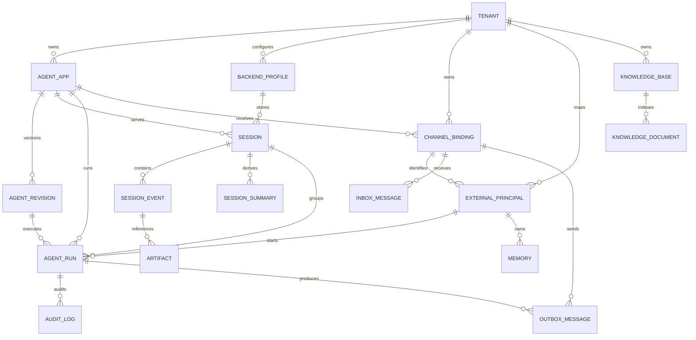

# 数据模型设计

本文描述逻辑数据模型及当前数据层。企微与飞书的静态 Binding、单聊键和 PostgreSQL Inbox/Run/Outbox 由公共消费者使用，见[IM 接入](im-channels.md)。动态 Binding 表、群聊、Memory/Summary 和完整 Audit/OTel 仍为设计。

## 1. 建模原则

- `tenant_id` 是所有平台数据的强制分区键。任何查询都不能只依赖资源 ID 而省略租户条件。
- 外部 IM 标识先映射为平台内部 ID，避免 PII 进入主键、缓存键、指标标签和对象路径。
- Agent App 是稳定身份，Agent Revision 是不可变运行快照；Session 归属 App，Run 记录实际 Revision。
- Session Event 是事实记录，Summary、Memory、成本统计和检索索引都是可重建的派生数据。
- 配置表保存 `secret_ref`，不保存模型 API Key、IM Secret 和数据库密码的明文。
- 模型描述的是逻辑实体。Session、Memory 等实际表结构可由 tRPC-Agent-Go 后端维护，平台通过租户装饰器和目录表保持一致语义。

## 2. 实体关系图



## 3. 核心实体

### 3.1 Tenant

| 字段 | 类型 | 说明 |
| --- | --- | --- |
| `id` | UUID/ULID | 不可变租户 ID |
| `slug` | string | 人类可读且唯一的租户短名 |
| `name` | string | 展示名称 |
| `status` | enum | `active/suspended/deleting` |
| `quota` | JSON | 并发、token、费用、存储配额 |
| `audit_policy` | JSON | 正文保留、脱敏、审计周期 |
| `created_at/updated_at` | timestamp | 管理时间 |

暂停租户时拒绝新 Run，但不删除数据。删除采用异步状态机，先停止入口，再按保留策略清理各后端。

### 3.2 Agent App 与 Revision

`agent_apps` 保存稳定身份和当前路由版本；`agent_revisions` 保存不可变配置：

| 字段 | 说明 |
| --- | --- |
| `agent_apps.id/tenant_id/name` | App 的稳定身份 |
| `agent_apps.routing_version` | 每次发布、灰度或回滚递增 |
| `agent_apps.routing_policy` | Revision 权重、白名单和默认版本 |
| `agent_revisions.id/app_id/revision_no` | 不可变版本标识 |
| `agent_revisions.config` | Prompt、模型参数、Tool/MCP、Skill、Knowledge、Guardrail 引用 |
| `agent_revisions.config_digest` | 规范化配置摘要，用于校验与缓存 |
| `agent_revisions.status` | `draft/validated/published/retired` |
| `agent_revisions.created_by/created_at` | 审计信息 |

Revision 不包含密钥值，只引用 Secret 和 Backend Profile。每个 Run 固定记录 `revision_id`。同一个 Session 默认沿用 `pinned_revision_id`；只有创建新 Session epoch、显式解除 Pin 或紧急安全回滚使 Pin 失效后，后续 Run 才重新选择 Revision。

### 3.3 Backend Profile

`backend_profiles` 保存租户可复用的 Session 存储配置。Profile ID 本身就是版本：同一 `(tenant_id, id)` 永远只对应一份内容，控制面只有 Create/Get/List，没有 Update/Delete。当前通过新 Revision 引用新 Profile 为新 Session 选择后端；生产迁移还需要按 Session 的目录路由，存量 Session 切换后端不改变其 Revision Pin，见[迁移前提](storage-and-consistency.md#71-sessionredis-到-sql)。

| 字段 | 说明 |
| --- | --- |
| `tenant_id/id` | 租户分区键与不可变 Profile 版本 |
| `spec` | Session backend 与命名空间参数；连接信息只保存 `env:VAR_NAME` SecretRef |
| `fingerprint` | 规范化 Profile JSON 的 SHA-256；每次读取重新计算并核验 |
| `created_by/created_at` | 认证后的 Admin Principal 与创建时间 |

每租户最多创建 32 个 Profile，以约束 Router 常驻连接池数量。创建 Profile、创建引用它的 Revision、发布该 Revision以及 Runtime 真正构建存储时，都会按租户检查 Profile 中的 SecretRef；只有最后一步解析环境变量并连接后端。PostgreSQL 表以 `(tenant_id, id)` 为主键并外键引用 `tenants`，内存实现也复用同一 Tenant Repository 作为写入门禁。

### 3.4 Channel Binding 与身份映射

`channel_bindings` 表示一个外部 IM 账号绑定到一个租户 Agent：

| 字段 | 说明 |
| --- | --- |
| `id/tenant_id/agent_app_id` | 所属租户和目标 App |
| `channel_type` | `wecom/feishu/http/...` |
| `transport` | `wecom_bot_ws/feishu_webhook/feishu_ws/...`，明确协议模式 |
| `external_account_id` | 包含平台账号命名空间的全局确定性编码或摘要，不以内部租户加盐，以便跨租户唯一约束识别同一外部账号 |
| `credential_secret_ref` | 长连接 Bot Secret 或应用凭据的服务端引用，不保存明文 |
| `verify_secret_ref/crypto_secret_ref` | 验签和解密密钥引用 |
| `config` | 长度限制、回调模式、限速、群聊策略 |
| `status` | `active/disabled` |

目标 `external_principals` 使用唯一键 `(tenant_id, channel_binding_id, principal_type, external_id_hash)` 映射内部 `principal_id`。当前企微不建此表，直接以 Tenant、Binding、用户类型和外部用户 ID 的规范数组摘要派生 Principal；跨通道身份不自动合并。

外部账号需编码完整平台命名空间；目标唯一约束为 `(channel_type, external_account_id)`，避免跨租户重复绑定。当前企微由服务端静态配置唯一 Tenant/App/Binding/Bot，Secret 仅引用 `env:TRPC_SERVICE_WECOM_BOT_SECRET`，并核对受信任连接上事件的 Bot 标识；已有真实单聊收发。动态 Binding 管理及跨进程账号注册唯一性尚未实现。飞书 Webhook 路径只定位候选凭据，须完成[签名、Token 和应用身份校验](im-channels.md#协议细节与扩展设计)后确定绑定，仍属设计。

### 3.5 Session、Event 与 Summary

平台为每个 Session 保存目录信息，正文由租户选择的 tRPC-Agent-Go Session Backend 持久化：

| 字段 | 说明 |
| --- | --- |
| `sessions.id/tenant_id/agent_app_id` | 平台 Session 身份 |
| `sessions.scope_type` | `direct/group/group_member` |
| `sessions.framework_app_name` | `t/{tenant_id}/a/{agent_app_id}` |
| `sessions.framework_user_id` | 单聊/群内成员模式使用用户身份；共享群模式使用合成群身份 |
| `sessions.framework_session_id` | Tenant/App/Binding + 模式、用户或群/成员、话题、epoch 的摘要，见 [Session 命名](architecture.md#54-session-命名) |
| `sessions.backend_profile_id` | 生产目录路由中的有效 Session 后端，优先于 Revision 的新会话默认配置 |
| `sessions.storage_version` | 生产迁移切换时递增，用于条件更新及拒绝陈旧路由 |
| `sessions.pinned_revision_id` | 灰度期间固定的 Agent Revision；紧急回滚可失效 |
| `sessions.epoch` | `/new` 或空闲切分后的会话世代 |
| `sessions.status` | `active/migrating/archived/deleted` |
| `sessions.last_event_at` | 列表和清理使用，不作为并发正确性依据 |

逻辑上的 `session_events` 至少包含：

| 字段 | 说明 |
| --- | --- |
| `event_id` | 全局唯一事件 ID |
| `tenant_id/session_id` | 强制租户和 Session 归属 |
| `request_id/invocation_id` | Run 与 tRPC-Agent-Go Invocation 关联 |
| `revision_id` | 产生该 Event 的 Agent Revision |
| `sequence_no` | Session 内单调顺序；不支持时由适配层投影 |
| `event_type` | user/model/tool_call/tool_result/state/error 等 |
| `payload` | 上游 Event 序列化结果，按审计策略脱敏或加密 |
| `state_delta` | 与 Event 同步提交的状态变化 |
| `sender_principal_id` | 群聊中的实际发言人 |
| `created_at` | 事件时间 |

`session_summaries` 使用唯一键 `(tenant_id, session_id, filter_key, source_end_sequence, summary_version)`，其中 `source_end_sequence` 表示 Summary 覆盖到哪个 Event，防止旧任务覆盖新结果。

以上 `backend_profile_id/storage_version/status` 迁移路由以及 epoch 换代均为目标目录字段，当前目录只提供既有 Pin 契约。`sequence_no` 是平台按稳定 `event_id` 和已确认提交顺序建立的幂等投影，不假定上游所有后端都有该列；无法确定顺序或来源边界时，不覆盖已有 Summary，也不据此自动重建执行结果。

当前企微只使用 `direct`，`thread_id=""`、epoch 固定 `0`；真实 PostgreSQL Session、Pin 和配置 Repository 已通过全部 Runtime/Session 对象重建后历史与 Pin 保留的测试。群聊、epoch 换代及 Summary 表不属于当前实现。

### 3.6 Memory、Knowledge 与 Artifact

- `memories`：记录 `tenant_id`、`agent_app_id`、`subject_type`、`subject_id`、正文/引用、提取来源、版本、向量引用、保留时间和状态。单聊通常以用户为 subject；群聊默认只写群共享 Memory，不读取个人私密 Memory。
- `knowledge_bases`：保存租户、名称、Embedding 配置、Vector Backend、索引版本和状态。
- `knowledge_documents`：保存源文件、内容摘要、解析版本、Embedding 版本、索引状态和 Artifact 引用。向量库只保存 chunk 和向量，源文档仍可用于重建索引。
- `artifacts`：保存租户、对象键、内容类型、大小、摘要、加密/扫描状态、保留时间和访问策略。对象键必须以租户 ID 分区。
- `derived_jobs`：生产后台的 Memory/Summary 派生任务，保存租户、任务类型、源 Event/Run、来源边界、处理器版本、状态及重试进度。它不是 IM 回复 Outbox，也不要求 Channel Binding；完成 Run 的补扫负责修复任务未登记的窗口。

### 3.7 Inbox、Run、Outbox 与 Audit

`inbox_messages` 对入站消息建立持久幂等：

```text
UNIQUE (tenant_id, channel_binding_id, external_event_id)
```

`agent_runs` 保存 `request_id`、Session、Revision、同 Session 的 `accept_sequence`、状态、attempt/最大尝试数、`claim_token`、`next_attempt_at`、执行 deadline、恢复宽限、`last_dispatched_at`、开始/结束时间、错误类型和 Worker。token、cost、`trace_id` 是目标设计字段，当前未实现完整采集；实际表结构以迁移为准。执行时长与恢复宽限以整毫秒固化；`output_parts` 必须等于同一终态事务写入的 Outbox part 数量。状态只允许按定义的状态机前进：

```text
accepted → running → succeeded | failed
        ↑      |
        +------+  未启动时 Yield，或恢复扫描器在 recover_after 后重置
```

每次 `accepted -> running` 都原子递增 attempt 并生成新的 `claim_token`；终态和 Outbox 在同一事务内以该 token 做 CAS。`failed` 的 `error_type` 可表达取消、Tool 结果未知或永久执行错误，不增加会破坏最小状态机的旁路状态。

当前 PostgreSQL 实表为 `channel_inbox_messages`、`channel_agent_runs` 和 `channel_outbox_messages`，迁移见 [`channels/postgres/migrate.go`](../trpcservice/channels/postgres/migrate.go)。企微按 msgid 持久去重，以 `first_execution_started_at` 区分从未启动与已启动未知任务；后者即使重新 claim 也只落失败，不再次进入 Runner。公共 Consumer 在可信 Tenant/Binding 范围内恢复；未知执行不自动重放。

`outbox_messages` 使用 `UNIQUE (tenant_id, channel_binding_id, idempotency_key)`，记录可恢复的版本化投递目标、消息片段、稳定 `client_message_id`、尝试次数/最大尝试数、`send_token`、发送 deadline、下次重试时间、`duplicate_risk` 和投递结果。目标包含重发所需的真实外部引用，按敏感数据保护，不能只保存不可逆哈希。

当前企微最多写入一个最终文本 Outbox，发送最多尝试一次；版本化目标含 Tenant/Binding、连接 generation、req_id 和 stream_id，持久保存不代表跨连接仍有效。旧连接目标记失败，未知回执保留 `duplicate_risk` 并停止发送；明确 `errcode=0` 才记 sent，不表示用户已读。媒体、卡片、增量流及跨连接补发未实现。

`audit_logs` 采用追加写模型，字段定义如下：

| 字段 | 说明 |
| --- | --- |
| `tenant_id` | 租户 |
| `channel` | 消息来源通道 |
| `user_id` | 内部 Principal；外部 ID 仅保存受控哈希 |
| `session_id` | 平台 Session |
| `agent_name/revision_id` | Agent 与版本 |
| `tool_name` | Tool/MCP 名称，可为空 |
| `decision` | allow/deny/approve/redact/limit 等 |
| `latency_ms` | 对应阶段耗时 |
| `error_type` | 稳定错误分类，不写敏感错误正文 |
| `cost` | 本次模型或 Tool 成本 |
| `trace_id/request_id` | 技术与业务关联标识 |
| `metadata` | 脱敏后的附加信息 |
| `created_at` | 发生时间 |

## 4. PostgreSQL 参考约束

下面展示关键约束，而不是替代上游 Session Backend 的完整建表脚本：

```sql
CREATE UNIQUE INDEX uq_agent_revision_no
    ON agent_revisions (tenant_id, agent_app_id, revision_no);

ALTER TABLE backend_profiles
    ADD CONSTRAINT backend_profiles_pkey PRIMARY KEY (tenant_id, id);

CREATE UNIQUE INDEX uq_channel_external_account
    ON channel_bindings (channel_type, external_account_id);

CREATE UNIQUE INDEX uq_inbox_external_event
    ON inbox_messages (tenant_id, channel_binding_id, external_event_id);

CREATE UNIQUE INDEX uq_outbox_idempotency
    ON outbox_messages (tenant_id, channel_binding_id, idempotency_key);

CREATE UNIQUE INDEX uq_session_framework_key
    ON sessions (
        tenant_id,
        framework_app_name,
        framework_user_id,
        framework_session_id
    );

CREATE INDEX ix_audit_tenant_time
    ON audit_logs (tenant_id, created_at DESC);
```

平台数据访问显式携带租户作用域。生产部署建议额外启用 PostgreSQL Row-Level Security 作为纵深防御；当前参考实现未启用 RLS，实际隔离由 Repository 租户条件、键空间和测试保证，不能把 RLS 当作当前已实现能力。

## 5. 群聊策略

Channel Binding 明确配置以下一种模式：

| 模式 | Session 范围 | 适用场景 |
| --- | --- | --- |
| `group` | 整个群/话题共享 Session | 群助手，需要理解群内连续讨论 |
| `group_member` | 群内每个成员独立 Session | 需要分别保留成员上下文的助手；回复仍发到群中，不能据此开放私密数据 |

无论哪种模式，Tool 授权都使用实际 `sender_principal_id`，不能因为 Session 使用合成群身份而跳过个人权限校验。不同 Tenant、Channel Binding、Group 和 Topic 始终生成不同键。

三种模式的键公式及编码见 [Session 命名](architecture.md#54-session-命名)。共享群不把成员 ID 放入 Session 摘要；`group_member` 必须同时包含群 ID 和成员 Principal，避免同一成员跨群串会话。两种群聊模式均为设计，首条企微文本演示只接单聊。

## 6. 数据生命周期

- 配置与 Revision：Revision 长期保留；删除 App 时先下线，按审计策略延迟清理。
- Session/Event：按租户策略设置 TTL 或归档；读取不延长 TTL，写入才更新活跃时间。
- Summary/索引：派生数据，可重建；源 Event/Document 未到保留期前不先删除。
- Memory：支持用户删除和租户保留策略，删除需同步清理正文与向量引用。
- Artifact：对象存储生命周期规则与平台元数据一致，后台任务处理孤儿对象。
- Audit：使用独立保留周期和只追加权限，业务管理员不能修改历史记录。
