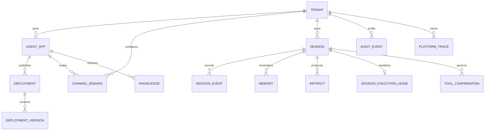

# 数据模型设计

## 所有权与主键

所有业务对象都直接或间接归属于 Tenant。除平台级 Provider Account 外，存储查询不得只用自然 ID；推荐主键或唯一键必须包含 `tenant_id`。客户端提交的 `tenant_id` 不参与授权，Gateway 从身份会话得到 Tenant Context 后写入查询条件。

| 实体 | 主键/唯一键 | 关键字段 | 关系与约束 |
| --- | --- | --- | --- |
| Tenant | `tenant_id` | name, `audit_policy` (`retention_days`, `content_mode`, `high_risk_failure_mode`) | 隔离根；默认 90 天、metadata_only、fail_closed |
| Agent App | `(tenant_id, app_id)` | name | Tenant 1:N App |
| Deployment | `(tenant_id, deployment_id)` | app_id, status, current/target/previous_version_id, gray_percentage | 同一 App 只有一个 Active Deployment |
| Deployment Version | `(tenant_id, deployment_id, number)`，租户内唯一 `version_id` | provider_profile, model, prompt, generation_config | 发布后不可变，不含凭据；运行时必须使用 `(tenant_id, version_id)` |
| Backend Selection | `(tenant_id, data_kind)` | adapter_id, server_owned_config_ref | 客户端只能选择服务端目录中的 adapter |
| Channel Binding | `(tenant_id, binding_id)` | app_id, provider, account, external_subject, session_id, enabled | 外部主体映射到 Tenant/App |
| Provider Route | `(provider, provider_account, external_subject)` | tenant_id, app_id, conversation_type, enabled | 平台 Bot 账号下的外部主体唯一归属一个 Tenant/App |
| Session | `(tenant_id, session_id)` | app_id, user_id | 由事件流物化 |
| Session Event | `(tenant_id, session_id, sequence)` | event_id, idempotency_key, type, payload, fencing_token, occurred_at | sequence 连续；幂等 key 唯一；事实源 |
| Projection Checkpoint | `(tenant_id, session_id, projection)` | last_sequence, updated_at | 只能从 N 推进到 N+1 |
| Session State | `(tenant_id, session_id)` | projection_sequence, summary, updated_at | Session Event 的可重建投影 |
| Memory | `(tenant_id, session_id, memory_key)` | value, updated_at, fencing_token | 权威值先提交；成功执行更新 `latest_agent_reply` |
| Knowledge | `(tenant_id, knowledge_id)` | app_id, source, content_ref/content, index_status | 索引为派生状态 |
| Artifact | `(tenant_id, artifact_id)` | session_id, request_id, trace_id, content_reference, status | 内容与元数据分离 |
| Audit Event | `(tenant_id, audit_id)` | channel, user_id, session_id, agent_name, tool_name, decision, latency, error_type, cost, trace_id, content | 按 Tenant Audit Policy 保留与脱敏的追加记录 |
| Platform Trace | `(tenant_id, trace_id)` | request_id, session_id, app_id, spans | 跨组件关联 |
| Session Execution Lease | `(tenant_id, session_id)` | owner_id, fencing_token, expires_at | 每次授予 token 单调增加 |
| Run Execution | `(tenant_id, session_id, request_id)` | input_hash, enqueue_order, owner_id, fencing_token, state, lease_expires_at, cancel_requested_at, terminal_type | 共享 Run Coordinator 的幂等、排队、取消和终态事实源 |
| Tool Confirmation | `(tenant_id, confirmation_id)` | request_id, tool_name, argument_summary, policy_revision, status | 副作用治理状态机 |

## 关系



## Session、投影与 fencing

Session Event 的 `(tenant_id, session_id, idempotency_key)` 唯一。相同 key 与相同 type/payload 重试返回原结果；相同 key 携带不同内容返回冲突。append 在事务内读取当前最大 sequence 并写入下一条。持有 PostgreSQL Session Execution Lease 的 Gateway 把 fencing token 附在执行相关写入；数据库在同一事务内确认 token 等于该 Session 当前最高 token 后才插入事件。租约过期允许当前 token 完成有界收尾，但一旦新 owner 获得更高 token，旧 token 立即返回 `stale_fencing_token`，不能更改事件、Memory、Artifact、State、Summary 或执行终态。每次授予另写一条 token 唯一的 `session.lease.acquired`，新 owner 用当前 token 为遗留的未终结请求写入 `run.cancelled`。

`SessionState.projection_sequence` 是参考实现的 Projection Checkpoint。物化器严格按 sequence 读取，遇到缺口立即失败，不跳到后续事件。Summary 只在已连续处理的事件上更新；删除派生 State 或 Summary 后，可以从 Session Event 重新构建。

成功的 Agent 执行在发出 IM 回复前，将经过输出治理的最终回复写入 Memory 的 `latest_agent_reply` 稳定键。该记录携带本次 Session Execution Lease 的 fencing token；Memory 持久化失败时记录 `memory.write.failed`，并禁止写入成功终态或发送成功回复。参考实现不从模型自由文本自动抽取任意长期事实，避免把未验证内容当作用户画像。

## 执行与 Tool 状态

一次执行由 `(tenant_id, session_id, request_id)` 标识，并固定 Deployment Version、Policy Revision、trace_id、traceparent 与 fencing token。Run Coordinator 的 `Run Execution` 记录允许同一 Session 排队但只保留一个 running owner；相同 request 的不同输入返回 `idempotency_key_reused`，已有终态直接返回而不再次调用 Runner/Tool。公开事件终态只能有一个：`run.completed`、`run.failed` 或 `run.cancelled`。恢复逻辑先检查事实源中的 input、started 和终态，再决定返回已有结果还是继续未开始的部分。

危险 Tool 状态转换为：

```text
pending_confirmation -> approved -> executing -> completed
                     \-> rejected              \-> failed
                                                \-> outcome_unknown
```

只有 approved 可以原子消费为 executing；重复审批保持幂等，rejected/expired 不可执行。服务重启时遗留 executing 变为 outcome_unknown，因为平台无法证明外部副作用是否发生。outcome_unknown 不自动回到 approved 或 pending。

## Knowledge 与 Artifact 状态

Knowledge 的 SQL 元数据和权威文本先成功提交，再创建向量索引任务。`index_status` 至少区分 authoritative/pending、indexed、retry_pending 和 failed；checkpoint 记录最后已索引版本，重试按 knowledge_id 幂等覆盖派生索引。索引失败不删除权威记录。

Artifact 推荐使用 `pending_content -> content_written -> published`，异常进入 `publication_failed` 并由 request_id/trace_id 对账。当前参考实现保存 SQL/InMemory 元数据，并用 `session-event://...` 引用已持久化的完成消息；S3 适配器应增加 object version、checksum 和临时对象回收字段。

## 核心事件 JSON Schema

以下 Schema 描述公开 Session Event 的持久化形状。`payload` 的业务结构由 `type` 决定；数据库内部保存为二进制 JSON，HTTP 返回时仍保持 JSON 对象语义。

```json
{
  "$schema": "https://json-schema.org/draft/2020-12/schema",
  "$id": "https://github.com/GodBlf/trpc-agent-service/schemas/session-event.json",
  "title": "SessionEvent",
  "type": "object",
  "additionalProperties": false,
  "required": [
    "id", "tenant_id", "session_id", "sequence",
    "idempotency_key", "type", "payload", "occurred_at"
  ],
  "properties": {
    "id": {"type": "string", "minLength": 1},
    "tenant_id": {"type": "string", "minLength": 1},
    "session_id": {"type": "string", "minLength": 1},
    "sequence": {"type": "integer", "minimum": 1},
    "idempotency_key": {"type": "string", "minLength": 1},
    "type": {
      "type": "string",
      "pattern": "^[a-z][a-z0-9_]*(\\.[a-z][a-z0-9_]*)+$"
    },
    "payload": {
      "type": "string",
      "contentEncoding": "base64",
      "description": "Go []byte 的 JSON 表示；解码后的内容由事件 type 定义"
    },
    "occurred_at": {"type": "string", "format": "date-time"},
    "fencing_token": {"type": "integer", "minimum": 0}
  }
}
```

数据库至少落实以下约束：`session_events` 以 `(tenant_id, session_id, sequence)` 为主键，并对 `(tenant_id, session_id, idempotency_key)` 建唯一约束；`session_memory` 以 `(tenant_id, session_id, memory_key)` 为主键；`artifacts`、`knowledge_records`、`session_execution_leases` 和 `run_executions` 的主键均包含 `tenant_id`；`run_executions` 对 `(tenant_id, session_id)` 仅允许一个未过期 running owner。Audit Policy 只接受 1-3650 天、metadata_only/redacted_summary 和 fail_closed，原始凭据与 Tool 参数不进入 Audit Event。`control-migrate` 将 Control Plane schema 升级到版本 2。这些约束保证自然 ID 重名时仍不能跨 Tenant 覆盖数据。

## 与实现的对应关系

| 模型范围 | Go 类型或端口 | 持久化实现 |
| --- | --- | --- |
| Tenant、App、Deployment、Version | `Tenant`、`AgentApp`、`Deployment`、`DeploymentVersion` | `control_plane.go` 的 SQLite/PostgreSQL Control Plane |
| Session Event | `SessionEvent`、`StorageAdapter`、`SessionStore` | `storage.go`、`sql_store.go`、`redis_store.go` |
| Session State / Summary | `SessionState`、`materializeSession` | 从连续 Session Event 投影，可删除重建 |
| Memory | `MemoryRecord`、`MemoryStore` | InMemory、Redis、SQLite、PostgreSQL |
| Knowledge / Artifact | `KnowledgeRecord`、`Artifact`、对应 Store 接口 | `rich_storage.go` 与 SQL 元数据表 |
| Lease / fencing | `SessionExecutionLease`、`SessionLeaseManager` | PostgreSQL `session_execution_leases` |
| Tool / Audit / Trace | `ToolConfirmation`、`AuditEvent`、`PlatformTrace` | `governance.go` 及管理 API |

表名和 Go 符号属于内部实现，可以随迁移演进；Tenant 隔离、事件幂等、sequence 连续、唯一终态和 fencing 拒绝则是必须保持的行为约束。同步、重试和迁移过程见[数据同步与幂等策略](data-sync-idempotency.md)。
