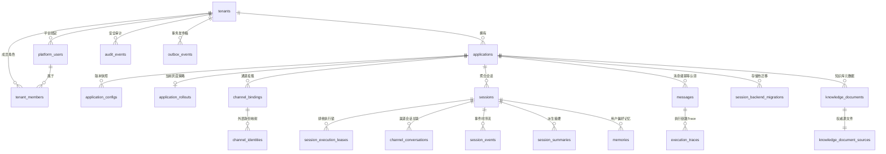

# tRPC Agent Service 数据模型设计文档

本文档系统阐述平台的核心领域数据模型、实体依赖关系与数据字典规范。生产数据库完整表结构及索引定义参见数据库迁移管理；应用快照与平台策略校验以 `trpcservice/config` 模块定义的强类型契约与平台验证器（`PlatformPolicyValidator`）为准。

## 1. 领域实体关系图 (ER Diagram)

平台数据模型围绕**租户实体（Tenant）**、**应用资产（Application）**、**渠道连接（Channel）**、**会话运行（Session & Execution）** 与 **出站交付（Outbox）** 展开，其核心实体关系如下：



---

## 2. 核心关系表结构设计 (PostgreSQL DDL)

### 2.1 租户与成员身份体系

```sql
-- 租户控制实体
CREATE TABLE tenants (
    id TEXT PRIMARY KEY,
    display_name TEXT NOT NULL DEFAULT '',
    status TEXT NOT NULL DEFAULT 'active' CHECK (status IN ('active', 'suspended')),
    created_at TIMESTAMPTZ NOT NULL DEFAULT NOW(),
    updated_at TIMESTAMPTZ NOT NULL DEFAULT NOW()
);

-- 平台全局用户表
CREATE TABLE platform_users (
    platform_user_id TEXT PRIMARY KEY,
    display_name TEXT NOT NULL DEFAULT '',
    email TEXT NOT NULL DEFAULT '',
    status TEXT NOT NULL DEFAULT 'active' CHECK (status IN ('active', 'suspended')),
    first_seen_at TIMESTAMPTZ NOT NULL DEFAULT NOW(),
    last_login_at TIMESTAMPTZ NOT NULL DEFAULT NOW(),
    updated_at TIMESTAMPTZ NOT NULL DEFAULT NOW()
);

-- 租户成员关联与角色权限
CREATE TABLE tenant_members (
    tenant_id TEXT NOT NULL REFERENCES tenants(id) ON DELETE CASCADE,
    platform_user_id TEXT NOT NULL REFERENCES platform_users(platform_user_id) ON DELETE CASCADE,
    role TEXT NOT NULL CHECK (role IN ('admin', 'member')),
    status TEXT NOT NULL DEFAULT 'active' CHECK (status IN ('active', 'suspended')),
    conversation_content_audit BOOLEAN NOT NULL DEFAULT FALSE,
    created_at TIMESTAMPTZ NOT NULL DEFAULT NOW(),
    updated_at TIMESTAMPTZ NOT NULL DEFAULT NOW(),
    PRIMARY KEY (tenant_id, platform_user_id)
);
CREATE INDEX idx_tenant_members_user ON tenant_members (platform_user_id, status, tenant_id);
```

### 2.2 应用资产与版本化配置

```sql
-- 租户应用实体
CREATE TABLE applications (
    tenant_id TEXT NOT NULL REFERENCES tenants(id) ON DELETE CASCADE,
    app_code TEXT NOT NULL,
    status TEXT NOT NULL CHECK (status IN ('draft', 'active', 'disabled')),
    active_config_version BIGINT,
    candidate_config_version BIGINT,
    rollout_generation BIGINT NOT NULL DEFAULT 0 CHECK (rollout_generation >= 0),
    created_at TIMESTAMPTZ NOT NULL DEFAULT NOW(),
    updated_at TIMESTAMPTZ NOT NULL DEFAULT NOW(),
    PRIMARY KEY (tenant_id, app_code),
    CHECK (active_config_version IS NULL OR active_config_version > 0),
    CHECK (candidate_config_version IS NULL OR candidate_config_version > 0),
    CHECK (candidate_config_version IS NULL OR candidate_config_version <> active_config_version)
);

-- 不可变应用配置快照
CREATE TABLE application_configs (
    tenant_id TEXT NOT NULL,
    app_code TEXT NOT NULL,
    version BIGINT NOT NULL CHECK (version > 0),
    config_json JSONB NOT NULL,
    checksum CHAR(64) NOT NULL,
    published_at TIMESTAMPTZ NOT NULL DEFAULT NOW(),
    PRIMARY KEY (tenant_id, app_code, version),
    FOREIGN KEY (tenant_id, app_code) REFERENCES applications(tenant_id, app_code) ON DELETE CASCADE,
    UNIQUE (tenant_id, app_code, checksum)
);

-- 当前灰度策略；同一应用同一时刻最多一条
CREATE TABLE application_rollouts (
    tenant_id TEXT NOT NULL,
    app_code TEXT NOT NULL,
    generation BIGINT NOT NULL CHECK (generation > 0),
    stable_version BIGINT NOT NULL CHECK (stable_version > 0),
    candidate_version BIGINT NOT NULL CHECK (candidate_version > 0),
    basis_points INTEGER NOT NULL CHECK (basis_points BETWEEN 0 AND 10000),
    test_user_ids JSONB NOT NULL DEFAULT '[]'::jsonb,
    ingresses JSONB NOT NULL DEFAULT '[]'::jsonb,
    updated_at TIMESTAMPTZ NOT NULL DEFAULT NOW(),
    PRIMARY KEY (tenant_id, app_code)
);
```

### 2.3 渠道绑定与身份映射

```sql
-- 渠道接入绑定配置 (如企业微信自建应用/机器人)
CREATE TABLE channel_bindings (
    channel_type TEXT NOT NULL CHECK (channel_type IN ('telegram', 'wecom', 'feishu')),
    external_binding_id TEXT NOT NULL,
    tenant_id TEXT NOT NULL,
    app_code TEXT NOT NULL,
    trusted_enterprise_id TEXT NOT NULL DEFAULT '',
    access_policy TEXT NOT NULL DEFAULT 'member_only' CHECK (access_policy IN ('member_only', 'allowlist', 'public')),
    allowlist JSONB NOT NULL DEFAULT '[]'::jsonb CHECK (jsonb_typeof(allowlist) = 'array'),
    created_at TIMESTAMPTZ NOT NULL DEFAULT NOW(),
    updated_at TIMESTAMPTZ NOT NULL DEFAULT NOW(),
    PRIMARY KEY (channel_type, external_binding_id),
    FOREIGN KEY (tenant_id, app_code) REFERENCES applications(tenant_id, app_code) ON DELETE CASCADE
);
CREATE INDEX idx_channel_bindings_application ON channel_bindings (tenant_id, app_code);

-- 渠道外部身份与平台账户绑定
CREATE TABLE channel_identities (
    tenant_id TEXT NOT NULL REFERENCES tenants(id) ON DELETE CASCADE,
    channel_type TEXT NOT NULL CHECK (channel_type IN ('telegram', 'wecom', 'feishu')),
    binding_id TEXT NOT NULL,
    external_user_id TEXT NOT NULL,
    platform_user_id TEXT REFERENCES platform_users(platform_user_id) ON DELETE SET NULL,
    created_at TIMESTAMPTZ NOT NULL DEFAULT NOW(),
    linked_at TIMESTAMPTZ,
    PRIMARY KEY (tenant_id, channel_type, binding_id, external_user_id),
    FOREIGN KEY (channel_type, binding_id) REFERENCES channel_bindings(channel_type, external_binding_id) ON DELETE CASCADE
);
CREATE INDEX idx_channel_identities_user ON channel_identities (tenant_id, platform_user_id, channel_type, binding_id);
```

### 2.4 会话聚合与执行并发锁

```sql
-- 会话聚合元数据表
CREATE TABLE sessions (
    tenant_id TEXT NOT NULL REFERENCES tenants(id) ON DELETE CASCADE,
    app_code TEXT NOT NULL,
    session_key TEXT NOT NULL,
    last_message_id TEXT NOT NULL,
    revision BIGINT NOT NULL DEFAULT 0 CHECK (revision >= 0),
    subject_id TEXT NOT NULL DEFAULT '',
    owner_platform_user_id TEXT REFERENCES platform_users(platform_user_id) ON DELETE SET NULL,
    status TEXT NOT NULL DEFAULT 'active' CHECK (status IN ('active', 'archived')),
    archived_at TIMESTAMPTZ,
    created_at TIMESTAMPTZ NOT NULL DEFAULT NOW(),
    updated_at TIMESTAMPTZ NOT NULL DEFAULT NOW(),
    PRIMARY KEY (tenant_id, session_key),
    FOREIGN KEY (tenant_id, app_code) REFERENCES applications(tenant_id, app_code) ON DELETE CASCADE
);
CREATE INDEX idx_sessions_idle_active ON sessions (updated_at) WHERE status = 'active';

-- 会话执行分布式排他租约 (防脑裂与并发交错)
CREATE TABLE session_execution_leases (
    tenant_id TEXT NOT NULL REFERENCES tenants(id) ON DELETE CASCADE,
    session_key TEXT NOT NULL,
    owner_id TEXT NOT NULL,
    fencing_token BIGINT NOT NULL CHECK (fencing_token > 0),
    lease_until TIMESTAMPTZ NOT NULL,
    updated_at TIMESTAMPTZ NOT NULL DEFAULT NOW(),
    PRIMARY KEY (tenant_id, session_key)
);
CREATE INDEX idx_session_execution_leases_expiry ON session_execution_leases (lease_until);
```

### 2.5 消息去重、执行认领与发件箱

```sql
-- 消息入站去重与认领状态机
CREATE TABLE messages (
    tenant_id TEXT NOT NULL REFERENCES tenants(id) ON DELETE CASCADE,
    app_code TEXT NOT NULL,
    channel_type TEXT NOT NULL CHECK (channel_type IN ('telegram', 'wecom', 'feishu', 'web')),
    binding_id TEXT NOT NULL CHECK (btrim(binding_id) <> ''),
    message_id TEXT NOT NULL,
    status TEXT NOT NULL CHECK (status IN ('processing', 'completed', 'failed')),
    trace_id TEXT NOT NULL,
    created_at TIMESTAMPTZ NOT NULL DEFAULT NOW(),
    updated_at TIMESTAMPTZ NOT NULL DEFAULT NOW(),
    PRIMARY KEY (tenant_id, channel_type, binding_id, message_id),
    FOREIGN KEY (tenant_id, app_code) REFERENCES applications(tenant_id, app_code) ON DELETE CASCADE
);
CREATE INDEX idx_messages_tenant_updated ON messages (tenant_id, updated_at DESC, message_id);

-- 事务性可靠发件箱 (Transactional Outbox)
CREATE TABLE outbox_events (
    id TEXT PRIMARY KEY,
    request_id TEXT NOT NULL DEFAULT '',
    tenant_id TEXT NOT NULL REFERENCES tenants(id) ON DELETE CASCADE,
    aggregate_key TEXT NOT NULL,
    event_type TEXT NOT NULL,
    payload JSONB NOT NULL,
    available_at TIMESTAMPTZ NOT NULL DEFAULT NOW(),
    delivered_at TIMESTAMPTZ,
    delivery_owner TEXT,
    lease_expires_at TIMESTAMPTZ,
    delivery_receipt TEXT NOT NULL DEFAULT '',
    delivery_attempts INTEGER NOT NULL DEFAULT 0 CHECK (delivery_attempts >= 0),
    last_delivery_error TEXT NOT NULL DEFAULT '',
    created_at TIMESTAMPTZ NOT NULL DEFAULT NOW()
);
CREATE UNIQUE INDEX idx_outbox_events_tenant_request ON outbox_events (tenant_id, request_id) WHERE request_id <> '';
CREATE INDEX idx_outbox_events_dispatch_lease ON outbox_events (tenant_id, available_at, lease_expires_at, created_at) WHERE delivered_at IS NULL;

-- 内容脱敏的审计日志。原始消息、Prompt、Tool 参数和密钥不进入该表。
CREATE TABLE audit_events (
    id TEXT PRIMARY KEY,
    tenant_id TEXT NOT NULL REFERENCES tenants(id),
    trace_id TEXT NOT NULL,
    request_id TEXT NOT NULL DEFAULT '',
    channel TEXT NOT NULL DEFAULT '',
    user_id TEXT NOT NULL DEFAULT '',
    session_id TEXT NOT NULL DEFAULT '',
    agent_name TEXT NOT NULL DEFAULT '',
    tool_name TEXT NOT NULL DEFAULT '',
    action TEXT NOT NULL,
    result TEXT NOT NULL,
    decision TEXT NOT NULL DEFAULT '',
    latency_ms BIGINT NOT NULL DEFAULT 0,
    error_type TEXT NOT NULL DEFAULT '',
    cost_micros BIGINT NOT NULL DEFAULT 0,
    redacted_detail TEXT NOT NULL DEFAULT '',
    created_at TIMESTAMPTZ NOT NULL DEFAULT NOW()
);
CREATE INDEX idx_audit_events_tenant_trace ON audit_events (tenant_id, trace_id, created_at);
```

### 2.6 运行时会话事件与长期记忆（开启行级安全 RLS）

```sql
-- 会话事件流 (会话历史详情)
CREATE TABLE session_events (
    id BIGSERIAL PRIMARY KEY,
    app_name VARCHAR(255) NOT NULL,
    user_id VARCHAR(255) NOT NULL,
    session_id VARCHAR(255) NOT NULL,
    event JSONB NOT NULL,
    created_at TIMESTAMPTZ NOT NULL DEFAULT CURRENT_TIMESTAMP,
    updated_at TIMESTAMPTZ NOT NULL DEFAULT CURRENT_TIMESTAMP,
    expires_at TIMESTAMPTZ DEFAULT NULL,
    deleted_at TIMESTAMPTZ DEFAULT NULL
);
CREATE INDEX idx_session_events_lookup ON session_events (app_name, user_id, session_id, created_at);

-- 用户长期记忆事实表
CREATE TABLE memories (
    memory_id TEXT PRIMARY KEY,
    app_name TEXT NOT NULL,
    user_id TEXT NOT NULL,
    memory_data JSONB NOT NULL,
    created_at TIMESTAMP NOT NULL DEFAULT CURRENT_TIMESTAMP,
    updated_at TIMESTAMP NOT NULL DEFAULT CURRENT_TIMESTAMP,
    deleted_at TIMESTAMP NULL DEFAULT NULL
);
CREATE INDEX idx_memories_app_user ON memories (app_name, user_id);

-- tRPC-Agent-Go Session Summary。Summary 从权威事件派生，迁移时无需双写，
-- 新主后端可以按事件重新生成。
CREATE TABLE session_summaries (
    id BIGSERIAL PRIMARY KEY,
    app_name VARCHAR(255) NOT NULL,
    user_id VARCHAR(255) NOT NULL,
    session_id VARCHAR(255) NOT NULL,
    filter_key VARCHAR(255) NOT NULL DEFAULT '',
    summary JSONB DEFAULT NULL,
    updated_at TIMESTAMPTZ NOT NULL DEFAULT CURRENT_TIMESTAMP,
    expires_at TIMESTAMPTZ DEFAULT NULL,
    deleted_at TIMESTAMPTZ DEFAULT NULL
);

-- 强制行级隔离安全策略 (RLS)
ALTER TABLE session_events ENABLE ROW LEVEL SECURITY;
ALTER TABLE session_events FORCE ROW LEVEL SECURITY;
CREATE POLICY tenant_scope_session_events ON session_events
    USING (app_name = current_setting('app.app_name', true))
    WITH CHECK (app_name = current_setting('app.app_name', true));

ALTER TABLE memories ENABLE ROW LEVEL SECURITY;
ALTER TABLE memories FORCE ROW LEVEL SECURITY;
CREATE POLICY tenant_scope_memories ON memories
    USING (app_name = current_setting('app.app_name', true))
    WITH CHECK (app_name = current_setting('app.app_name', true));
```

---

## 3. 核心 JSON Schema 契约

### 3.1 应用发布快照配置 (`ApplicationConfigSnapshot`)
应用于 `application_configs.config_json`，作为编译后运行时全量不可变配置规范：

```json
{
  "$schema": "http://json-schema.org/draft-07/schema#",
  "title": "ApplicationConfigSnapshot",
  "type": "object",
  "required": [
    "tenant_id",
    "app_code",
    "status",
    "config_version",
    "channels"
  ],
  "properties": {
    "tenant_id": { "type": "string" },
    "app_code": { "type": "string" },
    "status": { "type": "string", "enum": ["draft", "active", "disabled"] },
    "config_version": { "type": "integer", "minimum": 1 },
    "instruction": { "type": "string", "description": "系统提示词设定" },
    "model": {
      "type": "object",
      "required": ["provider_id", "name"],
      "properties": {
        "provider_id": { "type": "string" },
        "name": { "type": "string" },
        "failover_candidates": {
          "type": "array",
          "items": {
            "type": "object",
            "required": ["provider_id", "name"],
            "properties": {
              "provider_id": { "type": "string" },
              "name": { "type": "string" }
            }
          }
        },
        "generation": { "type": "object", "description": "tRPC-Agent-Go model.GenerationConfig" }
      }
    },
    "tools": {
      "type": "object",
      "required": ["allowed"],
      "properties": {
        "allowed": {
          "type": "array",
          "items": { "type": "string" },
          "description": "租户授权生效的工具清单"
        },
        "allowed_roles": { "type": "object" },
        "require_confirmation": { "type": "array", "items": { "type": "string" } },
        "http": { "type": "array", "description": "租户自定义 HTTPS Function Tool" },
        "mcp": { "type": "array", "description": "租户远端 MCP ToolSet" }
      }
    },
    "storage": {
      "type": "object",
      "required": ["session", "memory", "knowledge", "artifact"],
      "properties": {
        "session": { "$ref": "#/definitions/BackendProfileRef" },
        "memory": { "$ref": "#/definitions/BackendProfileRef" },
        "knowledge": { "$ref": "#/definitions/BackendProfileRef" },
        "artifact": { "$ref": "#/definitions/BackendProfileRef" }
      }
    },
    "governance": {
      "type": "object",
      "required": ["max_tool_calls", "budget_units"],
      "properties": {
        "max_tool_calls": { "type": "integer", "minimum": 0, "maximum": 64 },
        "budget_units": { "type": "integer", "minimum": 0 },
        "requests_per_minute": { "type": "integer", "minimum": 0 },
        "max_concurrent_runs": { "type": "integer", "minimum": 0 },
        "token_budget_per_hour": { "type": "integer", "minimum": 0 },
        "token_reservation": { "type": "integer", "minimum": 0 }
      }
    },
    "audit": {
      "type": "object",
      "required": ["retention_days"],
      "properties": {
        "retention_days": { "type": "integer", "minimum": 0 }
      }
    },
    "channels": {
      "type": "array",
      "items": {
        "type": "object",
        "required": ["type", "binding_id"],
        "properties": {
          "type": { "type": "string", "enum": ["wecom", "feishu", "telegram"] },
          "binding_id": { "type": "string" },
          "credential_ref": { "type": "string", "pattern": "^env:" },
          "trusted_enterprise_id": { "type": "string", "description": "仅企业微信可信边界使用" },
          "access_policy": { "type": "string" },
          "allowlist": { "type": "array", "items": { "type": "string" } }
        }
      }
    }
  },
  "definitions": {
    "BackendProfileRef": {
      "type": "object",
      "required": ["profile_id"],
      "properties": {
        "profile_id": { "type": "string" }
      }
    }
  }
}
```

### 3.2 执行链路轨迹快照 (`ExecutionTrace`)
应用于 `execution_traces.projection`，保存 tRPC-Agent-Go Execution Trace 的**内容脱敏投影**。`trace_id` 单独存放在 `execution_traces.trace_id` 物理列中。Projection 遵循最小特权与隐私保护原则，持久化时主动剔除原始 Prompt、工具调用参数、模型明文输出及底层错误堆栈，仅保留结构化执行节点流向与 Token 消耗用量：

```json
{
  "$schema": "http://json-schema.org/draft-07/schema#",
  "title": "ExecutionTraceProjection",
  "type": "object",
  "required": ["status", "started_at", "ended_at", "steps"],
  "properties": {
    "status": { "type": "string", "enum": ["completed", "incomplete", "failed"] },
    "root_agent_name": { "type": "string" },
    "root_invocation_id": { "type": "string" },
    "session_id": { "type": "string" },
    "started_at": { "type": "string", "format": "date-time" },
    "ended_at": { "type": "string", "format": "date-time" },
    "usage": {
      "type": "object",
      "properties": {
        "prompt_tokens": { "type": "integer" },
        "completion_tokens": { "type": "integer" },
        "total_tokens": { "type": "integer" },
        "cached_tokens": { "type": "integer" },
        "cache_creation_tokens": { "type": "integer" },
        "cache_read_tokens": { "type": "integer" },
        "reasoning_tokens": { "type": "integer" }
      }
    },
    "steps": {
      "type": "array",
      "items": {
        "type": "object",
        "required": ["step_id", "started_at", "ended_at"],
        "properties": {
          "step_id": { "type": "string" },
          "invocation_id": { "type": "string" },
          "parent_invocation_id": { "type": "string" },
          "agent_name": { "type": "string" },
          "branch": { "type": "string" },
          "node_id": { "type": "string" },
          "node_type": { "type": "string" },
          "started_at": { "type": "string", "format": "date-time" },
          "ended_at": { "type": "string", "format": "date-time" },
          "predecessor_step_ids": { "type": "array", "items": { "type": "string" } },
          "applied_surface_ids": { "type": "array", "items": { "type": "string" } },
          "failed": { "type": "boolean" },
          "usage": { "type": "object" }
        }
      }
    }
  }
}
```

### 3.3 事务发件箱载荷 (`OutboxPayload`)
应用于 `outbox_events.payload`，由 Worker 在业务事务内生成并提供给 `ChannelOutboxDispatcher`：

```json
{
  "$schema": "http://json-schema.org/draft-07/schema#",
  "title": "ChannelOutboxPayload",
  "type": "object",
  "required": [
    "channel",
    "binding_id",
    "app_code",
    "conversation_id",
    "conversation_scope",
    "text"
  ],
  "properties": {
    "channel": { "type": "string", "enum": ["wecom", "feishu", "telegram", "web"] },
    "binding_id": { "type": "string" },
    "app_code": { "type": "string" },
    "config_version": { "type": "integer" },
    "conversation_id": { "type": "string" },
    "conversation_scope": { "type": "string", "enum": ["direct", "group"] },
    "provider_reply_token": { "type": "string" },
    "progress_message_id": { "type": "string" },
    "web_owner_id": { "type": "string" },
    "text": { "type": "string" },
    "card": { "type": ["object", "null"] },
    "traceparent": { "type": "string" },
    "artifacts": {
      "type": "array",
      "items": {
        "type": "object",
        "required": ["filename", "version", "user_id", "session_id"],
        "properties": {
          "filename": { "type": "string" },
          "version": { "type": "integer" },
          "name": { "type": "string" },
          "mime_type": { "type": "string" },
          "user_id": { "type": "string" },
          "session_id": { "type": "string" }
        }
      }
    }
  }
}
```
