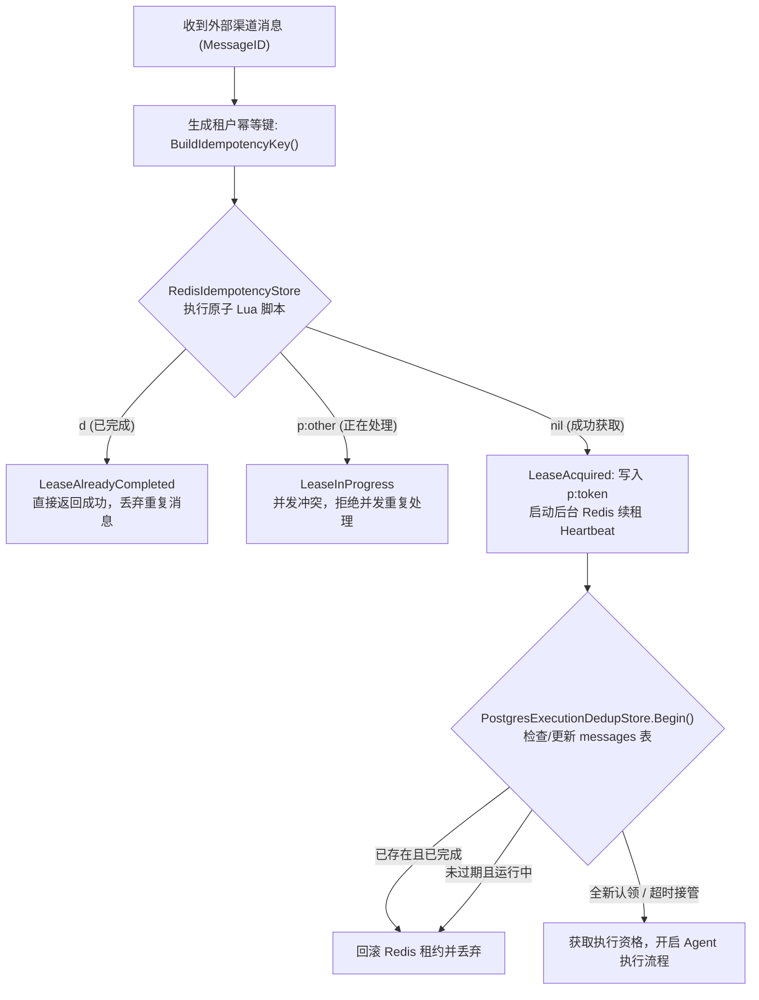
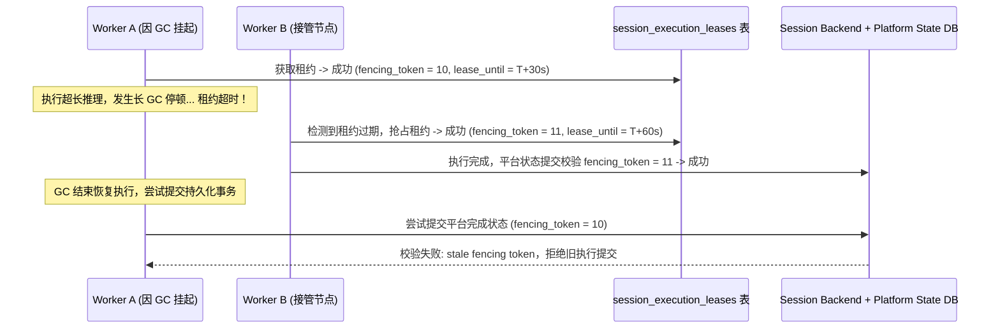
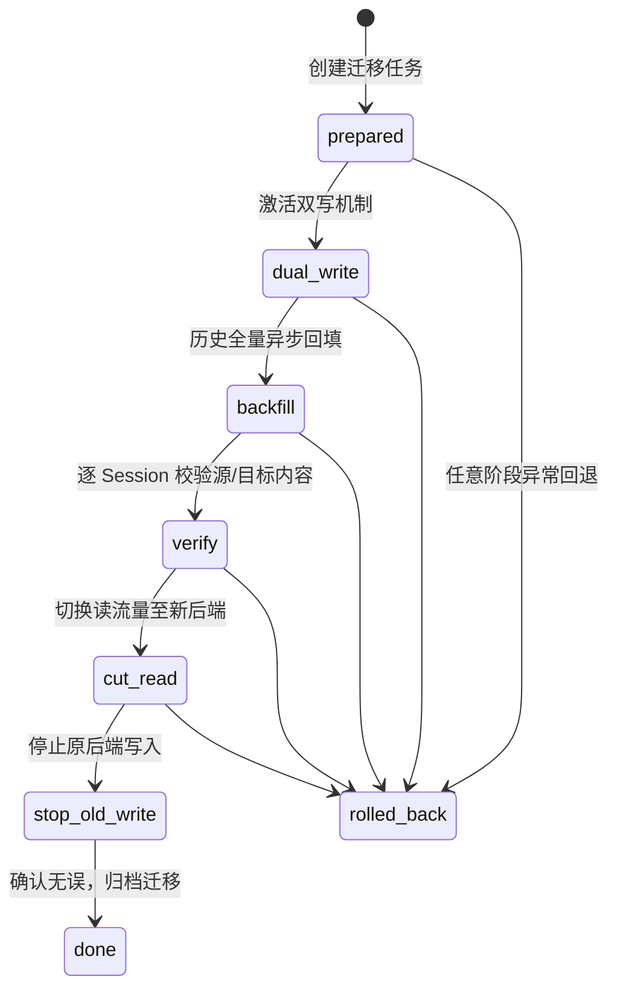

# tRPC Agent Service 数据同步与幂等策略说明

## 1. 设计挑战与设计哲学

在企业级 AI Agent 场景下，系统面临三大核心数据同步与一致性难题：
1. **外部 IM 的重复与重连语义**：WebSocket 重连、Telegram offset 恢复、网络超时后的上游重投以及用户重复点击都可能让同一业务消息再次进入平台，因此不能依赖 Connector “只投一次”；
2. **长耗时推理与并发交错**：大模型推理结合工具调用耗时常在数十秒，在此期间若同一用户或群聊连续提问，若无序并发会导致会话历史分叉与上下文紊乱；
3. **分布式异构系统的可靠交付**：外部通讯平台无法与内部业务数据库建立跨系统两阶段提交（2PC），系统设计聚焦于“业务执行具备确定性幂等、出站结果可靠不丢、重复窗口可观测并最大程度收窄”。

针对上述挑战，平台落地了**“双层幂等认领 + 会话单调租约锁 + 事务性发件箱 + 8阶段热迁移”**的高可靠数据一致性架构。

---

## 2. 双层入站消息去重与幂等体系

平台采用“Redis 内存快路径 + PostgreSQL 持久化底座”的两级协同去重机制：



### 2.1 租户级幂等键生成规范
代码见 `trpcservice/storage/idempotency.go`：
```go
func BuildIdempotencyKey(tenantID string, channel channels.Channel, bindingID, messageID string) (string, error) {
    return "idempotency:" + encodeKeyPart(tenantID) + encodeKeyPart(string(channel)) + 
           encodeKeyPart(bindingID) + encodeKeyPart(messageID), nil
}
```
- 幂等键严格注入 `tenant_id`、`channel`、`binding_id` 和渠道原始 `message_id`；
- 天然实现多租户与多机器人之间的命名空间隔离，防止跨应用 ID 冲突。

### 2.2 Redis 快路径原子状态机 (Lua 脚本)
在 `RedisIdempotencyStore` 中，所有状态变更由 Redis Lua 脚本保证单步原子性：
1. **Acquire（尝试加锁）**：
   ```lua
   local current = redis.call("GET", KEYS[1])
   if not current then
       redis.call("SET", KEYS[1], "p:" .. ARGV[1], "PX", ARGV[2], "NX")
       return 1 -- 1: 成功认领 (LeaseAcquired)
   end
   if current == "d" then
       return 2 -- 2: 已终态完成 (LeaseAlreadyCompleted)
   end
   return 3     -- 3: 其他节点执行中 (LeaseInProgress)
   ```
2. **Heartbeat 续期（Renew）**：
   后台协程按 `processingTTL / 3` 周期性调用 `PEXPIRE` 延期租约，防止长耗时推理导致加锁自然过期被误接管；
3. **Complete（完成置换）**：
   任务完成后，原子地将 `"p:<token>"` 置换为 `"d"`（Done），并使用运行时配置的 completed TTL 保留终态；TTL 内的重复消息直接命中 `LeaseAlreadyCompleted`；
4. **Release（异常释放）**：
   若遇可重试的临时故障（如模型提供商网络抖动），原子调用 `DEL` 移除加锁，允许队列或网关重试。

### 2.3 PostgreSQL 持久化兜底与认领接管
当 Redis 出现主从切换、缓存逐出或宕机时，PostgreSQL `messages` 表充当不可逾越的强一致性底座（代码见 `trpcservice/storage/execution_dedup.go`）：
- `Begin` 逻辑依托单 SQL 原子操作：
  ```sql
  INSERT INTO messages (tenant_id, app_code, channel_type, binding_id, message_id, status, trace_id, created_at, updated_at)
  VALUES ($1, $2, $3, $4, $5, 'processing', $6, NOW(), NOW())
  ON CONFLICT (tenant_id, channel_type, binding_id, message_id) DO UPDATE
  SET status = 'processing', trace_id = EXCLUDED.trace_id, updated_at = NOW()
  WHERE messages.status = 'failed' 
     OR (messages.status = 'processing' AND messages.updated_at <= NOW() - ($7 * INTERVAL '1 millisecond'))
  RETURNING status, trace_id;
  ```
- **超时接管（Takeover）**：若上一个 Worker 在执行中途意外挂死且超过当前 `processingTTL`，新的 Worker 能通过新的 `trace_id` 原子接管执行，避免任务永久卡死。

---

## 3. 会话级排他执行租约与 Fencing Token 防脑裂

同一用户在短时间内连续输入时，必须保证消息串行执行，否则会发生“上一轮会话尚未持久化、下一轮已开始组装上下文”的状态紊乱。



### 3.1 租约获取与单调递增令牌
代码见 `trpcservice/storage/session_execution_lease.go`：
```sql
INSERT INTO session_execution_leases (tenant_id, session_key, owner_id, fencing_token, lease_until, updated_at)
VALUES ($1, $2, $3, 1, NOW() + ($4 * INTERVAL '1 millisecond'), NOW())
ON CONFLICT (tenant_id, session_key) DO UPDATE
SET owner_id = EXCLUDED.owner_id,
    fencing_token = session_execution_leases.fencing_token + 1,
    lease_until = NOW() + ($4 * INTERVAL '1 millisecond'),
    updated_at = NOW()
WHERE session_execution_leases.lease_until <= NOW()
RETURNING fencing_token, lease_until;
```
- 每次租约易手，`fencing_token` 严格加 1；
- 启动 `sessionLeaseHeartbeat` 守护协程，按周期刷新 `lease_until`。

### 3.2 最终提交栅栏防御（Fencing Fence）
平台最终执行状态、审计日志与发件箱持久化时，将强制校验当前持有的 `fencing_token`。若发生网络分区或 GC 停顿导致租约被其他实例抢占，旧 Worker 的落后令牌提交将被数据库直接拒绝。此时系统主动触发执行上下文取消（Context Cancel），中止旧 Worker 后续的所有业务推进，有效杜绝分布式脑裂。

### 3.3 Session Event、State 与 Summary 更新顺序

1. Gateway 先解析 `session_key`，并将其与 `config_version` 固化进消息 Envelope；Worker 不重新根据外部用户身份猜 Session。
2. Runner 从当前租户 Session Service 读取 state、event history 和已有 summary，再执行本轮模型/工具链路。
3. tRPC-Agent-Go 通过 Session Service 追加本轮 event/state；`session_summaries` 是事件的派生结果，不作为事实源。
4. 平台在执行末尾以 Session Lease 的 fencing token 提交 `messages`、脱敏 trace/audit 和 Outbox。
5. Summary 创建/刷新只发生在当前主 Session 后端。在线迁移不会双写 Summary；切换后可从权威 Event 重新生成，避免把派生数据也纳入双写一致性协议。

### 3.4 Memory 跨节点可见性

生产 Worker 不以进程内缓存作为 Memory 事实源。租户选择 PostgreSQL、Redis、Mem0、ChromaDB、TencentDB 等共享 Memory Profile 后，Memory Service 的成功写入即成为其他节点后续请求的可见来源；具体可见延迟由所选后端保证决定。群聊上下文不会自动写入个人长期记忆，避免把多人消息污染为某个用户的事实。

---

## 4. 事务性出站发件箱模式 (Transactional Outbox)

### 4.1 为什么避免在 Worker 内部直接外呼 IM API
1. **网络不可控性**：外呼微信/飞书 API 容易受网络抖动影响；若调用成功后 Worker 自身崩溃，业务事务未提交，将导致“用户收到了消息但数据库无记录”的幽灵事件；
2. **跨系统两阶段提交代价**：外部 IM 平台不支持 2PC 协议；
3. **速率限制与平滑分发**：外部通讯通道普遍具备接口调用频控限制，集中式发件箱可实现平滑削峰与精准节流。

### 4.2 发件箱实现架构
代码见 `trpcservice/messaging/channel_outbox.go` 与 `outbox_events` 表设计：
1. **原子写平台完成状态**：Worker 将平台控制面的执行状态、审计记录与 `outbox_events` 统一在单个 PostgreSQL 事务中提交。底层的 tRPC-Agent-Go Session 与 Memory 则通过独立存储适配器解耦管理，规避复杂的跨异构存储分布式事务：
   ```sql
   INSERT INTO outbox_events (id, request_id, tenant_id, aggregate_key, event_type, payload, available_at)
   VALUES ($1, $2, $3, $4, 'channel_reply.wecom', $5, NOW());
   ```
2. **独立调度器分发（ChannelOutboxDispatcher）**：
   - 使用 `SELECT ... FOR UPDATE SKIP LOCKED` 认领出站事件，赋予 30 秒出站租约（`lease_expires_at`）；
   - 按渠道策略（ChannelDeliveryPolicy）自动处理文本截断（如单条 2048 字符）分片发送；
   - 携带 `provider_reply_token` 或被动响应凭证发起调用。
3. **回执确认与失败重试**：
   - 外部调用成功后，记录 `delivery_receipt` 并标记 `delivered_at = NOW()`；
   - 出站失败会释放投递租约，保留 `last_delivery_error`，并按 `2^(delivery_attempts-1)` 秒退避，最大 300 秒后重新可认领；
   - Kafka Worker 消费失败具备独立 DLQ；Outbox 专职负责出站重试。若外部接口调用成功但本地 Receipt 事务写入前进程意外崩溃，系统在重启后仍会触发补发，从而确保消息绝不丢失的 At-least-once 交付底线。

---

## 5. 跨存储在线会话数据迁移状态机

平台支持租户将底层的会话事件历史（Session Events）从默认 PostgreSQL 迁移至专属 Redis 或其他高性能后端。需要注意的是：**平台的会话元数据与并发租约（`sessions`、`session_execution_leases`）作为核心控制面数据始终保留在 PostgreSQL 中**，热迁移专职负责底层会话历史数据流的平滑换擎。平台为此设计了严格的 8 阶段无缝热迁移状态机（代码见 `trpcservice/storage/session_migration_store.go`）：



### 5.1 8 个阶段流转说明
1. **`prepared`（就绪）**：校验源端与目标端联通性、配置版本及租户凭据有效性；
2. **`dual_write`（双写）**：对所有活动会话同时写入源后端和目标后端。双写失败时以源端为主，记录重试修复日志至 `session_migration_repairs`；
3. **`backfill`（全量异步回填）**：后台 Worker 以固定 Batch 扫描冷数据并复制到目标后端，利用 Checkpoint 断点续传；
4. **`verify`（数据对账校验）**：逐 Session 比对源端与目标端的框架 Session 内容；若存在不一致则进入 `session_migration_repairs` 修复，待修复项清零后才能继续切读；
5. **`cut_read`（切读）**：将控制台与 Agent Worker 的读取流量切换到新后端，写入仍保持双写；
6. **`stop_old_write`（停老写）**：观察切读稳定后，停止向老后端写入，新后端成为单主；
7. **`done`（完成）**：更新应用配置绑定的 `backend_profile_id`，归档迁移元数据；
8. **`rolled_back`（回退保护）**：迁移状态切回源端读写；状态机要求待修复项清零后再进入关键终态，避免把已知不一致静默带入完成状态。

### 5.2 Knowledge 向量后端迁移

Knowledge 与 Session 不使用同一套复制协议。`knowledge_document_sources` 中的原文件和标准化文档是权威源，pgvector / Qdrant 等向量数据属于可重建派生索引。迁移流程为：创建 `knowledge_backend_migrations` → 从权威源在目标 VectorStore 重建全部文档 → 校验文档数与目标索引可检索性 → 切换租户 Knowledge Profile → 保留源索引作为回滚窗口。这样避免尝试逐条复制不同向量引擎的内部索引结构。

---

## 6. 不同数据域的一致性取舍

| 数据域 | 一致性目标 | 节点间可见性 | 设计取舍 |
| --- | --- | --- | --- |
| 租户配置 / Rollout / Audit / Outbox | PostgreSQL 强一致事务 | 提交后共享可见 | 控制面优先正确性，接受 SQL 延迟 |
| Session 执行权 | 单 Session 排他 Lease + fencing | 强一致仲裁 | 降低同 Session 并行度，换取上下文确定性 |
| Redis 幂等快路径 | 原子 Lua + TTL | Redis 主节点语义 | 优先低延迟；PostgreSQL dedup 是持久兜底 |
| Framework Session / Memory | 由租户所选后端决定 | 共享后端提交后可见 | 允许按租户在延迟、成本、运维复杂度之间选择 |
| Summary | 派生、可重建 | 允许短暂滞后 | 不进入跨后端双写协议 |
| Knowledge Vector | 最终一致派生索引 | 重建/切换完成后可见 | 权威源与向量索引分离，便于换引擎 |
| Artifact / 对象存储 | 单对象版本不可变 | 对象存储提交语义 | 大文件不进入 SQL 热路径 |

---

## 7. 核心策略全景总结表

| 层面 | 关键技术机制 | 依赖存储 | 核心作用 |
| --- | --- | --- | --- |
| **入站层** | 租户级复合 Key (`tenant:channel:msg_id`) | Redis 7+ (Lua Script) | 低延迟阻断外部通道的并发或重复请求 |
| **持久层** | 状态机原子认领与接管 (`messages`) | PostgreSQL 16+ | 防止 Redis 故障导致重复执行，实现死节点自愈 |
| **执行层** | 分布式排他租约与单调递增 `fencing_token` | PostgreSQL 16+ | 杜绝同一会话并发交错执行，防止分布式脑裂 |
| **外发层** | 事务性发件箱 (`outbox_events` SKIP LOCKED) | PostgreSQL 16+ | 解耦业务计算与外部外呼，确保 At-least-once 可靠投递 |
| **迁移层** | 8 阶段双写、对账与切读状态机 | PostgreSQL + 目标存储 | 在服务持续运行期间完成租户 Session 后端切换，并提供 repair / rollback 边界 |
