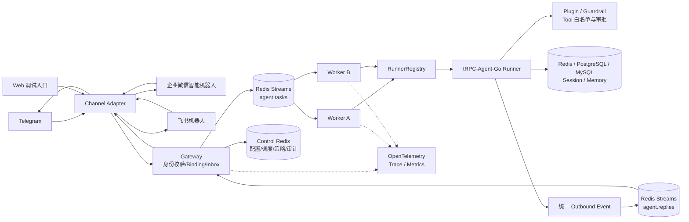
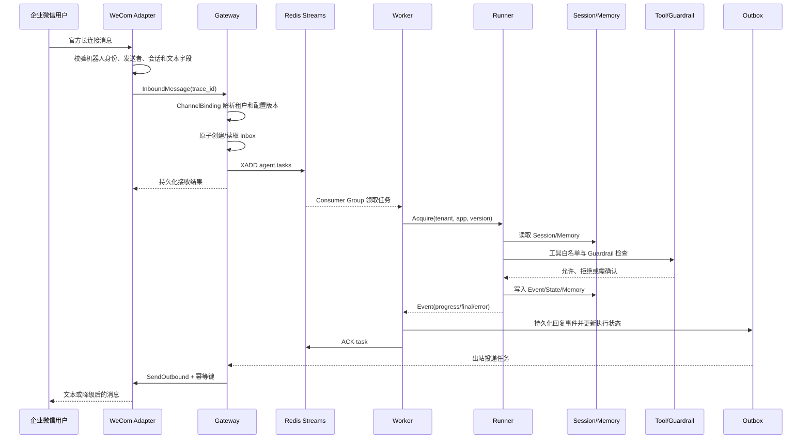

# 基于 tRPC-Agent-Go 的多租户节点化 Agent 部署平台

> 方案提交版：v2.0
> 复核日期：2026-09-07
> 代码基线：`2812c22`（Phase 7 与真实 IM 接入完成）
> 方案状态：Phase 0–7 已实现并验收；向量库、对象存储和 Kubernetes 保留生产设计

## 1. 设计目标与范围

本方案面向多个部门或业务线共享 Agent 能力的场景。平台需要让不同租户独立配置 Agent、模型、工具、IM 账号和数据后端，同时允许 Gateway、Worker 水平扩展。核心目标是：租户身份可信、Worker 尽量无状态、会话和记忆跨节点可见、消息至少一次投递但业务结果幂等、故障可恢复且全链路可审计。

当前交付已经落地真实 tRPC-Agent-Go Runner、可信 ChannelBinding、Redis Streams、双 Worker、Telegram、企业微信与飞书 Adapter、Redis/PostgreSQL/MySQL 租户数据面、治理审计、OpenTelemetry 和 Compose 故障演示。向量库、对象存储、Kubernetes、复杂计费和完整管理后台提供生产设计，不阻塞当前可运行交付。

## 2. 核心设计结论

| 关注点 | 方案 | 原因 |
| --- | --- | --- |
| 租户隔离 | 服务端只从已验签的 `ChannelBinding` 派生 `tenant_id + agent_app_id + config_version` | 不信任请求正文、浏览器参数或 IM 文本中的租户字段 |
| Runner | 每个 Worker 按 `tenant_id + agent_app_id + config_version` 使用有界本地缓存 | Runner 不跨进程共享，避免隐式状态；Session/Memory 放共享后端 |
| Session 路由 | 不使用 sticky session；Redis 负责协调与 fencing，租户 Session/Memory 可选 Redis、PostgreSQL 或 MySQL | 任一 Worker 都能处理任务，故障时可由其他 Worker 接管 |
| 消息可靠性 | Redis Streams Consumer Group + 租约 + 至少一次投递 + Inbox 幂等 | 不宣称分布式绝对只执行一次，避免重复副作用 |
| 回复发送 | Worker 只生成统一出站事件，Gateway 负责 IM 投递和重试 | IM 凭据、限流和协议细节留在入口边界 |
| 数据分工 | Messaging Redis 负责队列、租约和 Inbox/Outbox；Control Redis 负责配置、调度、策略与审计；租户业务数据可选 Redis/PostgreSQL/MySQL | 协调面、控制面和租户数据面相互隔离 |
| IM | Telegram Bot API、企业微信智能机器人长连接、飞书官方长连接；统一 `ChannelAdapter` | 凭据留在 Gateway，Worker 不感知渠道协议 |

## 3. 系统架构



Gateway 负责渠道协议、可信身份解析、Inbox 认领、任务发布和 Outbox 投递；Worker 只负责领取任务、选择 Runner、消费 Event 和写入统一回复。Admin/配置层发布不可变配置版本，Storage Adapter 根据租户选择 InMemory 或 Redis；生产多节点不把 InMemory 作为共享状态。

## 4. 核心消息时序



同一 `trace_id` 贯穿回调、Binding、Inbox、Worker、Runner、Tool、Session/Memory 和 IM 回复；`request_id` 用于客户端响应和日志检索。Agent 已执行与 IM 已送达是两个状态，投递失败只重试 Outbox，不默认重新执行 Agent。

## 5. 数据模型与后端策略

核心长期实体包括：`tenant`、`agent_app`、`agent_app_config`、`channel_binding`、`session`、`session_event`、`memory_item`、`summary`、`inbox_message`、`outbox_reply`、`audit_log`。关键关系是：Tenant 1:N AgentApp，AgentApp 1:N ConfigVersion，Binding N:1 Tenant/AgentApp，Session 绑定 Tenant/App/用户，Event、Memory、Summary 绑定 Session 或 Runner 作用域。

建议的最小字段如下：

```text
tenant(id, status, audit_policy)
agent_app(tenant_id, id, active_config_version, status)
agent_app_config(tenant_id, app_id, version, model, storage_profile, tool_policy)
channel_binding(id, channel, external_account_id, tenant_id, app_id, status)
session(tenant_id, app_id, runner_user_id, session_id, version, updated_at)
session_event(session_id, sequence, role, payload_ref, occurred_at, trace_id)
memory_item(tenant_id, app_id, runner_user_id, key, content_ref, updated_at)
inbox_message(tenant_id, binding_id, platform_message_id, state, attempt, lease_until)
outbox_reply(delivery_id, inbox_id, sequence, idempotency_key, state, last_error)
audit_log(tenant_id, channel, actor_user_id, session_id, agent_name, tool_name,
          decision, latency, error_type, cost, trace_id, created_at)
```

Messaging Redis 使用带版本的前缀保存 Streams、Inbox/Outbox、租约、Session 锁和持久化恢复信封；Control Redis 保存配置版本、Binding、节点调度、策略、审计与指标。租户的 Session/Memory 数据面可以选择 Redis、PostgreSQL 或 MySQL，并在 Agent App 首次正式执行后锁定后端指纹，禁止运行中隐式切换或故障回退。向量库适合 Knowledge 检索索引，对象存储适合附件和大文件，任何后端都不保存长期明文密钥。后端迁移采用离线导出、校验、按租户灰度切换和可回滚版本，不做隐式双读；向量库迁移采用重建索引和校验和比对。

Phase 1.5 对官方 Redis、MySQL、PostgreSQL 子模块进行隔离验证时发现的兼容性和并发问题，已分别向上游提交反馈；截至本方案复核日，相关 issue/PR 均已由官方修复并合并。本项目继续使用官方发布模块，不维护本地分叉。历史复现、影响范围和规避记录保留在本地研发资料中，不属于本次方案提交。

## 6. 幂等、并发与故障恢复

Inbox 唯一键固定为 `tenant_id + channel_binding_id + platform_message_id`，首次认领必须原子完成。任务状态为 `received → enqueued → processing → executed → delivery_pending → completed`，失败进入 `retry_wait` 或 `failed_terminal/dead_letter`。Worker 使用有期限租约，Redis Streams 通过 `XACK`、Pending 查询和 `XAUTOCLAIM` 完成接管。可重试错误包括临时 Redis、模型超时、IM 429/5xx；验签失败、未知 Binding、权限拒绝和非法消息直接终止。

Phase 3 先验证单 Worker 的投递和恢复语义，不承诺 Streams 的全局 Session 顺序；Phase 4 增加 Session 级 Redis 锁或版本条件写入，保证同一 Session 串行处理。Worker 取消时调用 `context.Cancel`，停止产生副作用并排空 Runner Event channel；Runtime 关闭按 RunnerRegistry、后端、健康检查客户端的顺序执行，避免 goroutine 和连接泄漏。

## 7. IM、治理与安全

Telegram 适配器使用 Bot API 长轮询；企业微信使用智能机器人 WebSocket 长连接，并以相同 `req_id` 发送最终 `stream` 回复、等待服务端业务成功码；飞书使用官方 SDK 长连接接收 `im.message.receive_v1`，通过原消息 Reply API 回复并校验业务码。三者都转换为统一 `InboundMessage/OutboundMessage`。单聊以绑定和会话主体生成 HMAC 身份；群聊以群主体作为 `runner_user_id`，真实 `actor_user_id` 只用于权限和审计。当前真实联调范围为文本消息，附件、流式卡片等复杂能力后续扩展。

Plugin/Guardrail/Callbacks 提供工具白名单、敏感信息脱敏、IM 用户权限、预算检查和危险操作二次确认。日志、Trace、错误响应和审计统一过滤模型 Key、IM Token、数据库密码、Authorization 和长期附件 URL。OpenTelemetry 记录 IM 回调到回复的同一 Trace，并按租户统计请求量、延迟、错误率、Token、工具耗时、投递成功率和后端延迟。

## 8. 实施结果与阶段状态

预期效果是：相同外部用户在不同租户下的 Runner、Session、Memory 完全隔离；Worker 无需 sticky session，增加实例即可扩展；重复平台消息不产生第二个 Inbox 业务结果；Worker 故障后的接管时间受租约和认领周期约束；所有关键决策均可通过 Trace 和 Audit Log 追溯。上述为设计目标，生产容量和延迟需在 Phase 7 压测后定标。

| 阶段 | 状态 | 交付与门槛 |
| --- | --- | --- |
| Phase 0–2 | 已完成 | 依赖、Runner、Redis、配置、租户隔离和真实 Smoke |
| Phase 3 | 已完成 | Streams、Inbox、租约、重试、ACK 顺序和重启恢复 |
| Phase 4 | 已完成 | 双 Worker、Session 串行、故障接管和跨节点可见 |
| Phase 5/5.5 | 已完成 | Telegram、企业微信、Web UI、Redis/PostgreSQL/MySQL 数据面和恢复语义 |
| Phase 6 | 已完成 | 节点调度、工具治理、脱敏、审计、指标和 Trace |
| Phase 7 | 已完成 | Compose、F01–F11 故障演示、观测、生产设计和真实企业微信/飞书联调 |

企业微信与飞书真实账号均已完成“客户端消息 → Gateway → Redis → Worker → 真实模型 → 客户端回复”验收；自动化测试仍不依赖外部账号和真实凭据。

## 9. 风险与缓解措施

1. Redis Streams 只提供至少一次语义：使用 Inbox/Outbox 幂等和明确 ACK 顺序。
2. 同一 Session 并发写入：Phase 4 使用 Session 锁或版本号，并覆盖故障接管测试。
3. IM 凭据、应用发布或长连接不可用：凭据仅从环境变量解析，以 Adapter readiness、平台事件日志和客户端真实回复联合验收。
4. IM 限流、长度和异步回复差异：Adapter 做节流、拆分、聚合和降级。
5. Redis 短暂不可用：严格 readiness，消息不回退本地状态，按策略重试。
6. Runner 缓存过大或旧版本未排空：有界 LRU、TTL、引用计数和 Close 幂等。
7. 工具副作用在重试中重复：工具幂等键、审批状态 TTL 和执行结果持久化。
8. 脱敏遗漏造成凭据泄露：统一脱敏层覆盖日志、Trace、错误和审计，并做回归扫描。
9. OTel 或 SQL 仓储接入返工：先做框架能力核验，Repository 接口与 PostgreSQL 实现分离。
10. Windows 无 Bash 启停环境：用 Docker Desktop Linux 容器完成 Compose 验收并记录可迁移性。

## 10. 当前实现状态与验收入口

当前交付基于 `2812c22`，Phase 0–7 已全部落地。实现包括真实 Agent、严格 Catalog 与可信 Binding、RunnerRegistry、双 Redis 拓扑、Redis Streams Inbox/Outbox、双 Worker 与 Session fencing、Redis/PostgreSQL/MySQL 数据面、节点调度、策略治理、审计、指标、Trace、Admin API、Web UI、完整 Compose 和 F01–F11 故障演示。企业微信与飞书均已通过真实客户端和真实模型端到端验证。

最终质量门覆盖 `go test -count=1 ./...`、渠道包 race、`go build ./...`、`go vet ./...`、`go mod verify`、格式与差异检查，并包含真实 Redis/PostgreSQL/MySQL、双 Worker、Collector/Prometheus 和 SQL 故障恢复验收。自动化测试使用 Mock/Fake 协议端点，不要求仓库持有外部凭据。

向量库、对象存储、Kubernetes、跨机房容灾、生产备份恢复、复杂计费和完整管理后台仍属于设计交付，参见 Phase 7 生产文档。过程计划、交接摘要、内部验证证据和真实密钥均不进入最终提交。
