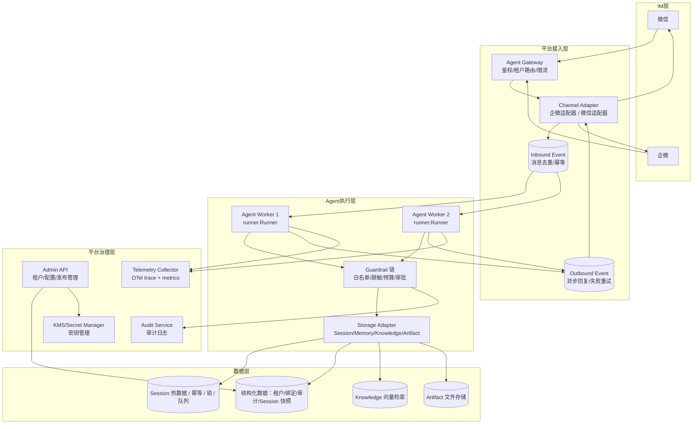
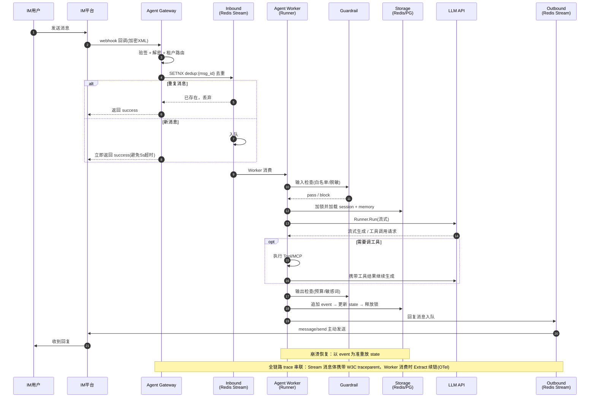

# 基于 tRPC-Agent-Go 的多租户节点化 Agent 平台技术方案

## 1. 需求背景与目标
- 业务背景: 企业希望把 Agent 能力从单点 demo 扩展成平台化服务，同时满足租户隔离、弹性部署、数据一致性、IM 触达、审计合规和后端可替换等要求。  
它的价值在于把框架能力真正映射到企业级 Agent 平台架构，而不是只停留在单个 Agent 进程。
- 目标：
  - 多租户：支持 ≥50 个租户独立部署 Agent，租户间配置、会话、记忆、知识库、工具权限、审计日志完全隔离
  - 节点化部署：Agent Worker 支持水平扩展至 ≥10 节点，无状态化，依赖共享 Session 后端，消息路由到正确租户与 session 的正确率 100%
  - 多后端：支持 ≥3 类存储后端（Redis / SQL / 向量库 / 对象存储），租户级可配、可迁移，迁移期间服务不中断
  - IM 接入：接入企业微信 + 微信客服（或公众号）≥2 类通道，消息端到端（回调到回复落 IM）P95 延迟 ≤15s（含 LLM 生成），消息幂等无重复回复
  - 可观测：单条 trace 串联 IM 回调 → Runner → Tool → Session/Memory 读写 → IM 回复，覆盖率 100%
  - 审计合规：审计日志字段完整（tenant_id / channel / user_id / session_id / agent_name / tool_name / decision / latency / error_type / cost / trace_id），密钥不明文出现在任何日志和 trace 中

## 2. 设计思路  
- 最大化复用 tRPC-Agent-Go 的单体能力：Runner、Session/Memory/Knowledge/Artifact 接口、Plugin/Guardrail、Telemetry Hooks、OpenClaw Channel 模型都已存在，  
  平台层只做"多租户化 + 分布式化 + 治理化"三件事，不重写框架内核。
- 思路推导  
  现状：tRPC-Agent-Go 能跑起一个功能完整的单体 Agent  
  差距：单体进程无法回答四个问题——①多个租户的配置和数据怎么隔离 ②多实例部署时消息路由到哪台机器 ③不同租户选了不同存储后端怎么统一访问 ④出问题时怎么审计和追责  
  路径：针对每个差距引入一个平台层机制——租户模型与路由、无状态 Worker + 共享 Session、Storage Adapter 抽象、治理层（Guardrail + Audit + Telemetry）。每个机制都优先挂在框架已有扩展点上，挂不上的才自建。  
- 关键决策与权衡：
  - 决策一：消息链路采用「同步应答 + 异步消费」，而不是 Gateway 同步直调 Runner
    - 背景：企微/微信回调要求 5s 内应答，而 LLM 生成 P95 远超 5s。
    - 选择：Gateway 验签去重后立即返回 success，消息写入 Redis Stream，由无状态 Worker 消费后通过主动发消息接口回复。
    - 代价与对策：引入了 at-least-once 投递带来的重复消费问题——用 `dedup:{channel}:{msg_id}` 幂等键 + session 分布式锁兜底；
      链路变长，用全链路 trace_id 保证可观测性可穿透异步边界。
  - 决策二：Session 采用「事件追加 + 状态快照」双层存储，而不是只存最新 state
    - 背景：多 Worker 无状态化后，任何节点都可能接管任意会话；崩溃恢复和审计都要求能还原历史。
    - 选择：`session_event` 只追加写（`(session_id, event_seq)` 唯一保证有序不重复），`session.state` 作为快照加速读取；
      崩溃后以 event 为准重放重建 state，对应 tRPC-Agent-Go Session 接口的 AppendEvent/重放语义。
    - 代价与对策：存储量约翻倍、写放大——用 `summary` 表做事件压缩，旧事件可按租户 audit_policy 归档清理。
  - 决策三：密钥不落库，仅存引用（`token_ref` / `aeskey_ref`），运行时从 KMS 解析
    - 背景：审计合规要求密钥不出现在任何日志、trace 和数据库中；多租户密钥需要独立轮换。
    - 选择：数据库只存引用字符串，Channel Adapter 在验签/加解密时通过 Secret Resolver 向 KMS 取值，进程内缓存且禁止打日志。
    - 代价与对策：引入 KMS 可用性依赖——本地开发用文件型 Resolver 兜底，线上用短 TTL 缓存 + 轮换期间双引用并存过渡。

## 3. 总体架构  
- 架构图


注：数据层画的是平台支持的后端**角色全集**，不是每个租户的全量部署。架构角色固定，产品为当前推荐实现、可替换；
Memory 不单独部署，随后端选择复用 Redis/PG/pgvector。默认所有租户走推荐栈，
租户级差异由 Storage Adapter 按 `tenant.storage_config` 在内部路由，不改变部署拓扑。

| 架构角色 | 推荐实现 | 可替换实现 |
|---|---|---|
| Session 热数据 / 幂等 / 锁 / 队列 | Redis | PG |
| 结构化数据 | PostgreSQL | MySQL |
| Knowledge 向量检索 | pgvector | Qdrant / Milvus |
| Artifact 文件存储 | S3 兼容（MinIO / 云 OSS） | — |

注：Milvus 仅接口预留，不在 5.1.1 的受控菜单内。

- 时序图

- 业务系统边界：
  - 上游：企业微信、微信客服两类 IM 平台——平台只消费其 webhook 回调（加密 XML），通过其「应用消息/客服消息」主动发送接口回包，不改造 IM 侧任何配置之外的系统。
  - 下游一（LLM）：模型推理服务（OpenAI 兼容接口或自研网关），平台通过 tRPC-Agent-Go 的 Model 层调用，不感知具体模型部署。
  - 下游二（基础设施）：PostgreSQL、Redis、向量库、对象存储、KMS——全部为已有中间件，平台只做接入与读写，不涉及改造。
  - 平级（Admin 前端）：管理控制台通过 Admin API 读写租户/应用/绑定配置，本项目只提供 HTTP API，不含前端实现。
  - 改造点：无对存量业务系统的改造；新增的是 Agent Gateway、Worker、Admin API、Audit Service 四个服务进程，以及 5.1.2 列出的 PG 表与 5.1.4 的 Redis key。

- 模块划分与各自职责：

  | 模块（代码目录） | 职责 | 改动类型 |
  |---|---|---|
  | `trpcservice/channels` | Channel Adapter：验签/加解密、消息编解码、调 IM 主动发送接口；企微（`channels/wecom`）先行，微信客服同接口扩展；企微智能机器人走 WS 长连接（`channels/wecomws`，5.3.4） | 新建，挂在框架 OpenClaw Channel 扩展点 |
  | `trpcservice/tenant` | 租户模型与路由：租户/应用/绑定的加载与缓存、tenant_id 全链路透传、租户级配置解析 | 新建，平台层核心 |
  | `trpcservice/agent` | Agent 定义与 Runner 装配：按 `agent_app` 配置组装 Agent（prompt/模型/工具），调用 runner.Runner | 基于框架扩展点实现 |
  | `trpcservice/tool` | 平台内置工具注册与租户级工具权限过滤 | 基于框架 Tool 扩展点实现 |
  | `trpcservice/config` | 服务自身配置（端口、DB、Redis、KMS 地址）与 Secret Resolver 抽象 | 新建 |
  | `trpcservice/web` | Admin API + Gateway HTTP 入口：租户/应用/绑定 CRUD、IM 回调接收 | 新建 |
  | `trpcservice/metrics` | OTel trace/metrics 初始化与通用埋点（复用框架 Telemetry Hooks） | 基于框架扩展点实现 |
  | `trpcservice/log` | 结构化日志，密钥脱敏中间件 | 新建 |
  | `cmd/trpc-service` | 进程入口：按启动参数以 gateway / worker / admin / all-in-one 角色启动 | 新建 |
  | `trpcservice/storage` | Storage Adapter：Session/Memory/Knowledge/Artifact 四类框架接口的多后端实现（Redis/PG），含审计日志 PG 写入；租户级可配 | 新建，实现框架已有接口 |
  | Guardrail 链 | 输入白名单/脱敏、输出预算/敏感词，产出审计事件 | 自建包装链（`agent.Guarded`）；审批拦截与模型/工具指标埋点挂框架 tool/model Callbacks 扩展点 |

  注：设计中的 `skill`（租户级能力包）与 `workspace`（Artifact 落盘中转）两个目录当前未交付实现，
  已从代码树移除；框架自带 skill 加载能力，需要时按 `llmagent` skill 扩展点接入即可。

## 4. 重点技术与选型

### 4.1 关键技术清单

| 领域 | 选型 | 用途 |
|---|---|---|
| Agent 框架 | tRPC-Agent-Go | Agent 编排、Runner 执行、Session/Memory/Knowledge/Artifact 接口、Plugin/Guardrail、Telemetry Hooks、OpenClaw Channel |
| 消息队列 | Redis Stream | Inbound/Outbound 异步消息通道（决策一） |
| 关系存储 | PostgreSQL | 租户/应用/绑定/会话/事件/审计等结构化数据 |
| 缓存与协调 | Redis | Session 热数据、消息幂等、会话分布式锁 |
| 向量库 | pgvector（起步） | Knowledge 向量检索；接口预留 Qdrant/Milvus |
| 对象存储 | S3 兼容（MinIO/云 OSS） | Artifact 文件存储 |
| 密钥管理 | KMS + Secret Resolver | IM token、模型 API key 等密钥的引用与解析（决策三） |
| 可观测 | OpenTelemetry | 全链路 trace + metrics |
| 部署 | Docker Compose（最小）/ Kubernetes（生产） | 见 5.2.5 |

### 4.2 选型依据与备选对比

- **消息队列：Redis Stream（而非 Kafka / RabbitMQ）**
  - 量级估算：50 租户、总入站峰值按 1,000 msg/s 设计（见 5.2.1 假设），单 Redis 实例的 Stream 吞吐（10w+ msg/s）有两个数量级余量。
  - Redis 因 Session 热数据、幂等键、分布式锁本就是必选组件，用 Stream 不再引入新中间件，运维成本和故障面最小。
  - Consumer Group 原生支持 at-least-once 投递与 pending 消息重投，正好配合幂等键实现不丢不重。
  - 代价：持久化弱于 Kafka（依赖 AOF）、堆积容量受内存限制。对策：`XADD MAXLEN` 限制队列长度、pending 积压告警、AOF everysec；量级超出一个数量级后再评估迁 Kafka（Producer/Consumer 封装在 `channels` 与 Worker 内部，替换不影响业务代码）。
- **关系存储：PostgreSQL（而非 MySQL）**
  - 租户/应用的动态配置（`model_config`、`tool_policy` 等）用 JSONB 承载，避免每次加配置项都 DDL。
  - pgvector 扩展可兼任起步期向量库，少维护一个组件；tRPC-Agent-Go 已有 `session/postgres` 实现可直接复用。
  - 代价：团队若只有 MySQL 运维经验需要适应；JSONB 字段不适合做高频条件查询（配置类字段无此需求）。
- **向量库：pgvector 起步，接口层预留替换（而非直接上 Milvus/Qdrant）**
  - 起步期单租户知识库向量量在十万级以内，pgvector（HNSW 索引）延迟与召回均够用，且与业务数据同库，备份、事务、权限管理统一。
  - 专用向量库（Milvus/Qdrant）在百万级以上规模才有明显优势，但要多维护一套集群。
  - 对策：Knowledge 访问走框架 `knowledge` 接口 + 平台路由层，`memory_item.embedding_id` 已按「向量 ID 外部化」设计，迁库时双写过渡、按租户灰度。
- **密钥管理：KMS 引用模式（而非落库加密 / 硬编码配置）**
  - 理由与权衡见第 2 节决策三。补充一点：Secret Resolver 做成接口，本地开发用文件实现、测试用内存实现、生产接云 KMS 或 Vault，三类环境同一套代码路径。
- **可观测：OpenTelemetry（而非自研埋点）**
  - 框架已内置 OTel Hooks，Runner/Tool/Model 调用自动产生 span；平台层只需补 Gateway、队列收发、Guardrail 三处 span 即可实现全链路串联，自研埋点没有收益。
  - 备选 Jaeger/Tempo 仅涉及 Collector 后端选择，与代码无关。
- **后端一致性取舍总览**：各后端的「代价」论证散见上文，此处按一致性语义 / 读写延迟 / 成本 / 运维复杂度集中对比：

  | 后端 | 承载数据 | 一致性语义 | 读写延迟 | 成本 | 运维复杂度 |
  |---|---|---|---|---|---|
  | Redis | Session 热数据、幂等键、锁、Stream 队列 | 单节点内操作级强一致（单线程串行执行）；哨兵故障切换窗口内可能丢少量异步复制的写，由事件层幂等约束兜底（5.1.4） | 亚毫秒 | 高（内存），但只存热数据且带 TTL，总量小 | 低：哨兵即可，按 5.2.1 余量无需集群 |
  | PostgreSQL | 租户/应用/绑定、session_event、state 快照、memory、audit_log | 单库事务强一致（event 追加 + 快照更新可同事务）；读写分离后从库读有复制延迟，memory 等强一致读强制走主库 | 毫秒级 | 中（磁盘），43GB/天靠月度归档控制在线量 | 中：备份、归档任务、主从作扩容预留 |
  | pgvector / 专用向量库 | Knowledge 向量、memory embedding | 最终一致：embedding 异步生成入库，语义召回滞后秒级；按 `embedding_id` 回表读 content 走 PG 强一致 | 检索毫秒~数十毫秒 | pgvector 与 PG 同库无增量成本；专用库按向量规模计费 | pgvector 低（随 PG）；Qdrant/Milvus 需独立集群，复杂度升一档 |
  | S3 对象存储 | Artifact、IM 素材文件 | 主流 S3 兼容实现写后读强一致；列表一致性取决于实现，故不作元数据索引使用（元数据在 PG） | 数十~数百毫秒，不进热路径 | 最低：按量计费，冷数据友好 | 低：MinIO 单容器起步，生产用托管服务 |

### 4.3 框架能力映射（①原生支持 ②扩展点实现 ③自建）

| 平台需求 | 支持程度 | 复用的框架能力 | 平台层要做的事 | 落点 |
|---|---|---|---|---|
| Agent 编排 | ① | `agent/llmagent`、`agent/graph`、Chain/Parallel/Cycle | 租户级 Agent 注册、发布、路由 | `agent` |
| 执行入口 | ① | `runner.Runner`（流式 Event、context 取消） | 无状态 Worker 调度、队列消费、并发控制 | `cmd` + `agent` |
| Session/Memory/Knowledge/Artifact | ② | `session`/`memory`/`knowledge`/`artifact` 接口及多后端实现 | 租户级后端选择与路由、数据隔离、迁移 | `storage` |
| Tool / MCP / Skill | ② | `tool`、MCP Tool、`skill` | 租户工具白名单、密钥注入、危险工具审批 | `tool`、`skill` |
| 治理 Guardrail | ②+③ | tool/model Callbacks（审批拦截、指标埋点） | Guardrail 包装链（`agent.Guarded`）自建：输入白名单与脱敏、输出预算与敏感词、审计事件产出 | `agent`（Guardrail 链） |
| 服务化 | ② | `server/openai`、`server/agui`、`server/a2a` | 统一 Gateway（鉴权/路由/限流）、Admin API | `web` |
| IM 接入 | ②+③ | OpenClaw Channel 模型（仅通道抽象） | 企微/微信客服适配器主体自建（验签/AES 加解密/5s 应答/主动发送），挂在 Channel 扩展点上；租户绑定 | `channels` |
| 可观测 | ① | OpenTelemetry tracing / metrics Hooks | Gateway、队列、Guardrail 三处补 span；租户维度成本统计 | `metrics` |
| 审计合规 | ③ | 无（框架不提供审计存储） | 审计 schema、异步写入、查询 API | `storage`（audit）+ `web` |
| 多租户模型 | ③ | 无（框架无租户概念） | 租户/应用/绑定模型、tenant_id 全链路透传 | `tenant` |

防踩坑提示：

- Runner 的事件通道必须在 context 取消后排空消费，否则 goroutine 泄漏（Worker 长进程下会累积）；故障恢复设计见 5.2。
- OpenClaw Channel 的验签/解密在框架内只做通道抽象，企微的 AES 加解密与「5s 内应答」约束需要 Adapter 自己实现，不要假设框架已覆盖。

## 5. 详细设计
### 5.1 存储设计
#### 5.1.1 存储选型

- 使用 PostgreSQL 存储租户、应用、会话、事件、记忆和审计等结构化数据。
- 动态配置类字段使用 JSONB 存储，便于后续扩展。
- 密钥不直接落库，仅保存密钥引用，例如 `token_ref`、`aeskey_ref`。
- Redis 用于存储热点会话、消息幂等标记和会话分布式锁。
- 事件类数据采用追加写方式，避免更新历史记录。

租户级后端策略（对应 `tenant.storage_config`）：

- 平台只维护一套默认推荐栈（Session=Redis、结构化数据=PG、Knowledge=pgvector、Artifact=S3），绝大多数租户 `storage_config` 为空，直接走默认。
- 可选项收敛为受控菜单：session 二选一（redis / pg）、knowledge 二选一（pgvector / qdrant）、artifact 固定 s3；每种组合都经过测试，不支持任意排列组合。
- 租户级覆盖仅服务例外场景（如合规要求数据不出域的大租户接专有实例），通过 Admin API 由平台运维设置，终端用户不可见；连接串等敏感信息同样只存引用（`dsn_ref`）。
- 更换后端必须走数据迁移流程（双写过渡、按租户灰度），不允许直接改配置生切。

#### 5.1.2 数据表总览

| 表名 | 说明 | 核心约束 |
|---|---|---|
| `tenant` | 租户信息及租户级配置 | `id` 主键 |
| `agent_app` | Agent 应用定义及版本配置 | `(tenant_id, name, version)` 唯一 |
| `channel_binding` | 渠道与 Agent 应用的绑定关系 | `webhook_path` 唯一 |
| `session` | 用户会话及其当前状态 | `(app_id, session_key)` 唯一 |
| `session_event` | 会话事件流水，仅追加写 | `(session_id, event_seq)` 唯一 |
| `memory_item` | 用户长期记忆 | `id` 主键 |
| `summary` | 会话摘要及压缩进度 | `session_id` 主键 |
| `audit_log` | 审计日志 | `id` 主键 |
| `storage_migration` | 租户后端迁移状态机（5.2.6） | `(tenant_id, resource)` 活跃唯一（部分索引） |
| `memory_embedding` | 记忆语义召回向量（pgvector，异步写入） | `memory_id` 唯一 |

#### 5.1.3 表结构

**租户表：`tenant`**

存储租户基础信息及租户级策略配置。

| 字段 | 类型 | 必填 | 说明 |
|---|---|---:|---|
| `id` | `uuid` | 是 | 租户 ID，主键 |
| `name` | `varchar(128)` | 是 | 租户名称 |
| `model_config` | `jsonb` | 否 | 模型配置，包括模型、温度、上下文长度等 |
| `tool_policy` | `jsonb` | 否 | 工具调用策略 |
| `audit_policy` | `jsonb` | 否 | 审计与数据保留策略 |
| `rate_policy` | `jsonb` | 否 | 入口限流策略（5.1.4 令牌桶），如 `{"qps":50,"burst":100}`，空走平台默认；`send_qps`/`send_burst` 覆盖发送侧限速 |
| `guardrail_policy` | `jsonb` | 否 | 治理策略（4.3）：`input_allow_users` 用户白名单、`input_deny_words` 输入敏感词（覆盖平台基线）、`output_deny_words` 输出敏感词、`max_tokens_per_day` 日 token 预算 |
| `storage_config` | `jsonb` | 否 | 数据后端覆盖配置（受控菜单），如 `{"session":{"type":"redis","dsn_ref":"t42-redis"}}`，空表示走平台推荐栈 |
| `status` | `varchar(32)` | 是 | 状态：`active`、`disabled` 等 |
| `created_at` | `timestamptz` | 是 | 创建时间 |
| `updated_at` | `timestamptz` | 是 | 更新时间 |

索引与约束：

| 名称 | 类型 | 字段 | 说明 |
|---|---|---|---|
| `tenant_pkey` | 主键 | `id` | 租户唯一标识 |
| `idx_tenant_status` | 普通索引 | `status` | 按租户状态查询 |

---

**Agent 应用表：`agent_app`**

存储一个租户下的 Agent 应用配置。

| 字段 | 类型 | 必填 | 说明 |
|---|---|---:|---|
| `id` | `uuid` | 是 | 应用 ID，主键 |
| `tenant_id` | `uuid` | 是 | 所属租户 ID |
| `name` | `varchar(128)` | 是 | 应用名称 |
| `agent_type` | `varchar(64)` | 是 | Agent 类型 |
| `config` | `jsonb` | 是 | 应用配置，包括提示词、模型和工具配置 |
| `version` | `int` | 是 | 配置版本 |
| `status` | `varchar(32)` | 是 | 状态：`draft`、`published`、`disabled` |
| `created_at` | `timestamptz` | 是 | 创建时间 |
| `updated_at` | `timestamptz` | 是 | 更新时间 |

索引与约束：

| 名称 | 类型 | 字段 | 说明 |
|---|---|---|---|
| `agent_app_pkey` | 主键 | `id` | 应用唯一标识 |
| `uk_agent_app_version` | 唯一约束 | `(tenant_id, name, version)` | 同租户下同名称应用版本唯一 |
| `uk_agent_app_published` | 部分唯一索引 | `(tenant_id, name) WHERE status = 'published'` | 同租户同名应用最多一个已发布版本 |
| `idx_agent_app_tenant` | 普通索引 | `tenant_id` | 查询租户下应用列表 |

---

**渠道绑定表：`channel_binding`**

存储外部渠道与 Agent 应用之间的绑定关系。

| 字段 | 类型 | 必填 | 说明 |
|---|---|---:|---|
| `id` | `uuid` | 是 | 绑定 ID，主键 |
| `tenant_id` | `uuid` | 是 | 租户 ID |
| `channel` | `varchar(64)` | 是 | 渠道类型，如企业微信、飞书、钉钉 |
| `app_id` | `uuid` | 是 | 绑定的 Agent 应用 ID |
| `webhook_path` | `varchar(256)` | 是 | 回调路径 |
| `token_ref` | `varchar(256)` | 否 | Token 密钥引用，不保存明文 |
| `aeskey_ref` | `varchar(256)` | 否 | AES Key 密钥引用，不保存明文 |
| `config` | `jsonb` | 否 | 渠道专有配置，如企微的 `corp_id`/`agent_id`、微信客服的 `kf_account`；敏感字段仍只存引用 |
| `status` | `varchar(32)` | 是 | 绑定状态 |
| `created_at` | `timestamptz` | 是 | 创建时间 |
| `updated_at` | `timestamptz` | 是 | 更新时间 |

索引与约束：

| 名称 | 类型 | 字段 | 说明 |
|---|---|---|---|
| `channel_binding_pkey` | 主键 | `id` | 绑定唯一标识 |
| `uk_channel_webhook` | 唯一约束 | `webhook_path` | 回调路径全局唯一 |
| `idx_channel_binding_app` | 普通索引 | `app_id` | 查询应用绑定的渠道 |
| `idx_channel_binding_tenant` | 普通索引 | `(tenant_id, channel)` | 查询租户下某类渠道 |

---

**会话表：`session`**

存储用户会话的当前状态，历史明细保存在 `session_event` 中。

`session_key` 生成规则（由 Channel Adapter 在消息归一化时生成）：

- 单聊：`dm:{channel}:{external_userid}`，同一用户在同一应用下跨天对话复用同一会话。
- 群聊：`group:{channel}:{chatid}`，机器人在群里的上下文按群共享（全群一段对话）；需要群内按人隔离的租户可配置为 `group:{channel}:{chatid}:{external_userid}`。
- 隔离边界：会话唯一性由 `(app_id, session_key)` 保证，而 app 隶属于租户，因此跨租户天然隔离——同一微信用户出现在两个租户的渠道里，会落在两个完全不同的 app 命名空间下；跨群隔离由 `chatid` 保证，同用户在不同群是不同的 session。

| 字段 | 类型 | 必填 | 说明 |
|---|---|---:|---|
| `id` | `uuid` | 是 | 会话 ID，主键 |
| `tenant_id` | `uuid` | 是 | 租户 ID |
| `app_id` | `uuid` | 是 | Agent 应用 ID |
| `session_key` | `varchar(256)` | 是 | 应用内会话唯一键 |
| `user_id` | `varchar(128)` | 是 | 用户 ID |
| `channel` | `varchar(64)` | 是 | 来源渠道 |
| `state` | `jsonb` | 是 | 当前会话状态 |
| `created_at` | `timestamptz` | 是 | 创建时间 |
| `updated_at` | `timestamptz` | 是 | 最近更新时间 |

索引与约束：

| 名称 | 类型 | 字段 | 说明 |
|---|---|---|---|
| `session_pkey` | 主键 | `id` | 会话唯一标识 |
| `uk_session_app_key` | 唯一约束 | `(app_id, session_key)` | 应用内会话唯一 |
| `idx_session_user` | 普通索引 | `(tenant_id, user_id)` | 查询用户会话 |
| `idx_session_updated_at` | 普通索引 | `updated_at` | 查询最近活跃会话 |

---

**会话事件表：`session_event`**

采用追加写方式保存完整会话事件。旧数据由月度归档任务搬至 `session_event_archive` 同构归档表
（`INSERT ... SELECT` + 限流 `DELETE` 分批搬运，避免长事务锁表）；不做声明式分区——
PG 要求分区键包含在所有唯一约束中，与 `(session_id, event_seq)` 幂等约束冲突，保约束弃分区。

| 字段 | 类型 | 必填 | 说明 |
|---|---|---:|---|
| `id` | `uuid` | 是 | 事件 ID，主键 |
| `session_id` | `uuid` | 是 | 所属会话 ID |
| `event_seq` | `bigint` | 是 | 会话内事件序号 |
| `event` | `jsonb` | 是 | 事件内容 |
| `created_at` | `timestamptz` | 是 | 事件创建时间 |

索引与约束：

| 名称 | 类型 | 字段 | 说明 |
|---|---|---|---|
| `session_event_pkey` | 主键 | `id` | 事件唯一标识 |
| `uk_session_event_seq` | 唯一约束 | `(session_id, event_seq)` | 保证事件有序且不重复，兼作按序读取索引 |

---

**用户记忆表：`memory_item`**

记忆分两级：`app_id` 有值为应用私有记忆，`NULL` 为租户级共享记忆；读取时先查当前应用的私有记忆，再合并共享记忆；写入默认记为应用私有。软删除支撑「用户要求遗忘」的合规场景。

| 字段 | 类型 | 必填 | 说明 |
|---|---|---:|---|
| `id` | `uuid` | 是 | 记忆 ID，主键 |
| `tenant_id` | `uuid` | 是 | 租户 ID |
| `app_id` | `uuid` | 否 | 所属应用 ID；NULL 表示租户级共享记忆 |
| `user_id` | `varchar(128)` | 是 | 用户 ID |
| `content` | `text` | 是 | 记忆内容 |
| `embedding_id` | `varchar(256)` | 否 | 向量库中的向量 ID |
| `created_at` | `timestamptz` | 是 | 创建时间 |
| `updated_at` | `timestamptz` | 是 | 更新时间 |
| `deleted_at` | `timestamptz` | 否 | 软删除时间，NULL 表示有效 |

索引与约束：

| 名称 | 类型 | 字段 | 说明 |
|---|---|---|---|
| `memory_item_pkey` | 主键 | `id` | 记忆唯一标识 |
| `idx_memory_item_user` | 部分索引 | `(tenant_id, user_id, app_id) WHERE deleted_at IS NULL` | 按用户查询有效记忆（私有 + 共享两级） |

跨节点可见性：

- PG 行是记忆的唯一 source of truth，写入同步提交成功后即对全部 Worker 可见——所有节点
  读同一 PG 主库，无副本延迟；若将来启用读写分离，memory 读路径强制走主库。
- Worker 不做 memory 本地缓存。记忆跨会话共享，本地缓存会引入失效难题；每次会话开始经
  Storage Adapter 现查，按 5.2.1 的负载假设 QPS 很低，不值得换这个复杂度。
- 例外是向量语义检索：`content` 文本提交即可见，但 embedding 生成与向量入库异步完成，
  语义召回滞后秒级（最终一致）。可接受的理由：检索路径是「向量召回候选 → 按 `embedding_id`
  回表读 content」，向量就绪前新记忆只缺席语义召回，不影响按用户的精确读取；软删除同理，
  `deleted_at` 提交即对后续所有读取生效。

---

**会话摘要表：`summary`**

保存会话摘要以及摘要覆盖到的事件位置。

重放与摘要机制：

- 崩溃恢复时从 `covered_event_id` 之后开始增量重放——之前的事件已被浓缩进 `summary_text`，长会话不做全量重放。
- 摘要由框架 Summarizer 在会话事件数超阈值时异步生成，生成后推进 `covered_event_id` 游标。
- `session.state` 只存框架定义的会话状态（摘要引用、增量游标等元数据），不存全量消息，消息明细永远以 `session_event` 为准。

| 字段 | 类型 | 必填 | 说明 |
|---|---|---:|---|
| `session_id` | `uuid` | 是 | 会话 ID，主键 |
| `summary_text` | `text` | 是 | 会话摘要 |
| `covered_event_id` | `uuid` | 是 | 摘要覆盖到的最大事件 ID |
| `filter_key` | `varchar(128)` | 是 | 摘要对应的框架事件过滤键（单 Agent 应用即 Agent 名） |
| `updated_at` | `timestamptz` | 是 | 摘要更新时间 |

索引与约束：

| 名称 | 类型 | 字段 | 说明 |
|---|---|---|---|
| `summary_pkey` | 主键、外键 | `session_id` | 一个会话对应一条摘要 |
| `covered_event_id` | 逻辑关联（不建外键） | — | 指向已压缩的最大事件；流水表会被归档删除，硬外键会阻塞归档 |

---

**审计日志表：`audit_log`**

审计事件按级别分两路写入：常规 `allow` 事件走内存缓冲异步批量写（满 100 条或满 1 秒触发），不在请求关键路径上；`deny` / `review` / `review_timeout` / 危险工具调用等关键决策事件**同步写入**，宁可增加毫秒级延迟也不接受丢失（合规红线）。实时监控走 metrics 聚合，本表保留行级明细用于对账与审计查询。旧数据由月度归档任务搬至 `audit_log_archive` 同构归档表（同 `session_event`，弃声明式分区以保全唯一约束）。

| 字段 | 类型 | 必填 | 说明 |
|---|---|---:|---|
| `id` | `uuid` | 是 | 日志 ID，主键 |
| `tenant_id` | `uuid` | 是 | 租户 ID |
| `channel` | `varchar(64)` | 否 | 渠道 |
| `user_id` | `varchar(128)` | 否 | 用户 ID |
| `session_id` | `uuid` | 否 | 会话 ID |
| `agent_name` | `varchar(128)` | 否 | Agent 名称 |
| `tool_name` | `varchar(128)` | 否 | 工具名称 |
| `decision` | `varchar(32)` | 是 | 审计决策，如 `allow`、`deny`、`review`、`review_timeout` |
| `latency_ms` | `int` | 否 | 调用耗时，单位毫秒 |
| `error_type` | `varchar(64)` | 否 | 错误类型 |
| `cost` | `numeric(12,6)` | 否 | 调用成本 |
| `prompt_tokens` | `int` | 否 | 输入 token 数 |
| `completion_tokens` | `int` | 否 | 输出 token 数 |
| `trace_id` | `varchar(128)` | 否 | 链路追踪 ID |
| `detail` | `jsonb` | 否 | 管理端写操作的变更前后内容（`{"before":..., "after":...}`，5.4 变更审计） |
| `created_at` | `timestamptz` | 是 | 创建时间 |

索引与约束：

| 名称 | 类型 | 字段 | 说明 |
|---|---|---|---|
| `audit_log_pkey` | 主键 | `id` | 日志唯一标识 |
| `idx_audit_tenant_time` | 普通索引 | `(tenant_id, created_at)` | 租户审计查询 |
| `idx_audit_session` | 普通索引 | `session_id` | 会话审计查询 |
| `idx_audit_trace` | 普通索引 | `trace_id` | 链路追踪查询 |

#### 5.1.4 Redis Key 设计

| Key | 类型 | 示例 | Value | TTL | 说明 |
|---|---|---|---|---:|---|
| `stream:inbound` | Stream | `stream:inbound` | 归一化消息 JSON | 队列 MAXLEN 10 万条截断 | Gateway→Worker 入站队列，消费组 `workers` |
| `stream:outbound` | Stream | `stream:outbound` | 回复消息 JSON | 队列 MAXLEN 10 万条截断 | Worker→Channel Adapter 出站队列，消费组 `senders`（webhook 通道）与 `senders-ws`（wecomws，见 5.3.4） |
| `dedup:{channel}:{binding_id}:{msg_id}` | String | `dedup:wecom:{b1}:msg123` | `1` 或请求 ID | 24 小时 | 消息幂等。binding 维度隔离租户：msg_id 的唯一性由 IM 按 corp/应用保证，同一数字 ID 可合法出现在同通道的两个绑定上 |
| `lock:sess:{app_id}:{session_id}` | String | `lock:sess:{app}:8b3c...` | 请求唯一标识 | 5–10 秒 | 防止并发修改同一会话。app 维度对齐会话身份 `(app_id, session_key)`：两个租户的用户可能携带相同 `channel:user` 会话键，一个租户的长跑不得排队另一个租户的消息 |
| `lock:leader:{name}` | String | `lock:leader:wecomws` | owner 标识 | 15 秒（TTL/3 续期） | 平台级单持有者锁（5.3.4 WS 长连接 leader 竞选） |
| `sent:{channel}:{binding_id}:{msg_id}` | String | `sent:wecom:{b1}:msg123` | IM 返回的消息 ID | 24 小时 | 出站回复幂等，防发送重试造成 IM 侧重复消息（binding 维度同 dedup）。实现注：幂等单元取「入站消息的回复」（一条入站一条回复），比 `{session_id}:{event_seq}` 更贴合出站消费语义，效果等价 |

Session 存储优先复用框架后端（`session/redis` / `session/postgres`），平台不自建会话缓存层。
框架后端须同时满足三点——`(session_id, event_seq)` 级幂等唯一约束、summary 覆盖游标语义、
`tenant_id` 维度与按月归档的 schema 可控性；不满足的点在 `storage/` 内自实现。无论复用还是
自研，语义统一为「事件追加 + 快照」：**事件序列是 source of truth，state 只是物化快照**；
PG 后端落 5.1.3 的 `session_event` / `session` 表（或框架等价表结构）。

分布式锁规则：

- 加锁：`SET lock:sess:{session_id} {worker_id}:{request_id} NX EX 10`，拿不到锁的请求
  短暂自旋重试，超时进入 Stream 重新排队而非报错。
- 续期：会话执行可能超过锁 TTL（长工具调用），Worker 后台 watchdog 每 TTL/3（约 3 秒）
  续期一次，执行结束停止续期；Worker 崩溃则锁随 TTL 自然过期，不会死锁。
- 释放：用 Lua 脚本「校验 value 是自己的再 DEL」，防止锁已过期、被他人持有时误删。
- 兜底：锁失效导致并发写的极端场景，由 `(session_id, event_seq)` 唯一约束保证事件不重复，
  state 以事件重放为准修复。

幂等写入逻辑：

```text
SET dedup:{channel}:{binding_id}:{msg_id} {request_id} NX EX 86400
返回 OK  → 首次到达，继续处理
返回 nil → 重复消息，直接丢弃
```

幂等分三层，职责不同：

- 入口层（`dedup:` key）：只挡 IM 平台的重推。企微/微信的重发通常几秒内到达，但应答失败后的重推间隔可达分钟级（最多 3 次），TTL 取 24h 覆盖全部重试窗口，与出站 `sent:` 对齐。wxkf 例外：游标丢失时 `sync_msg` 会重拉 3 天历史，其三层幂等键 TTL 加宽到 4 天（`storage.DedupTTLWxkf`）。
- 执行层（`done:{channel}:{binding_id}:{msg_id}` 标记 + `(session_id, event_seq)` 唯一约束兜底）：挡 Stream 重投。
  Worker 在回复入队出站后写 done 标记（24h）；重投消息（崩溃接管、Ack 丢失）命中标记直接跳过处理——
  因为重投会触发新的 LLM 运行并产生全新的事件 ID，事件唯一约束在这种场景下数学上永远拦不住，
  只能兜住「同一事件对象被重复追加」的最后防线。done 标记才是执行层幂等的真正实现。

出站幂等：出站消费组发送前先查 `sent:{channel}:{binding_id}:{msg_id}`（见上表实现注），命中说明已发过，直接 XACK；
未命中则调 IM 发送接口，成功后写入该 key 再 XACK。「发送成功但 ACK 前崩溃」导致的重投
不会让用户收到重复回复。

队列与崩溃恢复：

- 入站：Gateway 验签去重后 `XADD stream:inbound`，Worker 以消费组 `workers` 阻塞读，
  处理完成后 `XACK`；Worker 崩溃时其 pending 消息由存活节点 `XCLAIM` 接管，保证不丢。
- 入队前 Gateway 按租户做令牌桶限流（quota 存 Redis，配置于 `tenant.tool_policy` 同级策略），
  超速直接拒收返回失败、由 IM 重推——防单租户灌量撑满全局队列、截断波及其他租户（noisy neighbor）。
- 出站：Worker 产出回复 `XADD stream:outbound`，发送方消费组 `senders` 调 IM 接口，
  发送成功才 `XACK`，失败保留 pending 重试（超过次数进死信并告警）。
- 两条 Stream 均 `XADD MAXLEN ~ 100000` 限制长度，防消息积压拖垮 Redis 内存；
  积压超过阈值触发告警（见 5.2）。
- 背压兜底：Gateway `XADD` 前检查 `XLEN`，达到上限 80% 即拒收并向 IM 返回失败，
  由 IM 稍后重推（与入口令牌桶限流同一条拒收路径）——背压生效期间消息进不了队，
  也就不存在被 MAXLEN 截断的可能，「不丢」承诺以背压为边界。背压失效或入队持续
  快于消费仍触达 MAXLEN 的极端场景，按 SLA 分级接受丢失：截断即告警，并按
  `dedup:` key 与 `session_event` 对账定位丢失范围（有 dedup 记录而无对应事件
  的即为被截断消息）。

### 5.2 可靠性设计

#### 5.2.1 容量评估

基本假设：

| 假设项 | 取值 |
|---|---|
| 租户数 | 50 |
| 峰值入站消息 | 1,000 msg/s（均值按峰值 1/10 估算，100 msg/s） |
| 每条消息 LLM 调用 | 平均 2 轮（含 1 次工具调用） |
| 每条消息 token | 输入 ~2,000 + 输出 ~500 |
| 每条消息 Redis 操作 | ~10 次（dedup / 锁 / Stream 收发 / session 读写） |
| 每条消息 PG 写入 | ~5 次（event 追加、state 更新、审计批量折算） |

推算结论：

- **Redis**：峰值 ~10k ops/s，单实例（10w+ ops/s）余量一个数量级，无需集群。
- **PG**：峰值写入 <5k TPS（审计已批量折算），单实例可承担；主从读写分离作为扩容预留，非必需。
- **Worker 并发**：瓶颈是 LLM 生成时长（秒级）而非 CPU。单节点 200 并发 session × 10 节点 = 2,000 并发，
  对应峰值 1,000 msg/s 下平均 2s 生成时长恰好打满，HPA 按积压长度扩容有明确触发信号。
- **存储增长**：每条消息 event 约 5KB，日均 860 万条消息（100 msg/s 均值）约 43GB/天——
  靠 5.1 的月度归档任务控制在线数据量，这是归档任务不可省略的原因。
- **IM 回调峰值**：与入站消息峰值相同（1,000 回调/s），Gateway 无状态水平扩即可。

#### 5.2.2 降级策略

| 故障场景 | 检测 | 动作 | 用户感知 |
|---|---|---|---|
| Worker 节点故障 | 消费组 pending 超时 | 存活节点 XCLAIM 接管消息，state 从 event 重放重建 | 该条消息延迟增加数秒，不丢 |
| IM 平台重推回调 | `dedup:` key 命中 | 直接丢弃并返回 success | 无感知 |
| PG 短暂不可用 | 写失败/连接超时 | 指数退避重试；消息留在 Stream 不 XACK，持续故障则暂停消费并告警，恢复后自动追上 | 回复延迟；背压（5.1.4）生效期内不丢，积压触达 MAXLEN 的极端场景按 SLA 接受丢失并告警对账 |
| Redis 不可用 | 连接失败 | Gateway 无法去重和入队，返回 IM 失败让其稍后重推（利用 IM 自身的重试机制） | 回复延迟 |
| 模型超时 | context deadline（如 60s） | 取消本次生成，重试 1 次；仍失败回复「服务繁忙请稍后再试」并记审计 | 收到降级回复 |
| 工具执行失败 | tool 返回 error / 超时 | 失败结果回灌给 LLM，由模型如实告知用户「该操作未完成」；危险工具不自动重试 | 收到说明性回复 |

Go 并发安全专项（Worker 长进程不泄漏）：

- Runner 调用传入带 deadline 的 `context.Context`，取消信号沿 Runner → Tool → HTTP 调用全程传播。
- Runner 返回的事件通道必须**消费到关闭**：提前取消时也要排空通道，否则框架侧 goroutine 阻塞泄漏。
- 每个会话处理协程的附属协程（锁续期 watchdog、流式转发）随会话结束通过 `errgroup`/`WaitGroup` 统一回收，
  禁止 fire-and-forget 起裸 goroutine。
- 进程退出时先停止从 Stream 拉新消息，排空在途会话后再退出（graceful shutdown）。

#### 5.2.3 灰度发布与配置回滚

- 应用配置灰度：`agent_app` 新版本先以 `draft` 保存 → 仅对灰度租户发布（置 `published`）→
  观察该租户的错误率、延迟、token 成本 → 无异常则全量发布。「同租户同名最多一个 published」
  由 5.1 的部分唯一索引保证，切换是原子操作。
- 配置回滚：将旧版本重新置为 `published` 即完成回滚；Admin API 在发布/回滚时通过 Redis pub/sub
  广播配置失效通知，Worker 收到后立即丢弃本地缓存、下次请求重新加载，秒级生效
  （缓存 TTL 自然过期作为广播丢失时的兜底）；事件层已按旧/新版本各自记录，互不污染。
  重载失败时继续服务旧快照（stale beats down，只有首次加载失败才对外报错），并把下一次尝试
  推迟 `ReloadBackoff`（默认 5 秒）：失败本身就说明快照已过 TTL，不推迟就等于每个请求都在写锁
  下重跑一次四表全量加载——PG 故障期间整条请求路径退化成排在一条失败查询后面的串行队列，
  日志也按请求条数刷屏。失效广播会清掉这个退避，配置变更仍即时生效。
- 平台自身发布：Gateway 与 Worker 均无状态，滚动更新；Worker 摘流量后依靠 Stream pending
  机制交接在途消息，发版不丢消息。

#### 5.2.4 监控告警

指标清单（OTel，全部带 `tenant_id` 维度）：

| 分类 | 指标 |
|---|---|
| 流量 | IM 回调 QPS、入站/出站消息量 |
| 延迟 | 端到端 P95（回调→回复落 IM）、模型调用耗时、工具调用耗时、Session/Memory 读写耗时 |
| 质量 | IM 投递成功率、错误率（按 error_type 分类）、模型超时率 |
| 成本 | token 消耗、每租户成本（与 audit_log 行级明细对账） |
| 队列 | Stream 长度、pending 数、最老 pending 停留时长、死信数 |
| 资源 | Worker 并发 session 数、goroutine 数（泄漏监控）、Redis/PG 连接池水位 |

告警规则示例：Stream 积压 >5 万条或最老 pending 停留 >5 分钟；IM 投递成功率 <99%；
端到端 P95 >15s（突破第 1 节目标）；错误率 >1%；审计批量写连续失败；goroutine 数持续上涨；
`senders-ws` 消费组积压（5.3.4 风险 R2）。

#### 5.2.5 部署方案

- 最小可运行（本地/演示）：Docker Compose 四个服务——`trpc-service`（all-in-one 模式，
  单进程同时扮演 Gateway + Worker + Admin）、PostgreSQL、Redis；Artifact 用 MinIO 容器。
- 生产推荐（Kubernetes）：
  - `gateway` Deployment ≥2 副本，无状态，前置 LB 接 IM 回调；
  - `worker` Deployment，HPA 按 Stream 积压长度 + 并发 session 数扩缩（2–10 副本），CPU 仅作兜底
    （Worker 负载大头是等 LLM 返回的 IO 等待，CPU 低不代表有余量）；
  - `admin` Deployment 1–2 副本，仅内网可达；
  - PG 主从、Redis 哨兵，OTel Collector 边车或 DaemonSet 收 trace/metrics；
  - KMS 用云厂商服务，Secret Resolver 走短 TTL 缓存。
  - `wecomws` 通道（5.3.4）启用时 leader 循环内嵌于 gateway 副本（`lock:leader:wecomws` 竞选
    单持有者），无需改副本数；滚动更新由旧 Pod ctx 取消关连接 + 新 leader 按 TTL 接管。

#### 5.2.6 后端数据迁移

租户更换存储后端（如 session 从 Redis 迁 PG、向量库从 pgvector 迁 Qdrant）时服务不中断，统一走四步：

1. **双写开启**：Admin 发起迁移后，Storage Adapter 对该租户同时写新旧两个后端，读仍走旧后端。
2. **存量回填**：后台任务把历史数据从旧后端搬至新后端（session 只搬活跃会话，冷数据按需懒加载；
   向量库全量重建索引），回填进度可观测。
3. **读切换**：回填完成且新旧一致性质检通过后，读切到新后端，双写保留一个观察窗口（如 24h）。
4. **旧后端下线**：观察窗口内无异常，停止双写，`tenant.storage_config` 指向新后端，旧数据按保留策略清理。

任何一步失败都可回退到上一状态（读未切换前回退无代价，切换后回退即把读指回旧后端，
双写保证期间数据不丢）。迁移全程按租户隔离进行，不影响其他租户。

双写与回填的一致性细节：

- **双写半边失败**：读未切换前旧后端是权威——写旧失败则整体写失败，走正常写失败路径
  （消息不 XACK、稍后重试）；写新失败不阻塞主流程，记入补偿队列由后台任务重放补齐，
  重放按幂等键去重。读切换后权威反转，对称处理。
- **回填与双写并发**：回填只拷贝迁移发起时刻水位线（当时的最大 `event_seq`）之前的存量，
  水位线之后的增量由双写负责；两边写同一 `(session_id, event_seq)` 时靠唯一约束
  `INSERT ... ON CONFLICT DO NOTHING`，后到者静默跳过，不产生重复。
- **读切换质检口径**：按租户比对新旧两端——每 session 的事件数与 `max(event_seq)`、
  state 快照的内容 hash、summary 游标；计数全量比对、内容抽样比对，差异为 0 才允许切读。

### 5.3 IM 通道接入设计

#### 5.3.1 企微与微信客服接入差异

两类通道在回调协议、回复方式和身份体系上差异显著。Channel Adapter 对上层暴露统一的
归一化消息模型（channel、msg_id、session_key、用户身份、内容类型），差异全部收敛在
适配器内部。

多租户接入（实现注）：回调路由为 `/callback/{channel}/{binding_id}`——网关按绑定 ID 取
`channel_binding` 行，将请求连同该绑定的 `token_ref` / `aeskey_ref`（corp_id 可经
`config.corp_id` 覆盖）交给适配器，验签按绑定各自的密钥进行，之后再进入共享的
路由/限流/护栏管线；启动后新建绑定经快照刷新（TTL + 失效广播）即时可达，无需重启。
env 配置的 `/{channel}/callback` 旧路径保留为单绑定默认。

出站同样按绑定身份发送（实现注）：回复只携带 `binding_id`，适配器据此取该行
`config` 解析自己的发送身份——企微 `{corp_id, agent_id, secret_ref}`、微信客服
`{corp_id, kf_account, secret_ref}`，逐字段回退 env 全局配置（空配置即旧单企业
行为）；`access_token` 缓存键为 `(corp_id, secret_ref)`，40014/42001 只失效对应
维度的条目；绑定查不到或 config 不可解析时发送直接失败，不回退全局身份——否则
一个租户的消息会以另一企业的机器人发出。密钥仍只存引用，经 SecretResolver 解析。
已知限制：企微入站素材拉取（`media/get`）仍用 env 全局 token——回调侧只透传
`token_ref` / `aeskey_ref`，未携带绑定级发送密钥引用。

| 维度 | 企业微信 | 微信客服 |
|---|---|---|
| 回调协议 | 加密 XML，AES-256-CBC + msg_signature 验签 | 加密 XML 事件通知（`kf_msg_or_event`，仅通知不含内容）+ `kf/sync_msg` 主动拉取 |
| 应答约束 | 5 秒内应答，超时/失败重推最多 3 次 | 返回 200 即可，无业务应答时限，重推策略不同 |
| 回复方式 | 被动回复（回调内返回加密包，每次回调仅可回一条，支持 text/image/news 等类型）+ 应用消息主动发送 | 仅客服消息接口主动发送，且只能在用户发消息后的 48h 窗口内 |
| 会话形态 | 单聊 + 群会话（群机器人），群聊 session_key 用 `chatid` | 仅单聊 |
| 用户身份 | `external_userid`（企业维度） | `external_userid`（微信客服维度），与企微不互通 |
| 凭据 | `corpid` + `corpsecret` 换 `access_token`，按企业缓存与刷新 | 独立 secret 换 `access_token`，单独缓存与刷新 |

设计后果：

- 统一走「异步消费 + 主动发送」链路（决策一），不依赖企微被动回复。决定性原因是物理时序：
  异步链路下 LLM 生成 P95 远超 5s，回调应答时限内出不了结果，被动回复技术上不可用；
  它虽支持 image/news 等类型、并非只能回文本，但一次回调只能回一条，同样覆盖不了分段回复、
  工具审批等多轮交互场景。两通道统一主动发送后，上层逻辑与通道无关。
- 5s 约束是企微专属收紧项：Gateway 对企微回调验签去重后立即返回空 success；微信客服回调
  无时限压力，但复用同一条异步链路，不另建同步通道。时序图中的「5s 超时」即指企微约束。
- 身份映射：平台 `user_id` 取 `{channel}:{external_userid}`，同一微信用户在两通道下是
  两个平台用户，天然不串会话。前缀并非冗余：`memory_item` 按 `(tenant_id, user_id, app_id)`
  检索、不带 channel 维度，`user_id` 的 channel 前缀保证跨通道身份不会合并记忆；
  `session_key` 由原始 `external_userid` 生成（见 5.1.3），拼的不是带前缀的 `user_id`，
  不会出现 `dm:wecom:wecom:xxx` 式双重前缀——`user_id` 前缀管身份与审计展示，
  `session_key` 的 channel 段管路由。企微外部联系人映射企业客户体系属预留能力，当前不展开。

#### 5.3.2 IM 平台限制与对策

| 平台限制 | 影响 | 对策 |
|---|---|---|
| 单条文本长度上限（企微约 2048 字节） | 长回复被截断或发送失败 | 分段在同一出站消息的处理内串行完成：一条出站消息携带完整回复，sender 消费后按字节阈值拆段、顺序调 IM 接口，分段共享同一 trace；多 sender 并发不会拆发同一回复的分段，无乱序问题 |
| 主动发送接口限流（按企业/账号维度） | 高峰回复发送失败 | `senders` 消费组按 `{channel}:{tenant_id}` 令牌桶限速，超限在 Stream 内排队不丢弃；持续超限触发告警 |
| 图片/文件消息只下发 `media_id` | 内容无法直接进 LLM | Adapter 用 `access_token` 拉取素材 → 落 Artifact（OSS）→ 消息体只带引用与类型；回复富媒体反向先上传素材换 `media_id` 再发 |
| 消息格式能力不一（企微支持 markdown，微信客服不支持） | 同一回复渲染不一致 | 通道级渲染层：统一回复模型按通道能力降级渲染（卡片 → markdown → 纯文本） |
| 撤回事件 | 已撤回内容残留于会话上下文 | 撤回回调记审计并在 `session.state` 打标记，不回删 `session_event`（事件只追加） |

注：表中平台参数（2048 字节上限、48h 窗口、重推 3 次等）以企业微信/微信客服官方开发文档
（developer.work.weixin.qq.com）当期说明为准；实施阶段 0 申请测试号时对照最新文档复核并回填。

#### 5.3.3 危险工具二次确认（IM 带内审批）

Guardrail 命中需审批的工具调用时走带内确认，不引入带外审批系统：

1. Guardrail 拦截工具调用，当前执行轮次收尾：经 Outbound 向用户发送确认消息（工具名、
   参数摘要、有效期；企微单聊渲染为 `template_card` 卡片，其余通道回退纯文本），写入待审批记录
   （工具调用 ID + 截止时间），审计记 `decision=review`，
   随后释放会话锁——挂起期间不持锁，Worker 保持无状态。
   （实现注：待审批记录存 Redis `approval:{app_id}:{session_key}` 而非 `session.state`——键带 app 维度，两个租户的用户即使携带相同 `channel:user` 会话键也互不可见、互不可确认（跨租户越权回归测试覆盖）；同为节点共享
   持久化，但带原生 TTL、无需加载整个 session 即可读，且不占事件序列；语义等价。）
2. 用户在 IM 内回复「确认/拒绝」：作为普通消息进入同一 `session_key`，分布式锁保证与
   其他执行串行；Worker 检出待审批记录，由 Guardrail 先做答复匹配——
   仅精确匹配确认/拒绝指令（或按钮回调事件）才消费为审批答复：确认人、调用 ID 匹配且未超时
   则放行原工具调用，明确拒绝则终止并告知用户。
3. **非答复消息不打断审批**：挂起期间用户发送的其他内容不匹配答复格式，既不作为审批答复
   消费，也不终止待审批记录——按普通新消息走正常处理流程，审批继续挂起至超时。
   （避免用户随口一句话意外作废待审批的危险操作；该消息若触发新的危险工具调用，按第 5 条处理。）
4. 超时（默认 5 分钟，租户可配）按拒绝处理，审计记 `review_timeout`。
5. **同一会话同一时刻只允许一个 `pending_approval`**：已有挂起审批时，新的危险工具调用
   直接拒绝（`decision=deny`，`error_type=approval_conflict`）并提示用户先完成当前确认——
   不覆盖、不排队，避免审批状态机复杂化。
6. 群聊场景仅消息发起人（或租户配置的审批人）的确认有效，防止群成员误确认。

#### 5.3.4 企业微信智能机器人（WebSocket 长连接）

企业微信智能机器人（通道名 `wecomws`）是第三类通道形态：与 webhook 回调通道不同，
平台**主动向企微 WS 网关（`wss://openws.work.weixin.qq.com`）建立长连接**，消息经连接双向收发。
定位为免公网回调入口的部署形态（内网 / 无域名场景），复用平台全部既有链路。

关键协议事实（以企微官方文档当期说明为准）及设计后果：

| 协议事实 | 设计后果 |
|---|---|
| 回复必须透传入站回调帧的 `headers.req_id`（`aibot_respond_msg`） | 归一化消息增加 `ReplyToken` 透传字段，全链路携带（决策 3） |
| 每个 bot 同时只允许一条连接，新连接踢旧连接（旧端收 `disconnected_event`） | 全局单 leader 持有全部连接（LeaderLock，决策 4） |
| 入站 WS 无平台重推 | `Handle` 失败必须本地退避重试；语义边界见下文 |
| markdown 单条 ≤20480 字节 | 分条推送按 2048 字节切（与既有通道体验一致），复用统一分段器 `channels.SplitText` |
| 每会话限频 30 条/分钟 | 单连接串行发送 + 现有租户级令牌桶兜底（风险 R5） |

与回调通道的差异：

| 维度 | 企微应用（webhook，5.3.1） | 企微智能机器人（WS） |
|---|---|---|
| 连接方向 | IM 平台回调平台（入站 HTTP） | 平台主动出站长连接 |
| 凭据 | `corpid` + `corpsecret` 换 `access_token` | 每 bot 一对 BotID/Secret（subscribe 帧鉴权） |
| 回复方式 | message/send 主动发送接口 | `aibot_respond_msg` 帧，必须带回调 `req_id` |
| 多机器人 | 按回调路径区分 | 按 binding 枚举起多条连接（决策 6） |
| 故障兜底 | 平台重推（≤3 次） | 无重推，本地重试 |

关键决策：

1. **路由复用（Gateway 零改动）**：wecomws 的 binding 约定 `webhook_path = "/wecomws/{bot_id}"`
   （path 形态、走 `uk_channel_webhook` 唯一约束），入站消息填该值——完全复用 EnqueueHandler
   的 Resolve / 限流 / dedup / 背压。channel 名 `wecomws`，`dedup:` / `sent:` / `session_key` 形态不变。
2. **投递归属：独立消费组 + Skip 钩子**。`stream:outbound` 上并存两个消费组：默认 `senders`
   （webhook 通道）与 `senders-ws`（wecomws）。`Sender` 参数化 `Group` 与
   `Skip func(OutboundMessage) bool`：主组跳过 wecomws 消息，ws 组只处理 wecomws。
   **不变量：Skip 命中必须 ack**（不发送、不写 `sent:`、不消耗令牌桶）——不 ack 会被本组
   reap 抢走、attempts 累加、误入死信。
3. **出站找连接**：`InboundMessage` / `OutboundMessage` 各加 `BindingID` 与 `ReplyToken`
   透传字段（processor 组装时原样复制）。Send 按 `BindingID` 定位对应 bot 连接，回复帧透传
   `ReplyToken`（即回调 `req_id`）；连接查不到或 `ReplyToken` 为空 → 返回 error，
   留 PEL 由 `senders-ws` 重试。
4. **Leader 互斥**：新增 `storage.LeaderLock`（key `lock:leader:{name}`，SetNX 带抖动竞选 +
   TTL/3 watchdog 续期 + Lua owner 校验释放，复用会话锁原语）。全局单 leader 持有全部 WS 连接
   并运行 `senders-ws` 消费组；失锁（`lost` 关闭）或 ctx 取消立即关连接、停消费，退避后重新竞选。
   其余 gateway 副本空转待命，任意副本可整组接管。
5. **回复指令选型：`aibot_respond_msg` + req_id 透传**。否决 `send_msg` 主动推送（单聊 chatid
   语义不明确）；否决 `msgtype=stream` 真流式（Send 在 LLM 完成后才执行，stream.id 状态机
   只增加复杂度）。分条替代流式：一条完整回复在 Send 内按 2048 字节分条串行写帧
   （复用 `SplitText`，UTF-8 不切坏；中间段失败报 partial delivery，语义同 5.3.2），
   不碰消息模型。
6. **多机器人**：BotID/Secret 存 `channel_binding.config` jsonb
   （`{"bot_id":"...","secret_ref":"..."}`，secret 只存引用，每次 connect 时经 SecretResolver
   解析，轮换重连即生效）。Manager 按 `Resolver.RoutesByChannel("wecomws")` 枚举可服务 binding
   （binding active + tenant active + app published，与 Resolve 同 TTL / pub-sub 失效语义），
   15s 对账：新增起连、消失/禁用停连；单个坏 binding 记 warn 跳过，不拖垮其他连接。
7. **生命周期**：`channels.Starter` 可选接口（`Start(ctx, h) error`，阻塞至 ctx 取消，
   运行长连接与重连循环），装配层用类型断言探测——mock / wecom / wxkf 零改动。
   Start 返回前逐连接 cancel 并等全部 run 退出（排干语义，同 Auditor drain）。
8. **WS 库选型 `github.com/coder/websocket`**：context-first API 与「失锁即关连接」的
   生命周期契合；测试可用 `httptest` + `websocket.Accept` 起 fake server。

入站自愈与语义边界：

- 读循环内 `Handle` 返回 error（限流 / 背压 / Redis 抖动）时退避重试（1s 倍增、封顶 30s），
  **最多 `inboundRetryMax` = 5 次**；`ErrDuplicate` 视为成功。设上限的理由：派发 worker 是串行的，
  无界重试会让一条毒消息（确定性 handler 失败）或一次长基础设施故障**劫持该连接上所有后续消息**，
  直到队列填满、心跳杀连接重连——而重连只会把同一帧再放一遍。超限后**大声丢弃**（记 error 日志、
  带 bot/msgID/尝试次数），用户可重发、bot 保持存活、连接不会被重试循环本身拆掉。
- `disconnected_event`（被新连接踢线）→ 关连接、5s 起退避重连；subscribe 应答 `errcode≠0`
  视为凭据错误，退避封顶 5min 防坏 secret 自旋；心跳 30s 带新 req_id，下个 tick 前未收到
  匹配应答即断开重连。
- **语义边界声明**：WS 入站无平台重投，两条丢失路径——① 5 次重试耗尽后主动丢弃（可观测、有日志）；
  ② 重试期间进程崩溃。一期接受（窗口小、量级低），二期方向为失败消息落独立 Redis list 重放。
- 媒体消息一期降级为占位文本（`[图片]（暂不支持媒体消息）`）；`enter_chat` /
  `template_card_event` 事件记日志跳过。

配置项：

| env | 默认 | 说明 |
|---|---|---|
| `TRPC_WECOMWS_ADDR` | `""`（禁用） | 设为 `wss://openws.work.weixin.qq.com` 即启用（缺失即禁用门控，与其他通道一致；测试注入 fake 地址） |
| `TRPC_WECOMWS_PING_INTERVAL` | 30s | 心跳间隔 |
| `TRPC_WECOMWS_LEADER_TTL` | 15s | LeaderLock TTL（TTL/3 续期） |
| `TRPC_WECOMWS_RESYNC_INTERVAL` | 15s | bindings 对账周期 |
| `TRPC_WECOMWS_SEGMENT_BYTES` | 2048 | 分条上限 |

Admin 校验：`channel == "wecomws"` 的 binding 创建/更新时，`config` 必须解析出非空
`bot_id` + `secret_ref`（密钥只收引用）；`webhook_path` 必须匹配 `^/wecomws/[A-Za-z0-9_-]+$`
（WS 入站无 IM 重推，path typo 即路由黑洞，校验前置到写入口）；`token_ref` / `aeskey_ref` 留空。

部署：leader 循环内嵌于 gateway 副本，副本数不变。滚动更新时旧 Pod ctx cancel 关连接，
新 leader ≤15s（Leader TTL）接管，期间出站消息在 Stream 排队不丢（WS 在途帧的极小窗口除外）。

风险与缓解：

| # | 风险 | 缓解 |
|---|---|---|
| R1 | 踢线竞态：失锁瞬间新旧 leader 重连互斗 | Extend 确认易主即关 lost → cancel 全部连接；收到 disconnected_event 也断开；退避抖动收敛。网络分区下 Extend 持续失败的极小概率互斗表现为企微侧反复踢线，可接受并记录 |
| R2 | `senders-ws` 无消费者积压 | 队列采集器覆盖该组，`stream_pending{group="senders-ws"}` 告警（5.2.4）；leader 竞选结果打显式日志 |
| R3 | req_id 24h 窗口 vs 出站重试 | 重试路径最长 ~50min ≪ 24h；超窗即不可达，进死信 + 显式 error 日志，不引入 send_msg 回退 |
| R4 | Handle 重试耗尽后丢弃、或重试期间崩溃丢消息 | 见上文语义边界声明；重试有上限（5 次）且丢弃记 error 日志，可观测可告警，一期接受 |
| R5 | 30 条/分钟/会话限频 vs 租户级令牌桶 | 单连接串行 + 对话节奏难触顶；errcode≠0 → Send error → 留 PEL 重试；高频租户用 `rate_policy.send_qps` 收紧 |
| R6 | 出站 attempts 计数器跨组共享（key 不含 group） | 主组对 wecomws 消息 Skip-ack（计数仅 +1），无实质影响；Skip 必须 ack 的不变量见决策 2 |
| R7 | binding 删除/禁用后存量 PEL 消息循环重试 | 可重试至死信兜底（binding 可能恢复，区别于未知 channel 立即丢弃）；Manager 15s 对账停连，告警可见 |

明确不做（一期）：真流式（打字机）、欢迎语 / 模板卡片 / 卡片更新、`aibot_upload_media_*`
素材上传与富媒体出站、入站媒体下载解密（降级占位文本）、`send_msg` 主动推送能力。

测试要点：fake WS server（`httptest` + `websocket.Accept`：校验 subscribe 凭据、回 pong、
注入回调帧、收集 respond 帧、模拟踢线）。覆盖：订阅鉴权失败退避、入站归一化字段
（BindingID / ReplyToken / SessionKey 单群形态 / WebhookPath）、Handle 失败重试不丢消息、
心跳超时重连、disconnected_event 重连、req_id 透传与 markdown 分条（UTF-8 不切坏）、
未知 binding / 空 ReplyToken 异常路径、Sender Skip / Group 语义、RoutesByChannel 过滤与
坏 binding 跳过、Admin 校验 400、LeaderLock 双 holder 互斥与 TTL 接管。

### 5.4 Admin API 接口清单

Admin API 仅内网可达（`TRPC_ADMIN_ADDR` 默认绑 `127.0.0.1:8081`），鉴权 fail-closed：
`TRPC_ADMIN_TOKEN` 未设置时拒绝启动（本地开发须显式声明哨兵值 `dev-insecure`）；
可选用 mTLS（三件套齐备即启用）。`/metrics` 既不在 Admin 口也不在对外的回调口上：每个
角色另起一个内网 metrics 监听（`TRPC_METRICS_ADDR`，默认 `:8082`），Prometheus 与 k8s
探针都抓它——导出的序列带租户维度流量、token 消耗与队列积压，挂在公网可达的回调 mux 上
等于白送侦察材料；Admin 口上于是只剩逐路由 token 鉴权的 `/admin/*`。mock 通道默认关闭
（`TRPC_MOCK_CHANNEL=false`）——其回调是无鉴权消息注入器，开启必须显式声明。租户/应用配置中的 `model.base_url` 受
平台级白名单约束（`TRPC_MODEL_BASE_URL_ALLOW`，默认即平台自身端点的 host）：必须
https 且 host 精确命中白名单，五条写路径（createTenant / updateTenant / createApp /
updateApp / publish 事务内）与 Worker 装配时双重校验——会话原文全部流向该端点，
端点选择权必须留在平台层。所有写操作记审计（操作人、变更前后内容），与风险 9 的
变更审计要求一致。错误响应按"错的是哪一方"分：本服务自己判断出来的失败（找不到、冲突、
配置被拒）原样返回可读消息；数据库与向量库层的失败只回 `"<操作名> failed"`（500），驱动
原文（表名、列名、约束名、SQLSTATE、出错的语句，连接失败时还有 DSN 的 host/port/user/db）
只进日志——响应体是最容易被原样贴进工单和群聊的东西，而 Admin 口也正是拿着泄露 token 的
人最想探的地方。列表接口另有一处陷阱：pgx 的 Query 对 bind/execute 阶段的失败返回 nil，
错误只挂在 rows.Err() 上，漏掉这一步就把"读失败"答成 200 空列表——租户、绑定、审计查询
会在事故期间显示"什么都没有"，正是要查的时候查不到。核心路由：

| 方法 | 路径 | 说明 |
|---|---|---|
| POST / GET / PATCH | `/admin/tenants[/{id}]` | 租户创建、列表/详情、配置更新与启停 |
| POST / GET / PATCH | `/admin/tenants/{id}/apps[/{app_id}]` | 应用 CRUD，新版本默认 `draft` |
| POST | `/admin/apps/{id}/publish` | 发布指定版本（原子切换，见 5.2.3） |
| POST | `/admin/apps/{id}/rollback` | 回滚到历史版本，pub/sub 广播配置失效 |
| POST / GET / DELETE | `/admin/apps/{id}/bindings[/{binding_id}]` | 渠道绑定管理，密钥字段只收引用 |
| POST | `/admin/tenants/{id}/storage-migrations` | 发起后端迁移（5.2.6 四步流程） |
| GET | `/admin/storage-migrations/{id}` | 迁移进度与质检结果查询 |
| GET | `/admin/audit` | 审计查询，按 tenant_id / session_id / trace_id / decision 过滤 |

渠道绑定的写入口按通道类型做配置校验；`wecomws` 绑定必须携带非空 `bot_id` + `secret_ref`、
`webhook_path` 匹配 `^/wecomws/[A-Za-z0-9_-]+$`（5.3.4），不合规返回 400。`wecom` /
`wxkf` 绑定的 `config` 按各自出站身份 schema 校验：字段全部可选（缺省回退 env 全局），
未知字段一律拒绝返回 400——`config` 原样写入审计明细，一个未被通道识别的键（如明文
`secret`）会既进审计又不生效。`webhook_path` 同样只收平台真实挂载的路径：留空则由写入
语句按 `/callback/{channel}/{binding_id}` 自动填充（`binding_id` 出自同一条 INSERT，派发器
按该段查绑定行，调用方无法预先知道），或等于该通道适配器自己挂载的 `/{channel}/callback`
（取自各适配器的导出常量，避免两处字面量漂移），其余取值一律 400——未挂载的路径建绑定时
返回 201、列表里也是一条正常记录，而 IM 的每次回调都在 mux 上 404，等于静默黑洞。

## 6. 预期效果

### 6.1 量化指标

对照第 1 节目标，给出达成口径（手段均已在前文展开）：

| 指标 | 目标 | 达成手段 |
|---|---|---|
| 租户规模与隔离 | ≥50 租户，配置/会话/记忆/知识库/工具/审计完全隔离 | 租户模型 + `tenant_id` 全链路透传（第 3、5.1 节） |
| 节点扩展与路由 | Worker 水平扩至 ≥10 节点，路由正确率 100% | 无状态 Worker + 共享 Session 后端 + `(app_id, session_key)` 路由（第 3、5.1 节） |
| 端到端延迟 | 回调到回复落 IM，P95 ≤15s（含 LLM） | 同步应答 + 异步消费（决策一）；P95 告警阈值 15s（5.2.4） |
| 消息幂等 | 无重复回复 | 入口 dedup + 事件唯一约束 + 出站 sent 三层幂等（5.1.4） |
| 多后端 | ≥3 类后端，租户级可配、可迁移 | 推荐栈 + 受控菜单（5.1.1、第 3 节图例表） |
| 可观测 | 单条 trace 串联全链路，覆盖率 100% | 框架 OTel Hooks + Gateway/队列/Guardrail 三处补 span（4.3） |
| 审计合规 | 审计字段完整，密钥零明文 | `audit_log` schema（5.1.3）+ 密钥引用（决策三） |
| 吞吐容量 | 峰值 1,000 msg/s、2,000 并发 session | 容量推算（5.2.1） |

### 6.2 资源评估

- **最小部署（开发/演示）**：1 台 4C8G 机器跑 Docker Compose（all-in-one 进程 + PG + Redis + MinIO）。
- **生产部署**：Gateway 2×2C4G，Worker 2–10×2C4G（HPA），Admin 1×1C2G；
  PG 2×4C8G 主从，Redis 哨兵 3 节点；规格为按 5.2.1 负载假设的经验配置，上线前以压测校准。
- **存储**：生产环境事件与审计在线保留 1 个月约 1.3TB（按 5.2.1 的 43GB/天估算），
  更早数据由月度归档任务搬至同构归档表（见 5.1.3），在线数据量保持平稳；最小部署为演示流量，数据量可忽略。
- **人力**：1 人，阶段拆分见第 7 节。

### 6.3 验收标准

对照题目验收标准（README）逐条给出本文档落点：

| # | 题目验收标准 | 本文档落点 |
|---|---|---|
| 1 | 覆盖多租户、节点化部署、数据同步、多后端、IM 接入、治理监控、故障恢复 | 第 2–5 章 |
| 2 | 数据模型表达 tenant / agent / channel binding / session / event / memory / summary / audit log 关系 | 5.1.2、5.1.3 |
| 3 | 说明至少两种 IM 通道的接入差异，至少含微信或企微 | 5.3.1 通道差异对比表、第 3 节（Channel Adapter）、5.1.3 `channel_binding.config` 渠道专有字段 |
| 4 | 说明至少三类后端的存储与同步策略 | 4.2 选型对比与一致性取舍总览表、第 3 节图例表、5.1.1 租户级后端策略 |
| 5 | 完整消息链路时序说明，`trace_id` 贯穿 | 第 3 节时序图 |
| 6 | 至少 8 个生产风险及缓解措施 | 第 8 节（12 条 + 回滚方案） |
| 7 | 明确哪些能力复用 tRPC-Agent-Go、哪些需新增平台层模块 | 4.3 框架能力映射表 |

## 7. 时间规划与工作量

总周期：8/26 – 9/9（15 天，其中 11 个工作日），1 人。

里程碑：

| 阶段 | 内容 | 产出物 | 时间 |
|---|---|---|---|
| 阶段 0：环境准备 | 开发环境搭建（compose、PG schema、Redis）；企微测试号/接口权限申请发起 | 可运行的开发环境 | 8/26 – 8/28（3 天） |
| 阶段 1：MVP 最小闭环 | Mock Channel 先行打通「回调→去重入队→Worker/Runner→PG/Redis 存储→出站回复」；企微真实接入并行开发 | 单租户 all-in-one 端到端可演示链路 | 8/31 – 9/3（4 天） |
| 阶段 2：功能完善 | 多租户模型与路由、Storage Adapter 双后端、Guardrail 链、审计异步写、OTel 全链路、Memory/Knowledge 接入 | 多租户完整功能 + 单测覆盖核心链路 | 9/4 – 9/7（2 工作日 + 周末机动） |
| 阶段 3：灰度上线 | Admin API、微信客服通道、监控告警、compose 交付、文档收尾、对照 6.3 验收自查 | 可交付版本 + 验收自查表 | 9/8 – 9/9（2 天） |

模块级工作量评估（人日，含开发 + 自测）：

| 模块 | 工作量 | 备注 |
|---|---:|---|
| 基础设施（compose / schema / config / log） | 1 | |
| `channels`（Mock + 企微） | 2 | 企微加解密若需全自建则 +1 |
| Gateway + Stream 收发 + 幂等 | 1 | |
| Worker + Runner 装配 + 分布式锁 | 1.5 | |
| `storage` Adapter（Redis/PG） | 1 | |
| `tenant` 路由 + Admin API | 1 | |
| Guardrail + 审计 | 0.5 | |
| OTel + metrics | 0.5 | |
| 联调、测试、文档收尾 | 1.5 | |
| **合计** | **10** | 11 个工作日可覆盖，周末机动留给返工 |

依赖与风险：

- 企微测试号/接口权限申请（风险 7）须在第 0 阶段就发起，Mock Channel 保证其阻塞不影响主线。
- 企微加解密若需全自建（+1 天）、框架 session 后端不满足三点要求需自研兜底（+1~2 天）会触发
  工期重估，超出部分从阶段 2 的周末机动中扣。
- 微信客服通道排在阶段 3，若时间不足可降级为「设计覆盖、实现留接口」，优先保证企微通道完整交付。

## 8. 风险评估

| # | 风险 | 类别 | 影响 | 缓解措施 |
|---|---|---|---|---|
| 1 | Redis 单点故障 | 技术（基础设施） | 去重、队列、锁全部失效，服务整体不可用 | 生产部署哨兵；故障期间返回失败利用 IM 重推兜底（见 5.2.2）；恢复后 Stream 无积压损失 |
| 2 | 分布式锁失效（watchdog 崩溃、锁 TTL 过短） | 技术（并发） | 同一会话被两个 Worker 并发写 | 续期 + Lua 安全释放（5.1.4）；事件层唯一约束保证不丢不重，state 重放修复 |
| 3 | Stream 消息积压（Worker 打满或下游故障、单租户灌量） | 技术（容量） | MAXLEN 截断导致丢消息，且截断可能波及其他租户 | Gateway 入口租户级令牌桶限流（5.1.4）；队列达上限 80% 触发背压拒收、由 IM 重推，背压生效期内不丢（5.1.4）；积压长度 + 最老 pending 告警（5.2.4）；HPA 按积压扩容；仍触达截断的极端场景按 SLA 接受丢失、告警并对账定位（5.1.4）；死信队列人工介入 |
| 4 | `session_event` / `audit_log` 数据膨胀 | 技术（容量） | 查询变慢、存储成本失控 | 月度归档任务搬至归档表（5.1）；按租户 audit_policy 配置保留期 |
| 5 | LLM 超时、限流或成本失控 | 技术（外部依赖） | 端到端 P95 破 15s 目标，租户账单超标 | context deadline + 重试 1 次（5.2.2）；Guardrail 预算限制；每租户 token/成本监控告警 |
| 6 | KMS 不可用 | 技术（外部依赖） | 验签解密失败，渠道收发全停 | Resolver 短 TTL 缓存扛短暂故障；密钥轮换期双引用并存；本地开发用文件 Resolver |
| 7 | 企微/微信侧接入依赖（测试号申请、企业认证、接口权限）耗时超预期 | 进度 | IM 联调阻塞整体进度 | 先用 Mock Channel 跑通「回调→Worker→回复」全链路，IM 真实接入与平台开发并行 |
| 8 | 密钥或敏感信息泄漏进日志/trace | 安全合规 | 触碰第 1 节审计合规红线 | 密钥只存引用（决策三）；日志脱敏中间件；OTel span 属性白名单制；上线前扫描日志样本 |
| 9 | 租户误改 `storage_config` 导致读写路由到错误后端 | 运维 | 会话/记忆读不到，表现为数据丢失 | 变更走迁移流程（双写过渡、按租户灰度），禁止直接改配置生切；变更操作记审计 |
| 10 | wecomws 每 bot 仅允许一条连接，多副本重连互斗或 leader 失联 | 技术（并发/可用性） | 企微侧反复踢线，或 WS 通道在 leader 切换窗口内停摆 | `lock:leader:wecomws` 全局单持有者 + 失锁即关连接 + 退避重竞选；`senders-ws` 积压告警（5.3.4 R1/R2） |
| 11 | WS 入站无平台重推 | 技术（可靠性） | `Handle` 重试 5 次耗尽后主动丢弃该条消息，或重试期间进程崩溃 | 退避重试设上限（`inboundRetryMax`=5）并在超限时记 error 日志（bot/msgID/尝试次数），丢弃可观测可告警；设上限是因为派发 worker 串行，无界重试会让一条毒消息劫持该连接上全部后续消息；一期接受并在 5.3.4 声明语义边界，二期落 Redis list 重放（5.3.4 R4） |
| 12 | wecomws 出站回复依赖 `req_id` 时效与分条部分失败 | 技术（外部依赖） | 超窗或中间段失败导致回复缺失/残缺 | 重试路径 ≪24h、超窗死信告警；分段失败报 partial delivery 并留 PEL（5.3.4 R3、决策 5） |

回滚方案：

- 应用配置回滚：旧版本重新置 `published` + pub/sub 广播失效，秒级生效（见 5.2.3）。
- 平台版本回滚：Gateway/Worker 无状态，K8s 滚动回退上一镜像；在途消息由 Stream pending 机制交接，不丢。
- 数据层回滚：schema 变更只做增量（加列、加表、加索引），不做破坏性变更；必须改列时先加新列双写、迁移后删旧列。`deploy/db/init.sql` 是冻结的 000001 基线并把 `schema_migrations` 标到版本 1，之后的变更以编号迁移落在 `deploy/db/migrations/`，由 `deploy/db/migrate.sh`（golang-migrate）应用、CI 同步执行——因为只做增量，回滚镜像不需要回滚 schema。

### 8.1 已知限制与质量门禁

已知限制（单独立项跟进，不阻塞验收标准）：

1. **出站发送密钥为通道级**：wecom/wxkf 发送侧 corpsecret 取 env 全局配置；同一通道
   接入多个 corp 时回复触达需补绑定级发送密钥（回调验签已按绑定隔离，见 5.3.1）。
2. **预算窗口与原子性**：token 预算为「首次使用后 48h 滑动窗」而非自然日，且为消息粒度
   前置拦截，run 执行中无中断点；Allow/Record 非原子，并发超支可达 N 倍。
3. **归档表读路径**：`session_event_archive` 只服务 summary 回放（LEFT JOIN），事件流
   重放不读归档表——存活超 30 天且无 summary 的会话历史不可重放（只增不减的合规审计
   数据在归档表中完整保留）。
4. **回调链路无 Handler 超时**：依赖 ReadTimeout/IdleTimeout 兜底；Redis 抖动时回调
   挂死由 IM 重推窗口自愈。
5. **Worker 消费串行**：单副本内消息逐条处理，无租户公平调度；慢消息的租户隔离依赖
   入口限流 + 水平扩容。
6. **遥测为硬依赖**：OTLP Collector 不可用时进程拒绝启动（可观测性当依赖而非旁路）。
7. **风险 2/4 的运维面**：Migrator 已用 `FOR UPDATE SKIP LOCKED` 选主（5.2.6），Archiver
   仍依赖单副本 admin 角色的部署约定。

质量门禁：CI（`.github/workflows/test.yml`）以 pgvector PG + Redis + MinIO 真实服务跑
全量测试，**skip>0 即失败**（集成测试经 `TRPC_TEST_*` 环境变量门控），覆盖率基线 85%
（实测 87.5%），覆盖率只升不降。基线口径以 CI 为准：本地不带依赖服务跑会因集成测试
跳过而只报约 55%，那不是有效测量。