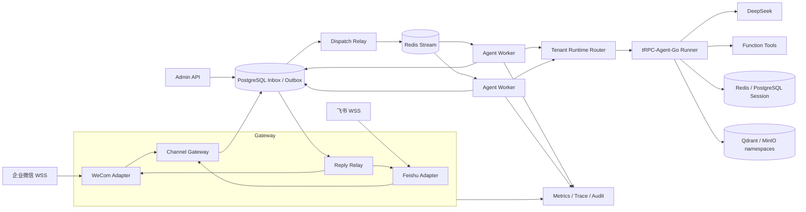
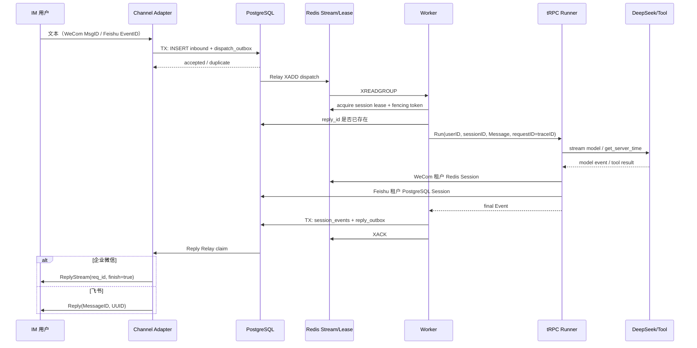

# 多租户节点化 Agent 平台设计

## 1. 目标与边界

平台同时接入企业微信智能机器人和飞书机器人。两个通道都由 Gateway 主动向平台 WSS 建连，因此无需公网回调地址，也不需要内网穿透。平台新增租户路由、可靠消息、发布配置、治理和审计；Agent 编排、Runner、Function Tool 以及 Redis/PostgreSQL Session 直接复用 tRPC-Agent-Go。

首版聚焦可证明的端到端闭环：IM 消息进入后经过 Inbox、Redis Stream、无状态 Worker、DeepSeek、Tool、共享 Session，再由 Reply Outbox 回到原 IM。媒体消息只保留接口和风险控制位置，复杂管理前端、云 KMS、微信公众号与公网 webhook 不在范围内。

## 2. 运行拓扑

同一二进制支持四种角色。`all` 用于本机演示；`gateway` 持有 IM 长连接并运行两类 Relay；`worker` 只消费 Redis Stream 并执行 Agent；`admin` 提供控制面和健康检查。Worker 不需要 sticky session：Runner 使用共享 Redis/PostgreSQL Session Service，平台再通过 Redis session lease 保证同一 session 同时只有一个执行者。Gateway 的连接本身允许驻留节点，但每个 binding 通过 Redis lease 选出唯一持有者。

## 3. 租户、配置与隔离

`Tenant` 是控制面身份与 Channel Binding，`RuntimeProfile` 是每次执行前解析的不可变运行画像，包含 Agent ID/版本、模型、工具白名单、预算和 Backend Profile。入站消息必须携带 `tenant_id + binding_id`；通道凭据只以 `SecretRef` 存在。配置校验禁止重复 tenant/binding，Tool Callback 在执行前再次校验 allowlist，不能靠模型提示词绕过。

每个 AgentVersion 的完整 RuntimeProfile 以不可变 JSON 写入 PostgreSQL。发布事务更新 `published_version` 和单调 revision、写 audit，并通过 `pg_notify('agent_profile_changed', ...)` 通知 Worker。Worker 的 `RuntimeProfileResolver` 失效租户缓存，通知丢失时 30 秒 TTL 兜底。新请求按 revision 构造新 Runner；正在执行的旧 Runner 标记 retiring，活动请求归零后再关闭。把旧版本再次发布就是回滚，不需要重启 Worker。

隔离分五层：配置按 tenant 路由；Inbox、Outbox、session 和审计唯一键包含 tenant；Redis Session 使用租户 key prefix，PostgreSQL Session 的 app name 包含 tenant；Qdrant collection/namespace 与 MinIO prefix 使用 Backend Profile 的 namespace；日志只记录引用名称、业务 ID 和 trace，不记录 API Key、Secret、消息原始附件。即使两个 IM 用户 ID 相同，也无法复用 session。

会话 ID 使用 SHA-256：单聊输入为 `tenant|binding|channel|p2p|external_user_id`，群聊输入为 `tenant|binding|channel|group|external_conversation_id`。这使同租户跨群、同用户跨通道和不同租户天然分离。

## 4. 双通道适配

统一 `ChannelAdapter` 暴露 `Run`、`Send` 和 `Health`，入站统一为 `InboundEnvelope`，出站统一为 `OutboundEnvelope`。

企业微信 Adapter 使用 `wss://openws.work.weixin.qq.com`，凭据顺序为 BotID、Secret。SDK 完成认证、心跳、ACK 与自动重连；Adapter 保存短期 `req_id → frame` 映射，Agent 完成后调用流式 Markdown Reply，frame 过期时可按 chat ID 降级为主动消息。同一个 Bot 多连接会互踢，因此 `tenant + binding` 先取得 45 秒 lease，每 15 秒续租，fencing token 防止旧 Gateway 恢复后继续写。

飞书 Adapter 使用官方 v3.7.2 的 `ws.Client` 和 `EventDispatcher` 订阅 `im.message.receive_v1`。启动时先调用 Bot Info API 得到机器人自己的 OpenID；EventID 是幂等消息 ID，MessageID 用于 Reply API，ChatID 与 Sender OpenID 用于会话映射。单聊总是处理；群聊只有 mention OpenID 等于机器人自身时才处理，只删除自身 mention token；`@其他成员` 和 `@所有人` 都被忽略。回复使用 API UUID 去重。v3.7.2 没有公开 OnReady，本实现只有在 WSS bootstrap/dial 没有在一秒内返回错误时才标记 ready；真实验收还需后台连接日志与一次实发消息共同证明。

两边差异如下：

| 项目 | 企业微信 | 飞书 |
|---|---|---|
| 凭据 | BotID + Secret | AppID + App Secret |
| 入站 ID | MsgID | EventID |
| 回复定位 | req_id/frame，chat ID 降级 | MessageID Reply API |
| 群聊 | Bot 消息事件，按群 chat ID | 明确 @，拒绝 @所有人 |
| 流式 | ReplyStream + finish | 首版最终文本 Reply；接口保留流式升级 |
| 独占约束 | 同 Bot 单有效连接 | SDK 自动重连，binding 仍做单持有者 |

## 5. 核心时序与一致性

Gateway 在一个 PostgreSQL 事务写 Inbox 和 Dispatch Outbox，唯一约束为 `tenant_id,binding_id,channel,external_message_id`。网络重投只会得到已有记录，不会产生第二个 dispatch。Relay 使用 `FOR UPDATE SKIP LOCKED`，成功 XADD 后标记完成；发布失败解除锁并退避。

Redis consumer group 提供至少一次投递，Worker 会 `XAUTOCLAIM` 超过 30 秒的 pending 消息。回复 ID由 dispatch ID 确定性生成；执行前发现 Reply Outbox 已存在就直接 ACK，避免 Worker 在提交完成后、ACK 前崩溃导致模型重跑。模型完成后，平台在一个事务推进 session version、追加单调 sequence event，并写 Reply Outbox。IM 投递失败只重试 reply，不重新执行模型；八次后状态为 dead。Worker 执行失败最多重试八次，随后写入 Redis `:dlq` stream。

严格意义上的“模型调用恰好一次”无法由跨服务事务保证：若进程恰好在模型返回后、数据库提交前崩溃，恢复后可能再次调用模型。因此 Tool 应携带 trace/idempotency key，副作用工具必须在自己的系统做幂等；平台保证从持久化提交点开始不重复。

## 6. Agent、Session 与后端选择

每个 `tenant + agent version + model + revision` 建立一个 Runner。模型通过 `model/openai` 指向 `https://api.deepseek.com`，默认 `deepseek-v4-flash`，配置可切换 pro。Runner deadline 为 45 秒，request ID 等于全链路 trace ID。`get_server_time` 使用 tRPC-Agent-Go `FunctionTool`；Agent/Tool Callback 承担治理、审计和 span，不让业务层绕开 tRPC-Agent-Go 执行链。

企业微信租户调用官方 Redis Session Service，key prefix 含 tenant；飞书租户调用 PostgreSQL Session Service。两者都由 session lease 串行更新，因此 Worker 可水平扩缩。平台自己的 `sessions/session_events` 表保存控制面可审计的用户/助手事件，Runner Session 保存模型所需的完整 event/state/summary，两者职责不同。

Qdrant 与 MinIO 在首版做真实隔离读写而非完整 RAG。Qdrant 为每个 Backend Profile namespace 建独立 collection，payload 再写入 `tenant_id` 并在 search filter 中强制匹配；固定四维 smoke 向量覆盖 upsert/search/delete。MinIO 使用统一 bucket 和 `<namespace>/<logical-key>` 对象键，smoke 覆盖 put/get/checksum/delete。两个演示租户故意使用相同 logical ID/key，仍必须互不可见。

| 后端 | 适合数据 | 一致性与代价 |
|---|---|---|
| Redis | 热 Session、短期 Memory、lease、Stream | 低延迟；开启 AOF，仍需接受故障窗口 |
| PostgreSQL | Inbox/Outbox、配置、审计、长期 Session/Summary | 强事务、易查询；写延迟高于 Redis |
| Qdrant | Knowledge embedding、语义 Memory | 最终一致；collection/namespace 必须租户化 |
| MinIO/S3 | Artifact、图片、文件、导出包 | 对象强持久；元数据与对象提交需补偿 |

## 7. 后端迁移

Redis → PostgreSQL Session 采用六阶段：创建目标 schema；为 tenant 开启双写但继续读 Redis；按 session 游标回填 event/state/summary；比较 session 数、最后 sequence、内容 hash；小流量影子读并记录差异；将该 tenant 读切到 PostgreSQL。稳定窗口后停止 Redis 写。任一阶段差异超阈值就把读指针回滚到 Redis，目标库保留供修复，不做破坏性清空。

Qdrant 本地 → 远端同理：新写同时进入两个 collection，按 document ID 回填，比较 point count、payload hash 和抽样 top-k 召回，再按 tenant 切换 alias。MinIO 迁移使用不可变 object key 和 checksum；数据库只在目标对象校验成功后切换 location。

## 8. 治理、观测和容量

控制面发布不可变 AgentVersion，Channel Binding 和 Backend Profile 通过引用关联。生产版在 Admin 前增加 OIDC/mTLS、RBAC 与审批；危险 Tool 人工确认只保留扩展点。治理控制器在 Agent before callback 原子预占并发和基于最大输出的日预算，检查估算输入 token；Agent after callback 按模型 Usage 结算实际费用。成功、错误、超时与取消均幂等释放 reservation，Tool before callback 拒绝未授权调用。Redis Lua 保证多 Worker 共享额度，本地测试可使用内存实现。平台输出入站、重复、Agent 结果/耗时、回复、channel ready、lease contention、治理拒绝、token 和费用指标，并写包含 tenant、channel、user、session、agent、tool、decision、error type、cost、trace 的审计行。

容量先测三个瓶颈：单 Worker 并发由模型延迟和租户 semaphore 决定；Redis QPS 约为每条消息 1 次 XADD、1 次消费、2–4 次 lease 操作和 Session event 操作；PostgreSQL 每条消息至少两个事务。以 P95 10 秒模型延迟、每 Worker 50 并发估算单节点约 5 msg/s，再用实际 token 长度、IM 峰值与 API 限流压测校准。Gateway 扩容不增加同一 Bot 连接数，只提高不同 binding 的承载与故障接管。

所有 goroutine 都由父 context 管理；Runner 用 deadline；SDK callback 不启动无界 goroutine；Relay 使用 ticker 并在取消时退出；Runner event channel 必须持续 drain 到关闭。Feishu v3.7.2 的 Start 内部永久 select 是 SDK 限制，底层网络循环仍接收 context；进程级停止负责回收最终 goroutine。

## 9. 风险清单

| 风险 | 缓解 |
|---|---|
| 长连接重连风暴 | SDK 退避抖动、lease 单持有、重连指标告警 |
| 同一企业微信 Bot 多连接互踢 | binding Redis lease + fencing token |
| 消息重复或乱序 | 四字段唯一键、session 串行锁、sequence_no |
| 租户数据串读 | tenant 进入所有 key、表主键、namespace、Runner app name |
| Outbox 部分失败 | 同库事务、SKIP LOCKED、可重试状态机 |
| Worker 提交前崩溃 | 至少一次恢复；Tool 使用 idempotency key |
| DeepSeek 超时/限流/成本失控 | 45 秒 deadline、指数退避、并发/token/日预算 |
| IM 限流或超长 | 平台速率桶、Markdown 分片、只重试回复 |
| SDK 协议漂移 | 精确锁版、官方帧兼容测试、Adapter 隔离 |
| Secret 泄漏 | fileenv SecretRef、日志脱敏、提交前扫描、生产 KMS 接口 |
| 恶意或超大媒体 | MIME/大小/病毒扫描、对象隔离、首版拒绝未支持类型 |
| goroutine/连接泄漏 | context 树、deadline、race/goleak 测试、SDK 升级跟踪 |
| 飞书版本未发布或权限未生效 | Ready + 后台日志 + 实发三证据，发布 checklist |
| Redis/PG 短暂不可用 | AOF/HA、连接池、Outbox lease 到期重领、DLQ |
| 迁移双写产生差异 | hash 校验、影子读、tenant 级切流和可逆回滚 |

## 10. 公开依据与实现映射

- tRPC-Agent-Go 的 Runner、LLMAgent、Function Tool、Redis/PostgreSQL Session：项目锁定 commit 对应源码与文档。
- 飞书：[`larksuite/oapi-sdk-go`](https://github.com/larksuite/oapi-sdk-go) v3.7.2 的 WebSocket、dispatcher 与 `im/v1` API。
- 企业微信：社区 Go SDK 隔离在 Adapter 后，同时测试公开 frame 字段；官方 [`WecomTeam/aibot-node-sdk`](https://github.com/WecomTeam/aibot-node-sdk) 可用于协议交叉核对。
- DeepSeek：OpenAI-compatible base URL 与 Function Calling 参考[官方 API 文档](https://api-docs.deepseek.com/guides/function_calling)。
