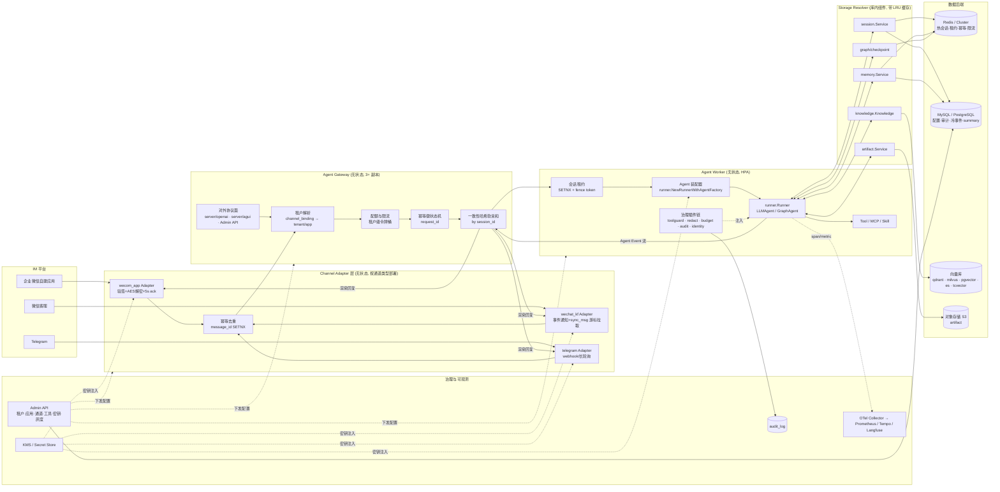
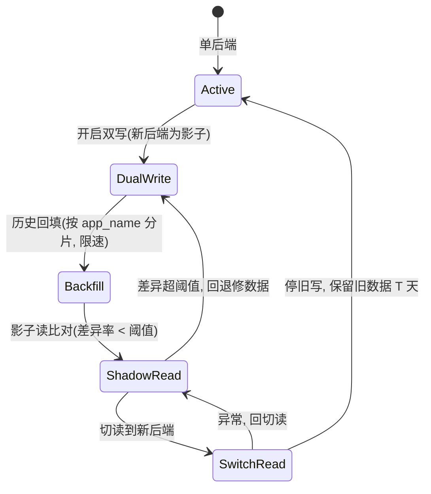
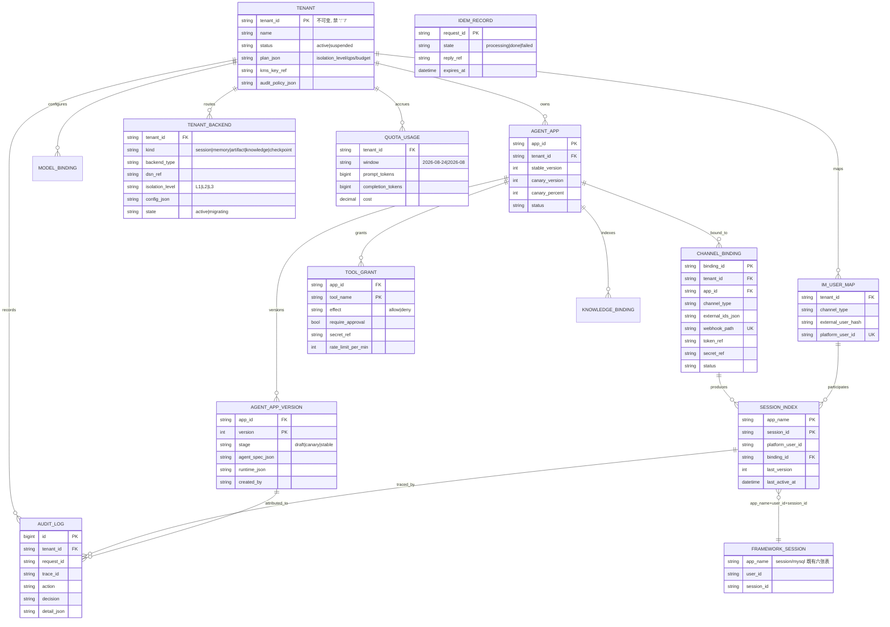
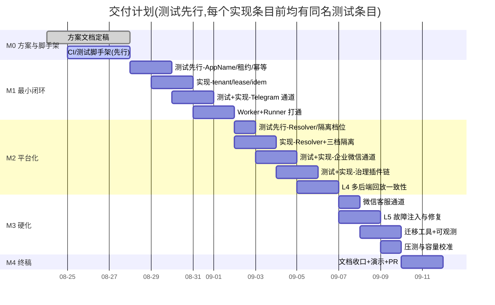

# 基于 tRPC-Agent-Go 的多租户节点化 Agent 部署平台 · 方案文档

| 项 | 内容 |
| --- | --- |
| 课题 | 腾讯犀牛鸟开源人才培养活动 2026 · 第三阶段 · tRPC 课题（project/111） |
| 语言/仓库 | Go 侧，目标仓库 `github.com/liuzengh/trpc-agent-service` |
| 依赖框架 | `trpc.group/trpc-go/trpc-agent-go` **v1.11.2**（2026-08-20 发布）；子模块多为 v1.11.0，`session/mysql` 为 v1.11.2 |
| 文档定位 | 8/27 提交的方案文档（设计思路 / 架构 / 重点技术 / 预期效果 / 时间规划），同时覆盖课题 README 列出的 8 项交付物 |
| 日期 | 2026-08-24 |

> 本文所有引用的框架符号与源码位置，均在 v1.11.2 代码树中核实过；文中标注的路径可直接检索。

---

## 0. 背景与目标

**为什么做这件事。** 企业落地 Agent 时，需要的不是一个机器人进程，而是一套能让多个部门、多条业务线、多个 IM 入口
共用的平台：客服接企业微信、研发接内部群机器人、运营接微信客服，而不同租户又必须彼此隔离会话、记忆、知识库、
工具权限与审计日志。tRPC-Agent-Go 已经把「单个 Agent 怎么跑好」解决得很完整（编排、Tool/MCP、Session/Memory/
Knowledge/Artifact、Plugin/Guardrail、Telemetry、HTTP 服务化、OpenClaw IM 通道），但从**框架**到**平台**之间，
仍缺一层：租户装配、跨节点路由与一致性、后端选择与迁移、IM 归一化、治理下发与合规审计。这层就是本课题要补的东西。

**本文要回答的问题。** 五个，且每个都要能落到代码与测试上：

1. 多租户怎么隔离，且不引入第二套 ID 体系？→ §3（结论：租户即 `AppName`）
2. Worker 能不能真无状态、可随时被杀？需要 sticky session 吗？→ §3.4（结论：不需要网络粘连，但需要会话租约）
3. 不同租户选不同后端时，数据一致性与迁移怎么办？→ §4
4. 企业微信这类 IM 的加密回调、5 秒响应窗口、重复投递怎么吸收？→ §5、§4.5
5. 出事怎么办：越权、泄漏、超支、超时、节点挂掉？→ §8、§9、§11

**交付目标。** 8/27 提交本方案文档；9/11 前在 `github.com/liuzengh/trpc-agent-service` 交出与本文一致的 Go 实现，
且实现过程**测试先行**（§10 给出 L1–L6 六层测试计划与逐条用例清单，核心包覆盖率 ≥ 80%）。
本文同时按课题「交付物 8 项 / 验收标准 7 条 / 难点 6 条」逐条自查，见 §14。

**范围声明。** 只做 Go 侧；不引入 `openclaw` 子模块（仅 v0.0.1 且含本地 `replace`，见 §2.3 依赖策略与 R9），
但通道与报文结构与 `openclaw/channel`、`gwproto.MessageRequest` 对齐，便于日后平滑切换或回贡上游。

**阅读导航。** 只关心结论看 §1.3 与 §2.1；关心「为什么这么设计」看 §3.4（租约的源码级论证）与 §4.3；
关心工程落地看 §7（数据模型）、§10（测试计划）、§13（时间规划）。

---

## 1. 设计思路

### 1.1 问题拆解

课题要求把 tRPC-Agent-Go 从「单个 Agent 进程」抬升为「企业级 Agent 平台」。拆开看是五个彼此耦合的问题：

1. **谁的 Agent** —— 租户模型：配置、模型、工具、通道、后端、审计策略都要按租户隔离，而不是只加一个 `tenant_id` 字段。
2. **在哪执行** —— 节点化：Agent 天然依赖 Session/Memory/Summary/工具上下文，却要求 Worker 可以水平扩缩、随时被杀。
3. **状态放哪** —— 多后端：不同租户选不同后端，同一份数据在 Redis / SQL / 向量库 / 对象存储之间有完全不同的一致性能力。
4. **消息从哪来** —— IM：微信系通道有加密回调、5 秒被动回复窗口、重复投递、限频、身份体系，不能当成 HTTP chat API。
5. **出事怎么办** —— 治理与恢复：越权、泄漏、超支、超时、乱序、节点挂掉，每一项都要有可验证的兜底。

### 1.2 设计原则

- **P1 一个隔离维度贯穿全栈**：不引入第二套 ID 体系，用框架既有的 `AppName` 承载租户身份，让所有后端「天生」按租户分键。
- **P2 能力复用优先，平台层只做框架不该管的事**：编排、执行、存储适配、护栏、可观测已由框架提供；平台层只补「多租户装配 + 路由 + 通道 + 治理下发 + 审计」。
- **P3 无状态优先，正确性靠共享状态层而非亲和性**：不依赖网络级 sticky session，只用「软亲和 + 会话租约」。
- **P4 幂等是接入层的第一等公民**：IM 会重复投递，所有写路径必须可重放。
- **P5 可测优先（测试先行）**：每个关键机制都先有一个能在无外部依赖下跑绿的测试（miniredis / sqlmock / httptest / fake model），再有实现。

### 1.3 一句话方案

> 以 `AppName = "t:<tenant_id>/<app_id>"` 为唯一隔离维度，把 tRPC-Agent-Go 的 `runner.Runner` 包成**无状态 Worker**；
> 前置**统一 Gateway** 负责租户解析、配额、一致性哈希软亲和与会话租约；旁挂**Channel Adapter** 把企业微信 / 微信客服 / Telegram
> 的回调归一化为与 `openclaw/gwproto.MessageRequest` 同构的内部报文；下接 **Storage Resolver** 按租户惰性装配
> `session.Service` / `memory.Service` / `artifact.Service` / `knowledge.Knowledge`；治理与审计全部以 `plugin.Plugin` 形式注入 Runner；
> 全链路用一个 `request_id` 串起 OTel trace 与审计日志。

---

## 2. 总体架构

### 2.1 系统架构图



### 2.2 组件职责

| 组件 | 职责 | 是否有状态 | 扩缩方式 |
| --- | --- | --- | --- |
| **Channel Adapter** | 承接 IM 回调；验签/解密；`message_id` 去重；把外部报文归一化为内部 `Inbound`；把 Agent Event 渲染为 IM 回复并投递（含重试、分段、卡片、媒体上传） | 无（游标/去重键落 Redis） | 按通道类型独立 Deployment，避免一个通道的限频拖垮其他通道 |
| **Agent Gateway** | 租户解析（`channel_binding` → tenant/app）；租户级限流与配额预检；`request_id` 幂等状态机；一致性哈希软亲和；对外协议面（OpenAI 兼容 / AG-UI / Admin API） | 无 | 无状态多副本 + LB |
| **Agent Worker** | 取会话租约；按租户装配 Agent（模型/提示词/工具/知识库）；执行 `runner.Runner`；把事件流回吐 | 无（运行期状态在 Redis/SQL） | HPA（CPU + 队列深度） |
| **Storage Resolver** | `(tenant, kind) → Service` 的惰性工厂 + LRU 缓存 + 引用计数 + `Close()`；租户后端配置变更时失效重建 | 进程内缓存 | 随 Worker/Gateway 内嵌 |
| **Admin API** | 租户、应用、通道绑定、工具授权、后端配置、密钥引用、灰度与回滚的 CRUD 与审批 | 无 | 独立 Deployment（低流量、高权限） |
| **Telemetry Collector** | OTel Collector 聚合 trace/metric，转发 Prometheus / Tempo / Langfuse | 无 | DaemonSet 或独立 Deployment |

对照 tRPC-Agent-Go 的职责划分：Gateway ≈ `openclaw` 的 Gateway 角色 + `server/openai`·`server/agui` 协议面；
Worker ≈ `runner.Runner` 的宿主；Channel Adapter ≈ `openclaw/channel.Channel` 的实现集；
Storage Resolver ≈ `openclaw/registry` 的各类 `*BackendFactory` 的多租户版本。

### 2.3 可复用的框架能力 vs 需新增的平台层

| 平台需求 | 直接复用（v1.11.2 真实符号） | 平台层新增 |
| --- | --- | --- |
| 执行入口 | `runner.Runner.Run(ctx, userID, sessionID, model.Message, ...agent.RunOption) (<-chan *event.Event, error)`；`runner.NewRunnerWithAgentFactory`（请求级构建 Agent）；`runner.ManagedRunner.Cancel(requestID)` | Runner 池化与按 `(tenant, app, version)` 缓存；租约与排空纪律 |
| Agent 编排 | `agent/llmagent`、`agent/graph`、Chain / Parallel / Cycle、`team` | 租户级 Agent 注册、版本化、灰度路由 |
| 会话 | `session.Service`（`session/session.go:1047`）；`session.Key{AppName,UserID,SessionID}`；后端 `session/{inmemory,redis,mysql,postgres,sqlite,mongodb,clickhouse}` | 按租户选后端与隔离档位；`session_index` 路由表 |
| 会话写钩子 | `session/redis.WithAppendEventHook`、`session/mysql.WithAppendEventHook`（`session/hook.go` 定义 `AppendEventHook` / `GetSessionHook`） | 审计落库、事件级幂等、租户越权校验 |
| 记忆 | `memory.Service`（`memory/memory.go:175`，`AddMemory` 语义上幂等）；`EnqueueAutoMemoryJob`；后端 `memory/{inmemory,redis,mysql,postgres,sqlite,pgvector,mysqlvec,mem0,tencentdb}` | 跨节点可见性策略、写后读一致性开关 |
| 制品 | `artifact.Service`（`artifact/service.go:15`，按 `SessionInfo`+filename+revision 版本化）；`storage/s3` | 租户桶/前缀映射、大文件配额 |
| 知识库 | `knowledge/vectorstore/{inmemory,elasticsearch,milvus,pgvector,qdrant,sqlitevec,tcvector}`；`knowledge/searchfilter.Equal/And/In`；`knowledge/source/{file,dir,url,repo,auto}` | 强制注入 `tenant_id` 过滤；索引任务限速与别名切换 |
| 断点恢复 | `graph/checkpoint/{inmemory,redis,sqlite}` + graph 的 interrupt/resume | 跨节点恢复策略与超时清理 |
| 治理 | `plugin.Plugin{Name(), Register(*Registry)}`；`runner.WithPlugins`（`runner/runner.go:167`）；钩子 `BeforeAgent/AfterAgent/BeforeModel/AfterModel/BeforeTool/AfterTool/AfterToolMessages/OnEvent/AfterRun`（`plugin/manager.go:71-202`）；`plugin/guardrail`（`WithApproval`/`WithPromptInjection`/`WithUnsafeIntent`，`approval/toolpolicy.go`） | 把租户策略**编译**成插件链；预算、审批流、工具密钥注入 |
| 可观测 | `telemetry/trace.Start(WithEndpoint/WithServiceName/WithResourceAttributes)`；`telemetry/trace.WithSpanAttributePolicy` + `WithAttributeRule(OperationChat, AttrLLMRequest, Drop()/Omit()/Truncate(n))`；`telemetry/metric.NewMeterProvider` 与 GenAI 直方图 | 租户维度指标与成本、审计表、合规导出 |
| 服务化 | `server/openai`、`server/agui`、`server/a2a`、`server/trpcagent`、`server/evaluation` | 统一 Gateway 前置（租户解析/限流/幂等/路由） |
| IM 模型 | `openclaw/channel.Channel{ID(), Run(ctx)}`、`OutboundMessage/OutboundFile/TextSender`；`openclaw/gwproto.MessageRequest{Channel,From,To,Thread,MessageID,Text,UserID,SessionID,RequestID,Extensions}`；`openclaw/registry.RegisterChannel` 等工厂 | **企业微信、微信客服通道全部新增**（框架仅有 `openclaw/plugins/{telegram,stdin,echotool}`） |

**依赖策略（重要）**：只依赖 root module 与所需存储子模块，**不 import `openclaw` 子模块**。
理由：`trpc.group/trpc-go/trpc-agent-go/openclaw` 在 goproxy 上只有 `v0.0.1`（2026-05-06），且其 `go.mod` 含
`replace trpc.group/trpc-go/trpc-agent-go => ../` 等本地路径替换，作为外部依赖不可用。
平台层照它的 Channel / Gateway 模型自研，报文字段与 `gwproto.MessageRequest` 一一对齐，日后若 openclaw 正式发版可平滑切换。

---

## 3. 多租户与节点化部署

### 3.1 租户模型

```yaml
tenant:
  tenant_id: "acme"                 # 不可变，禁含 ':' '/'
  name: "Acme 客服中心"
  status: active | suspended
  plan: { isolation_level: L2, max_apps: 20, daily_token_budget: 50000000, qps: 50 }
  kms_key_ref: "kms://acme/master"  # 该租户所有密钥的加密根
  audit_policy: { retention_days: 180, redact_pii: true, export_target: "cos://audit/acme" }

agent_app:
  app_id: "support-bot"
  tenant_id: "acme"
  version: 7
  stage: draft | canary | stable
  agent_spec:                        # JSON，Worker 侧据此装配
    type: llmagent | graphagent | chain | parallel | cycle
    model_ref: "gpt-4o-mini@azure"
    instruction: "..."
    tools: ["kb_search", "order_query", "refund_apply"]
    knowledge: [{ ref: "kb-faq", top_k: 5 }]
    memory: { enabled: true, auto_extract: true }
    sub_agents: []
  runtime: { max_steps: 12, timeout_ms: 60000, stream: true }

model_binding:
  model_ref: "gpt-4o-mini@azure"
  type: openai                       # 对应 registry.ModelTypeOpenAI
  base_url: "https://..."
  api_key_ref: "kms://acme/llm/azure"   # 只存引用，绝不存明文
  limits: { rpm: 600, tpm: 800000 }
  fallback_ref: "hunyuan-turbo@tencent"

tool_grant:  { tenant_id, app_id, tool_name, effect: allow|deny, require_approval: bool, secret_ref, rate_limit_per_min }
channel_binding: { binding_id, tenant_id, app_id, channel_type, external_ids{}, token_ref, secret_ref, webhook_path, status }
tenant_backend:  { tenant_id, kind: session|memory|artifact|knowledge|checkpoint, backend_type, dsn_ref, isolation_level, config{}, state: active|migrating }
```

### 3.2 重点技术 D1：租户即 `AppName`

框架里**唯一贯穿所有存储的隔离维度是 `AppName`**：`session.Key{AppName, UserID, SessionID}`、
`memory.UserKey`、`artifact.SessionInfo` 全部以它为首段；`session/mysql/schema.sql` 里
`session_states / session_events / session_track_events / session_summaries / app_states / user_states`
六张表的索引首列都是 `app_name`；`session/redis` 的键形如 `event:{appName}:userID:sessionID`（`session/redis/window.go:454`）。

因此平台**不新造隔离维度**，直接约定：

```go
// AppName 是平台唯一的隔离前缀，进入框架前统一编码，出框架后统一解码。
func EncodeAppName(tenantID, appID string) string { return "t:" + tenantID + "/" + appID }
func DecodeAppName(appName string) (tenantID, appID string, err error)
```

收益：所有后端「天生」按租户分键、分表、分索引，Worker 不需要任何租户感知的存储代码；
误用（跨租户读写）会因为 `AppName` 不匹配而自然失败。
代价：`tenant_id` / `app_id` 不可变且禁含分隔符（Admin API 强校验），重命名等价于数据迁移。

### 3.3 重点技术 D2：三档物理隔离，同一套代码

| 档位 | 手段（真实 Option） | 适用 | 隔离强度 |
| --- | --- | --- | --- |
| **L1 共享库共享表** | 仅靠 `app_name` 逻辑隔离 | 长尾小租户 | 逻辑隔离；受同库容量与慢查询影响 |
| **L2 共享库独立表前缀** | `session/mysql.WithTablePrefix("t_acme_")` | 中型租户、需要独立备份/清理 | 表级隔离；DDL 与 TTL 可独立 |
| **L3 独立实例** | `session/mysql.WithMySQLClientDSN(...)`、`session/redis` 独立 instance / `RedisSpec.KeyPrefix` | 大租户、强合规 | 实例级隔离；故障域独立 |

三档只体现在 `tenant_backend` 配置里，Storage Resolver 据此构造不同 Option，**Worker 代码零改动**——
这正是「多后端支持」在平台层的正确落点。

### 3.4 重点技术 D3：不需要 sticky session，但需要会话租约

**结论：不需要网络级 sticky session（LB 无需按会话粘连），但需要逻辑级单写者保证。**

理由建立在一处具体实现事实上：`session/redis` 支持 `WithEnableAsyncPersist`，异步持久化时按
`index := sess.Hash % len(s.eventPairChans)` 把事件投给固定的 writer channel（`session/redis/service.go:583`）。
这**只保证单进程内同一会话的写入顺序**。两个 Worker 同时处理同一 session 时，各自的 writer channel 相互独立，
落库顺序不可控，可能出现「工具结果早于工具调用」「summary 覆盖新事件」这类破坏对话结构的问题。

方案三层：

1. **软亲和（性能）**：Gateway 按 `session_id` 做一致性哈希，优先把同会话转发到同一 Worker，提升 live-session 与配置缓存命中率。
   这只是优化，Worker 变更/扩缩容不影响正确性。
2. **会话租约（正确性）**：Worker 执行前抢占 `lease:{<appName>}:<session_id>`：
   `SET key <worker_id>:<fence> NX EX 30`，成功者持有；执行期每 10s 续期；结束或 panic 时按值比对释放（Lua CAS）。
   抢不到的请求进入该会话的等待队列（Gateway 侧短暂排队），或以「上一轮仍在进行」提示用户。
   fence token 单调递增，落库时校验，防止「租约过期后老持有者复活写入」。
3. **共享后端（无状态前提）**：Session/Memory/Artifact/Checkpoint 全部走共享后端（`session/redis`、`session/mysql`、
   `graph/checkpoint/redis`），Worker 本地不留任何必须的状态，随时可被杀。

```go
// 伪代码：租约保护下的一次执行
lease, err := leases.Acquire(ctx, appName, sessionID, 30*time.Second)
if errors.Is(err, ErrBusy) { return replyBusy(ctx) }
defer lease.Release(ctx)
go lease.KeepAlive(ctx, 10*time.Second)

ch, err := rn.Run(ctx, userID, sessionID, msg, agent.WithRequestID(reqID))
if err != nil { return err }
for ev := range ch {           // 必须排空，否则 Runner 侧 goroutine 泄漏
    if err := sink.Emit(ctx, ev); err != nil { log.ErrorContextf(ctx, ...) }
}
```

### 3.5 消息如何路由到正确的租户与会话

```
IM 回调 (webhook_path + external_ids)
  → channel_binding 查出 (tenant_id, app_id, binding_id)          # 一条绑定唯一确定租户与应用
  → im_user_map 查/建 platform_user_id                            # 不直接用 IM 原始 ID
  → session_id 生成规则（见 5.4）
  → AppName = EncodeAppName(tenant_id, app_id)
  → session.Key{AppName, platform_user_id, session_id}
  → 一致性哈希(session_id) 选 Worker → 抢租约 → 执行
```

绑定关系是**多对一**：一个 `agent_app` 可绑多个通道；一个通道绑定只能属于一个租户的一个应用，
从根上排除「同一 webhook 服务多个租户」造成的串号风险。

### 3.6 租户隔离清单

| 维度 | 手段 |
| --- | --- |
| 配置隔离 | 所有配置行带 `tenant_id`；Admin API 强制从 JWT/mTLS 身份推导租户，禁止请求体自带 `tenant_id` |
| 数据隔离 | `AppName` 前缀 + 三档物理隔离；向量库强制注入 `searchfilter.Equal("tenant_id", ...)`，过滤条件由服务端拼装、不接受客户端传入 |
| 工具权限隔离 | `tool_grant` 白名单在 `BeforeTool` 生效；工具密钥由平台按租户注入执行上下文，**不进入 prompt、不进入事件流** |
| 会话隔离 | `platform_user_id` 按租户独立生成；同一自然人在两个租户下互不可见（隔离优先于个性化） |
| 日志脱敏 | 结构化日志只记 ID 与哈希；正文经脱敏插件；trace 侧用 span attribute policy 直接 `Drop` prompt/response |
| 密钥管理 | 库里只存 `*_ref`（KMS/Secret Store 引用），进程内解密后驻留内存并设最短生命周期；错误信息与 panic 栈统一走脱敏后再输出 |
| 成本隔离 | `quota_usage` 按租户/窗口累计；budget 插件在 `BeforeModel` 预检、`AfterRun` 结算，超限硬熔断 |

---

## 4. 数据同步与多后端支持

### 4.1 统一数据访问抽象

平台不发明新的存储接口，直接以框架的四个接口为「统一抽象」，只在外面加一层按租户解析的工厂：

```go
type Kind string
const (KindSession Kind = "session"; KindMemory Kind = "memory"; KindArtifact Kind = "artifact"
       KindKnowledge Kind = "knowledge"; KindCheckpoint Kind = "checkpoint")

// Resolver 按租户返回框架原生接口，调用方（Worker）完全不感知后端类型。
type Resolver interface {
    Session(ctx context.Context, t TenantRef) (session.Service, error)
    Memory(ctx context.Context, t TenantRef) (memory.Service, error)
    Artifact(ctx context.Context, t TenantRef) (artifact.Service, error)
    Knowledge(ctx context.Context, t TenantRef, ref string) (knowledge.Knowledge, error)
    Checkpoint(ctx context.Context, t TenantRef) (graph.CheckpointSaver, error)
    Invalidate(t TenantRef, kind Kind)   // 配置变更时失效
}

// 后端工厂注册表，形式对齐 openclaw/registry 的 SessionBackendFactory / MemoryBackendFactory
type SessionBackendFactory func(spec BackendSpec) (session.Service, error)
func RegisterSessionBackend(typeName string, f SessionBackendFactory) error
```

实现要点：惰性构建 + LRU 缓存（key = `tenant_id|kind|config_hash`）+ 引用计数，淘汰时调用 `Close()`
（`memory.Service` 与 `runner.Runner` 都有 `Close()`，不释放会泄漏连接与后台 worker goroutine）。

各类数据的落点：

| 数据 | 接口 | 默认后端 | 说明 |
| --- | --- | --- | --- |
| Session events / state | `session.Service` | Redis（热）+ MySQL（冷/审计） | 框架已有 `session_events` / `session_states` 表 |
| Summary | `session.Service.CreateSessionSummary` / `session/summary` | 同 session 后端 | 框架有 `session_summaries` 表与异步 summary 队列 |
| Memory | `memory.Service` | Redis 或 MySQL；语义检索用 `memory/pgvector`·`mysqlvec` | `AddMemory` 幂等，便于重放 |
| Artifact | `artifact.Service` | S3 / COS（`storage/s3`） | 按 `SessionInfo`+filename+revision 版本化 |
| Knowledge | `knowledge.Knowledge` + `vectorstore` | qdrant / pgvector / es | 元数据带 `tenant_id`，检索强制过滤 |
| Checkpoint | `graph/checkpoint/redis` | Redis | 长任务 interrupt/resume |
| Audit log | 平台自有表 | MySQL / ClickHouse | 只追加，按 `tenant_id` 分区 |
| 租约 / 幂等键 / 限流计数 | 平台自有 | Redis | 均带 TTL，可丢不可错 |

### 4.2 后端职责与一致性取舍

| 后端 | 适合存 | 不适合存 | 一致性 | 读写延迟 | 成本/运维 |
| --- | --- | --- | --- | --- | --- |
| Redis / Cluster | 热会话事件窗口、租约、幂等键、限流计数、summary 任务队列 | 需要长期审计的原始事件、需事务的配置 | 最终一致（异步持久化可能丢尾部） | 亚毫秒~毫秒 | 内存贵；集群运维中等；`{appName}` hash tag 需防热点 |
| MySQL / PostgreSQL | 租户与应用配置、通道绑定、审计日志、冷事件、summary | 高频每 token 写入、向量检索 | 强一致（单实例/主库读） | 毫秒~十毫秒 | 便宜稳定；DDL 需灰度 |
| 向量库（qdrant/milvus/pgvector/es/tcvector） | 知识切片、语义记忆 | 事务性数据、精确点查主键 | 最终一致，索引可见有秒级延迟 | 十毫秒级 | 索引重建成本高；需容量规划 |
| 对象存储（S3/COS） | artifact 大文件、导出的审计包 | 小对象高频读写、需要条件更新的元数据 | 最终一致，按 revision 幂等 | 数十毫秒 | 最便宜；需生命周期策略 |

选型决策树：**要不要事务** → 是则 SQL；**要不要亚毫秒** → 是则 Redis；**要不要语义检索** → 是则向量库；
**是不是大文件** → 是则对象存储。落到租户视角：L1 租户全用共享 Redis+MySQL；L3 租户全套独立实例。

### 4.3 多节点并发写同一 session 的一致性

四条规则，逐条对应课题要求：

1. **单写者**：由 D3 的会话租约保证。同一 `(AppName, session_id)` 同时只有一个 Worker 在 `Run`。
2. **事件顺序**：一次 `Run` 内的事件顺序由 `runner.Runner` 保证（用户消息 → 模型事件 → 工具调用 → 工具结果 → 完成事件）；
   落库顺序由「租约 + 单进程内按 `sess.Hash` 固定 writer channel」保证。跨轮次顺序由租约串行化保证。
3. **state 更新**：走框架的事件 state delta 机制（`session.ApplyEventStateDelta` / `UpdateSessionState`），
   **禁止 Worker 直接读改写整份 state**；需要初始化或纠偏时用 `UpdateSessionState`（不追加事件）。
   `app:` / `user:` 前缀的键必须走 `UpdateAppState` / `UpdateUserState`，避免跨会话覆盖。
4. **summary 时序**：summary 由框架异步任务生成，可能落后于最新事件。平台约定 summary 只作为「压缩上下文」使用，
   **不作为事实来源**；渲染回复与审计一律基于事件流。summary 写入用「边界（`session.SummaryBoundary`：filterKey + cutoff）」
   而非全量覆盖，避免覆盖新事件。

关键取舍：**关键租户（L3/合规）关闭 `WithEnableAsyncPersist`**，用同步落库换取「回复已发出 ⇒ 事件已持久化」；
长尾租户保持异步以获得吞吐，代价是进程被 kill 时可能丢失尾部事件（风险 R3）。

### 4.4 Memory 写入后的跨节点可见性

- **写路径**：Memory 写入分两类 —— 工具显式写（`memory.Service.AddMemory`，同步）与自动抽取（`EnqueueAutoMemoryJob`，异步）。
- **可见性保证**：同步写在返回后即对其他节点可见（后端为共享 Redis/SQL）；异步抽取有秒级~分钟级延迟。
- **平台约定**：
  - 同一会话内「刚写就要用」的场景，写完把结果同时写入 session state（`temp:` 前缀），当轮直接可用，不依赖 memory 可见性；
  - 跨会话个性化容忍最终一致，并在 Admin UI 明示「记忆生效可能有延迟」；
  - 语义记忆后端（`memory/pgvector` 等）的索引延迟额外叠加，检索侧用「向量召回 + 最近 N 条精确记忆」双路合并兜底；
  - `AddMemory` 幂等，异步任务可安全重试。

### 4.5 幂等：三层防重（对应 IM 重复投递）

| 层 | 键 | 存储 | 行为 |
| --- | --- | --- | --- |
| L1 Channel | IM 原生 `message_id`（企业微信 `MsgId` / 客服 `msgid` / Telegram `update_id`） | Redis `SETNX` TTL 5min | 命中即丢弃，直接返回平台要求的 ack |
| L2 Gateway | `request_id = hash(channel_type, binding_id, message_id)` | Redis 状态机 `processing / done / failed` + 结果引用 | `processing` → 返回「正在处理」；`done` → **回放已存回复**（不重复计费、不重复执行工具）；`failed` → 允许重试 |
| L3 Session | `event.ID` | 由 `WithAppendEventHook` 在写入前查重 | 兜底，防止上面两层因 Redis 抖动漏判造成重复事件 |

`request_id` 同时作为 OTel 的关联键（见 §6），一个 ID 串起幂等、trace、审计三件事。

### 4.6 后端迁移



- **Redis → SQL**：双写阶段两边都写，读仍走 Redis；回填按 `app_name` 分片、令牌桶限速，避免打爆源与目标；
  影子读对同一 `session.Key` 读两边并比对事件序列与 state 摘要，记录差异率指标；达标后切读、再停旧写。
- **本地向量库 → 远端向量库**：不做在线双查，走 **re-embed 到新 collection + 别名切换**：
  新建 `kb-faq-v2`，重新切分与向量化，抽样评估召回质量，然后把逻辑别名 `kb-faq` 指向 v2，保留 v1 一段时间。
- **迁移期间**：`tenant_backend.state = migrating`，Gateway 对该租户降级为「会话串行 + 历史只读」，
  并在指标上打 `migrating=true` 标签，便于区分毛刺来源。
- **不可回退点**：切读之后新写只落新后端；如需回退必须重新走一次反向双写，Admin API 上明确二次确认。

---

## 5. IM 软件接入

### 5.1 Channel 抽象

沿用 `openclaw/channel.Channel` 的形状，补齐平台需要的归一化与渲染两段：

```go
// 内部报文，字段与 openclaw/gwproto.MessageRequest 一一对齐，便于将来切换。
type Inbound struct {
    Channel   string            // "wecom_app" | "wechat_kf" | "telegram"
    BindingID string
    From      string            // 外部用户 ID（原始）
    To        string            // 外部会话目标（群/单聊）
    Thread    string            // 群会话/话题 ID
    MessageID string            // 幂等键来源
    Text      string
    Parts     []ContentPart     // 图片/文件/语音
    Extensions map[string]json.RawMessage
}

type Channel interface {
    Type() string
    // Verify 做签名校验与解密，失败即拒；返回值供 Normalize 使用。
    Verify(r *http.Request) (RawEvent, error)
    // Normalize 把原始事件转成 0..N 条 Inbound（客服的一次通知可能对应多条消息）。
    Normalize(ctx context.Context, raw RawEvent) ([]Inbound, error)
    // AckPayload 返回该平台要求的同步响应体（企业微信可含被动回复）。
    AckPayload(ctx context.Context, in Inbound, first *event.Event) ([]byte, error)
    // Render 把 Agent 事件流转成该平台的出站消息（分段、卡片、媒体）。
    Render(ctx context.Context, in Inbound, evs <-chan *event.Event) (<-chan Outbound, error)
    // Deliver 主动投递，内部处理限频、重试与媒体上传。
    Deliver(ctx context.Context, out Outbound) error
}
```

`model.Message` 的转换：`Inbound.Text` + `Parts` → `model.NewUserMessage(...)`（多模态部分走 content parts），
交给 `runner.Runner.Run(ctx, platformUserID, sessionID, msg, agent.WithRequestID(reqID))`。
反向：`*event.Event` 的增量文本累积成段落，工具调用与错误事件按策略转成「正在查询…」等状态提示或静默丢弃。

### 5.2 三类通道的接入差异

| 维度 | 企业微信自建应用 | 微信客服 | Telegram |
| --- | --- | --- | --- |
| 接入模式 | 回调 URL（POST，AES 加密体 + `msg_signature` 验签，URL 校验用 `echostr`） | 事件回调只带 token，需再调 `sync_msg` **按 cursor 拉取**消息 | webhook（明文 JSON）或 `getUpdates` 长轮询 |
| 响应模型 | **同步响应窗口极短（约 5s）**，超时需先 ack 再用主动接口推送 | 回调需快速 200，回复统一走 `send_msg` 主动接口 | 无强超时；`sendMessage` 主动，`editMessageText` 可原地改写 |
| 流式能力 | 不支持流式，需分段发送或末尾一次性卡片 | 不支持流式 | 可用 `editMessageText` 节流改写模拟流式 |
| 去重键 | `MsgId` | `msgid` + 需持久化 `cursor` 防重复拉取 | `update_id` |
| 身份标识 | 企业内成员 `UserId`；外部联系人 `ExternalUserId` | `external_userid` + `open_kfid`（客服账号） | `chat_id` / `from.id` |
| 群/单聊 | 应用消息为单聊；群机器人为另一形态（群 `chatid`） | 只有「客户 ↔ 客服账号」会话 | `chat.type` 区分 private/group/supergroup |
| 富媒体 | 需先上传得到 `media_id` 再发（两步） | 同（两步） | 可直接 multipart 上传 |
| 限频 | 应用级 QPS 与每人每日条数限制 | 客服账号级限频 | 单聊约 1 条/秒、群约 20 条/分钟 |
| 平台层负担 | 加解密、5s ack、主动推送、媒体两步上传 | cursor 持久化、拉取幂等、客服账号与租户绑定 | 最轻，作为**本地可跑通的对照实现** |

**统一化策略**：把差异全部收进 Channel 实现，Gateway 与 Worker 只见 `Inbound`/`Outbound`。
「先 ack 再异步推送」抽成通用的 `DeferredReply` 能力：`AckPayload` 立刻返回占位（企业微信返回被动回复占位文本，
客服/Telegram 返回空 ack），随后事件流经 `Deliver` 主动推送。这样 5s 窗口问题只在一个地方解决一次。

### 5.3 绑定、验签与身份映射

- **绑定**：Admin API 为每个 `channel_binding` 生成独立 `webhook_path`（含随机段），`token_ref` / `secret_ref` 指向 KMS。
  一个 path 对应唯一租户+应用，杜绝跨租户混淆。
- **验签**：企业微信按 `msg_signature = sha1(sort(token, timestamp, nonce, echostr/encrypt))` 校验，再用
  `EncodingAESKey` 做 AES-CBC 解密并校验尾部 `corpid`；校验失败直接 401 并计入安全指标。
  时间戳偏移超过 ±5 分钟拒绝，`nonce` 入 Redis 集合防重放。
- **身份映射**：`im_user_map(tenant_id, channel_type, external_user_id) → platform_user_id`（雪花/UUID）。
  外部 ID 只以哈希形式进日志与审计。同一自然人跨租户得到不同 `platform_user_id`。

### 5.4 `session_id` 生成规则

| 场景 | 规则 | 说明 |
| --- | --- | --- |
| 单聊 | `d-<sha1(channel_type\|binding_id\|external_user_id)[:16]>` | 绑定入哈希 → 同一人在不同应用是不同会话 |
| 群聊（整群共享上下文） | `g-<sha1(channel_type\|binding_id\|chat_id)[:16]>` | 群内成员共享会话，适合群助手 |
| 群聊（群内按人隔离） | `g-<sha1(...chat_id)[:12]>-<sha1(external_user_id)[:8]>` | 应用可配置，适合群内私密问答 |
| 会话轮换 | 在上述基础上追加 `#<epoch>` | 用户发 `/new` 或空闲超过 N 小时自动新会话，旧会话保留可查 |

跨群、跨租户隔离由「`binding_id` 入哈希 + `AppName` 前缀 + 独立 `platform_user_id`」三重保证：
即便同一个人在两个租户的两个群里说同一句话，也落在三个互不可见的会话里。

### 5.5 IM 平台限制的工程应对

- **长度限制**：按平台上限做「语义分段」（优先在段落/句子边界切），首段尽快发出以降低感知延迟。
- **频率限制**：每 `(binding_id, target)` 一个令牌桶；超限进延迟队列，附带「消息合并」策略避免刷屏。
- **异步回复**：统一走 `DeferredReply`（见 5.2）。
- **图片/文件**：出站走「上传得 `media_id` → 发送」两步，媒体本体存 `artifact.Service`，失败可按 revision 重试。
- **撤回/失败重试**：`Deliver` 失败按指数退避重试 3 次，仍失败则写审计 `error_type=im_deliver_failed`，
  并在下一次用户交互时告知「上一条未送达」；不做无限重试以免 IM 侧封禁。

---

## 6. 核心时序：企业微信用户发消息 → Agent 执行 → Tool → Session/Memory 写入 → IM 回复

```mermaid
sequenceDiagram
  autonumber
  participant U as 企业微信用户
  participant WX as 企业微信服务器
  participant CA as Channel Adapter (wecom_app)
  participant GW as Agent Gateway
  participant RD as Redis (租约/幂等/限流)
  participant WK as Agent Worker
  participant RN as runner.Runner
  participant PL as 治理插件链
  participant LLM as 模型服务
  participant TL as Tool / MCP
  participant SS as session.Service
  participant MS as memory.Service
  participant OT as OTel Collector

  U->>WX: 发送消息
  WX->>CA: POST 回调 (msg_signature + AES 加密体)
  CA->>CA: 验签 + 解密 + 时间戳/nonce 检查
  CA->>RD: SETNX dedup:MsgId (TTL 5min)
  Note over CA: 生成 request_id = hash(channel|binding|MsgId)<br/>创建 root span, trace_id 由此产生
  CA-->>WX: 200 + 占位被动回复 (5s 窗口内返回)
  CA->>GW: Inbound{binding_id, from, MessageID, text, request_id}
  GW->>GW: channel_binding → (tenant_id, app_id) ; im_user_map → platform_user_id
  GW->>RD: 幂等状态机 request_id → processing
  GW->>RD: 租户令牌桶 + 日预算预检
  GW->>WK: 一致性哈希(session_id) 转发 (traceparent 头透传, baggage 带 tenant_id)
  WK->>RD: SETNX lease:{appName}:session_id (fence=N, EX 30)
  WK->>WK: 读 agent_app(version, stage) → 装配 Agent (AgentFactory)
  WK->>RN: Run(ctx, platform_user_id, session_id, msg, WithRequestID)
  RN->>SS: AppendEvent(用户消息)  %% AppendEventHook: 事件级幂等 + 审计
  RN->>PL: BeforeModel (预算预检 / 提示注入检测)
  RN->>MS: 预加载相关记忆 (Reader)
  RN->>LLM: 推理请求 (span: gen_ai chat)
  LLM-->>RN: 需要调用工具 tool_call
  RN->>PL: BeforeTool (白名单 / 参数校验 / 危险工具 → approval)
  PL-->>RN: allow (决策写审计 decision=allow)
  RN->>TL: 执行工具 (密钥由平台注入, 不入 prompt)
  TL-->>RN: 工具结果
  RN->>SS: AppendEvent(tool_call + tool_result)
  RN->>LLM: 带工具结果二次推理
  LLM-->>RN: 流式增量文本
  RN-->>WK: event 流 (必须 for range 排空)
  WK->>CA: Outbound 分段 (Render)
  CA->>WX: message/send 主动推送 (限频令牌桶 + 失败退避)
  WX-->>U: 收到回复
  RN->>SS: AppendEvent(完成事件) + 触发异步 summary
  RN->>MS: EnqueueAutoMemoryJob (异步抽取)
  RN->>PL: AfterRun → token/成本结算 → quota_usage + audit_log(trace_id)
  WK->>RD: 释放租约 (Lua CAS 比对 fence)
  GW->>RD: 幂等状态机 request_id → done (存回复引用)
  RN-->>OT: span/metric 上报 (prompt 按策略 Drop)
```

### 6.1 `trace_id` / `request_id` 如何贯穿

1. **产生点**：Channel Adapter 在验签通过后立即生成 `request_id`（幂等键）并开启 root span；`trace_id` 由 OTel 生成。
2. **传递**：HTTP 调用间用标准 `traceparent` 头传播；`tenant_id` / `app_id` / `channel` / `binding_id` 放进 **baggage**，
   使下游所有 span 自动带上租户维度。内部报文里显式携带 `request_id`（对齐 `gwproto.MessageRequest.RequestID`）。
3. **进入框架**：`agent.WithRequestID(requestID)` 传给 `runner.Runner`，Runner 内部已为 invocation 建 span；
   `session/redis` 有自己的 `startSpan("append_event", key)`，工具执行有 `execute_tool` span，模型调用有 `chat` span，
   因此 IM 回调 → Runner → Tool → Session 读写 → 回复，天然在同一条 trace 上。
4. **落审计**：`AfterRun` 钩子里从 ctx 取 `trace_id` 与 `span_id`，与 `request_id` 一起写入 `audit_log`。
5. **可检索性**：日志（结构化字段 `trace_id`）、指标（exemplar 带 `trace_id`）、trace、审计四者用同一个 ID 关联，
   排障时从一条 IM 消息可直接跳到完整执行链。

---

## 7. 数据模型

### 7.1 与框架既有表的边界（重要）

`session/mysql/schema.sql` 已提供六张表：`{{PREFIX}}session_states`、`session_events`、`session_track_events`、
`session_summaries`、`app_states`、`user_states`，索引首列均为 `app_name`。
**平台不复制、不改写这些表**，只通过 `session.Service` 访问；`{{PREFIX}}` 正是 L2 隔离档位的落点。
平台自有表只补框架不该管的东西：租户与应用配置、通道绑定、后端路由、审计、幂等、配额、灰度版本、会话索引。

课题要求数据模型能表达的八类实体，各自落点如下（**验收标准 2 的逐项对应**）：

| 实体 | 落点 | 归属 |
| --- | --- | --- |
| tenant | `tenant` | 平台新增 |
| agent app | `agent_app` + `agent_app_version`（版本只增不改） | 平台新增 |
| channel binding | `channel_binding`（+ `im_user_map` 身份映射） | 平台新增 |
| session | `{{PREFIX}}session_states`（框架）+ `session_index`（平台侧路由/运营视图） | 框架 + 平台 |
| message / event | `{{PREFIX}}session_events`、`session_track_events` | 框架 |
| memory | `memory` 后端自有表（`memory/mysql`、`memory/pgvector` 等） | 框架 |
| summary | `{{PREFIX}}session_summaries` | 框架 |
| audit log | `audit_log`（11 个必备字段见 §7.3） | 平台新增 |

关系链是一条：`tenant → agent_app(version) → channel_binding → (im_user_map) → session_index → AppName+user_id+session_id`
→ 框架的 `session_events` / `session_summaries` / memory 表 → 每一步动作在 `audit_log` 留痕（用 `request_id` / `trace_id` 串联）。


### 7.2 ER 图



### 7.3 平台新增表 DDL（MySQL 8.0，节选关键约束）

```sql
CREATE TABLE tenant (
  tenant_id      VARCHAR(64)  NOT NULL,
  name           VARCHAR(128) NOT NULL,
  status         ENUM('active','suspended') NOT NULL DEFAULT 'active',
  plan_json      JSON         NOT NULL,
  kms_key_ref    VARCHAR(255) NOT NULL,
  audit_policy_json JSON      NOT NULL,
  created_at     DATETIME(3)  NOT NULL DEFAULT CURRENT_TIMESTAMP(3),
  PRIMARY KEY (tenant_id),
  -- tenant_id 进入 AppName，禁止分隔符，见 §3.2
  CONSTRAINT ck_tenant_id CHECK (tenant_id NOT REGEXP '[:/]')
) ENGINE=InnoDB DEFAULT CHARSET=utf8mb4;

CREATE TABLE agent_app_version (
  tenant_id   VARCHAR(64) NOT NULL,
  app_id      VARCHAR(64) NOT NULL,
  version     INT         NOT NULL,
  stage       ENUM('draft','canary','stable') NOT NULL DEFAULT 'draft',
  agent_spec  JSON        NOT NULL,       -- 见 §7.4
  runtime     JSON        NOT NULL,       -- max_steps/timeout_ms/stream
  created_by  VARCHAR(64) NOT NULL,
  created_at  DATETIME(3) NOT NULL DEFAULT CURRENT_TIMESTAMP(3),
  PRIMARY KEY (tenant_id, app_id, version)   -- 版本只增不改，回滚=切指针
) ENGINE=InnoDB DEFAULT CHARSET=utf8mb4;

CREATE TABLE channel_binding (
  binding_id   VARCHAR(64)  NOT NULL,
  tenant_id    VARCHAR(64)  NOT NULL,
  app_id       VARCHAR(64)  NOT NULL,
  channel_type VARCHAR(32)  NOT NULL,
  external_ids JSON         NOT NULL,     -- corp_id/agent_id/open_kfid/bot_id
  webhook_path VARCHAR(128) NOT NULL,
  token_ref    VARCHAR(255) NOT NULL,     -- 只存 KMS 引用
  secret_ref   VARCHAR(255) NOT NULL,
  status       ENUM('active','paused') NOT NULL DEFAULT 'active',
  PRIMARY KEY (binding_id),
  UNIQUE KEY uk_webhook (webhook_path),   -- 一个 path 唯一确定租户+应用
  KEY idx_tenant_app (tenant_id, app_id)
) ENGINE=InnoDB DEFAULT CHARSET=utf8mb4;
```

```sql
CREATE TABLE tenant_backend (
  tenant_id       VARCHAR(64) NOT NULL,
  kind            ENUM('session','memory','artifact','knowledge','checkpoint') NOT NULL,
  backend_type    VARCHAR(32) NOT NULL,   -- inmemory|redis|mysql|postgres|s3|qdrant...
  dsn_ref         VARCHAR(255) NOT NULL,
  isolation_level ENUM('L1','L2','L3') NOT NULL DEFAULT 'L1',
  config          JSON        NOT NULL,   -- table_prefix/key_prefix/async_persist...
  state           ENUM('active','migrating') NOT NULL DEFAULT 'active',
  config_hash     CHAR(40)    NOT NULL,   -- Resolver 缓存键的一部分
  PRIMARY KEY (tenant_id, kind)
) ENGINE=InnoDB DEFAULT CHARSET=utf8mb4;

CREATE TABLE im_user_map (
  tenant_id          VARCHAR(64) NOT NULL,
  channel_type       VARCHAR(32) NOT NULL,
  external_user_hash CHAR(64)    NOT NULL,   -- sha256(external_user_id)，不存原文
  platform_user_id   VARCHAR(64) NOT NULL,
  created_at         DATETIME(3) NOT NULL DEFAULT CURRENT_TIMESTAMP(3),
  PRIMARY KEY (tenant_id, channel_type, external_user_hash),
  UNIQUE KEY uk_platform_user (platform_user_id)
) ENGINE=InnoDB DEFAULT CHARSET=utf8mb4;

CREATE TABLE session_index (           -- 只做路由与运营视图，不存会话内容
  app_name         VARCHAR(128) NOT NULL,
  session_id       VARCHAR(128) NOT NULL,
  platform_user_id VARCHAR(64)  NOT NULL,
  binding_id       VARCHAR(64)  NOT NULL,
  last_version     INT          NOT NULL,
  last_active_at   DATETIME(3)  NOT NULL,
  PRIMARY KEY (app_name, session_id),
  KEY idx_user (app_name, platform_user_id, last_active_at)
) ENGINE=InnoDB DEFAULT CHARSET=utf8mb4;

CREATE TABLE audit_log (               -- 只追加；按 tenant_id 分区
  id          BIGINT UNSIGNED NOT NULL AUTO_INCREMENT,
  tenant_id   VARCHAR(64)  NOT NULL,   -- ① 租户
  channel     VARCHAR(32)  NOT NULL,   -- ② wecom_app|wechat_kf|telegram|api
  user_id     VARCHAR(64)  NOT NULL,   -- ③ platform_user_id（不存 IM 原始 ID）
  session_id  VARCHAR(128) NOT NULL,   -- ④
  agent_name  VARCHAR(128) NOT NULL,   -- ⑤ 含 app_id 与 version
  tool_name   VARCHAR(128) NOT NULL DEFAULT '',  -- ⑥ 非工具事件为空
  decision    ENUM('allow','deny','approval_required','error') NOT NULL, -- ⑦
  latency_ms  INT UNSIGNED NOT NULL,   -- ⑧ 该动作耗时
  error_type  VARCHAR(64)  NOT NULL DEFAULT '',  -- ⑨ im_deliver_failed|model_timeout…
  cost        DECIMAL(12,6) NOT NULL DEFAULT 0,  -- ⑩ 折算金额
  trace_id    CHAR(32)     NOT NULL,   -- ⑪ 与 OTel trace 对齐
  app_id      VARCHAR(64)  NOT NULL,
  request_id  VARCHAR(64)  NOT NULL,   -- 幂等键，可回放定位
  actor       VARCHAR(64)  NOT NULL,   -- platform_user_id / admin / system
  action      VARCHAR(64)  NOT NULL,   -- tool_call|model_call|config_change|deliver
  target      VARCHAR(128) NOT NULL,
  prompt_tokens     INT UNSIGNED NOT NULL DEFAULT 0,
  completion_tokens INT UNSIGNED NOT NULL DEFAULT 0,
  detail      JSON         NOT NULL,   -- 已脱敏，禁写 prompt 原文与密钥
  created_at  DATETIME(3)  NOT NULL DEFAULT CURRENT_TIMESTAMP(3),
  PRIMARY KEY (id),
  KEY idx_tenant_time (tenant_id, created_at),
  KEY idx_trace (trace_id),
  KEY idx_request (request_id),
  KEY idx_session (tenant_id, session_id, created_at)
) ENGINE=InnoDB DEFAULT CHARSET=utf8mb4;
```

①–⑪ 即课题要求的 11 个审计字段，全部为独立列（不塞进 `detail` JSON），保证可索引、可聚合、可导出。

### 7.4 `agent_spec` 与 `tenant_backend.config` 的结构约定

`agent_spec` 是 Worker 装配 Agent 的唯一输入，字段与框架构造参数一一对应，便于版本化与灰度：

```json
{
  "type": "llmagent",
  "model_ref": "gpt-4o-mini@azure",
  "instruction": "你是 Acme 的客服助手…",
  "generation": { "temperature": 0.3, "max_tokens": 2048, "stream": true },
  "tools": [{ "name": "order_query", "type": "function" },
            { "name": "kb_search",   "type": "knowledge" },
            { "name": "jira",        "type": "mcp", "endpoint_ref": "kms://acme/mcp/jira" }],
  "knowledge": [{ "ref": "kb-faq", "top_k": 5, "min_score": 0.35 }],
  "memory": { "enabled": true, "auto_extract": true, "limit": 20 },
  "summary": { "enabled": true, "trigger_tokens": 6000 },
  "guardrail": { "prompt_injection": true, "unsafe_intent": true,
                 "approval_tools": ["refund_apply"] },
  "sub_agents": [],
  "graph": null
}
```

约定三条：① 未知字段拒绝（严格解码，与 `registry.DecodeStrict` 同一策略，`openclaw/registry/registry.go:509`）；
② 任何密钥位置只允许 `*_ref`，出现明文即校验失败；③ `type=graphagent` 时 `graph` 必填且节点引用的工具必须在 `tools` 内。

`tenant_backend.config` 按 `backend_type` 分支校验，示例（session/mysql，L2 档）：

```json
{ "table_prefix": "t_acme_", "enable_async_persist": false,
  "soft_delete": true, "max_open_conns": 20 }
```

### 7.5 Redis 键空间与 TTL

| 键 | 形态 | TTL | 说明 |
| --- | --- | --- | --- |
| 去重 | `dedup:{binding_id}:<message_id>` | 5 min | Channel 层 `SETNX` |
| 幂等 | `idem:<request_id>` → Hash{state,reply_ref} | 30 min | Gateway 状态机，`done` 可回放 |
| 租约 | `lease:{<appName>}:<session_id>` → `worker_id:fence` | 30 s，10 s 续期 | Lua CAS 释放 |
| fence | `fence:{<appName>}:<session_id>` → INCR | 7 d | 单调递增，防旧持有者写入 |
| 限流 | `rl:<tenant_id>:<window>` | 窗口长度 | 令牌桶/滑窗计数 |
| 客服游标 | `kf_cursor:<open_kfid>` | 无（持久） | `sync_msg` 拉取游标 |
| 会话事件 | `event:{<appName>}:<user>:<session>` | 由框架管理 | **框架自有键**，平台只读不写 |

`{}` 是 Redis Cluster 的 hash tag：租约与 fence 与框架事件键使用相同的 `{appName}` tag，
保证同一租户的相关键落在同一 slot（便于 Lua 原子操作），代价是热点租户可能压在单 slot 上（风险 R1，见 §11）。

---

## 8. 治理、监控与安全

### 8.1 重点技术 D8：治理即插件

租户策略不写进业务代码，而是被**编译成一条插件链**，随 `runner.WithPlugins(...)`（`runner/runner.go:167`）注入。
框架的 `plugin.Plugin` 只要求 `Name()` 与 `Register(*Registry)`，钩子在 `plugin/manager.go:71-202`：

| 平台插件 | 挂载钩子 | 作用 | 失败行为 |
| --- | --- | --- | --- |
| `identity` | `BeforeAgent` | 把 `tenant_id/app_id/platform_user_id/request_id` 注入 ctx，后续插件与工具统一从 ctx 取，杜绝参数漏传 | 缺字段 → 拒绝执行 |
| `budget` | `BeforeModel` / `AfterModel` / `AfterRun` | 预检剩余预算（不足直接短路并回友好话术）；`AfterModel` 累计 usage；`AfterRun` 结算写 `quota_usage` | 超限 → 硬熔断，返回配额提示 |
| `toolguard` | `BeforeTool` | `tool_grant` 白名单、参数模式校验、工具级限频、危险工具转 approval | deny → 返回工具错误而非中断整轮 |
| `secretinject` | `BeforeTool` | 从 KMS 解密 `secret_ref` 注入工具执行上下文（**不进 prompt、不进事件流**） | 取密钥失败 → deny 并告警 |
| `redact` | `OnEvent` / `AfterToolMessages` | 出站文本与工具结果做 PII/密钥脱敏（正则 + 词典），可按租户 `audit_policy.redact_pii` 开关 | 命中 → 替换为掩码并计数 |
| `audit` | `BeforeTool` / `AfterTool` / `AfterRun` | 写 `audit_log`（含 `trace_id`、decision、脱敏 detail） | 写失败 → 本地落盘补偿队列，不阻塞主流程 |
| `guardrail`（框架自带） | 内部注册 | `WithPromptInjection` / `WithUnsafeIntent` / `WithApproval` + `approval/toolpolicy.go` | 按框架语义拦截 |

插件链顺序固定：`identity → budget → guardrail → toolguard → secretinject → redact → audit`。
**顺序即语义**：身份先于一切，预算在最贵的模型调用前，密钥注入必须晚于授权判定，审计最后落地。

### 8.2 指标（Prometheus，全部带 `tenant_id`/`app_id` 标签）

| 类别 | 指标 | 用途 |
| --- | --- | --- |
| 流量 | `im_inbound_total{channel,binding}`、`im_dedup_hit_total`、`gw_request_total{result}` | 入口健康与重复投递比例 |
| 时延 | `first_token_seconds`（直方图）、`run_duration_seconds`、`im_deliver_seconds` | P95 首字与端到端 SLO |
| 执行 | `runner_active`、`lease_acquire_total{result}`、`lease_wait_seconds`、`tool_calls_total{tool,decision}` | 并发与租约竞争 |
| 成本 | `llm_tokens_total{type=prompt|completion,model}`、`llm_cost_total`、`quota_reject_total` | 租户成本与熔断 |
| 存储 | `session_append_seconds{backend}`、`memory_add_seconds`、`vector_search_seconds`、`backend_error_total{kind,backend}` | 后端健康与迁移期对比 |
| 治理 | `guardrail_block_total{rule}`、`redact_hit_total{type}`、`approval_pending` | 安全有效性 |

框架的 `telemetry/metric` 已提供 GenAI 语义直方图，平台只补租户维度与 IM/租约/配额这几组自有指标。
Trace 侧用 `telemetry/trace.Start(WithEndpoint(...), WithServiceName(...))` 接 Collector。

### 8.3 安全清单

1. **prompt 不入 trace**：`telemetry/trace.WithSpanAttributePolicy(WithAttributeRule(OperationChat, AttrLLMRequest, Drop()))`，
   响应侧按租户策略 `Drop()` 或 `Truncate(n)`；这是框架内置能力，不需要自己改埋点。
2. **密钥只存引用**：库内一律 `*_ref`；进程内解密后限定生命周期，不写日志、不入错误信息、panic 栈统一脱敏后输出。
3. **Admin 越权防护**：租户身份从 mTLS/JWT 推导，**忽略请求体里的 `tenant_id`**；所有写操作双人审批可选（`plan` 控制）。
4. **向量库串数据防护**：检索过滤由服务端拼 `searchfilter.And(Equal("tenant_id", t), ...)`，不接受客户端传 filter；
   共享 collection 场景在写入侧同时校验 metadata 的 `tenant_id`。
5. **Webhook 防重放**：验签 + 时间戳 ±5 分钟 + `nonce` 集合；失败计入 `security_reject_total` 并可自动暂停绑定。
6. **依赖与供应链**：`govulncheck` + `go mod verify` 进 CI；第三方 IM SDK 不引入，直接用 `net/http` 调官方 REST，减少攻击面。

---

## 9. 故障恢复与运维

### 9.1 重点技术 D10：故障恢复矩阵

| 故障 | 检测 | 处置 | 用户可见影响 |
| --- | --- | --- | --- |
| Worker 进程被杀 / OOM | 租约到期（30s）无续期 | 其他 Worker 可重新抢租约；已落库事件保留，未完成轮次由用户重发或 Gateway 按 `idem=failed` 允许重试 | 一次回复丢失，需重问 |
| Worker 优雅下线 | SIGTERM | 停止取新请求 → 等在跑的 `Run` 排空事件（上限 `timeout_ms`）→ 释放租约 → 退出；`preStop` + `terminationGracePeriodSeconds` 对齐 | 无 |
| Redis 抖动/主从切换 | `backend_error_total` 突增、租约失败 | 租约拿不到时**降级为串行等待**而非跳过；幂等短暂失效由 L3 `event.ID` 兜底；限流 fail-open（可配 fail-close） | 短暂变慢 |
| MySQL 不可用 | 写 `audit_log`/配置读失败 | 配置走进程内缓存（TTL 60s）继续服务；审计写入落本地补偿队列，恢复后重放；会话若以 MySQL 为主则该租户短暂只读 | 部分租户降级 |
| 模型服务 5xx / 超时 | `chat` span 错误率 | 按 `model_binding.fallback_ref` 切备用模型；仍失败则回「暂时不可用」并写审计 | 回复变慢或降级 |
| 工具超时/异常 | `execute_tool` span | 工具级超时（默认 15s）；失败以工具错误消息回喂模型，让模型自述失败，不整轮中断 | 回复中说明查询失败 |
| 向量库不可用 | `vector_search_seconds` 超时 | 知识检索降级为空结果 + 提示「知识库暂不可用」，主流程继续 | 答案质量下降 |
| IM 投递失败 | `Deliver` 返回错误 | 指数退避 3 次 → 写审计 `im_deliver_failed` → 下次交互时告知未送达 | 一条消息未达 |
| 事件通道未排空 | goroutine 数持续上涨 | 代码纪律 + `-race`/泄漏测试（见 §10）；`ManagedRunner.Cancel(requestID)` 主动取消 | 无（预防性） |
| 租户超预算 | `budget` 插件 | 硬熔断，返回配额话术，Admin 可临时提额 | 停止服务直到额度恢复 |
| 配置灰度出错 | 金丝雀错误率/时延 | 一键把 `canary_percent` 归零，`stable_version` 指针不动即完成回滚 | 秒级恢复 |
| 迁移期数据不一致 | 影子读差异率指标 | 差异超阈值自动停止切读并回退双写 | 无（迁移暂停） |

### 9.2 Go 侧生命周期纪律（写代码时的硬约束）

1. **事件通道必须排空**：`ch, err := rn.Run(...)` 之后无论是否提前返回，都要 `for range ch` 到关闭（或 `context` 取消后继续排空），
   否则 Runner 侧 goroutine 阻塞在发送上导致泄漏。所有提前 return 的分支必须走 `defer drain(ch)`。
2. **`Close()` 必须调用**：`runner.Runner`、`memory.Service`、各存储客户端都有 `Close()`；
   Resolver 淘汰缓存项时调用，进程退出时统一 `errors.Join` 汇总。
3. **`context` 层级**：请求级 ctx 派生自应用 ctx，带 `timeout_ms`；租约续期用**独立** ctx，不随单次模型调用取消而中断。
4. **取消路径**：用户发「停」或 IM 撤回 → Gateway 查 `request_id` → `ManagedRunner.Cancel(requestID)`；
   取消后仍要排空通道并释放租约。
5. **禁止在插件里做阻塞 I/O 而不设超时**：所有钩子内的外部调用（KMS、审计、配额）都带独立超时与降级分支。

### 9.3 配置灰度与租户级回滚

- **版本只增不改**：`agent_app_version` 的 `(app_id, version)` 不可变，`agent_app.stable_version` / `canary_version` /
  `canary_percent` 是三个指针。发布 = 建新版本 + 调指针；回滚 = 把指针改回旧版本，**不做反向 DDL、不改历史数据**。
- **灰度粒度**：按 `session_id` 哈希取模决定命中金丝雀，保证同一会话在一轮灰度内版本稳定（避免同一对话前后 Agent 行为跳变）。
- **配置下发**：Worker/Gateway 订阅 `config_version` 表的版本号（轮询 5s 或 Redis pub/sub 通知），
  变更时按 `(tenant, kind)` 精确失效 Resolver 与 Runner 缓存，不做全量重载。
- **审计**：所有指针变更写 `audit_log(action=config_change)`，含操作者、旧值、新值，便于事故复盘。

### 9.4 容量评估（一个可复算的算例）

假设：1000 租户，日活会话 20 万，人均 8 轮，平均每轮 prompt 1.5k tokens、completion 400 tokens，峰谷比 5:1。

- **QPS**：20 万 × 8 / 86400 ≈ 18.5 轮/s，峰值 ≈ 93 轮/s。
- **Worker**：单轮平均占用 3.5s（含模型等待，主要是 I/O 等待），并发 ≈ 93 × 3.5 ≈ 326；
  单 Worker 设并发上限 40（goroutine 轻，瓶颈在下游限频与内存），需 ≈ 9 个 Pod，按 HPA 上限给 16。
- **Redis**：租约 QPS ≈ 峰值 × (1 抢 + 0.35 续期 + 1 释放) ≈ 220；事件写入 ≈ 93 × 6 事件 ≈ 560 ops/s；
  热会话窗口按 20 万会话 × 20 KB ≈ 4 GB，加 buffer 取 8 GB。
- **MySQL**：冷事件 + 审计 ≈ 93 × (6 + 3) ≈ 840 行/s，日增约 7000 万行 → 按 `tenant_id`/月分区 + 180 天 TTL 归档。
- **模型**：峰值 tokens/min ≈ 93 × 1900 × 60 ≈ 1060 万 → 必须按租户 `tpm` 限流，否则单租户可打满整池（风险 R8）。

结论：瓶颈依次是**模型配额 → Redis 内存 → MySQL 写入**，Worker CPU 不是瓶颈；HPA 应以「队列深度 + 租约等待时间」为主指标，
而非单纯 CPU。

### 9.5 部署形态

- **本地/答辩演示（零外部依赖优先）**：`docker-compose.yml` 起 `redis:7`、`mysql:8.0`（自动执行框架 `schema.sql` 与平台 DDL）、
  Adapter + Gateway + Worker + Admin 各一份，模型侧默认接 mock/fake（`registry.ModelTypeMock` 同类思路），
  可用 `.env` 切到真实 OpenAI 兼容端点；IM 侧用 **Telegram + 内置 stdin/HTTP 模拟通道**跑通全链路，
  企业微信/客服用回放测试（录制的加密报文）验证，不依赖真实企业资质。
- **生产（K8s）**：Adapter / Gateway / Worker / Admin 四个 Deployment；Worker 配 HPA 与 `preStop`；
  配置与密钥用 Secret + KMS sidecar；OTel Collector 以 DaemonSet 接收，转 Prometheus/Tempo；
  Ingress 按 `webhook_path` 前缀路由到对应 Adapter；MySQL/Redis/向量库用云托管实例。
- **单机降级形态**：所有组件可编译进一个二进制（`cmd/trpc-agent-service` 带 `--mode=all-in-one`），
  后端全用 `inmemory`，便于导师一条命令跑起来验收。

---

## 10. 质量保障：TDD 与详细测试计划

> 本项目**测试先行**：任何一个机制（租约、幂等、Resolver、Channel、插件）都先落一个**能在无外部依赖下跑绿/跑红**的测试，
> 再写实现。这不是形式要求——多租户隔离与跨节点一致性这类性质，靠人工点测根本验证不了，只有测试能钉住。

### 10.1 TDD 工作纪律

每个特性走同一个五步闭环，落到 commit 粒度：

1. **写规格测试（Red）**：先用表驱动测试把「期望行为 + 边界 + 错误码」写完，运行确认失败（且失败原因是断言不符，不是编译错）。
2. **最小实现（Green）**：只写让测试通过的代码，不提前抽象。
3. **重构（Refactor）**：抽公共逻辑，测试必须保持绿。
4. **补充恶意用例**：并发、重复、越权、超时、后端异常各补一条，通常这一步会发现真 bug。
5. **提交**：commit message 带 `test:` / `feat:` 前缀，PR 内测试与实现同时存在，不接受「先合实现后补测试」。

约定：
- 测试文件与被测包同目录（`xxx_test.go`），跨包黑盒测试放 `xxx_test` 包，避免为了测试导出内部符号。
- **不引入真实外部服务**：Redis 用 `miniredis`，SQL 用 `go-sqlmock`（模式校验）+ 可选真实 MySQL（`-tags=integration`），
  HTTP 用 `httptest`，模型用 fake（照 `test/mock_model.go` 的 `QueueModel` 模式自己实现一份，
  框架该包只有伪版本，**复制模式而不依赖**）。
- 每个测试独立可重复，禁止依赖执行顺序与真实时间：时间统一走可注入的 `Clock` 接口，超时测试用假时钟推进。
- 断言用 `testify/require`（失败即停）+ `assert`（多点校验），错误断言用 `errors.Is` / `errors.As`，不比字符串。

### 10.2 测试金字塔（L1–L6）

| 层 | 范围 | 依赖手段 | 数量级 | 何时跑 |
| --- | --- | --- | --- | --- |
| **L1 单元** | 纯函数与状态机：`EncodeAppName`/`DecodeAppName`、`session_id` 生成、验签与解密、分段、令牌桶、`agent_spec` 校验 | 无 | ~120 用例 | 每次保存/提交 |
| **L2 组件** | 单组件 + 假后端：租约、幂等状态机、Resolver 缓存、AppendEventHook、限流、Channel HTTP 面 | `miniredis`、`go-sqlmock`、`httptest` | ~60 用例 | 每次提交 |
| **L3 集成** | Gateway→Worker→Runner→Tool→Session 全链路（单进程内） | fake 模型（`QueueModel` 模式）+ `miniredis` + `inmemory` 后端 | ~25 场景 | PR |
| **L4 多后端一致性** | 同一份操作序列在多后端上回放，结果必须等价 | `inmemory` / `miniredis` / `sqlmock` / 真实 MySQL(可选) | 1 套 × N 后端 | PR |
| **L5 故障注入** | Redis 断开、SQL 报错、模型 5xx、工具超时、租约过期、投递失败 | 可控 fake + 中间层错误注入器 | ~30 用例 | PR |
| **L6 并发与竞态** | 多 Worker 抢同一会话、重复投递、优雅下线、goroutine 泄漏 | `-race`、`goleak`、`errgroup` | ~15 用例 | PR + nightly |

### 10.3 关键用例清单（按机制，先写这些测试再写实现）

**A. 租户隔离（`AppName`）— L1**

| 测试 | 期望 |
| --- | --- |
| `TestEncodeDecodeAppName_RoundTrip` | 表驱动覆盖普通/最长/含 `-` `_` 的 ID，编解码可逆 |
| `TestEncodeAppName_RejectSeparator` | `tenant_id` 或 `app_id` 含 `:` `/` 时校验失败（对应 §3.2 约束与 DDL CHECK） |
| `TestDecodeAppName_Malformed` | 缺前缀 / 空段 / 多余分隔符 → 返回明确错误，`errors.Is(err, ErrBadAppName)` |
| `TestSessionKey_CrossTenantMiss` | 两租户同 `app_id`、同 `user_id`、同 `session_id`，写 A 读 B 必须读不到（用 `inmemory` session 验证） |

**B. 会话租约 — L2/L6**

| 测试 | 期望 |
| --- | --- |
| `TestLease_AcquireOnce` | 同一 key 两次 `Acquire`，第二次返回 `ErrBusy` |
| `TestLease_FenceMonotonic` | 连续获取租约，fence 严格递增 |
| `TestLease_ReleaseOnlyOwner` | 用错误的 `worker_id:fence` 释放不生效（Lua CAS），原持有者仍持有 |
| `TestLease_ExpireAllowsTakeover` | miniredis `FastForward(31s)` 后新 Worker 可抢到，且 fence 更大 |
| `TestLease_StaleOwnerWriteRejected` | 旧 fence 尝试写入 → 被拒（模拟「租约过期后老持有者复活」） |
| `TestLease_KeepAliveSurvivesLongRun` | 假时钟推进 90s，期间续期成功，租约未被抢走 |
| `TestLease_ConcurrentAcquire_Race` | `-race`，50 goroutine 抢同一 key，恰好 1 个成功 |

**C. 幂等三层 — L2/L3**

| 测试 | 期望 |
| --- | --- |
| `TestChannelDedup_SameMessageID` | 同 `message_id` 投递两次，第二次不进入 Gateway，但仍返回合法 ack |
| `TestIdem_ProcessingReturnsBusy` | 状态 `processing` 时重复请求返回「处理中」，**不重复执行工具** |
| `TestIdem_DoneReplaysReply` | 状态 `done` 时重复请求回放已存回复，模型调用次数仍为 1（fake 模型计数断言） |
| `TestIdem_FailedAllowsRetry` | 状态 `failed` 允许重跑并最终成功 |
| `TestAppendEventHook_DuplicateEventID` | 同 `event.ID` 追加两次，session 中只有一条（L3 兜底） |
| `TestIdem_RedisDownFailOpen` | Redis 不可用时按配置 fail-open，靠 L3 兜底，不出现重复事件 |

**D. Storage Resolver — L2**

| 测试 | 期望 |
| --- | --- |
| `TestResolver_LazyBuildAndCacheHit` | 同租户同 kind 二次解析复用实例（工厂调用计数 = 1） |
| `TestResolver_ConfigHashChangeRebuilds` | 改 `config_hash` 后重建新实例，且旧实例 `Close()` 被调用一次 |
| `TestResolver_LRUEvictionClosesService` | 超过容量淘汰最久未用项并 `Close()`，无泄漏（`goleak`） |
| `TestResolver_RefCountDelaysClose` | 使用中的实例被淘汰时延迟到引用归零才 `Close()` |
| `TestResolver_UnknownBackendType` | 返回可读错误并列出已注册类型（对齐 `registry.Types` 风格） |
| `TestResolver_IsolationLevelOptions` | L1/L2/L3 分别产出「无前缀 / `WithTablePrefix` / 独立 DSN」的 Option 组合（用 spy 工厂断言参数） |

**E. IM Channel — L1/L2/L5**

| 测试 | 期望 |
| --- | --- |
| `TestWecom_VerifyURL_Echostr` | URL 校验流程返回解密后的 `echostr` |
| `TestWecom_MsgSignature_Invalid` | 篡改签名/密文 → 401，且计入安全指标 |
| `TestWecom_AESDecrypt_CorpIDMismatch` | 解密后 `corpid` 不匹配 → 拒绝 |
| `TestWecom_TimestampSkew` | 时间戳偏移 ±6 分钟 → 拒绝；±1 分钟 → 通过 |
| `TestWecom_NonceReplay` | 同 nonce 二次到达 → 拒绝 |
| `TestWecom_AckWithin5s` | 用假时钟断言 `AckPayload` 在 5s 内返回（含模型慢响应场景走占位回复） |
| `TestWechatKF_SyncMsgCursor` | `httptest` 假客服 API 分页返回，游标持久化正确，重复通知不重复消费 |
| `TestTelegram_UpdateIDDedup` | 同 `update_id` 只处理一次 |
| `TestRender_SegmentByLimit` | 超长文本按平台上限在句子边界分段，段数与顺序正确 |
| `TestDeliver_RateLimitAndBackoff` | 触发限频后进入延迟队列；失败重试 3 次后写审计 `im_deliver_failed` |
| `TestNormalize_ToModelMessage` | `Inbound`（含图片 part）→ `model.Message` 字段映射正确 |

**F. 治理插件链 — L2/L3**

| 测试 | 期望 |
| --- | --- |
| `TestPluginOrder_Fixed` | 注册后钩子执行顺序为 `identity→budget→guardrail→toolguard→secretinject→redact→audit` |
| `TestToolGuard_DenyNotInGrant` | 未授权工具被拒，返回工具错误消息而**不中断整轮**，模型仍有机会自述失败 |
| `TestToolGuard_RateLimitPerTool` | 超过 `rate_limit_per_min` 后拒绝并计数 |
| `TestApproval_RequiredToolPending` | `refund_apply` 触发 approval，事件流出现待审批状态，未真正执行工具 |
| `TestBudget_HardStopBeforeModel` | 预算耗尽时 `BeforeModel` 短路，fake 模型调用次数为 0，返回配额话术 |
| `TestBudget_UsageAccounting` | 两轮对话后 `quota_usage` 的 prompt/completion tokens 与 fake 模型返回的 usage 一致 |
| `TestSecretInject_NotInPromptOrEvents` | 断言事件流与传给模型的消息中**不含**密钥明文（子串扫描 + 事件序列化扫描） |
| `TestRedact_PIIMasked` | 手机号/邮箱/身份证被掩码；关闭策略时不掩码 |
| `TestAudit_WritesTraceID` | 审计行的 `trace_id` 与当前 span 的 trace 一致，`detail` 不含 prompt 原文 |
| `TestTracePolicy_DropsPrompt` | 用内存 span exporter 断言 `gen_ai.prompt` 属性被 `Drop()` |
| `TestVectorFilter_TenantForced` | 服务端拼装的 filter 一定包含 `Equal("tenant_id", t)`；客户端传入的 filter 被忽略/拒绝 |

**G. 多后端回放一致性 — L4（本项目最有价值的一层测试）**

同一份「操作序列」在多个后端实现上回放，断言可观察结果等价：

```go
// 操作序列：建会话 → 追加 6 个事件(含工具调用/结果) → 更新 state → 读回 → 摘要边界写入 → 再读
var script = []Op{ CreateSession, AppendUser, AppendModel, AppendToolCall,
                   AppendToolResult, AppendFinal, UpdateState, ReadBack, WriteSummary, ReadBack }

func TestSessionBackends_ReplayEquivalence(t *testing.T) {
    backends := map[string]func(t *testing.T) session.Service{
        "inmemory": newInmemory,           // 基准
        "redis":    newMiniredisBacked,    // miniredis
        "mysql":    newSQLMockBacked,      // go-sqlmock（校验语句与参数模式）
    }
    golden := run(t, backends["inmemory"], script)   // 基准结果作为 golden
    for name, mk := range backends {
        got := run(t, mk(t), script)
        require.Equal(t, normalize(golden), normalize(got), "backend %s diverged", name)
    }
}
```

要点：`normalize` 抹掉时间戳与后端自增 ID，保留**事件顺序、类型、内容、state 结果、summary 边界**。
这套测试同时是 §4.6 迁移方案的「影子读比对」逻辑的复用点——迁移工具直接调用同一个 `normalize` + 差异报告。
Memory 侧同理：`TestMemoryBackends_ReplayEquivalence` 断言 `AddMemory` 幂等、检索结果集合相同（顺序按 score 归一化后比较）。

**H. 故障注入 — L5**

| 测试 | 期望 |
| --- | --- |
| `TestRedisDown_LeaseDegradesSerial` | Redis 关闭后请求不并发写同一会话（降级为串行等待），恢复后自动正常 |
| `TestSQLError_AuditFallsBackToQueue` | 审计写失败进补偿队列，主流程成功；恢复后补偿重放且不重复 |
| `TestModel5xx_FallbackModelUsed` | 主模型返回 500，自动切 `fallback_ref`，最终有回复且审计记录降级 |
| `TestToolTimeout_ReportedToModel` | 工具 15s 超时后以错误消息回喂模型，整轮仍完成 |
| `TestVectorStoreDown_KnowledgeDegrades` | 检索失败返回空结果 + 提示，主流程不失败 |
| `TestWorkerKilledMidRun_LeaseReclaimed` | 模拟进程退出（不释放租约），推进时钟后另一 Worker 接管，已落库事件完整 |
| `TestAsyncPersistLoss_SyncModeNoLoss` | 关闭 `WithEnableAsyncPersist` 的租户在「回复已发出」后事件必已持久化（对照开启时可能丢尾部） |

**I. 并发与泄漏 — L6**

| 测试 | 期望 |
| --- | --- |
| `TestTwoWorkersSameSession_NoInterleave` | `-race` + 两 Worker 并发同会话，事件序列不交错、无「结果先于调用」 |
| `TestDrainChannel_NoGoroutineLeak` | 提前 return 分支也排空事件通道，`goleak.VerifyNone` 通过 |
| `TestCancel_StopsRunAndReleasesLease` | `ManagedRunner.Cancel(requestID)` 后通道关闭、租约释放、无泄漏 |
| `TestGracefulShutdown_DrainsInflight` | SIGTERM 后在跑请求完成、不再接新请求、租约全部释放 |
| `TestConcurrentResolver_Access` | 多 goroutine 并发解析/失效同一租户，无竞态、实例不重复创建 |

### 10.4 覆盖率门槛与 CI

| 项 | 要求 |
| --- | --- |
| 核心包覆盖率 | `tenant`（AppName/校验）、`lease`、`idem`、`resolver`、`channel/*`、`plugin/*` **≥ 80%** |
| 仓库整体覆盖率 | **≥ 70%**，且 PR 不得使整体覆盖率下降超过 1 个百分点 |
| 竞态 | `go test -race ./...` 必须全绿 |
| goroutine 泄漏 | 关键集成测试包内 `TestMain` 挂 `goleak.VerifyTestMain` |
| 静态检查 | `golangci-lint run`（照 tRPC-Agent-Go 的 `.golangci.yml` 取同一套 linters，风格一致便于导师阅读） |
| 安全 | `govulncheck ./...`、`go mod verify` |
| 构建矩阵 | Go **1.21**（`go.mod` 声明，与框架 root module 及导师骨架一致）+ **1.24.6**（对齐框架 CI 的 `EXAMPLES_GO_VERSION`）；本地用 1.26.5 复核；`GOOS=linux,windows` 交叉编译验证 |

CI 分两条流水线：**PR 流水线**（L1–L4 + L6 + lint + 覆盖率，目标 < 5 分钟）；
**Nightly**（加 L5 故障注入、真实 MySQL/Redis 的 `-tags=integration` 用例、长稳 30 分钟压测）。
仓库自带的 `build.sh` / `coverage.sh` / `lint.sh` / `format.sh` 脚本沿用（导师骨架已给出），CI 只调脚本，保证本地与 CI 行为一致。

### 10.5 测试依赖（版本锁定，均为纯 Go、无需外部进程）

| 依赖 | 版本 | 用途 |
| --- | --- | --- |
| `github.com/stretchr/testify` | v1.11.1 | `require` / `assert` / `mock` |
| `github.com/alicebob/miniredis/v2` | v2.35.0 | 内存 Redis，支持 `FastForward` 测 TTL 与租约过期 |
| `github.com/DATA-DOG/go-sqlmock` | v1.5.2 | 校验 SQL 语句与参数，测 MySQL 后端不需真库 |
| `go.uber.org/goleak` | v1.3.0 | goroutine 泄漏断言 |
| `net/http/httptest` | 标准库 | 假 IM 平台与假模型 HTTP 端点 |
| `go.opentelemetry.io/otel/sdk` (tracetest) | 随框架 | 内存 span exporter，断言脱敏策略生效 |
| fake 模型 | 自研 | 照 `test/mock_model.go` 的 `QueueModel`（`Push(Call)` + `GenerateContent`）模式实现，可预设多轮工具调用脚本与 usage |

**为什么不用真实外部依赖做主力测试**：多租户与一致性用例需要「可控时间、可控失败、可重复」，
真库反而降低确定性；真实后端只在 nightly 的 `integration` tag 下跑一遍做兜底。

---

## 11. 风险清单与缓解

| # | 风险 | 触发条件 | 影响 | 缓解措施 | 验证方式（测试/指标） |
| --- | --- | --- | --- | --- | --- |
| R1 | **Redis hash tag 热点**：`{appName}` 使同一租户所有键落同一 slot | 单租户流量占比极高 | 该 slot CPU/网络打满，全租户受影响 | 大租户走 L3 独立实例；租约与事件键可选拆 tag（牺牲 Lua 原子性，改用 CAS 重试）；监控 slot 级 QPS | `TestResolver_IsolationLevelOptions`；指标 `backend_error_total{backend=redis}` + slot 热度看板 |
| R2 | **跨节点乱序写同一 session**：两 Worker 同时 `Run` | 租约失效/被绕过 | 事件顺序错乱（工具结果早于调用），对话结构损坏 | 租约 + fence token；落库前校验 fence；`session/redis` 异步持久化仅保证进程内顺序，故绝不允许双写者 | `TestTwoWorkersSameSession_NoInterleave`(-race)、`TestLease_StaleOwnerWriteRejected` |
| R3 | **异步持久化丢尾部事件**：`WithEnableAsyncPersist` 下进程被 kill | 扩缩容/OOM/发布 | 已回复但事件未落库，历史缺失 | L3/合规租户关闭异步（同步落库）；优雅下线先排空再退出；`preStop` 与 grace period 对齐 | `TestAsyncPersistLoss_SyncModeNoLoss`、`TestGracefulShutdown_DrainsInflight` |
| R4 | **企业微信 5s 响应窗口**：模型首字慢于 5s | 长 prompt / 工具链长 | 平台判定超时，用户看到「服务不可用」 | `DeferredReply`：先 ack 占位，再走主动推送；首段尽快发出；超时预算内置于 runtime 配置 | `TestWecom_AckWithin5s`；指标 `first_token_seconds` P95 |
| R5 | **Webhook 伪造与重放** | 攻击者拿到 path | 伪造消息触发工具、消耗配额 | 验签 + AES 解密 + corpid 校验 + 时间戳 ±5min + nonce 集合；path 含随机段；异常自动暂停绑定 | `TestWecom_MsgSignature_Invalid`、`TestWecom_NonceReplay`、`TestWecom_TimestampSkew` |
| R6 | **prompt/密钥泄漏到 trace 与日志** | 默认埋点带 `gen_ai.prompt` | 合规事故，租户数据外泄 | `WithAttributeRule(OperationChat, AttrLLMRequest, Drop())`；日志只记 ID/哈希；`redact` 插件；panic 栈脱敏 | `TestTracePolicy_DropsPrompt`、`TestSecretInject_NotInPromptOrEvents`、`TestAudit_WritesTraceID` |
| R7 | **向量库共享 collection 串数据** | 忘加 tenant 过滤 | 跨租户知识泄漏（最严重的一类） | 过滤条件服务端强制拼 `searchfilter.Equal("tenant_id", …)`，拒绝客户端 filter；写入侧校验 metadata；高敏租户独立 collection | `TestVectorFilter_TenantForced`；索引写入侧断言测试 |
| R8 | **单租户打满模型配额 / 成本超支** | 突发流量或恶意刷 | 全平台模型不可用；账单失控 | 租户级 rpm/tpm 令牌桶 + 日预算硬熔断；`budget` 插件在 `BeforeModel` 预检；Admin 可提额 | `TestBudget_HardStopBeforeModel`、`TestBudget_UsageAccounting`；指标 `quota_reject_total` |
| R9 | **`openclaw` 子模块不可依赖**：goproxy 上仅 `v0.0.1`（2026-05-06）且 `go.mod` 含 `replace ../` | 直接 import | 无法构建或被迫 vendor 本地路径 | 不 import，自研 Channel/Gateway 层，报文字段与 `gwproto.MessageRequest` 一一对齐；抽象保留切换点 | 构建即验证（`go mod verify` + CI 全绿）；字段映射用表驱动测试锁定 |
| R10 | **goroutine 泄漏**：事件通道未排空 / `Close()` 未调 | 提前 return、错误分支 | 内存与 goroutine 持续增长，最终 OOM | 统一 `defer drain(ch)` 纪律；Resolver 淘汰调 `Close()`；`goleak` 进 CI | `TestDrainChannel_NoGoroutineLeak`、`TestResolver_LRUEvictionClosesService`；指标 `go_goroutines` |
| R11 | **灰度/回滚失误** | 直接改线上版本记录 | 全租户行为突变且难回退 | 版本只增不改，发布=切指针；灰度按 `session_id` 哈希稳定；一键 `canary_percent=0` 回滚；变更写审计 | 指针切换的状态机测试；`audit_log(action=config_change)` 巡检 |
| R12 | **索引重建风暴**：知识库 re-embed | 大租户批量重建 | 打爆向量库与 embedding 配额，影响在线检索 | 重建任务令牌桶限速 + 低峰调度；新 collection + 别名切换（不在线双查）；抽样评估召回后再切 | 迁移工具的限速单测；指标 `vector_search_seconds` 与 embedding 用量 |
| R13 | **项目进度风险**：3 周内既要平台又要三通道 | 范围过大 | 交付不完整，验收打折 | 分层交付（见 §13）：P0 骨架+租约+幂等+Telegram 打通；P1 企业微信+多后端+治理；P2 客服+迁移+压测；每周可演示 | 每周末跑一次全量 CI + 演示脚本；未完成项在 README 明确标注 |

---

## 12. 预期效果

### 12.1 可演示的能力（答辩现场即可复现）

1. `docker compose up` 一条命令起全栈（Redis + MySQL + 四个服务），`./scripts/demo.sh` 自动建两个租户、两个应用、两个通道绑定。
2. **多租户隔离演示**：两个租户用同一个 `app_id`、同一个自然人身份提问，互相看不到对方历史；
   手工把租户 A 的 `session_id` 拿到租户 B 去查，读不到数据（`AppName` 不匹配）。
3. **节点化演示**：起 3 个 Worker，对话中途 `docker kill` 掉正在处理的 Worker，30s 内另一 Worker 接管，
   历史事件完整、无重复回复；`kubectl scale`（或 compose scale）扩缩容期间对话不中断。
4. **一致性演示**：脚本并发对同一会话发两条消息，展示租约把它们串行化，事件顺序正确（对照关闭租约时的乱序）。
5. **幂等演示**：重放同一条 IM 回调 10 次，模型只被调用 1 次，回复只发 1 条（`llm_tokens_total` 不增）。
6. **多后端演示**：把租户 A 的 session 后端从 Redis 切到 MySQL（改一行配置 + Admin API），Worker 代码零改动，会话继续可用；
   跑 L4 回放一致性测试展示两后端结果等价。
7. **治理演示**：未授权工具被拒、`refund_apply` 触发审批、预算耗尽熔断、日志/trace 中查不到 prompt 与密钥原文。
8. **可观测演示**：从一条 IM 消息的 `request_id` 跳到完整 trace（IM→Gateway→Worker→Model→Tool→Session），再跳到审计行。

### 12.2 量化目标

| 维度 | 目标 | 测量方式 |
| --- | --- | --- |
| 首字延迟 | 端到端 P95 < 2s（不含模型自身推理时间的平台开销 < 150ms） | `first_token_seconds` 直方图；平台开销用 span 差值 |
| 端到端成功率 | IM 投递成功率 > 99.5%（含重试） | `im_deliver_seconds` + 失败计数 |
| 幂等正确率 | 重复投递场景下重复执行率 = 0 | 压测脚本重放 10k 条，断言模型调用数 |
| 租约正确性 | 并发同会话乱序发生率 = 0 | L6 `-race` 用例 + 压测期间事件序列校验 |
| 扩展成本 | 新增一个 IM 通道 ≤ 300 行（不含测试）；新增一个存储后端 **0 行 Worker 改动** | 以 Telegram 与 wechat_kf 的实际行数为证；后端仅注册工厂 |
| 吞吐 | 单 Worker（4C8G）稳定 40 并发轮次，P99 无租约饥饿 | nightly 30 分钟压测 |
| 测试质量 | 核心包覆盖率 ≥ 80%，整体 ≥ 70%，`-race` 全绿，`goleak` 无泄漏 | CI 报告 |
| 文档完整度 | 覆盖课题 8 项交付物 + 7 条验收标准（见 §14） | 自查表逐项对照 |

### 12.3 对社区的价值

- 给 tRPC-Agent-Go 补上「**从单 Agent 到多租户平台**」这一层的参考实现，且刻意不侵入框架、只做组合，方便后续上游化。
- `openclaw` 目前只有 telegram/stdin/echotool 三个通道，本项目产出的**企业微信自建应用 / 微信客服**两个通道
  可按 `openclaw/registry` 的工厂形状整理为插件，正式版发布后即可平移贡献。
- L4「多后端回放一致性」测试套件本身是可复用资产：任何新增后端只要跑通这套 golden 回放，就能证明语义等价。

---

## 13. 时间规划（8/24 – 9/11，测试先行）

### 13.1 里程碑

| 阶段 | 日期 | 目标（**每项都是「先测试、后实现」**） | 产出/验收 |
| --- | --- | --- | --- |
| **M0 方案定稿** | 8/24–8/27 | 本文档定稿；仓库骨架规划；依赖锁定（root v1.11.2 + 所需子模块，不引 openclaw）；CI 与测试脚手架先行（`golangci-lint`、`-race`、覆盖率、`goleak`） | **8/27 提交方案文档**；仓库有可跑的空 CI（绿） |
| **M1 P0 打通最小闭环** | 8/28–9/1 | ① `tenant`：AppName 编解码与校验（A 组测试）→ 实现；② `lease`：租约与 fence（B 组，含 `-race`）→ 实现；③ `idem`：三层幂等（C 组）→ 实现；④ Telegram 通道（E 组部分）→ 实现；⑤ Worker 装配 + `runner.Runner` 执行 + 事件排空纪律（I 组）→ 实现 | 单租户单通道端到端可用；L1/L2/L6 用例全绿；可演示「杀 Worker 自动接管」 |
| **M2 P1 平台化** | 9/2–9/6 | ① `resolver`：多后端工厂 + LRU + refcount（D 组）→ 实现；② 三档隔离 Option 组合；③ 企业微信自建应用通道（验签/解密/5s ack/主动推送，E 组）→ 实现；④ 治理插件链五件套（F 组）→ 实现；⑤ L4 多后端回放一致性套件 | 多租户 + 多后端 + 治理可演示；核心包覆盖率达 80% |
| **M3 P2 完善与硬化** | 9/7–9/9 | ① 微信客服通道（cursor 拉取，E 组）→ 实现；② 故障注入 L5 全套 → 修复暴露的问题；③ 迁移工具（双写/回填/影子读，复用 `normalize`）；④ 可观测：指标、trace 脱敏策略、审计落库；⑤ 压测与容量校准（对照 §9.4 算例） | L3–L6 全绿；nightly 压测报告；降级矩阵逐条演练过 |
| **M4 终稿** | 9/10–9/11 | 文档收口（架构/时序/数据模型/运维/风险）；`docs/` 与 `docs/design.md` 同步；演示脚本与录屏；README 明确已完成/未完成边界；提 PR | **9/11 提交作品终稿** |

### 13.2 甘特图



### 13.3 执行纪律

- **每日**：早上先跑 `go test -race ./...`（红则先修再写新功能）；晚上提交时必须带测试。
- **每个 PR**：测试与实现同在，CI 全绿 + 覆盖率不下降；PR 描述写清「测了什么、没测什么」。
- **每周末**：跑一次完整 nightly（含 L5 + integration tag），更新风险清单状态，同步文档。
- **范围控制**：若 M2 出现延期，优先级顺序为「租约与幂等 > 多后端 > 治理 > 企业微信 > 客服」，
  砍掉的部分在 README 与终稿里如实标注，不做「看起来完成」的半成品。

---

## 14. 交付物与验收标准自查

### 14.1 八项交付物

| # | 交付物 | 本文/仓库对应 | 状态 |
| --- | --- | --- | --- |
| 1 | 架构设计文档（2000–4000 字） | 全文（正文约 6000 字，核心章节 §1–§9 约 3800 字） | 本文档 |
| 2 | 系统架构图（Gateway / Worker / Channel Adapter / Storage Adapter / Plugin / Telemetry / DB / IM） | §2.1 Mermaid flowchart，八类组件与数据流全覆盖 | 本文档 |
| 3 | 核心时序图（企业微信用户发消息 → Agent 执行 → Tool → Session/Memory 写入 → IM 回复） | §6 Mermaid sequenceDiagram（33 步，含租约、幂等、插件、审计） | 本文档 |
| 4 | 数据模型（表结构或 JSON schema） | §7.2 ER 图 + §7.3 DDL + §7.4 `agent_spec`/`tenant_backend` JSON schema + §7.5 Redis 键空间 | 本文档 |
| 5 | 数据同步与幂等策略 | §4.3 并发写四规则、§4.4 Memory 可见性、§4.5 幂等三层、§4.6 迁移状态机 | 本文档 |
| 6 | 多后端适配方案（Redis / SQL / 向量库 / 对象存储各适合存什么） | §4.1 Resolver 抽象 + §4.2 后端取舍矩阵 + §3.3 三档隔离 | 本文档 |
| 7 | 风险清单（≥8 条） | §11 共 **13 条**（R1–R13），每条含触发条件、影响、缓解、验证方式 | 本文档 |
| 8 | GitHub 实现代码 | §13 里程碑（M1–M4，测试先行）+ §15 仓库结构；目标仓库 `liuzengh/trpc-agent-service` | 9/11 前交付 |

### 14.2 七条验收标准

| # | 验收标准 | 满足方式 |
| --- | --- | --- |
| 1 | 覆盖多租户、节点化部署、数据同步、多后端、IM 接入、治理监控、故障恢复 | §3（多租户+节点化）、§4（同步+多后端）、§5（IM）、§8（治理监控）、§9（故障恢复），七个主题各成独立章节 |
| 2 | 数据模型能表达 tenant / agent / channel binding / session / event / memory / summary / audit log 的关系 | §7.1 八实体落点表 + §7.2 ER 图；明确区分框架既有表与平台新增表，关系链单一可追溯 |
| 3 | 至少两种 IM 通道的接入差异，含微信或企业微信 | §5.2 三通道对比矩阵（**企业微信自建应用**、**微信客服**、Telegram），9 个维度逐项对照 |
| 4 | 至少三类后端的存储与同步策略 | §4.2 四类后端（Redis / SQL / 向量库 / 对象存储）+ §4.6 两条迁移路径（Redis→SQL、本地→远端向量库） |
| 5 | 完整消息链路时序，含 `trace_id` / `request_id` 如何贯穿 | §6 时序图 + 其后「产生点 → 传递（traceparent + baggage）→ 进入框架（`agent.WithRequestID`）→ 落审计 → 可检索性」五步说明 |
| 6 | 至少 8 个生产风险与缓解措施 | §11 提供 13 条，含 Redis hash tag 热点、跨节点乱序、异步持久化丢事件、5s ack、webhook 重放、trace 泄漏、向量库串数据、成本超支、`openclaw` 版本、goroutine 泄漏、灰度失误、索引重建风暴、进度风险 |
| 7 | 明确哪些能力可直接复用、哪些需新增平台层 | §2.3 逐能力对照表（含 v1.11.2 真实符号与文件位置）+ 依赖策略说明（不 import `openclaw`，理由与切换点） |

### 14.3 课题「难点」逐条回应

| 难点 | 本方案的处理 |
| --- | --- |
| 多租户隔离不只是加 `tenant_id` | §3.2 D1 用 `AppName` 承载租户 + §3.6 七维隔离清单（配置/数据/工具权限/会话/日志/密钥/成本） |
| Worker 要无状态但 Agent 依赖状态 | §3.4 D3：软亲和（性能）+ 会话租约与 fence（正确性）+ 共享后端（无状态前提），并给出**为什么不需要 sticky session** 的源码级论证 |
| IM 乱序、重复、超时、长度、身份映射 | §5 全章：`DeferredReply` 解 5s 窗口、三层幂等解重复、语义分段与令牌桶解长度与限频、`im_user_map` 解身份 |
| 不同后端一致性能力不同 | §4.2 取舍矩阵 + §4.3 四规则（顺序/state/summary 各自的约束）+ 关键租户关闭异步持久化的显式取舍 |
| 监控审计必须跨组件串联 | §6 + §8.2/§8.3：一个 `request_id` 串幂等、trace、日志、审计四件事 |
| 灰度、回滚、限流、成本、合规 | §9.3 指针式灰度与回滚、§8.1 `budget` 插件熔断、§8.3 安全清单、§7.3 审计 11 字段 |

---

## 15. 仓库结构与模块划分

沿用导师骨架的目录约定（`cmd/trpc-service` + `trpcservice/*` + 七个 shell 脚本），只在 `trpcservice` 下补齐平台层包。
**斜体**为骨架已存在的占位包，其余为本项目新增。

```txt
cmd/trpc-service/            # 入口：--mode=gateway|worker|adapter|admin|all-in-one
trpcservice/
  ├── tenant/                # (骨架已有) AppName 编解码、租户/应用/绑定模型与校验     ← M1，A 组测试
  ├── config/                # (骨架已有) 配置加载、config_version 订阅、严格解码
  ├── lease/                 # 会话租约：SETNX + fence + KeepAlive + Lua CAS 释放      ← M1，B 组测试
  ├── idem/                  # 三层幂等：dedup / request_id 状态机 / event.ID 钩子      ← M1，C 组测试
  ├── gateway/               # 租户解析、限流配额、一致性哈希软亲和、协议面接入
  ├── worker/                # Agent 装配（AgentFactory）、Runner 池、事件排空与取消
  ├── resolver/              # 多后端工厂 + LRU + refcount + Close（含三档隔离 Option） ← M2，D 组测试
  ├── channels/              # (骨架已有) wecom_app / wechat_kf / telegram + 通用渲染投递 ← M1/M2/M3，E 组测试
  ├── plugin/                # identity/budget/toolguard/secretinject/redact/audit      ← M2，F 组测试
  ├── agent/                 # (骨架已有) agent_spec → llmagent/graphagent 装配
  ├── tool/                  # (骨架已有) 平台内置工具（kb_search、order_query 示例）
  ├── skill/                 # (骨架已有) 可运行 Skill
  ├── metrics/               # (骨架已有) Prometheus 指标注册与 OTel 初始化
  ├── log/                   # (骨架已有) 结构化日志与脱敏
  ├── admin/                 # Admin API（租户/应用/绑定/后端/密钥引用/灰度指针）
  ├── migrate/               # 双写、回填、影子读比对（复用 L4 的 normalize）           ← M3
  ├── web/                   # (骨架已有) 管理与对话页面（最小可用）
  └── workspace/             # (骨架已有) 沙箱工作目录
internal/testutil/           # fake 模型(QueueModel 模式)、假时钟、错误注入器、golden 回放
deploy/                      # docker-compose.yml、k8s/*.yaml、schema/*.sql
docs/                        # 架构设计、时序、数据模型、运维方案（导师要求放此）
scripts/demo.sh              # 演示脚本：建租户→绑通道→发消息→杀 Worker→切后端
```

模块依赖方向（单向，便于测试替身注入）：
`channels → gateway → worker → {resolver, plugin} → 框架接口`；`tenant`/`config`/`log`/`metrics` 为横切基础包，
不反向依赖任何上层包。`admin` 只依赖 `tenant`/`config`/`resolver`，与运行时链路解耦。

---

## 附录 A：本文引用的框架符号索引（tRPC-Agent-Go v1.11.2）

| 符号 / 文件 | 位置 | 本文用途 |
| --- | --- | --- |
| `runner.Runner` / `Run(...)` / `Close()` | `runner/runner.go:222` | Worker 执行入口；事件通道排空纪律 |
| `runner.ManagedRunner.Cancel(requestID)` | `runner/runner.go:243` | 用户取消 / 撤回 |
| `runner.WithPlugins(...)` | `runner/runner.go:167` | 治理插件链注入 |
| `runner.NewRunnerWithAgentFactory` | `runner/runner.go:433` | 请求级按租户装配 Agent |
| `session.Service` / `session.Key{AppName,UserID,SessionID}` | `session/session.go:1047` / `:1116` | 唯一隔离维度 `AppName` 的来源 |
| `event:{appName}:userID:sessionID` | `session/redis/window.go:454` | Redis 键与 hash tag（R1 热点风险） |
| `index := sess.Hash % len(s.eventPairChans)` | `session/redis/service.go:583` | 异步持久化只保证进程内顺序 → D3 租约的论证依据 |
| `AppendEventHook` / `GetSessionHook` | `session/hook.go`；`session/redis/options.go:273`、`session/mysql/options.go:312` | 事件级幂等（L3）与审计落库 |
| `WithTablePrefix` / `WithMySQLClientDSN` / `WithEnableAsyncPersist` | `session/mysql/options.go:297` / `:127` / `:187` | L1/L2/L3 三档隔离与同步落库取舍 |
| `{{PREFIX}}session_*` 六张表 | `session/mysql/schema.sql` | 平台不复制、只复用的既有数据模型 |
| `memory.Service`（`AddMemory` 幂等 / `EnqueueAutoMemoryJob`） | `memory/memory.go:175` | 跨节点可见性策略 |
| `artifact.Service`（SessionInfo + filename + revision） | `artifact/service.go:15` | IM 媒体与导出包存储 |
| `searchfilter.Equal/And/In` | `knowledge/searchfilter/builder.go` | 强制注入 `tenant_id` 过滤（R7） |
| `plugin.Plugin` + 九个钩子 | `plugin/manager.go:33`、`:71`–`:202` | 治理即插件（D8） |
| `guardrail.WithApproval/WithPromptInjection/WithUnsafeIntent` | `plugin/guardrail/option.go`；`approval/toolpolicy.go` | 危险工具二次确认 |
| `trace.Start(WithEndpoint/WithServiceName)` | `telemetry/trace/trace.go:46` | 接 OTel Collector |
| `WithSpanAttributePolicy` + `WithAttributeRule(OperationChat, AttrLLMRequest, Drop())` | `telemetry/trace/span_attribute_policy.go` | prompt 不入 trace（R6） |
| `channel.Channel{ID(),Run(ctx)}` / `OutboundMessage` | `openclaw/channel/channel.go:18` | 自研 Channel 层的形状参照 |
| `gwproto.MessageRequest{...RequestID,Extensions}` | `openclaw/gwproto/types.go:23` | `Inbound` 字段对齐目标 |
| `registry.RegisterChannel` / `DecodeStrict` | `openclaw/registry/registry.go:227` / `:509` | 工厂注册与严格解码风格 |
| `openclaw/plugins/{telegram,stdin,echotool}` | — | 现有通道仅此三个 → 企业微信/客服需新增 |
| `test/mock_model.go`（`QueueModel`） | `test/mock_model.go` | fake 模型模式（复制模式，不作依赖） |

## 附录 B：依赖与版本

| 依赖 | 版本 | 说明 |
| --- | --- | --- |
| `trpc.group/trpc-go/trpc-agent-go` | **v1.11.2** | root module |
| `…/session/redis`、`…/session/mysql` | v1.11.0 / **v1.11.2** | 会话后端（mysql 子模块已跟到 1.11.2） |
| `…/memory/redis`、`…/memory/mysql` | v1.11.0 | 记忆后端 |
| `…/storage/{redis,mysql,s3}` | v1.11.0 | 底层客户端 |
| `…/knowledge/vectorstore/{qdrant,pgvector}` | v1.11.0 | 知识库（按需引入） |
| `…/graph/checkpoint/redis` | v1.11.0 | 长任务断点 |
| `…/openclaw` | ~~v0.0.1~~ **不引入** | 仅 v0.0.1 且 `go.mod` 含 `replace ../`（R9） |
| Go | `go.mod` 声明 **1.21**；CI 矩阵 1.21 + 1.24.6 | 框架 root `go.mod` 为 `go 1.21`，CI 变量 `ROOT_GO_VERSION=1.21`、`EXAMPLES_GO_VERSION=1.24.6`；导师骨架同为 1.21，故不抬高最低版本 |
| 测试依赖 | 见 §10.5 | testify / miniredis / go-sqlmock / goleak |

> 落库前用 `go list -m -versions` 复核一次；子模块版本以能编译通过的最新 tag 为准，避免 root 与子模块跨版本不兼容。


