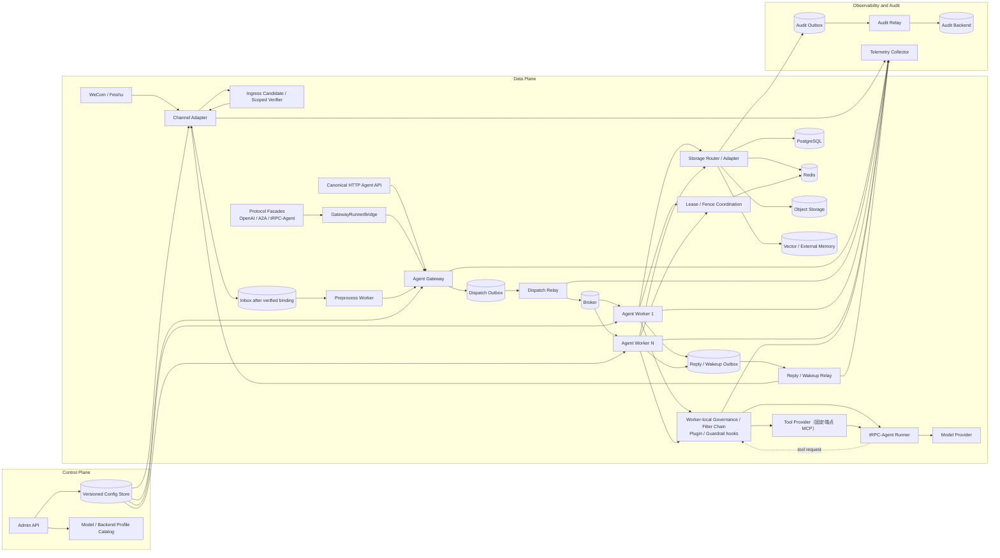
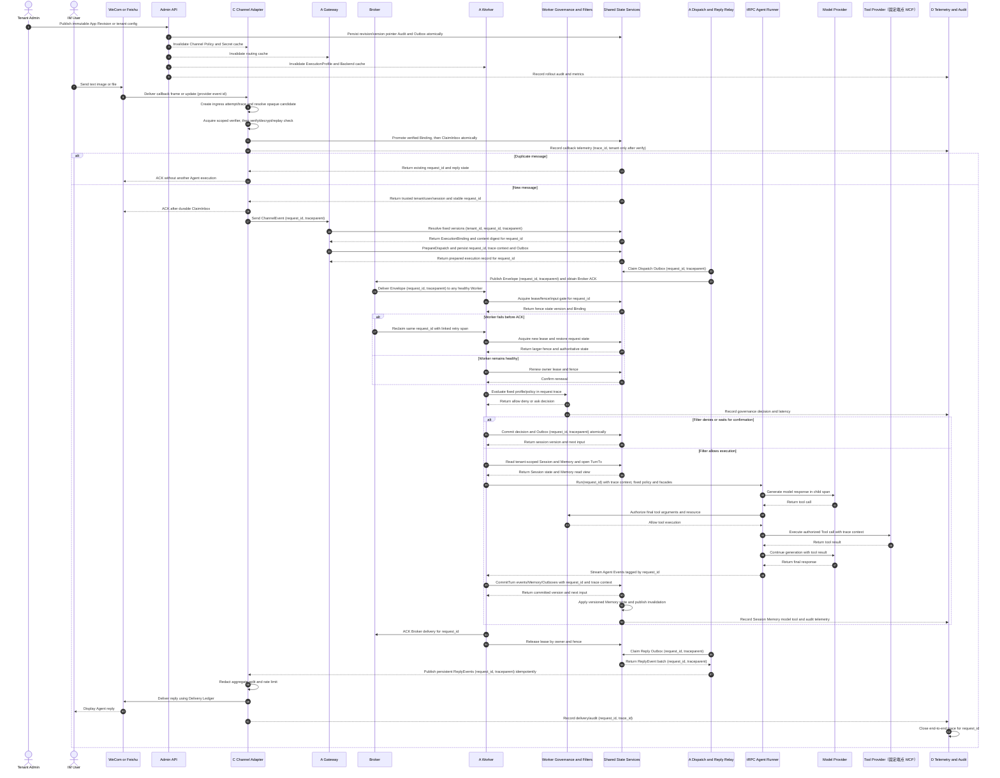
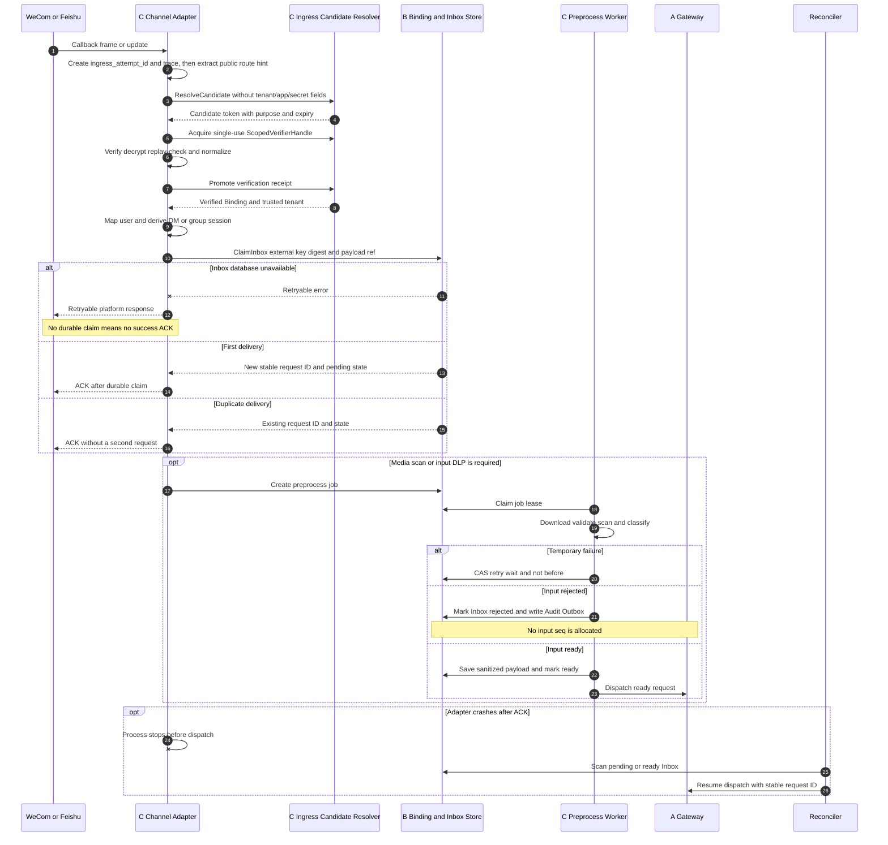
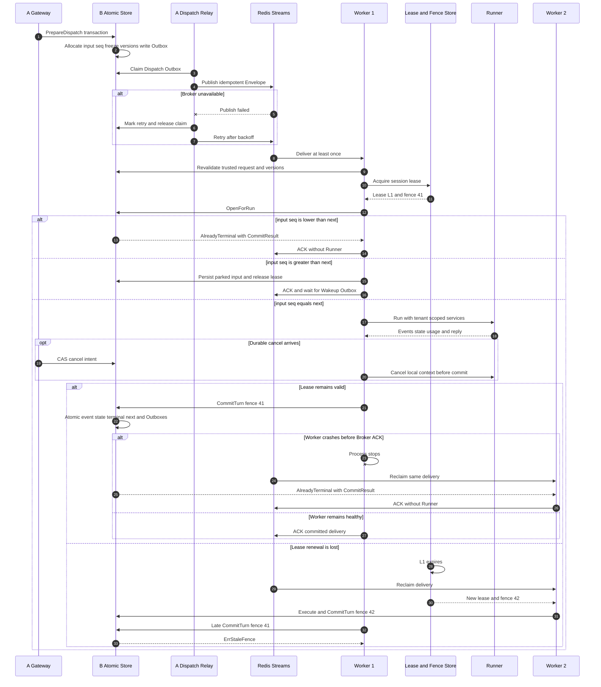
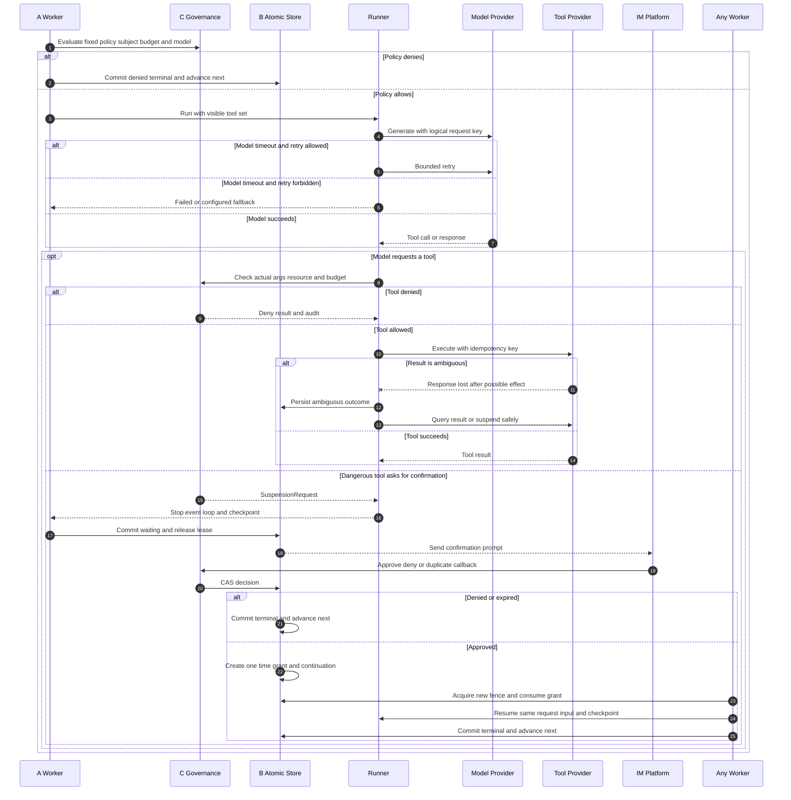
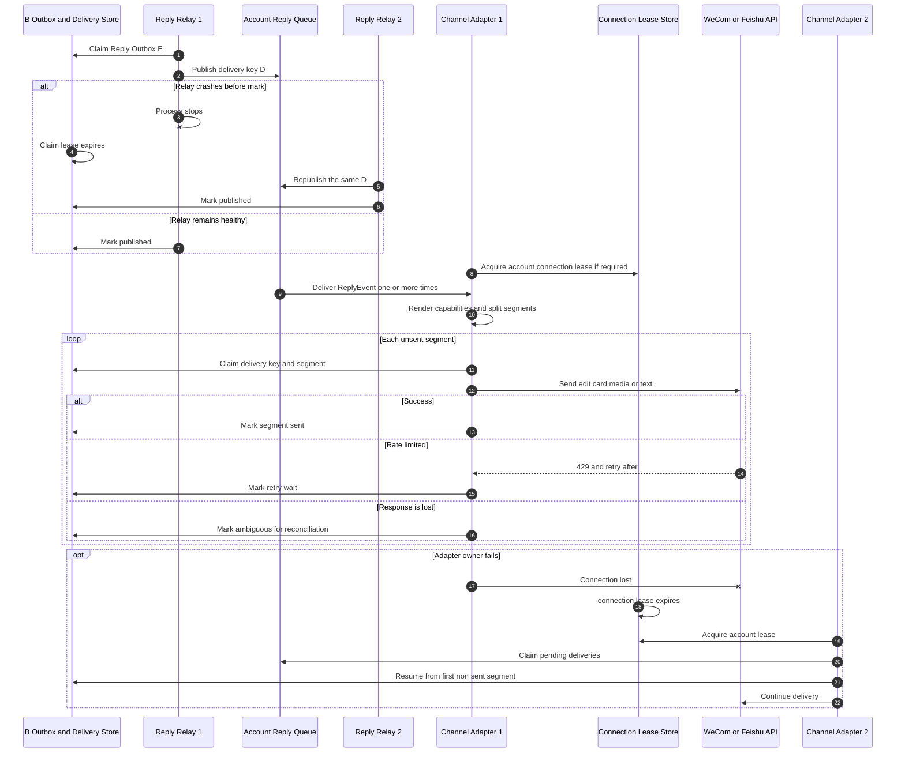
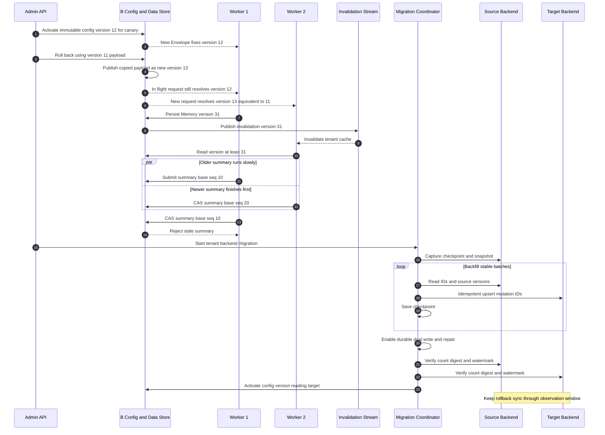
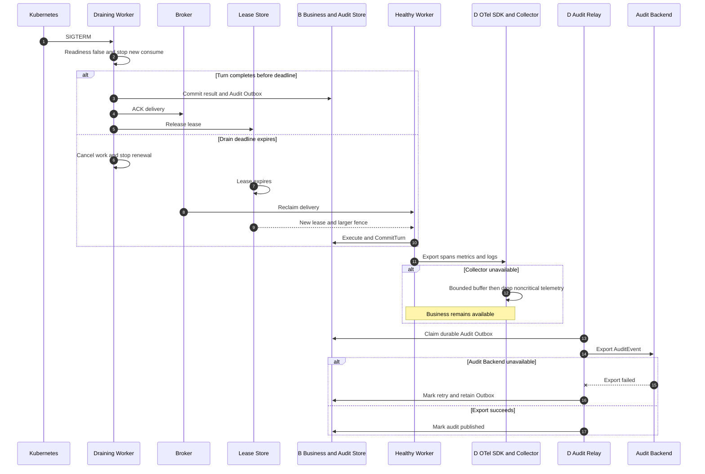

# `trpc-agent-service` 多租户多节点总体技术方案

| 文档属性 | 内容 |
|---|---|
| 状态 | 规范性技术方案 |
| 适用仓库 | `trpc-agent-service` |
| 框架依赖 | 核心 `trpc-agent-go` 的 Agent/Runner、Storage、Tool/Skill、Plugin/Callbacks、Knowledge、Server 与 Telemetry 公共 API；`tool/mcp` client 经 service 适配层接入固定 HTTPS 端点。IM 层使用 service-owned Adapter 并保持 OpenClaw Channel 生命周期语义兼容；产品运行时和 `internal` 实现不进入服务核心 |
| 关联设计 | [Tenant 根实体](1.tenant-root-design.md)、[Gateway/Worker](2.gateway-worker-design.md)、[Storage](3.storage-data-consistency-design.md)、[IM/治理/安全](4.channel-governance-security-design.md)、[可观测/审计/运维](5.observability-audit-devops-design.md) |

## 1. 设计目标与适用范围

`trpc-agent-service` 是构建在 `trpc-agent-go` 公共 API 之上的服务化运行时，负责多租户控制面、IM 接入、分布式调度、共享数据、治理、审计和部署。`trpc-agent-go` 继续负责 LLM/Graph/Chain/Parallel/Cycle Agent、Runner、Model、Tool/Skill、Knowledge、Session、协议 Server 及公开观测扩展点；其中 `tool/mcp` 已由 service 适配为受发布 Revision 固定的 HTTPS 远端工具，Memory 与 Artifact 的公共 API 当前没有作为运行时后端直接接入。

本方案适用于多租户 IM Agent 的开发、测试和生产部署，重点保证租户隔离、单 Session 串行语义、节点故障接管、消息幂等和全链路可审计。

架构边界如下：

- `trpc-agent-service` 不复制 Agent 编排、协议转换或通用数据接口。IM 层以 service-owned `channels/contract.Adapter` 定义生命周期和出站能力，并扩展多租户验签、Binding、Inbox 与 Delivery Ledger；OpenClaw 独立模块、产品运行时和任何 `internal` 实现不得进入服务核心。
- `trpc-agent-service` 负责服务级控制面、数据面和运维面能力。
- `trpc-agent-go` 负责通用 Agent 执行抽象、协议 façade 及公开的 Session、Memory、Artifact、Knowledge、Skill 和 telemetry hook；service 通过 tenant-aware facade/bridge 注入平台语义。
- 具体存储厂商和 IM 协议通过稳定端口接入，不进入 Runtime 核心契约。

<a id="component-topology"></a>

## 2. 架构原则与组件拓扑

系统遵循以下原则：

1. 可信租户上下文只由服务端认证结果或 Channel Binding 生成。
2. Worker 无状态运行，所有权威状态均位于共享后端。
3. Broker 提供 at-least-once 投递，Inbox、Commit 和 Delivery Ledger 提供效果幂等。
4. Session 互斥依赖 lease 与单调 fence，Broker 分片不承担互斥职责。
5. 跨事务域写入统一使用 Transactional Outbox。
6. 请求进入执行队列后固定 Config、service-owned ExecutionProfile、Policy 和 Backend 版本。
7. 分布式正确性能力缺失时启动失败，不允许静默降级。
8. Governance/Filter Chain 是每个 Worker 内嵌的安全执行边界，对应 Plugin/Guardrail 扩展点和工具权限原语，不是可绕过的独立旁路服务。
9. 公开 Channel route 在协议验签前只能解析为不含 tenant/app/Secret 的短期候选能力；验签成功后才能建立 TenantContext、ClaimInbox 和租户级审计。
10. Model/Backend Profile 使用受信 Provider Catalog 做严格 schema 校验并形成无密钥版本快照；Profile 引用参与运行时解析，但不改变 AgentAppRevision 的唯一 Agent 版本地位。
11. Channel Adapter 是 `ID/Run` 生命周期语义的兼容超集；工具链不兼容的 OpenClaw 独立模块和 Telegram 等 `internal` Provider 不进入依赖图，也不得绕过服务的可信入口与持久化边界。



| 组件 | 核心职责 | 权威状态 | 水平扩展依据 |
|---|---|---|---|
| Channel Adapter | 协议验签、解密、消息规范化、durable ACK、回复转换与投递 | 无；依赖 Binding、Inbox 和 Delivery Ledger | callback QPS、账号连接数、delivery backlog |
| Preprocess Worker | 媒体下载、类型校验、病毒扫描、输入 DLP 和格式转换 | 无；任务状态由 B 持久化 | preprocess backlog、媒体带宽 |
| Agent Gateway | 可信租户复核、准入、版本固定、PrepareDispatch、status/cancel API | 无；execution record 由 B 持久化 | 请求 QPS、入队延迟 |
| Protocol Facade / GatewayRunnerBridge | 复用 OpenAI/A2A/tRPC-Agent 协议与事件转换，桥接规范 Gateway API；AG-UI 因固定依赖不提供公共包而关闭 | 无；Task/Event Store 为权威 | 协议请求 QPS、活跃流订阅；不得本地执行 Runner |
| Dispatch/Reply/Wakeup/TenantControl Relay | claim Outbox、幂等发布、缓存失效、取消水位、重试和对账 | 无；发布状态由 B 持久化 | Outbox lag、oldest event age |
| Broker | 提供分片、Consumer Group、pending 和 at-least-once delivery | delivery/pending；不保存业务终态 | shard lag、delivery throughput |
| Agent Worker | 获取 session 执行权、解析固定 ExecutionProfile/Policy、装配 Agent/Skill/Knowledge、运行 Runner、CommitTurn | 无；执行状态位于共享后端 | queue lag、活跃 Session、模型并发 |
| Worker-local Governance / Filter Chain | Tenant/Subject、DLP、预算、模型/工具白名单、参数/资源授权、危险操作确认和输出治理；映射 Plugin/Guardrail/Filter 扩展点 | 无；固定 PolicySnapshot 和确认状态由共享后端提供 | 随 Worker 水平扩展；治理耗时和 deny/ask 比率独立观测 |
| Lease/Fence Coordination | 原子生成 fence，获取、续租和释放 session lease | Redis coordination state | active lease QPS、renew latency |
| Storage Router/Adapter | 强制 tenant scope，选择 Session/Memory/Artifact/Knowledge/Audit 后端 | BackendBinding 与后端权威数据 | backend QPS、连接池和延迟 |
| Admin API | 管理 Tenant、AgentApp、Binding、ConfigSnapshot、灰度和回滚 | PostgreSQL Config Store | 管理请求 QPS；通常独立小规模部署 |
| Audit Relay | 从 Audit Outbox 可靠导出审计事件 | Audit Outbox 和审计后端 | audit lag、export throughput |
| Telemetry Collector | 接收、处理并导出 trace、metric 和 log | 非业务权威状态 | telemetry throughput、queue usage |

## 3. 租户控制面领域模型

控制面至少包含以下领域对象：

```text
Tenant
  tenant_id
  tenant_key / display_name
  status
  request/concurrency quota
  monthly token/cost budget + currency
  audit retention/payload mode + log masking + trace sampling
  default_agent_app_id / default_backend_profile_id
  active_config_version
  version / created_at / updated_at

AgentApp
  tenant_id + agent_app_id
  stable agent_app_key / display_name
  status / current_revision / version

AgentAppRevision
  tenant_id + agent_app_id + revision
  immutable prompt and agent schema
  versioned model/tool/knowledge refs
  content_digest / published_at

ConfigSnapshot
  tenant_id + config_version
  channel/backend/default binding refs
  rollout_state
  immutable_payload_digest

ChannelBinding
  tenant_id + channel + external_account_id
  agent_app_id
  secret_ref
  callback/transport config

BackendBinding
  tenant_id + domain
  backend_type
  backend_ref
  credential_ref
  capability set

Usage/Audit Ledger
  tenant-scoped immutable usage and audit facts
  currency / token / cost_micros
  export and retention execution state
```

tenant 根实体的规范字段、DDL、状态机和复合外键见 [Tenant 根实体与运行时边界技术方案](1.tenant-root-design.md)。根表保持窄，不保存应用、模型、工具、Channel、Backend 参数或 Secret。

Agent App 的执行定义以不可变 Revision 发布，`current_revision` 是新请求的 App 定义指针；ConfigSnapshot 独立承载租户级 Channel、Backend 和默认组合配置。两者不能形成含义重复的版本：运行时 `ExecutionProfileSnapshot` 只是 App Revision、ConfigSnapshot 和 PolicySnapshot 的派生投影，不拥有独立持久版本。完整模型见[控制面领域模型（第二部分）](1.tenant-root-design.md)。

Revision 和 ConfigSnapshot 激活后都不可原地修改。Agent App 回滚把 `current_revision` 指向历史 published Revision，同时单调递增 App version；Config 回滚把目标历史 payload 复制为新的更大 `config_version` 后再切换 `active_config_version`，不得让配置发布头倒退。`PrepareDispatch` 成功提交的请求继续使用 Envelope 固定的 App Revision、Config 和 Policy 版本。仅完成 ClaimInbox 的消息尚未获得执行资格，必须按最新 tenant/app 状态通过入口门禁。

## 4. 租户上下文与运行标识

三者各自承担不同职责：

- `TenantContext`：由可信入口建立的安全和路由身份，只包含租户、应用、主体和来源；不把尚未解析的运行版本伪装成身份事实。
- `ExecutionBinding`：`PrepareDispatch` 从控制面一致读视图解析出的固定 App Revision、Config 和 Policy 版本。
- `SessionInfo`：一次 Runner/Session 调用使用的 AppName、UserID、SessionID 等运行信息。
- `AppName`：与 `trpc-agent-go` 现有 Session key 兼容且便于运维阅读的应用名，不是租户认证凭据。

`TenantContext` 与 `ExecutionBinding` 的字段、类型和构造边界以[控制面领域模型（第一部分 §7.2）](1.tenant-root-design.md)为唯一权威定义；本节只描述它们在总体架构中的职责与流转关系。

Channel/Gateway 先建立 TenantContext，`PrepareDispatch` 再生成 ExecutionBinding，并将两者共同写入权威 execution record 和 Envelope。Worker 必须从 TaskStore 复核两者，不能接受调用方自行注入的版本绑定。

服务端根据可信 Tenant 和 Agent App 根实体计算 AppName，规范格式为 `tenantSlug/agentAppSlug`。校验必须基于结构化字段与固定 Config/App Revision 精确匹配，不得通过字符串前缀或后缀推导 tenant。客户端提交的 AppName 仅作为可选期望值；与服务端结果不一致时请求被拒绝。

## 5. 用户身份与 Session 标识

内部 session key 始终包含：

```text
tenant_id + agent_app_id + session_id
```

内部 UserID 和 SessionID 使用带版本的 canonical encoding 与确定性 HMAC，避免拼接碰撞和外部 ID 泄露：

```text
User:  HMAC(tenant_identity_key, channel | account | external_user)
DM:    HMAC(tenant_session_key, channel | account | "dm" | external_user)
Group: HMAC(tenant_session_key, channel | account | "group" | external_chat)
```

实现必须使用长度前缀或等价 canonical encoding，不得直接连接可变长字段。详细规则见 [Tenant 根实体文档（第一部分第 7.3 节）](1.tenant-root-design.md)。

同一用户跨群默认形成不同 session；跨租户永远不同。若产品支持跨群连续记忆，只能通过租户策略将独立 session 的内容写入租户作用域 Memory，不能复用 session ID。

## 6. 核心处理链路

核心链路为：`IM → Channel Adapter → Inbox/Preprocess → Gateway → Dispatch Outbox → Broker → Worker → Governance/Filter → Runner → Model/Tool → Session/Memory → CommitTurn → Reply Outbox → Channel Adapter → IM`。规范性端到端时序见第 12 节，关键异常与恢复分支见第 13 节。

## 7. 跨进程执行契约

跨进程只传可序列化、固定版本的事实，不传 Runner、Model、Tool、数据库客户端或密钥。`ExecutionEnvelope` 的字段、类型和演进规则以 [Gateway/Worker 文档（§2.1）](2.gateway-worker-design.md)为唯一权威定义；本节只规定其架构语义。

Worker 必须重新读取指定版本并验证租户、应用、Revision、digest 和能力，不能使用“当前 latest”替代 Envelope 固定版本。`AgentAppRevision` 是 Agent 定义的唯一发布版本；运行时投影不得再维护第二套版本计数。

## 8. 一致性模型与后端基线

- Session head、input 顺序、提交结果和业务 Outbox：强一致/CAS。
- Memory 提炼和向量索引：默认最终一致，支持请求级 read-your-writes overlay。
- Summary：异步生成，但以 `base_session_seq` 单调提交。
- Artifact：对象本身可最终一致，元数据和租户授权必须强一致。
- Audit：业务提交时写 Audit Outbox，异步导出且可重放。

基线部署采用 PostgreSQL 作为权威事务存储、Redis Streams 作为 Broker、Redis 作为 lease/fence 协调后端。SQL 与 Redis 属于不同事务域，因此派发和回复统一经过 Outbox。

<a id="stateless-worker"></a>

## 9. Worker 无状态模型

Worker 进程内只允许保存可失效、可重建的数据：

- 带版本的配置和 ExecutionProfile 缓存；
- 模型/后端客户端连接池；
- 当前执行 goroutine 和续租器；
- 指标聚合缓冲。

权威 Session、Memory、执行状态、确认状态和回复游标必须共享持久化。节点失效后由 lease 过期、Broker 重投和 fence 拒绝旧 owner 完成接管，因此不需要 sticky session。

## 10. 租户隔离与安全边界

- 所有请求在 Adapter/Gateway 和 Worker 两次验证 TenantContext 与固定快照。
- Storage Adapter 无条件追加 tenant scope，不允许调用者传入未限定查询。
- 工具列表按 PolicySnapshot 构造；工具隐藏与授权必须由运行时强制执行，不得依赖模型提示词。
- Channel、Worker 和 Admin API 使用不同工作负载身份及最小 Secret 权限。
- payload、模型内容、工具参数和外部用户 ID 按数据等级脱敏。
- 租户停用、密钥撤销和危险策略变更必须 fail closed。

## 11. 进程与部署形态

同一二进制提供多个角色：

```text
trpc-service all
trpc-service gateway
trpc-service worker
trpc-service relay --kind=dispatch|reply|wakeup|tenant-control
trpc-service channel --provider=wecom|feishu
trpc-service preprocess
trpc-service audit-relay
trpc-service admin
trpc-service migrate
```

本地端到端验证使用 `webui-local` 组合角色；生产环境按 `artifact`、`preprocess`、`channel`、`channel-delivery`、`gateway` 和 `worker` 角色独立扩缩和授权。

## 12. 端到端交互时序

下图定义控制面发布、消息接入、分布式执行、回复投递和观测闭环的规范性交互顺序。交互编号由 Mermaid `autonumber` 生成，作为设计评审、测试用例和故障复盘的稳定引用。

标识传播规则直接体现在消息标签中：Channel Adapter 在可信边界创建或按策略接续 W3C Trace Context，`ClaimInbox` 原子生成稳定 `request_id`；重复回调返回同一 `request_id`。此后每个同步调用都通过 context 传播 trace，每个异步载荷都持久化 `request_id + traceparent/tracestate`。异步重投创建新 span，并保留原 trace 或使用 span link；不得因重试生成新的业务 `request_id`。



交互编号按图中声明顺序分配：27–29 为故障接管，30–31 为正常续租，35–36 为拒绝或等待确认，37–52 为允许执行。Preprocess 在交互 16–17 之间展开，`input_seq` 三态在交互 25–26 展开，confirmation continuation 从交互 24–25 重新进入执行链；详细分支见第 13 节。

### 12.1 交互阶段划分

| 阶段 | 交互编号 | 责任模块 | 阶段完成条件 |
|---|---:|---|---|
| 配置发布 | 1–6 | B、C、D、Admin API | App Revision 或 ConfigSnapshot 不可变持久化，指针、审计和失效 Outbox 原子提交 |
| IM 接入与幂等 | 7–16 | B、C | 外部消息完成协议校验与 ClaimInbox；重复消息返回既有结果，新消息获得 durable ACK |
| 请求标准化与派发 | 17–23 | A、B、C | 固定执行版本，生成 execution record，并通过 Dispatch Outbox 可靠发布 |
| Worker 调度与所有权 | 24–31 | A、B | Worker 完成 Envelope 复核、lease/fence 获取、input gate 或故障接管 |
| 治理与 Agent 执行 | 32–52 | A、B、C、D | 固定策略完成决策；允许路径显式完成 Session/Memory 读取、Model/Tool 调用、CommitTurn 和 Memory 可见性 |
| 执行收尾 | 53–57 | A、B | Broker delivery 已 ACK，lease 安全释放，ReplyEvent 写入持久回复流 |
| IM 回复与观测闭环 | 58–62 | C、D | 回复完成脱敏、分片和幂等投递，审计可查询，Trace 闭合 |

### 12.2 核心时序约束

- 交互 11 成功是外部消息可靠接收的边界。未完成 ClaimInbox 时不得向 IM 平台返回成功 ACK。
- 重复消息执行交互 13–14；新消息执行交互 15–62。二者共享同一个外部消息幂等键。
- 交互 20–23 采用 Transactional Outbox：B 在 PostgreSQL 事务内保存 execution record 与 Dispatch Outbox，A 的 Relay 负责发布 Broker。
- 交互 25–26 包含 `input_seq < next`、`input_seq == next`、`input_seq > next` 三态门禁。
- 交互 27–29 表示故障接管，交互 30–31 表示正常续租；两条分支均不得绕过持久化 fence 校验。
- 交互 35–36 表示拒绝或等待确认，交互 37–52 表示允许执行。终态推进 `next_input_seq`，`waiting_confirmation` 不推进。
- 交互 49–50 必须以 CommitTurn 原子提交 Session event、state、terminal、`next_input_seq`、Memory durable intent 和业务 Outbox。
- 交互 51 的 Memory 写入允许跨后端最终一致，但必须由已提交 intent 重试，并通过 version/失效通知实现跨节点可见。
- 交互 55–62 仅负责回复投递和观测，不得重新触发 Agent 执行。

## 13. 关键分支交互时序

本节展开主时序中的重复投递、并发竞争、外部依赖故障和恢复分支。组件内部字段、状态转换和错误分类以对应模块设计为准。

<a id="im-ingress-sequence"></a>

### 13.1 IM 消息接入、租户解析与预处理



设计约束：公开 route 只能产生无 tenant/secret 的短期候选能力；TenantContext 来自验签成功后的 VerifiedBinding；验签前只记录 ingress attempt/trace，不创建租户业务 request；ClaimInbox 原子保存稳定 request ID 和 payload ref；重复回调、Adapter 崩溃和预处理重试不得重复运行 Agent。

### 13.2 请求派发、Worker 调度与故障接管



设计约束：分片不代替 lease；较大 input 被 park 而不空转；SQL 与 Redis 之间通过 Outbox 协作；旧 Worker、重投和 ACK 丢失均不得产生第二次业务效果。

### 13.3 运行时治理、模型工具调用与危险操作确认



设计约束：工具同时实施可见性与执行前授权；waiting 状态不推进 next；grant 只能消费一次；有副作用工具的模糊结果不得盲目重放。

### 13.4 回复发布、IM 投递与 Channel 节点接管



设计约束：回复权威状态位于共享 Outbox、队列和 Delivery Ledger；已确认分片不得重发；Channel 节点故障不得绑定 Session 或触发 Agent 重跑。

### 13.5 配置发布、派生数据一致性与后端迁移



设计约束：在途请求使用固定配置；Memory 通过版本检查修复通知丢失；Summary 水位单调；迁移必须具备 checkpoint、幂等双写、对账和回滚窗口。

### 13.6 节点摘流、可观测降级与审计恢复



设计约束：Drain 先摘流，超时后由新 fence 接管；Telemetry 允许有界降级，审计意图必须保存在可重放的 Audit Outbox。

### 13.7 时序场景与验收测试映射

| 时序 | 覆盖测试 |
|---|---|
| 13.1 | Provider contract、并发 callback、durable ACK、Preprocess reclaim |
| 13.2 | 多 Worker、乱序、stale fence、Broker/Worker crash、cancel race |
| 13.3 | Policy、预算并发、模型/工具异常、checkpoint/resume、grant once |
| 13.4 | Reply 重投、分片、429、ambiguous、Adapter owner failover |
| 13.5 | 配置回滚、cache convergence、Summary CAS、migration rehearsal |
| 13.6 | Kubernetes drain、Collector outage、Audit replay |
