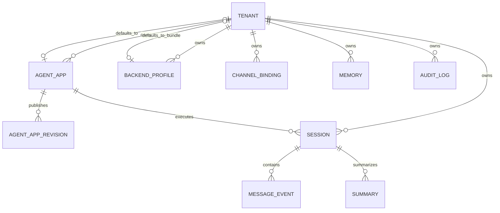
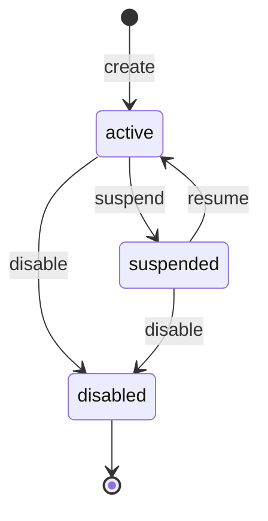
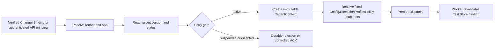
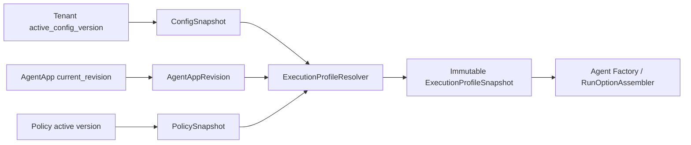
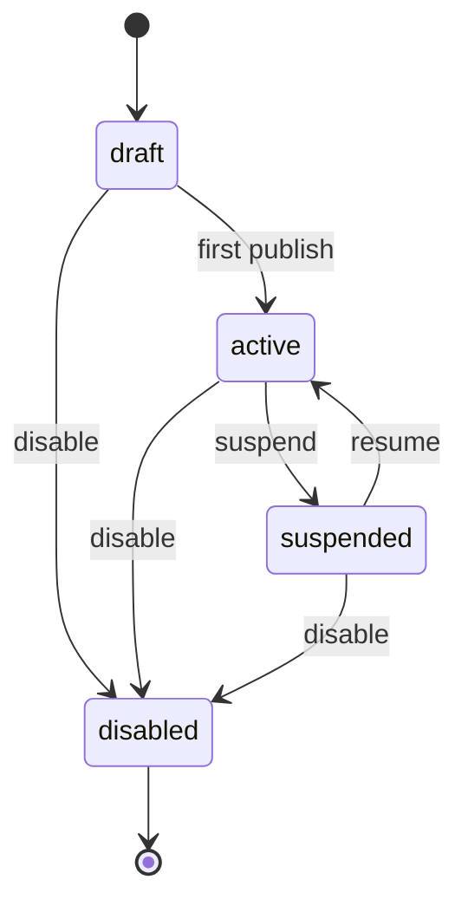

# Tenant、Agent App 与 Provider Profile 控制面领域模型

| 文档属性 | 内容 |
|---|---|
| 设计状态 | 规范性技术方案 |
| 适用范围 | Tenant 根实体、Agent App/Revision、生命周期、发布/回滚、运行时绑定与事务性审计 |
| 不包含 | Model、Tool、Channel、Backend 和 Secret 的独立领域 Schema、连接参数或明文 |
| 关联模块 | A Gateway/Worker、B Storage、C Channel/Governance、D Audit/Telemetry |
| 总体架构 | [多租户多节点总体技术方案](0.architecture.md) |

本文统一定义控制面的核心领域：Tenant 是配置、数据、权限、审计与成本归属的顶层隔离根；Agent App 是租户内可独立发布、回滚和路由的应用根；Model/Backend Profile 是被 Revision 或 ConfigSnapshot 精确引用的无密钥 provider 配置。它们共享 tenant-leading 约束、乐观锁、不可变发布、事务 Outbox 与审计规则，但保持独立的身份、生命周期和版本语义。

## 第一部分 Tenant 根实体与运行时边界

### 1. 设计目标与范围

`tenant` 是配置、数据、权限、密钥授权、审计和成本归属的顶层隔离键。根表只保存全局、高频读取且需要统一并发控制的控制面字段，不承担应用配置容器职责，也不保存 Secret 或可无限增长的历史。

本方案交付：

- tenant 身份、状态、入口级配额、预算、审计默认策略、默认引用、版本和时间戳；
- `active/suspended/disabled` 状态机及其入口、在途任务和读取语义；
- 同租户复合外键、乐观锁、缓存失效和事务性状态审计；
- TenantContext、SessionInfo、AppName、AgentFactory 和 OpenTelemetry 的映射；
- Agent App 稳定身份、不可变 Revision、发布/回滚和运行时执行快照；
- 其余关联核心表的有序占位与职责边界。

Agent App 结构与发布协议由本文第二部分定义；模型注册、工具授权、Channel、Backend 连接参数和 Secret 由各领域文档独立定义。Tenant 根表不得通过 JSONB 承载这些配置。

ModelProfile、BackendProfile、Provider Catalog、Secret scope 和 Factory 输入的完整契约见本文第三部分。Profile 不得变成第二套 Agent 定义版本。

### 2. 设计决策与不变量

1. **窄根表。** 根表只保存跨应用生效且入口高频读取的字段；可独立发布、灰度、回滚或停用的配置必须下沉到关联表。
2. **不可变隔离键。** `tenant_id`、`tenant_key` 创建后不可修改；`display_name` 可修改但不参与路由、鉴权或唯一性判断。
3. **显式 tenant scope。** 所有租户数据、缓存、消息和审计事件显式携带 `tenant_id`；前缀、Schema 或数据库实例隔离只能作为附加防线。
4. **默认引用不跨租户。** 默认对象通过 `(tenant_id, id)` 复合外键约束，不允许平台级静默回退。
5. **`NULL` 与 `0` 不同。** 配额或预算为 `NULL` 表示未设置上限，`0` 表示明确禁止使用该资源。
6. **用量事实不可变。** 根表保存限制，不保存可竞争更新的实际累计值；token、金额和请求用量由 Usage/Audit Ledger 聚合。
7. **审计与遥测分离。** 必需审计事件不受 trace 采样率影响；Audit Outbox 与状态变化在同一数据库事务中提交。
8. **状态是入口闸门。** `PrepareDispatch` 提交成功是任务被执行系统接受的边界；仅 ClaimInbox 不代表获准执行。
9. **版本并发控制。** 控制面更新必须携带 expected version 并执行 CAS；缓存由版本和失效事件驱动，TTL 只作为兜底。
10. **密钥不落根表。** IM token、模型 API key、数据库密码及其密文均不进入 tenant；根表最多保存配置对象的非敏感引用。

### 3. 领域边界



| 对象 | 归属职责 | tenant 根表不保存的内容 |
|---|---|---|
| `agent_app` / `agent_app_revision` | 稳定 App 身份、不可变发布版本及 service-owned ExecutionProfile 投影 | Agent 定义、prompt、模型参数和工具清单；详见本文第二部分 |
| `backend_profile` | 一组可复用的后端能力与凭据引用 | DSN、密码、厂商 Secret |
| `tenant_backend_binding` | 将 session/memory/artifact/knowledge/audit 数据域映射到 profile | 具体后端客户端状态 |
| `channel_binding` | 外部账号到 tenant/app 的可信绑定 | callback token、AES key 明文 |
| `config_snapshot` | 不可变应用执行快照和 active pointer | tenant 生命周期状态 |
| `audit_log` / Usage Ledger | 不可变行为与用量事实 | 根表中的可变累计计数 |

`default_backend_profile_id` 仅在 `backend_profile` 表示完整的“后端配置组合”时有效。若一个 profile 只描述一个数据域，则不得使用单一默认字段，必须通过 `tenant_backend_binding(tenant_id, domain, backend_profile_id)` 逐域配置。

`default_agent_app_id` 为空时，Gateway 必须拒绝没有显式 app 路由的请求；不得回退到平台默认应用或其他租户应用。默认 Backend 不存在或缺少所需 capability 时 Storage Router 同样 fail closed，不得静默切换到平台共享后端。

### 4. 字段定义

| 字段 | 类型 | 可空 | 约束与语义 | 主要消费者 |
|---|---|---:|---|---|
| `tenant_id` | text | 否 | `t_` + ULID，不可变主键 | 全部组件 |
| `tenant_key` | text | 否 | 2–64 字符；小写字母开头，仅含小写字母、数字和连字符；全局唯一且不可变 | Admin API、路由配置 |
| `display_name` | text | 否 | 可修改展示名，不参与路由 | Admin API、受控 UI |
| `status` | text | 否 | `active/suspended/disabled` | Channel、Gateway、Worker、Admin |
| `request_limit_per_minute` | bigint | 是 | `NULL` 不限，`0` 禁止新请求 | Gateway、Rate Limiter |
| `max_concurrent_executions` | integer | 是 | `NULL` 不限，`0` 禁止执行 | Gateway、Worker Scheduler |
| `monthly_token_budget` | bigint | 是 | `NULL` 不限，`0` 为零额度 | Governance、Billing |
| `monthly_cost_budget_micros` | bigint | 是 | `billing_currency` 主货币单位的百万分之一，例如 USD micro-dollar | Governance、Billing |
| `billing_currency` | char(3) | 否 | 大写 ISO-4217 代码；Usage Ledger 同字段 | Billing、Audit |
| `audit_retention_days` | integer | 否 | 租户期望保留期；仍受平台法定下限约束 | Audit Relay、Retention Job |
| `audit_payload_mode` | text | 否 | `metadata_only/redacted/encrypted_reference` | Audit、Redactor |
| `log_masking_level` | text | 否 | `none/basic/strict`；仅控制额外 PII 脱敏，Secret 在所有级别均禁止记录 | Logging、Audit、Telemetry |
| `trace_sampling_rate` | numeric(5,4) | 否 | `[0,1]`；不控制必需审计 | Telemetry |
| `default_agent_app_id` | text | 是 | 未显式路由时的默认应用；同租户复合 FK | Gateway |
| `default_backend_profile_id` | text | 是 | 仅指完整后端组合；同租户复合 FK | Storage Router |
| `active_config_version` | bigint | 是 | 当前已发布控制面快照；同租户复合 FK | Gateway、Worker |
| `version` | bigint | 否 | 从 1 开始的乐观锁版本 | Admin API、Cache |
| `created_at` | timestamptz | 否 | 数据库生成 | Admin、Audit |
| `updated_at` | timestamptz | 否 | 每次有效更新由数据库维护 | Admin、Cache |

根表不保存 `used_tokens`、`used_cost` 或 `active_execution_count`。这些值分别来自 Usage Ledger 和分布式并发协调器，避免把高频数据面写入控制面根行。

金额全链使用 `int64 cost_micros + ISO-4217 currency`，不得使用浮点数。模型供应商的 Decimal 计价先按已发布计费版本转换到 tenant billing currency，再以明确的舍入规则写入 Usage Ledger；预算判断和审计复用同一已定价事实。

### 5. PostgreSQL 基线 DDL

```sql
CREATE TABLE tenant (
  tenant_id                    text           PRIMARY KEY,
  tenant_key                   text           NOT NULL UNIQUE,
  display_name                 text           NOT NULL,
  status                       text           NOT NULL DEFAULT 'active',
  request_limit_per_minute     bigint,
  max_concurrent_executions    integer,
  monthly_token_budget         bigint,
  monthly_cost_budget_micros   bigint,
  billing_currency             char(3)        NOT NULL DEFAULT 'USD',
  audit_retention_days         integer        NOT NULL DEFAULT 180,
  audit_payload_mode           text           NOT NULL DEFAULT 'redacted',
  log_masking_level            text           NOT NULL DEFAULT 'basic',
  trace_sampling_rate          numeric(5,4)   NOT NULL DEFAULT 0.0100,
  default_agent_app_id         text,
  default_backend_profile_id   text,
  active_config_version        bigint,
  version                      bigint         NOT NULL DEFAULT 1,
  created_at                   timestamptz    NOT NULL DEFAULT clock_timestamp(),
  updated_at                   timestamptz    NOT NULL DEFAULT clock_timestamp(),

  CONSTRAINT tenant_id_format_ck
    CHECK (tenant_id ~ '^t_[0-7][0-9A-HJKMNP-TV-Z]{25}$'),
  CONSTRAINT tenant_key_format_ck
    CHECK (
      tenant_key = lower(tenant_key)
      AND length(tenant_key) BETWEEN 2 AND 64
      AND tenant_key ~ '^[a-z][a-z0-9-]{1,63}$'
    ),
  CONSTRAINT tenant_display_name_ck
    CHECK (length(btrim(display_name)) BETWEEN 1 AND 200),
  CONSTRAINT tenant_status_ck
    CHECK (status IN ('active', 'suspended', 'disabled')),
  CONSTRAINT tenant_request_limit_ck
    CHECK (request_limit_per_minute IS NULL OR request_limit_per_minute >= 0),
  CONSTRAINT tenant_concurrency_limit_ck
    CHECK (max_concurrent_executions IS NULL OR max_concurrent_executions >= 0),
  CONSTRAINT tenant_token_budget_ck
    CHECK (monthly_token_budget IS NULL OR monthly_token_budget >= 0),
  CONSTRAINT tenant_cost_budget_ck
    CHECK (monthly_cost_budget_micros IS NULL OR monthly_cost_budget_micros >= 0),
  CONSTRAINT tenant_currency_ck
    CHECK (billing_currency ~ '^[A-Z]{3}$'),
  CONSTRAINT tenant_audit_retention_ck
    CHECK (audit_retention_days >= 1),
  CONSTRAINT tenant_audit_payload_mode_ck
    CHECK (audit_payload_mode IN ('metadata_only', 'redacted', 'encrypted_reference')),
  CONSTRAINT tenant_log_masking_level_ck
    CHECK (log_masking_level IN ('none', 'basic', 'strict')),
  CONSTRAINT tenant_trace_sampling_ck
    CHECK (trace_sampling_rate >= 0 AND trace_sampling_rate <= 1),
  CONSTRAINT tenant_active_config_version_ck
    CHECK (active_config_version IS NULL OR active_config_version >= 1),
  CONSTRAINT tenant_version_ck
    CHECK (version >= 1)
);

CREATE OR REPLACE FUNCTION maintain_tenant_update()
RETURNS trigger LANGUAGE plpgsql AS $$
BEGIN
  IF NEW.tenant_id <> OLD.tenant_id OR NEW.tenant_key <> OLD.tenant_key THEN
    RAISE EXCEPTION 'tenant identity is immutable' USING ERRCODE = '23000';
  END IF;
  IF NEW.version <> OLD.version + 1 THEN
    RAISE EXCEPTION 'tenant version must increase by exactly one' USING ERRCODE = '40001';
  END IF;
  IF NEW.status <> OLD.status AND NOT (
    (OLD.status = 'active' AND NEW.status IN ('suspended', 'disabled'))
    OR (OLD.status = 'suspended' AND NEW.status IN ('active', 'disabled'))
  ) THEN
    RAISE EXCEPTION 'illegal tenant status transition: % -> %', OLD.status, NEW.status
      USING ERRCODE = '23514';
  END IF;
  NEW.updated_at := clock_timestamp();
  RETURN NEW;
END;
$$;

CREATE TRIGGER tenant_maintain_update_trg
BEFORE UPDATE ON tenant
FOR EACH ROW EXECUTE FUNCTION maintain_tenant_update();
```

ULID 的首个 payload 字符限制为 `0–7`，避免接受超出 128-bit ULID 范围的文本；其余字符使用 Crockford alphabet 并统一为大写。Admin API 在校验前对 tenant_key 执行 trim 和小写化，数据库只接受已经规范化的值，不在唯一约束前静默折叠输入。生产环境还应限制应用角色直接更新 tenant，只允许通过 Admin Store 的受控方法执行 CAS 和状态迁移。

#### 5.1 乐观锁更新

```sql
UPDATE tenant
SET display_name = $3,
    trace_sampling_rate = $4,
    log_masking_level = $5,
    version = version + 1
WHERE tenant_id = $1
  AND version = $2
RETURNING version, updated_at;
```

返回零行表示 `ErrVersionConflict`，调用方重新读取后决定是否重试，不得覆盖未知的新版本。事务提交后写 cache-invalidation Outbox；消费者以 `(tenant_id, version)` 单调失效，本地 TTL 只处理失效事件丢失或节点长期离线。

#### 5.2 同租户复合外键

所有跨实体引用都使用同租户候选键和复合外键。`agent_app` 的主键已定义为 `(tenant_id, agent_app_id)`，不需要重复增加唯一约束：

```sql
ALTER TABLE backend_profile
  ADD CONSTRAINT backend_profile_tenant_id_uq
  UNIQUE (tenant_id, backend_profile_id);

ALTER TABLE config_snapshot
  ADD CONSTRAINT config_snapshot_tenant_version_uq
  UNIQUE (tenant_id, config_version);

ALTER TABLE tenant
  ADD CONSTRAINT tenant_default_agent_app_fk
  FOREIGN KEY (tenant_id, default_agent_app_id)
  REFERENCES agent_app (tenant_id, agent_app_id)
  DEFERRABLE INITIALLY IMMEDIATE,
  ADD CONSTRAINT tenant_default_backend_profile_fk
  FOREIGN KEY (tenant_id, default_backend_profile_id)
  REFERENCES backend_profile (tenant_id, backend_profile_id)
  DEFERRABLE INITIALLY IMMEDIATE,
  ADD CONSTRAINT tenant_active_config_fk
  FOREIGN KEY (tenant_id, active_config_version)
  REFERENCES config_snapshot (tenant_id, config_version)
  DEFERRABLE INITIALLY IMMEDIATE;
```

默认引用保持可空。删除正在被默认引用的对象采用 `RESTRICT` 语义；Admin API 必须在同一事务中先切换或清空默认引用，再停用或删除目标对象。复合外键允许使用 deferrable 约束处理同一事务内的引用切换，不能以应用层单列校验替代。

#### 5.3 状态事实与受控迁移函数

状态变化需要一个不可变事实作为 Audit 和 tenant-control Outbox 的共同载荷，不能只依赖可变 tenant 当前值：

```sql
CREATE TABLE tenant_status_change (
  tenant_id        text        NOT NULL REFERENCES tenant(tenant_id),
  event_id         bigint      GENERATED ALWAYS AS IDENTITY,
  previous_status  text        NOT NULL,
  next_status      text        NOT NULL,
  previous_version bigint      NOT NULL CHECK (previous_version >= 1),
  next_version     bigint      NOT NULL CHECK (next_version = previous_version + 1),
  actor_type       text        NOT NULL CHECK (length(btrim(actor_type)) BETWEEN 1 AND 64),
  actor_id         text        NOT NULL CHECK (length(btrim(actor_id)) BETWEEN 1 AND 256),
  reason_code      text        NOT NULL CHECK (length(btrim(reason_code)) BETWEEN 1 AND 128),
  reason_text_ref  text,
  correlation_id   text        NOT NULL CHECK (length(btrim(correlation_id)) > 0),
  trace_id         text        NOT NULL CHECK (length(btrim(trace_id)) > 0),
  occurred_at      timestamptz NOT NULL DEFAULT now(),
  PRIMARY KEY (tenant_id, event_id),
  UNIQUE (tenant_id, next_version),
  CHECK ((previous_status, next_status) IN (
    ('active', 'suspended'),
    ('active', 'disabled'),
    ('suspended', 'active'),
    ('suspended', 'disabled')
  )),
  CHECK (reason_text_ref IS NULL OR length(btrim(reason_text_ref)) > 0)
);
```

该表是状态领域事实，不是第二套通用 Audit Store。D 模块 Audit Relay 和 A 模块 tenant-control Relay 都消费 B 模块统一 `outbox` 中指向同一事实的事件，避免增加专用 Relay 或不一致的重复载荷。数据库通过以下受控函数原子写入状态、事实和 Outbox：

```sql
CREATE OR REPLACE FUNCTION transition_tenant_status(
  p_tenant_id text,
  p_expected_version bigint,
  p_next_status text,
  p_actor_type text,
  p_actor_id text,
  p_reason_code text,
  p_reason_text_ref text,
  p_correlation_id text,
  p_trace_id text,
  p_traceparent text
) RETURNS bigint
LANGUAGE plpgsql
SECURITY DEFINER
SET search_path = pg_catalog
AS $$
DECLARE
  v_previous_status text;
  v_current_version bigint;
  v_next_version bigint;
  v_payload_ref text;
BEGIN
  IF p_actor_type IS NULL OR length(btrim(p_actor_type)) = 0
     OR p_actor_id IS NULL OR length(btrim(p_actor_id)) = 0
     OR p_reason_code IS NULL OR length(btrim(p_reason_code)) = 0
     OR p_correlation_id IS NULL OR length(btrim(p_correlation_id)) = 0
     OR p_trace_id IS NULL OR length(btrim(p_trace_id)) = 0 THEN
    RAISE EXCEPTION 'tenant status transition metadata is incomplete'
      USING ERRCODE = '22023';
  END IF;

  SELECT status, version
    INTO v_previous_status, v_current_version
  FROM public.tenant
  WHERE tenant_id = p_tenant_id
  FOR UPDATE;

  IF NOT FOUND THEN
    RAISE EXCEPTION 'tenant does not exist' USING ERRCODE = 'P0002';
  END IF;
  IF v_current_version <> p_expected_version THEN
    RAISE EXCEPTION 'tenant version conflict' USING ERRCODE = '40001';
  END IF;
  IF NOT (
    (v_previous_status = 'active' AND p_next_status IN ('suspended', 'disabled'))
    OR (v_previous_status = 'suspended' AND p_next_status IN ('active', 'disabled'))
  ) THEN
    RAISE EXCEPTION 'invalid tenant status transition: % -> %',
      v_previous_status, p_next_status USING ERRCODE = '23514';
  END IF;

  v_next_version := v_current_version + 1;
  UPDATE public.tenant
  SET status = p_next_status,
      version = v_next_version
  WHERE tenant_id = p_tenant_id;

  INSERT INTO public.tenant_status_change (
    tenant_id, previous_status, next_status,
    previous_version, next_version,
    actor_type, actor_id, reason_code, reason_text_ref,
    correlation_id, trace_id
  ) VALUES (
    p_tenant_id, v_previous_status, p_next_status,
    v_current_version, v_next_version,
    p_actor_type, p_actor_id, p_reason_code, p_reason_text_ref,
    p_correlation_id, p_trace_id
  );

  v_payload_ref := format(
    'tenant-status-change://%s/%s', p_tenant_id, v_next_version
  );

  INSERT INTO public.outbox (
    tenant_id, outbox_id, kind, aggregate_id, event_seq,
    idempotency_key, payload_ref, traceparent
  ) VALUES
  (
    p_tenant_id,
    format('tenant-status-audit:%s:%s', p_tenant_id, v_next_version),
    'audit', p_tenant_id, v_next_version,
    format('tenant-status:%s:%s:audit', p_tenant_id, v_next_version),
    v_payload_ref, p_traceparent
  ),
  (
    p_tenant_id,
    format('tenant-status-control:%s:%s', p_tenant_id, v_next_version),
    'tenant-control', p_tenant_id, v_next_version,
    format('tenant-status:%s:%s:control', p_tenant_id, v_next_version),
    v_payload_ref, p_traceparent
  );

  RETURN v_next_version;
END;
$$;
```

tenant 行更新、状态事实和两类 Outbox 由函数调用所在事务共同提交；调用方失败回滚时三者全部回滚。触发器负责再次校验合法迁移和 version 恰好递增，函数负责 actor/reason/correlation/trace 完整性与 Outbox 原子写入，二者职责不能互相替代。

#### 5.4 配置更新与数据库权限边界

配置更新采用“完整替换 + expected version”，不使用无法区分“未提供”和“显式设为 NULL”的松散 PATCH。Admin Store 在单个事务中完成 tenant CAS、管理操作审计和 cache-invalidation Outbox；disabled tenant 的归档/清理使用独立受控接口，普通配置更新必须拒绝。

```sql
CREATE OR REPLACE FUNCTION update_tenant_configuration(
  p_tenant_id text,
  p_expected_version bigint,
  p_display_name text,
  p_request_limit_per_minute bigint,
  p_max_concurrent_executions integer,
  p_monthly_token_budget bigint,
  p_monthly_cost_budget_micros bigint,
  p_billing_currency char(3),
  p_audit_retention_days integer,
  p_audit_payload_mode text,
  p_log_masking_level text,
  p_trace_sampling_rate numeric,
  p_default_agent_app_id text,
  p_default_backend_profile_id text,
  p_active_config_version bigint,
  p_audit_payload_ref text,
  p_correlation_id text,
  p_trace_id text,
  p_traceparent text
) RETURNS bigint
LANGUAGE plpgsql
SECURITY DEFINER
SET search_path = pg_catalog
AS $$
DECLARE
  v_status text;
  v_current_version bigint;
  v_next_version bigint;
BEGIN
  IF p_audit_payload_ref IS NULL OR length(btrim(p_audit_payload_ref)) = 0
     OR p_correlation_id IS NULL OR length(btrim(p_correlation_id)) = 0
     OR p_trace_id IS NULL OR length(btrim(p_trace_id)) = 0 THEN
    RAISE EXCEPTION 'tenant configuration audit metadata is incomplete'
      USING ERRCODE = '22023';
  END IF;

  SELECT status, version
    INTO v_status, v_current_version
  FROM public.tenant
  WHERE tenant_id = p_tenant_id
  FOR UPDATE;

  IF NOT FOUND THEN
    RAISE EXCEPTION 'tenant does not exist' USING ERRCODE = 'P0002';
  END IF;
  IF v_status = 'disabled' THEN
    RAISE EXCEPTION 'disabled tenant configuration is immutable'
      USING ERRCODE = '55000';
  END IF;
  IF v_current_version <> p_expected_version THEN
    RAISE EXCEPTION 'tenant version conflict' USING ERRCODE = '40001';
  END IF;

  v_next_version := v_current_version + 1;
  UPDATE public.tenant
  SET display_name = p_display_name,
      request_limit_per_minute = p_request_limit_per_minute,
      max_concurrent_executions = p_max_concurrent_executions,
      monthly_token_budget = p_monthly_token_budget,
      monthly_cost_budget_micros = p_monthly_cost_budget_micros,
      billing_currency = p_billing_currency,
      audit_retention_days = p_audit_retention_days,
      audit_payload_mode = p_audit_payload_mode,
      log_masking_level = p_log_masking_level,
      trace_sampling_rate = p_trace_sampling_rate,
      default_agent_app_id = p_default_agent_app_id,
      default_backend_profile_id = p_default_backend_profile_id,
      active_config_version = p_active_config_version,
      version = v_next_version
  WHERE tenant_id = p_tenant_id;

  INSERT INTO public.outbox (
    tenant_id, outbox_id, kind, aggregate_id, event_seq,
    idempotency_key, payload_ref, traceparent
  ) VALUES
  (
    p_tenant_id,
    format('tenant-config-audit:%s:%s', p_tenant_id, v_next_version),
    'audit', p_tenant_id, v_next_version,
    format('tenant-config:%s:%s:audit', p_tenant_id, v_next_version),
    p_audit_payload_ref, p_traceparent
  ),
  (
    p_tenant_id,
    format('tenant-config-control:%s:%s', p_tenant_id, v_next_version),
    'tenant-control', p_tenant_id, v_next_version,
    format('tenant-config:%s:%s:control', p_tenant_id, v_next_version),
    format('tenant-config://%s/%s', p_tenant_id, v_next_version),
    p_traceparent
  );

  RETURN v_next_version;
END;
$$;
```

`p_audit_payload_ref` 指向提交前已写入的不可变、脱敏或加密审计载荷，至少记录 actor、变更字段摘要、correlation 和 trace；事务回滚产生的孤立对象由带宽界限的 GC 清理。tenant-control 事件只携带 tenant/version 引用，Resolver 收到旧版本事件时将缓存至少推进到该版本或直接失效，不能把缓存回退到旧快照。

| 数据库身份 | 允许能力 | 禁止能力 |
|---|---|---|
| migration owner | 建表、函数和授权 | 不用于生产请求 |
| tenant admin writer | 调用受控配置/状态函数 | 直接 UPDATE tenant、绕过 version/Outbox |
| tenant runtime resolver | 通过 typed resolver 读取单个可信 tenant 快照 | 枚举、更新或跨租户导出 |
| Gateway/Channel runtime | 调用 resolver、Binding、Inbox ports | 持有 tenant 表写权限 |
| Worker runtime | 消费固定 TenantRuntimeBinding 和 tenant-control 事件 | 直接读取或枚举 tenant 根表 |

```sql
REVOKE ALL PRIVILEGES ON tenant FROM PUBLIC;
REVOKE ALL PRIVILEGES ON tenant_status_change FROM PUBLIC;
REVOKE ALL ON FUNCTION transition_tenant_status(
  text, bigint, text, text, text, text, text, text, text, text
) FROM PUBLIC;
REVOKE ALL ON FUNCTION update_tenant_configuration(
  text, bigint, text, bigint, integer, bigint, bigint, character,
  integer, text, text, numeric, text, text, bigint, text, text, text, text
) FROM PUBLIC;
GRANT EXECUTE ON FUNCTION transition_tenant_status(
  text, bigint, text, text, text, text, text, text, text, text
) TO tenant_admin_writer;
GRANT EXECUTE ON FUNCTION update_tenant_configuration(
  text, bigint, text, bigint, integer, bigint, bigint, character,
  integer, text, text, numeric, text, text, bigint, text, text, text, text
) TO tenant_admin_writer;
```

PostgreSQL 默认可能向 PUBLIC 授予新函数 EXECUTE，migration 必须在同一事务内先撤销再授予。`SECURITY DEFINER` 函数由不可登录的专用 owner 持有，固定 `search_path`，所有对象使用 schema-qualified 名称；Admin、Gateway 和 Worker 使用不同连接身份或等价的服务端权限隔离。

### 6. 生命周期状态机



`disabled` 为终态。恢复 disabled 租户必须创建新的租户身份并通过受审计的数据迁移完成，不能复用旧 tenant ID 重新接收流量。

#### 6.1 状态行为

| 状态 | Channel/HTTP 入口 | 尚未 PrepareDispatch | 已 PrepareDispatch 或运行中 | 数据读取 |
|---|---|---|---|---|
| `active` | 正常验签、认领和准入 | 可以派发 | 正常执行与回复 | 按权限开放 |
| `suspended` | 可 durable claim 以去重并快速应答，但不得创建新执行 | 提交 `tenant_suspended` 终态，不分配 input_seq | 默认完成既有执行并允许既有 Reply 投递 | 租户用户只读按策略；管理与审计可读 |
| `disabled` | IM callback 仅完成安全 ACK/去重审计；HTTP 返回不可用 | 不派发并终态关闭 | 发出取消；仅允许安全收尾、终态提交和审计，不启动新模型/工具调用 | 仅受控管理、审计和保留任务 |

“已接受任务”严格指 `PrepareDispatch` 和 Dispatch Outbox 已在同一事务中提交。状态在 ClaimInbox 之后、PrepareDispatch 之前变为 suspended/disabled 时，该消息不得进入 Worker。

Worker 对执行记录中的 tenant version 和可信 TaskStore 绑定进行复核。`suspended` 不追溯否决已接受任务；`disabled` 触发共享取消状态，长模型/工具调用依赖 `context.Context` 取消，同时仍以 fence 阻止失去所有权的 Worker 提交。

#### 6.2 事务性状态变更

状态更新、状态审计事实和 Audit/Cache/Cancel Outbox 必须处于同一 PostgreSQL 事务：

```text
BEGIN
  SELECT tenant FOR UPDATE
  validate expected_version and legal transition
  UPDATE tenant SET status, version = version + 1
  INSERT tenant_status_change append-only fact
  INSERT Audit Outbox referencing the fact
  INSERT TenantControl Outbox carrying cache/cancellation version
COMMIT
```

审计事件至少包含：

```text
tenant_id, action=tenant.status.change,
old_status, new_status, old_version, new_version,
actor_type, actor_id, reason_code, reason_text_ref,
correlation_id, trace_id, occurred_at
```

`reason_text_ref` 指向按审计策略保存的受控内容，不把无界文本堆入 tenant 根行。任何 Outbox 写入失败都必须使状态事务回滚。disabled 不在状态事务中逐条扫描全部在途任务；单个 tenant-control 事件可靠发布后，由取消协调器按 tenant/version 设置共享取消水位并持续对账，避免无界事务。

### 7. 运行时映射

<a id="trusted-tenant-context"></a>

#### 7.1 可信租户解析



请求头、URL 参数、AppName、Envelope 和用户输入中的 tenant ID 均不是独立可信来源。它们只能作为期望值与服务端解析结果精确比较；不一致时 fail closed 并审计。

#### 7.2 TenantContext、SessionInfo 与 AppName

本节是 `TenantContext` 与 `ExecutionBinding` 字段、类型和构造语义的唯一权威定义。其他文档只引用本节；字段演进必须同步更新可信入口、`PrepareDispatch`、TaskStore 复核和对应 contract test。

```go
type TenantContext struct {
    TenantID      string
    TenantVersion int64
    AgentAppID    string
    SubjectID     string
    Channel       string
    TrustedSource string
}

type ExecutionBinding struct {
    AgentAppVersion    int64
    AgentAppRevision   int64
    AgentContentDigest string
    ConfigVersion      int64
    PolicyVersion      int64
}
```

- `TenantContext` 是服务端建立的安全、路由和授权上下文。
- `ExecutionBinding` 是 `PrepareDispatch` 根据 TenantContext 从一致控制面读视图生成的固定版本绑定；调用方不能自行构造。
- `SessionInfo` 是传给 tRPC-Agent-Go Session/Runner 的 AppName、UserID、SessionID 等运行标识。
- `AppName` 是兼容现有 Session key 和便于诊断的服务端派生值，不是认证凭据。

服务端按 `tenant_key/agent_app_key` 生成 AppName，并以结构化字段验证其与 TenantContext、Agent App Revision 和 ConfigSnapshot 精确绑定；不得通过字符串前缀或后缀反推 tenant。

<a id="session-namespace"></a>

#### 7.3 UserID 与 SessionID 命名空间

外部用户和会话标识不得直接作为跨租户主键。推荐使用版本化、租户密钥 HMAC：

```text
UserID:  u1_ + base64url(HMAC(tenant_identity_key,
         channel | len(account) | account | len(external_user) | external_user))

DM SessionID: s1_ + base64url(HMAC(tenant_session_key,
              channel | len(account) | account | "dm" | len(external_user) | external_user))

Group SessionID: s1_ + base64url(HMAC(tenant_session_key,
                 channel | len(account) | account | "group" | len(external_chat) | external_chat))
```

长度前缀或等价 canonical encoding 消除拼接歧义，HMAC 避免泄露外部平台标识。密钥只通过 ScopedSecretProvider 在可信 tenant identity/session purpose 下获取并带版本；持久化主键仍显式包含 `(tenant_id, agent_app_id, session_id)`，不能仅依赖 HMAC 碰撞概率。

#### 7.4 Agent 装配与执行版本

Runtime Bundle 构建键至少包含：

```text
(tenant_id, agent_app_id, agent_app_revision, content_digest,
 config_version, policy_version)
```

其中 `agent_app_revision` 是 Agent 定义的唯一发布版本；`ExecutionProfileSnapshot` 是 Revision、ConfigSnapshot 与 PolicySnapshot 的运行时组合结果，不再维护独立版本计数。

Gateway 在 PrepareDispatch 中固定版本，Worker 按精确版本解析并重新校验 tenant/app 绑定。一次执行不能跟随 active pointer 漂移；状态门禁是例外：`disabled` 的取消信号立即作用于在途任务，不能被旧快照屏蔽。

模型和工具 Secret 由 ScopedSecretProvider 根据 tenant/app、purpose、resource/version 授权按需注入，只存在于最小作用域内存，不进入 Agent 缓存键、Envelope、日志、trace 或错误报告。

#### 7.5 OpenTelemetry 与成本归集

| 信号 | tenant 属性规则 |
|---|---|
| Trace | 受控环境可记录 `tenant.id`、`tenant.version`、`agent_app.id`、`agent_app.revision` 和 `config.version`；必须经过属性白名单、RBAC 和保留策略 |
| Log | 结构化记录 tenant/app/request/trace 标识；先脱敏，不记录密钥或完整 payload |
| Audit | 全量记录强制事件，不受 trace sampling 影响 |
| Metric | 普通指标禁止任意 `tenant_id` label；使用 role/channel/backend/outcome 等低基数维度 |
| Cost | 从带 tenant、currency、token、cost_micros 的 Usage Ledger 聚合，提供受控租户查询或 top-N 视图 |

`trace_sampling_rate` 只参与 head/tail sampling 配置。安全拒绝、租户状态变化、管理员操作、工具调用和预算拒绝始终写 Audit Outbox。

### 8. 关联核心表与约束顺序

Agent App 已在本文第二部分细化；其余关联表按以下顺序继续设计。本节只冻结 tenant 关系，不提前定义其他领域的具体配置 Schema：

1. `agent_app` / `agent_app_revision`：稳定应用身份、不可变发布内容和 service-owned ExecutionProfile 投影，DDL 与发布协议见本文第二部分。
2. `backend_profile`：`(tenant_id, backend_profile_id, version)`，严格 schema 化的无密钥 provider 配置与 credential ref；按数据域通过 `tenant_backend_binding`/`BackendBinding` 固定选择，完整契约见本文第三部分。
3. `channel_binding`：`(tenant_id, channel, external_account_id)`，外部账号到 tenant/app 的可信绑定。
4. `session`：`(tenant_id, agent_app_id, session_id)`，共享 Session 权威状态。
5. `message_event`：tenant-leading 的不可变事件序列和请求幂等关联。
6. `memory`：tenant/user scope 的长期记忆与可见性水位。
7. `summary`：tenant/session scope 的单调摘要边界。
8. `audit_log`：tenant/time scope 的不可变审计事实和保留策略。

所有子表外键和唯一索引以 tenant scope 开头。任何只按对象 ID 查询、更新或删除的 Repository API 都不符合契约。

### 9. 组件消费矩阵

| 组件 | 读取字段 | 写入权限 |
|---|---|---|
| Admin API | 全部非 Secret 字段 | 只调用 expected-version 受控函数；状态/配置变化必须写审计与 Outbox |
| Channel Adapter | tenant ID、status、version、默认 Agent 引用 | 不直接更新 tenant |
| Gateway | status、配额、默认引用、active config、version | 不直接更新 tenant；写 Inbox/Task/Outbox |
| Worker | tenant/app/version 绑定、并发和预算策略 | 不直接更新 tenant；写执行事实和 Usage |
| Governance/Billing | token/cost 预算、币种 | 写不可变 Usage/Reservation Ledger，不回写累计值 |
| Audit/Telemetry | 审计策略、采样率、tenant/version | 写 Audit Store 或 telemetry backend，不修改 tenant |
| Retention Job | status、审计保留期 | 只处理受策略约束的数据，不修改身份字段 |

### 10. Admin API 最小控制面

Admin API 暴露配置校验、发布、读取和回滚；领域写入由本文定义的 Repository 或受控数据库函数完成：

| Method 与路径 | 语义 |
|---|---|
| `POST /v1/tenants/{tenant}/configs/validate` | 只做 schema、同租户引用、SecretRef、Backend capability 和 Policy 兼容性校验，不分配版本、不产生发布副作用 |
| `POST /v1/tenants/{tenant}/configs/publish?expected_version=N` | 以 expected tenant version 执行 CAS，创建不可变 ConfigSnapshot，原子切换 active pointer 并写 Audit/Invalidation Outbox |
| `GET /v1/tenants/{tenant}/configs` | 返回当前 active version、tenant version 和可见的已脱敏配置元数据 |
| `GET /v1/tenants/{tenant}/configs/{config_version}` | 按精确版本读取不可变快照；Secret 只返回 ref 和 version，不返回值 |
| `POST /v1/tenants/{tenant}/configs/rollback?expected_version=N&target_version=M` | 校验目标属于同租户，将目标 payload 复制为新的更大 config version，再原子发布；不得把 active version 直接回拨为 M |

HTTP handler 不拥有认证例外。部署装配必须提供经过认证的 AdminPrincipal 和 tenant authorizer；中间件解析出的 tenant 必须与 path tenant 精确相等，不能仅因调用者知道 tenant ID 就授权。未安装认证/授权中间件时，Admin listener 不得绑定非 loopback 地址，生产配置必须启动失败。所有写请求携带 actor、reason、correlation/trace ID 和 expected version；越权、版本冲突和非法引用使用稳定错误码并写强制审计，不回显配置 payload 或 Secret。

Validate 和 Publish 必须调用同一版本化校验器，防止“验证通过、发布走另一套规则”。发布和回滚返回新的 tenant/config version；客户端不得把 GET 后的 payload 当可变对象原地 PUT。App Revision 的发布/回滚继续使用第二部分 §6 的独立协议，不塞入 ConfigSnapshot 形成重复 Agent 版本。

### 11. 验收标准

- DDL 的 ID、状态、数值、采样率、版本和时间字段约束全部通过正反例测试；首 payload 字符为 `8` 的 ULID、未规范化 tenant_key 和越界采样率必须被数据库拒绝。
- `tenant_id`、`tenant_key` 不能修改；并发使用相同 expected version 只有一个更新成功。
- `NULL` 与 `0` 配额在 Gateway/Governance contract test 中表现不同。
- 跨租户默认 Agent、Backend 和 Config 复合外键写入失败。
- suspended 不产生新 PrepareDispatch；已提交任务按规则完成；disabled 产生取消与审计事件。
- tenant 状态、Audit Outbox、缓存失效和取消意图满足全成或全不成。
- 相同 external user/chat 在不同 tenant 得到不同 UserID/SessionID；编码无拼接碰撞。
- 伪造 tenant header、AppName 或 Envelope 不能绕过 Binding/TaskStore 复核。
- AgentFactory 固定配置版本，tenant disabled 信号仍能取消在途执行。
- trace sampling 为 0 时，强制审计事件仍完整；普通 metric 不产生 tenant 高基数标签。
- tenant admin 只能调用受控函数；PUBLIC、Gateway、Channel 和 Worker 均不能直接更新 tenant，Worker 不能枚举根表。
- 配置与状态函数任一阶段失败时，tenant、领域事实及 Audit/TenantControl Outbox 全部回滚；成功时两个消费者均可幂等重投。
- Admin path tenant 与认证 principal tenant 不一致时拒绝；缺认证装配时生产 listener 启动失败。
- Validate 无副作用且与 Publish 共用校验器；Config rollback 生成更大新版本，缓存只观察单调发布头。

---

## 第二部分 Agent App 领域模型与发布

### 1. 目标与边界

Agent App 是租户内可独立发布、暂停、回滚和路由的 Agent 应用。它同时提供：

- 面向 Admin API、Channel Binding、Session 和审计的稳定应用身份；
- 面向 Worker 和 Agent Factory 的不可变、可复现执行定义；
- 模型、工具、Knowledge、Backend 和治理策略的同租户、版本化引用；
- 不影响在途请求的发布与回滚能力。

本方案采用“稳定根实体 + 不可变 Revision”：`agent_app` 保存身份、生命周期、发布指针和并发版本；`agent_app_revision` 保存草稿或已发布的 Agent 定义。模型客户端、Tool 实例、数据库连接、函数指针和 Secret 明文都不是领域数据，不得写入上述表、Envelope 或缓存键。

领域契约支持 `llm`、`graph`、`chain`、`parallel` 和 `cycle` 五类 Agent。每种类型都使用统一持久化 schema、发布校验和运行时投影；未通过对应 capability gate 的类型在发布时 fail closed，不能把未知结构直接交给框架执行或建立旁路模型。

<a id="version-model"></a>

### 2. 版本模型裁决

系统只保留三个相互正交的执行版本：

| 版本 | 权威对象 | 负责内容 |
|---|---|---|
| `agent_app_revision` | `agent_app_revision` | Prompt、模型版本引用、静态 Tool allowlist、Knowledge 引用和 Agent 运行参数 |
| `config_version` | `config_snapshot` | 租户级 Channel、Backend、默认引用、灰度和其他组合配置 |
| `policy_version` | `policy_snapshot` | 用户权限、预算、DLP、危险工具确认等动态治理策略 |

`ExecutionProfileSnapshot` 是由以上固定版本解析出的运行时投影，不是第四套持久化版本。Agent 定义的版本统一使用 `agent_app_revision`，不再独立递增第二个版本号。



`PrepareDispatch` 必须在一致的控制面读视图中解析并固定三者，将 `agent_app_revision`、`config_version` 和 `policy_version` 写入 ExecutionEnvelope。Worker 只能读取这些精确版本，不得使用 `current`、`active` 或 `latest` 替代。

### 3. 设计不变量

1. `tenant_id`、`agent_app_id` 和 `agent_app_key` 创建后不可修改；根表展示名和描述只服务控制面 UI，不参与路由、鉴权或运行时 Agent 行为。
2. 所有主键、唯一索引、Repository 方法和外键都以 `tenant_id` 为首要作用域。
3. 发布后的 Revision 及其拓扑、Tool/Skill/Knowledge 子记录永久不可修改；更新配置必须创建或编辑 Draft，再发布新 Revision。
4. 回滚只切换 `current_revision`，不复制、不重编号、不修改历史 Revision 或 digest。
5. 所有影响执行行为的引用必须固定对象版本或不可变 digest；只保存可原地修改的裸 ID 不满足可复现性。
6. 静态能力默认拒绝：只有 Revision allowlist 中的 Tool/ToolSet/Skill/Knowledge 才能进入装配；动态治理仍需 PolicySnapshot 再次授权。MCP 仅可作为带 content digest 的固定 ToolRef 进入该 allowlist，不能以 ToolSet 名义绕过它。
7. 发布、回滚和状态迁移必须与 Audit/ConfigInvalidation Outbox 在同一 PostgreSQL 事务提交。
8. Tenant 与 App 是两道独立入口门禁：只有两者均为 `active` 才能创建新执行；在途请求继续使用已经固定的 Revision。
9. Tenant `suspended` 允许受控编辑和发布以便修复配置，但不得创建新执行；Tenant `disabled` 禁止普通配置变更。
10. Secret 只通过带授权和版本的 `SecretRef` 在装配阶段解析；Secret 内容不进入 Revision、digest、日志、trace、审计或错误。

### 4. PostgreSQL 基线模型

#### 4.1 Agent App 根表

```sql
CREATE TABLE agent_app (
  tenant_id         text        NOT NULL,
  agent_app_id      text        NOT NULL,
  agent_app_key     text        NOT NULL,
  display_name      text        NOT NULL,
  description       text        NOT NULL DEFAULT '',
  status            text        NOT NULL DEFAULT 'draft',
  current_revision  bigint,
  next_revision     bigint      NOT NULL DEFAULT 1,
  version           bigint      NOT NULL DEFAULT 1,
  created_at        timestamptz NOT NULL DEFAULT now(),
  updated_at        timestamptz NOT NULL DEFAULT now(),

  PRIMARY KEY (tenant_id, agent_app_id),
  UNIQUE (tenant_id, agent_app_key),
  FOREIGN KEY (tenant_id) REFERENCES tenant(tenant_id),

  CHECK (agent_app_id ~ '^app_[0-7][0-9A-HJKMNP-TV-Z]{25}$'),
  CHECK (agent_app_key ~ '^[a-z][a-z0-9-]{1,63}$'),
  CHECK (length(btrim(display_name)) BETWEEN 1 AND 200),
  CHECK (length(description) <= 2000),
  CHECK (status IN ('draft', 'active', 'suspended', 'disabled')),
  CHECK (next_revision >= 1),
  CHECK (version >= 1),
  CHECK (
    (status = 'draft' AND current_revision IS NULL)
    OR (status IN ('active', 'suspended') AND current_revision IS NOT NULL)
    OR status = 'disabled'
  )
);
```

`next_revision` 只在持有 App 行锁时递增，避免并发 `MAX(revision)+1` 分配出相同编号。创建 Draft 使用 expected App version 执行 CAS，并在同一语句中返回分配的 Revision：

```sql
UPDATE agent_app
SET next_revision = next_revision + 1,
    version = version + 1,
    updated_at = now()
WHERE tenant_id = $1
  AND agent_app_id = $2
  AND version = $3
  AND status <> 'disabled'
RETURNING next_revision - 1 AS allocated_revision, version;
```

#### 4.2 Agent App Revision

```sql
CREATE TABLE agent_app_revision (
  tenant_id             text        NOT NULL,
  agent_app_id          text        NOT NULL,
  revision              bigint      NOT NULL,
  state                 text        NOT NULL DEFAULT 'draft',
  draft_version         bigint      NOT NULL DEFAULT 1,
  agent_kind            text        NOT NULL,
  schema_version        integer     NOT NULL DEFAULT 1,
  agent_spec            jsonb       NOT NULL DEFAULT '{}'::jsonb,
  description           text        NOT NULL DEFAULT '',
  instruction           text        NOT NULL DEFAULT '',
  global_instruction    text        NOT NULL DEFAULT '',
  model_profile_id      text,
  model_profile_version bigint,
  generation_config     jsonb       NOT NULL DEFAULT '{}'::jsonb,
  runtime_policy        jsonb       NOT NULL DEFAULT '{}'::jsonb,
  content_digest        text,
  published_at          timestamptz,
  created_at            timestamptz NOT NULL DEFAULT now(),
  updated_at            timestamptz NOT NULL DEFAULT now(),

  PRIMARY KEY (tenant_id, agent_app_id, revision),
  FOREIGN KEY (tenant_id, agent_app_id)
    REFERENCES agent_app(tenant_id, agent_app_id),

  CHECK (revision >= 1),
  CHECK (draft_version >= 1),
  CHECK (state IN ('draft', 'published')),
  CHECK (agent_kind IN ('llm', 'graph', 'chain', 'parallel', 'cycle')),
  CHECK (schema_version = 1),
  CHECK (jsonb_typeof(agent_spec) = 'object'),
  CHECK (length(description) <= 2000),
  CHECK (length(instruction) <= 65536),
  CHECK (length(global_instruction) <= 65536),
  CHECK (
    (agent_kind = 'llm'
      AND length(btrim(instruction)) >= 1
      AND model_profile_id IS NOT NULL
      AND length(btrim(model_profile_id)) > 0
      AND model_profile_version IS NOT NULL
      AND model_profile_version >= 1)
    OR
    (agent_kind <> 'llm'
      AND model_profile_id IS NULL
      AND model_profile_version IS NULL)
  ),
  CHECK (jsonb_typeof(generation_config) = 'object'),
  CHECK (jsonb_typeof(runtime_policy) = 'object'),
  CHECK (
    (state = 'draft' AND content_digest IS NULL AND published_at IS NULL)
    OR
    (state = 'published'
      AND content_digest ~ '^[0-9a-f]{64}$'
      AND published_at IS NOT NULL)
  )
);

ALTER TABLE agent_app
  ADD CONSTRAINT agent_app_current_revision_fk
  FOREIGN KEY (tenant_id, agent_app_id, current_revision)
  REFERENCES agent_app_revision(tenant_id, agent_app_id, revision);
```

`agent_spec` 保存与 `agent_kind/schema_version` 对应的声明式拓扑；`generation_config` 和 `runtime_policy` 只承载已知、有限且无 Secret 的扩展字段。Go 发布校验必须解码到版本化具体类型、拒绝未知字段和非法数值，并将会影响行为的框架默认值物化后再计算 digest。函数、客户端、Runner、Tool 实例和任意 Go 类型信息不得进入 `agent_spec`。

#### 4.3 组合拓扑、Tool、Skill、Plugin 与 Knowledge 引用

```sql
CREATE TABLE agent_app_revision_plugin (
  tenant_id      text   NOT NULL,
  agent_app_id   text   NOT NULL,
  revision       bigint NOT NULL,
  plugin_id      text   NOT NULL,
  plugin_version bigint NOT NULL,
  PRIMARY KEY (tenant_id, agent_app_id, revision, plugin_id),
  FOREIGN KEY (tenant_id, agent_app_id, revision)
    REFERENCES agent_app_revision(tenant_id, agent_app_id, revision),
  CHECK (plugin_id IN ('tool_call_id', 'message_merger', 'tool_search', 'await_user_reply')),
  CHECK (plugin_version = 1)
);
```

Plugin 是 Revision 级的代码能力，不是租户可上传的扩展点。大部分实例为 Runner Plugin，少数是受相同白名单约束的 Agent option。Revision 只能引用平台白名单中的固定 ID/version；当前开放 tRPC-Agent-Go `tool_call_id`、`message_merger`、`tool_search` 与 `await_user_reply`。组合 Agent 的子 Revision 不得声明 Plugin，根 Revision 的扩展随 Bundle 固化并作用于整次执行图。

`tool_search@1` 只允许根 `llm` Revision 使用。Factory 将同一份已完成 Revision 固定、策略/确认、执行预算和 telemetry 包装的 Tool Surface 同时注册给 `llmagent.WithTools` 与官方 `plugin/toolsearch`：前者保留实际执行面，后者在会话中维护已发现工具集。`llmagent.WithToolFilter` 使首个模型请求只暴露 `tool_search`；模型调用发现工具后，Runner 插件再把相应原生 function schema 写入该请求。Worker 将本回合 RunPermit 的不可变 PolicySnapshot 放入执行 context；插件按 guarded Tool 的精确 `(id, version)` 过滤 catalog、搜索结果与已加载工具。该 context 缺失、tenant 不同或 policy version 不同均为空集合 fail-closed。它不重新解析 ToolRef，也不接受租户传入的搜索实现、权限回调、Toolbox、embedding 或 invocation mode。Memory/Knowledge 工具同样经过该 Surface，因此不会形成治理旁路。`tool_search` 及未来 dispatch 模式保留的 `call_tool` 不能作为租户 ToolRef 名称。

`await_user_reply@1` 也只允许根 `llm` Revision 使用，并且不是任意 ToolRef：Factory 只在它存在时为该 LLM 加入官方 `llmagent.WithAwaitUserReplyTool(true)`。模型选择等待用户回复时，SDK 仅保存下一回合的固定 Agent 路径；Bundle 的 Runner 在下一用户消息时单次消费该路由。它不能指定外部 callback、跨 Revision 目标或任意 session，且路由只在 fenced `CommitTurn` 成功后可见。

该工具是框架控制操作，不是租户外部工具调用：Worker 仅对 SDK 的精确 `*awaitreply.Tool` 类型、且当前不可变 Revision 含 `await_user_reply@1` 时放行；同名租户工具仍会被保留名校验拒绝。它不产生外部 I/O，因此不计入 `max_tool_calls`，也不绕过外部工具的确认和预算治理。

生产 Worker 与 `webui-local` 都通过不可变 `memory` BackendBinding 解析官方 `memory.Service`：共享后端支持官方 `memory/postgres` 与 `memory/redis`；`inmemory-memory` 只在显式 `TRPC_MEMORY_ALLOW_INMEMORY=true` 的单 shard 本地角色可用，绝不作为横向扩容 Worker 的 sticky state；`mem0-memory` 复用官方 Mem0 ingest-first adapter，只有检索和 session 异步摄取，工具面严格为只读，不能伪装成支持直接 update/delete 的存储。Profile 只保存 `connection_id`，DSN、Redis URL、Mem0 host 仍在部署 registry；Mem0 cloud API key 通过 exact tenant/profile/version 的 `backend_connect` SecretRef 解析且构造后清零。`memories` 表仍由本服务 migration baseline 唯一所有，PostgreSQL 服务显式 `WithSkipDBInit(true)`。Resolver 对 `tenantID/agentAppID` 编码的 AppName 再作 scope 校验，避免上游调用越过租户边界。

`webui-local` 同时装配生产 Worker 使用的 `skill.Resolver`（PostgreSQL published catalog + 受保护 staging root）与 manifest/profile-pinned `KnowledgeResolver`。因此本地角色遇到带 `SkillRef` 或 `KnowledgeRef` 的已发布 Revision 时遵循与生产相同的上游 `llmagent`/`knowledge` 构造路径，而不是静默忽略引用。单节点与 multi-node Compose 共享专用 Skill volume；它必须与 SecretRoot 分离，且没有已发布 package、Knowledge manifest 或对应 backend binding 时保持 fail closed。

两种角色也均以 `runner.WithArtifactService` 接入 service-owned `SDKService`。适配器从同一编码 AppName 恢复 tenant ID，以 session ID + filename 稳定派生不可变 Artifact 标识，因此 SDK 生成的 Artifact 与 WebUI 附件处理共用 tenant-scoped Store。SDK 写入因为不经预处理扫描而显式标记 `sdk-unscanned`；它不会被误视为已通过恶意软件/DLP 门禁的附件。

```sql
CREATE TABLE agent_app_revision_child (
  tenant_id          text   NOT NULL,
  agent_app_id       text   NOT NULL,
  revision           bigint NOT NULL,
  node_key           text   NOT NULL,
  ordinal            integer NOT NULL,
  child_agent_app_id text   NOT NULL,
  child_revision     bigint NOT NULL,
  child_digest       text   NOT NULL,

  PRIMARY KEY (tenant_id, agent_app_id, revision, node_key),
  UNIQUE (tenant_id, agent_app_id, revision, ordinal),
  FOREIGN KEY (tenant_id, agent_app_id, revision)
    REFERENCES agent_app_revision(tenant_id, agent_app_id, revision)
    ON DELETE CASCADE,
  FOREIGN KEY (tenant_id, child_agent_app_id, child_revision)
    REFERENCES agent_app_revision(tenant_id, agent_app_id, revision),
  CHECK (node_key ~ '^[a-z][a-z0-9_-]{0,63}$'),
  CHECK (ordinal >= 0),
  CHECK (child_revision >= 1),
  CHECK (child_digest ~ '^[0-9a-f]{64}$'),
  CHECK (child_agent_app_id <> agent_app_id OR child_revision <> revision)
);

CREATE TABLE agent_app_revision_tool (
  tenant_id      text    NOT NULL,
  agent_app_id   text    NOT NULL,
  revision       bigint  NOT NULL,
  tool_id        text    NOT NULL,
  tool_version   bigint  NOT NULL,
  content_digest character(64),
  required       boolean NOT NULL DEFAULT false,

  PRIMARY KEY (tenant_id, agent_app_id, revision, tool_id),
  FOREIGN KEY (tenant_id, agent_app_id, revision)
    REFERENCES agent_app_revision(tenant_id, agent_app_id, revision)
    ON DELETE CASCADE,
  CHECK (tool_version >= 1),
  CHECK (content_digest IS NULL OR content_digest ~ '^[0-9a-f]{64}$')
);

CREATE TABLE agent_app_revision_knowledge (
  tenant_id        text   NOT NULL,
  agent_app_id     text   NOT NULL,
  revision         bigint NOT NULL,
  knowledge_id     text   NOT NULL,
  knowledge_version bigint NOT NULL,

  PRIMARY KEY (
    tenant_id, agent_app_id, revision, knowledge_id
  ),
  FOREIGN KEY (tenant_id, agent_app_id, revision)
    REFERENCES agent_app_revision(tenant_id, agent_app_id, revision)
    ON DELETE CASCADE,
  CHECK (knowledge_version >= 1)
);

CREATE TABLE agent_app_revision_skill (
  tenant_id      text   NOT NULL,
  agent_app_id   text   NOT NULL,
  revision       bigint NOT NULL,
  skill_id       text   NOT NULL,
  skill_version  bigint NOT NULL,
  content_digest text   NOT NULL,

  PRIMARY KEY (tenant_id, agent_app_id, revision, skill_id),
  FOREIGN KEY (tenant_id, agent_app_id, revision)
    REFERENCES agent_app_revision(tenant_id, agent_app_id, revision)
    ON DELETE CASCADE,
  CHECK (skill_version >= 1),
  CHECK (content_digest ~ '^[0-9a-f]{64}$')
);
```

组合引用表既用于复合外键和反向依赖查询，也用于核对 `agent_spec` 的规范化节点列表；两者必须在同一 Draft 事务写入且发布时完全一致。目标子 Revision 必须已发布且 `child_digest` 相等。Model、Tool、Skill 和 Knowledge 引用都使用以 `tenant_id` 开头的复合外键。Skill 引用固定 service Catalog 中的不可变版本及内容 digest，不保存可变目录路径。后端选择属于 `ConfigSnapshot`/`BackendBinding`；若某个 Agent 对 Backend 有强制能力要求，Revision 保存版本化 capability requirement，而不是 DSN 或客户端对象。

#### 4.4 不可变性与并发锁

App 身份由数据库触发器再次保护。Published Revision 及其所有子表的更新或删除都必须拒绝。仅在触发器里普通查询 Revision 状态存在并发窗口，因此所有子表写入必须先锁定父 Revision：

```sql
SELECT state
FROM agent_app_revision
WHERE tenant_id = $1
  AND agent_app_id = $2
  AND revision = $3
FOR UPDATE;
```

基线触发器语义如下；Tool、Skill、Knowledge 及组合 Agent 引用子表复用同一 guard：

```sql
CREATE FUNCTION agent_app_reject_identity_change()
RETURNS trigger LANGUAGE plpgsql AS $$
BEGIN
  IF NEW.tenant_id IS DISTINCT FROM OLD.tenant_id
     OR NEW.agent_app_id IS DISTINCT FROM OLD.agent_app_id
     OR NEW.agent_app_key IS DISTINCT FROM OLD.agent_app_key THEN
    RAISE EXCEPTION 'agent app identity is immutable';
  END IF;
  RETURN NEW;
END;
$$;

CREATE TRIGGER agent_app_identity_immutable
BEFORE UPDATE ON agent_app
FOR EACH ROW EXECUTE FUNCTION agent_app_reject_identity_change();

CREATE FUNCTION agent_app_revision_reject_published_change()
RETURNS trigger LANGUAGE plpgsql AS $$
BEGIN
  IF OLD.state = 'published' THEN
    RAISE EXCEPTION 'published agent app revision is immutable';
  END IF;
  IF TG_OP = 'DELETE' THEN RETURN OLD; END IF;
  RETURN NEW;
END;
$$;

CREATE TRIGGER agent_app_revision_published_immutable
BEFORE UPDATE OR DELETE ON agent_app_revision
FOR EACH ROW EXECUTE FUNCTION agent_app_revision_reject_published_change();

CREATE FUNCTION agent_app_current_revision_guard()
RETURNS trigger LANGUAGE plpgsql AS $$
DECLARE
  v_state text;
BEGIN
  IF NEW.current_revision IS NULL THEN RETURN NEW; END IF;
  IF TG_OP = 'UPDATE' THEN
    IF NEW.current_revision IS NOT DISTINCT FROM OLD.current_revision THEN
      RETURN NEW;
    END IF;
  END IF;

  SELECT state INTO v_state
  FROM agent_app_revision
  WHERE tenant_id = NEW.tenant_id
    AND agent_app_id = NEW.agent_app_id
    AND revision = NEW.current_revision;

  IF NOT FOUND OR v_state <> 'published' THEN
    RAISE EXCEPTION 'current revision must reference a published revision';
  END IF;
  RETURN NEW;
END;
$$;

CREATE TRIGGER agent_app_current_revision_published
BEFORE INSERT OR UPDATE ON agent_app
FOR EACH ROW EXECUTE FUNCTION agent_app_current_revision_guard();

CREATE FUNCTION agent_app_revision_child_guard()
RETURNS trigger LANGUAGE plpgsql AS $$
DECLARE
  v_state text;
BEGIN
  IF TG_OP IN ('UPDATE', 'DELETE') THEN
    SELECT state INTO v_state
    FROM agent_app_revision
    WHERE tenant_id = OLD.tenant_id
      AND agent_app_id = OLD.agent_app_id
      AND revision = OLD.revision
    FOR UPDATE;
    IF NOT FOUND OR v_state <> 'draft' THEN
      RAISE EXCEPTION 'source agent app revision is not a mutable draft';
    END IF;
  END IF;

  IF TG_OP IN ('INSERT', 'UPDATE') THEN
    SELECT state INTO v_state
    FROM agent_app_revision
    WHERE tenant_id = NEW.tenant_id
      AND agent_app_id = NEW.agent_app_id
      AND revision = NEW.revision
    FOR UPDATE;
    IF NOT FOUND OR v_state <> 'draft' THEN
      RAISE EXCEPTION 'target agent app revision is not a mutable draft';
    END IF;
  END IF;

  IF TG_OP = 'DELETE' THEN RETURN OLD; END IF;
  RETURN NEW;
END;
$$;

CREATE TRIGGER agent_app_revision_tool_draft_only
BEFORE INSERT OR UPDATE OR DELETE ON agent_app_revision_tool
FOR EACH ROW EXECUTE FUNCTION agent_app_revision_child_guard();

CREATE TRIGGER agent_app_revision_child_draft_only
BEFORE INSERT OR UPDATE OR DELETE ON agent_app_revision_child
FOR EACH ROW EXECUTE FUNCTION agent_app_revision_child_guard();

CREATE TRIGGER agent_app_revision_skill_draft_only
BEFORE INSERT OR UPDATE OR DELETE ON agent_app_revision_skill
FOR EACH ROW EXECUTE FUNCTION agent_app_revision_child_guard();

CREATE TRIGGER agent_app_revision_knowledge_draft_only
BEFORE INSERT OR UPDATE OR DELETE ON agent_app_revision_knowledge
FOR EACH ROW EXECUTE FUNCTION agent_app_revision_child_guard();
```

发布事务和 Draft 子表修改由父 Revision 行锁串行化。涉及 Tenant 状态的受控函数统一使用 `Tenant → App → Revision` 的加锁顺序；不读取 Tenant 的 Draft 内部修改至少保持 `App → Revision`，且获得 App 锁后不得反向请求 Tenant 锁。生产运行角色不能直接写这些表，只能调用固定 `search_path` 的受控函数；撤销函数对 `PUBLIC` 的默认执行权限。Migration owner 不属于运行时连接池。

数据库触发器还必须复核 App 状态迁移合法、有效根实体更新的 `version` 恰好递增 1，以及 `updated_at` 随同一语句更新。触发器负责不变量，受控函数负责 actor/reason/correlation、审计和 Outbox，不能只实现其中一层。

#### 4.5 Tenant 默认引用

`tenant_default_agent_app_fk` 已在第一部分 §5.2 统一定义，并采用 `DEFERRABLE INITIALLY IMMEDIATE`。该外键只保证同租户归属和存在性；设置默认 App 时，Admin API 还必须验证 App 为 `active` 且存在 published `current_revision`。默认 App 被暂停或停用时，Gateway 必须拒绝未显式路由的消息，不能回退到其他 App。

### 5. 生命周期



| App 状态 | Draft/发布 | 新执行 | 在途执行 | 恢复 |
|---|---|---|---|---|
| `draft` | 允许编辑；首次发布后变 active | 拒绝 | 无 | 不适用 |
| `active` | 允许创建 Draft、发布和回滚 | Tenant active 时允许 | 固定旧 Revision 完成 | 不适用 |
| `suspended` | 允许受控修复和发布 | 拒绝 | 默认完成并允许回复投递 | 允许恢复 active |
| `disabled` | 禁止普通变更 | 拒绝 | 按取消/安全收尾策略处理 | 终态，不允许恢复 |

App active 后编辑 Draft 不影响当前流量；发布失败也不能修改旧 `current_revision`。Tenant disabled 优先于 App 状态并触发共享取消水位。

### 6. 发布与回滚协议

#### 6.1 发布事务

发布必须按以下顺序在同一事务执行：

1. 以 `tenant_id` 锁定 Tenant，校验 expected Tenant version 且状态不是 disabled。
2. 以 `(tenant_id, agent_app_id)` `FOR UPDATE` 锁定 App，校验 expected App version。
3. 锁定指定 Draft Revision，校验 expected draft version；禁止“选择最新草稿”。
4. 校验 App 不是 disabled、Revision schema 完整。
5. 校验 Model/Tool/Skill/Knowledge/Backend capability 及组合 Agent 子 Revision 引用属于同一租户且版本可用。
6. 对规范化执行定义计算 SHA-256 `content_digest`。
7. 将 Revision 更新为 published，并写 digest、`published_at`。
8. 原子切换 `current_revision`；首次发布把 App 从 draft 变为 active。
9. 递增 App version，写 `agent_app.published` Audit 和 ConfigInvalidation Outbox。
10. 提交；任一步失败则全部回滚，旧 Revision 继续服务。

Digest 输入至少包含 agent kind/schema、规范化拓扑与子 Revision digest、Revision description、Prompt、模型 ID/version、排序后的 Tool/Skill/Knowledge 版本引用及 content digest、`required` 等授权属性、Backend capability requirement、generation config、runtime policy 和影响行为的已物化默认值。时间、actor、draft version、根表展示字段和 Secret 内容不得进入 digest。Digest 用于完整性、缓存和审计，不是签名或授权凭据。

#### 6.2 回滚事务

回滚只允许选择同一 Tenant、同一 App 的历史 published Revision。事务锁定 App、校验 expected version，切换 `current_revision`、递增 App version并写 Audit/Outbox。目标 Revision 不复制、不重编号、不修改 digest。回滚只影响之后的 `PrepareDispatch`。

#### 6.3 状态变更

状态迁移与发布使用相同的 expected-version、审计和 Outbox 约束。暂停或停用当前默认 App 时必须产生配置失效事件，使 Gateway 缓存单调推进到新 App version；通知丢失由版本检查和 TTL 兜底。

#### 6.4 PrepareDispatch 版本固定

`PrepareDispatch` 在写 execution record 和 Dispatch Outbox 的同一 PostgreSQL 事务中生成 ExecutionBinding：

1. `FOR SHARE` 读取 Tenant 根行，校验 active、版本、配额和 active Config 指针。
2. `FOR SHARE` 读取选定 Agent App，校验同租户、active、App version 和 `current_revision`。
3. 按精确主键读取 published Revision、ConfigSnapshot 和 PolicySnapshot，校验 digest、schema、状态和全部同租户引用。
4. 构造 ExecutionBinding，并把 Tenant/App version、Revision/digest、Config/Policy version 写入权威 execution record。
5. 分配 `input_seq`，写 Dispatch Outbox 后提交。

如果 Policy 或其他固定版本的 active pointer 不在 Tenant/App 行上，必须对其 activation/binding 行采用相同 `FOR SHARE` 规则。Tenant/App/activation 的共享锁使并发暂停、发布或回滚只能在本次接收边界之前或之后生效，不会生成半新半旧且无法解释的绑定。Broker 中的 Envelope 只是 execution record 的副本；Worker 仍以 TaskStore 记录为权威复核。

### 7. Repository 与代码边界

控制面领域契约与存储实现分离：

```text
trpcservice/agentapp/
  app.go                 # 根实体、状态和校验
  revision.go            # Draft/Published Revision 和 digest 输入
  repository.go          # 控制面 Repository port
  snapshot.go            # 固定版本执行定义
  inmemory/              # 单进程开发和 contract test 实现

trpcservice/storage/postgres/agentapp/
  repository.go          # PostgreSQL 生产实现

trpcservice/profile/
  resolver.go            # 组合 App Revision、Config、Policy
  assembler.go           # 装配 Agent 与 RunOption
```

```go
type Repository interface {
    Create(ctx context.Context, in CreateInput) (AgentApp, error)
    Get(ctx context.Context, tenantID, agentAppID string) (AgentApp, error)
    CreateDraft(ctx context.Context, in CreateDraftInput) (Revision, error)
    UpdateDraft(ctx context.Context, in UpdateDraftInput) (Revision, error)
    GetRevision(
        ctx context.Context, tenantID, agentAppID string, revision int64,
    ) (Revision, error)
    Publish(ctx context.Context, in PublishInput) (PublishResult, error)
    Rollback(ctx context.Context, in RollbackInput) (RollbackResult, error)
    TransitionStatus(
        ctx context.Context, in TransitionStatusInput,
    ) (ChangeResult, error)
}
```

所有输入结构必须显式包含 tenant ID、expected version、actor、reason、correlation ID 和 trace ID。Repository 返回深拷贝；版本冲突、状态冲突、跨租户引用、未知 schema 和上下文取消使用可识别 typed error。InMemory 实现只用于单进程测试，不作为多 Worker 权威存储。

### 8. ExecutionProfileSnapshot 与 Agent Factory

本节是 `VersionedRef`、`ExecutionProfileKey` 和 `ExecutionProfileSnapshot` 的唯一权威定义。Snapshot 是控制面固定版本解析出的完整、不可变 Worker 装配输入；Gateway/Worker 文档只定义其消费接口，不得维护精简副本。

```go
type VersionedRef struct {
    ID      string
    Version int64
}

type SkillRef struct {
    VersionedRef
    ContentDigest string
}

type PublishedAgentRef struct {
    AgentAppID     string
    Revision       int64
    ContentDigest string
}

type AgentNodeSpecV1 struct {
    Key           string
    AgentRef      PublishedAgentRef
    FailurePolicy string
}

type AgentEdgeSpecV1 struct {
    From         string
    To           string
    ConditionRef *VersionedRef
}

type CheckpointPolicyV1 struct {
    Required  bool
    Namespace string
}

// AgentSpecV1 是发布后已校验、已物化默认值的声明式拓扑。
type AgentSpecV1 struct {
    Nodes          []AgentNodeSpecV1
    Edges          []AgentEdgeSpecV1
    EntryNode      string
    MaxConcurrency int
    MaxIterations  int
    Checkpoint     CheckpointPolicyV1
}

type ExecutionProfileKey struct {
    TenantID         string
    AgentAppID       string
    AgentAppRevision int64
    ContentDigest    string
    ConfigVersion    int64
    PolicyVersion    int64
}

type ExecutionProfileSnapshot struct {
    Key                 ExecutionProfileKey
    TenantVersion       int64
    AgentAppVersion     int64
    ContentDigest       string
    AgentKind           string
    AgentSpec           AgentSpecV1
    Instruction         string
    GlobalInstruction   string
    ModelProfileRef     VersionedRef
    ToolRefs            []VersionedRef
    SkillRefs           []SkillRef
    PluginRefs          []PluginRef
    KnowledgeRefs       []VersionedRef
    GenerationConfig    GenerationConfigV1
    RuntimePolicy       RuntimePolicyV1
    BackendRequirements CapabilitySet
}
```

Resolver 连续验证：TenantContext 来源可信且 tenant 未 disabled；App 属于同一 Tenant；Revision 属于同一 App、已 published、digest 有效；Config/Policy 版本存在且所有引用同租户。Snapshot 必须封闭内部可变状态，切片、Map 和可选指针通过防御性副本暴露。

Resolver 还必须按精确 `model_profile_id/version` 和各数据域 Backend Binding 读取 Profile Snapshot，使用 Provider Catalog 重算 digest、校验 schema/capability，并把 Profile version/digest 纳入 Bundle/client pool 的失效判断。Profile 不存在、digest 漂移、Secret scope 不匹配或 capability 未通过 contract 时 fail closed，禁止回退 current/latest、平台默认 provider、mock 或 InMemory。

Agent Factory 将 Snapshot 映射到 tRPC-Agent-Go：

| Snapshot 内容 | 框架装配 |
|---|---|
| immutable App key | 根 Agent name；稳定内部身份仍使用 AgentAppID |
| Revision description | 根 Agent description；根表 display name/description 不进入运行时 |
| instruction/global instruction | LLM 节点的 Instruction/GlobalInstruction |
| model profile ref | 同租户 Model Registry 解析为 `model.Model` |
| Tool allowlist | Tool Registry 解析后再经过 PolicySnapshot 双重治理 |
| Skill refs | tenant-scoped `skill.RepositoryProvider` 解析不可变版本 |
| Plugin refs | 根 Revision 白名单解析为 `runner.WithPlugins` 或受审核的 LLM option；`tool_search` 复用同一治理 Tool Surface 延迟暴露 schema，`await_user_reply` 显式加入 framework tool；子 Revision 禁止附加扩展 |
| agent kind/spec | 对应 Agent 构造器、子 Agent、边和有界执行参数 |
| generation/runtime config | 受支持的 Model/Agent/RunOption |
| tenant/app/revision/digest | 缓存键、trace 和审计属性 |

#### 8.1 Agent 类型与上游构造器映射

`AgentFactory` 复用 tRPC-Agent-Go 的公开 Agent 实现，不在 service 中重写编排器：

| `agent_kind` | 上游公共能力 | service 负责的声明式配置与门禁 |
|---|---|---|
| `llm` | `llmagent.New`；Model、Instruction、Tools、ToolSets、Skills 及 Agent/Model/Tool callbacks options | 固定 Model/Tool/Skill 版本，解析 Profile/Secret，编译动态策略 |
| `graph` | `graphagent.New`；sub-agents、checkpoint saver、max concurrency、Agent callbacks | 校验节点/边/入口、checkpoint 能力和 suspension 恢复契约 |
| `chain` | `chainagent.New`；有序 `WithSubAgents`、Agent callbacks | 固定子 Revision 顺序，禁止运行时从 `latest` 解析子 Agent |
| `parallel` | `parallelagent.New`；`WithSubAgents`、Agent callbacks | 固定 join/cancel/failure policy 与最大并发，防止无界 fan-out |
| `cycle` | `cycleagent.New`；`WithSubAgents`、`WithMaxIterations`、escalation、Agent callbacks | `max_iterations` 必填且有平台上限；escalation 只能引用受信策略标识 |

Graph/Chain/Parallel/Cycle 的子节点使用 `(tenant_id, child_agent_app_id, child_revision, child_digest)` 精确引用已发布 Revision。发布事务必须把这些引用抽取为可建复合外键的关系记录；`agent_spec` 是规范序列化，不得成为绕过同租户外键和反向引用检查的 JSON 孤岛。

发布校验至少保证：所有节点同租户且已发布；引用形成有限有向结构；组合 Agent 之间无递归环；Graph 只允许 schema 声明的边；节点数、深度、并行度和 Cycle 迭代数均受平台上限约束；节点名在 Revision 内唯一；所有列表顺序、默认 join/failure/cancel 策略及 checkpoint 参数在 digest 前物化。运行时不得接受配置注入的 Go 函数；需要 escalation/route 条件时只能引用受信 Catalog 中的版本化策略。

Graph 条件边使用 `condition_ref + branch + to` 三元组：同一 `from` 的边要么全是普通静态边，要么全引用同一个平台条件 `(id, version)`；每个 `branch` 恰好映射一个已发布目标节点。Factory 通过上游 `graph.StateGraph.AddConditionalEdges` 注册条件，但条件只能返回预声明 branch token，再由不可变 path map 映射至 `to`，不能返回任意节点名。当前 Catalog 提供 `last_response_presence@1`，其有限输出为 `present` / `empty`，Revision 必须完整声明两条对应边。条件不允许 content digest、`required` 标志、表达式、脚本、模型判断或租户上传实现；未知版本、缺失分支、混合静态/条件边和状态外目标全部 fail closed。

#### 8.2 Skill 复用与隔离

LLM 节点通过 `llmagent.WithSkillRepositoryProvider`、`WithSkillScopeMode`、显式 `WithSkillToolProfile(SkillToolProfileKnowledgeOnly)` 和 `WithSkillFilter` 复用上游 Skill 装配与按需加载协议；service 使用 `skill.Repository`/`RootedRepository`/`RepositoryProvider` 作为端口，并把框架的 app/user scope 映射为可信的 tenant/app/user scope。已发布 `SkillRef.id` 必须与 `SKILL.md` front matter 导出的 SDK 公开 Skill 名严格一致；Factory 把同一份 Revision ID 集作为 `WithSkillFilter` 白名单，使 Repository 多返回、名称漂移或后续刷新都不会扩大模型可见能力。显式 knowledge-only profile 保留 `skill_load` 等渐进式加载能力，但禁止 SDK 在未声明 executor 时 convenience-wire 本地 `workspace_exec`；如需执行代码，必须另行通过受治理、tenant-scoped 的 Tool/Executor 契约引入。tenant 不能直接提供 Repository 实现或任意文件系统根目录。

代码执行使用上游 `tool/codeexec` 的声明/参数协议及 `codeexecutor`、`codeexecutor/sandbox` 的公开 workspace/runtime 接口；service 只实现其多租户适配器。它必须作为固定 `ToolRef(id, version, content_digest)` 由 Worker 的 `TRPC_CODE_EXECUTORS` 显式注册，默认没有该工具。每次调用忽略模型传入的 `execution_id`，改用可信 `(tenant_id, request_id)` 创建并清理一次性 workspace；managed OS sandbox 禁网、无宿主环境继承，且强制 Python/Bash 白名单、代码/输出/磁盘/PID/内存/CPU/时限上限。Sandbox 初始化或平台隔离不可用即调用失败，不能降级到 `codeexecutor/local`、共享 Skill staging 目录或宿主 shell。它与普通 Tool 一样经过 Revision allowlist、PolicySnapshot、参数 Guard、执行预算、telemetry 与审计；只是不允许把结果文件直接作为未扫描附件返还。

Skill 发布后以 `skill_id + skill_version + content_digest` 固定。Worker 将获批内容物化到只读、tenant 隔离、内容寻址的 staging root，再构造 scoped Repository；解析路径必须拒绝绝对路径、`..`、符号链接逃逸和跨 tenant mount。外部文档先经过 MediaStager 的协议、大小、恶意内容和 DLP 检查，不能由 Skill loader 直接访问任意 URL。

`SkillFilter` 只负责可见性，不是最终授权。Skill 声明的 Tool、Knowledge 和 Secret capability 必须同时属于 Revision allowlist，并在每次执行时经过 PolicySnapshot、参数级 Tool Guard 和 ScopedSecretProvider；Skill 文本不能扩大权限。远端 MCP 只能由 Revision 中带 binding digest 的 ToolRef 引入，Skill 不能借由描述文本声明或改写远端 MCP 能力。Repository 加载失败、digest 漂移、scope 不匹配或引用未固定时 fail closed，不得退回共享目录或最新版本。

#### 8.3 组合 Agent 的生命周期

根 Agent 及其子 Agent 作为同一个 Runtime Bundle 构建和关闭。Factory 只做一次确定性递归装配；Runtime Bundle Manager 独占缓存、引用计数和资源关闭权。所有子 Agent 继承同一 TenantContext、固定 execution versions、预算、审计和 cancel context；不得为子 Agent 隐式创建 InMemory Session、独立 Runner 或平台默认 Model。Parallel 任一分支终止后的剩余分支处理遵循已发布 failure policy，Cycle 和 Graph suspension 必须持久化足以由另一 Worker 在新 fence 下恢复的状态。

Agent Factory 只负责把 Snapshot 装配成 Bundle 内部的 Agent/Runner。复用、引用计数和淘汰策略统一由 Runtime Bundle Manager 负责，其构建键至少为：

```text
(tenant_id, agent_app_id, agent_app_revision, content_digest,
 config_version, policy_version)
```

SecretRef 的 credential version 可单独参与客户端池键和失效，不把 Secret 内容加入 Bundle key。发布/回滚只产生新请求使用的新键；旧 Bundle 按 [Gateway/Worker 文档（§2.3）](2.gateway-worker-design.md)执行 retire、引用计数归零和有界关闭，不存在并行的装配器级缓存。

### 9. ExecutionEnvelope 映射

Envelope 必须直接固定 Agent Revision，不再传递含义重复的 ExecutionProfile ID/version。字段与序列化契约以 [Gateway/Worker 文档（§2.1）](2.gateway-worker-design.md)为准；本领域只负责提供其中的 Tenant/App version、Revision、digest、Config version 和 Policy version。

`PrepareDispatch` 写 execution record 与 Dispatch Outbox 时一并保存以上版本。Worker 必须用 TaskStore 权威记录复核 Envelope，任何 tenant/app/revision/version/digest 不一致都作为安全错误 fail closed。

### 10. 审计事件

发布、回滚和状态迁移至少记录：

```text
event_type
tenant_id
agent_app_id
previous_revision / current_revision
content_digest
actor_type / actor_id
reason_ref
correlation_id
previous_version / next_version
occurred_at
trace_id
```

生产 SQL Repository 在控制面事务中写 Audit Outbox；不能先改变指针再尽力补审计。审计只保存规范化差异摘要或受控 payload reference，不记录完整 Prompt、Secret 或未脱敏配置。

### 11. 验收矩阵

- ID/key、状态、字段长度、时间和 version 边界。
- 相同 `agent_app_key` 跨租户允许、同租户拒绝；任意缺失 tenant predicate 的实现测试失败。
- Draft 编号并发分配不重复；Draft version CAS 只有一个写者成功。
- 拓扑、Tool/Skill/Knowledge 修改与发布并发时由父 Revision 行锁串行化。
- 首次发布、连续发布、失败发布保持旧版本和历史 Revision 回滚。
- Published Revision 及所有子记录不可更新或删除。
- 裸 ID、跨租户引用、未知 schema/字段和包含 Secret 的 JSON 全部拒绝。
- active/suspended/disabled App 与 active/suspended/disabled Tenant 的组合门禁。
- 发布、回滚、状态事件与 Outbox 原子提交；publish 后 relay 崩溃可幂等重放。
- Envelope 固定 Revision；发布或回滚时在途请求继续使用旧 Revision。
- 五类 Agent 均拒绝未知字段；组合引用同租户、固定已发布 Revision，无递归环且并发/迭代有界。
- Skill Repository scope、staging path、content digest 与 Tool/Knowledge/Secret capability 负向测试全部通过。
- Runtime Bundle 构建键包含 tenant/app/revision/digest/config/policy，不能因同名 App 串租户；复用与生命周期所有权唯一归 Runtime Bundle Manager。
- Repository 在调用开始、获得锁后和提交前响应 `context.Context` 取消。
- InMemory Repository 通过相同领域 contract 和 race test，但不得用于多节点模式。

### 12. 依赖与事务顺序

领域类型、typed errors、Repository 和 Snapshot contract 是控制面边界；PostgreSQL Repository、受控发布/回滚函数与 Outbox 共同实现原子持久化。`ExecutionEnvelope` 直接固定 `agent_app_revision`，`ExecutionProfileResolver` 和 `RunOptionAssembler` 只消费该固定事实。Gateway `PrepareDispatch`、Worker 复核、缓存失效和审计均使用同一版本引用。Model/Tool/Skill/Knowledge/Backend 以及组合 Agent 子 Revision 通过同租户复合外键连接，五类 Agent 共用同一发布与恢复门禁，不允许建立独立旁路。

## 第三部分 Model/Backend Profile 与 Provider Catalog

### 1. 核心裁决

本部分补齐已有 `model_profile_id/version`、`backend_profile` 和 `BackendBinding` 的领域语义。Profile 是租户内可复用、可审计、无密钥的 provider 配置；Catalog 是受信代码注册的 schema；ScopedSecretProvider 只在固定可信 scope 内解析 Secret；Factory 把不可变 Snapshot 转换为进程内客户端。

必须同时满足：

1. `agent_app_revision` 仍是 Agent 定义的唯一发布版本。
2. `ExecutionProfileSnapshot` 仍是 Revision、ConfigSnapshot、PolicySnapshot 和 Profile Snapshot 的运行时投影，不拥有独立持久版本。
3. Model/Backend Profile 不保存 Secret 值、live client、连接池或函数指针。
4. BackendProfile 描述可复用 provider 配置；`BackendBinding` 仍按 session/memory/artifact/knowledge/audit 数据域选择 Profile 和固定 config version。
5. 所有 Profile 读取、发布、引用和 Factory 构建均显式携带 `tenant_id` 与精确 version/digest。

### 2. ModelProfile

```go
type ModelProfile struct {
    TenantID       string
    ProfileID      string
    ProfileKey     string
    DisplayName    string
    Status         string
    SchemaVersion  uint16
    Provider       string
    Model          string
    Endpoint       string
    Options        map[string]string
    SecretRef      SecretRef
    Generation     GenerationConfigV1
    ContentDigest  string
    Version        int64
    CreatedAt      time.Time
    UpdatedAt      time.Time
}
```

状态为 `active/suspended/disabled`，`disabled` 为终态。创建、完整配置更新和状态迁移均使用 expected version CAS。更新 Profile 产生更大 version 和新 digest，只影响之后的 `PrepareDispatch`；已固定执行继续使用原 version/digest 和有界 credential generation。

Agent App Revision 保存主 `model_profile_id + model_profile_version`，以及有序的 `fallback_model_refs`。发布 Revision 时必须验证所有 ModelProfile 属于同租户、状态可用、schema 已注册且 digest 可重算；备用引用不能重复主引用或彼此重复。运行时 Resolver 按精确 version 读取，禁止用 current/latest 替换。

备用模型只处理主模型在取得任何响应流之前发生的超时；一旦获得流，即使后续流中断也不得重试，以避免重复内容或工具调用。Worker 在执行前验证全部候选引用都在固定 Policy allowlist 中；若启用成本上限，还必须在固定 Pricing Snapshot 中存在价格。响应用量按实际选中的 profile 版本归集并分别计费，随后在同一请求的预留额度中结算。

### 3. BackendProfile 与分域 Binding

```go
type BackendProfile struct {
    TenantID      string
    ProfileID     string
    ProfileKey    string
    DisplayName   string
    Status        string
    SchemaVersion uint16
    Provider      string
    Configuration map[string]string
    CredentialRef SecretRef
    Capabilities  CapabilitySet
    ContentDigest string
    Version       int64
    CreatedAt     time.Time
    UpdatedAt     time.Time
}

type BackendBinding struct {
    TenantID          string
    ConfigVersion     int64
    Domain            Domain
    BackendProfileID  string
    BackendVersion    int64
    Required          CapabilitySet
}
```

Profile 表达 provider 配置和声明能力，Binding 表达固定 ConfigSnapshot 下某一数据域的选择与要求。Router 必须取二者能力交集并执行启动/运行门禁；Profile 宣称能力但 adapter contract 未验证时不能视为可用。

`default_backend_profile_id` 仅在一个 Profile 明确定义完整后端组合时使用。生产基线优先按 domain 建立 Binding，避免把 Session 强一致要求错误扩散到最终一致的 Memory/Knowledge，也避免单个默认 Profile 成为跨域隐式回退。

### 4. Provider Catalog

Catalog 由受信代码在启动时注册，配置或用户输入不能动态增加 schema：

```go
type ProviderSchema struct {
    Kind              string
    Name              string
    SchemaVersion     uint16
    AllowedModels     []string
    EndpointSchemes   []string
    EndpointHosts     []string
    OptionRules       map[string]OptionRule
    SecretRequirement string // required, optional, forbidden
    Capabilities      CapabilitySet
}
```

校验顺序固定为：

1. 校验 kind/provider/schema version 已注册；
2. 校验 tenant scope、对象身份、状态和 expected version；
3. 拒绝未知字段、未知 option 和未知 model；
4. endpoint 必须命中精确 scheme/host allowlist，拒绝 userinfo、query、fragment、控制字符和私网绕过；
5. 无论 schema 是否误配，`api_key/password/token/authorization/dsn/credential` 等敏感 option 名仍强制拒绝；
6. 物化受信默认值、规范化枚举/数字/布尔值并稳定排序；
7. 对规范化无密钥结构计算 SHA-256 小写 digest；
8. 写 Profile、Audit Outbox 和 CacheInvalidation Outbox 后提交。

Catalog 不接收远端脚本或可执行配置。新增 provider 需要代码评审、schema fixture、Secret 负向测试、capability contract 和 SBOM 更新。

### 5. Secret scope 与 Factory

生产 Secret 接口不得保留无 scope 的 `Resolve(SecretRef)`：

```go
type SecretPurpose string

type SecretScope struct {
    TenantID        string
    Subject         string
    Purpose         SecretPurpose
    ResourceID      string
    ResourceVersion int64
}

type ScopedSecretProvider interface {
    Resolve(context.Context, SecretScope, SecretRef) (SecretValue, error)
}
```

允许的 purpose 至少分为 `channel_verify`、`channel_send`、`model_call`、`tool_call`、`backend_connect` 和 `payload_encrypt`。`payload_encrypt` 只允许以 tenant/subject、`messaging-payload` resource 和数据库记录的 key generation 解析短期 payload cipher key。Provider 必须校验 SecretRef 对 scope/purpose 的授权和版本；错误只返回稳定分类，不回显底层 KMS 文本。SecretValue 只能作为一次 Factory/协议调用的短期参数，不得写入 Snapshot、Envelope、context value、缓存键、审计或错误。

ModelFactory 和 BackendFactory 输入只包含固定 Snapshot：

```text
ExecutionProfileKey
+ ModelProfileSnapshot(version, digest, secret_ref)
+ BackendProfileSnapshot(version, digest, credential_ref, capabilities)
→ scoped secret resolution
→ process-local client/bundle
```

连接池键至少包含 provider、endpoint identity、profile version 和 credential version，但不包含 Secret 值。轮换发布新 credential version，旧 generation 只在有界窗口服务已固定执行；失效事件使新请求不能再 Acquire 旧客户端。

### 6. PostgreSQL 目标约束

Model/Backend Profile 表必须包含 tenant-leading 主键、同租户稳定 key 唯一约束、状态/schema/version/digest 检查和 identity immutable trigger。配置 JSONB 只保存 Catalog 已规范化的有界结构，不是未知字段逃生通道。

所有 Revision/Binding 引用使用 `(tenant_id, profile_id, profile_version)` 复合外键或等价不可变版本表。若采用根表 + revision 表，根表只保存 current version 指针；已发布 Profile Revision 不可修改或删除。更新、状态变化和 credential rotation 与 Audit/Invalidation Outbox 原子提交。

### 7. 启动与运行门禁

以下任一条件成立时对应 Binding/Worker readiness 必须 fail closed：

- Profile schema 未注册或版本不支持；
- digest 无法重算或与持久值不一致；
- Secret purpose/scope 不匹配；
- Model/Backend 引用跨租户或精确 version 不存在；
- Backend 缺少固定 Binding 要求的 `AtomicTurnCommit`、tenant filter 或其他能力；
- provider adapter 的声明能力未通过对应 contract suite；
- distributed 模式试图回退到 mock、InMemory 或 current/latest Profile。

### 8. Provider 能力与验收

Agent Revision 固定引用 ModelProfile；Model/Backend Profile 由不可变 PostgreSQL Repository、严格 Provider Catalog、BackendBinding、ExecutionProfileSnapshot、发布门禁和 scoped Secret 契约共同约束。Model provider 支持 DeepSeek 的 OpenAI-compatible endpoint，客户端 Factory 只从固定 Profile 和 `model_call` Secret scope 构造实例。Catalog 未注册的 provider、model、endpoint 或 option 在发布时拒绝；不能因 Profile 可发布而推断未注册的运行时客户端可用。

验收至少覆盖：跨租户同 ID 隔离、expected-version 冲突、未知 schema/option/model、endpoint SSRF、敏感 option、digest 稳定性、防御性复制、Secret purpose 越权、credential rotation、旧执行固定版本、capability 虚假声明和分布式 fail-closed。
