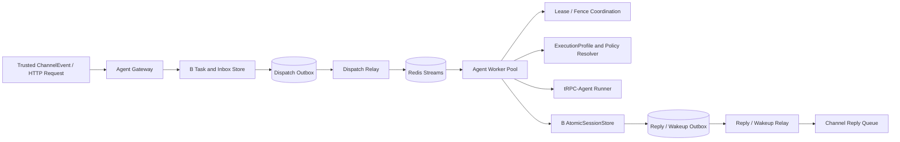
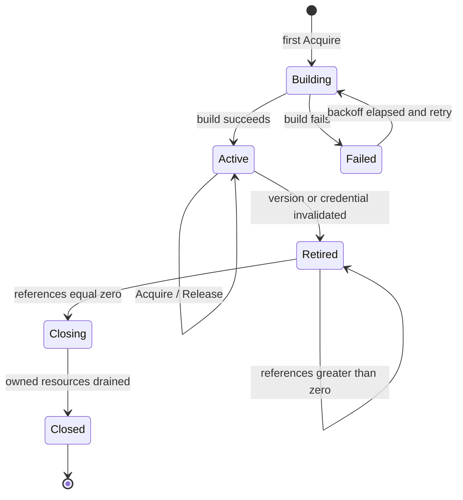
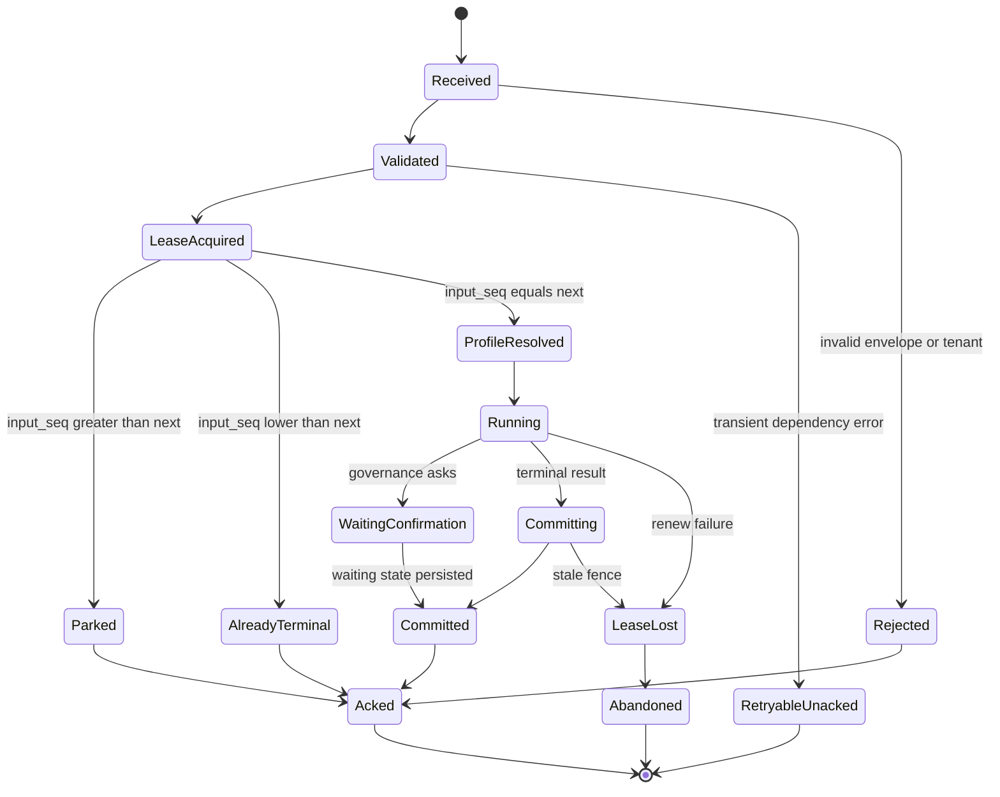
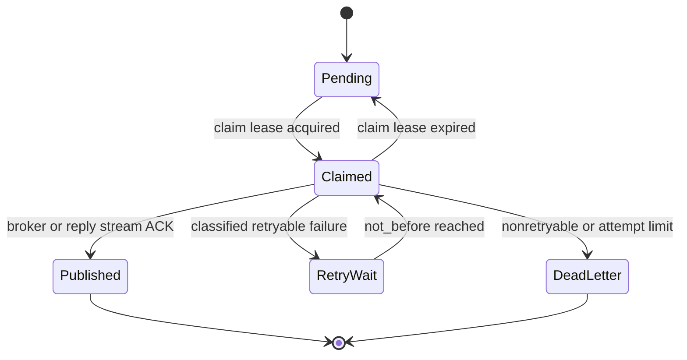

# A 模块：Agent Gateway 与 Agent Worker 技术方案

| 文档属性 | 内容 |
|---|---|
| 设计状态 | 规范性技术方案 |
| 模块范围 | A：多租户多节点 Runtime |
| 上游依赖 | 核心 `trpc-agent-go/runner`、`agent`、Model/Tool 公共 API |
| 协作依赖 | B 的 AtomicSessionStore/Inbox/Outbox，C 的 Policy/Channel 契约，D 的观测端口 |
| 总体架构 | [总体技术方案（第 12–13 节）](0.architecture.md) |

## 0. 阅读指南

本模块回答一个核心问题：**一条已经完成可信接入的请求，如何在任意 Gateway/Worker 节点上被可靠执行，并且只产生一次可见业务结果。**

### 0.1 一页职责图

| 角色 | 输入 | 主要动作 | 输出 | 不拥有的状态 |
|---|---|---|---|---|
| Gateway | 已 Claim 的 `ChannelEvent` 或认证 HTTP 请求 | 准入、HTTP 入口 ClaimInbox、PrepareDispatch、status/cancel | request ID、Dispatch Outbox | Agent 实例、Session 数据、IM 协议状态 |
| Dispatch Relay | B 的 Dispatch Outbox | claim、发布、mark、重试/对账 | `ExecutionEnvelope` Broker delivery | execution 终态 |
| Worker | `ExecutionEnvelope` | 复核、取 lease/fence、input gate、运行 Runner、CommitTurn | commit/result、Reply/Wakeup/Audit Outbox | tenant 配置真相、IM 投递状态 |
| Reply/Wakeup Relay | B 的业务 Outbox | claim、发布、mark、重试/对账 | C 的 Reply 队列或新的 dispatch 唤醒 | Session state、Delivery Ledger |
| RuntimeBundleManager | 固定 `ExecutionProfileKey` | 构建、引用计数、retire、关闭自有资源 | 进程内可执行 Bundle Lease | 发布指针和持久配置 |

A 模块不拥有任何可在节点重启后丢失的业务真相。Broker delivery、进程内 Bundle、当前 lease handle 都只是执行协调状态；request、固定版本、Session head、commit 和 Outbox 的权威事实由 B 持久化。

### 0.2 正常主链路

```text
可信请求
→ Channel 入口复用既有 ClaimInbox；HTTP 入口执行 ClaimInbox
→ Gateway PrepareDispatch
→ Dispatch Outbox / Relay / Broker
→ Worker 复核 ExecutionEnvelope
→ Acquire session lease + fence
→ input_seq gate
→ Resolve fixed profile + Acquire Runtime Bundle
→ Runner / Model / Tool
→ B.CommitTurn（Session + result + Reply/Wakeup/Audit Outbox）
→ ACK Broker + release lease
```

三个判断决定 Worker 后续动作：`input_seq` 是否轮到、lease/fence 是否仍有效、CommitTurn 是否已存在。任何节点故障都从这三个持久/协调事实恢复，不能依赖原 Worker 内存。

### 0.3 建议阅读路径

| 读者目标 | 先读 | 再读 |
|---|---|---|
| 理解端到端执行 | §1、§3–9 | §17 Worker 状态机 |
| 实现 Gateway | §2.1、§3–4 | §15 接口、§18 Relay |
| 实现 Worker | §2.2–2.3、§5–9 | §16 Redis、§19 错误表 |
| 排查乱序/重复/接管 | §5–6、§12 | §17–20 |
| 评审模块边界 | 本节、§1、§11 | [模块边界](6.module-boundaries.md) |

## 1. 设计目标与职责边界

Gateway 负责可信入口、准入、幂等认领、派发准备、状态与取消；Worker 负责取得 session 执行权、恢复共享状态、解析固定配置、执行 Runner 和提交结果。二者只通过版本化 Envelope、Broker 和 typed storage ports 协作。

Gateway 不运行 Agent，Worker 不解析 WeCom/Feishu DTO，也不信任 Envelope 中未经共享存储复核的租户字段。

### 1.1 模块组件关系



Gateway、Worker 和 Relay 仅依赖 typed ports。Gateway 不引用 Worker 具体实现；Worker 不引用 IM Provider；Relay 不修改 Session 状态。

## 2. 公共契约

```go
type Dispatcher interface {
    Dispatch(context.Context, DispatchRequest) (ExecutionHandle, error)
}

type Executor interface {
    Execute(context.Context, ExecutionEnvelope) error
}

type ExecutionHandle struct {
    RequestID string
    Status    string
    ReplyCursor string
}
```

`LocalDispatcher` 与 `BrokerDispatcher` 必须通过同一 contract suite。Local 仅用于单进程测试，不得改变租户、幂等或提交语义。

<a id="execution-envelope"></a>

### 2.1 ExecutionEnvelope 权威契约

本节是 `ExecutionEnvelope` 字段、类型和跨进程序列化语义的唯一权威定义。总体架构和控制面领域文档只引用本节，不复制结构体；字段演进必须先修改本节及 codec contract test，再同步调整生产者和消费者。

```go
type ExecutionEnvelope struct {
    SchemaVersion       uint16
    TenantID            string
    TenantVersion       int64
    AgentAppID          string
    AgentAppVersion     int64
    AgentAppRevision    int64
    AgentContentDigest  string
    ConfigVersion       int64
    PolicyVersion       int64
    RequestID           string
    SessionID           string
    UserID              string
    Channel             string
    InputSeq            uint64
    PayloadRef          string
    TraceParent         string
    CreatedAt           time.Time
}
```

Envelope 只承载固定版本事实和大载荷引用，不承载 Runner、Model、Tool、后端客户端或 Secret。Broker 消息不是权威执行记录；Worker 解码后必须按 `(tenant_id, request_id)` 读取 TaskStore 并逐字段复核。`SchemaVersion` 采用显式兼容矩阵：未知主版本 fail closed，可选字段只能通过向后兼容的 codec 演进。

### 2.2 service-owned ExecutionProfile

`ExecutionProfileSnapshot` 是 `trpc-agent-service` 根据固定 Agent App Revision、ConfigSnapshot 和 PolicySnapshot 生成的不可变运行时投影，不是独立控制面实体，也不是 `openclaw/runtimeprofile` 的别名或包装。Agent 定义的唯一发布版本是 `agent_app_revision`；service 的 `go.mod` 不得 require `trpc.group/trpc-go/trpc-agent-go/openclaw`。

完整字段和不变量以[控制面领域模型（第二部分 §8）](1.tenant-root-design.md)为唯一权威定义，其中包括 Instruction、GlobalInstruction、GenerationConfig、RuntimePolicy 和 BackendRequirements。A 模块只消费该完整 Snapshot，不定义裁剪版 DTO。

```go
type ExecutionProfileResolver interface {
    Resolve(context.Context, ExecutionProfileKey) (ExecutionProfileSnapshot, error)
}

type RunOptionAssembler interface {
    Assemble(
        context.Context,
        tenant.Context,
        ExecutionProfileSnapshot,
        PolicySnapshot,
    ) ([]agent.RunOption, error)
}
```

Resolver 只接受 Envelope 已固定的精确 App Revision、Config 和 Policy 版本，并校验 tenant/app/digest 及所有版本化引用；不存在、版本漂移或跨租户引用时 fail closed。Assembler 使用核心模块公开的 `agent.WithAppName`、`agent.WithRequestID`、`agent.WithModel` 和工具权限 RunOption 构造本次执行选项。RunOption、Model 客户端、Tool 实例和 Secret 不跨 Broker 序列化，也不作为持久化事实保存。

### 2.3 Runtime Bundle Manager

Runtime Bundle 是完整 `ExecutionProfileSnapshot` 的进程内可执行物，封装 Agent、Runner、受治理 Tool/Skill、tenant-aware Session/Memory/Artifact/Knowledge facade 以及本 Bundle 明确拥有的客户端资源。它不是持久化实体，不能成为第五套版本；构建键至少为：

```text
(tenant_id, tenant_version, agent_app_id, agent_app_version,
 agent_app_revision, content_digest,
 config_version, policy_version)
```

`tenant_version` 与根 `agent_app_version` 必须进入根 Bundle key：同一不可变 revision/config 可能在配额、状态或其他根配置变化后被新的权威 execution 再次引用，不能让旧 Bundle lease 掩盖 Envelope 固定的根版本。组合 Agent 的子节点不伪造根版本；生产 Resolver 逐级复核已发布父 revision 中的 `(child app, revision, digest)` 引用后，才解析子 Snapshot。

Backend/credential version 若会改变客户端行为，还必须参与对应客户端池键和失效判断，但 Secret 值永远不进入键。Manager 必须满足：

1. 同一 key 的并发 Acquire 只触发一次构建；不同 tenant/key 可并行构建，禁止全局构建锁。
2. Acquire 返回带引用计数的 Lease；调用方必须持有 Lease 覆盖整个 Runner event channel 消费、TurnTx 提交或 suspension 持久化过程。
3. 发布、回滚或 credential invalidation 只把旧 Bundle 标为 retired；已有 Lease 可继续固定旧版本，新请求不得再 Acquire retired Bundle。
4. retired Bundle 仅在引用数归零后关闭；close 幂等、有 deadline，先停止接收新运行，再取消/排空自有 Runner，最后只关闭 Bundle 明确拥有的资源。
5. 共享连接池、共享 Session/Memory service 或由外层注入的 borrowed dependency 不得由单个 Bundle 关闭，避免影响其他 tenant/version。
6. 构建失败使用短时负缓存和有界退避；不存在版本、digest 不符、Secret/Backend capability 缺失均 fail closed，不得退回 mock、InMemory 或 current/latest 配置。



每次 Run 由 Bundle 消费并转发 Runner event channel。请求取消、客户端断开或 drain 时先传播 `context.Context`/Runner cancel，再在有界期限内继续排空 channel，防止生产者 goroutine 因无人读取而阻塞；超时后记录分类指标并结束本地转发。中间流事件可降级，Session 终态和 Reply Outbox 仍以 CommitTurn 为唯一事实边界。

### 2.4 HTTP 与 SSE Gateway 契约

HTTP 是与 Channel 平级的可信入口，不是绕开 Inbox/TaskStore 的本地 Runner 快捷方式。API principal 和 Channel principal 是两种不同凭据；二者最终都只能由服务端构造 `TenantContext`，不能互换或从 request body 接受 tenant/app 身份。

最小 API：

```text
POST /v1/agent-runs                 创建或幂等返回执行
GET  /v1/agent-runs/{request_id}    读取共享状态与终态
GET  /v1/agent-runs/{request_id}/events?cursor=...
                                    SSE 实时事件与持久回放
POST /v1/agent-runs/{request_id}:cancel
                                    写共享 cancel intent
```

`POST` 必须按认证 principal、显式 app route 和客户端 idempotency key 调用 `ClaimInbox`，再进入相同 `PrepareDispatch`。HTTP 成功响应至少返回稳定 request ID、当前 status 和 event cursor；不得因使用 `LocalDispatcher` 而跳过版本固定、幂等、审计或 CommitTurn。

SSE 契约：

1. `run.started/progress/message.delta` 是可丢失体验事件，使用有界非阻塞缓冲；慢客户端不能反压 Runner、CommitTurn 或 Relay。
2. `message.completed/run.completed/run.failed/run.denied` 必须由持久 event/result 与 Reply Outbox 派生，支持按 cursor 回放。
3. Gateway/Worker 分离时实时 fan-out 可以使用共享 EventBus，但 Pub/Sub 只负责低延迟唤醒，不是事实存储。
4. TCP/SSE 断开只取消订阅；业务取消必须调用 cancel API，写共享 cancel intent，并由 Worker 在模型、工具和提交前复核。
5. cursor 必须绑定 tenant/request 和版本化编码；伪造、跨租户、未来 cursor 或已淘汰 schema 均 fail closed。
6. HTTP handler 不直接持有 Runner/Bundle；`ExecutionProfileResolver` 和 `RuntimeBundleManager` 仍只在 Worker 执行路径使用，禁止再引入重复的 RunnerRegistry 或第二套执行计划缓存。

`TerminalEventStore` 从共享 `TaskStore + ResultStore` 派生 `message.completed/run.completed/run.failed/run.denied`，因此 Gateway 重启不丢终态；版本化 HMAC cursor 固定 tenant/request/sequence，伪造、跨租户和越界序号均 fail closed。Handler 使用有界 replay 和节点级并发订阅上限，轮询只读共享事实且不接触 Runner/Bundle，慢写最多阻塞自身 handler goroutine；TCP 断开只结束该订阅，不写 cancel intent。Gateway 组合 durable run、`GatewayRunnerBridge`、版本化 HMAC principal、OpenAI/tRPC-Agent invocation middleware 和 A2A durable TaskManager。低延迟 `run.started/progress/message.delta` EventBus 与分布式限流不在支持范围；终态回放和节点级限流仍提供完整正确性边界。

限流同时覆盖 principal、tenant、request size、并发订阅和 replay window。readiness 只有在认证、Inbox/TaskStore、Dispatcher 和事件回放依赖可用时才允许接收新 run；drain 先停止创建新 run，再关闭订阅入口，已有执行按 Worker/lease 规则完成或接管。

### 2.5 上游协议 Server 复用

`/v1/agent-runs` 是平台的规范控制 API；tRPC-Agent-Go 的公开 `server/*` 包作为协议兼容 façade 复用，不成为第二套执行面。所有 façade 必须部署在相同的认证、TenantContext、app route、限流和审计中间件之后，并注入本节定义的 `GatewayRunnerBridge`。禁止让 server 包以 Agent 或默认配置自行创建本地 Runner、InMemory Session 或旁路状态存储。

| 协议入口 | 复用的上游能力 | 平台映射 |
|---|---|---|
| OpenAI-compatible | `server/openai.New` 及其请求、流式响应和 event 转换；通过 `WithRunner` 注入 | OpenAI request/idempotency key 映射 request ID；stream 从共享事件订阅和持久回放生成 |
| AG-UI | 上游 `server/agui` 协议、thread/run/event 转换 | 固定依赖版本不提供该公共包，因此 AG-UI listener 不启用；禁止本地复制协议实现冒充上游复用 |
| A2A | `server/a2a` 的 Processor/TaskManager、消息转换、认证 middleware 扩展点；通过 `WithRunner` + `WithAgentCard` + `WithTaskManagerBuilder` 注入 | A2A task ID 映射 request ID，task 状态读取 TaskStore，cancel 写共享 cancel intent |
| tRPC-Agent | `server/trpcagent.New` 及其协议/event 转换；通过 `WithRunner` 注入 | app name 只作为已认证 route hint，最终仍解析固定 tenant/app/revision |

概念接口如下；具体方法签名以固定上游版本为准，但安全语义不得改变：

```go
type ServerInvocationContext struct {
    TenantID       string
    PrincipalID    string
    AgentAppID     string
    Protocol       string
    IdempotencyKey string
}

// GatewayRunnerBridge implements runner.Runner for protocol servers.
type GatewayRunnerBridge struct {
    Claims      InboxClaimer
    Dispatcher Dispatcher
    Tasks       TaskStore
    Events      SharedEventStore
}

func (b *GatewayRunnerBridge) Run(
    ctx context.Context,
    userID string,
    sessionID string,
    message model.Message,
    opts ...agent.RunOption,
) (<-chan *event.Event, error)
```

Bridge 只从认证中间件写入 context 的 `ServerInvocationContext` 取得 TenantID、PrincipalID、AgentAppID、协议名和幂等键；`userID/sessionID` 及协议 body 都是不可信输入，必须与 principal scope 校验后再规范化。Bridge 将消息保存为受控 payload，依次调用 `ClaimInbox` 和 `PrepareDispatch`，然后订阅共享 EventStore，将平台事件转换回上游 event stream。它不 Acquire Runtime Bundle，也不在 Gateway 进程调用真正的 Runner；实际执行仍只发生在 Worker。

协议 server 的 `Close` 只关闭其 listener 和 Bridge 自有订阅，不关闭 Worker、共享连接池或其他 Bundle。context 取消默认只取消本次流订阅；只有协议明确定义且 principal 有权的 cancel 操作才写共享 cancel intent。A2A/AG-UI 等协议若要求可恢复 task/thread 状态，查询必须来自 TaskStore/EventStore，而不是 server 进程内 map。

`GatewayRunnerBridge` 必须通过上游各 server 的兼容性测试和平台 Dispatcher contract suite。测试至少覆盖：认证缺失、跨租户 user/session 伪造、重复提交、断线重连、持久终态回放、取消、Gateway 重启和 Worker 接管。任何 server 包无法注入 Bridge、会强制创建本地 Runner，或无法关闭默认 InMemory fallback 时，该协议入口不得生产启用。

A2A 组合通过 `trpc-agent-go/server/a2a.New` 装配协议 Handler，并以 `WithRunner(GatewayRunnerBridge)`、`WithAgentCard`、`WithTaskManagerBuilder` 注入；不会实例化或使用上游默认 MemoryTaskManager，也不把上游 Session 作为权威状态。`DurableA2ATaskManager` 实现公开 TaskManager：`message/send` 与 `message/stream` 进入共享 RunSubmitter，task ID 等于 durable request ID，`tasks/get` 读取 TaskStore，`tasks/cancel` 写带版本的共享 cancel intent，`tasks/resubscribe` 从 EventStore 重放。push notification 返回 unsupported，Agent Card 声明 `pushNotifications=false`、`stateTransitionHistory=false`。drain 仅拒绝新的 message send/stream，已有 task 的 get/cancel/resubscribe 继续可用。

## 3. Gateway 流程

1. 从认证凭据或已验证 Channel Binding 建立 TenantContext。
2. 读取 tenant version 并校验租户和应用状态、入口权限、请求大小、预算和租户级限流。
3. 认证 HTTP 入口调用 `ClaimInbox` 原子完成去重、生成 request ID、保存可恢复 `payload_ref` 并标记 pending；Channel 入口复用 C 已 durable claim 的 request，并从 B 复核其 tenant/app/payload 绑定，不重复创建 Inbox。
4. Preprocess ready 后调用 `PrepareDispatch`。
5. `PrepareDispatch` 按[控制面领域模型（第二部分 §6.4）](1.tenant-root-design.md)在 PostgreSQL 事务中锁定 Tenant/App 指针、分配 `input_seq`、固定 app revision/config/policy version，并写 execution record 与 Dispatch Outbox。
6. Dispatch Relay 读取 Outbox，幂等发布 Broker，成功后标记 published。
7. Gateway 返回 request ID；查询状态从共享 Task/Commit Store 读取。

禁止先写去重键、再在进程内生成 request ID。入队失败不能丢失已 ACK 的 callback。

`PrepareDispatch` 成功提交才表示请求已经被执行系统接受。若 tenant 在 ClaimInbox 后变为 suspended/disabled，Gateway 必须提交对应非执行终态且不得分配 input_seq；suspended 不追溯否决已经 PrepareDispatch 的请求，disabled 则通过共享取消状态终止尚可取消的在途执行。完整状态行为见 [Tenant 根实体文档（第一部分第 6 节）](1.tenant-root-design.md)。

## 4. Broker 与分片

基线 Broker 使用 Redis Streams，分片键为：

```text
hash(tenant_id | agent_app_id | session_id) % shard_count
```

分片只保证 msg2 不比 msg1 更早进入可见序列，不保证同 session 只有一个 Worker 执行。Consumer Group 中任意 Worker 可消费任意分片；session 串行依靠 lease/fence/input gate。

Broker 语义为 at-least-once。Envelope 的幂等身份是：

```text
tenant_id + agent_app_id + request_id + input_seq
```

<a id="lease-fence"></a>

## 5. Lease 与 fence

协调键以 tenant、app、session 为作用域。获取 lease 和生成 fence 必须由同一个 Redis Lua 原子操作完成：

```text
counter = INCR session_fence_counter
SET session_lease {owner, fence, expires_at} NX/PX
```

实现时应在一个 Lua 脚本内保证“只有成功 owner 才取得本 generation fence”。规则：

- fence 由共享原子计数器产生，禁止时间戳、UUID 大小或 Worker 本地计数。
- 持久 Session head 保存 `last_fence`。
- `incoming_fence < last_fence`：旧 owner，永久拒绝提交。
- `incoming_fence == last_fence`：同 generation 合法重试或续约期提交，仍需 version/commit_id 校验。
- `incoming_fence > last_fence`：新 generation，可 CAS 提升水位并提交。
- Redis 数据恢复后，协调层调用 `ReadLastFence` 和 `EnsureFenceAtLeast`，禁止 counter 倒退。

Worker 在模型或工具长调用期间续租；一旦续租失败，取消本地执行并禁止提交。即使取消未及时生效，旧 fence 也会阻止覆盖新结果。

## 6. input_seq 三态门禁

Worker 取得 lease 后读取 `next_input_seq`：

| 条件 | 语义 | 动作 |
|---|---|---|
| `input_seq < next` | 已处理重投 | 按 tenant/app/session/input_seq 读取终态结果并 ACK |
| `input_seq == next` | 当前可执行 | 进入 ExecutionProfile、Policy 和 Runner 流程 |
| `input_seq > next` | 前序未终态 | 原子 park/defer，释放 lease，ACK 当前 delivery，等待 Wakeup |

`input_seq > next` 不是错误，不允许 Worker 原地占 lease 等待，也不允许立即反复重新入队。park 记录包括 attempt、`not_before` 和截止时间；前序终态提交产生 Wakeup Outbox，调度器带有界指数退避重新发布。超过上限进入 blocked/DLQ 并告警，不能跳过前序。

## 7. Worker 执行

1. 消费并解析 Envelope，检查 schema version。
2. 从共享存储复核 request、tenant、app 和固定版本。
3. 获取 session lease/fence。
4. 执行 input gate。
5. 读取准确 Agent App Revision、ConfigSnapshot 和 PolicySnapshot，解析 service-owned ExecutionProfileSnapshot。
6. 按完整版本键从 Runtime Bundle Manager Acquire Lease；构建时装配 tenant-aware Session、Memory、Artifact facade 和受治理 Tool。
7. 通过 `RunOptionAssembler` 从固定快照构造 `agent.RunOption`，强制注入可信 request ID、AppName、模型和工具权限策略。
8. 持有 Bundle Lease 调用 `runner.Run` 并持续消费 event channel，避免 Runner 阻塞；提交或 suspension 持久化完成后才 Release。
9. 收集 TurnTx 缓冲的 event/state/usage/reply。
10. 调用 `CommitTurn`；成功后 ACK Broker，失败按 typed error 决定重试或丢弃。

Runtime Bundle 构建键至少包含；AgentFactory 仅在 Bundle 构建阶段执行装配，复用与生命周期所有权唯一归 RuntimeBundleManager：

```text
(tenant_id, agent_app_id, agent_app_revision, content_digest,
 config_version, policy_version)
```

## 8. 终态、确认和 next 推进

`next_input_seq` 表示下一个待处理输入：

- allow 完成、policy deny、用户拒绝确认、确认超时和不可恢复业务拒绝都是终态，原子推进 next。
- `waiting_confirmation` 是非终态，不推进 next；保存 checkpoint、确认记录和 deadline，ACK 当前 delivery 并释放 lease。
- 确认回调生成 continuation；新 Worker 取得新 fence，恢复同一 request/input，最终提交后推进 next。
- confirmation grant 是一次性且绑定 tenant、subject、tool、参数 digest、policy version。

## 9. CommitTurn 顺序

同一个权威事务内：

1. 锁定 session head；
2. 校验 tenant/app/session、expected version、input_seq 和 lease proof；
3. 比较并提升 last_fence；
4. 按 session_seq 追加 events；
5. 更新 state 和 version；
6. 条件更新 summary boundary；
7. 写 commit/result/usage；
8. 若终态，推进 next_input_seq；
9. 写 Reply、Wakeup、Audit Outbox；
10. 提交。

Worker 不能在事务外先发送 IM 回复或写终态。

## 10. status 与 cancel

- status 存共享存储：pending/queued/running/waiting_confirmation/succeeded/denied/failed/cancelled。
- cancel intent 以 PostgreSQL `execution_cancel_intent` 及 execution cancel watermark 为权威事实；Redis `execution-control` Stream 只传递可丢失的低延迟 hint。
- Worker 在模型、工具和提交前检查 cancel version。
- Redis hint 丢失或尚未接入生产组合根时，Worker 对 PostgreSQL 权威状态的轮询仍是正确性路径。
- 已提交终态不能被迟到 cancel 覆盖。

取消传播是最优努力的：在轮询间隔或 hint 传递窗口内，已启动的模型、Tool 或外部系统调用可能已发生一次，其本地结果必须被丢弃并收敛为 `cancelled` 终态。数据库 trigger 保证 cancel intent 之后不再提交 succeeded/failed/denied 等非取消终态与 Session 业务结果，但不能撤回已发生的外部效果；外部写入仍必须依赖幂等键、最终 Tool Guard 与 Provider 侧去重。一个 execution 只接受一个 cancel intent，因此 `cancel_version` 固定为 1，API 不接受其他版本。

## 11. Relay 所有权

- Dispatch/Reply/Wakeup/TenantControl 为 A 模块的业务 Relay。TenantControl 负责缓存失效、disabled 取消水位和节点收敛，不修改 tenant 权威行。
- Audit Relay 独立实现，只处理 Audit Outbox。
- 所有 Relay 统一使用 Storage 提供的 claim/renew/mark API。
- publish 成功、mark 前崩溃会导致重发，消费者必须幂等。

## 12. 故障行为

| 故障 | 行为 |
|---|---|
| Worker 执行前崩溃 | Broker pending 被 reclaim |
| Worker 执行中崩溃 | lease 过期，新 Worker 以更大 fence 接管 |
| 旧 Worker 恢复 | CommitTurn 以 stale fence 拒绝 |
| 提交后 ACK 前崩溃 | 重投读取既有 commit result，不重跑 Runner |
| Broker 不可用 | Dispatch Outbox 保留并退避重试 |
| PostgreSQL 不可用 | 不部分提交；任务保持可恢复状态 |
| 模型超时 | 有界重试或提交明确失败/降级结果 |
| IM 发送失败 | Reply Relay/Adapter 重试，不重跑 Agent |
| Bundle 构建失败 | 对该固定版本有界退避；缺版本、digest、Secret 或 capability 时 fail closed，不回退到其他版本 |
| Bundle retired 时仍有运行 | 旧 Lease 继续完成；引用归零后有界 drain/close，新请求只使用新 key |

## 13. 容量与扩缩容

Worker 本地使用有界 semaphore；模型并发、工具并发和租户预算使用共享配额。扩容信号包括 queue lag、oldest message age、活跃 session、lease wait、模型并发和 token throughput，不能只看 CPU。

Drain 时停止领取新任务，继续续约已有 lease；到截止时间仍未完成则停止续约，让其他 Worker 安全 reclaim。

## 14. 代码组织

```text
trpcservice/runtime/         # Envelope、Dispatcher、Handle、Outcome
trpcservice/profile/         # ExecutionProfile、Resolver、RunOptionAssembler、Runtime Bundle Manager
trpcservice/gateway/         # ingress、dispatch、status、cancel
trpcservice/broker/          # port、Redis Streams、codec
trpcservice/worker/          # consumer、execute、cancel polling/hint、lifecycle、suspension
trpcservice/coordination/    # lease、fence
trpcservice/relay/           # dispatch、reply、wakeup、execution-control、reconciler
trpcservice/storage/         # PostgreSQL execution status/cancel intent 权威存储
```

架构测试应禁止 Gateway import Worker concrete、Worker import provider DTO、runtime contract import concrete backend。

## 15. 接口详细定义

```go
type DispatchRequest struct {
    Tenant       tenant.Context
    RequestID    string
    SessionID    string
    PayloadRef   string
    TraceContext propagation.Context
}

type TaskStore interface {
    PrepareDispatch(context.Context, PrepareDispatchRequest) (PreparedDispatch, error)
    GetExecution(context.Context, ExecutionKey) (ExecutionStatus, error)
    RequestCancel(context.Context, CancelRequest) (CancelResult, error)
    ParkInput(context.Context, ParkRequest) error
}

type Broker interface {
    Publish(context.Context, Shard, ExecutionEnvelope) error
    Consume(context.Context, ConsumerOptions, func(context.Context, Delivery) error) error
    Ack(context.Context, Delivery) error
    Reclaim(context.Context, ReclaimOptions) ([]Delivery, error)
}

type LeaseManager interface {
    Acquire(context.Context, SessionKey, WorkerID, time.Duration) (Lease, error)
    Renew(context.Context, Lease, time.Duration) (Lease, error)
    Release(context.Context, Lease) error
    EnsureFenceAtLeast(context.Context, SessionKey, uint64) error
}
```

`TenantContext` 不应作为任意 map 存入 context；使用不可变 typed value，并由 `RequireTenant` 在每个外部边界 fail closed。Envelope 解码后得到的 TenantID 只是声明，必须和 TaskStore 中可信记录相等。

## 16. Redis 契约

Key namespace 规范：

```text
trpc:{env}:{shard}:dispatch                    Redis Stream
trpc:{env}:{tenant}:{app}:{session}:lease      lease hash/string
trpc:{env}:{tenant}:{app}:{session}:fence      monotonic counter
trpc:{env}:execution-control                   lossy cancel hint Stream
trpc:{env}:execution-control:dead-letter       invalid hint Stream entries
trpc:{env}:worker:{worker_id}                  heartbeat + TTL
```

Redis 不保存 request-scoped cancel 权威 key；取消意图、版本和幂等 watermark 只从 PostgreSQL 读取。`execution-control` 消费者收到 hint 后也必须回查 TaskStore，不得根据 Stream entry 直接制造终态。

Redis Cluster 中需要原子访问的 lease/counter key 必须共享 hash tag，例如 `{tenant|app|session}`；不得跨 slot 后声称 Lua 原子。Acquire Lua 输入为 key、worker_id、lease_id、now_ms、ttl_ms；输出为 acquired、fence、expires_at。只有 lease 不存在或已过期时才 INCR fence 并写新 lease。Renew 必须同时匹配 worker_id、lease_id、fence，不能只按 owner 名续约。

Stream entry 至少包含 schema_version、envelope bytes、request_id、session routing hash、traceparent、published_at。大 payload 只能传引用。Consumer reclaim 使用 idle threshold，大于 p99 正常处理时间且结合 Worker heartbeat；reclaim 仍必须重新取得 session lease。

## 17. Worker 状态机



只有 `committed` 或可证明的 `AlreadyTerminal` 可以正常 ACK。`abandoned` 不得提交本地结果；是否 ACK 取决于 Broker 是否已安排可恢复 delivery，默认保持 pending 等待 reclaim。

## 18. Relay 算法

```text
loop:
  rows = ClaimOutbox(kind, limit, relay_id, lease_until)
  for row in rows:
    inject trace context
    publish(row.idempotency_key, row.payload)
    if broker ack:
      MarkPublished(row.id, row.version)
    else:
      MarkRetry(row.id, classified_error, next_attempt_at)
```

Claim 使用 `FOR UPDATE SKIP LOCKED`，mark 使用 version CAS。DLQ 只保存不能自动恢复或超过有界次数的事件；进入 DLQ 不允许自动推进 Session 输入。Reconciler 检查 stuck Inbox、过期 Outbox claim、parked input 和 Commit/Reply 不一致，不直接修改 Agent state，只调用相同 typed transition。

### 18.1 Relay 状态转换



## 19. 关键错误处理表

| 错误 | Worker 动作 | Broker 动作 |
|---|---|---|
| Tenant/ExecutionProfile mismatch | 安全拒绝并审计 | ACK，进入安全 DLQ |
| Lease busy | 带 jitter 延迟 | 不运行；重投/park |
| Lease lost/StaleFence | 丢弃本地结果 | 等待新 owner 完成 |
| Version conflict | 释放 lease并重读 | 有界重试 |
| Input not ready | 持久 park + Wakeup | ACK 当前 delivery |
| Already terminal | 返回保存结果 | ACK |
| Backend unavailable | 不部分提交 | 保持 pending，退避 |
| Invalid model/tool result | 按策略提交 failed/deny | Commit 后 ACK |

## 20. A 模块文件与测试

```text
trpcservice/runtime/{context,envelope,outcome,errors}.go
trpcservice/gateway/{taskstore,control,dispatcher}.go
trpcservice/broker/{broker,redis_streams,codec,reclaim}.go
trpcservice/coordination/{lease,redis_lease,fence}.go
trpcservice/worker/{consumer,runner,cancellation,signals,lifecycle}.go
trpcservice/relay/{base,dispatch,reply,wakeup,control,reconciler}.go
trpcservice/relay/redis/{publisher,execution_control_queue}.go
trpcservice/storage/session/postgres/store.go  # execution/cancel intent 权威读写
```

必须自动化：Envelope N/N-1、两个 Worker 同 session、lease 续租丢失、Redis counter 恢复、三个 input 乱序、waiting/deny/timeout、commit 后 ACK 前 kill、relay publish 后 mark 前 kill、cancel 竞态和 drain/reclaim。
