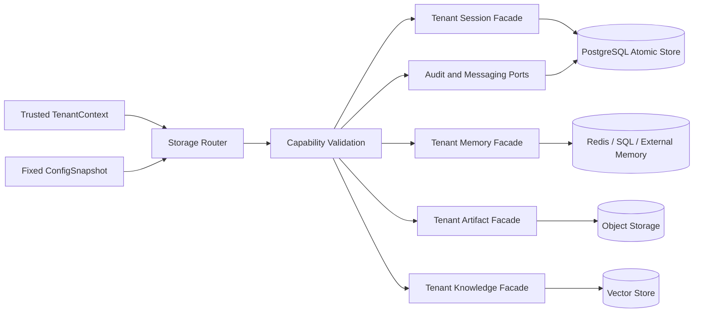
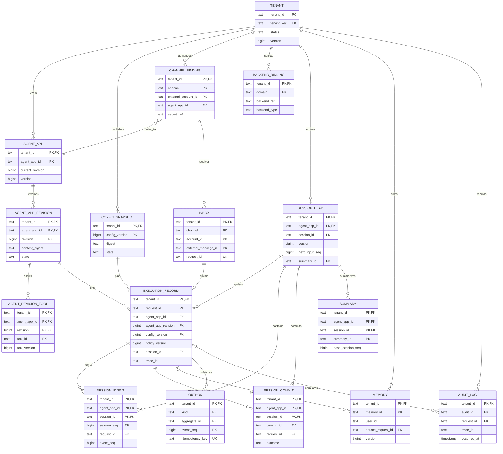
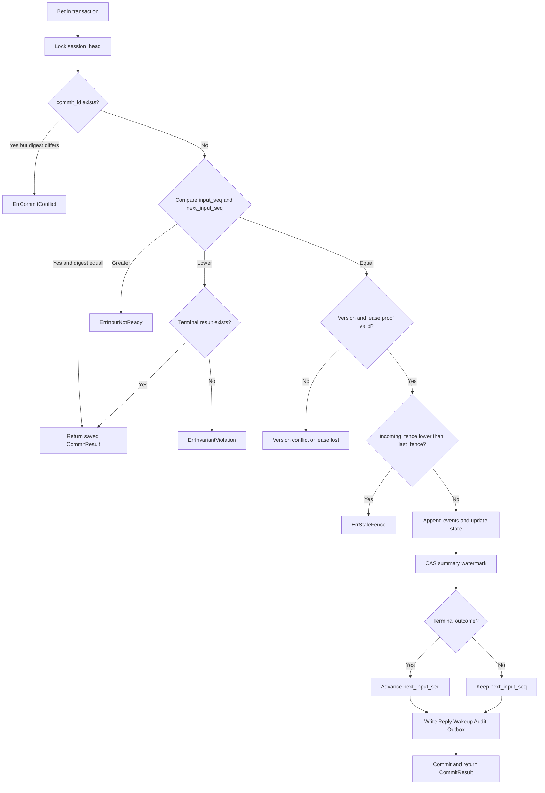
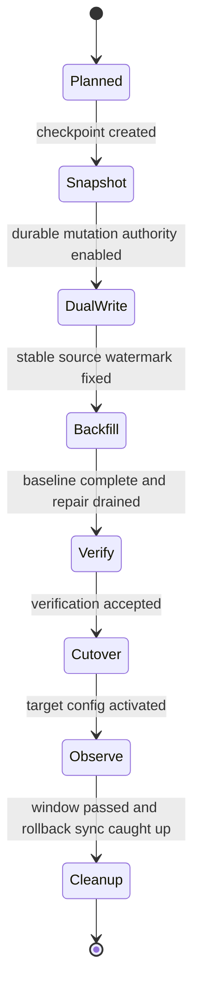

# B 模块：Storage Router 与数据一致性技术方案

| 文档属性 | 内容 |
|---|---|
| 设计状态 | 规范性技术方案 |
| 模块范围 | B：租户数据路由、原子提交、多后端与迁移 |
| 上游接口 | `session.Service`、`memory.Service`、`artifact.Service` |
| 主要消费者 | A 的 Gateway/Worker/Relay，C 的 Channel/Preprocess，D 的 Audit Relay |
| 总体架构 | [总体技术方案（第 12–13 节）](0.architecture.md) |

## 0. 阅读指南

本模块回答一个核心问题：**哪些数据是平台权威事实，以及一次消息在重复投递、多 Worker、后端故障和迁移期间如何保持租户隔离与原子一致。**

### 0.1 权威状态与写入口

| 权威状态 | 唯一写入口 | 原子边界 | 主要消费者 |
|---|---|---|---|
| Inbox 与 request identity | `ClaimInbox` | 去重、request ID、payload ref、初始状态 | C、A Gateway |
| execution record 与 `input_seq` | `PrepareDispatch` | tenant/app 状态、固定版本、序号、Dispatch Outbox | A Gateway/Worker |
| Session head/event/commit/result | `CommitTurn` | fence、version、input gate、event/state/result | A Worker |
| Reply/Wakeup/Audit Outbox | `PrepareDispatch` 或 `CommitTurn` | 与产生它的业务状态同事务 | A/D Relay、C Delivery |
| Delivery Ledger | delivery claim/finish CAS | logical reply + segment 的发送状态 | C Adapter |
| Summary/Memory/Knowledge/Artifact | 对应 tenant facade | 单调水位、RYW 或补偿/对账 | Runner、Tool、Preprocess |
| BackendBinding 与 migration record | 控制面事务/迁移状态机 | 固定配置版本、epoch、对账水位 | Router、迁移 Worker |

B 模块拥有数据真相和原子状态转换，但不决定何时运行 Agent、不消费 Broker、不调用 IM API。A/C/D 只能通过 typed ports 修改 B 的状态，不能拼 SQL、Redis key 或绕开 tenant facade。

### 0.2 四个关键事务

```text
ClaimInbox       外部消息 → 唯一 request
PrepareDispatch request → 固定执行版本 + input_seq + Dispatch Outbox
CommitTurn      Runner 结果 → Session/event/result + Reply/Wakeup/Audit Outbox
Delivery CAS    Reply segment → sent / ambiguous / retryable terminal state
```

前两个事务决定“是否接受和按什么版本执行”，第三个事务决定“什么结果已经发生”，第四个事务只决定“该结果是否已经送达通道”。投递失败不得回滚或重跑已经提交的 Agent 结果。

### 0.3 一致性层级

| 层级 | 适用数据 | 规则 |
|---|---|---|
| 强事务 | Inbox、execution、Session、commit、业务 Outbox | PostgreSQL 锁/CAS；失败整体回滚 |
| 协调一致性 | Redis Broker、lease/fence | Redis 只协调；持久 `last_fence` 校准计数器并拒绝旧 owner |
| 单调/最终一致 | Summary、Memory、Knowledge | version/watermark + invalidation/对账，不伪装成同库事务 |
| 补偿一致性 | Object/外部服务、迁移双写 | checksum、epoch、差异记录、可逆切换 |

### 0.4 建议阅读路径

| 读者目标 | 先读 | 再读 |
|---|---|---|
| 理解数据真相与事务 | §1–2、§5–10 | §14–16 DDL/伪代码 |
| 实现 Router/facade | §3–4 | §18 capability 配置 |
| 实现 Session commit | §5、§7–10 | §16–17、§20 测试 |
| 设计后端迁移 | §11 | §18–19 |
| 排查重复/乱序/stale fence | §6、§8、§10 | §15–16、§20 |

## 1. 设计目标与原则

Storage 层同时承担租户作用域、后端路由和分布式提交正确性。现有 `trpc-agent-go/session.Service`、`memory.Service` 和 `artifact.Service` 作为兼容接口；分布式执行新增 typed ports，不能把多个普通接口调用包装成“逻辑事务”。

权威规则：

1. 每次读写都从可信 context 获取 tenant/app，禁止调用方自由覆盖。
2. Session state、event、commit、terminal result、Reply/Wakeup Outbox 位于同一权威事务域。
3. 多 Worker 提交同时校验 fence、version、input_seq 和 commit id。
4. 后端 capability 不满足 `AtomicTurnCommit` 时不得作为多节点 Session 权威后端。
5. 所有索引和唯一键以 tenant scope 开头。

### 1.1 存储路由与数据域



Router 必须在返回具体 facade 前完成 tenant scope 固化和 capability 校验。具体后端不得自行解析不可信 tenant 字段。

## 2. 数据域与一致性

| 数据域 | 基线或可选后端 | 一致性要求 |
|---|---|---|
| Tenant/App/Config/Binding | PostgreSQL | 强一致、版本化 |
| Session head/state/event/commit | PostgreSQL | 强一致、行锁/CAS |
| Inbox/Outbox/Delivery Ledger | PostgreSQL | 强一致状态转换 |
| Coordination/Broker | Redis | 原子 Lua、at-least-once |
| Summary | PostgreSQL | 异步、单调水位 |
| Memory | Redis/SQL/外部服务 | 最终一致，可选 RYW |
| Knowledge | 向量库 | 最终一致，强制 tenant filter |
| Artifact | 对象存储 + SQL 元数据 | 元数据强一致，对象可重试 |
| Audit | Audit Outbox + SQL/外部归档 | 可重放、不可静默丢失 |

InMemory 只允许单进程开发测试。检测到 Worker replicas > 1 或 distributed=true 时必须拒绝 InMemory 权威 Session。

`inbound_payload`、`prepared_payload` 和 `result_payload` 的密文只记录 tenant、AAD 事实与 `key_version`，不保存 SecretRef 或密钥值。PostgreSQL Store 必须通过 `PayloadKeyResolver` 以 `(tenant_id, key_version)` 解析一次性 AES-256 key；生产适配器把它收敛为 ScopedSecretProvider 的 `payload_encrypt/messaging-payload` 完整 scope，并要求 ref 文本稳定、ref version 与数据库 key version 精确相等。Preprocess 生成 prepared payload、Worker 生成 result payload 时必须继承本次输入 payload 的 generation，不能重置为 1 或切到当时 current。读取历史密文必须解析该行记录的旧 generation，禁止回退 current/latest 或其他 tenant 的 key；缺版本、返回版本漂移、非 32-byte key 和认证解密失败均 fail closed。每次加解密结束立即清零本次返回的 key 副本，静态 key 构造器只允许测试/单 key 兼容 fixture，不能进入生产组合根。

Artifact 的边界固定为“SQL 权威元数据 + tenant-scoped immutable ObjectStore 内容”。元数据记录 `storage_kind`、`object_key` 和 `content_size`：`postgres_bytea` 行可直接保存内容，ObjectStore 行的 PostgreSQL `content` 必须为 NULL，逻辑 `ArtifactRef` 与后端 `object_key` 不得混用。对象必须按稳定 key 幂等写入并复核 digest/size，再提交 SQL 元数据；对象缺失或校验不一致时读取 fail closed，分别按 backend unavailable/version mismatch 处理。

Object-first 写入使用 durable upload intent：写对象前先建立带保护期限的 intent，对象调用必须在更短 timeout 内响应；对象写完续期，Artifact 元数据提交与 intent 删除在同一 PostgreSQL 事务内完成。清理器只用 lease/CAS 认领过期 intent，先重读 SQL 权威元数据：已有匹配引用时只移除 stale intent，无引用时才按 tenant/key/content digest 条件删除对象；临时失败按有界指数退避重试，耗尽后进入不可自动认领/删除的 `quarantined` 人工处置态，权威引用字段不一致则立即隔离并触发告警钩子，缺对象视为幂等成功。该状态机避免用“列对象 + 时间窗口”猜测 orphan 而误删仍在提交的对象。

正常 Artifact 使用独立的引用保留与删除状态机。Preprocess 必须显式配置 Artifact retention（不得复用 audit/log retention），首次 prepared payload 的数据库 `created_at` 冻结期限；密文 prepared payload、retention 秒数和可查询 `artifact_reference` 集合在同一事务提交，重试必须匹配原期限及完整引用集合。回收器只可 lease/CAS 认领“所有引用均到期”的 Artifact，或超过独立 orphan grace 且从未绑定引用的 Artifact；对象后端按 tenant/key/digest 条件删除，bytea 后端只删除 SQL 行，失败有界退避并在版本漂移或耗尽后隔离。无法安全反推引用的既有 Artifact 使用 `retention_managed=false`，不参与自动回收；新写 Artifact 或被 prepared payload 事务成功绑定的行才置 true。请求和执行路径不得即时删除 Artifact。

`artifact` role 组合 ObjectStore、upload-intent/retention reconciler、信号 drain 与依赖 readiness；`preprocess` role 复用同一 ObjectStore、Artifact retention 和扫描/Secret 约束，负责持久 job claim 到 PrepareDispatch，不直接依赖 Redis；`channel` role 只负责加密 ingress payload 与 Inbox/PreprocessJob durable claim，并复用 tenant/key-version 精确解析，不要求 Artifact 或 Redis。租户删除强制保留、法律冻结和自动解隔离不属于该状态机；`quarantined` 对象必须由受控操作核验后处置。

生产 ObjectStore provider 使用 AWS SDK v2 适配开启 versioning 的 S3-compatible bucket。Put 必须以 `If-None-Match: *` 和内容 SHA-256 metadata 阻止稳定 key 被覆盖，只有条件冲突后才读取既有对象比较；Get 同时复核 metadata、实际 bytes、digest、size 和 VersionID。orphan 条件删除先读取并校验实际 bytes，再删除精确 VersionID；bucket 未开启 versioning 时 Probe fail closed，禁止退化为 HEAD 后无条件删除当前 key。Artifact lifecycle 将该 Probe 与 PostgreSQL、schema checksum、Redis、ClamAV、DLP 和 probe tenant 的 payload encryption key 一起纳入缓存式聚合 readiness；AWS SDK Config 使用官方默认凭据链并支持 workload identity，组合根不得记录解析后的凭据。真实环境通过显式 opt-in smoke 验证 provider 能力。

<a id="storage-router"></a>

## 3. Storage Router

```go
type Domain string

type BackendBinding struct {
    TenantID         string
    Domain           Domain
    BackendType      string
    BackendRef       string
    CredentialRef    string
    CredentialVersion int64
    Capabilities     CapabilitySet
}

type Router interface {
    Resolve(context.Context, Domain) (ScopedBackend, error)
}
```

Router 从 TenantContext 获取 tenant，读取固定 ConfigSnapshot 的 BackendBinding；共享客户端池按 `backend_ref + credential_version` 复用，不为每个请求创建连接。返回 facade 必须固化 tenant scope。

主要能力：`AtomicTurnCommit`、`StrongReadAfterWrite`、`SummaryCAS`、`VectorTenantFilter`、`ObjectVersioning`、`MigrationDualWrite`。

## 4. 兼容 facade

`session/postgres` 是 Runner 的 Session/Event/State 唯一权威实现。每 Turn 的 scope facade 只验证 AppName/UserID/SessionID 与已冻结 TenantContext、Agent App Revision 和 ConfigSnapshot 的精确绑定，不保留 overlay、不复制事件或状态到平台表。AppName 编码 tenant/app 是 SDK 表中没有原生 tenant 列时的隔离维度；其值不是认证凭据，错误或跨 scope 的 key 必须 fail closed。

Memory 直接复用官方 `memory.Service` 的 PostgreSQL、Redis 或显式单节点 InMemory 实现，由不可变 `memory` BackendBinding 选择；Session 的强一致提交仍不使用 Redis。Mem0 是独立的外部、ingest-first Memory：服务仅暴露读取与 session 摄取，直接 Memory mutation fail-closed，因此其可见性为外部服务确认后的最终一致，而非本服务承诺的跨节点 RYW。Artifact 由不可变 `artifact` BackendBinding 选择 PostgreSQL 元数据平面，内容仍经平台不可变 ObjectStore 的 `SDKService` 适配；历史快照可暂时使用 default store 兼容路径。二者不建立名为 `TenantMemoryService` 或 `TenantArtifactService` 的平行框架实现。

### 4.1 Knowledge 公共能力复用

Knowledge 域不只复用底层向量库。`RuntimeFactory` 用 tRPC-Agent-Go 的 `knowledge.New` 组合公开的 `retriever.Retriever`、`vectorstore.VectorStore` 与 `embedder.Embedder`，由框架持有 `Search(ctx, *SearchRequest)` 编排与 `SearchResult` 语义；`TenantKnowledge` 只在其外层附加不可覆盖的 tenant/knowledge/version scope 和输出净化。service 不重写检索编排或通用数据源接口。

```go
type TenantKnowledge struct {
    TenantID        string
    AgentAppID      string
    KnowledgeRef    VersionedRef
    ConfigVersion   int64
    Backend         knowledge.Knowledge
    Limits          RetrievalLimits
}
```

Facade 在服务端无条件注入 `tenant_id + knowledge_id + knowledge_version` filter，并在返回后再次验证每条记录的 scope；调用方传入的 document ID 与精确 metadata filter 只能在该结果集上继续收窄，不能覆盖或删除强制条件。首版不将上游通用 `FilterCondition` 翻译到 Qdrant：遇到该表达式直接 fail closed，避免宽松翻译扩大结果集。`top_k`、查询长度、并发、超时、返回字节数和 metadata 字段采用租户与平台上限的较小值。原始 ACL、内部路径、embedding、Secret 和未批准 metadata 不返回模型；跨租户结果、后端不支持强制 filter 或固定版本不存在时 fail closed。

Knowledge 发布版本固定以下事实：规范化 source manifest digest、chunking/pipeline version、embedder profile/version、vector collection generation、允许返回的 metadata schema 和内容水位。Agent Revision 只引用精确 `knowledge_id/version`；Runtime Bundle 不解析 `latest`，也不能因索引迁移改变已固定版本的语义。

摄取与查询是两个独立平面。摄取任务先将外部内容经受控 Source、MediaStager、恶意内容检查和 DLP 写入 tenant-scoped staging，再生成新 Knowledge version；只有索引完成、抽样验证和 scope 对账通过后才能原子发布。双写迁移创建新 generation/version，通过影子读和差异检查后切换新请求；旧 Revision 继续读取旧版本直到保留期结束。`Source`/`Embedder` 不得在请求查询路径解析未经批准的 URL 或 Secret。

### 4.2 Knowledge ingestion/version publish 权威

Knowledge ingestion/version publish lifecycle 在 PostgreSQL 以追加式 durable authority 表达，与后端迁移共享 `(tenant_id, knowledge_id, knowledge_version, chunk_id)` 坐标。三个权威表以 tenant-leading 复合键承载，身份字段不可变，状态机只向前并以 version CAS 推进：

- `knowledge_manifest` 是摄取任务的 durable 入口与发布版本权威。规范化 source manifest 固定 source digest、chunking/pipeline version、embedder profile/version、vector collection generation、允许返回的 metadata schema 与内容水位；状态机 `staging → indexing → verifying → published`（任一中间态可 `failed`）。Agent Revision 在发布时只能引用 `published` 版本。
- `knowledge_chunk` 是 chunk 的 durable authority，固定 source/content/metadata digest、embedder profile/version、vector generation、canonical image digest、规范化 content、metadata 与 vector；写入时必须与 manifest 的 source/embedder/generation 及允许 metadata schema 一致。`indexed_at` 只能在 `indexing` 状态写入，未索引 chunk 阻断发布。
- `knowledge_probe` 是检索抽样验证的 durable authority，固定 query、存在且不重复的期望 chunk 集与最低 recall（ppm）；只能在 `verifying` 状态记录和确认，未通过或缺失 probe 都阻断发布。

发布 gate 只允许在 `verifying` 且同时满足「全部 chunk 已索引」「至少一个抽样验证全部通过」「由当前 canonical image digest 集重新计算的 scope 对账 digest 一致」时原子推进到 `published`；不把索引完成冒充语义一致。

摄取写 chunk 时，若该 tenant 存在 active 的 knowledge 后端迁移（`planned..observe`），须在同一源库事务内调用 `record_knowledge_migration_mutation` 记录 forward mutation intent，使迁移 repair 循环能捕获摄取期间新增的 chunk；无 active 迁移时为常规摄取，不产生 mutation intent。mutation digest 复用迁移侧 canonical image digest，保证摄取与迁移对同一 chunk 的权威事实一致。

## 5. 原子执行接口

```go
type AtomicSessionStore interface {
    OpenForRun(context.Context, OpenForRunRequest) (SessionHead, error)
    CommitTurn(context.Context, CommitTurnRequest) (CommitTurnResult, error)
    GetTerminalByInputSeq(context.Context, TerminalKey) (CommitTurnResult, error)
    ReadLastFence(context.Context, SessionKey) (uint64, error)
}
```

`CommitTurnRequest` 至少包含 tenant/app/session、request/input、commit id、expected version、fence/lease proof、outcome 与 reply/wakeup/audit events。Session event/state/summary 由官方 SDK service 独立持久化，协调提交不得重复携带它们。

稳定错误：

```text
ErrTenantScope
ErrCapabilityUnsupported
ErrStaleFence
ErrVersionConflict
ErrInputNotReady
ErrAlreadyTerminal
ErrLeaseLost
ErrCommitConflict
ErrBackendUnavailable
```

调用者只按 typed error 决定 ACK、重试、重新读取或告警，不解析错误文本。

## 6. Inbox 与派发

`ClaimInbox` 必须在一次原子操作中：

1. 以 `(tenant_id, channel, external_account_id, external_message_id)` 查重；
2. 首次请求生成 request ID；
3. 保存加密 payload ref、digest、key version 和最小路由元数据；
4. 标记 `preprocess_pending` 或 `dispatch_pending`；
5. 重复请求返回同一 request ID 和已有状态。

durable claim 完成后 Channel 才能 ACK。若后续节点崩溃，reconciler 必须能只依靠 payload ref 重建 ChannelEvent。

`PrepareDispatch` 与 tenant 状态迁移都必须先对同一 tenant 根行执行 `SELECT ... FOR UPDATE`，由数据库锁顺序确定请求是否越过执行接受边界。全局锁顺序固定为 tenant → Inbox → Session head，禁止反向获取。非 active tenant 在该事务中把 Inbox 写为非执行终态，并写 Reply/Audit Outbox；不得分配 input_seq 或创建 Dispatch Outbox。

基线部署中 allocator/Inbox 位于 PostgreSQL，Broker 位于 Redis，二者属于不同事务域：

```text
PrepareDispatch SQL transaction:
  lock tenant and require active
  lock Inbox
  allocate input_seq
  freeze versions
  update inbox=dispatch_ready
  insert dispatch_outbox

Dispatch Relay:
  claim outbox
  XADD idempotently
  mark published
```

禁止 SQL INCR 后直接 XADD 再补状态。

<a id="sql-data-model"></a>

## 7. 最小 SQL 模型

核心表：

```text
tenant(tenant_id PK, tenant_key UNIQUE, status, quotas/budgets,
       audit policy, default refs, active_config_version, version, timestamps)
tenant_status_change(tenant_id, event_id, previous/next status,
                     previous/next version, actor, reason, trace, occurred_at)
agent_app(tenant_id, agent_app_id, agent_app_key, status,
          current_revision, next_revision, version, ...)
agent_app_revision(tenant_id, agent_app_id, revision, state,
                   model_profile_id, model_profile_version,
                   content_digest, ...)
agent_app_revision_tool(tenant_id, agent_app_id, revision,
                        tool_id, tool_version, required)
config_snapshot(tenant_id, config_version, payload, digest, state, ...)
channel_binding(tenant_id, channel, external_account_id, agent_app_id, secret_ref, ...)
backend_binding(tenant_id, domain, config_version, backend_type, backend_ref, ...)

session_head(
  tenant_id, agent_app_id, session_id,
  version, last_fence, last_session_seq, next_input_seq,
  state, summary_id, updated_at,
  PK(tenant_id, agent_app_id, session_id)
)

session_event(
  tenant_id, agent_app_id, session_id, session_seq,
  request_id, input_seq, event_seq, event_type, payload_ref, created_at,
  PK(tenant_id, agent_app_id, session_id, session_seq),
  UNIQUE(tenant_id, request_id, event_seq)
)

session_commit(
  tenant_id, agent_app_id, session_id, commit_id,
  request_id, input_seq, stage, outcome, session_version, reply_cursor, result_ref,
  PK(tenant_id, agent_app_id, session_id, commit_id),
  UNIQUE(tenant_id, agent_app_id, session_id, input_seq, stage)
)

summary(
  tenant_id, agent_app_id, session_id, summary_id,
  base_session_seq, last_event_id, cutoff_at, content_ref, created_at
)

memory(tenant_id, memory_id, user_id, source_request_id, version, content_ref, ...)
artifact(tenant_id, artifact_id, object_key, digest, media_type, key_version, ...)
knowledge(tenant_id, knowledge_id, external_vector_id, embedding_version, ...)
inbox(tenant_id, channel, account_id, external_message_id, request_id, state, payload_ref, ...)
outbox(tenant_id, kind, aggregate_id, event_seq, idempotency_key, state, payload_ref, ...)
delivery_ledger(tenant_id, delivery_key, segment_no, provider_message_id, state, ...)
audit_log(tenant_id, audit_id, occurred_at, trace_id, payload, ...)
```

高频 event/outbox 按时间或 tenant 分区；所有查询必须有 tenant leading index。

Agent App 根表、Revision、拓扑及 Tool/Skill/Knowledge 引用、父行锁和发布/回滚事务的规范 DDL 见[控制面领域模型（第二部分）](1.tenant-root-design.md)。`agent_app_revision` 是 Agent 定义版本的权威来源；Storage 不得另建独立递增的 execution profile 表或版本计数器。

### 7.1 核心逻辑 ER 图

下图统一表达控制面、接入、执行和会话数据之间的逻辑关系。为保持可读性，只列出关系键和关键版本字段；复合主键、约束、可空性及物理表名仍以上文模型和第 14 节规范 DDL 为准。所有实体都处于 `tenant_id` 作用域，图中的跨实体引用在物理模型中必须使用 tenant-leading 复合键，不能只按全局对象 ID 连接。



`MEMORY.source_request_id` 和 `AUDIT_LOG.request_id` 允许表达由某次执行产生的事实；不来源于在线请求的导入数据可以不带这两个引用，但仍必须携带 `tenant_id`、来源元数据和独立幂等键。`OUTBOX` 与业务实体之间采用 `kind + aggregate_id` 的版本化多态引用，因此图中只画出执行链的主要产生关系，不把它误写成单一外键。

<a id="commit-turn"></a>

## 8. CommitTurn 原子顺序

PostgreSQL 实现使用单事务和 `SELECT ... FOR UPDATE`：

1. 读取并锁定 session head；
2. 验证租户、expected version 和 input gate；
3. 验证 lease proof；
4. 比较 fence；
5. 若 commit_id 已存在，返回保存的结果；
6. 分配 session_seq/event_seq 并追加 event；
7. 更新 state、version、last_fence；
8. 以 `base_session_seq` CAS summary；
9. 写 commit 和 terminal result；
10. 终态推进 next_input_seq；
11. 写 Reply/Wakeup/Audit Outbox；
12. commit。

`input_seq < next` 时通过 tenant/app/session/input_seq 唯一索引读取终态；查不到表示数据不变量损坏，不能伪造成功 ACK。

### 8.1 CommitTurn 决策流程



<a id="event-state-summary"></a>

## 9. event、state、summary 和 Memory

- session event 是事实序列，`session_seq` 在 session 内严格递增。
- state 是 event 应用后的投影，与本次 event 同事务提交。
- Summary 记录 `base_session_seq`，只接受更大水位；同时保存并校验现有 `SummaryBoundary.LastEventID/CutoffAt`。
- Memory 写入先保存持久记录和 version，再发布失效通知；通知只加速缓存失效，TTL/版本检查兜底。
- 同一请求内尚未完成索引的 Memory 可通过 RYW overlay 返回。
- Knowledge 检索适配器强制注入 tenant filter，并验证返回条目 tenant。
- Artifact object key 必须包含不可猜测 tenant namespace；所有 list/get/delete 先查租户元数据授权，不能只提供自定义 PathBuilder。

## 10. Outbox 与 event_seq

Outbox 唯一键：

```text
(tenant_id, kind, idempotency_key)
```

Reply 的逻辑坐标固定为 `(tenant_id, request_id, input_seq, stage, ordinal)`；`stage` 使用版本化枚举，`ordinal` 是该 stage 内从 0 开始的稳定序号。B 在 CommitTurn 内按 `(stage_rank, ordinal)` 排序并持久化映射，`event_seq` 由存储层分配而不是 Worker 自行计数；命中既有 commit/逻辑坐标时返回原值。

Reply Outbox 的确定性标识算法固定为：

```text
canonical = length_prefix_v1(tenant_id, request_id, input_seq, stage, ordinal)
reply_id = "r1_" + base64url(SHA-256(canonical))
idempotency_key = reply_id
```

这里的 SHA-256 只用于非敏感逻辑坐标的幂等标识，不用于 UserID/SessionID。`outbox_id` 可以复用 `reply_id` 或使用数据库内部 ID，但唯一键必须是 `(tenant_id, kind='reply', idempotency_key=reply_id)`。continuation 使用新的 stage/ordinal；同一逻辑提交重试必须得到相同 reply_id/event_seq，不能随机生成第二套回复序列。

Relay 使用 claim lease、renew、mark published。投递状态与业务状态分离；Adapter 使用 `delivery_key + segment_no` 防止已确认分片重发。

<a id="backend-migration"></a>

## 11. 多后端迁移

统一状态机：`planned → snapshot → dual_write → backfill → verify → cutover → observe → cleanup`。

当前 durable authority 使用 PostgreSQL `backend_migration` 与不可变 `backend_migration_batch`。迁移身份固定 tenant、domain、source/target exact binding 与单调 epoch；同一 tenant/domain 同时只允许一个未 cleanup 的迁移。每次状态变化和 batch checkpoint 都以 migration version CAS，batch 以稳定 ID 幂等，ID 相同但边界/count/digest 不同视为碰撞。checkpoint 必须满足 `from=current`、batch sequence 连续且 epoch 精确一致；complete batch 后禁止继续追加。

每个 phase transition 在 authority CAS 前先写入 `backend_migration_phase_intent`，并保存 exact request 与 canonical digest。正常路径在 CAS 成功后将 intent 标记 completed；进程在两步之间崩溃时，下一次 migration worker 读取 pending intent：若 authority 仍在 expected version 则重放原请求，若已经到达 expected result version 则只完成 journal，其他状态一律按 CAS conflict 拒绝。journal 是服务控制面的一层窄接口，Session/Knowledge Driver 仍只依赖 `migration.Repository`，不依赖彼此或框架内部状态。

状态门禁要求 snapshot watermark、dual-write durable authority、backfill completion、source/target count+digest+watermark 与 sample digest 全部一致后才允许 cutover；cutover config 必须等于 target binding 的 immutable ConfigSnapshot。observe window 到期且 rollback-sync watermark 追平已验证 target watermark 后才允许 cleanup。InMemory 与 PostgreSQL Repository 复用同一 contract；具体 Session/Knowledge Driver 只能通过该 authority 推进，不得在进程内跳状态或自行保存 checkpoint。

Session Driver 的 `SessionImage` 包含两类事实：平台 `session_head/session_commit` 的 input gate、fence 与终态协调，以及官方 `session/postgres` 的 opaque state、event、track event 和 summary 行。Driver 只复制并校验 SDK JSON/时间戳，不重新解释或重建 SDK 的 Session 语义；`session_event/state_json/session_summary` 不再是 image 的来源。Messaging Outbox 和 ExecutionRecord 仍归各自 authority，不随 Session image 重放。PostgreSQL `commit_turn` 插入 commit 的同一事务通过 trigger 追加 `session_migration_mutation`，从 migration `planned` 起捕获 source ConfigVersion 的协调写入；SDK 落库先于该 trigger 的窗口遵循 §17 的 best-effort 恢复边界。mutation 以 tenant/migration/session/commit identity 幂等，目标失败进入带 lease、attempt、not-before 和 CAS version 的 repair queue；过期 lease 可 reclaim，成功结果固定 target version/digest。

运行时的 Session SDK 后端由 Envelope 固定的 `ConfigVersion` 决定：Profile projection 保留该版本的 `session` Backend Binding，Worker 再读取对应的 immutable PostgreSQL Backend Profile。既有 schema v1 Profile 固定选择 `default`；schema v2 只允许无密钥的 `connection_id`。部署在 `TRPC_SESSION_POSTGRES_CONNECTIONS` 中提供 `connection_id → DSN` 注册表，未声明的连接 fail closed。`TRPC_POSTGRES_DSN` 始终提供 `default` 条目以兼容单库部署。框架 `session/postgres` 的 state/event/track/summary 经此路由；平台 input gate、fence、execution/outbox 协调仍属于主控制库，不能把 DSN 或凭据写入 tenant Profile。

Session backfill 使用跨后端统一的 `session-key-v1` watermark，按 `(agent_app_id,session_id)` 稳定分页；每个目标 apply 使用 migration epoch、稳定 mutation ID、完整 image digest，并禁止旧 image 覆盖新 version。目标 PostgreSQL 用独立的 `session_sdk_migration_apply` receipt 固化 epoch/source-version/digest/target-version，因而源与目标不共享数据库时重放仍可验证；SDK 的 active-row soft-delete 约束通过先 retire 再写入 snapshot 保持。整页全部应用后才提交 authority checkpoint，因此 target 成功而 checkpoint CAS 失败时只能幂等重放，不能跳过记录。进入 verify 前必须同时满足 backfill complete 与 repair outstanding=0；shadow verification 在同一 session-key watermark 下比较 count、完整 digest、sample digest 和 divergence。

verify 的 evidence 由持有两侧数据面连接的 migration operator 通过 authority CAS 固化；Admin 的 cutover 只读取这份已固化 evidence，不接收浏览器提交的 count、digest 或 watermark。重新验证若得到不同 evidence 会推进 migration version，从而令旧的 cutover CAS 失效。创建 migration 同样不能接受任意 source binding：Admin 从 active ConfigSnapshot 推导 source，并只允许指向 staged target ConfigSnapshot 的已发布 Session binding。

进入 observe 后，平台 `session_head/session_commit` 与 outbox 仍在 control database，新的 SDK Session 行已由 Profile v2 路由到目标 PostgreSQL。因此 reverse repair 使用 split source：从 control database 读取 fence/version/commit 坐标、从目标数据库读取官方 SDK state/event/track/summary；反向 target 仅覆写源库的 SDK 行，不触碰同一库内已经提交的 coordination/outbox。两个数据库没有伪造的跨库事务保证，读取窗口沿用 §17 的 best-effort 边界；receipt、fence/version 与下一轮 repair 是收敛机制。

Knowledge Driver 使用 `knowledge-chunk-v1` 稳定坐标 `(tenant_id,knowledge_id,knowledge_version,chunk_id)` 与单调 chunk revision。迁移 image 固定 source/content/metadata digest、embedding profile/version、vector generation、规范化内容、metadata 和 vector；目标 apply 以 migration epoch + mutation ID 幂等并禁止旧 revision 覆盖新 revision。外部向量库不能与 PostgreSQL 共享事务，因此摄取 adapter 必须在发布源写前或同一 durable workflow 中调用 `record_knowledge_migration_mutation`，失败时不得把新 Knowledge version 标记可发布。

Knowledge backfill 在 snapshot watermark 下按稳定 chunk key 分页，整页 apply 成功后才提交 authority checkpoint。进入 verify 前必须同时满足 backfill complete 与 durable repair backlog 清零。shadow verify 除了比较同一 watermark 下的 count 与 canonical image digest，还必须执行固定 probe：返回 hit 逐条复核 tenant/knowledge/version scope、拒绝重复坐标，并以期望 chunk 集计算 recall；任何 scope 泄漏或 probe 低于声明阈值均 fail closed。probe 证据规范化后写入 migration sample digest，不能用后端自报的 sample digest 代替。

Qdrant 是当前获批的 Knowledge remote-vector adapter。迁移 Adapter 持有唯一的 collection/integrity envelope；`runtime_engine=sdk` 的运行时只读面组合官方 `knowledge/vectorstore/qdrant`（公开 gRPC API，Dot collection、无 BM25），由 `RuntimeFactory` 交给 `knowledge.New`，而非再实现一套 `knowledge.Knowledge`。服务只向 SDK 传入不可覆盖的 `metadata.__trpc_agent_service_scope` filter，并将 SDK 返回的每个 point 再按 migration envelope 加载验证；因此 SDK 负责 collection 与向量检索，服务仍是 tenant/version、digest 与 migration watermark 的权威。新 generation 的 migration writer 同时保存 SDK 所需的 `original_id/name/content/metadata` mirror；旧 collection 必须先经既有迁移产生该 mirror，不能把 profile 原地从 `native` 改成 `sdk`。每个 point 的 external ID 必须由稳定 chunk 坐标派生，payload 必须同时保存 canonical image digest、mutation ID、epoch 和精确 snapshot watermark；读取、scroll 与 search 都必须注入 Qdrant tenant、knowledge、version filter，并在收到结果后再次校验 tenant、稳定 ID、image digest、embedding profile/version、vector generation 与 snapshot watermark。API key 只能在请求时由 scoped SecretProvider 解析，不写入 Backend Profile、日志或迁移证据。v1 adapter 的全量 scroll 仅作为受控迁移演练路径；大集合 production rollout 必须先将该路径替换为有界、后端原生的 snapshot paging，并补齐真实 Qdrant 故障矩阵后才能扩大使用范围。

Session cutover publisher 按 tenant→migration 顺序加锁，在同一事务内写入 verification/cutover authority、切换 tenant active ConfigVersion、追加不可变 config-switch 事实，并写 audit 与 config-invalidation outbox。observe 期间 target ConfigVersion 的 commit 记录为 reverse mutation，由同一 repair driver 反向应用至 source；回滚仅在 reverse backlog 清零且 watermark 与验证证据一致时切回 source，并保持 migration state 为 observe。cleanup 再次持有 tenant 锁，要求观察窗口结束、双向 mutation backlog 清零，并按当前方向确认非活动的旧 ConfigVersion 已无 queued/running/pending/blocked/waiting-confirmation execution，避免仍在途的冻结执行失去旧 binding。

Knowledge cutover 复用同一 tenant→migration 锁序与不可变 config-switch/outbox 事实，但 mutation direction 由 durable recorder 按 exact ConfigVersion 推导：cutover 前只接受 source ConfigVersion 的 forward 写；`cutover/observe` 中 source 的在途写仍为 forward、target 新写为 reverse。切换前再次要求 verification 与 forward repair 清零；rollback 仅在 observe、reverse repair 清零且 rollback watermark 等于已验证 target watermark 时切回 source；cleanup 还要求观察窗口结束、双向 mutation 清零及非活动 ConfigVersion 的在途执行清零。方向、epoch、坐标、revision 或 digest 漂移均作为 collision，而非重放。

迁移要求：

- 每条记录携带源 version/session_seq 和 migration epoch。
- 双写通过幂等 mutation ID，不能用两个无关联调用声称原子。
- 回填后按数量、digest、水位和抽样语义对账。
- cutover 固定到 ConfigSnapshot version，只影响新请求；在途请求按旧 version 完成。
- 观察期保留反向增量或可重放日志以支持回滚。

Redis → SQL 不使用 SCAN 返回顺序作为水位；按 session version/session_seq 校验。Local Vector → Remote Vector 使用稳定 knowledge/chunk ID，双写 embedding version，验证召回率、数量和 tenant filter 后切流。

## 12. 安全、观测与容量

- 数据库凭据由 SecretRef 解析；连接池缓存键包含 credential version。
- 日志只记录 backend type/ref hash、tenant、operation、latency、error class，不记录 DSN、payload 或密钥。
- 最小指标：operation latency/error、CAS conflict、stale fence、pool saturation、outbox lag、summary lag、memory visibility lag、migration divergence。
- 容量估算分开计算 Session TPS、每 turn event 数、Outbox 写放大、Redis lease QPS、Memory/Vector ingestion 和 Artifact 带宽。

## 13. 模块组织

Storage 模块按公共上下文与能力、Session、Memory、Artifact、Knowledge、Messaging 和 schema 管理分层。各子域只暴露 typed port；具体 PostgreSQL、ObjectStore 或测试实现位于端口之后，业务模块不得依赖其物理文件、表名拼接或客户端类型。

PostgreSQL 和 fake 必须通过同一 AtomicSessionStore contract tests；任何新增权威实现也必须通过相同套件及其分布式拓扑检查。

## 14. PostgreSQL 基线 DDL

以下 DDL 表达规范性 schema 约束；物理迁移组织不得删除这些约束：

`tenant`、`agent_app`/`agent_app_revision`、`backend_profile` 和 `config_snapshot` 的物理 schema 必须满足[控制面领域模型](1.tenant-root-design.md)定义的同租户复合键。对象创建可按依赖拓扑排序，最终 schema 不得以仅校验单列 ID 的应用逻辑代替复合外键。

```sql
CREATE TABLE session_head (
  tenant_id        text        NOT NULL,
  agent_app_id     text        NOT NULL,
  session_id       text        NOT NULL,
  version          bigint      NOT NULL DEFAULT 0 CHECK (version >= 0),
  last_fence       bigint      NOT NULL DEFAULT 0 CHECK (last_fence >= 0),
  last_session_seq bigint      NOT NULL DEFAULT 0 CHECK (last_session_seq >= 0),
  next_input_seq   bigint      NOT NULL DEFAULT 1 CHECK (next_input_seq >= 1),
  state_json       jsonb       NOT NULL DEFAULT '{}'::jsonb,
  summary_id       text,
  created_at       timestamptz NOT NULL DEFAULT now(),
  updated_at       timestamptz NOT NULL DEFAULT now(),
  PRIMARY KEY (tenant_id, agent_app_id, session_id)
);

CREATE TABLE session_event (
  tenant_id text NOT NULL, agent_app_id text NOT NULL, session_id text NOT NULL,
  session_seq bigint NOT NULL, request_id text NOT NULL, input_seq bigint NOT NULL,
  event_seq bigint NOT NULL, event_type text NOT NULL, payload_ref text NOT NULL,
  created_at timestamptz NOT NULL DEFAULT now(),
  PRIMARY KEY (tenant_id, agent_app_id, session_id, session_seq),
  UNIQUE (tenant_id, request_id, event_seq),
  FOREIGN KEY (tenant_id, agent_app_id, session_id)
    REFERENCES session_head(tenant_id, agent_app_id, session_id)
);

CREATE TABLE session_commit (
  tenant_id text NOT NULL, agent_app_id text NOT NULL, session_id text NOT NULL,
  commit_id text NOT NULL, request_id text NOT NULL, input_seq bigint NOT NULL,
  stage text NOT NULL, outcome text NOT NULL, fence bigint NOT NULL,
  session_version bigint NOT NULL, reply_cursor text, result_ref text,
  created_at timestamptz NOT NULL DEFAULT now(),
  PRIMARY KEY (tenant_id, agent_app_id, session_id, commit_id),
  UNIQUE (tenant_id, agent_app_id, session_id, input_seq, stage)
);
CREATE INDEX session_commit_terminal_input_idx
  ON session_commit(tenant_id, agent_app_id, session_id, input_seq)
  WHERE outcome IN ('succeeded','denied','failed','cancelled','confirmation_denied','confirmation_timeout');

CREATE TABLE inbox (
  tenant_id text NOT NULL, channel text NOT NULL, account_id text NOT NULL,
  external_message_id text NOT NULL, request_id text NOT NULL,
  agent_app_id text NOT NULL, session_id text, input_seq bigint,
  state text NOT NULL, payload_ref text NOT NULL, payload_digest text NOT NULL,
  terminal_reason text, result_ref text,
  key_version bigint NOT NULL, version bigint NOT NULL DEFAULT 0,
  created_at timestamptz NOT NULL DEFAULT now(), updated_at timestamptz NOT NULL DEFAULT now(),
  PRIMARY KEY (tenant_id, channel, account_id, external_message_id),
  UNIQUE (tenant_id, request_id)
);

CREATE TABLE outbox (
  tenant_id text NOT NULL, outbox_id text NOT NULL, kind text NOT NULL,
  aggregate_id text NOT NULL, event_seq bigint NOT NULL,
  idempotency_key text NOT NULL, payload_ref text NOT NULL,
  traceparent text, state text NOT NULL DEFAULT 'pending', version bigint NOT NULL DEFAULT 0,
  attempt int NOT NULL DEFAULT 0, next_attempt_at timestamptz NOT NULL DEFAULT now(),
  claim_owner text, claim_until timestamptz, published_at timestamptz,
  created_at timestamptz NOT NULL DEFAULT now(),
  PRIMARY KEY (tenant_id, outbox_id),
  UNIQUE (tenant_id, kind, idempotency_key)
);
CREATE INDEX outbox_claim_idx ON outbox(kind, state, next_attempt_at, created_at);
```

生产 schema 对 tenant/config/binding、summary、memory、artifact、delivery 和 audit 表统一应用 tenant-leading 原则。禁止使用数据库 schema 名代替 tenant predicate。

## 15. ClaimInbox 与 PrepareDispatch 伪代码

```text
ClaimInbox(key, encryptedPayloadRef):
  BEGIN
  INSERT ... ON CONFLICT DO NOTHING
  SELECT row FOR UPDATE
  if digest mismatch for same external key:
      fail ErrIdempotencyCollision + security audit
  return stable request_id, state, result_ref
  COMMIT

PrepareDispatch(requestID, expectedInboxVersion):
  BEGIN
  tenant = SELECT tenant FOR UPDATE
  inbox = SELECT ... FOR UPDATE
  require inbox belongs to tenant and state == ready|dispatch_pending
  if tenant.status != active:
      UPDATE inbox SET state=terminal,terminal_reason=tenant.status,
                       version=version+1
      INSERT reply/audit outbox ON CONFLICT(idempotency_key) DO NOTHING
      COMMIT and return NotDispatched
  head = INSERT session_head IF ABSENT; SELECT ... FOR UPDATE
  input = allocate from per-session allocator in this transaction
  freeze config/profile/policy versions in execution_record
  UPDATE inbox SET input_seq=input,state=dispatch_ready,version=version+1
  INSERT dispatch outbox ON CONFLICT(idempotency_key) DO NOTHING
  COMMIT
```

input_seq 的“先后”是 PrepareDispatch 成功锁定 allocator 并提交的顺序，不是 callback 到达时间、IM 时间戳或 request UUID。Inbox claim 不提前占序号，preprocess reject 因此不会制造 session 空洞。

## 16. CommitTurn 完整分支

```text
BEGIN
head = SELECT session_head FOR UPDATE
require head exists and tenant/app/session exact match

existing = SELECT session_commit WHERE commit_id = input.commit_id
if existing:
    require payload digest/semantic fields equal
    COMMIT; return existing result

if input.input_seq < head.next_input_seq:
    terminal = SELECT terminal commit by input_seq
    if absent: ROLLBACK ErrInvariantViolation
    COMMIT; return AlreadyTerminal(terminal)

if input.input_seq > head.next_input_seq:
    ROLLBACK ErrInputNotReady

require input.expected_version == head.version
require verified lease proof
if input.fence < head.last_fence: ROLLBACK ErrStaleFence
// input.fence == last_fence is valid same-generation retry
// input.fence > last_fence promotes watermark

allocate session_seq range and deterministic event_seq
UPDATE session_head coordination version/last_fence
INSERT session_commit and usage ledger
if outcome terminal: next_input_seq = next_input_seq + 1
INSERT reply/wakeup/audit outbox with deterministic keys
COMMIT
```

CommitID 按 `request_id + stage + stage_ordinal` 确定性生成。waiting confirmation 和后续 continuation 是不同 stage；同一 stage 重试必须使用相同 CommitID。terminal 唯一索引保证一个 input 只有一个最终结果。

## 17. Session facade 与 TurnTx 协调

TurnTx 需要覆盖 Runner 执行中的全部 Session 操作：

```go
type TurnTx interface {
    SessionService() session.Service // scope-checked SDK facade
    Commit(context.Context, CommitTurnRequest) (CommitTurnResult, error)
    Rollback(context.Context) error
}
```

读写直接经过官方同步 Session 后端；TurnTx 仅累积本请求的 coordination metadata。`AppendEvent` 的 event/state 由 SDK 落库，随后 fenced Commit 写 input gate、终态和 outbox。由于上游没有跨 store rollback hook，协调 Commit 失败后 SDK 已写入的内容是一个显式 best-effort 窗口，不能伪装为“不可见 overlay”，也不能以第二套 `session_event` 回放覆盖它。

禁止事项：把 SDK event/state 复制到 `session_event`；用 LWW 更新时间判断摘要新旧；在 Reply 发送后再补 fenced coordination commit；为填平跨 store 窗口而引入并行的自研 Session/Event 真相。

## 18. Router 配置与后端能力示例

```yaml
backend_bindings:
  - tenant_id: tenant-a
    domain: session
    type: postgres
    backend_ref: pg-runtime-primary
    connection_id: pg-runtime-primary # deployment registry key, not a DSN
    capabilities: [atomic_turn_commit, strong_ryw, summary_cas]
  - tenant_id: tenant-a
    domain: memory
    type: external_memory
    backend_ref: memory-prod
    consistency: eventual
    visibility_slo: 5s
  - tenant_id: tenant-a
    domain: artifact
    type: s3
    backend_ref: artifact-prod
  - tenant_id: tenant-a
    domain: knowledge
    type: remote_vector
    backend_ref: vector-prod
    capabilities: [tenant_filter, idempotent_upsert]
```

配置加载时完成静态 capability 检查，执行前按 Envelope config version 再检查。Session backend 缺少 atomic capability 时 distributed Worker readiness=false。

## 19. 迁移记录与对账

权威记录使用 `backend_migration`、`backend_migration_batch`、`backend_migration_phase_intent` 与 domain mutation ledger，不再维护进程内 `MigrationRecord` 副本。每个 mutation 带 `migration_id + mutation_id + epoch + source_version + digest`。phase intent 是 transition 的 write-ahead journal：pending intent 从 exact CAS request 恢复，已生效的 authority write 只补 journal completion，不能重复推进。双写期间源为权威，目标失败进入 durable repair queue；verify 达标后只能通过 migration config publisher 原子切换已固定的 target ConfigSnapshot。回滚只切回仍在同步的源。cleanup 必须晚于观察期、在途旧版本清零和审计批准。

迁移验收注入：回填进程 kill、重复 batch、目标限流、双写单边失败、cutover 时 Worker 执行中、回滚后新旧数据对账、向量库返回跨 tenant 结果。`ApplyAbort` 只覆盖 dual-write 前的 authority phase；一旦 dual-write ledger 已建立，operator 只能暂停并通过 domain publisher 的 drain/compensation 收口，不能伪造通用 abort。Knowledge publisher 的 drain status 同时报告 source/target 在途 execution 与 forward/reverse outstanding mutation；rollback 要求 reverse outstanding 为零，cleanup 还要求旧 binding 在途 execution 与全部未 applied mutation 为零。

Memory 的已实现迁移数据面限于 Redis schema v1 → PostgreSQL schema v1/v2：`migration/memorydriver` 只导出官方 Redis hash 中含精确 `app_name/user_id/memory_id` 的 Entry，先跳过其他 tenant entry、再对本 tenant 前缀复核、排序并生成 SHA-256 digest；PostgreSQL 写入在同一事务中以 `memory_id` 幂等 upsert，并拒绝同 ID 指向不同 app/user 的 collision。`memory_migration_mutation` 以 `(tenant,migration,app,user,mutation)` 持久化整用户 image 的 source digest、lease、retry、target digest，提供跨 Worker `claim/ack/retry` repair 基础。Worker 在每次可追踪 Memory mutation 时按 authority 与精确 ConfigVersion 投影双写；目标失败必须落 ledger，不能静默 source-only 成功。`Driver` 仅在 authority 已进入 `backfill` 后提交 batch、在 `verify` 后生成 evidence，不能自行 cutover。Redis `SCAN` 不提供快照隔离，必须先进入 dual-write、记录 repair，再把 backfill digest 作为 verify 证据；仅执行 export/apply 不得激活 target ConfigSnapshot。Redis 侧 `ApplyUser` 已实现，因而 future cutover/observe 可以对 target PostgreSQL 写的用户镜像做 reverse sync；当前 role 与 Admin Memory API 刻意停在 verify，Compose 验收不开放切流。Mem0、InMemory 和其他 Memory provider 没有 online migration adapter。Compose runtime 验收对真实 Redis 与 PostgreSQL 执行 export→apply→官方 PostgreSQL Memory 回读→重复 apply 和双写清空。

### 19.1 迁移状态机



verification divergence 不改变 durable state；Driver 保持 `verify`、继续记录/repair，并在下一次 shadow pass 重新生成证据。rollback 由 publisher 在 `observe` 内切回 source exact ConfigVersion 并留下审计事实，不通过逆向篡改 migration state 表达。

## 20. B 模块测试矩阵

| 类别 | 必测场景 |
|---|---|
| Scope | 相同 session/memory/artifact ID 跨 tenant；伪造 AppName；缺 TenantContext |
| Fence | `<` 拒绝、`==` 合法、`>` 提升、counter 恢复校准 |
| Input | `< next` 终态回读、`==` 提交、`>` park、终态索引损坏 |
| Commit | 同 commit 重试、不同 payload 同 commit、version conflict、事务中断 |
| Outbox | claim 过期、publish/mark 之间崩溃、event_seq 稳定、DLQ 重放 |
| Summary/Memory | 旧摘要晚到、失效通知丢失、RYW、外部服务延迟 |
| Migration | 双写、回填、对账、切换、回滚、cleanup gate |

### 20.1 PostgreSQL schema 演进门禁

Schema 演进不能只做 SQL 静态字符串或 clause 断言。CI 必须针对临时 PostgreSQL 16 实例运行真实 schema runner，并至少验证：

| 阶段 | 操作 | 必须证明 |
|---|---|---|
| First up | 从空 `public` schema 执行全部 up | 表、约束、复合外键、索引、函数和触发器全部创建成功 |
| Repeated up | 不清库再次执行 schema runner | 已应用版本被稳定识别并 no-op；不得重复创建或改变 checksum |
| Contract probes | 执行正反例 SQL | 跨租户 FK、重复 Inbox/Outbox、非法状态、stale version/fence 和 published mutation 被数据库拒绝 |
| Down | 在专用测试库按支持范围执行 down | 对象按依赖逆序移除，无残留函数、类型、表或 schema metadata |
| Empty schema | 查询 `pg_catalog`/`information_schema` | 排除 PostgreSQL 系统对象后，`public` 恢复为空 |
| Up again | 在同一实例重新执行全部 up | schema 可重建为等价结构，随后 contract probes 再次通过 |

验证工具使用随机数据库名或临时容器，任何情况下不得指向无法明确证明为测试用途的数据库。执行 down 前必须同时校验显式测试标记、数据库名白名单和当前连接目标；不接受空环境变量或通配目标。

Down 是破坏性测试和灾难恢复工具，不作为生产常规回滚。生产 schema 变化采用向前兼容演进、Expand/Migrate/Contract 和配置指针回滚；执行生产 down 必须经过显式审批、备份和恢复演练。CI 保存 schema 演进日志、schema digest 和失败 SQL 分类，便于定位不同 PostgreSQL 小版本差异。

### 20.2 Schema 演进验收边界

- 已发布 schema version 和 checksum 不可原地修改；修正必须使用新版本。
- 所有租户归属表的 PK/unique/FK 和主要租户查询索引以 `tenant_id` 开头；平台级 Relay/调度扫描索引可按 `state/not_before` 开头，但数据库角色必须受控且查询结果仍显式返回并复核 tenant scope。
- 全局 `tenant_key` 唯一约束、平台调度索引等控制面例外必须逐项记录理由，不能机械套用 tenant-leading 规则。
- schema 演进测试通过只证明 Schema 行为；Repository、并发、故障和多节点语义仍需本节矩阵中的 contract/integration tests。
