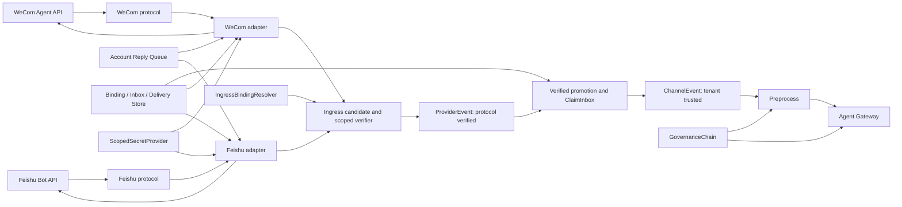
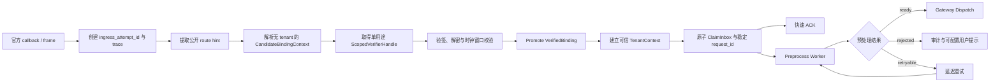
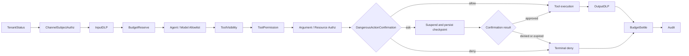
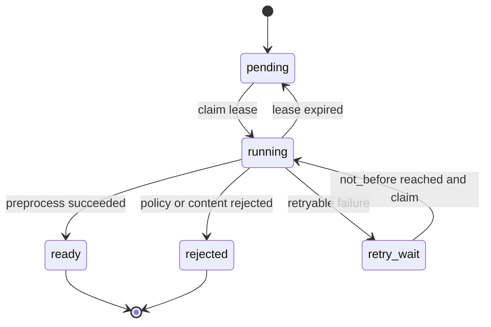
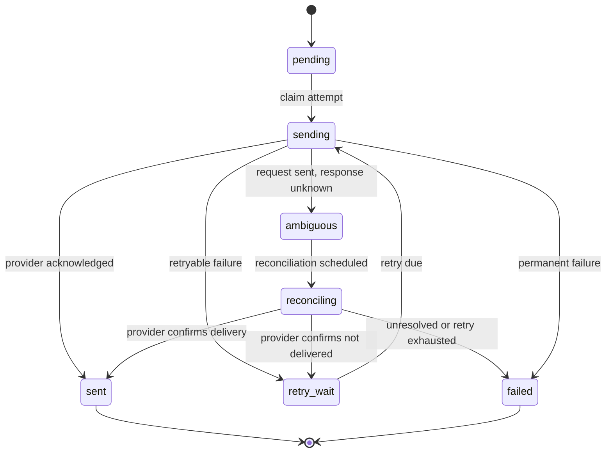
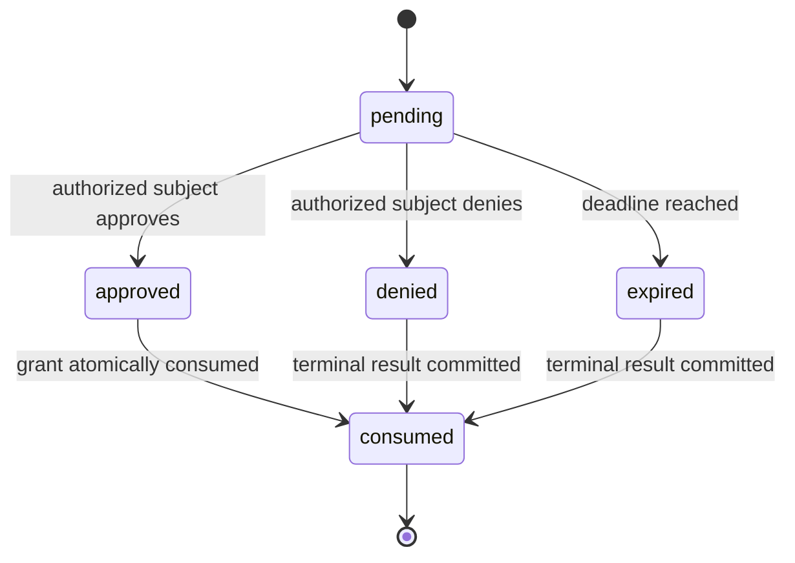

# C 模块：IM Channel、租户治理与安全技术方案

| 文档属性 | 内容 |
|---|---|
| 设计状态 | 规范性技术方案 |
| 模块范围 | WeCom/Feishu Channel Provider、Preprocess、Governance、Confirmation、Secret 与 Redaction |
| 上游依赖 | OpenClaw Channel 生命周期语义；B 模块 Binding、Inbox、Delivery Ledger、Artifact 与 Outbox 契约 |
| 下游协作 | A 模块 Gateway/Runtime，D 模块 Trace、Audit 与安全告警 |
| 总体架构 | [总体技术方案（第 13 节）](0.architecture.md) |

## 0. 阅读指南

本模块回答两个相邻但不同的问题：**如何把 WeCom/Feishu 的不可信协议事件可靠转换为租户内请求并送回回复，以及如何在 Agent/Tool 执行前后实施不可绕过的租户治理。**

### 0.1 三条职责线

| 职责线 | 输入 | 输出 | 自有状态 | 关键边界 |
|---|---|---|---|---|
| Channel ingress | 官方 HTTP callback | durable `ChannelEvent` / ignored terminal | Binding 解析结果、协议验证状态 | 完成协议校验和 ClaimInbox 后才能 ACK |
| Preprocess 与 delivery | payload/media ref、`ReplyEvent` | ready/rejected input、IM 消息 | Preprocess job、Delivery Ledger、`connection_lease` | 不运行 Agent，不修改 Session |
| Governance 与 security | TenantContext、固定 PolicySnapshot、tool call | allow/deny/ask/redact、Audit intent | reservation、confirmation、grant、redaction policy | Adapter 不做业务授权；裸 Tool 不可绕过最终 Guard |

三条线共享 VerifiedBinding/TenantContext、IngressBindingResolver、ScopedSecretProvider、AuditEmitter 和 typed storage ports，但不共享状态机：candidate token 生命周期、Preprocess claim lease、Channel `connection_lease`、A 的 session lease/fence 必须使用不同名称、key 和恢复规则。

### 0.2 两条主链路

入站与回复：

```text
WeCom/Feishu event
→ public route hint + opaque candidate
→ scoped verifier + protocol verify/decode
→ verified promotion + trusted TenantContext
→ ClaimInbox + durable ACK
→ Preprocess
→ A.PrepareDispatch / Worker / CommitTurn
→ Reply Outbox
→ account reply queue
→ Adapter render/split/rate-limit
→ Delivery Ledger
→ IM API
```

治理与确认：

```text
fixed PolicySnapshot
→ subject/input/budget/model/tool checks
→ allow: guarded execution
→ deny: terminal result
→ ask: durable suspension + confirmation
→ one-time grant + A continuation
→ output DLP + budget settle + audit
```

### 0.3 状态所有权速查

| 状态 | 权威模块 | C 的动作 |
|---|---|---|
| Inbox、Reply Outbox、Delivery Ledger | B | 通过 typed port claim/finish，不直写表 |
| Session、`input_seq`、fence、Park/Wakeup | A/B | 生成规范化 session identity；不实现执行协调 |
| App Revision/Config/Policy 版本 | Tenant/B | 透传固定 ExecutionBinding，不解析 current/latest |
| Provider connection/frame/token cache | C | 按 Binding + credential generation 管理 |
| Confirmation/grant/policy decision | C 语义、B 持久化 | 评价、持久化请求、授权主体校验、一次性消费 |
| Trace/metric/audit export | D | 产生上下文、指标和 Audit intent，不直接替代 Audit Outbox |

### 0.4 建议阅读路径

| 读者目标 | 先读 | 再读 |
|---|---|---|
| 实现公共 Channel | §1–4、§7 | §11–12、§16 |
| 实现 WeCom | §5、§7.2 | §13、§16、§19 |
| 实现 Feishu | §6–7 | §14、§16、§19 |
| 实现治理/确认 | §8–10 | §17–18、§19 |
| 排查重复、权限或 secret | §3–4、§7、§10 | §15–19 |

## 1. 设计目标与职责边界

Channel Framework 提供协议无关的入站、出站、Binding、能力发现和生命周期契约。WeCom 与 Feishu Adapter 是平级实现；新增协议只增加 provider package，不修改 Gateway、Worker 或 Session 语义。

Adapter 负责官方协议、身份规范化和投递，不运行 Agent；Gateway/Worker 只认识 `ChannelEvent` 和 `ReplyEvent`，不得 import 平台 DTO。

### 1.1 模块分层与依赖关系



`protocol` 层只实现官方协议；`adapter` 层完成平台对象与公共契约的转换；公共 Preprocess、Governance 和 Delivery 能力不得复制到单一 Provider 内部。

### 1.2 OpenClaw Channel 复用与扩展

本服务不把 OpenClaw 单应用产品运行时嵌入多租户数据面。OpenClaw Channel 位于工具链不兼容的独立模块，因此生产源码不直接导入其包；service-owned Adapter 保持 `ID/Run` 生命周期和 sender capability 语义兼容：

```go
// 生命周期语义参考
type Channel interface {
    ID() string
    Run(context.Context) error
}

type TextSender interface {
    Channel
    SendText(context.Context, string, string) error
}

type MessageSender interface {
    Channel
    SendMessage(context.Context, string, OutboundMessage) error
}
```

复用边界如下：

| OpenClaw 公共能力 | 本服务中的用途 | 本服务扩展 |
|---|---|---|
| `Channel.ID/Run` | Provider 稳定身份、启动、阻塞运行、取消和故障退出 | Binding/credential generation、连接 lease、readiness 和 drain |
| `TextSender` | 纯文本最终投递 | Delivery Ledger claim、租户限流、拆分、重试和审计后才允许调用 |
| `MessageSender`、`OutboundMessage/File` | 文本与媒体的统一出站载荷 | `ContentRef` 安全物化、大小/类型校验、上传和 provider message ID 回写 |
| Channel factory/registry 模式 | 按受信 type 创建 WeCom、Feishu 或后续 Provider | Factory 输入由固定 Binding Snapshot 与 typed deps 组成，配置不能注册代码 |
| OpenClaw Telegram 的公开行为和 fixtures | 校验生命周期、DM/group、媒体与流式降级语义 | 只作兼容性参考；不得导入或复制 `internal/channel/telegram` |

service-owned `Adapter` 是该生命周期契约的严格超集：

```go
type Adapter interface {
    ID() string
    Run(context.Context) error

    PublicRoute(context.Context, CallbackRequest) (PublicRouteHint, error)
    Verify(context.Context, CallbackRequest, ScopedVerifierHandle) (VerifiedCallback, VerificationReceipt, error)
    Decode(context.Context, VerifiedCallback) ([]ProviderEvent, error)
    Deliver(context.Context, DeliveryRequest) (DeliveryResult, error)
    Capabilities() Capabilities
}

type HTTPAdapter interface {
    Adapter
    IsChallenge(CallbackRequest) bool
    PublicChallengeRoute(context.Context, CallbackRequest) (PublicRouteHint, error)
    VerifyChallenge(context.Context, CallbackRequest, ScopedVerifierHandle) (HTTPResponse, VerificationReceipt, error)
    CallbackACK() HTTPResponse
}

```

WeCom、Feishu 和 WebUI Adapter 只实现一套 `ID/Run`。`Deliver` 是平台可靠投递入口；Provider sender 只能由 `Deliver` 在成功 claim Delivery Ledger 后调用，Gateway、Runner 和业务代码不得直接调用 sender 绕过幂等与审计。

独立 `trpc-agent-go/openclaw` 模块（Go 1.24.1）按模块边界隔离，不进入生产依赖图。同形接口只表示生命周期语义兼容；任何工具链或模块边界变化都必须通过 ADR、依赖/SBOM 和 contract 门禁。`openclaw/app`、`runtimeprofile`、单应用 `GatewayClient` 与任何 `internal` Provider 始终禁止进入服务数据面。

Feishu 使用官方 Go SDK 实现 webhook challenge、加密事件验证与解密、严格 mention 映射、媒体读取和消息回复。WeCom 使用 service-owned 协议层实现 Agent XML callback 的签名、AES 解密、URL challenge、媒体读取和应用消息发送。两者共享候选验签、可信 Tenant promotion、Inbox、Preprocess、Reply Queue 和 Delivery Ledger 契约。

`webui.Adapter` 同样实现公共 Adapter，用 HMAC 浏览器协议和只存元数据的 mailbox 验证 provider-neutral 内部链路；它不是独立消息体系，也不证明 Feishu/WeCom 外部 API 可用。Provider 支持边界见[能力边界](8.capability-boundaries.md)。

## 2. 公共接口

```go
type Adapter interface {
    ID() string
    Run(context.Context) error
    PublicRoute(context.Context, CallbackRequest) (PublicRouteHint, error)
    Verify(context.Context, CallbackRequest, ScopedVerifierHandle) (VerifiedCallback, VerificationReceipt, error)
    Decode(context.Context, VerifiedCallback) ([]ProviderEvent, error)
    Deliver(context.Context, DeliveryRequest) (DeliveryResult, error)
    Capabilities() Capabilities
}

// PublicRouteHint contains only provider-public routing material. It is not identity.
type PublicRouteHint struct {
    Channel, ExternalAccountHint, RouteKeyDigest string
    IngressAttemptID, TraceParent string
}

// CandidateBindingContext is short-lived, single-use and intentionally omits
// TenantID, AgentAppID, SecretRef and every Secret value.
type CandidateBindingContext struct {
    Channel, RouteKeyDigest, CandidateToken string
    BindingVersion int64
    Purpose string
    IssuedAt, ExpiresAt time.Time
}

// Both types are opaque capabilities. They expose no Secret or tenant fields.
type ScopedVerifierHandle interface {
    Verify(context.Context, CallbackRequest, ProtocolVerifier) (VerifiedCallback, VerificationReceipt, error)
    Close() error
}

type ProtocolVerifier func(context.Context, CallbackRequest, []byte) (VerifiedProtocolPayload, error)

type VerificationReceipt struct {
    CandidateToken, ReceiptToken, Purpose, ProtocolIdentityDigest string
    VerifiedAt time.Time
}

type VerifiedProtocolPayload struct {
    Body []byte
    Headers map[string]string
    ProtocolIdentityDigest string
}

type VerifiedCallback struct {
    Body []byte
    Headers map[string]string
    ReceivedAt time.Time
    ProtocolIdentityDigest string
}

type IngressBindingResolver interface {
    ResolveCandidate(context.Context, PublicRouteHint) (CandidateBindingContext, error)
    AcquireVerifier(context.Context, CandidateBindingContext) (ScopedVerifierHandle, error)
    PromoteVerified(
        context.Context, CandidateBindingContext, VerificationReceipt,
    ) (VerifiedBinding, error)
}

type VerifiedBinding struct {
    TenantID, AgentAppID, ChannelBindingID string
    TenantVersion, BindingVersion int64
}

// ProviderEvent is protocol-normalized and is emitted only after protocol
// verification. It still becomes tenant-trusted only through VerifiedBinding.
type ProviderEvent struct {
    SchemaVersion uint16
    Channel, ExternalAccountID, ExternalMessageID string
    ConversationType string
    ExternalUserID, ExternalChatID string
    MessageType string
    Text string
    MediaRefs []MediaRef
    OccurredAt time.Time
    TraceParent string
}

// ChannelEvent is created only after Binding resolution and durable ClaimInbox.
type ChannelEvent struct {
    SchemaVersion uint16
    TenantID, AgentAppID, ChannelBindingID string
    RequestID, UserID, SessionID string
    Channel, ExternalMessageID, MessageType string
    Text string
    MediaRefs []MediaRef
    PayloadRef string
    TraceParent string
}

type ReplyEvent struct {
    SchemaVersion uint16
    TenantID, RequestID, ChannelBindingID, DeliveryKey string
    EventSeq uint64
    Kind string
    ContentRef string
    Target DeliveryTarget
    Final bool
    TraceParent string
}

type DeliveryRequest struct {
    Event ReplyEvent
    ClientRequestID string
    Target DeliveryTarget
    Content []byte
    ContentDigest string
}

type DeliveryTarget struct {
    Channel, ExternalAccountID, ExternalMessageID string
    ExternalChatID, ExternalUserID string
}
```

`PublicRouteHint`、`CandidateBindingContext` 和验签失败事件均不具有 tenant 授权语义。公开 route、corp/app hint 或 callback payload 不能直接返回 `tenant_id`、`app_id`、`secret_ref` 或 Secret 值。`CandidateToken` 必须由服务端候选索引签发并绑定单一候选、purpose、签发/过期时间和一次性消费边界，不能由 URL/header/payload 自行拼接。`ScopedVerifierHandle` 在句柄内部短暂持有 Secret，并通过一次性 `ProtocolVerifier` 回调产生 `VerifiedCallback`；调用方不得保存 Secret，`VerifiedCallback` 是后续 Decode 的唯一输入。

`ProviderEvent` 只表示通过协议校验的平台事实；`PromoteVerified` 还必须复核候选未过期、receipt 与候选/用途匹配、Binding 状态有效且候选唯一，之后才能产生 `VerifiedBinding` 并建立 `TenantContext`。Adapter 完成 durable ClaimInbox 后才能创建 `ChannelEvent`；Gateway 仅接收后者，并再次从共享存储复核 request 与 tenant/app 绑定。

Candidate 状态固定为 `issued → verifier_acquired → verified → promoted`；验签失败、超时或 handle 关闭进入 `burned`，不得回到 issued。`AcquireVerifier` 通过 CAS 独占 token，重复获取和重复 promote 均拒绝；`VerificationReceipt` 只能由 handle 内部产生并绑定候选、purpose、协议身份摘要和验证时间，调用方不能自行构造有效 receipt。候选索引和失败安全事件可以使用短保留期，但 promotion、ClaimInbox 和后续业务事实必须使用各自权威存储，不能把 candidate token 当长期身份或幂等键。

候选过期由有界 `CandidateExpiryReconciler` 周期清理：按 `(state, expires_at)` 索引批量把已过期的 `issued`、`verifier_acquired` 和尚未 promote 的 `verified` 转为 `burned`，不触碰 `promoted`。PostgreSQL 清理使用 `FOR UPDATE SKIP LOCKED`，与正常 Acquire/Promote 并发时以版本/CAS 结果为准；各存储实现按微秒粒度比较验证时间，避免时间精度差异造成后端行为分叉。

Capabilities 表示 text、stream/edit、markdown、card、image、file、recall 等可选能力。公共接口不要求所有平台实现相同能力集合，调用方必须依据能力协商结果选择投递方式或降级策略。

### 2.1 Channel、Runner 与回复的转换边界

Channel 生命周期语义兼容不表示让 Provider 直接调用 Runner。多租户链路固定为：

```text
OpenClaw-compatible Adapter.Run
→ PublicRoute / Verify / Decode
→ ProviderEvent
→ VerifiedBinding + ClaimInbox
→ durable ChannelEvent
→ Preprocess 将 text/media/mention 转为规范化用户内容
→ Gateway PrepareDispatch
→ Worker 依据固定 ExecutionBinding 构造 model.Message
→ runner.Run
→ Agent Event stream
→ CommitTurn + Reply Outbox
→ ReplyEvent
→ Adapter.Deliver
→ Provider sender capability
→ IM platform
```

`model.Message` 的 role 固定为 user；文本、媒体和 mention 只能来自已验证、已持久化的规范化内容，不能直接使用原始 callback DTO。Worker 而非 Adapter 调用 `runner.Run`，并注入 `AppName`、`request_id`、tenant-aware Session/Memory/Artifact/Knowledge facade 与固定 Model/Tool/Skill Policy。Adapter 因而不能绕过 `PrepareDispatch`，也不能持有 Runner。

Agent Event 在 Worker 内先区分可丢弃体验事件和必须持久化的终态事件。只有 CommitTurn 成功后的 Reply Outbox 可以生成可靠 `ReplyEvent`；Channel renderer 再根据 `Capabilities` 映射为 Provider 支持的消息。sender 是最后一跳传输能力，不承担 Session、执行终态或幂等事实。

## 3. 固定处理链



大媒体下载、病毒扫描、完整 Input DLP 和格式转换在 ACK 后运行。Preprocess 状态固定为 `pending/running/ready/rejected/retry_wait`，使用独立 claim lease；它不是 session lease，也不产生 session fence。rejected 不分配 input_seq，也不进入用户可见 Session 历史，但写审计和可配置的用户提示。

`ClaimInbox` 与初始 `PreprocessJob` 必须在同一存储事务中建立；normalized payload 可先按稳定 RequestID 幂等持久化，若进程在 payload 与事务之间中断，由重复 callback 完成缺失事务。`running → ready` 必须与 Inbox 的 `preprocess_pending → dispatch_pending` 原子提交；`PrepareDispatch` 在此前 fail closed。ready Job 再使用独立的短 lease/CAS 竞争 Dispatch，成功后写 `dispatched_at`；进程在 ready 与 Dispatch 之间崩溃时由过期 lease 扫描恢复，不能靠 sticky process 或下游偶然幂等兜底。

纯文本的 provider-neutral JSON 规范化是确定性、无外部副作用的 ingress 操作，可在 durable payload 写入前完成；Preprocess Worker 必须重新执行 digest、严格 schema 和内容校验，并承接 mention 清洗、媒体下载、病毒扫描、DLP、格式转换等有副作用或重计算阶段。该提前规范化不允许绕过 Preprocess Job、直接把原始 callback DTO 交给模型或提前进入 `PrepareDispatch`。

协议 façade `RunSubmitter` 只接受严格纯文本，并以 `dispatch_pending` 进入共享 `PrepareDispatch`，不创建 IM `PreprocessJob`。媒体输入必须走 Channel Preprocess；任何启用的 Input Governance 依赖不可用或 verdict unknown 时都必须 fail closed。

验签前只允许记录不含租户授权语义的全局入口安全事件，例如 `ingress_attempt_id`、trace、route digest、时钟窗口结果和稳定错误分类。稳定业务 `request_id` 只能由可信 TenantContext 下的 `ClaimInbox` 原子生成；重复 callback 返回同一 request ID。验签失败不得调用 tenant-scoped Inbox、Session、Memory、Audit 或 Secret API。

<a id="channel-binding-session"></a>

## 4. Binding、去重与 session

`ChannelBinding` 唯一绑定 `(channel, external_account_id)` 到一个 tenant/app，入站验证使用 `secret_ref/channel_verify`，出站与官方媒体下载使用独立 `send_secret_ref/channel_send`，两者不得互相回退。公开索引只保存不可逆 route/account digest 到 opaque candidate identity 的映射；tenant/app/SecretRef 只能在 `PromoteVerified` 成功后从受控 Binding Store 读取。找不到、候选不唯一、candidate token 重放、purpose 不匹配或密钥版本不可用时均 fail closed。媒体 normalized payload 与 ReplyEvent 必须保存 callback/route 已冻结的 `config_version`；后续 locator 只读该精确快照版本，不读取 active/current。tenant 为 suspended/disabled 时仍可在验证成功后 durable claim callback 以完成去重和安全 ACK，但必须生成非执行终态，不能进入 PrepareDispatch；disabled 不再发送普通业务回复。状态边界以 [Tenant 根实体文档（第一部分第 6 节）](1.tenant-root-design.md) 为准。

入站幂等键优先使用平台稳定消息 ID；没有稳定 ID 时使用账号、会话、主体、时间桶和规范化 payload digest，并记录碰撞指标。

DM/group session ID 按总体架构的 tenant HMAC 规则生成，canonical input 必须包含 channel、外部账号 scope、会话类型和外部 user/chat ID，并使用 ScopedSecretProvider 在可信 tenant identity/session purpose 下提供的版本化密钥。无密钥 SHA-256 不能替代该规则；SHA-256 只可用于非敏感内容摘要或幂等键。外部用户映射表带 tenant、channel、account scope；跨群共享只能进入租户 Memory，不能共享 Session。

Adapter 只携带 `PrepareDispatch` 固定的 `tenant_id + agent_app_id + agent_app_revision + content_digest + config_version + policy_version`，不引入 `agent_version` 或 `published_version`。session fence 校准和乱序 Park/Wakeup 复用 A 的 coordination/input gate 与 B 的持久状态契约；C 的 `connection_lease` 只管理通道连接。Session 后端由 tenant/app 的 BackendBinding 选择，而不是按 IM channel 硬编码；演示租户使用不同后端只用于验证适配与迁移路径。多 Worker 下，后端仍须满足 `AtomicTurnCommit`、stale fence、CAS 和 tenant scope contract。

<a id="wecom-adapter"></a>

## 5. WeCom Adapter

- 企业微信协议遵循 Agent API 的签名、AES、access token、媒体和应用消息接口。
- Agent XML callback 与应用消息发送共享 ChannelEvent/ReplyEvent，不暴露平台 DTO。
- 回调在验签、解密和 durable ClaimInbox 后快速 ACK。
- access token 按 corp/app/credential version 共享缓存并提前刷新；401/失效只允许有界刷新重试。
- 使用官方 golden vectors 验证签名、AES、receive-id 和 XML/JSON 编解码。

Agent 加密 XML callback、URL 验证 GET 与应用消息发送共用 scoped verifier：URL 验证先解析 opaque route，再校验时钟窗、签名、AES 明文和 receive-id，成功后原样返回 challenge，不创建 Inbox。协议层按企业微信字段、排序、AES 布局和 XML envelope 验证兼容性；`AccessTokenProvider` 以冻结 ConfigSnapshot 的独立 `send_secret_ref` 解析严格 `{corp_id,corp_secret,agent_id}`，负责共享缓存和强制刷新，sender/media fetcher 在明确的 token 失效码后最多强制刷新一次。WeCom 没有等价于 Feishu Reply UUID 的请求级幂等字段，`clientRequestID` 只用于本地 Delivery Ledger；Provider 侧 `enable_duplicate_check` 按收件人和内容在时间窗口内去重，弱于请求级幂等且可能抑制窗口内合法的相同文本。WeCom Bot、WebSocket/Webhook 和群聊 mention 不在支持范围，详见[能力边界](8.capability-boundaries.md)。

<a id="feishu-adapter"></a>

## 6. Feishu Adapter

- 长连接或 callback transport 共享同一 normalize/delivery contract；`header.event_id` 作为 Inbox 稳定去重 ID，`message.message_id` 只用于回复定位，二者不得混用。
- Binding ready 时通过 Bot Info 获取并缓存机器人自身 OpenID；缓存键必须包含 binding 与 credential version，凭据轮换后重新解析，失败则群聊入口 fail closed。
- 协议层把 `message.mentions[]` 的 `key`、`id.open_id`、`tenant_key` 与 `message.content` 中对应 placeholder 解析为带 span 的 `Mention`，并把平台定义的 everyone mention 归一为独立 `MentionAll`；禁止根据显示名或对原始文本做全局字符串替换。
- p2p 总是进入后续门禁。group 仅在 mentions 中存在 `id.open_id == bot_open_id` 时处理；单独 `@其他成员` 或 `@所有人` 不触发执行。
- 混合 mention 中只删除机器人自身 placeholder；其他成员与 everyone mention 保留为规范化可见文本。只要存在自身 mention 就处理剩余正文；删除后正文为空则 durable ACK 为 ignored，不调用 Agent。
- Reply API 使用 `message.message_id` 定位，并以 C 透传的稳定 `delivery_key` 派生 API UUID；同一逻辑回复重投必须复用 UUID。
- Feishu SDK Client 按 tenant/binding/account 与 credential generation 共享；generation 变化时原位替换，避免每次 Reply 重建 client。固定的 SDK v3.10.0 token cache 实际为进程级全局缓存，并非 client-local；共享 Client 仍用于明确生命周期、减少构造开销和冻结 credential generation。429、`99991400/99991401` 等 provider 限流码和 SDK token 失效码必须进入有界重试，不能因 HTTP 400/200 外层状态误判为永久失败。

HTTP challenge 支持明文 `url_verification` 与配置 EncryptKey 后的 encrypted challenge；二者都在 scoped verifier 内复核 verification token，encrypted 形式先用官方 `EventDecrypt` 解密，成功后只返回 provider 要求的 challenge JSON，不创建 Inbox。统一 endpoint 对普通 callback 仅在公共 Pipeline 完成 payload 持久化与原子 Inbox/PreprocessJob 后返回 `{"code":0}`；依赖不可用返回可重试 HTTP 状态，验签细节不写入响应。

## 7. 回复与 Delivery Ledger

Reply Relay 只把 ReplyEvent 路由到 binding/account 队列；Adapter owner 负责真实 API 调用。Delivery Ledger 唯一键为 `(tenant_id, delivery_key, segment_no)`，状态为 pending/sending/retry_wait/sent/ambiguous/failed。

`ReplyEvent.DeliveryKey` 固定等于 B 模块确定性生成的 `reply_id`。C 不得再按 Worker、重试次数或随机 UUID 改写它；renderer/format version 和分片计划在首次 claim 时写入 Delivery Ledger，后续重投复用同一计划。Relay 同时写入冻结的 `DeliveryTarget`，Delivery Service 将 ResultStore 的正文和 digest 复制到 `DeliveryRequest`；Adapter 不得自行查询当前配置或使用未冻结的外部目标。

- sent 重投直接 ACK，不重复发送。
- 429 按官方 retry-after 调度。
- 5xx/网络失败有界退避。
- 请求已发出但响应丢失标记 ambiguous；先查询平台能力或等待对账，不能盲目重发。
- IM 投递失败只重试 Reply，不重跑 Agent。

### 7.1 流式回复与 SSE 降级语义

Channel Framework 统一处理逻辑 ReplyEvent，但按 Provider capability 选择交付形式：WeCom stream/卡片/分片、Feishu reply/edit、HTTP SSE 或非流式终态回复。流式传输不是事实存储：

- `run.started/progress/message.delta` 属于可丢弃体验事件，使用有界非阻塞缓冲；慢消费者不得反压 Runner、CommitTurn 或 Relay。
- `message.completed/run.completed/run.failed/run.denied` 属于终态通知，必须由已提交的 session result/Reply Outbox 派生并优先投递，不能只存在进程内 Hub。
- Gateway 与 Worker 分离或水平扩展时，实时 fan-out 使用共享 EventBus；Pub/Sub 只负责唤醒和低延迟分发，完整回放按 tenant/request/cursor 从持久 event/result store 读取。
- 客户端断开只取消该订阅；是否取消 Agent 必须调用显式 cancel API 并写共享 cancel intent，不能把 SSE TCP 断开等同于业务取消。
- delta 丢失时客户端从最后确认 cursor 获取终态或持久事件，不要求 sticky session。

当前实现中，Worker 将 `run.started/message.delta` 放入有界本地队列，再以 Redis Pub/Sub 按 tenant 哈希主题发布；`webui-local` 和启用 WebUI 的独立 Channel 角色都经已签名 SSE、冻结 ReplyRoute 过滤给浏览器。队列或订阅者溢出、Redis 短暂不可用时只丢体验事件。输出 DLP 未禁用或使用富内容渲染器时禁止发布 delta，避免在终态治理前暴露内容。飞书/企业微信原生 stream-edit 仍只投递终态 Reply Outbox，Pub/Sub 不能被当作共享事实存储或重放来源。

### 7.2 WeCom 流式回复与主动消息降级

WeCom WebSocket transport 将同一逻辑回复串行化到 binding/account + conversation 队列。`ReplyStream` delta 先按 UTF-8/Markdown 边界聚合；账号级 token bucket、会话最小发送间隔和平台 429/频控响应共同决定刷新频率，配置不得高于平台限制。高频 token 只更新内存中的待发送聚合，不逐 token 调用平台。

Delivery Ledger 除公共状态外保存 `connection_generation`、`req_id/frame` 到期时间、`accepted_cursor` 和 `finish_accepted`。降级规则固定为：

1. 尚无任何 stream frame 被平台接受，且 frame 已过期、连接 generation 改变或平台明确返回不可继续回复时，可发送一条完整主动消息。
2. 已有前缀被确认可见时，先结束或放弃旧 stream，再按 `accepted_cursor` 发送带“续接”标识的剩余后缀；不得重新发送完整答案。
3. 平台是否接受上一帧不确定时标记 `ambiguous`，优先查询/对账；不能盲目切主动消息，否则可能产生重复和乱序。
4. `finish` 成功后禁止主动消息降级；所有主动分片沿用同一 `delivery_key` 并递增 `segment_no`，只能由账号队列按序发送。

主动消息所需的 transport-specific BotID/Secret 或 corp/app 凭据和 scope 由 Binding 的 SecretRef 与 capability check 管理，只有 Adapter owner 可解析；Worker、ReplyEvent 和日志不携带明文。Binding 启动及凭据轮换时验证发送权限，权限缺失将 binding 标为 unhealthy，而不是等到流式失败后静默丢消息。

## 8. GovernanceChain

PolicySnapshot 在请求入队时固定版本，Worker 执行前复核。治理阶段及其顺序属于公共契约：



平台安全 Filter 不允许 Agent 删除、重排或 short-circuit。工具白名单既影响模型可见列表，也在实际执行前再次校验，防止动态/子 Agent 绕过。

### 8.1 上游工具权限原语映射

service 不重新实现一套 Tool 执行框架，而是把固定 PolicySnapshot 编译为核心 `trpc-agent-go/agent` 的 per-run RunOption：

| Governance 阶段 | 上游原语 | service 侧职责 |
|---|---|---|
| ToolVisibility | `agent.WithToolFilter` | 从 tenant/app 白名单生成可见性谓词 |
| ToolPermission | `agent.WithToolPermissionPolicy` 或 `WithToolPermissionPolicyFunc` | 在参数修复和 before-tool callback 后，以最终参数执行 tenant/subject/tool 策略 |
| DangerousAction routing | `agent.WithToolExecutionFilter` | 对需异步确认或外部执行的工具返回 false，使 Runner 在 assistant tool_call 后停止自动执行并交还 service |
| Model selection | `agent.WithModel`/`WithModelName` | 只注入 ExecutionProfile 允许的固定模型 |

`WithToolFilter` 是可见性软约束，且上游 framework tools 不受它过滤，不能作为安全边界。所有实际执行仍必须通过 `WithToolPermissionPolicy`、资源级授权和工具自身不可绕过的检查；动态 Agent、子 Agent 和 framework tool 必须运行相同 contract suite。`WithToolExecutionFilter=false` 不是 deny，而是把带参数的 tool call 转交 service 的 confirmation/external-tool 编排，不能直接丢弃。

`WithToolExecutionFilter` 的谓词只接收 Tool，不接收最终参数。因此，只要某工具的确认要求可能依赖参数或资源，该工具在本次运行中必须始终走 caller-executed 路径；service 收到最终 tool_call 参数后复用同一 PolicySnapshot evaluator 执行参数/资源授权，再决定 allow、deny 或 durable ask。不得尝试在该 Filter 中做参数级授权，也不得假设被转交的工具已经通过 `WithToolPermissionPolicy`。

上游 Filter/PermissionPolicy 之外必须再有不可绕过的最终执行层 Guard。Tool Registry 向 Agent、动态/子 Agent、framework tool 和 caller-executed continuation 暴露的只能是 tenant-scoped wrapper；wrapper 在真正调用底层 Tool 前重新要求可信 TenantContext、request/tool-call ID、固定 PolicySnapshot、规范化最终参数和资源授权结果。缺任一上下文、策略版本漂移、参数 digest 不符或授权非 allow 时均 fail closed，并产生强制审计。底层裸 Tool 不得注册到运行时容器或从公共 Registry 取出；内部管理工具若必须例外，使用独立进程身份、显式 capability 和相同审计契约，不能依赖 Go 调用路径“不会被碰到”。

生产 Tool Catalog 采用服务代码注册的不可变 `(tenant_id, tool_id, tool_version)` 三元组；配置、Agent 请求和远端脚本都不能新增或替换注册。Resolver 只按完整租户与精确版本读取 `active` 注册，拒绝 `suspended/disabled`、版本回退、重复引用、声明名称漂移和跨租户调用，并在返回给 Agent 前附加 tenant-bound wrapper。工具需要凭据时只能通过 `BuildRequest.ResolveSecret` 在实际调用的可信 ExecutionContext 中使用 `tool_call` scope（tenant、subject、tool/version）；SecretRef、客户端和原始工具实例不进入 Revision、Envelope 或日志。没有业务工具注册时 Resolver 必须 fail closed，不能退回测试工具、framework tool 或 mock。

租户全局限流和预算使用 Redis Lua 或独立 Rate Limit Service。本地 semaphore 只保护 Pod。预算使用 reserve/settle/refund ledger，以 request/tool_call id 幂等，金额统一 `int64 cost_micros`。

启用金额预算时，PolicySnapshot 必须固定可审计的 PricingSnapshot，至少区分 provider/model/version、input/output/cache token 单价、币种、换算版本和生效时间。预算预留采用请求允许的保守上界，模型返回 usage 后按同一计价版本 settle，多余部分 refund。若 provider/model 没有价格、usage 无法映射、币种转换缺失或 PricingSnapshot 已失效，金额治理必须 fail closed；禁止把未知成本按 0 处理。仅配置 token budget 而未配置金额预算时可以只按 token 执行，但仍记录 `pricing_status=unavailable` 供运营发现。

### 8.2 Plugin、Guardrail 与 Callbacks 复用

平台复用上游执行扩展点，但把权限边界保留在 service-owned Guard：

| 扩展层 | 上游公共能力 | 适合承载 | 不得承载 |
|---|---|---|---|
| Runner Plugin | `plugin.Plugin`、`plugin.Manager`、`runner.WithPlugins` | 跨 Agent 的 trace、usage、稳定事件增强 | tenant 解析、最终授权、持久提交 |
| Agent callbacks | `agent.Callbacks`；LLM/Graph/Chain/Parallel/Cycle 的 Agent callback options | Agent 前后事件、组合节点观测、预算检查点 | 修改固定 execution versions 或跳过子 Agent Guard |
| Model callbacks | `model.Callbacks`、LLM Agent 的 Model callback options | provider 观测、usage/错误归类、输入输出 DLP 接缝 | 动态替换未批准模型、泄露 prompt/response |
| Tool callbacks | `tool.Callbacks`、LLM Agent 的 Tool callback options | 调用观测、参数规范化后的审计接缝 | 代替 tenant-scoped Tool wrapper 的最终授权 |
| Platform Guardrail | GovernanceChain、PolicySnapshot、tenant-scoped wrappers | 强制身份、预算、DLP、权限、确认、审计 | 被 tenant 配置删除、重排或 short-circuit |

装配顺序固定为：平台 mandatory before-guard → 受信 Plugin/callback → 上游 Agent/Model/Tool → 受信 after-callback → 平台 mandatory output/settle/audit guard。tenant 只能从 Provider Catalog 选择获批扩展及配置，不能上传 Go plugin、回调函数或任意远程代码。组合 Agent 的每个子节点、动态 Tool、framework tool 和 continuation 都继承同一 callback/Guard 装配，不能只保护根 Agent。

Callback 输入只暴露最小、脱敏、不可变视图；不得修改 TenantContext、Agent Revision、Config/Policy version、fence、授权结果或 Secret scope。普通 telemetry callback 超时/失败按有界降级记录，不改变业务结果；强制 DLP、授权、预算和审计接缝失败则 fail closed。所有 callback 必须有 deadline、并发上限、panic 隔离和稳定 error class，禁止在 callback 中同步调用无界外部服务。

同一业务动作只产生一个权威治理决策和 AuditEvent。Plugin/callback 可以添加 span/event link，但不能另写相互冲突的预算或审计事实。升级 tRPC-Agent-Go 时必须运行 callback 顺序、参数变更、错误传播、组合 Agent 覆盖和 cancel/panic contract test；顺序无法证明时危险 Tool 与敏感 Model 路径不得启用。

## 9. 危险工具确认

`ask` 必须是真正 suspension：停止当前自动执行路径、保存可恢复引用、提交 waiting_confirmation、释放 lease且不推进 next。C 定义 SuspensionRequest、Confirmation、Grant 和平台交互；Runtime 基于上游恢复基座实现分布式 continuation，而不是重写 Runner 内核。

实现按 Agent 类型选择恢复路径：

1. **GraphAgent**：复用 `graph.CfgKeyCheckpointID`、checkpoint saver 和带 `ResumeMap` 字段的 `graph.ResumeCommand`。waiting commit 保存 checkpoint ID/namespace 和待确认 tool call；批准后新 Worker 以新 fence 加载 checkpoint 并传入 resume value。
2. **LLM/non-graph Agent**：通过 `WithToolExecutionFilter` 将确认类工具改为 caller-executed。Runner 发出 assistant tool_call 后结束本次自动执行；service 持久化 tool_call ID、最终参数摘要和会话水位。批准后执行工具并以对应 `model.NewToolMessage` continuation 恢复同一 request/input。
3. **Await-user-reply routing**：Bundle 已启用 `runner.WithAwaitUserReplyRouting(true)`，以 `agent.AwaitUserReplyRoute` 实现一次性后续用户回合路由。路由状态由当前 `BufferedTurn` 缓冲，只有与 event/state 同一次 fenced `CommitTurn` 成功后才对其他 Worker 可见；新 Worker 按不可变 Bundle 图重解析该路径。它不能替代 confirmation、grant、lease/fence 或 checkpoint 的持久化状态机。

上游 `tool.PermissionActionAsk`/`approval_required` 是权限决策原语，不等于 durable suspension。分布式异步确认不得只把 `approval_required` 结果交还模型并让 event loop 继续运行。

确认结果通过上述 continuation 恢复同一 request/input。approve 产生短期一次性 grant；deny/timeout 是终态并推进 next。grant 绑定 tenant、subject、tool、参数 digest 和 policy version，原子消费。任一路径尚未通过 checkpoint/tool-call、崩溃接管和重复确认测试时，`ask` 必须启动失败或降级为 deny。

## 10. 密钥与脱敏

```go
type SecretScope struct {
    TenantID, SubjectID, Purpose, ResourceID string
    ResourceVersion int64
}

type ScopedSecretProvider interface {
    Resolve(context.Context, SecretScope, SecretRef) (SecretValue, error)
}
```

公开入站验签不调用 tenant-scoped `Resolve`，而是通过 `CandidateBindingContext → AcquireVerifier` 获得短期单用途 `ScopedVerifierHandle`。该 handle 不可序列化、不可进入领域对象、不可交给 Runner，并在 Verify 返回前销毁。验签成功后，Adapter/Worker 才能分别使用可信 scope 调用 `channel_send`、`model_call`、`tool_call`、`backend_connect` 或 `payload_encrypt` purpose；purpose 或资源版本不匹配必须拒绝。`payload_encrypt` 只授权当前 tenant 的 `messaging-payload` 固定 generation，不得借此读取通道、模型或其他租户密钥。

配置、Envelope、Binding 只保存 ref/version。Adapter 只可读当前 Binding 被授权的通道密钥，Worker 只可读固定 Profile/Policy 授权的模型、工具或后端密钥，Admin 不读取明文。轮换通过新 ConfigSnapshot/Profile credential version 生效，缓存按 ref+version 失效。生产装配禁止暴露无 Tenant/Purpose 的全局 `Resolve(SecretRef)`；InMemory fake 可以为测试提供便利构造器，但必须通过相同 scope 负向契约。

当前生产参考实现使用只读 CSI 文件系统：完整 tenant/subject/purpose/resource/resource-version/ref/ref-version 经长度前缀 canonical encoding 和 SHA-256 派生不透明文件名，文件是否存在即该坐标的显式授权。Provider 拒绝可写给 group/world 的根目录、非普通文件、非 `0400/0600` 文件、空值和超限值；同版本内容在进程运行期间漂移时返回稳定 version mismatch。轮换只能增加新的 ref version 并滚动 generation，不能原地覆盖旧版本。该参考实现要求部署控制面为每个授权坐标投影文件；未来接 Vault/KMS provider 时仍须运行相同 scope/version 负向契约，不得退化为只按 ref 查值。

Redactor 在 log、span、audit、metric exemplar 和 error report 之前执行。tenant 的 `log_masking_level` 选择 `none/basic/strict` 兼容 profile，`audit_payload_mode` 控制审计载荷保留形式；即使 masking level 为 `none`，Authorization、callback token、AES key、model API key、DSN、原始媒体或完整工具参数仍禁止记录。CI 使用 secret canary 扫描所有 sink。

具体 sink 不得各自维护字段枚举或正则。`trpcservice/redaction` 统一处理 generic credential、service mandatory payload 字段、profile PII 与 tenant 的声明式 `Rule`，并一次编译为不可变 Program；框架只使用官方 `trpc-agent-go v1.11.2` 已发布 API，不引入内部或 fork 脱敏包。规则只能追加脱敏。编译拒绝空 matcher、重复标识、无效正则及超限规则；`tenant.redaction_rules` 随 tenant version 通过 CAS 原子发布，Repository 在读取与写入时均校验并把空值归一化为 `[]`。Gateway 的 HMAC principal resolver 以及 Worker 的 execution-envelope 验证分别从已授权/已固定的 tenant version 编译 Program 并写入 context；Logger 只消费 context 中的 Program。不能把 repository、原始 JSON 或未编译规则注入 sink。

## 11. 代码组织与契约测试

```text
trpcservice/channels/{contract,registry,binding,wecom,feishu}/
trpcservice/channels/ingress/       # public route、candidate、verify、promote
trpcservice/preprocess/
trpcservice/governance/
trpcservice/secrets/
trpcservice/redaction/            # framework scrubber + compiled service policy
trpcservice/log/                  # structured logging consumes redaction Program
```

WeCom、Feishu 和 fake provider 运行同一 Adapter contract suite：Binding、重复入站、跨租户隔离、durable ACK、Reply 重投、媒体 scope、secret、trace 和节点接管；再分别运行官方协议 fixtures。

## 12. Provider 分层架构

每个 IM Provider 固定分为三层：

```text
protocol/   官方 HTTP/WS DTO、签名、加解密、API client；不知道 tenant/session
adapter/    Binding、identity、normalize、ClaimInbox、ReplyEvent 转换
plugin/     配置解析、依赖装配、生命周期和注册
```

`protocol` 不 import Gateway、Storage、Policy；`adapter` 只依赖 typed ports；Gateway 不 import provider。第三个 fake IM 必须能只新增 provider package 接入，否则公共契约不合格。

```go
type ChannelRuntimeDeps struct {
    Bindings  BindingReader
    Identity  IdentityMapper
    Inbox     InboxClaimer
    Preprocess PreprocessScheduler
    Inbound   InboundDispatcher
    Replies   ReplySubscription
    Delivery  DeliveryStore
    Artifacts ArtifactStager
    IngressBindings IngressBindingResolver
    Secrets   ScopedSecretProvider
    Audit     AuditEmitter
}
```

## 13. WeCom 详细流程

Bot/Agent transport 共享 normalize 和 delivery contract，但保留官方差异：

- Agent callback：校验 msg_signature/timestamp/nonce，AES 解密并验证 receive-id，解析 XML/JSON。
- Bot webhook/frame：按官方 Bot 鉴权、心跳、消息 ID 和回复语义处理。
- Agent API：ScopedSecretProvider 以 verified binding、`channel_send` purpose 和 credential version 获取 corp secret，token cache 使用 singleflight 和 credential version；媒体先调用官方上传接口。
- WebSocket：`connection_lease:{binding_id}` 只有一个 owner；心跳超时停止出站，释放/等待 lease 后重连。

回调 ACK 预算分配：协议校验与解密 20%，Binding/ClaimInbox 40%，响应编码 10%，保留 30% 抖动；下载、DLP 和 Gateway dispatch 不在同步预算内。若 durable store 不可用则返回平台可重试状态，不得先 ACK 再只存在内存。

官方 conformance fixtures 至少覆盖：签名正确/错误、过期 timestamp、错误 receive-id、AES padding、重复消息、文本/图片/文件、token 过期、429、5xx 和响应丢失。

## 14. Feishu 详细流程

callback transport 先校验事件 token/signature、timestamp 和 app identity；WebSocket transport 复核 SDK 已认证连接的 app identity 与事件 header，再按 `header.event_id` ClaimInbox。解析 `message.content` 前必须先按 `message_type` 解码对应 schema；text 的 mention placeholder 与 `message.mentions[]` 一一匹配，缺失 key、重复 span、OpenID 不完整或 content 非法时 fail closed 为 ignored/rejected 并记录 reason，不把未清洗占位符交给 Agent。

群聊 contract fixtures 至少覆盖：仅 @机器人、仅 @其他成员、仅 @所有人、@机器人+@其他成员、@机器人+@所有人、重复自身 mention、删除自身 mention 后空正文、伪造显示名但 OpenID 不匹配。出站 fixtures 覆盖同 UUID 重投、MessageID 不存在、429、5xx、响应丢失和凭据轮换。

<a id="preprocess-job"></a>

## 15. Preprocess Job 契约

```go
type PreprocessJob struct {
    TenantID, RequestID, JobID, PayloadRef string
    AgentAppID, SessionID, UserID, Channel string
    TenantVersion int64
    State string
    Attempt int
    LeaseOwner string
    LeaseUntil, NotBefore time.Time
    RejectCode string
    DispatchedAt time.Time
    Version int64
}
```

状态转换必须满足以下状态机：



claim/renew/finish 都用 version CAS。`running` 的 preprocess lease 与 `ready` 的 dispatch lease 复用字段但属于互斥逻辑阶段，owner/version 均须匹配；Dispatch 失败不把 ready 降回 pending，lease 过期后重领，成功才写 `dispatched_at`。媒体下载幂等键为 request+media ordinal+source digest；病毒扫描和 DLP 版本写入结果，策略升级是否重扫由 ConfigSnapshot 决定。

外部图片/文件 URL 只能作为待处理引用，不能直接进入模型、Knowledge loader 或 Tool。MediaStager 必须：仅允许配置批准的 `https`/Provider 下载方式；解析和每次 redirect 都拒绝 loopback、link-local、RFC1918、云元数据地址及租户禁用域；对 DNS rebinding 绑定解析结果；限制 redirect 次数、连接/读取超时、声明与实际字节数、解压后大小、文件数和压缩比；校验 MIME/魔数并执行病毒扫描与 Input DLP。产物写入 tenant-scoped Artifact 后只传受控 ArtifactRef。下载失败或扫描结果未知时 fail closed，不得回退为直接 URL。

Artifact 内容持久化不得把对象存储 key 暴露为模型可见引用。SQL 只持有 tenant/request、稳定 `ArtifactRef`、对象 key、digest/size/MIME、malware/DLP 版本和生命周期索引；对象内容由显式注入的 tenant-scoped ObjectStore 读取并再次校验。object-first 写入必须先建立 durable upload intent，元数据提交与 intent 删除同事务；orphan reconciler 只有在 intent 过期、SQL 引用复核为空且条件 digest 匹配时才能删除对象。正常引用的保留期限必须由独立 Artifact policy 显式配置，以首次 durable prepared payload 创建时间冻结；prepared payload 与关系化引用同事务写入，回收器只能认领全部引用到期或超过 orphan grace 且无引用的 Artifact，并使用 lease/version CAS、条件对象删除、有界退避和 quarantine。不得解析加密 payload 猜测引用，不得复用 audit retention，也不得在请求路径即时删除。PostgreSQL bytea 只用于小型部署和兼容读取；分布式生产组合根必须注入 ObjectStore provider，真实 scanner/provider 不可用时不能回退 bytea 或跳过扫描。

首个 malware provider 使用 clamd `INSTREAM`，分别限制拨号、版本命令和扫描 deadline，并限制 chunk、总字节和响应长度；trim 后的真实 engine version 非空才可固定到 Artifact 扫描元数据。首个 DLP provider 使用共享 HTTP Client、tenant-scoped HTTPS authorizer 和拒绝未知字段的版本化响应，Probe 同样必须走 scoped authorizer。两者只有显式 clean 且 version 非空时才能继续，rejected 与 unavailable/unknown 必须保持不同处理；健康探测成功不替代每次媒体 verdict。

## 16. Delivery 状态机



发送前持久化 attempt 和平台 client_request_id；响应成功后保存 provider_message_id。没有平台查询/幂等能力的 ambiguous 消息默认人工/延迟对账，不立即重发。多分片只有前一分片 sent 后才发下一分片；重试从第一个非 sent segment 开始。

`reconciling` 是逻辑阶段，不额外持久一个 Ledger state；行在 Provider 查询期间仍保持 `ambiguous`，并通过 version CAS、`reconcile_attempt` 与 `not_before` 防止并发或无界对账，查询结果再原子转为 sent/retry_wait/failed。出站只支持 `segment_no=0` 且 `segment_count=1`；多分片和部分分片重试不在支持范围。

撤回事件默认写独立 ChannelEvent/Audit，不删除 Session 事实；租户策略可以追加“已撤回”事件。Agent 回复撤回只有 Provider Capabilities 支持且授权通过时执行。

## 17. Policy 数据模型与决策

```go
type GovernanceDecision struct {
    DecisionID, TenantID, RequestID, Stage string
    Action string // allow, deny, ask, redact, throttle
    ReasonCode string
    PolicyVersion int64
    RuleIDs []string
    Redactions []Redaction
    ReservationID string
    Suspension *SuspensionRequest
}
```

规则评价必须确定性：相同 snapshot、主体和规范化输入得到相同 decision/reason。deny reason 使用枚举，不将内部规则或 secret 暴露给 IM 用户。预算预留 key 为 tenant+request+resource+attempt class；模型/工具成功后按实际 usage settle，失败按政策 refund。

## 18. Confirmation 表与流程

```text
confirmation(
 tenant_id, confirmation_id, request_id, input_seq,
 subject_id, channel_binding_id, tool_name, args_digest,
 policy_version, checkpoint_ref, state,
 expires_at, decision_at, version
)
```

确认状态必须按照以下状态机推进：



只有 `approved` 能生成 grant；grant 在 continuation 开始前原子 consumed。重复按钮回调返回已有决定。确认主体、会话、tenant、工具或 args digest 任一不匹配都拒绝并审计。

Provider 的按钮、命令或 WebUI 操作必须先完成各自协议验签，再由公共 confirmation action service 使用可信 Binding 重新映射 subject/session，并同时核对 confirmation 的 tenant、channel binding、session 与原请求冻结的 ReplyRoute；外部回调不得直接提交内部 subject/session。action 请求必须绑定 confirmation ID、expected version 和 approve/deny 正文，正文篡改、跨会话、跨主体或跨 Binding 均 fail closed。Presenter 只读取加密 interaction payload 和权威 confirmation 当前状态；WebUI 可作为 provider-neutral 的可点击参考实现，但不能替代 Feishu/WeCom 真实卡片协议与授权账号验收。

checkpoint 不保存明文 secret 或不可序列化客户端；只保存恢复 Runner 所需的事件水位、Agent state 引用、待执行工具描述和固定版本。waiting commit 完成后才发送确认卡片，避免用户确认一个未持久化的 suspension。

## 19. C 模块文件与验收

```text
trpcservice/channels/{contract,capability,registry,binding}.go
trpcservice/channels/wecom/{protocol,crypto,bot_ws,agent_api,adapter,delivery}.go
trpcservice/channels/feishu/{protocol,bot_info,mention,ws,adapter,delivery}.go
trpcservice/preprocess/{worker,media,dlp}.go
trpcservice/governance/{snapshot,chain,authz,budget,tool,confirmation}.go
trpcservice/secrets/{provider,cache}.go
trpcservice/{redaction,log}/
```

验收必须包含 1000 个并发重复 update/callback 只产生一个 request、Adapter kill 后 payload 可恢复、同 external user 跨 tenant/group 隔离、Feishu 混合 mention、WeCom stream 部分成功后降级、Reply 重投不重复 sent 分片、SSE 慢消费者不阻塞提交且终态可回放、伪造确认/过期 grant、预算并发不超卖、缺失价格或汇率时金额预算 fail closed、裸 Tool/动态/子 Agent/framework tool 绕过失败、媒体 redirect/DNS rebinding/zip bomb/SSRF、密钥轮换和所有 sink secret canary。
