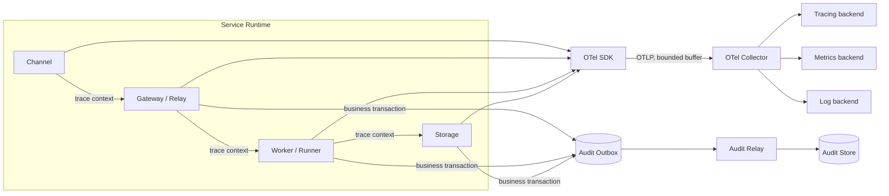
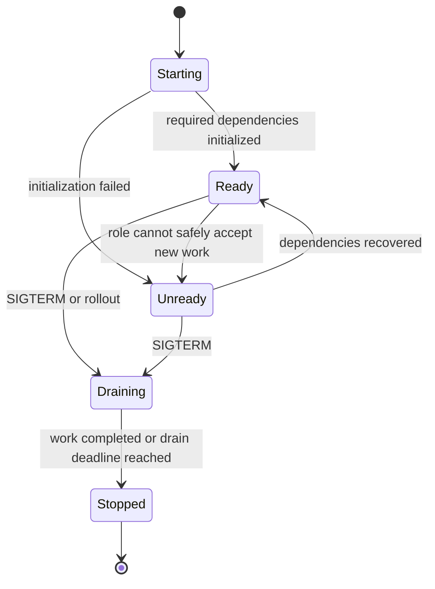
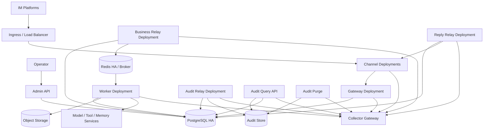
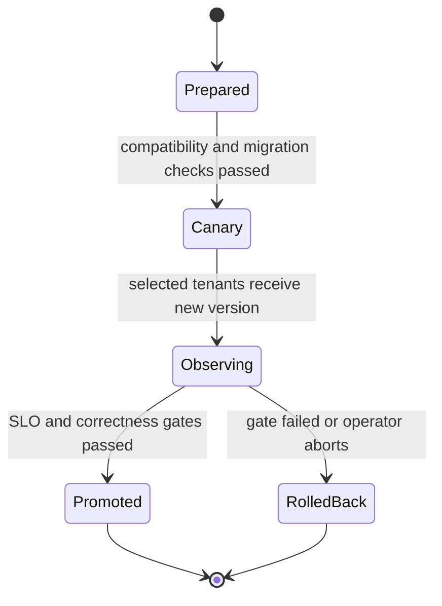

# D 模块：Observability、Audit 与 DevOps 技术方案

> 本仓库当前按 Docker Desktop 的本地 Compose 验收交付。`deploy/kubernetes/base` 仅供验收者参考 gateway/worker 的运行契约，`deploy/prometheus-alerts.yml` 仅供参考规则指标语义；二者不属于 Kubernetes 发布、Alertmanager 路由或验收资产。可执行本地观测入口仍为 Compose 的 OTel Collector 与 Jaeger。

| 文档属性 | 内容 |
|---|---|
| 设计状态 | 规范性技术方案 |
| 模块范围 | Telemetry、Audit Relay、健康检查、部署、发布、容量与故障运维 |
| 上游依赖 | A/B/C 模块的上下文传播、Audit Outbox、状态指标和 drain 契约 |
| 对外依赖 | OpenTelemetry Collector、可观测后端、Kubernetes、审计存储 |
| 总体架构 | [总体技术方案（第 13 节）](0.architecture.md) |

## 0. 阅读指南

本模块回答一个运营闭环问题：**平台如何从运行信号判断用户链路是否健康，在异常时可靠告警和恢复，并证明关键业务与安全行为发生过。**

### 0.1 从用户目标到处置动作

| 用户/运营目标 | 核心 SLI | 主要信号 | 典型告警 | 处置入口 |
|---|---|---|---|---|
| 消息被可靠接收 | callback ACK、Inbox claim success/latency | Channel/Gateway span、Inbox 指标 | callback error、Inbox unavailable | §16 Runbook、§17 故障矩阵 |
| 请求及时开始执行 | queue lag/oldest age、parked age | Broker/Relay/Worker 指标 | QueueLag、SessionBlocked | §16、A §12/§19 |
| 执行结果正确提交 | success/error、stale fence、CAS conflict | Worker/CommitTurn trace 与指标 | StaleFenceSpike、commit error | §16、B §16 |
| 回复最终送达 | Reply success/retry/ambiguous/age | Reply Relay、Delivery Ledger | delivery backlog、provider 429 | §16、C §16 |
| 治理与成本受控 | deny/ask、reservation、token/cost | Governance span、Usage/Audit Ledger | budget anomaly、grant abuse | §13 Audit、C §17–18 |
| 审计可证明且可查询 | Audit Outbox lag、export success | Audit Relay 与审计存储 | AuditLag、export failure | §4、§13、§16 |

具体 SLO 数值属于环境级发布配置；本文冻结 SLI、标签、计算口径和门禁关系。没有对应 Runbook 和 owner 的指标不能单独视为可运营能力。

### 0.2 四类信号不能互相替代

| 信号 | 用途 | 可靠性语义 | 禁止用法 |
|---|---|---|---|
| Trace | 单请求因果与延迟定位 | 可采样、允许有界丢失 | 作为审计事实或业务状态 |
| Metric | 聚合趋势、SLO 和告警 | 低基数、允许短暂缺口 | 携带任意 tenant/user/session label |
| Log | 节点诊断与结构化错误 | 按保留策略，先脱敏 | 记录 secret、完整 payload/tool args |
| Audit | 合规、安全与关键业务证明 | 业务事务写 Outbox，可重放、不可静默丢失 | 只经 OTel Collector 异步发送 |

### 0.3 运行闭环

```text
instrumentation
→ Collector / Audit Relay
→ SLI 与审计查询
→ alert
→ Runbook diagnosis
→ mitigation / rollback / failover
→ verification query
→ incident record 与阈值/容量回顾
```

Readiness 决定实例是否接新工作，liveness 只判断进程是否需要重启；发布门禁同时检查技术 SLO、正确性指标和 Audit lag，不能只看 HTTP 成功率。

### 0.4 建议阅读路径

| 读者目标 | 先读 | 再读 |
|---|---|---|
| 接入埋点 | §1–4 | §11–14 |
| 配置健康检查与部署 | §5–7 | §15、§17 |
| 设计 SLO/告警 | 本节、§3 | §12、§16 |
| 执行灰度与回滚 | §8–9 | §15–17 |
| 安全/合规评审 | §4、§6 | §13–14、§19 |

## 1. 设计目标与系统边界

D 模块负责使业务链路可观测、关键行为可审计、服务可发布且可恢复。Telemetry 允许在过载时有界降级；Audit 属于业务可靠性数据，必须经 B 模块的 Audit Outbox 持久化后由 D 模块 Audit Relay 导出，两者不得共用易丢失的传输语义。

业务包只依赖 `trpcservice/telemetry` 暴露的稳定 Port，不直接依赖某个 OTel SDK、exporter 或日志后端。默认装配为 no-op Provider；未配置 exporter 时请求、CommitTurn、Runner drain 和进程退出语义必须保持不变。

### 1.1 观测与审计数据流



### 1.2 Telemetry Provider Port

```go
type Provider interface {
    StartSpan(context.Context, Operation, ...Attribute) (context.Context, Span)
    Counter(MetricDescriptor) Counter
    Histogram(MetricDescriptor) Histogram
    Logger(Component) Logger
    Shutdown(context.Context) error
}
```

`Operation`、`MetricDescriptor`、`Component`、attribute key 和 error class 使用本文件冻结的枚举/白名单。业务包不得动态拼接 operation/metric 名，不得把 provider 原始错误、URL、payload、Secret 或任意 tenant/user/session/request 作为普通 label。Provider 和返回的 Span/Counter/Logger 必须并发安全；no-op 实现不分配后台 goroutine，且 Shutdown 幂等。

exporter 初始化失败的处理由角色 readiness 决定：普通 telemetry exporter 不可用时记录降级并继续业务；若环境策略要求安全审计导出同步可用，则检查的是 Audit Relay/Outbox 能力，而不是把 Audit 改走 telemetry。exporter 队列满、发送失败或 Shutdown 超时只能产生有界 drop/timeout 指标，不能阻塞 CommitTurn 或无限延长 drain。

每项业务能力都必须同步定义 operation、允许属性、metric、错误分类、脱敏负向测试和 no-op 行为；未具备这些观测契约的能力不得进入生产组合根。

当前 OTel 适配器使用 OTLP/HTTP traces 与 metrics exporter、SDK batch processor 和 periodic reader；队列、批量大小、export timeout 与 metric interval 均有上限。`TRPC_OTEL_ENDPOINT` 为空时角色使用 no-op；配置 endpoint 时必须显式允许 `http`，否则只接受 HTTPS。Exporter 初始化/发送失败只记录降级并保留业务路径，shutdown 使用独立有界 context。Compose 的 Collector 使用 memory limiter + batch，把 traces 转发到 Jaeger、metrics 暴露为 Prometheus endpoint；Collector/Jaeger 不属于 Audit 事实存储。配置 exporter 后，组合根将该 Provider 注册为 OTel 全局 trace/meter provider，并初始化 tRPC-Agent-Go 的公开 metric 组件，使框架指标与 service-owned 指标共用 exporter、resource、传播器和 shutdown 生命周期。当前固定的上游版本会在 `telemetry/trace` 包加载时缓存初始 noop tracer；仅调用 `otel.SetTracerProvider` 无法启用其自动 span。更重要的是，该 SDK 的公开 tracing API 尚不能在复用已有 Provider 时构造全局的 payload drop policy，零值会采集 prompt、response 和 tool payload。因此组合根**不得**回绑该 cached tracer，也不得调用 SDK `trace.Start` 创建第二个 exporter/provider；服务通过自己的 Model/Tool 边界 span 维持默认不采集内容的 trace 契约。上游提供可组合的安全属性策略后，方可在不产生第二条管线的前提下启用自动 Agent/LLM/Tool span。Channel ingress/preprocess 通过 request/job `traceparent` 接续，Agent Factory 的 Model/Tool callbacks 与 callable wrapper 共同覆盖正常、错误和 continuation 退出路径。操作级 SLO 规则只依赖固定 operation/component/outcome 标签，业务事实仍以 durable stores 为准。

进程日志使用 JSON `slog` 边界，`TRPC_LOG_LEVEL` 仅允许 `debug/info/warn/error`，默认 `info`；`TRPC_LOG_MASKING_LEVEL` 仅允许 `none/basic/strict`，默认 `basic`。`trpcservice/redaction` 在 Logger 创建时把 generic credential、service mandatory/profile/tenant-versioned 附加规则编译为不可变 Program；无效或重复规则导致初始化失败。无论掩码级别，Secret、token、Authorization、DSN、payload、prompt、body、cookie 和 credential 类字段始终写为 `[REDACTED]`，错误文本中的 bearer、键值 Secret 与 URL userinfo 也会在输出前清理。`strict` 还掩盖外部用户、session、消息、邮箱和电话字段。日志自动携带 role，使用有效 OTel context 的结构化事件还携带 trace/span ID；不能把完整 payload、Tool 参数或未经分类的外部响应当作普通日志属性。

### 1.3 tRPC-Agent-Go 遥测扩展点映射

service-owned `Provider` 是业务代码的稳定端口，不表示重写框架观测。它拥有 exporter、脱敏属性白名单、service operation 与跨异步边界的 `traceparent`；组合根通过 tRPC-Agent-Go 的公开 `telemetry/metric` API 复用框架指标。AgentFactory 使用上游 Plugin 及 Agent/Model/Tool callbacks 补足 service 语义，Runner event channel 提供流式生命周期和 usage 事实。当前 SDK 自动 trace 保持禁用，原因和重新启用门槛见 §1.2；服务的 `model.generate`/`tool.execute` span 仍是唯一的该层 trace 语义。不得导入或依赖上游 `internal/telemetry`，也不得调用上游 `trace.Start` 创建第二个 exporter/provider。

| 信号来源 | service operation | 关键规则 |
|---|---|---|
| Runner `Run` 与 event stream | `agent.run`、TTFT、terminal outcome | context 从 Envelope 恢复；消费到终态或有界 drain，event 不是审计存储 |
| Agent callbacks | `agent.node` | 记录 agent kind/node kind，不把动态节点名作为 metric label |
| SDK framework metric | 上游 `trpc.agent.go` metric instrumentation | 通过公开 metric API 接入同一 Provider；只保留低基数计量与 usage，不作为 payload 载体 |
| Model callbacks | `model.generate` | provider/model 使用受控枚举；usage 与 finish reason 归一化后进入 Usage Ledger；参数、响应与 Secret 默认不采集 |
| Tool callbacks | `tool.execute` | tool 使用 Catalog ID；参数、返回值和 Secret 默认不采集 |
| Runner Plugin | request-level hooks | 只做通用观测/usage 增强，不取代 Governance 或 CommitTurn |
| Session/Memory/Artifact/Knowledge facade | `storage.*` | backend type/domain 为低基数属性，tenant 只进入 trace/audit 的受控字段 |

TenantContext、request ID、trace context 和固定版本由 service 在调用 Runner 前写入 context；callback 只能读取脱敏视图，不能从 framework 的 AppName/UserID 反推 tenant。异步 Broker、Outbox、A2A task 和协议 façade 的重试使用 span link 保留因果关系，不能伪造成单个长期同步 span。

Usage 以 provider 返回的原始计量为事实输入，按固定 PricingSnapshot 结算；callback 重放和 event 重投必须用 `(tenant_id, request_id, stage, usage_kind)` 幂等，防止重复计费。上游 telemetry hook 缺失时可由稳定 Port 补足 span，但必须在 capability registry 登记；依赖升级后切换为接续上游 span，并用 contract test 防止重复计数。

<a id="trace-design"></a>

## 2. Trace 设计

采用 OpenTelemetry 和 W3C Trace Context。HTTP callback 创建/接续 trace；Envelope、Broker header、Outbox 和 ReplyEvent 传递 `traceparent/tracestate`。一个 trace 必须串起：

```text
IM callback → ClaimInbox → Gateway → Dispatch Relay → Worker
→ ExecutionProfile/Runner → Model → Tool → Session/Memory → CommitTurn
→ Reply Relay → IM API
```

异步重投创建新 span 并保留同 trace 或 span link；不得伪造单个超长同步 span。默认不采集 prompt、response、tool args、payload 和 secret。

已接入的 service-owned operation 为 `channel.ingress`、`channel.preprocess`、`gateway.submit`、`relay.dispatch`、`worker.execute`、`model.generate`、`tool.execute`、`session.open/commit/get_terminal/read_fence/load`、`memory.read/search/add/update/delete/clear/ingest`、`relay.reply`、`channel.deliver`、`relay.wakeup`、`relay.control` 和 `audit.export`。Session Store 与 Memory Service 都在复用的 tRPC-Agent-Go public contract 外包一层无后端知识的 telemetry decorator；它们在当前调用上下文中创建子 span，但不记录 tenant/user/session、prompt、Memory 内容或参数为普通 metric label。Gateway/Channel 无有效入站 parent 时创建 root span，并将当前 W3C `traceparent` 写入 Dispatch；Preprocess、Worker、Model、Tool 产生的 parent 写入下一段 durable envelope/Outbox；Reply Relay 更新 ReplyEvent parent，Delivery 再接续该 parent。原始 Envelope 的权威字段不被 Relay 改写，异步边界仍通过持久化 traceparent 保持因果关系。

## 3. 指标设计

最小指标：请求量/错误率、callback ACK、Inbox dedupe、queue lag/oldest age、Worker active/reclaim、lease lost/stale fence、input parked/blocked age、Runner/model/tool latency、TTFT、token、`cost_micros`、预算拒绝率、usage 缺失、Session backend latency/CAS、Memory visibility、Reply success/retry、Audit lag。

标签只使用低基数字段：service、role、channel、backend_type、operation、outcome、error_type。tenant 级成本进入 Usage/Audit Ledger 或受控 top-N 视图，不直接把任意 tenant/user/session/request 作为常规 metric label。

<a id="audit-design"></a>

## 4. 审计设计

```text
tenant_id, channel, user_id, session_id, request_id,
agent_app_id, agent_app_revision, agent_name, tool_name, action, decision,
latency_ms, error_type, cost_micros, currency, trace_id,
config_version, policy_version, content_digest, occurred_at
```

字段版本化；敏感 payload 只保存分类、digest 或加密引用。业务事务写 Audit Outbox，D 模块的 Audit Relay 导出到审计存储。重投以 audit id 幂等；Collector 故障不等于审计成功，Audit Outbox 必须保留。

PostgreSQL 源实现以 Outbox 行作为待导出的可靠意图，按 tenant-scoped `payload_ref` 解析对应的不可变领域事实；生产 Audit Relay 必须把事实导出到独立合规 PostgreSQL，而不能把源业务库内的 reference `audit_event` 冒充跨库合规存储。合规 Sink 用 `(tenant_id,audit_id)` 幂等追加完整版本化 JSON 与 event digest；相同 ID、不同 digest 是碰撞而非覆盖。Sink 已成功但 Outbox 尚未标记时，claim 过期后的新 Relay 必须重复解析并得到同一 digest，再安全收敛为 published。确认决定、过期、grant 消费以及 Artifact quarantine 的 audit intent 必须与各自状态变化处于源库同一事务。

Artifact upload/retention 进入 quarantine 后，合规 Sink 在写 `compliance.audit_event` 的同一目标库事务内追加不可变 `compliance.quarantine_alert`，并仅在 Sink 成功后递增低基数 quarantine counter。Prometheus 告警是通知入口，合规行是 durable 告警事实；任一跨库写失败都不得发布源 Outbox，也不得只靠日志宣称告警成功。

### 4.1 审计查询授权

审计查询只读独立合规库的 `compliance.audit_event`，不直接暴露业务库或跨库 JOIN。查询 API 强制以下约束：

- **tenant scope**：单租户查询路径强制 `tenant_id` 等于认证主体的租户作用域；查询结果行二次校验 `tenant_id`，任何越权返回 fail closed。
- **时间范围**：`from_occurred_at`/`to_occurred_at` 必填，窗口有上限（默认 ≤ 31 天，可配）。
- **分页上限**：keyset 游标（`occurred_at DESC, audit_id`）稳定分页，禁用 OFFSET；`page_size` 上限 200。
- **认证**：`aq1.` HMAC bearer token（自有 claims，独立签发边界），key 经 scoped SecretProvider 投影；含 `tenant_version` 校验，租户状态/版本变化即令旧 token 失效。
- **二次审计**：每次查询——无论允许或拒绝——都追加一条不可变 `compliance.audit_query_record`（subject、tenant scope、cross_tenant、时间窗口、filter digest、result digest、decision、reason_code、trace_id）。拒绝也落库，这是查询授权的可追责事实。
- **跨租户**：`can_read_audit_cross_tenant` 是独立权限，缺省拒绝；跨租户查询的 `audit_query_record` 记录显式 `cross_tenant=true`。

### 4.2 审计保留与销毁

合规事实默认不可变；**保留销毁是唯一例外**，且只能通过受控 purge 路径执行：

- 保留策略按租户配置，存于合规库自持的 append-only ledger `compliance.audit_retention_policy`（不进控制面 `ConfigV1`）。安全/计费最低保留期由平台下限 `compliance.audit_retention_floor` 约束，`effective_retention = GREATEST(tenant_policy, floor(action_class))`；`floor` 只增不减。
- 销毁经「durable batch intent + 受控 purge 函数 + 带防护 reconciler」：批次状态机 `planned → approved → executing → completed / failed / quarantined`，version CAS；执行前重算候选集 count/digest 与计划时比对，divergence（预览后数据漂移）即 fail closed 不删。
- 删除是**单向不可逆**；完成同事务写不可变 `compliance.audit_purge_certificate`（绑定 policy_version、floor_version、tenant、时间窗口、候选集 digest、alert_count、审批者、原因）。
- 受控例外不放松不可变触发器语义：删除仅在 `compliance.execute_audit_purge_batch`（SECURITY DEFINER，固定 search_path、撤销 PUBLIC EXECUTE）内部经 `compliance_purger` 角色成员资格 + 事务局部 `compliance.purge_authorized` 开关才放行；普通会话 ad-hoc DELETE 依旧被拒。
- `compliance.quarantine_alert` 背书的 `audit_event` 必须先有 `compliance.audit_quarantine_resolution` 关闭事实，且 active legal hold 覆盖范围内的事件不得删除。`compliance.audit_query_record` 不进入普通事件 purge，独立更长下限。
- 业务库 `audit_event` 与 `outbox(kind='audit')` 的保留属独立能力，必须等 relay watermark 门禁设计完成后再做，禁止在导出追平前删除未导出事实。

业务库审计保留以 **relay watermark 门禁**为唯一安全前提。`outbox(kind='audit').state=published` 是「已导出到合规库」的权威事实；watermark 定义为最早**非** `published` outbox（含 `pending`、`claimed`、`retry_wait`、`dead_letter`）的 `created_at`（无未导出行则为全导出）。删除只允许发生在 `occurred_at/created_at < min(retention_cutoff, watermark)` 的时间窗口内：业务动作同事务先写 `audit_event` 再写 `outbox`，故 `occurred_at <= created_at`，窗口内的 `audit_event` 对应 outbox 必已 published、合规库已有副本，可安全销毁。`audit_event.audit_id` 由 `outbox_id` 单向哈希派生，不可逆，因此删除不得依赖反向 JOIN，只能用时间窗口门禁。所有未导出 outbox 永不删除；销毁同样走窄授权路径（`audit_retention_purger` 成员资格 + 事务局部开关 + 受控函数 + 销毁证书），普通会话 ad-hoc DELETE 仍被 `audit_event_immutable` 触发器拒绝。

## 5. 健康检查与优雅退出

- startup：配置和必要依赖初始化完成。
- liveness：进程事件循环正常；下游故障通常不杀进程。
- readiness：能够接受该角色的新工作。
- drain：停止新工作并安全交接。

Worker drain 停止消费，完成已有执行或停止续租；Gateway 摘流后不接新请求；Adapter WebSocket owner 释放 connection_lease；Relay 归还未完成 claim。



`liveness` 仅表示进程是否可继续运行，`readiness` 表示角色能否安全接受新工作；依赖短暂故障不得通过反复重启掩盖，但必须及时从负载均衡或消费组中摘除不具备处理能力的实例。独立 `audit-relay` 角色只要求 PostgreSQL 与完整 schema ready，不依赖 Redis、对象存储、模型或 Channel Secret；drain 后停止新 claim，并让已有 claim 由租约到期接管。

依赖 readiness 不得在 HTTP 请求路径同步访问后端。进程以每依赖独立 timeout 的并发 probe 周期缓存最近结果；首次 probe 未成功、任一关键依赖最近失败、schema 缺失/checksum 漂移，或 Lifecycle 进入 draining/stopped 时 `/readyz` 必须返回 503，`/livez` 仍只反映进程存活。Artifact lifecycle 角色探测 PostgreSQL、完整 schema、Redis、versioned ObjectStore、ClamAV engine version、probe tenant 的 DLP SecretProvider scope、payload encryption key scope 和带授权的 DLP health；Preprocess role 探测 PostgreSQL/schema、ObjectStore、扫描器和 Secret scope，但不要求 Redis，并把 preprocess claim/dispatch loop 的 drain 与 Artifact reconciler 分开；Channel callback role 探测 PostgreSQL/schema、只读 SecretProvider mount 和 probe tenant 的 payload key scope，并在 callback handler 前复用同一 readiness gate，不要求 Redis、ObjectStore、ClamAV 或 DLP；Channel delivery role 探测 PostgreSQL/schema、Redis、Secret mount、payload key exact generation 与历史账号 catalog，不要求 callback、ObjectStore 或 scanner，动态 binding Secret 仍在单条事件发送前 fail closed。SIGTERM/SIGINT 先切 draining，再停止本角色的新领取并有界关闭 HTTP。

`audit-relay` 的 `/metrics` 只暴露固定 outcome/state/destination 标签。独立 backlog monitor 以 PostgreSQL 全局聚合读取 `kind=audit` 的 pending、claimed、retry_wait、dead_letter 和最老 active row 年龄；达到 age/count 阈值或存在任意 dead-letter 时进入告警，查询失败时保留最近一次事实并由 snapshot ready/timestamp 触发缺失或陈旧告警。该告警不修改 Outbox，不把积压变成 readiness 重启风暴，也不把 telemetry 成功当成 Audit 成功。

<a id="fault-degradation"></a>

## 6. 故障降级

| 故障 | 策略 |
|---|---|
| DB 短暂不可用 | callback 未 durable claim 不 ACK；已 claim 由 reconciler 恢复 |
| Redis/Broker 不可用 | Outbox 积压，有界退避，不丢权威状态 |
| 模型超时 | 有界重试、备用模型须由租户策略允许，否则明确失败 |
| Tool 失败 | 按副作用/idempotency 分类重试，危险工具不自动重复 |
| IM 重试 | Inbox 返回同 request/result |
| IM API 失败 | Delivery Ledger 重试，不重跑 Agent |
| Collector 不可用 | 有界内存/磁盘缓冲并丢弃非关键 telemetry，业务继续 |
| Audit backend 不可用 | Audit Outbox 积压告警，不丢业务事务内审计意图 |

## 7. 部署拓扑

最小 Compose：1 Gateway、1 Worker、1 Channel、1 Business Relay、1 Audit Relay、PostgreSQL、Redis、对象存储、OTel Collector。允许一个 binary 多角色，但使用相同外部契约。

生产 Kubernetes：2+ Gateway、3+ Worker、按账号/回调负载扩展 Channel（`channel` role 可按 provider 拆分 Deployment）、独立 Relay/Preprocess/Admin、PostgreSQL HA、Redis HA、对象存储和 Collector gateway。配置 NetworkPolicy、PDB、anti-affinity、workload identity 和独立 ServiceAccount。

HPA：Gateway 按 callback QPS/latency；Worker 按 queue lag/oldest age/active sessions/model concurrency；Relay 按 outbox lag；Channel 按 callback/connection/delivery backlog。当前生产实现已将 Worker Redis Streams 的 pending/undelivered backlog 与 oldest age、Audit Outbox active backlog/lag 接入 External Metrics HPA；每个副本读取相同全局 authority，adapter 必须使用 `max` 聚合，禁止 `sum` 造成副本数正反馈。采集快照过期时 autoscaling gauge 消失，HPA 不得把未知值解释为零并缩容。Gateway/Channel 的业务 SLI HPA 仍保持未完成边界。



Gateway、Worker、Channel 和各 Relay 均以独立角色水平扩展。PostgreSQL 保存权威事务数据，Redis 承担 Broker、协调和限流；任何 Redis 队列投递均须由权威 Outbox 驱动，不能把 Broker 中的临时状态当作业务提交结果。`Audit Query API` 是只读审计查询面（tenant scope + 时间范围 + 分页上限 + 二次审计），`Audit Purge` 是保留销毁 reconciler（只执行 approved 批次、默认 dry-run，破坏性动作不暴露 HTTP 端点）。

<a id="progressive-release-rollback"></a>

## 8. 灰度发布与回滚

- 二进制采用 N/N-1 Envelope 与数据库 schema 兼容，先 consumer 后 producer。
- 数据库执行 expand → dual-read/write → backfill → contract，禁止同版本直接删列。
- 配置是不可变快照，按 tenant/app 百分比或 allowlist 灰度。
- 在途请求继续使用固定版本；回滚切 active version，不改写旧快照。
- 密钥轮换以新 credential version 发布，旧版本仅在有界窗口服务在途请求。

若其他项目以 Helm 部署，schema 发布应使用显式 `schema-migrate` 角色和唯一的阻断式 pre-install/pre-upgrade hook。发布物必须固定 expected-current 与 target，不接受 `latest`；同一 PostgreSQL session 持 advisory lock 后校验完整连续历史、不可变 checksum 和只前向计划，到达目标后再次验证。重复执行目标版本为空操作，source mismatch、历史 gap、未知 migration、checksum 漂移和 downgrade 均阻断发布。生产入口不暴露 down；二进制回滚保留 expand schema，N-1 readiness 校验自身已知版本但容忍更高版本行。contract DDL 必须等回滚观察窗关闭后由独立发布执行。`deploy/kubernetes/base` 作为参考故意不复制裸 `schema-migrate` Job，避免两条发布路径漂移。该 schema 门禁不等同于 tenant backend 数据迁移；后者仍必须执行 checkpoint、dual-write、backfill、对账、cutover 与 rollback sync 状态机。



灰度判定同时检查技术 SLO 与正确性指标，包括 stale fence、重复投递、SessionBlocked、审计积压和跨租户拒绝事件；仅凭 HTTP 成功率不得执行全量发布。

<a id="capacity-model"></a>

## 9. 容量模型

至少测量：峰值 callback QPS、平均/峰值 turn 时长、每节点模型并发、每 turn token/event/outbox 数、SQL TPS/连接数、Redis command/QPS、对象带宽、Reply API 限额。

```text
required_workers ≈ peak_arrival_rate × p95_turn_seconds / safe_concurrency_per_worker
sql_tps ≈ turns_per_second × writes_per_turn + inbox/outbox/relay writes
redis_qps ≈ broker ops + active_sessions × lease_renew_rate + rate_limit ops
```

压测必须包含热 session、租户不均衡、大媒体、模型慢调用、Worker kill、DB/Redis 短断和 IM 重投。

## 10. 代码与部署资产组织

```text
trpcservice/telemetry/
trpcservice/audit/
trpcservice/health/
deploy/compose/
```

当前本地版仅以 Compose 为验收组合根；Kustomize base 和 Prometheus rule file 是验收者阅读运行契约的参考，不替代 Helm、Alertmanager、Dashboard、Loadtest 或远端 runbook。

本地验收门禁：全链 trace 可在 Jaeger 查询；审计字段/类型一致；Collector 故障不阻断业务；Worker kill、PostgreSQL/Redis 短断后的本地契约可重放。

## 11. Span 命名与属性

| Span | 关键属性 |
|---|---|
| `channel.callback` | channel、transport、binding_id_hash、message_type、outcome |
| `inbox.claim` | channel、dedupe_outcome、storage.system |
| `gateway.prepare_dispatch` | app、agent_app.revision、config_version、shard、outcome |
| `relay.publish` | relay_kind、attempt、broker.system、outcome |
| `worker.execute` | app、agent_app.revision、config_version、policy_version、input_gate、outcome |
| `coordination.lease` | operation、acquired、fence_relation；不记录 session_id |
| `runner.run` | agent_name、model_name、outcome |
| `model.generate` | provider、model、streaming、token counts、cost_micros |
| `tool.execute` | tool_name、decision、outcome；不记录参数 |
| `storage.operation` | domain、backend_type、operation、consistency、outcome |
| `session.commit_turn` | outcome、event_count、fence_relation、version_conflict |
| `channel.deliver` | channel、message_kind、segment_count、outcome |

tenant_id、user_id、session_id、request_id 只在受访问控制的 trace/log/audit 或 tail-sampling baggage 中使用；不得进入普通 metric label。允许记录 tenant 的 trace 必须执行属性白名单、RBAC 和保留策略；Span status 只对技术错误设 Error，业务 deny/ask 通过 outcome 属性表达。

## 12. Metric 规范

```text
trpc_gateway_requests_total{channel,outcome}
trpc_inbox_claim_total{channel,result}
trpc_broker_delivery_lag_seconds{shard}
trpc_worker_active_executions{worker_pool}
trpc_worker_reclaim_total{reason}
trpc_session_lease_total{operation,result}
trpc_session_stale_fence_total{backend_type}
trpc_session_backend_duration_seconds{destination,operation,outcome}
trpc_input_parked_total{reason}
trpc_input_oldest_blocked_seconds{worker_pool}
trpc_runner_duration_seconds{agent_class,outcome}
trpc_model_duration_seconds{provider,model,outcome}
trpc_model_tokens_total{provider,model,direction}
trpc_tool_duration_seconds{tool_name,outcome}
trpc_storage_duration_seconds{domain,backend_type,operation,outcome}
trpc_outbox_lag_seconds{kind}
trpc_channel_delivery_total{channel,kind,outcome}
trpc_preprocess_backlog{kind,state}
trpc_audit_outbox_lag_seconds{destination}
```

`trpc_session_backend_duration_seconds` 覆盖 `open`、`commit`、`get_terminal`、`read_fence` 与 `load`，当前生产实现的 destination 固定为 `postgres`。它不含 tenant、user、session 或 request 标签。

`trpc_governance_budget_denied_total{component="worker"}` 仅在持久化的 `budget_exceeded` 拒绝后递增；`trpc_governance_usage_missing_total{component="worker"}` 在启用预算的执行未收到上游模型 usage 时递增。两者均不携带 tenant、request、model 或价格版本等高基数标签；准确 token/cost 仍以 Usage/Audit Ledger 为权威。

Histogram bucket 依据压测调整并版本化。禁止以 error message 作 label；error_type 使用稳定枚举。每租户费用从 Usage Ledger 聚合，不通过 tenant metric label 计算。

## 13. AuditEvent Schema

```go
type AuditEvent struct {
    SchemaVersion uint16    `json:"schema_version"`
    AuditID       string    `json:"audit_id"`
    TenantID      string    `json:"tenant_id"`
    Channel       string    `json:"channel"`
    UserID        string    `json:"user_id"`
    SessionID     string    `json:"session_id"`
    RequestID     string    `json:"request_id"`
    AgentAppID    string    `json:"agent_app_id"`
    AgentAppRevision int64  `json:"agent_app_revision"`
    AgentName     string    `json:"agent_name"`
    ToolName      string    `json:"tool_name,omitempty"`
    Action        string    `json:"action"`
    Decision      string    `json:"decision"`
    ReasonCode    string    `json:"reason_code,omitempty"`
    LatencyMS     int64     `json:"latency_ms"`
    ErrorType     string    `json:"error_type,omitempty"`
    CostMicros    int64     `json:"cost_micros"`
    Currency      string    `json:"currency"`
    InputTokens   int64     `json:"input_tokens,omitempty"`
    OutputTokens  int64     `json:"output_tokens,omitempty"`
    ConfigVersion int64     `json:"config_version"`
    PolicyVersion int64     `json:"policy_version"`
    ContentDigest string    `json:"content_digest,omitempty"`
    TraceID       string    `json:"trace_id"`
    ResourceRefs  []string  `json:"resource_refs,omitempty"`
    OccurredAt    time.Time `json:"occurred_at"`
}
```

AuditID 按业务动作确定性生成。查询 API 强制 tenant scope、时间范围和分页上限；管理员跨租户查询需要独立权限和二次审计。保留策略按租户配置，但安全/计费最低保留期由平台策略下限约束。

审计查询与保留销毁的派生表口径见 §4.1/§4.2：`compliance.audit_query_record` 是查询/拒绝的不可变二次审计事实；`compliance.audit_purge_batch` + `compliance.audit_purge_certificate` 是销毁意图与凭证；`compliance.audit_retention_policy`/`audit_retention_floor`/`audit_retention_class_rule` 决定有效保留期；`compliance.audit_legal_hold` 是冻结事实；`compliance.audit_quarantine_resolution` 是 quarantine alert 的关闭事实。这些表只读查询/只追加，唯一可变对象是 batch 状态机（受 SQL 状态机门禁 + version CAS 约束）。

## 14. Collector 与采样配置

SDK 使用 batch processor 和有界队列。Head sampling 保留低比例正常流量；tail sampling 强制保留 error、deny/ask、安全事件、stale fence、高延迟和指定调试租户。采样决策不得把 payload 发送到 Collector。

```text
Service Pods → node/sidecar OTLP endpoint → Collector Gateway
  traces → tracing backend
  metrics → Prometheus-compatible backend
  logs → structured log backend
```

Collector 队列满时优先丢弃普通 debug span，不能阻塞 CommitTurn；Audit 不走易丢 telemetry 通道，而走 Audit Outbox。

## 15. Kubernetes 资源契约（验收参考）

每个角色配置独立 Deployment/ServiceAccount：gateway、worker、channel-wecom、channel-feishu、business-relay、preprocess、audit-relay、admin。readiness 与依赖匹配：Worker 必须能访问 Broker、Config 和 AtomicStore；Channel callback 必须能 durable claim Inbox；Admin 不影响业务 readiness。

PDB 保证 Gateway/Worker 至少一个可用实例；Worker terminationGracePeriod 大于 drain deadline；preStop 先切 readiness 再 drain。NetworkPolicy 只允许 Channel 出站官方 IM、Worker 出站模型/工具/Storage、Relay 访问 Outbox/Broker。Secret 通过 CSI/workload identity 获取，不放 ConfigMap。

若其他项目采用 Helm 组合根，应按已实现的二进制角色分别部署 `gateway`、`worker`、`channel`、`channel-delivery`、`preprocess`、`artifact` 和 `audit-relay`；规划中的独立 business-relay/admin 角色在拥有对应进程入口前不得由空壳 Pod 冒充。每个角色使用独立 ServiceAccount 和可选的独立 workload identity；角色命令由 chart 固定，不能通过 values 改写。Pod 默认 non-root、只读根文件系统、关闭 service link 与默认 ServiceAccount token，运行期 Secret 只读挂载自 Secrets Store CSI。NetworkPolicy 默认拒绝全部 ingress/egress，仅内置 DNS 解析出口，依赖、Provider、Ingress 与监控访问必须按角色显式授权。Gateway 保留 PDB 与 CPU bootstrap HPA；Worker/Audit Relay 如要在 CPU 外接入 fresh-only Queue/Outbox External Metrics，必须冻结缩容稳定窗口。Gateway callback latency、Worker active session/model concurrency 和 Channel backlog 尚未接入，因此正式容量准入仍必须以真实负载报告而不是 HPA 对象存在为证据。

所有生产角色的进程入口必须订阅 `SIGTERM/SIGINT`。Chart 的无 shell `preStop` hook 先向容器 PID 1 发送 SIGTERM，等待 readiness 进入 draining 后再由 kubelet完成终止；termination grace 必须大于应用 shutdown budget 与 preStop settle window。不得使用仅 sleep、但不触发应用 lifecycle 的 hook 冒充 drain。

## 16. 告警与 Runbook

| 告警 | 触发示例 | Runbook 首要动作 |
|---|---|---|
| DispatchStuck | oldest dispatch outbox > SLO | 检查 DB claim、Relay 和 Broker，禁止手工删 Outbox |
| SessionBlocked | oldest parked input > SLO | 查前序 commit/wakeup，不强制跳 next |
| StaleFenceSpike | stale fence rate 异常 | 查 Redis failover、lease TTL、Worker GC/网络 |
| ReplyFailure | IM success 低于 SLO | 查 token/429/官方状态，只重放 Reply |
| AuditLag | audit outbox 超保留阈值 | 扩 Audit Relay/修后端，业务 Outbox 不混用 |
| SecretCanary | 任一 sink 命中 | 立即停止导出、轮换密钥、按安全事件处理 |

Runbook 必须给出只读诊断、可恢复操作、禁止操作、回滚条件和审计要求。生产不得用删除 Broker pending、手改 next_input_seq 或降低 tenant predicate 解决积压。

## 17. 故障验收矩阵

| 注入点 | 注入时机 | 必须观察到的结果 |
|---|---|---|
| Worker SIGKILL | Tool 执行中 | lease 到期后接管；旧 fence 无法提交 |
| Worker SIGKILL | Commit 后 ACK 前 | 重投读取 CommitResult，不再调用模型/工具 |
| Relay SIGKILL | publish 后 mark 前 | Outbox 重发，Broker/Adapter 幂等 |
| PostgreSQL 断连 | ClaimInbox 前 | callback 不 durable ACK，平台重试 |
| PostgreSQL 断连 | CommitTurn 中 | 事务全回滚，next/event/outbox 都不部分更新 |
| Redis failover | lease 续租时 | Worker 停止提交；counter 校准后新 fence 更大 |
| Model timeout | streaming 中 | 按策略重试/失败，半截回复不提前发送 |
| Tool timeout | 有副作用调用后 | 进入 ambiguous/人工策略，不盲目重复副作用 |
| IM 429/5xx | 第 N 分片 | 前 N-1 sent 不重发，只重试未确认分片 |
| Collector down | 全链 | 业务继续，telemetry drop 指标告警，Audit 不丢 |
| 配置回滚 | 有在途请求 | 在途固定旧版本；目标 payload 以更大新版本 copy-forward，新请求使用该回滚发布版本 |
| 租户攻击 | 同 ID/伪造 AppName | Adapter、Worker、Storage 任一层都不能越权 |

## 18. D 模块交付资产

```text
trpcservice/telemetry/{init,propagation,attributes,metrics,logging}.go
trpcservice/audit/{event,emitter,relay,store}.go
trpcservice/health/{startup,probe,drain}.go
deploy/compose/{compose,otel-collector}.yaml
```

本地验收记录版本、Docker Compose 环境、故障注入时间线、trace/audit 示例与未解决风险。远端 SLO、容量拐点和发布证据需要未来重新引入相应运维资源后另行建设。

## 19. 生产风险清单

汇总根 README 验收标准 6 要求的「至少 8 个生产风险及缓解措施」，作为独立交付物。每项均给出缓解与可验证的验收口径，故障注入细节见 §17。

| # | 生产风险 | 缓解措施 | 验收口径 |
|---|---|---|---|
| 1 | Worker 节点故障（执行中崩溃） | lease 过期 + 单调 fence 接管；旧 owner 提交被 stale fence 拒绝 | SIGKILL 后无重复业务效果、乱序提交或旧 owner 覆盖 |
| 2 | 数据库短暂不可用 | callback 未 durable claim 不 ACK；已 claim 由 reconciler 恢复；事务不部分提交 | 断连时 event/state/outbox 全回滚，next_input_seq 不部分推进 |
| 3 | Redis/Broker 不可用 | Outbox 积压 + 有界退避，权威状态不丢 | Broker 恢复后 Outbox 不重不丢，业务效果幂等 |
| 4 | 模型超时 / 失败 | 有界重试；备用模型须租户策略允许，否则明确失败 | 半截回复不提前发送 |
| 5 | 工具副作用 / 结果模糊 | 按副作用与 idempotency 分类；ambiguous 不盲目重放 | 有副作用调用后 timeout 进入 ambiguous/人工对账 |
| 6 | IM 消息重复投递 | Inbox 幂等键 + 返回既有 request/result | 1000 并发重复只产生一个 request |
| 7 | IM API 失败 / 限频（429） | Delivery Ledger 重试 + retry-after；只重发未确认分片 | 前 N-1 已 sent 分片不重发 |
| 8 | 租户越权 / 伪造身份 | Adapter/Gateway/Worker/Storage 多层验证 + fail closed | 同 ID / 伪造 AppName 任一层都不能越权 |
| 9 | 密钥泄露（IM token / 模型 key / DB 密码） | SecretRef + Redactor + secret canary | 所有 log/trace/audit/error sink 密钥命中为零 |
| 10 | 审计积压 / 丢失 | Audit Outbox 可重放，不共用易丢 telemetry 通道 | Collector 故障时审计意图不丢，恢复后补传 |
| 11 | 配置回滚异常 | 不可变快照 + 版本固定；目标 payload copy-forward 为更大新版本后切换 active pointer | 在途请求固定旧版本，新请求用单调递增的回滚发布版本，缓存水位不倒退 |
| 12 | Telemetry Collector 不可用 | 有界缓冲 + 丢弃非关键 telemetry | 业务继续，Audit 不丢，drop 指标告警 |
