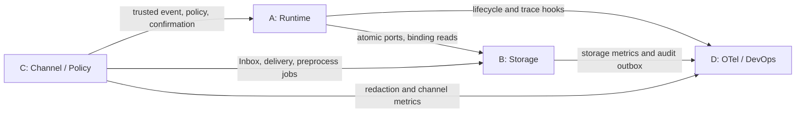
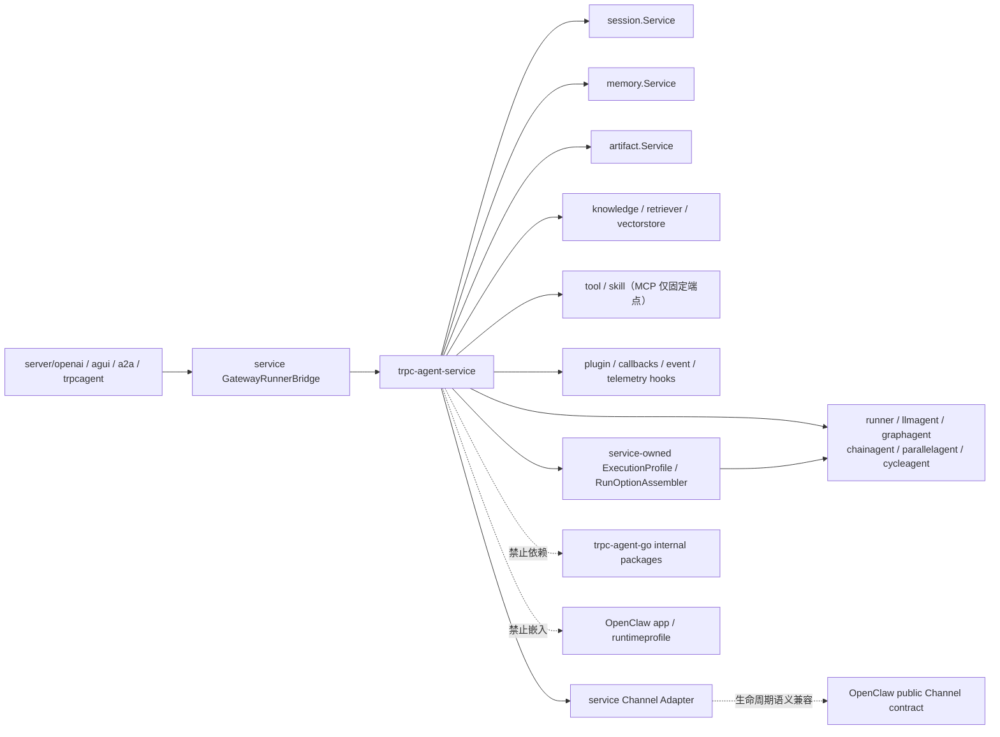

# trpc-agent-service 模块边界与上游集成方案

| 文档属性 | 内容 |
|---|---|
| 设计状态 | 规范性技术方案 |
| 适用范围 | A/B/C/D 四个内部模块及 `trpc-agent-go` 公共 API 集成 |
| 核心目标 | 固定依赖方向、共享契约、能力归属和上游扩展门禁 |
| 配套规范 | [验证与发布规范](7.verification-release-design.md) |

A/B/C/D 是同一个服务内部的四个功能模块，不代表人员、团队或项目阶段。模块化用于固定依赖方向、状态所有权、公开契约和测试边界。

## 1. 模块定义

| 模块 | 定位 | 模块内能力 | 边界外能力 |
|---|---|---|---|
| A | 多租户、多节点 Runtime | TenantContext/Envelope、Gateway、Worker、ExecutionProfile Resolver、Broker、lease/fence、业务 Relay、suspend/resume | Agent 框架实现；Storage 后端内部事务 |
| B | Storage 与数据一致性 | Router、tenant facade、AgentApp Repository/发布事务、AtomicSessionStore、Inbox/Outbox、数据模型、迁移 | Worker 调度；业务 Relay 和 Audit Relay 进程 |
| C | IM、治理与安全 | Channel Framework、WeCom、Feishu、Preprocess、Policy、确认语义、Secret/Redactor | Gateway/Worker 调度；Runner suspension handler |
| D | Observability、Audit、DevOps | OTel、指标、Audit Relay、部署、灰度、容量、Runbook | 业务 Relay；业务一致性协议 |

“边界外能力”不是不实现，而是必须通过对应模块的公开接口组合，禁止在当前模块重复建设。

## 2. 统一契约

四个模块共同使用并版本化：TenantContext、ExecutionBinding、TenantStatusChange、AgentAppRevision、ExecutionEnvelope、ChannelEvent、ReplyEvent、CommitTurn、Outcome、AuditEvent、TraceContext、ConfigSnapshot version、PolicySnapshot version 和 typed errors。Tenant 根实体、App 发布与执行定义统一以[控制面领域模型](1.tenant-root-design.md)为准。

统一规则：

- 审计耗时字段使用 `latency_ms`，金额使用 `int64 cost_micros`。
- A 模块运行 Dispatch/Reply/Wakeup/TenantControl 业务 Relay；D 模块运行 Audit Relay；两者都通过 B 模块 Outbox 接口。
- A 模块的 session `fence` 与 C 模块的 Channel `connection_lease` 分开命名和存储。
- A 模块实现 Runner suspend/checkpoint/resume；C 模块定义 SuspensionRequest、确认和 grant 语义。
- C 模块实现 Preprocess Worker，使用 B 模块的 job claim/lease；D 模块提供部署、指标和告警。
- B 模块按 `(request_id,input_seq,stage,ordinal)` 确定性派生 Reply 标识并在 CommitTurn 中分配稳定 `event_seq`，A/C 模块只透传。
- Agent App 领域契约位于 `trpcservice/agentapp`；B 实现 PostgreSQL Repository 与发布事务，A 只消费固定 Revision 并生成运行时 ExecutionProfileSnapshot。
- `agent_app_revision` 是 Agent 定义的唯一发布版本；ConfigVersion 和 PolicyVersion 分别负责租户组合配置和动态治理，运行时投影禁止再维护独立版本计数。

## 3. 依赖关系



依赖规则：

1. A 只依赖 B 的公开存储端口；多节点部署使用 PostgreSQL AtomicStore，InMemory 实现仅用于单元测试和 contract fixture。
2. C 只通过公开 Inbound、Reply、Preprocess 和 Delivery 端口连接 A/B；真实 WeCom/Feishu 投递必须经过业务 Relay 与 Delivery Ledger。
3. D 通过稳定的 trace、metric、AuditEvent 和 lifecycle hook 接收信号，不进入业务一致性提交路径。
4. B 不反向依赖具体 Channel 或 Worker；C 不直接操作 Session backend；A 不拼接 B 的数据库表和 Redis key。

## 4. 组合与初始化顺序

进程组合根按依赖拓扑初始化：先建立配置快照、Secret 与 B 模块存储端口，再建立 A/C 的执行或 Channel 组件，最后连接 D 模块的 telemetry、审计和 lifecycle hook。关闭顺序相反，并在停止新 claim 后等待已有 lease、Relay 和数据库事务收敛。任何实现都不得通过直接访问其他模块的表、Redis key、SDK client 或进程内对象绕过公开契约。

## 5. `trpc-agent-go` 依赖原则

`trpc-agent-service` 通过固定 module version 使用核心 `trpc-agent-go` 公共 API，不复制框架实现，也不导入任何 `internal` 包。核心依赖为 `trpc-agent-go v1.11.2`（服务采用 Go 1.25 基线）。OpenClaw Channel 位于独立的 Go 1.24.1 模块，按模块边界不进入生产依赖图；Channel Adapter 使用 service-owned 公共契约保持生命周期语义兼容。依赖变更必须通过 contract、兼容性、故障、SBOM 和工具链门禁。

`session-migrate` 与 `knowledge-migrate` 是 B 模块的有界、单步 operator role：先以 PostgreSQL `phase intent` journal 恢复 authority，再将当前 domain driver 推进一步；role 不自行切流、进入观察窗、回滚、cleanup 或发布 ConfigSnapshot。上述高权限阶段由 authenticated Admin control plane 以 tenant/migration 双 CAS 显式调用 domain publisher；cleanup 仍由 publisher 核验观察窗、旧 binding 在途 execution 与 mutation ledger 已 drain。Knowledge role 通过已发布的 ConfigSnapshot 解析 source/target Qdrant binding，并只把 service-owned 迁移契约交给 driver，因此不向 `trpc-agent-go` 增加或改造任何能力。

内部模块与公共依赖关系：



<a id="upstream-reuse"></a>

## 6. 可直接复用的公共能力

本节列出固定依赖 `v1.11.2` 的公共边界；“可复用”不等于已在生产组合根启用。当前实际接入的能力由第 10 节逐行标为“直接复用”或“适配复用”；仅作为升级兼容锚点的 API 不得被描述为运行时功能。

- `runner.Runner`、Managed/Steerable Runner 与 AgentFactory 装配入口；service 注入 tenant-aware services，不改写 event stream/cancel 语义。
- `llmagent.New`、`graphagent.New`、`chainagent.New`、`parallelagent.New`、`cycleagent.New` 及公开 options。
- `agent.WithAppName`、`agent.WithRequestID`、`agent.WithModel`/`WithModelName`。
- `agent.WithToolFilter`、`agent.WithToolPermissionPolicy`/`WithToolPermissionPolicyFunc`、`agent.WithToolExecutionFilter`。
- Graph checkpoint/resume 基座：`graph.CfgKeyCheckpointID`、带 `ResumeMap` 字段的 `graph.ResumeCommand`。
- 下一用户回合路由：`runner.WithAwaitUserReplyRouting`、`agent.AwaitUserReplyRoute`。
- `session.Service`（官方 `session/postgres` 后端，经每 Turn 的 tenant/app/user/session scope facade 注入）；`memory.Service`（经 `runner.WithMemoryService` + `memory.Tools()` 注入，官方 `memory/postgres` 或 `memory/redis` 后端，由固定 BackendBinding 选择）与 `artifact.Service`（经 `runner.WithArtifactService` 注入，由 `SDKService` 适配平台自有 Store）；`knowledge.Knowledge`、Retriever、VectorStore、Source、Embedder。
- Tool、`skill.Repository`/`RepositoryProvider`、Skill scope/load 协议；`tool/mcp` 公共 API 经 `trpcservice/tool/mcp` 适配后接入组合根——首版仅固定 HTTPS SSE/streamable 端点与固定远端工具名，由 `TRPC_MCP_ENDPOINTS` 的审阅 declaration digest 和发布 ToolRef 的 binding digest 共同固定；stdio、动态 URL 与 `mcpbroker` 未启用。
- `plugin.Plugin`、Agent/Model/Tool callbacks、Agent Event 和 OpenTelemetry 扩展点；`plugin.Manager` 仅保留升级兼容锚点，当前生产组合根不创建该 Manager。
- `telemetry/metric`：组合根把 service-owned OTel Provider 绑定到 SDK 的公开 metric 初始化入口，使框架指标使用同一 exporter。当前 `telemetry/trace` 的公开 API 无法在复用该 Provider 时配置全局 payload drop policy，因此自动 Agent/LLM/Tool span 不启用；服务不调用 `trace.Start` 创建第二套 provider，也不导入上游 `internal/telemetry`。
- `server/openai`、`server/a2a`、`server/trpcagent` 的协议解析和事件转换；`server/agui` 在包含该公共包的目标上游版本通过门禁后复用。
- OpenClaw 公共 Channel 的 `ID/Run` 生命周期、sender capability 和出站值对象语义；本服务不直接导入工具链不兼容的独立模块。

`openclaw/app`、`runtimeprofile`、单应用 `GatewayClient` 和 `internal` Telegram 实现不属于可复用边界。Worker 通过 service-owned `ExecutionProfileResolver` 将固定 Agent App Revision、ConfigSnapshot 和 PolicySnapshot 解析为运行时投影，再由 `RunOptionAssembler` 组装核心 `agent.RunOption`。跨 Broker 只传版本化事实和引用，不传 RunOption、Agent、数据库客户端或 secret。

<a id="platform-owned-capabilities"></a>

## 7. service 自有能力

以下能力属于 `trpc-agent-service`，不能下沉到通用 Agent SDK：

- TenantContext 和版本化 ConfigSnapshot；
- AgentApp、不可变 AgentAppRevision、发布/回滚协议和版本化执行引用；
- ExecutionProfileSnapshot、ExecutionProfileResolver 和 RunOptionAssembler；
- Gateway、Worker、Broker、lease/fence 和业务 Relay；
- Inbox/Outbox、AtomicSessionStore 和 Storage Router；
- service-owned Channel 契约、WeCom/Feishu/WebUI Adapter，以及多租户 Binding、Inbox、Delivery Ledger；
- 租户治理、确认、密钥、审计和部署。
- ModelProfile、BackendProfile、Provider Catalog、严格 schema/digest 和生产 Factory；
- 公开 route 候选发现、短期 CandidateToken、ScopedVerifierHandle 与 verified promotion；
- HTTP run/status/cancel、SSE cursor/replay 和稳定 telemetry/no-op Provider Port。
- 上游协议 Server 的 GatewayRunnerBridge、可信 ServerInvocationContext 和 Task/Event Store 状态映射。
- Skill Catalog/不可变 staging、TenantKnowledge facade、Knowledge ingestion/version lifecycle。

Runner 注入以官方 `session/postgres` 为唯一状态/事件事实源的 tenant-aware Session facade、框架 `memory.Service`（固定 `memory` BackendBinding 选择官方 PostgreSQL、Redis、受限 InMemory 或 Mem0 ingest adapter，`runner.WithMemoryService`，并由 appName scope facade 复核）与适配后的 Artifact Service。InMemory 只能单 shard 本地使用；Mem0 只读检索 + 异步 session 摄取，其 `eventual_visibility` binding 不可替代共享后端的 `strong_ryw` binding。平台的 `AtomicSessionStore` 不再保存或重放 Session state/event，只负责 input 顺序、lease fence、终态和 outbox 协调。Knowledge 不使用 `llmagent.WithKnowledge` 的隐式工具注入：`RuntimePlan` 经 `ToolSurfaceCompiler` 显式创建框架 `knowledge_search` Tool，再与业务 Tool、MCP、Memory Tool 一同进入 Guard、预算和 telemetry 链。每个 KnowledgeRef 由已发布 Manifest 固定 embedding profile、版本与 vector generation；`runtime_engine=sdk` 时服务组合官方 `knowledge/vectorstore/qdrant` 的公开 gRPC VectorStore，服务薄层只负责 immutable scope filter、SecretRef 解析与逐条 migration-envelope 复核；`native` 仅兼容已有 collection。SDK 模式只能绑定已经通过迁移写入 SDK payload mirror 的新 collection generation，不能就地切换旧 collection。`knowledge.New + Embedder + Retriever` 消费该只读面，在线检索与迁移/摄取仍使用同一 collection 与 integrity envelope。AgentFactory 按固定 Snapshot 编译受控 RuntimePlan 后装配 Agent/Runner/Skill/Knowledge/Memory，RuntimeBundleManager 按 tenant/app/revision/digest/config/policy 构建键独占复用与生命周期所有权，负责引用计数、retire 与关闭。

每条 execution 的 terminal audit 也只在 `AtomicSessionStore.CommitTurn` 的终态 CAS 旁生成：success、cancel、governance deny 和 budget failure 都使用同一个 `execution-terminal` idempotency key。治理决定、确认和 artifact quarantine 仍可保留各自的非终态审计事实，但重投或 CAS 失败绝不能产生第二条 terminal audit。

**Memory / Artifact 的复用边界**：Memory 复用框架 `memory.Service`（`memory/postgres` 或 `memory/redis` 后端，自带 `memory_add/search/load/update/delete/clear` 工具与语义搜索），租户隔离经 appName 编码（`tenantID + "/" + agentAppID`）实现；原自研 `storage/memory`（加密 content-ref + watermark + 失效 relay）语义与框架 `memory.Service` 不同且从未接入 Agent，已整体退役删除（代码包与 `memory_*` 迁移表均已移除，`memories` 表入 000001 基线）。Artifact 采用**接口适配复用**：`storage/artifact.SDKService` 实现框架 `artifact.Service`（`var _ sdkartifact.Service`），顶层 `artifact.Resolver` 以固定 `artifact` Binding 选择 PostgreSQL 元数据连接并对完整 AppName 复核，再经 `runner.WithArtifactService` 注入 Runner；内容仍由平台自有 ObjectStore 管理（加密 + durable upload intent + 孤儿回收 + retention）。SDK 路径写入记录一律打上 `SDKUnscanned` 哨兵——上游契约无 Malware/DLP 门禁，故该值只能表示"未扫描"，绝不可当作 scan-clean 凭据。`ListArtifactKeys`/`DeleteArtifact` 不被不可变 Store 支持，返回 `ErrCapabilityUnsupported` 而非伪造成功。

上述 Profile、ingress、HTTP 和 telemetry 能力的 service-owned 契约分别以 [控制面领域模型（第三部分）](1.tenant-root-design.md#第三部分-modelbackend-profile-与-provider-catalog)、[C 模块](4.channel-governance-security-design.md)、[A 模块](2.gateway-worker-design.md)和[D 模块](5.observability-audit-devops-design.md)为准。Channel 保持 OpenClaw 公共生命周期语义兼容，但不复制或导入产品运行时和 `internal` Provider；所有扩展均不得建立与 AgentAppRevision、ExecutionBinding、TaskStore 或 AtomicSessionStore 重复的真相。

## 8. 上游集成适配边界

### 8.1 Session 与协调提交

Runner 在执行过程中通过受限的 `session.Service` facade 访问 Session；facade 仅校验精确的 AppName/UserID/SessionID scope，所有 `CreateSession`、`GetSession`、`AppendEvent` 与 State mutation 直接落到官方同步 `session/postgres` 服务。`AtomicSessionStore` 只统一 input gate、fence、执行终态和 Outbox，不再镜像 event/state/summary，因此不存在第二套会话事实源。

上游当前未公开跨数据库事务的 commit/rollback hook：SDK 落库成功而协调提交失败时，Session 事实可先于 Reply/Outbox 可见。这是明确记录的 best-effort 边界；恢复依据仍是 fence、request/input idempotency 和终态协调记录，绝不为追求伪原子性而恢复自研 Session/Event Store。若上游将来公开等价 hook，再以同一契约套件评估是否可缩小该窗口。

### 8.2 Suspension/resume

权限 `ask` 必须真正暂停执行，而不是只向模型返回 `approval_required`。实现不从零重写 Runner：GraphAgent 复用上游 checkpoint saver、`CfgKeyCheckpointID` 和带 `ResumeMap` 字段的 `ResumeCommand`；LLM/non-graph Agent 通过 `WithToolExecutionFilter` 将确认类调用交还 service，持久化 tool_call 后以 `model.NewToolMessage` continuation 恢复。service 仍负责 waiting commit、lease 释放、confirmation/grant、fence 接管和一次性恢复。`AwaitUserReplyRoute` 只提供下一回合路由，不能替代该状态机。

上游 `PermissionActionAsk` 只产生权限结果，不提供跨节点 durable suspension。危险工具只有在 checkpoint 或 tool-call continuation 能持久化并通过故障接管门禁时才允许 `ask`；否则按 deny fail closed。

### 8.3 OpenClaw Channel 契约与协议复用

Channel 集成采用两层契约：

```text
OpenClaw public channel semantics
  Channel(ID, Run)
  TextSender / MessageSender / OutboundMessage
        ↓ service-owned compatibility contract
trpc-agent-service Adapter
  PublicRoute / scoped Verify / Decode / Deliver / Capabilities
        ↓ provider implementation
WeCom protocol + Feishu official SDK
```

`channels/contract.Adapter` 定义稳定 ID、可取消 Run、sender capability 以及 PublicRoute、Verify、Decode、Deliver 等多租户扩展。Provider Registry 只接受受信代码注册和严格 schema 配置，不允许远端配置注册 Factory；`TextSender/MessageSender` 只能位于 Delivery Ledger 之后，不能成为绕过 `Deliver` 的发送路径。

独立 `trpc-agent-go/openclaw` 模块（Go 1.24.1）按模块边界隔离，不进入依赖图。同形接口仅表示协议语义兼容，不表示直接复用代码。任何工具链或模块边界变更都必须由 ADR 明确批准，并继续禁止 `openclaw/app`、`runtimeprofile`、`registry.ChannelDeps.Gateway` 与 `internal/channel/telegram` 进入服务数据面。

协议层方面，Feishu 优先复用官方 Go SDK 的公开 API，WeCom 协议封装隔离在 service-owned Provider。任何 Provider 都不得导入其他 module 的 `internal` 实现或复制 internal 代码形成长期 fork；SDK DTO 也不能越过 Adapter 进入 Gateway/Worker。

## 9. 能力与启动门禁

启动时 capability check 发现下列能力缺失必须 fail closed：

- distributed 模式缺少 AtomicTurnCommit；
- 多 Worker 模式使用 InMemory 权威 Session；
- 危险工具启用 ask 但没有 suspension/resume；
- Adapter 配置引用不可访问的 secret 或不可信 protocol 实现；
- Envelope 固定的 Agent App Revision、Config 或 Policy 版本无法被 Resolver 精确解析。

能力基线：

| capability | 归属与最低基线 | service 实现或 fallback | 启动门禁 |
|---|---|---|---|
| Runner event stream / AgentFactory | 核心 `trpc-agent-go` @ `v1.11.2`，服务 Go 1.25 | 直接复用 | 符号或 contract 缺失则拒绝启动 Worker |
| LLM/Graph/Chain/Parallel/Cycle Agent | 对应核心公开 agent packages | AgentSpecV1 + 精确子 Revision 装配 | 类型、拓扑或资源上限 contract 未通过时拒绝发布该类型 |
| Agent App revision / ExecutionProfile resolution | `trpc-agent-service/agentapp` + `profile` 自有 | App Revision 是权威版本；Resolver + RunOptionAssembler 生成运行时投影 | 禁止第二套 Agent 定义版本；版本/digest 无法解析则拒绝执行 |
| Tool visibility | 核心 `agent.WithToolFilter` | PolicySnapshot 编译；仅作软可见性 | 缺失时不暴露 tenant 工具 |
| Tool execution permission | 核心 `WithToolPermissionPolicy`/`WithToolExecutionFilter` | 参数/资源授权与 confirmation routing | 缺失时 tenant 工具全部 deny |
| Graph 条件边 | 核心 `StateGraph.AddConditionalEdges` | `RuntimePlan` 的 `graph_condition` capability + 静态 Condition Catalog | 缺失时带 `condition_ref` 的 Graph 拒绝构建 |
| Graph checkpoint/resume | 核心 graph checkpoint、`ResumeCommand` | service waiting/confirmation/fence 编排 | `ask` 未通过接管测试则 deny |
| Execution coordination commit | service-owned coordination facade | input gate + fence + terminal + Outbox；不保存 SDK Session/Event/State | distributed 模式缺失则拒绝启动 |
| Knowledge query/ingestion | 核心 Knowledge/Retriever/VectorStore/Source/Embedder 公共契约 | TenantKnowledge + versioned ingestion lifecycle | 无强制 tenant/version filter 或 digest 漂移则拒绝检索 |
| Skill repository/load | 核心 Skill Repository/Provider/scope/load 公共契约 | 不可变 tenant staging + capability convergence | 路径、scope、digest 或授权无法证明则不装配 Skill |
| Plugin/callback telemetry | 核心 Plugin、Agent/Model/Tool callbacks、公开 `telemetry/metric` | mandatory Guard 外包、稳定 telemetry adapter；SDK metrics 与 service exporter 共用管线，trace 仅使用 service-owned 脱敏边界 | callback 顺序/覆盖不明或 payload 脱敏不可证明时敏感路径 fail closed |
| Protocol server facades | `server/openai/a2a/trpcagent`；固定依赖版本不提供 AG-UI 公共包 | GatewayRunnerBridge + shared Task/Event Store | 无法禁用本地 Runner/InMemory fallback 则对应 listener 不启动 |
| Channel lifecycle compatibility | service-owned `channels/contract` | Adapter 定义 `ID/Run` 与多租户 ingress/delivery 超集 | 未通过 compatibility suite、Provider contract 和依赖门禁时，对应 binding 不可用 |
| WeCom/Feishu protocol | service-owned Provider | 官方 API、fixtures、公共 Channel contract | Provider contract/secret 不可用则对应 binding fail closed |

依赖边界检查必须覆盖 `go list -m all` 和源码 import：出现独立 `trpc-agent-go/openclaw` 模块、`openclaw/app`、`runtimeprofile`、上游 `internal` 包或未经批准的 Go/toolchain 变化时直接失败。批准的新公共叶子包使用精确 allowlist，产品运行时和间接越界依赖始终禁止。

## 10. tRPC-Agent-Go 能力复用追踪矩阵

本文统一使用四种裁决：`直接复用` 表示按固定版本调用公共 API；`适配复用` 表示实现上游公共接口并注入租户/分布式语义；`平台扩展` 表示通用框架不应承担的多租户能力；`能力门禁` 表示固定依赖不提供或组合根未启用该能力。文档和验收不得把“接口同形”写成“已直接复用”。

| 平台需求 | 上游公共能力 | 复用方式 | service 平台层 | 禁止路径与设计门禁 |
|---|---|---|---|---|
| Agent 编排 | `agent/llmagent`、`agent/graphagent`、`agent/chainagent`、`agent/parallelagent`、`agent/cycleagent` | 直接复用构造器/options；由版本化 AgentSpec 确定性装配 | 租户 Agent 注册、不可变发布、精确子 Revision 路由、拓扑/资源上限 | 不重写调度算法；未知 schema、递归环、无界并发/迭代拒绝发布 |
| Graph 条件路由 | `graph.StateGraph.AddConditionalEdges`、`graph.State` | 直接复用条件边执行；service Catalog 只提供有限、已审计 Selector | condition ref/version、branch→published node path map、Revision digest | 禁止表达式/脚本/模型返回节点名；混合静态/条件边、未覆盖 branch 或未知 selector 拒绝构建 |
| 执行入口 | `runner.Runner`、Managed/Steerable Runner、流式 `event.Event`、context cancel | 直接复用；Bundle 内注入 Agent 与 tenant facades | Broker Worker、lease/fence、TurnTx、无状态扩缩容、durable suspension | Gateway 不本地执行；缺 AtomicTurnCommit/接管能力时 distributed/ask fail closed |
| Session | `session.Service` 与 `session/postgres` | 直接复用官方同步 PostgreSQL 后端；薄 facade 只校验 tenant/app/user/session scope | AppName 编码、fence/input 协调、best-effort 跨 store 恢复 | 不使用 InMemory 作为多节点权威存储；不镜像 event/state 到平台表 |
| Memory | `memory.Service` 与公开后端 | `memory/postgres` 经 `runner.WithMemoryService` 接入；Memory Tool 经 RuntimePlan 的统一 Tool Surface 受治理 | tenant scope、appName 编码、预算、审计与生命周期 | AppName/UserID 不作为唯一授权依据；不得让上游 Tool 绕过 service Guard |
| Artifact | `artifact.Service` 与公开后端 | 经 `SDKService` 适配后由 `runner.WithArtifactService` 接入；后端仍是 service-owned Store（权威实现） | tenant 还原（AppName→tenantID）、tenant object key、版本、`SDKUnscanned` 扫描哨兵、生命周期 | 不接受任意外部 URL/路径直达模型或 Tool；SDK 路径记录只能表示"未扫描"，不得当作 scan-clean；不支持的 `ListArtifactKeys`/`DeleteArtifact` 必须 fail-closed |
| Knowledge | `knowledge.Knowledge`、Retriever、VectorStore、Source、Embedder | `RuntimeFactory` 以发布 Manifest 构造 framework Knowledge；`TenantKnowledge` 仅作外层 scope/sanitize guard | 固定 Knowledge/embedding/vector-generation、强制 filter、摄取发布/迁移 | filter 不能被调用方覆盖；非 published Manifest、维度或 profile 不匹配、跨租户结果一律 fail closed |
| Tool / MCP | `tool`、权限 RunOptions；`tool/mcp`、`mcpbroker` 公共 API | Tool 执行协议直接复用并外包 tenant-scoped wrapper；MCP 经 `tool/mcp` 适配接入——固定 HTTPS 端点、固定远端工具名、SecretRef 注入、审阅 declaration/binding digest、无通用 `mcp_call` 逃逸 | Catalog/version、allowlist、Secret 注入、参数/资源 Guard | 裸 Tool、动态/子 Agent、framework tool 均不能绕过最终 Guard；stdio、模型提供 URL、动态 MCP ToolSet 直接暴露给 Agent 一律禁止 |
| Sandboxed code execution | `tool/codeexec`、`codeexecutor`、`codeexecutor/sandbox` | 直接复用 Tool schema 与 workspace/sandbox API；service 适配可信 execution ID、per-turn cleanup 与 tenant registration | 固定 ToolRef binding digest、禁网/无环境继承、资源与输出上限、治理/预算/审计 | 禁止 `codeexecutor/local`、模型 execution ID、共享 workspace、Skill 自动 `workspace_exec` 或不受控结果文件 |
| Skill | `skill.Repository`、Rooted/Refreshable Repository、RepositoryProvider、scope/load 协议；LLM Skill options | 适配复用不可变 scoped Repository | Skill Catalog、content digest、tenant staging、Tool/Knowledge/Secret capability 收敛 | tenant 不上传代码/Repository；路径逃逸、digest 漂移或 `latest` 回退拒绝 |
| Plugin / Guardrail / Callbacks | `plugin.Plugin`；Agent/Model/Tool callbacks | callbacks 与 Plugin 注入接口直接复用；当前生产组合根不创建 `plugin.Manager` | 策略下发、预算、DLP、确认、强制审计、callback sandbox | tenant 不能删除/重排 mandatory guard；callback 不能修改可信上下文或授权 |
| OpenAI 服务化 | `server/openai` | 适配复用协议/event 转换，注入 GatewayRunnerBridge | 认证、tenant/app route、Inbox/Task/Event Store、幂等与回放 | 禁止默认本地 Runner/InMemory fallback |
| AG-UI 服务化 | 固定依赖不提供 `server/agui` | 能力门禁；listener 不启用 | thread/run 持久映射、认证、恢复和取消 | 禁止复制实现后宣称上游复用 |
| A2A 服务化 | `server/a2a` Processor、TaskManager、converter、auth middleware 扩展 | 适配复用，状态端口连接平台 Store | task/request 映射、分布式状态、取消、审计 | server 进程内 task map 不作为权威状态 |
| tRPC-Agent 服务化 | `server/trpcagent` | 适配复用并注入 GatewayRunnerBridge | 统一 Gateway/Admin、可信 route 与版本固定 | app name 不能直接决定 tenant 或绕过 PrepareDispatch |
| IM 接入 | OpenClaw Channel 生命周期和 sender capability 语义 | service-owned compatibility contract | WeCom/Feishu/WebUI Adapter、Binding、候选验签、Inbox、Delivery Ledger | 禁止独立产品模块、app/runtimeprofile/internal Provider；同形接口不表示代码复用 |
| 可观测性 | Runner event、Plugin、Agent/Model/Tool callbacks、上游 OTel hooks | 直接/适配复用并接续 trace context | 稳定 Provider Port、租户审计、usage/cost、低基数指标、可靠 Audit Outbox | 不重复 span/计费；Trace 不作审计，tenant/user 不作常规 metric label |

该矩阵是复用边界的验收索引。详细规范分别位于：Agent/Skill 见[控制面 §8](1.tenant-root-design.md)，Server/Runner 见[Gateway/Worker §2](2.gateway-worker-design.md)，Storage/Knowledge 见[Storage §4](3.storage-data-consistency-design.md)，Channel/治理见[C 模块 §1、§8](4.channel-governance-security-design.md)，Telemetry 见[D 模块 §1](5.observability-audit-devops-design.md)。上游 API 或版本变化必须同步更新矩阵、capability registry 和局部设计，不能只修改实现依赖。
