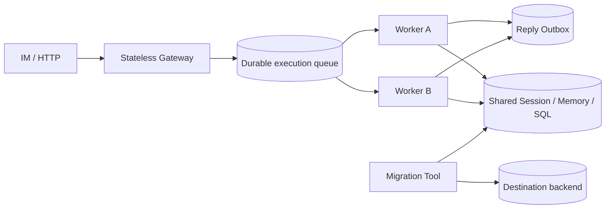

# Issue #76：无状态 Worker、共享队列与迁移切换

本页是 Issue #76 的实现合约和验收 ledger。目标是让 Gateway 只负责鉴权、
限流和投递，Worker 只消费不可变执行任务；所有跨节点状态都落在共享的耐久后端。
本 Issue 保持运行时存储能力与 Reply Outbox 状态机兼容；`runtime/queue` 是可注入的异步
执行边界，Bootstrap 按显式配置接管 Worker 生命周期，并保留同步 Gateway 入口。

## 边界与角色



Gateway 不保存 session 粘性，也不能由请求体选择租户；它把已经验证的
`tenant_id`、`agent revision`、`backend profile` 和 `traceparent` 编入任务。Worker
从队列领取任务后在 `context.Context` 中运行 Runner，租约和 fencing token 保护执行
结果。租约过期时只能由新 fence 的 Worker 进入重试或对账，旧 Worker 的提交必须被
拒绝。Reply Outbox 继续负责异步 IM 投递，避免执行队列和供应商重试耦合。

## 执行队列契约

`trpcservice/runtime/queue` 提供协议中立的 `Store` 和 `Worker`；耐久回复由
`trpcservice/outbox` 独立拥有：

- `Enqueue` 以 `(tenant_id, task_id)` 幂等；相同 payload 返回已有任务，冲突返回
  `ErrConflict`。
- `Claim` 原子地选择 `queued`、到期 `leased` 或 `retryable` 任务，递增
  `fencing_token`，设置 `lease_owner` 和 `lease_expires_at`。
- `Complete`、`Retry`、`Fail` 必须携带 owner + fence；过期或旧 fence 返回
  `ErrConflict`，不能覆盖新 Worker 的结果。
- 重试由 `NextAttemptAt` 和有限的指数退避驱动；不可重试错误或超过上限进入
  `failed`（死信），保留脱敏的错误类别。
- `Worker.Start(ctx)` 只由创建者调用且只能启动一次；`RunOnce(ctx)` 可用于同步处理单个任务。
  `Close` 可重复调用，会取消派生 context、停止领取
  新任务并等待正在运行的 handler，保证不会向已关闭的 channel 发送。

状态转换：

```text
queued -> leased -> completed
queued -> leased -> retryable -> leased
leased -> failed
leased (lease expired) -> leased  (new fencing token)
```

队列记录必须显式带租户键。PostgreSQL 使用复合主键、`FOR UPDATE SKIP LOCKED` 和
条件更新实现跨节点竞争；InMemory 实现只用于测试/本地，借助共享 Backend 模拟多节点
可见性。生产 Worker 不需要 sticky session，只要 Session、Memory、Queue 和 Outbox
使用同一共享后端。

## 迁移、双写与切换

`trpcservice/internal/migration` 将迁移拆成可重放阶段，每一步都按租户隔离并产生
`Report`。阶段状态通过 `StateStore` 持久化；默认的 `MemoryStateStore` 只用于测试和
dry-run，生产部署必须注入共享实现：

1. **dual-write barrier**：先在源端记录初始 watermark，再启用应用的
   source/destination 双写；在屏障建立前拒绝（或短暂排队）不可追踪的写入。
2. **copy**：读取带快照 watermark 的源快照，按 `(tenant_id, kind, key)` 排序写入
   目标；重复执行安全。快照期间的写入都由双写记录在 watermark 之后。
3. **catch-up**：从初始 watermark（含快照期间的增量）继续增量，直到
   source/destination 的 watermark 相等。
4. **validate**：按规范化 JSON 计算 SHA-256 checksum，比较记录数和 digest；
   任一租户失败都阻止切换。
5. **cutover**：原子地把租户路由标记为 destination，并保留旧 source 的只读窗口。
6. **rollback**：只允许在 cutover 后且未发生 destination-only 写入时回退；回退前
   再次校验 checksum，防止静默丢写。

Redis → SQL 迁移适合 Session/Event/Queue：先全量 copy，再以 Redis stream/watermark
追平，最后按租户切读。向量库迁移不复制 provider 内部 id，而是以
`tenant_id + source + document_id + version` 重建并校验；对象存储只迁移对象字节和
ETag，元数据事务仍由 SQL 负责。迁移工具不会把 secret、原始消息或 DSN 写入报告。

## 容量与故障验收

容量与故障验收使用队列深度、claim 延迟、每租户并发和 Session/IM QPS 作为运行信号。
队列、迁移和故障注入测试覆盖两个 Worker 对同一租户任务的单一有效 fence、旧 lease
提交拒绝、取消与 `Close` 的 goroutine 回收、IM 重复投递的单一 task，以及 checksum、
cutover 与 rollback 的恢复语义。

## Issue ledger

| 项目 | 阶段 | 证据 | 状态 |
| --- | --- | --- | --- |
| 无状态 Gateway/Worker 角色和共享后端边界 | 文档/组合入口 | 本页角色、Bootstrap 可选 Worker | ✅ |
| Durable queue lease/fencing/retry/shutdown | 代码 | `runtime/queue` 契约与测试 | ✅ |
| 可恢复的迁移阶段状态 | 代码 | `internal/migration.StateStore` 与重建测试 | ✅ |
| copy、dual-write、catch-up、checksum 工具 | 代码 | 迁移报告和阶段测试 | ✅ |
| Session/IM 容量与故障测试 | 代码 | 队列/迁移并发、取消测试 | ✅ |
| migration DDL 与权限 | 代码 | `0013_execution_queue.up.sql` 和 migration 测试 | ✅ |

本表与 CI queue/migration 测试和 fault-injection E2E 同步；lease/fencing、迁移阶段状态、
取消和恢复语义均由代码测试与 workflow 验收入口记录。
