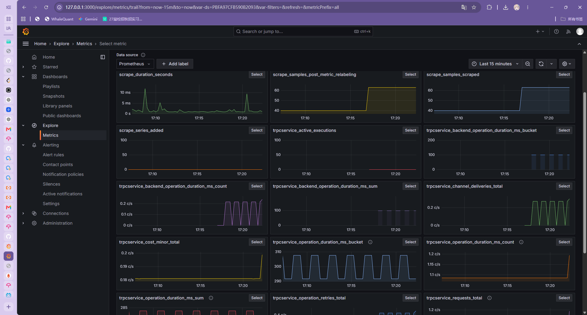
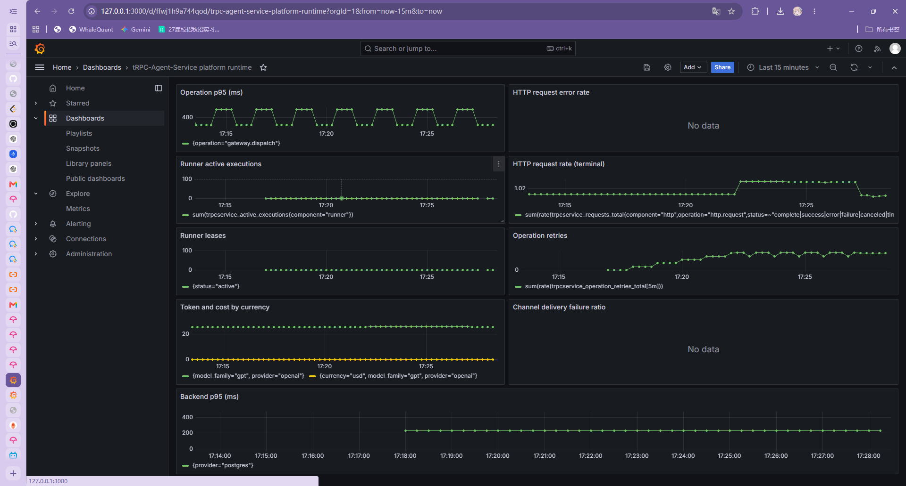
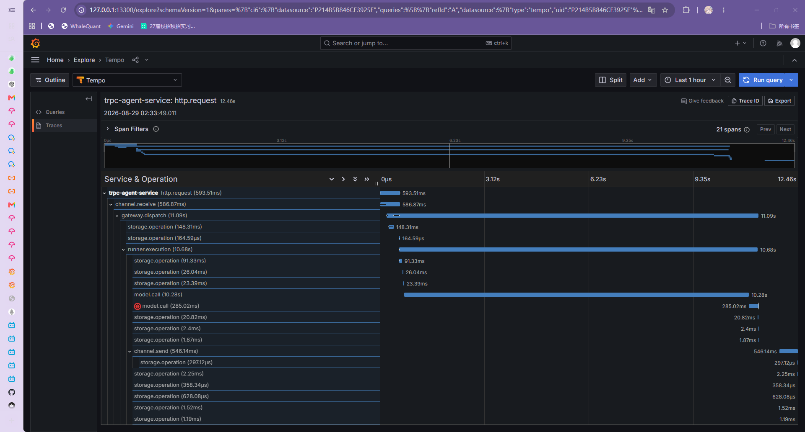

# Issue #88：Prometheus 可观测性

本项目的运行时指标使用 provider-neutral `trpcservice/metrics` 目录，并通过
OpenTelemetry OTLP/HTTP 导出。Prometheus 不直接嵌入业务 HTTP server；本地和生产
部署使用 OTel Collector 的 metrics pipeline 转换为 Prometheus scrape endpoint。

## 数据路径

```text
trpc-service --OTLP/HTTP--> otel-collector --Prometheus exporter--> prometheus --HTTP--> Grafana
```

服务通过以下环境变量启用 OTLP。`OTEL_EXPORTER_OTLP_ENDPOINT` 为空时保持 no-op，
不会创建后台 exporter，也不需要 Collector；值可以是 `host:port`，或带 `http://` /
`https://` scheme 和路径的 URL。仅允许标准 OTLP/HTTP endpoint，不接受换行或空白控制字符。

| 变量 | 默认值 | 说明 |
| --- | --- | --- |
| `OTEL_EXPORTER_OTLP_ENDPOINT` | 空 | Collector OTLP/HTTP 地址，例如 `otel-collector:4318` |
| `OTEL_EXPORTER_OTLP_HEADERS` | 空 | 逗号分隔的 `key=value`，只传给 exporter，不写入 telemetry |
| `OTEL_EXPORTER_OTLP_INSECURE` | `false` | `true` 时使用 HTTP；生产 HTTPS 应保持 `false` |
| `OTEL_SERVICE_NAME` | `trpc-agent-service` | OTLP resource 的 service 名称 |

配置错误在 bootstrap 阶段 fail closed；export、scrape 或 shutdown 错误只丢弃 telemetry，
不阻塞业务请求、Runner lease 或进程优雅退出。Runtime 关闭时给 exporter 两秒有界窗口。

## 本地启动

在仓库根目录执行：

```bash
docker compose -f deploy/observability/docker-compose.yml up -d
```

该 compose 启动 OTel Collector、Prometheus 和 Grafana。服务进程仍按项目现有配置启动，
并将 `OTEL_EXPORTER_OTLP_ENDPOINT=127.0.0.1:4318`（或同一 compose 网络中的
`otel-collector:4318`）指向 Collector。Prometheus scrape 地址为
`http://localhost:9090`，Grafana 地址为 `http://localhost:3000`，默认登录为
`admin` / `admin`（首次登录要求修改密码）。Dashboard 已自动挂载并使用固定的
`trpcservice_*` 查询；不得把 tenant、request、session、message 或 secret 放进 labels。

生成至少一条 HTTP 请求后，在 Grafana 的 **tRPC-Agent-Service platform runtime**
dashboard 中将时间范围设为最近 15 分钟即可看到请求、延迟和执行指标。Dashboard 是
platform-only 进程聚合；租户 usage/cost 仍必须通过授权的 AuditEvent 查询。

## 兼容性检查

Collector 导出的名称和 labels 必须保持 `deploy/observability/grafana-dashboard.json`
与 `deploy/observability/prometheus-rules.yml` 中的 `trpcservice_*` 查询兼容。指标的
属性继续由 observability 白名单过滤，高基数或敏感值被丢弃/脱敏。

## 验收证据

Metrics 和 runtime dashboard 截图来自本地 mock 数据；Trace 截图来自测试服务器上的
真实 WeCom 请求。租户 usage/cost 仍不应从 platform dashboard 推断，必须通过授权的
AuditEvent 查询。

### 图 1：Metrics 采集

Grafana Explore 的 Metrics 页面可以直接查询 trpcservice_* 时序，说明数据已经
经过 OTel Collector 转换并被 Prometheus scrape：



### 图 2：Runtime Dashboard

平台级 runtime dashboard 展示请求速率、Operation p95、Runner、token/cost、Channel
delivery 和 backend latency 等固定低基数聚合：



### 图 3：真实 Trace 泳道

Tempo Explore 中的真实服务器 Trace ID 为 `f9a3d27f6e711ff0eba6b098ebcc7db5`，时间为
2026-08-29 02:33:49（CST），共 21 个 span。可以看到 `http.request`、
`channel.receive`、`gateway.dispatch`、`runner.execution`、`model.call`、
`storage.operation` 和 `channel.send` 的父子层级：



该 trace 对应的 `message_event` 已进入 `replied`，`reply_outbox` 已进入 `sent`。
真实 WeCom/Telegram 请求在服务进程配置 OTLP endpoint 后，可通过 Grafana Explore →
Tempo 按时间或 Trace ID 查询；异步 Outbox `channel.send` 使用持久化的 W3C `traceparent`
恢复 parent context，具体链路见 [Issue #91](issue-91-trace-context.md)。

## 一键化部署配置清单

部署脚本直接复用 `deploy/observability/docker-compose.yml` 与同目录配置文件。
部署前只需要准备服务进程的 OTLP 环境变量：

```dotenv
OTEL_EXPORTER_OTLP_ENDPOINT=http://127.0.0.1:4318
OTEL_EXPORTER_OTLP_INSECURE=true
OTEL_SERVICE_NAME=trpc-agent-service
OTEL_EXPORTER_OTLP_HEADERS=
```

组件端口和依赖关系固定如下：

| 组件 | 地址/端口 | 作用 | 持久化 |
| --- | --- | --- | --- |
| trpc-service → Collector | `4318` | OTLP/HTTP metrics + traces 接收 | 无 |
| Collector → Prometheus | `9464` | Prometheus scrape endpoint | 无 |
| Prometheus | `9090` | metrics 查询与 recording rules | `prometheus-data` |
| Tempo | `3200`（查询）、容器内 `4318`（OTLP） | trace 存储与查询 | `tempo-data` |
| Grafana | `3000` | Dashboard/Explore UI | `grafana-data` |

标准启动、停止和健康检查命令：

```bash
docker compose -f deploy/observability/docker-compose.yml up -d
docker compose -f deploy/observability/docker-compose.yml ps
curl http://localhost:9090/-/ready
curl http://localhost:3200/ready
curl http://localhost:3000/api/health
docker compose -f deploy/observability/docker-compose.yml down
```

Grafana 默认 datasource 会自动 provision：Prometheus 与 Tempo；dashboard 文件自动挂载。
生产环境必须替换 `admin/admin`，限制 `4318`、`9464`、`3200` 的公网暴露，并将数据卷接入
备份策略。Collector exporter 失败只记录并丢弃 telemetry，不能阻塞业务关闭。

## Issue #88 台账

- [x] OTLP metric exporter 与 provider shutdown 生命周期
- [x] bootstrap OTLP 环境变量边界和默认 no-op
- [x] Collector、Prometheus、Grafana 本地配置
- [x] endpoint、配置边界和 exporter failure focused tests
- [x] 用真实服务流量完成一次 Trace 验证（测试服务器 WeCom 请求）
- [x] 用真实服务流量完成一次本地 metrics/dashboard 验证（Compose service、Collector、Prometheus 和 Grafana）
