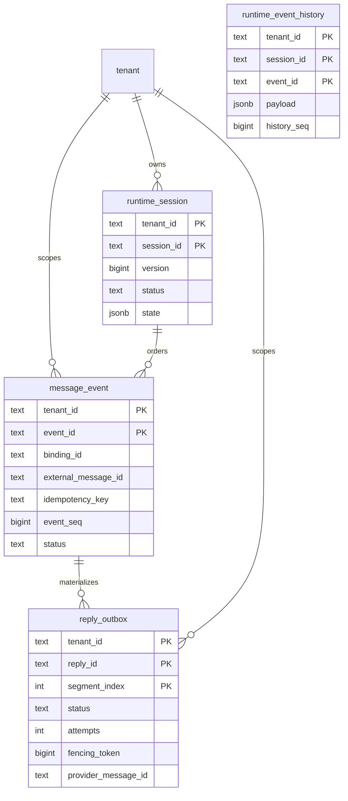

# Tenant 运行时持久化契约（Issue #48）

> 本页记录 Issue #48 的通用运行时存储能力契约，以及 Issue #108 的 Redis 实现边界。
> 代码、测试和部署示例均对应已验证能力与运行入口。

> 状态补充：预算账本现由 `trpcservice/runtime/budget` 独立持有，PostgreSQL 实现支持执行前
> 原子预占、执行后结算、失败释放和幂等重试；它不属于 Session/Reply RuntimeStore 的事务接口。

## 已交付能力

PostgreSQL 仍是控制面和默认运行时事实源；Redis 是可选的共享运行时后端。每个操作都必须显式带 `tenant_id`；
Session/Runner 使用的命名空间只用于防碰撞，不能替代数据库授权。已交付能力覆盖：

- Session 元数据、状态版本和生命周期；
- `message_event` 入站幂等事实、事件序号和执行状态；
- `reply_outbox` 分段回复、租约/fencing、重试和供应商回执。

Memory、Knowledge、Artifact、AuditEvent/usage/cost、IM webhook/media、分布式调度、Secret
Resolver 和告警平台通过对应模块接入；预算账本由 `runtime/budget` 提供，API principal 与
Channel principal 分别由 Gateway idempotency 和 durable inbound claim 保护。

## 数据边界和关系



约束必须由数据库和 Repository 双重保证：

- `(tenant_id, session_id, event_seq)` 唯一，事件序号单调且无跨租户共享；
- `(tenant_id, binding_id, external_message_id)` 唯一，重复入站返回已有事件；
- 事件和 Outbox 的所有外键都是带 `tenant_id` 的复合外键；
- `reply_outbox` 的 `(tenant_id, event_id, reply_id, segment_index)` 唯一，
  分段物化幂等；
- 返回的 map、slice、JSON 和时间值均为防御性副本。

## Repository 契约

平台层使用小接口，避免把 PostgreSQL 类型泄漏给 Gateway。Session 状态和事件
历史契约定义在 `trpcservice/storage/session`，runtime 专属的消息和回复契约
定义在 `trpcservice/runtime/storage/storage.go`；下面的接口与当前实现保持一致，
新的消费者应只依赖自己需要的最窄能力：

```go
type SessionStateStore interface {
    GetSession(ctx context.Context, tenantID, sessionID string) (sessionstorage.Session, error)
    CreateSession(ctx context.Context, tenantID, sessionID string, state map[string]any) (sessionstorage.Session, error)
    UpdateSessionState(ctx context.Context, tenantID, sessionID string, expectedVersion int64, state map[string]any) (sessionstorage.Session, error)
    DeleteSession(ctx context.Context, tenantID, sessionID string) error
}

type EventHistoryStore interface {
    AppendEventPayload(ctx context.Context, payload sessionstorage.EventPayload) (sessionstorage.EventPayload, error)
    ListEventPayloads(ctx context.Context, tenantID, sessionID string) ([]sessionstorage.EventPayload, error)
}

type MessageStore interface {
    RecordMessage(ctx context.Context, input MessageEventInput) (MessageEvent, bool, error)
    GetMessage(ctx context.Context, tenantID, eventID string) (MessageEvent, error)
    TransitionMessage(ctx context.Context, transition MessageTransition) (MessageEvent, error)
}

type ReplyStore interface {
    EnqueueReply(ctx context.Context, reply ReplyOutbox) (ReplyOutbox, error)
    ListReplyCandidates(ctx context.Context, tenantID string) ([]ReplyOutbox, error)
    GetReply(ctx context.Context, tenantID, replyID string, segmentIndex int) (ReplyOutbox, error)
    ClaimReply(ctx context.Context, tenantID, replyID string, segmentIndex int, owner string, leaseDuration time.Duration) (ReplyOutbox, error)
    TransitionReply(ctx context.Context, transition ReplyTransition) (ReplyOutbox, error)
}

```

运行时存储不再导出聚合接口。后端实现可以在内部由同一个对象同时提供多项能力，
但消费者必须只依赖自己需要的最窄接口。原子回复物化、correlation 和 provider receipt 分别由 `ReplyBatchEnqueuer`、
`ReplyBatchCorrelationEnqueuer`、`ReplyCorrelationStore` 和
`ReplyReceiptRecorder` 等可选能力表达，也不应被错误地塞回所有消费者的基础
接口。

runtime_event_history 是 session-scoped、append-only 的完整上游 Event JSON 历史；
同一 (tenant_id, session_id, event_id) 只能以相同 payload 幂等重放，冲突 payload 被拒绝。
Session adapter 在上游 delegate 恢复后按 history_seq 增量回放，避免 fresh process 丢失事件。
每个方法都要在 SQL 查询、事务、锁等待和连接获取处传递 `context.Context`。

稳定错误分类为：`ErrNotFound`、`ErrDuplicate`、`ErrConflict`、`ErrInvalid`、
`ErrIllegalTransition`、`ErrStorage`；取消和 deadline 原样保留为
`context.Canceled`/`context.DeadlineExceeded`。底层 SQL、DSN、Secret、完整消息和
供应商原始错误不得进入日志、trace 或 HTTP 错误。

## 提交顺序和状态机

一条入站消息的提交屏障固定为：

1. 以唯一键物化 `message_event` 入站事实；
2. 在 Session 行上做版本/CAS 检查并分配下一个 `event_seq`；
3. 持久化执行结果和 Session state；
4. 物化完整 `reply_outbox` 分段；
5. 异步重建 Summary（Summary 失败不能撤销前四步）。

入站状态为 `received → running → completed → reply_pending → replied`；租约过期进入
`execution_reconciling`，无法安全对账则进入 `failed`/死信。重复回调在
`running`、`completed` 或 `replied` 时只返回已有结果，不重新启动 Runner。Gateway 在
配置了对应的 MessageStore 时，会在 verified Channel principal 的 Runner 调用前以
`(tenant_id, binding_id, external_message_id)` 原子 claim；已有 claim 直接返回
`ErrDuplicateMessage`，因此第二个进程不会获取 Runner。

Outbox 最小状态转换为：

```text
pending -> sending -> sent
pending -> retryable -> sending
sending -> retryable | dead_letter
```

每次领取递增 `fencing_token` 并设置 lease；只有最新 fence 的 Worker 可以提交
发送结果。非法迁移返回 `ErrIllegalTransition`，不能被静默归一化。

协议中立的 outbox worker 通过租户限定的候选快照领取 pending/retryable 或过期
sending 分段；provider 成功回执只由当前 fence 写入 `sent`，可重试错误写入
`retryable`，不可重试或超过尝试上限写入 `dead_letter`。过期 lease 先调用
provider reconciliation，`accepted` 直接确认，`rejected` 重试，`unknown`
不得伪造成功。一个 event 的全部分段确认后，worker 才推进
`completed → reply_pending → replied`。

## Bootstrap 与恢复

Bootstrap 必须显式选择 Session capability。`TRPC_SESSION_BACKEND=postgres` 时，
必须同时提供已迁移的 `TRPC_POSTGRES_DSN`；`TRPC_SESSION_BACKEND=redis` 时，必须提供
`TRPC_REDIS_ADDR` 并在启动和 readiness 阶段成功 PING。未知值、缺失地址、连接失败或
migration 验证失败均 fail-closed，不会静默回退到 InMemory。`inmemory` 只用于开发和测试，
并在 readiness/启动日志中明确显示非持久化。新进程连接同一后端后应能读取已有 Session、
事件、Memory 和未发送 Outbox。

### Redis 实现范围（Issue #108）

Redis provider 通过 Backend Profile 的 `Provider: "redis"` 选择，只注册 `session` 和
`memory` capability；`summary`、`knowledge`、`artifact`、`audit` 等 capability 在 Catalog
校验阶段拒绝 Redis。每条 profile binding 必须使用 `redis://` endpoint；若
设置 `SecretRef`，它只能解析到当前 tenant 的 Redis 密码，密码不会进入 profile、快照、日志
或错误文本。Provider 构造时再次校验 endpoint/secret scope，避免不同 tenant 复用错误配置。

每个 tenant 使用一个 Redis key：

```text
<TRPC_REDIS_KEY_PREFIX>:<hex(tenant_id)>
```

默认前缀为 `trpc:runtime:v1`。key 的 tenant 部分使用 UTF-8 字节 hex 编码，避免简单拼接造成
边界碰撞。value 是版本化 JSON 状态文档，当前 `version` 为 `1`，包含 Session、Event、
event history、Reply Outbox、correlation、Memory 和 index handoff 集合。写入使用
`WATCH/MULTI` CAS；event 序号、重复消息 claim、lease/fencing 和完整 reply batch 在一次原子
状态更新中提交。

Redis key 没有隐式 TTL。Session、事件、历史、Memory 和 Outbox 不会因为连接池或重启自动过期；
保留、归档和删除由显式业务操作和运维门禁驱动。

### S3 Artifact provider（Issue #113）

S3 provider 只注册 `artifact` capability，不替换 Session、Memory、Summary、Knowledge 或
Audit provider。Backend Profile 的 binding 形状为：`Provider: "s3"`、HTTPS（本地 MinIO
可显式允许 HTTP）endpoint、`bucket` option 和 tenant-scoped `SecretRef`。AWS S3、MinIO
以及暴露 S3-compatible endpoint 的 OSS 均通过同一 provider contract 接入。

对象 key 使用稳定且不透明的 tenant 与业务 ID 编码，并按 `objects`/`artifacts` 分隔，等价 ID 在不同
tenant 间不会碰撞。Provider 在每次 materialize 时固定 tenant、校验 endpoint/bucket/SecretRef，
创建后以 bounded `HeadBucket` probe 作为 readiness；失败不会回退到 InMemory。Secret 值只在
Resolver 到 provider 的短路径中使用，推荐格式为 `access-key-id:secret-access-key`，不会进入
Profile、Execution Plan、日志、审计 payload 或错误文本。

S3 用户 metadata 受远端 header 大小限制；Artifact 的 metadata 在写入前会按保守的 1.8 KiB
预算校验，超限请求返回 `ErrInvalid`，不会产生远端写入。所有业务 ID 也会在 S3 编码后的
1,024-byte key 上限处 fail closed，避免把本地合法输入延迟为远端存储错误。

`PutObject`/`GetObject` 受 `max_bytes` 和读写 deadline 限制，使用 SHA-256 元数据校验并返回
防御性 reader；重复写入相同内容幂等，删除缺失对象返回 `ErrNotFound`。Artifact 元数据（名称、
MIME、session、版本、创建/更新时间和 digest）与内容一起校验；损坏或不完整元数据 fail closed。
写入会先在本地 bounded buffer 中完成，再发起单请求 S3 PUT；取消、超时或 PUT 失败不会向调用方提交
元数据，provider 不执行盲目删除，依赖 S3 单请求 PUT 的原子提交语义避免留下可见的部分对象。
`CapabilitySet.Close` 拥有并关闭 materialized S3 Store，关闭后不再接受操作。

本地可用 Compose 的 `s3` profile 启动 MinIO：

```bash
docker compose --profile s3 --env-file deploy/example.env -f deploy/docker-compose.yml up -d minio
```

然后把 Artifact binding 的 endpoint 设为 `http://minio:9000`，`path_style=true`、
`allow_insecure=true`，bucket 设为已创建的 bucket，并让 `SecretRef` 匹配
`TRPC_S3_SECRET_REF`。

首次启动后可用 MinIO 客户端创建与 binding 相同的 bucket（下面示例使用宿主机端口和示例凭据）：

```bash
docker run --rm --network host --env-file deploy/example.env minio/mc:RELEASE.2024-12-13T22-19-12Z \
  sh -c 'mc alias set local "http://127.0.0.1:${TRPC_MINIO_PORT:-9000}" \
    "${TRPC_S3_ACCESS_KEY_ID:-minio-local-access}" "${TRPC_S3_SECRET_KEY:-minio-local-secret}" \
    && mc mb --ignore-existing local/artifact-bucket'
```

live conformance 测试读取 `S3_RUNTIME_TEST_ENDPOINT`、`S3_RUNTIME_TEST_BUCKET`、
`S3_RUNTIME_TEST_ACCESS_KEY`、`S3_RUNTIME_TEST_SECRET_KEY` 和 `S3_RUNTIME_TEST_REGION`，
关闭并重建 provider，验证 Artifact/Object 在重启后仍可恢复。

主要环境变量如下：

| 变量 | 必需/默认 | 说明 |
| --- | --- | --- |
| `TRPC_REDIS_ADDR` | Redis 模式必需 | `host:port`，地址不写入错误或日志 |
| `TRPC_REDIS_PASSWORD` | 否 | 通过 Secret 注入的 Redis 密码；不写入配置快照 |
| `TRPC_REDIS_SECRET_REF` | 否，`env/trpc-redis-password` | Backend Profile 可使用的租户 SecretRef |
| `TRPC_REDIS_DB` | 否，`0` | Redis logical database，范围 `0..32768` |
| `TRPC_REDIS_KEY_PREFIX` | 否，`trpc:runtime:v1` | 共享实例的命名空间前缀 |
| `TRPC_REDIS_DIAL_TIMEOUT` | 否 | Go duration，例如 `500ms` |
| `TRPC_REDIS_READ_TIMEOUT` | 否 | Go duration，例如 `500ms` |
| `TRPC_REDIS_WRITE_TIMEOUT` | 否 | Go duration，例如 `500ms` |
| `TRPC_REDIS_POOL_SIZE` | 否 | 大于 `0` 时覆盖客户端连接池大小 |
| `TRPC_S3_ACCESS_KEY_ID` | 否 | 本地 Compose/Secret 示例使用的 S3 access key |
| `TRPC_S3_SECRET_KEY` | 否 | 本地 Compose/Secret 示例使用的 S3 secret key |
| `TRPC_S3_SECRET_REF` | 否，`env/trpc-s3-credentials` | S3 Backend Profile 必须匹配的 tenant SecretRef |

本地 Compose 已包含带 AOF 的 Redis 7 服务；生产/Kubernetes 使用外部 Redis，并通过 Secret
Manager 注入密码。Redis live conformance/reconnect 测试读取 `REDIS_RUNTIME_TEST_ADDR`，
PostgreSQL 真实验收测试读取 `POSTGRES_RUNTIME_TEST_DSN`、
`POSTGRES_RUNTIME_TEST_TENANT_ID` 与 `POSTGRES_RUNTIME_TEST_BINDING_ID`；两类测试均执行
完整运行时存储能力操作、关闭连接、重新打开连接并验证 Session/Event/History/Outbox
仍可读取。

## Issue ledger

| 项目 | 阶段 | 完成证据 | 状态 |
| --- | --- | --- | --- |
| 契约、表关系、状态机和提交顺序文档 | 文档 | 本页与 `data-model.md`/`ops.md` 交叉链接 | ✅ |
| InMemory/PostgreSQL 运行时存储能力接口 | 1 | Go 接口、错误分类、深拷贝测试 | ✅ |
| 有序 migration、复合 FK、唯一约束、状态约束和 Session 删除级联 | 2 | `0003_runtime_storage.up.sql`、`0004_runtime_session_delete_cascade.up.sql`、`0005_runtime_event_history.up.sql` 与 migration 测试 | ✅ |
| CAS/event_seq、重复入站和 Outbox fencing | 2 | 并发、乱序、重试、死信测试 | ✅ |
| Bootstrap 显式 Session capability 与 fail-closed | 3 | 环境配置、显式 Session capability-backed session.Service、重启恢复测试 | ✅ |
| durable Event payload/history 与完整 Event 状态生命周期 | 4 | `runtime_event_history`、fresh delegate replay、状态迁移测试 | ✅ |
| Outbox worker/reconciliation/provider delivery | 5 | fenced worker、重试/死信/过期 lease 与 provider 测试 | ✅ |
| Redis runtime storage 与 tenant-scoped bootstrap | Issue #108 | `runtime/storage/redis` 的 Session/Event/Reply Outbox/Memory、WATCH/MULTI CAS、miniredis conformance、配置/Catalog 边界和 reconnect 测试 | ✅ |
| S3 Artifact/Object provider 与 tenant-scoped bootstrap | Issue #113 | `runtime/storage/s3` contract tests、S3 Catalog/Secret/Probe 边界和 MinIO integration entry | ✅ |
| PostgreSQL/InMemory conformance 与 fresh-process restart | 6 | PostgreSQL runtime conformance、reopen/restart 和双租户隔离测试 | ✅ |
| verified Channel duplicate Runner suppression | 6 | MessageStore claim + 并发 Gateway Runner invocation-count 测试 | ✅ |
| 租户越权、取消、脱敏和防御性返回 | 1–6 | 双租户 conformance 与错误边界测试 | ✅ |
| `go test`、race、vet、build、MkDocs strict | 最终 | PR 验证记录与 CI | ✅ |

本表对应测试代码、重启路径和 CI service。`POSTGRES_RUNTIME_TEST_DSN` 与
`REDIS_RUNTIME_TEST_ADDR` 可用于在本地复用同一 conformance suite。
