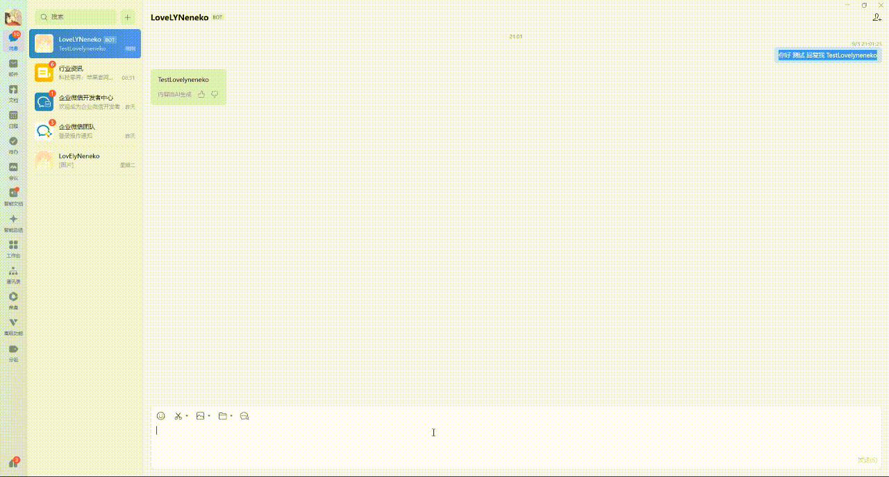

# WeCom AI Bot 长连接

`wecom_aibot` 是独立于自建应用 `wecom` 回调的 WebSocket 通道。服务端主动连接 `wss://openws.work.weixin.qq.com`，使用 Binding 的 `BotID` 与 SecretRef 中的 Bot Secret 发送 `aibot_subscribe` 认证帧。

入站仅支持文本单聊和群聊。回调帧的 `headers.req_id` 被透传到 Dispatcher 的 `RequestID`，`msgid` 作为 durable 幂等键；同一消息在重连或重复帧下不会启动第二次执行。回复由单 writer 按 `req_id` 排队，流式中间片段不进入 Outbox，最终文本写入现有 durable Reply Outbox 并在连接恢复后重试。

配置至少包含：

```json
{
  "channel": "wecom_aibot",
  "provider_account_id": "bot-account",
  "secret_ref": "env/wecom-aibot",
  "protocol": {"wecom_aibot": {"bot_id": "bot_xxx"}}
}
```

运行时必须允许出站 `wss://`，并将连接 Manager 的生命周期交给 Bootstrap Runtime。`BeginShutdown` 会停止新执行、取消连接和心跳；`Close` 等待 read/write pumps 退出。Secret、原始帧和消息正文不会进入日志、trace、audit 或错误响应。

使用 `NewFromEnvironment` 时，通过 `WECOM_AIBOT_CONNECTIONS` 配置当前单租户进程应持有的 Binding。该 JSON 数组的每项包含 `binding_id`、`secret_ref` 和 `bot_secret`；`secret_ref` 必须与控制面 Binding 一致，`bot_secret` 仅在进程内用于该受信任 Binding。Bootstrap 会验证 Binding、租户和应用均可接收执行，并把同一个 Outbox worker 按 BindingID 路由到 AI Bot 或现有 WeCom provider。

```json
[{"binding_id":"binding_xxx","secret_ref":"env/wecom-aibot","bot_secret":"..."}]
```

最终回复必须在 30 秒内收到 WebSocket 确认；启用 AI Bot 时，Outbox lease 会保留该确认窗口之外的回执提交时间。确认回执会在当前 lease 内持久化，进程在 `sent` 状态提交前重启时，接管 worker 只会据此完成 reconciliation，不会重复发送该段。未确认时会以可重试交付失败回到 Outbox。`disconnected_event` 表示此 Manager 已被替换，连接会停止而不是自动重拨。

## 真实部署验证证据

2026-09-03 在部署实例上完成企业微信 AI Bot 的真实收发验证：服务端通过 `wss://openws.work.weixin.qq.com` 建立并保持长连接，企业微信客户端向 Bot 发送测试消息，Bot 在同一会话返回回复。截图仅作为人工验收证据，不包含 Bot Secret、原始协议帧或运行时凭据。

<p align="center">
  
</p>

官方协议参考：[文档 60904](https://developer.work.weixin.qq.com/document/60904)；SDK：[aibot-node-sdk](https://github.com/WecomTeam/aibot-node-sdk)。
