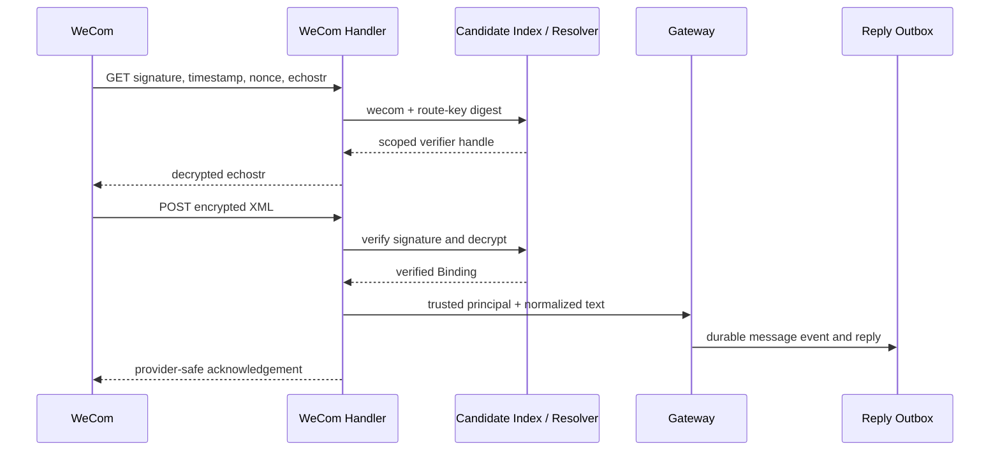

# 企业微信自建应用 Channel Adapter

> 本页是 Issue #60 的基础契约；Issue #77 扩展了多账号 registry、有界 worker、群聊
> delivery/receipt，以及独立的 Public WeChat/微信客服 provider boundary。Issue #98 增加受控媒体附件入站和图片/文件原生出站。

## 目标与边界

Issue #60 将既有 Telegram 长轮询和新的企业微信自建应用接入同一个租户可信入站和
可靠回复路径：

```text
Telegram long polling / WeCom HTTPS callback
    -> verified Binding + normalized text/media
    -> Gateway Dispatch
    -> Session/Event + Reply Outbox
    -> channel Provider
```

基础阶段支持：

- 企业微信自建应用的 URL 验证、签名校验、AES 解密、文本消息和受控媒体附件；
- 内部成员单聊；Issue #77 增加群聊入站/出站目标；
- Binding-aware Session identity、持久化入站幂等和受控文本回复；
- 既有 Outbox 的 retry、lease/fencing、dead-letter 与重启恢复语义。

自建应用 provider 使用文本、媒体和 rich Outbox 边界；卡片、被动 XML 回复和第三方应用由
显式协议 provider 管理，不允许 provider URL 或 token 穿过 Gateway。公众号和微信客服使用
`trpcservice/channels/wechat` 中互不兼容的显式 provider，不复用 WeCom credential。

`channels.ChannelWeCom` 的持久化值继续为 `wecom` 以保持已有 Binding 和 Admin API
兼容，但在本页和代码注释中它专指 `wecom_app`。公众号、微信客服使用独立的显式
Channel 类型和 Adapter。

## 绑定与凭据

每个企业微信自建应用对应一个 active Binding；一个服务进程可以托管多个 Binding。
企业微信后台为应用保存一个固定 callback URL，URL 的最后路径段是 Binding 的稳定公开
route key。例如：

```text
https://wecom.example.com/wecom/callback/<route-key>
```

route key 是公开发现线索，不是认证凭据。服务只保存其
`DigestPublicRouteKey(ChannelWeCom, routeKey)`，并在解密前用它查找短生命周期候选。
它应随机生成、在 Binding 生命周期内保持不变；轮换时必须先部署新 route，再更新企业
微信后台 callback URL。

非敏感 Binding 配置：

```go
type WeComProtocolConfiguration struct {
    CorpID    string
    AgentID   string
    ReceiveID string
}
```

`ProviderAccountID` 是企业和应用的稳定组合身份，不得只使用 `CorpID`，否则同一企业
的两个自建应用会发生 active Binding 冲突。实现使用规范、无歧义的编码组合 `CorpID`
和 `AgentID`，不接受昵称或 payload 覆盖。自建应用的 `ReceiveID` 为 `CorpID`。

历史 `wecom` Binding 仍可由 Admin API 读取和更新，但旧的 CorpID-only
`ProviderAccountID` 与缺少 `AgentID` 的 protocol 不会被自动推断或改写。Issue #60 的
迁移保留这些记录；它们在 ingress 中不可用，直到管理员以当前 `ExpectedVersion` 显式
更新 `AgentID`、组合 `ProviderAccountID` 和必要凭据，再重新激活。这样不会把一个企业
中的旧 Binding 错误绑定到任意自建应用。

`SecretRef` 指向一份短路径解析的凭据包：

```text
callback_token
encoding_aes_key
app_secret
```

Secret value 不进入 Binding、digest、Event、Outbox、日志、trace、错误响应或测试快照。
`access_token` 由 Provider 以 `CorpID + app_secret` 获取、缓存并刷新；它不是配置项，
也不应由调用方传入。

## 共享 Adapter 边界

统一边界由已经存在的消费者契约组成，而不是一个混合 polling、HTTP 和供应商 SDK 的
万能接口：

- `gateway.InboundMessage` 是 Telegram 与 WeCom 都提交的规范文本和外部身份；
- `gateway.DispatchService` 是两者共同调用的 Gateway/Runner 入口；
- `outbox.Provider` 是两者共同使用的异步回复交付接口；
- 每个 Adapter 明确自己的 transport 生命周期。Telegram Adapter 拥有 polling 的
  `Run/Close`；WeCom Handler 实现 `http.Handler`，由 HTTP Server 拥有 listener，
  Handler 自己拥有 ACK 后的 bounded execution drain，并由 Runtime 的
  `BeginShutdown/Close` 取消和 join。

共享 Adapter conformance 测试验证：只接受 text 和受控媒体、消息身份稳定、取消原样传播、未验证
payload 不能选择 Tenant/App/Binding、重复入站不重新执行 Runner，以及失败不暴露
供应商原始错误或 Secret。

## Callback 验证与可信路由



Handler 仅从 route key 得到候选；它不得从 XML、header、query 或 callback body 接受
`tenant_id`、`app_id`、`binding_id`、`secret_ref` 或 Provider account 作为路由输入。
候选 resolver 签发一次性、用途绑定的 handle；验证器使用 `msg_signature`、`timestamp`、
`nonce`、密文和 receive ID 验证、解密后才产生 `VerifiedBinding`。随后重新读取 Tenant、
Binding、App 的可信快照来构造 `RoutingTarget`。

GET URL 验证成功只返回解密后的 `echostr`。POST 接受严格 XML `text`、`image`、`file`、
`voice` 和 `video` payload；未知类型、缺少 `MediaId`、未配置 attachment store/downloader、
无效时间戳/nonce/签名、未知/过期候选、inactive Tenant/Binding/App、
receive ID 或 AgentID 不匹配都在 Runner 前失败关闭。对外响应不透露候选、Tenant 或
Secret 细节。

## 消息、Session 与回复地址

自建应用入站规范化为文本或媒体附件：

| Gateway 字段 | 企业微信来源 | 约束 |
| --- | --- | --- |
| `ExternalMessageID` | `MsgId` | 不能为空，作为 durable idempotency key |
| `ExternalUserID` | `FromUserName` | 稳定成员 UserID |
| `Content` | `Content` 或稳定媒体 marker | 交给 Gateway 再次规范化 |
| `Attachments` | `MediaId` 对应内容 | 仅保存内部 attachment reference，不保存 provider 下载 URL |
| direct peer | `FromUserName` | 生成单聊 session 和回复收件人 |
| group chat | `ChatId` | 生成群聊 session 和回复 chat target；群机器人、公众号和微信客服需要独立 Adapter |

Session 和 user identity 继续由 `RoutingTarget.RunnerIdentity` 以 Channel、Binding、
conversation kind、外部稳定 ID 和可选 thread 的长度前缀编码构造。两个 Binding、两个群
或两个线程绝不共享 Session。

回复不能只依赖 Provider 构造时固定的收件人。入站验证后必须生成一个受控
`ReplyTarget`，至少包含 Binding、conversation kind、稳定 receiver ID 和 thread。它随
`message_event` 持久化并被复制到 `reply_outbox`；Worker 将该目标交给正确的 Channel
Provider。这样同一个 Bot 或 WeCom App 才能回复多个用户/会话，重启、重试和 dead-letter
不会丢失目的地。

现有 reply materializer 在进入 Outbox 前生成持久化文本或媒体片段；企业微信 Provider
再校验每个片段，文本直接发送，图片和文档先上传临时素材再发送 `image`/`file` 应用消息。
不支持的音频、视频或未配置 attachment reader 的媒体片段使用 Outbox 内的 deterministic
fallback。成功返回的 provider receipt 写入既有 Outbox 状态机。HTTP、token 或供应商错误仅映射为稳定
retryable/permanent error class。Provider 不把原始 body、URL、token 或消息内容写入日志。

## 可靠性、关联与审计

入站 durable key 固定为 `(tenant_id, binding_id, external_message_id)`。首次 delivery
只启动一次 Runner；并发 duplicate、已完成或正在运行的 duplicate 返回既有 provider-safe
outcome，不能创建第二个 Event 或 Outbox。过期 execution lease 走既有 reconciliation
路径；Outbox 的 retry/backoff、fencing、dead-letter、restart recovery 不因 Channel 改变。

Adapter 为 GET/POST 生成或接收受限的 request/trace correlation，并把它传入 Gateway、
Runner、Event/Outbox 交付和既有 telemetry。审计仅记录稳定事实：授权拒绝、accepted/
duplicate ingress、delivery 成功/重试/dead-letter，以及 channel/error class；不记录外部
用户、消息正文、callback URL 或凭据。

## 验收矩阵

- URL 验证、AES decrypt/encrypt、签名/receive ID/AgentID failures 和安全错误响应；
- direct text/media 到 Gateway/Runner/Outbox；WeCom group callback 按 `ChatId` 规范化为 group；
- duplicate、并发、乱序和跨 Tenant/Binding identity；
- Context cancellation、retry/dead-letter、stale fence 和 restart recovery；
- Telegram Adapter 仍维持现有 long-polling、直接回复和 lifecycle 行为；
- 历史 CorpID-only `wecom` Binding 通过读取/更新迁移保持可管理，但在补齐
  `AgentID` 与组合 `ProviderAccountID` 前拒绝 ingress；
- InMemory/PostgreSQL conformance、migration、`go test ./...`、race、vet、lint、build 和
  MkDocs strict；
- 可选 live E2E 使用本地忽略的 `data/wecom-e2e.env`，不把实际凭据或 live pass
  当作默认 CI 证据。

## 环境装配

启用环境 bootstrap 的 WeCom vertical path 时，四个变量必须同时设置：

```text
WECOM_CALLBACK_TOKEN
WECOM_ENCODING_AES_KEY
WECOM_APP_SECRET
WECOM_SECRET_REF
```

`WECOM_SECRET_REF` 必须与 active Binding 的 `SecretRef` 和 `TRPC_TENANT_ID` 匹配。
callback path 的最后一段是公开 route key；环境变量不保存 route key，也不通过 path
直接构造 Tenant/App/Binding 身份。Bootstrap 会用 candidate index、scoped credential
resolver 和当前 Tenant/App/Binding 快照完成可信路由，并为该 tenant 启动一个
binding-aware Outbox worker。若 runtime store 实现 attachment store，bootstrap 会同时启用
WeCom 受控媒体 downloader 和图片/文件原生出站；否则媒体回调 fail closed，出站媒体走文本
fallback。未设置任何 `WECOM_*` 变量时，现有无 WeCom 的环境行为保持
不变；只设置其中一部分会拒绝启动。

## 运维前提

真实 E2E 需要公网 HTTPS callback、有效证书、反向代理到服务、企业微信应用的可信出口
IP、测试成员处于应用可见范围，并可访问 `qyapi.weixin.qq.com`。主机容量按部署实例的
CPU、内存、磁盘、PostgreSQL 与模型调用指标持续测量，并纳入运维门禁。
