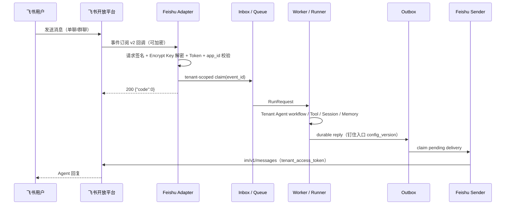

# 飞书 Channel Adapter 与 Sender

## 能力边界

`trpcservice/channels/feishu` 实现飞书自建应用的双向协议边界，与企业微信并存且租户隔离：

- `POST /channels/feishu/{binding_id}` 处理事件订阅回调：URL verification 挑战应答、
  `X-Lark-Signature` 原始请求体签名校验、Verification Token 常量时间校验、
  Encrypt Key（AES-256-CBC，SHA-256 派生密钥）解密；
- 事件订阅 v2 的 `im.message.receive_v1` 转换为统一 `gateway.InboundMessage`；
- `event_id` 进入共享 Inbox 唯一键，飞书重试和重复事件不会重复运行 Agent；
- `Sender` 使用 `auth/v3/tenant_access_token/internal` 获取并缓存 token，通过
  `im/v1/messages` 投递 Outbox 文本，支持 token 失效刷新重试一次、4096 字节 UTF-8
  安全分片、可重试/永久/uncertain 错误分类。

Adapter 不直接调用 Runner，也不绕过 Outbox 直接调用飞书 API。回调只完成
`验签/解密 -> app_id 校验 -> Inbox claim -> queue submit`，立即返回 200；
Worker 和 tRPC-Agent-Go Runner 在回调请求之外异步运行。

URL verification 遵循飞书官方 Dispatcher 的特殊握手顺序：加密 challenge 先用
Encrypt Key 解密，再用 Verification Token 认证并返回 challenge；该握手不要求普通事件的
`X-Lark-Signature`。握手完成后的真实事件仍强制校验签名，缺失或伪造签名返回 401。



## 配置

复用现有 `ChannelBinding` 字段，不保存 access token：

```yaml
channels:
  - binding_id: support-feishu
    type: feishu
    provider_account_id: cli_a1234567890      # 飞书 App ID
    webhook_url: https://agent.example.com/channels/feishu/support-feishu
    token:                                     # Verification Token（必填，SecretRef）
      provider: vault
      key: demo/assistant/feishu-verification-token
    secret:                                    # App Secret（必填，SecretRef）
      provider: vault
      key: demo/assistant/feishu-app-secret
    encryption_key:                            # Encrypt Key（可选；配置后明文回调一律拒绝）
      provider: vault
      key: demo/assistant/feishu-encrypt-key
    enabled: true
```

`App Secret`、`Verification Token`、`Encrypt Key` 和运行时 `tenant_access_token` 的实际值
不进入 Admin API 响应、日志、trace、HTTP 错误或审计 payload。`tenant_access_token` 只在
进程内并发安全缓存，提前一分钟刷新，平台返回 token 失效错误码时强制刷新并重试一次。

## 路由与租户隔离

- `binding_id` 只用于查找服务端控制面配置；tenant、app、config_version 永远来自服务端
  当前发布版本，客户端无法在回调中指定。
- 多个租户可以声明相同的 `binding_id` 或相同的飞书 `app_id`：Adapter 先按 binding_id
  取出全部候选绑定。加密回调先用各候选的 Encrypt Key 校验 `X-Lark-Signature` 并解密，
  再以 Verification Token 与 app_id 做唯一匹配；明文回调也必须唯一匹配。无法消歧时
  返回 401，不按数据库行顺序选择租户。
- 事件头 `app_id` 必须与绑定的 `provider_account_id` 一致，否则 401。
- disabled 租户 / App / Binding 解析不到候选，返回 404，不泄露租户信息。

## 身份与会话

- 用户身份优先使用稳定的 `open_id`，`union_id` 兜底，昵称从不作为身份；
- `user_id = feishu/{binding_id}/{open_id}`，包含 channel + binding 范围，与企业微信
  相同外部 ID 永不冲突；
- 单聊（`chat_type=p2p`）：`session_id = dm/{binding_id}/{open_id}`；
- 群聊（`chat_type=group`）：`session_id = group/{binding_id}/{chat_id}`，与发送者无关；
- binding 可配置 `allowed_users` 和 `allowed_chats`，分别匹配验签后的 `open_id` 与群聊
  `chat_id`。Worker 使用消息固定的配置版本在 Runner 前 fail closed；仅配置群白名单时
  直聊默认拒绝；
- 回复时群聊使用入口钉住的 `chat_id`，单聊使用 `open_id`。

权限拒绝不暴露外部 ID 或名单内容；两个租户即使使用相同用户或群 ID，也会按各自不可变配置
版本独立判断。

## 消息与失败语义

- 文本消息直接成为 Agent 输入；`@_user_N` 提及占位符（含 @机器人）被剥离并折叠空白。
- 图片和文件在验签与租户匹配后通过固定飞书 API 受控下载；限制大小、MIME、超时并安全
  清理临时文件，`image_key`/`file_key` 和下载 URL 不进入 Inbox、日志或审计。
- 不支持的事件和消息类型返回 200 ACK，避免飞书无限重试。
- JSON 格式错误返回 400；请求签名、Verification Token、解密、app_id 校验失败返回 401；
  Inbox/PostgreSQL 临时失败返回 503 让飞书按平台策略重试；重复 `event_id` 返回 200
  但不会再次执行。
- HTTP 错误不包含密钥、加密 payload 原文或完整用户消息。

## 动态配置与版本钉住

飞书完整接入生产控制面：

- Admin publish 新增或修改飞书 binding 后，下一个回调即生效，无需修改 YAML 或重启；
- 入站回调按当前发布版本解析；已进入 Runtime 的旧请求继续使用旧 `config_version`；
- Outbox 行携带入口钉住的 `config_version`，Delivery Worker 按该版本解析旧 Sender；
  Sender 按 `(tenant, binding, version)` 缓存，初始化失败不影响上一份有效配置；
- rollback 创建的新版本与普通发布走同一路径；
- 不存在回退到静态启动 YAML 的路由。

## 错误分类与 Outbox

- 可重试：HTTP 429/5xx、频控码 `99991400`、token 失效码（`99991661`/`99991663`/`99991664`）。
- 永久：其他业务错误码（如机器人不在群内的 `230001`），进入 DLQ 路径。
- uncertain：传输中断、响应不可解码或长消息部分分片已发出，禁止自动重发。
- 复用现有 Outbox 两阶段投递（`pending -> claimed -> sending -> sent`）、`SKIP LOCKED`
  多节点 claim、指数退避、DLQ 和 Redis 跨节点限流（`tenant_id + binding_id` 维度，
  每个分片单独计数）。

## 测试

无需真实飞书账号即可运行协议测试：

```bash
go test ./trpcservice/channels/feishu
go test ./trpcservice/delivery -run Feishu
go test ./cmd/trpc-service -run Feishu
```

覆盖 URL verification、错误 token、`X-Lark-Signature` 缺失/伪造、Encrypt Key 加解密、
明文拒绝、app_id 隔离、404、event_id 幂等、共享 app_id/binding_id 的多租户消歧、单聊/群聊身份稳定、飞书与企业微信
隔离、文本/图片/文件转换、token 缓存与并发单飞刷新、失效重试一次、UTF-8 分片、错误
分类、Outbox 集成、secret canary 脱敏和 v1→v2/rollback 的 Sender 切换。PostgreSQL 集成
测试（`TRPC_AGENT_POSTGRES_TEST_DSN`）覆盖飞书 binding 的发布、禁用、回滚与租户隔离。

## 真实联调与复验

仓库已通过飞书协议自动化和集成测试，覆盖事件订阅进入 Adapter 后的 Inbox、Runner、
PostgreSQL、Outbox 与模拟 Sender 链路。真实飞书账号、真实模型和公网 HTTPS 回调仍需部署方
按下述步骤复验并在受控系统留存脱敏证据；仓库不保存平台截图、用户消息正文、回调原文或任何凭据。

在新环境复验需要以下外部条件：

1. 飞书开放平台自建应用（App ID / App Secret），开启机器人能力；
2. 事件订阅配置：请求地址 `https://<public-host>/channels/feishu/<binding_id>`，
   添加 `im.message.receive_v1` 事件，记录 Verification Token（可选 Encrypt Key）；
3. 公网 HTTPS 入口（如 Cloudflare Tunnel）；
4. 在 Vault/KMS 的 `tenant_id/app_id/...` namespace 准备 Verification Token、App Secret 和
   Encrypt Key，通过 Admin API 发布只包含 SecretRef 的新版本；
5. 在飞书中给机器人发消息，验证 飞书回复 全链路。

复验报告只记录时间、commit/image、匿名 binding/tenant、PASS/FAIL 和受控错误类型，不粘贴
消息正文、下载 URL、App Secret、Verification Token 或 Encrypt Key。

## 当前限制

- 出站支持文本和 `reply_format: card` 的基础交互卡片；复杂按钮回调、PDF/Office/OCR 属于后续增强。
- 群聊 thread/topic 回复暂归入群会话，不单独建 thread session。
- 系统已提供 `uncertain` / DLQ 的 Admin 运维 API；可视化 Web 运维页面仍未实现。
