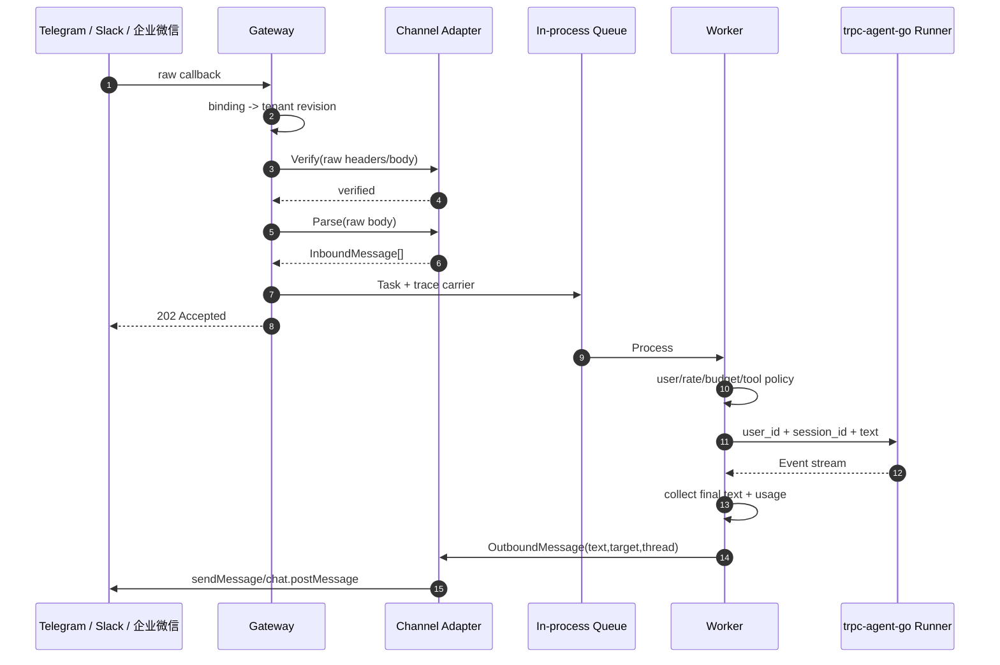
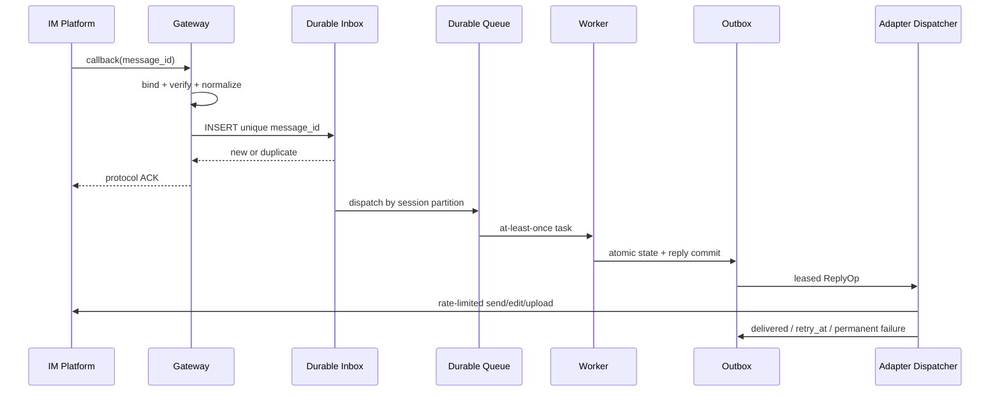

# IM Channel Adapter 设计

当前最小实现支持 **Telegram Bot、Slack Events API、企业微信自建应用和企业微信智能机器人 API 模式** 四类 IM。四者共用 provider-neutral 消息模型和同一套租户/治理/Runner/operation-ledger 流程，但连接、验签、消息字段、分片边界和回复 API 均封装在各自 Adapter/Bridge 内。

## 1. Adapter 契约与能力模型

当前 Go 契约为：

```go
type Adapter interface {
    Name() string
    Verify(r *http.Request, body []byte, binding config.ChannelConfig) error
    Parse(body []byte, binding config.ChannelConfig) (ParsedWebhook, error)
    Plan(binding config.ChannelConfig, msg domain.OutboundMessage) ([]delivery.Part, error)
    Deliver(ctx context.Context, binding config.ChannelConfig, request delivery.Request) delivery.Result
}
```

Webhook 通道的 `Verify` 必须在解析和入队之前对**原始字节**执行；`Parse` 只能生成规范消息，不能决定租户。智能机器人长连接由 Bridge 在认证后直接规范化并入队，仍由服务端 binding 反查租户，并强制核对帧内 `aibotid`。`Plan` 是不读 secret、不访问网络的纯函数：Telegram/Slack 按 rune，两类企业微信按 UTF-8 byte 生成确定性分片。`Deliver` 严格执行一个分片的一次消息 operation，禁止内部循环拆包；任何接收结果不确定的消息请求都不得在 Adapter 内重复。Registry 通过 Adapter 名称选择实现。

`delivery.Result` 只有四种调度语义：

- `confirmed`：解析到平台明确成功响应，可记录 message/request ID。
- `retryable_not_sent`：平台明确未受理且允许安全重试，例如 429、Slack `ok:false` 的 transient allowlist、企业微信非零 transient errcode；同时返回 `Retry-After`。
- `permanent_rejected`：配置、鉴权、目标或 payload 被明确永久拒绝。
- `unknown`：请求发出后的网络/timeout、通用 5xx 无法证明副作用、2xx 响应畸形或截断。Durable sender 立即停车，不能自动重试。

生产推荐在保持上述核心边界的同时增加 capability 声明，而不是给通用层堆平台特例：

```text
Capabilities {
  max_text, supports_edit, supports_delete, supports_thread,
  supports_card, supports_upload, supports_stream_emulation,
  inbound_ack_deadline, outbound_rate_policy
}
```

结果只保留低基数 error type、经白名单过滤的平台 code/message/request ID、HTTP status、`retry_after` 和 bounded response SHA-256；不保存 raw provider body/errmsg。稳定 operation key 当前仅用于本地 ledger：三平台均不被描述为具备可依赖的 exactly-once 发送键。

## 2. Webhook、账号与租户绑定

每个 IM 账号/应用创建一个 `channel_binding`：

```text
Webhook URL: POST /webhooks/{channel}/{binding_id}
Binding: {
  tenant_id, app_name, config_revision,
  channel, binding_id, enabled,
  token_ref, signing_secret_ref, workspace_id, application_id,
  allowed_users, max_message_length
}
```

当前配置文件保存的是环境变量名 `token_env` 和 `signing_secret_env`，不保存 secret 值。相同 `(channel, binding_id)` 在所有租户间唯一。Gateway 先用 URL 中的二元组查服务端 Registry，得到不可变 TenantConfig 快照，再验签；不会采用 callback body 中的 tenant 声明。

### Telegram

- 入站：比较 `X-Telegram-Bot-Api-Secret-Token` 与绑定 signing secret，长度检查后使用常量时间比较。
- 出站：从 `token_env` 读取 bot token，调用绑定 `api_base_url` 或 Telegram API 的 `sendMessage`。
- 当前 token 位于 Telegram URL 中，但 HTTP helper 不把 URL/底层网络错误原文传播到日志；仍应在代理访问日志中关闭完整 URL 记录。

### Slack

- 入站：拒绝与本机时间相差超过 5 分钟的请求；计算 `HMAC-SHA256(signing_secret, "v0:" + timestamp + ":" + raw_body)`，与 `X-Slack-Signature` 常量时间比较。
- 验签后继续强制比较 envelope 的 `team_id`/`api_app_id` 与绑定的 `workspace_id`/`application_id`，共享 Slack App secret 不能把另一工作区事件路由到本租户。
- 支持 `url_verification` challenge；普通消息只接受 `event_callback/message`，忽略 bot 和 subtype，避免基础回复回环。
- 出站：Bearer bot token 调用 `chat.postMessage`，线程回复携带 `thread_ts`。
- 群频道根消息用自身 `ts` 建立 thread session，后续 reply 与根消息连续。Slack 私聊普通消息默认共享 DM session；若用户从某条私聊根消息另开 Slack thread，带 `thread_ts` 的回复会进入独立 session，根 turn 不会复制进该分支，这是当前 Adapter 的明确语义边界。

当前 Slack 绑定已保存并校验工作区/应用 ID；生产还应保存 secret 版本、轮换生效区间、Webhook 状态和最近验签时间。轮换期间只允许“当前+下一”两把签名密钥短暂重叠，成功切换后撤销旧值。路径不可枚举、IP allowlist 和 mTLS 可作为额外防线，但不能替代平台验签。

### 企业微信（WeCom）

企业微信与 Telegram/Slack 的关键差异是：回调**整体加密**（AES-256-CBC）而非明文加签名字段，且存在一次性的 URL 验证流程。

- 接入配置：`workspace_id` 存 corpid，`application_id` 存自建应用 agentid，`token_env` 存应用 secret（换取 access_token），`signing_secret_env` 存回调 Token，`encryption_key_env` 存回调 EncodingAESKey。三者缺一不可，配置校验会拒绝缺失。
- URL 验证（GET）：企业微信注册回调 URL 时发送 `echostr` 挑战。服务端先验 `SHA1(sort(token, timestamp, nonce, echostr))`，再 AES 解密，校验明文尾部的 receiveID 等于绑定 corpid，最后以 `text/plain` 原样回显解密明文。路由层新增了 `GET /webhooks/{channel}/{binding}`，仅实现 `channels.URLVerifier` 的 Adapter 响应，其余返回 405。
- 消息回调（POST）：body 为 XML 信封，只有 `Encrypt` 一个字段。验签 `SHA1(sort(token, timestamp, nonce, Encrypt))` 常量时间比较，随后 AES-256-CBC 解密（IV=key 前 16 字节，PKCS#7 **填充到 32-byte 倍数**，明文为 `random(16B)+len(4B)+msg+receiveID`）。测试夹具独立按协议构造包含完整 32-byte padding 的密文，避免实现与自生成夹具犯同一错误。时间戳超出 ±5 分钟拒绝，防重放语义与 Slack 一致。
- 租户绑定：解密后 receiveID 必须等于绑定 corpid，明文 `ToUserName` 再次复核；`AgentID` 与绑定 `application_id` 强制比较——同一企业多个自建应用共用回调域时不会跨应用路由，语义对齐 Slack 的 `team_id/api_app_id` 检查。
- 身份与 scope：`FromUserName`（userid）为单聊身份；回调带 `ChatId` 时按群聊处理（`appchat/send` 回复）。幂等键为 `MsgId`，缺失时退化为 `target:CreateTime`。
- 出站：corpid+secret 经 `gettoken` 换取 access_token，进程内按 (corpid, secret) 缓存至过期前 5 分钟；单聊走 `message/send`（`touser`+`agentid`），群聊走 `appchat/send`（`chatid`）。`errcode 40014/42001` 触发一次刷新重试。企业微信会重投未及时 ACK 的回调，平台以 5 秒为超时阈值；本服务收到回调立即 202（企业微信不解析 body 内容），Agent 结果一律主动发送，不做被动加密回复。
- 长度语义：企业微信文本上限是 **2048 UTF-8 字节**（不是 rune 数），拆分器按字节回退到 rune 边界，不会截断多字节字符——与 Telegram/Slack 的 rune 拆分器是两条独立代码路径。
- 附件：实际回调 XML 顶层的 `MediaId`/`PicUrl`/`FileName` 会规范成 image/file 引用（并兼容旧嵌套夹具）；媒体内容下载、病毒扫描和对象存储仍属于生产附件流水线范围。
- 事件类回调（如 `subscribe`）解析后返回 ignored，不进入 Agent。

### 企业微信智能机器人（API 长连接模式）

- 配置以 `bot_id_env`、`bot_secret_env` 引用环境变量，不保存明文；默认连接 `wss://openws.work.weixin.qq.com`，私有部署可用 `websocket_url` 覆盖。
- 服务启动后发送 `aibot_subscribe` 认证帧，认证成功才允许 Outbox 投递；心跳、指数退避重连与 ACK 队列由 SDK 维护。相同 Bot ID 在多个 binding 中会拒绝启动，避免新连接踢掉旧连接。
- 入站接受 text、voice、mixed、image、file、video；`msgid` 为去重键，单聊以 `from.userid`、群聊以 `chatid` 作为 conversation/reply target，并校验回调 `aibotid` 与绑定凭据一致。
- 出站使用 `aibot_send_msg` 主动 Markdown 消息，因此 Agent/Outbox 不受被动回复窗口约束。连接尚未认证时标记 `retryable_not_sent`；已发送但 ACK 超时/失败标记 `unknown`，避免重复消息。
- 默认每片最多 20480 UTF-8 字节，按 rune 边界拆分。媒体下载 URL 不进入模型正文；当前只向模型提供附件类型元数据。
- 长连接是有状态入口：单 Bot 只运行一个连接实例。需要多副本时应把不同 Bot ID 分片到固定实例，而不是让每个副本同时订阅同一个 Bot。

## 3. 入站规范化

通用模型字段为：

| 字段 | 语义 |
| --- | --- |
| `tenant_id` | Gateway 从绑定写入，不接受外部覆盖 |
| `binding_id/channel` | IM 账号及平台类型 |
| `external_message_id` | 平台稳定事件 ID，作为去重输入 |
| `external_user_id` | 原始平台用户 ID，只在准入检查前短暂使用 |
| `conversation_id/thread_id` | 私聊/群/频道和子线程 |
| `scope` | `direct` 或 `group` |
| `text` | 文本/标题；不含 secret |
| `attachments` | 文件引用、名称、MIME，不直接信任 URL 内容 |
| `received_at/reply_target` | 平台时间和投递目标 |

具体映射：

| 通用字段 | Telegram | Slack | 企业微信 |
| --- | --- | --- | --- |
| message ID | `update_id`；缺失时 `chat.id:message_id` | `event_id`；缺失时 `channel:ts` | `MsgId`；缺失时 `ChatId/userid:CreateTime` |
| user | `message.from.id` | `event.user` | `FromUserName`（userid） |
| conversation | `message.chat.id` | `event.channel` | `ChatId`，无则 userid（单聊） |
| thread | `message_thread_id` | `event.thread_ts`；频道根消息使用自身 `ts`，与后续 thread 回复保持一致 | 不适用（无子线程概念） |
| scope | `chat.type == private` 为 direct，否则 group | `channel_type == im` 为 direct，否则 group | 回调带 `ChatId` 为 group，否则 direct |
| text | `text`，空则用 `caption` | `event.text` | `Content` |
| image/file | 选择 Telegram 最大 photo 的 `file_id`，或 document 引用 | `files[]` 的 ID/名称/MIME/私有 URL 引用 | 顶层 `MediaId` / `PicUrl` / `FileName` |
| reply target | `chat.id` | `channel` | group 为 `ChatId`，direct 为 userid |

当前实现会解析附件元数据，Worker 把安全的 `type/name/MIME` 作为文本标记附在用户消息中，但刻意不把 file ID、私有 URL 或文件内容交给模型；出站也只发送文本。它因此是“附件识别/元数据提示”的部分实现，不能声称已有图片理解、文件内容处理或文件回复。

生产附件流水线应为：权限校验 → 使用绑定 token 下载 → 限制字节数/超时/跳转 → MIME sniff（不信任扩展名）→ 病毒与内容扫描 → 租户对象存储/KMS → OCR/视觉或文件工具 → 保存 provenance。Slack `url_private` 只能由服务端带 token 访问，绝不能回显或写入 trace。

## 4. IM 输入到 Runner、Agent Event 到回复

### 4.1 当前路径



Runner 的 Event channel 当前会被完整消费，但 partial/final 文本在 Worker 中聚合成一次最终回复；不做逐 token IM 更新。默认（`queue.backend=inmemory`）仅当 typed `retryable_not_sent` 对**整个任务**仍安全时最多同步尝试三次：首个/唯一分片明确未发送可以重试；若前序分片已确认而后续分片失败，则停止整任务重放，避免复制已经发出的分片。`permanent_rejected` 与 `unknown` 同样一次即停。启用 `queue.backend=postgres/memory` 后，`Plan` 的每个分片成为独立 Outbox operation：lease 原子创建 attempt、发请求前持久化 `dispatched`，明确安全失败按 `max(Retry-After, 指数退避)` 重试，永久失败/耗尽进入 dead letter，unknown 则无租约停车并阻塞同 Session 后继。管理员通过脱敏列表和 version+attempt CAS 决议确认、重试或取消；Agent 不重跑。严格故障语义见 [data-consistency.md](data-consistency.md)。

### 4.2 生产 Event 转换

建议引入 `ReplyPlanner`，把 Agent Event 归一成平台无关操作：

| Agent/平台事件 | 通用 ReplyOp | 平台实现 |
| --- | --- | --- |
| 首个 partial text | `CreatePlaceholder` | 发“处理中”或首段文本 |
| 后续 partial text | `EditText`，合并/节流 | 支持编辑的平台更新原消息；不支持则只保留最终消息 |
| Runner completion | `FinalizeText` | 最终编辑或拆分发送 |
| tool ask/approval | `InteractiveApproval` | 卡片按钮；无卡片时返回一次性 nonce 文本 |
| artifact/image | `UploadAttachment` | 平台上传 API 或受限 signed URL |
| structured result | `SendCard` | Block/Card；无能力则确定性降级为纯文本 |
| failure | `SendErrorTemplate` | 安全错误码与重试提示，不含内部错误/secret |
| cancel/withdraw | `DeleteOrMarkCancelled` | 支持删除则调用；否则编辑为取消/发送说明 |

流式更新必须按 binding 令牌桶节流并合并增量，例如每 0.8～2 秒最多一次编辑；不能把模型 token 速率直接打到 IM API。客户端/Adapter 需要记录 placeholder 的 platform message ID，崩溃后可由 Outbox 恢复 Finalize。

## 5. 单聊、群聊与身份隔离

当前身份算法先将原始 ID 规范连接，再取截断 SHA-256；原始平台 ID 不作为跨租户存储键。

```text
direct principal_id = H("user", tenant, binding, channel, external_user)
group principal_id  = H("group", tenant, binding, channel, conversation)
session_id = H("session", tenant, app, binding, channel,
               scope, effective_conversation, thread)
sender_id  = H("sender", tenant, binding, channel, external_user)
```

- 单聊的 `effective_conversation` 固定为用户 ID，所以同一用户在同一 bot/app 私聊保持连续 session。
- 群聊以群/频道为 Runner principal；不同成员共享群上下文，但审计和工具授权上下文使用单独的 `sender_id`，不会把成员身份混为一人。
- Slack thread 与 Telegram `message_thread_id` 都进入 session key；Slack 频道根消息预先使用自身 `ts`，因此根消息和后续 thread 回复不会被拆成两个 session。
- 群聊的 Runner principal 是群，但每条模型输入会附带租户作用域的伪匿名 `sender_id`，保留成员轮次归属且不暴露平台原始用户 ID。
- tenant、binding、channel、app 都在 hash 输入中；同一外部用户跨群、跨 bot、跨平台、跨租户不会复用 session 或 Memory。

若业务希望“同一租户跨渠道认同一自然人”，必须通过经授权的 account-link 表显式建立 `subject_id`，而不是删除 binding/channel 隔离因子。生产伪匿名 ID 推荐租户密钥 HMAC，并在工具执行前以 sender 身份做资源级授权。

## 6. 去重、ACK 与异步回复

当前每个平台的 `external_message_id` 与 tenant/binding/channel 一起生成 dedupe key。验签、解析、入队成功后 Gateway 返回 202；无关/不支持事件返回 200 ignored，Slack challenge 返回 challenge，签名失败返回 401，队列满返回 503 促使平台重投。

`queue.backend=postgres`（Docker Compose 默认）时，202 前先完成 `runtime_inbox` 的持久 `INSERT`（dedup key 唯一约束，`ON CONFLICT` 语义等价于命中重投直接 ACK）；`backend=memory` 提供相同语义的无数据库实现；仅默认 `inmemory` 是写内存队列即 ACK。生产设计的完整流程（含状态查询、对账）如下，已实现子集见 [data-consistency.md §6.2](data-consistency.md#62-已实现的持久-inboxoutboxqueuebackendpostgres)：



用户体验上可在预计超过数秒时发送“已接收/处理中”占位，但它也必须通过 Outbox；不能在 Worker 本地直接发送后再写状态。

## 7. 平台限制与降级矩阵

当前默认最大文本长度是 Telegram 4096、Slack 40000 个 Go rune、企业微信 2048 UTF-8 字节；这些是**实现配置默认值**，部署时应按所用 API 版本复核，不应当作永远不变的平台合同。Telegram/Slack 按 rune 边界拆分，企业微信按字节限制拆分并回退到 rune 边界；两者都不理解 grapheme cluster、Markdown 代码块、Slack blocks 或 Telegram entity offset。

| 限制/能力 | 当前最小实现 | 生产推荐 |
| --- | --- | --- |
| 文本长度 | 按 rune 硬切，多段发送 | 平台 capability 动态限制；优先段落/句子切分，保留 markup/entity，带 `part i/n` 与 outbox 子 ID |
| 频率限制 | 入站有租户级 Redis 共享固定窗口 RPM；Redis 故障 fail-closed；出站无平台限频 | binding/workspace/chat 多级令牌桶；尊重 `Retry-After`；公平调度避免大租户饿死小租户 |
| 异步回复 | Webhook 后异步 worker；`postgres` 为持久 Inbox/Outbox、数据库统一时钟和 attempt/resolution ledger，`memory` 提供同 Session FIFO 但不跨重启；两者均按完整 Session lane 阻止后继越过 retry/processing 队首 | 生产补齐平台状态查询/自动 reconciliation、超时占位、取消与主动限频 |
| 流式回复 | 聚合为最终文本 | 支持 edit 则节流更新；不支持则最终一次发送 |
| 卡片 | 未实现 | 通用 Card AST + 平台 renderer；降级纯文本 |
| 图片/文件入站 | 仅解析引用/元数据 | 鉴权下载、扫描、对象存储、OCR/视觉、多模态消息 |
| 图片/文件出站 | 未实现 | 上传/复用 file ID；大小超限压缩或 signed URL |
| thread/topic | Slack thread 与 Telegram `message_thread_id` 已保留 | 继续按平台 capability/version 验证 topic/thread 行为，参与 session key |
| 撤回/编辑 | 未实现 | Outbox ReplyOp；保存 platform message ID；权限/时间窗不允许时标记而非假成功 |
| 失败重试 | `inmemory` 只对整个任务仍安全的 `retryable_not_sent` 最多尝试 3 次；持久 Outbox 仅对明确未受理结果遵循 `Retry-After`/退避并设上限，通用 5xx/网络/超时转 `unknown` 停车 | 生产补齐 jitter、平台查询/自动 reconciliation 与受审计的人工决议 |

错误分类建议：

- `429`、平台显式限流或其他能证明消息未受理的返回：归类 `retryable_not_sent`，优先使用 `Retry-After`，否则指数退避加 jitter。
- 通用 `5xx`、请求发出后的连接错误/超时、2xx 畸形或截断响应：无法证明平台没有产生副作用，归类 `unknown` 并停止自动重试；先查询平台 message/request ID 或控制台，再由 CAS 决议确认、显式接受重复风险重试或取消。
- 无效 token/签名、权限撤销：暂停 binding、告警，不持续重试放大故障。
- target 不存在/用户阻止 bot/内容永久非法：标记 permanent failure，写审计并结束。
- payload 过大：本地降级拆分、压缩或转链接后再投递，而不是原样重试。
- 发送结果未知：平台支持查询则按 client/outbox ID 对账；不支持时保持停车并告警，不以“限制次数”为由自动重试。

## 8. 用户权限与危险操作确认

`allowed_users` 当前按原始平台 user ID 做 binding 级 allowlist，发生在模型和 Session 调用之前。空列表表示不限制；生产环境应显式选择 `allow_all` 或列表/目录组，避免“空值语义”误配置。

危险工具需要二次确认时，当前 Runner 返回一次性 `#approve:<nonce>` 文本；nonce 绑定 tenant、config revision、用户、session、工具名和规范化参数 hash，5 分钟过期且只能消费一次。生产卡片按钮必须携带同一绑定 scope，经 IM 用户签名上下文验证，参数改变即重新确认。`coordination=redis` 已使用共享 Redis nonce store，TTL 与原子消费覆盖跨节点审批；`inmemory` 只适合单节点。生产还需配置 Redis 持久化/故障切换；消费结果不确定时拒绝授权。

## 9. Adapter 测试与接入新平台清单

现有自动测试覆盖 Telegram 验签/解析、Slack HMAC/时间窗口/challenge/解析、企业微信 32-byte PKCS#7/AES 加密回调验签/解密/URL 验证/corpid 与严格 agentid 绑定/顶层媒体字段/token 缓存与过期重试/字节拆分、rune 拆分、Gateway 先验签后分发、binding 反推 tenant。新增微信客服、公众号等 Adapter 时至少补齐：

1. 官方签名与加密消息测试向量，含时间重放、错误 key、畸形 body 和 challenge。
2. 私聊、群聊、thread/topic、机器人回环、消息编辑/撤回等事件夹具。
3. 同一外部 message ID 的重复 callback、乱序和批量 callback。
4. 用户/群/租户身份隔离属性测试。
5. Unicode/markup/卡片/大文件边界及 SSRF、压缩炸弹、MIME 欺骗。
6. 429、5xx、超时、发送结果未知、token 撤销和 DLQ 回放。
7. 日志、trace、错误返回中不出现 token、签名 secret 或私有下载 URL。

每个 Adapter 上线前应发布 capability/version 和降级行为；通用 Worker 不应通过 `if channel == ...` 绕过 Adapter 边界。
