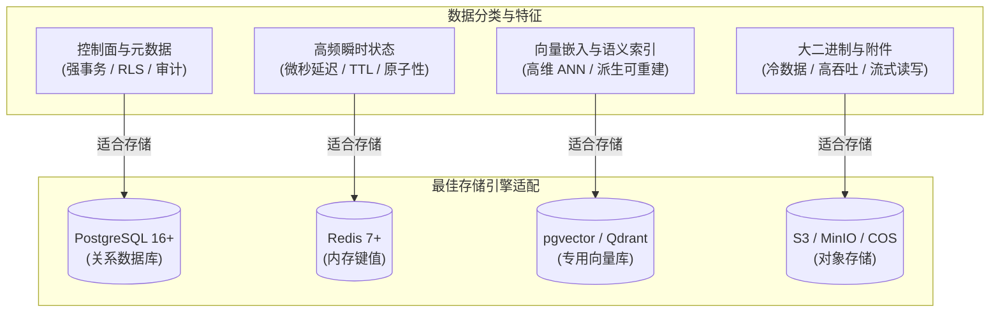
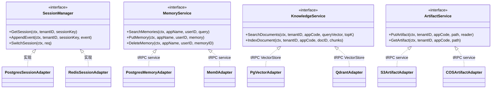

# tRPC Agent Service 多后端适配方案

## 1. 背景与核心存储选型矩阵

在多租户 AI Agent 运行架构中，不同的业务数据对延迟、一致性、持久化保障及检索形态有着截然不同的诉求。单一数据库无法兼顾高并发租约锁、TB 级大附件对象、高维向量相似度检索与强 ACID 会话状态。

平台对系统数据进行分层治理，确立了 **SQL (PostgreSQL)**、**Redis**、**向量库 (pgvector / Qdrant)**、**对象存储 (S3 / MinIO / COS)** 四大存储后端的职责分工：



### 1.1 存储选型矩阵与职责一览表

| 存储类型 | 代表技术 | 平台适合存储的数据 | 选型核心理由 | 备份与灾备恢复策略 |
| --- | --- | --- | --- | --- |
| **SQL** | PostgreSQL 16+ | 租户控制面、应用版本/灰度、执行 Lease、消息幂等兜底、Outbox、审计；默认也可承载 Session / Memory / Artifact；知识库权威源文件 | ACID、强约束、`FORCE ROW LEVEL SECURITY` 逻辑隔离 | 数据库备份（PITR/WAL 归档）与主从复制由生产环境部署方案统筹规划，依据企业 RPO/RTO 指标配置 |
| **内存 KV** | Redis 7+ | 入站消息幂等租约、租户限流/用量协调、实时消息与缓存；也可作为租户 Session / Memory 后端 | Lua 原子状态机、TTL、低延迟 | Redis 数据不是平台最终执行事实；关键幂等状态仍由 PostgreSQL 兜底 |
| **向量库** | pgvector / Qdrant / Elasticsearch | Knowledge 切片 Embedding 与语义检索索引 | 适合 ANN/向量检索；与关系型权威源解耦 | **派生可重建索引**：从 `knowledge_document_sources` 重新切分、Embedding 并灌入目标 VectorStore |
| **对象存储** | S3 / MinIO / 腾讯云 COS | tRPC-Agent-Go Artifact 及需要对外发送/下载的生成文件 | 大对象不占用 PostgreSQL 热表和 WAL；适合版本化对象 | 使用对象存储自身的版本、复制和生命周期能力；平台保存 Artifact 元数据与版本引用 |

---

## 2. 深入存储选型与职责划分

### 2.1 SQL (PostgreSQL)：强一致性控制面与审计中枢
1. **适合存储的数据**：
   - `tenants`, `platform_users`, `tenant_members`：平台多租户组织架构与 RBAC 权限；
   - `applications`, `application_configs`：应用系统提示词、模型超参、工具授权版本历史；
   - `sessions`：平台渠道路由、归属与执行索引；当租户选择 PostgreSQL Session Profile 时，tRPC-Agent-Go 的 `session_events / session_states / session_summaries` 也存放于 PostgreSQL；
   - `session_execution_leases`：带有 `fencing_token` 的会话排他分布式执行锁；
   - `outbox_events`：事务发件箱出站任务；
   - `audit_events`：租户操作审计日志与 Token 消耗流水；
   - `knowledge_document_sources`：知识库原始文件的权威二进制全量备份。
2. **选型深度理由**：
   - **RLS 租户数据隔离**：平台控制表通过 `current_setting('app.tenant_id', true)`，框架 Session / Memory 表通过 `current_setting('app.app_name', true)` 实施 `FORCE ROW LEVEL SECURITY`。这是数据库层逻辑隔离，不是物理/硬件隔离；
   - **平台状态原子性保障**：消息完成索引、审计、脱敏 Execution Trace 与 Outbox 在 PostgreSQL 边界内提交。Session、Memory、Knowledge、Artifact 若被路由到其他后端，则服从各自 Adapter 的一致性语义，不尝试实现跨异构存储的 2PC。

### 2.2 Redis：低延迟幂等门禁与实时事件流
1. **适合存储的数据**：
   - 消息去重租约：`idempotency:{tenant}:{channel}:{binding}:{msg_id}`；
   - 平台限流、用量预留和多节点实时协作所需的短生命周期状态；
   - 租户选择 Redis Backend Profile 时的 tRPC-Agent-Go Session / Memory 数据。
2. **选型深度理由**：
   - 幂等和限流需要低延迟原子操作，Redis Lua 可以把读改写合并成一次服务端操作；
   - TTL 适合清理高频短期租约，但 Redis 失效不能替代 PostgreSQL 的持久执行去重。

### 2.3 向量数据库：派生语义检索增强（RAG）
1. **适合存储的数据**：
   - 文档的分块（Chunks）及对应的高维 Embedding 向量；
   - Knowledge 文档的分块（Chunks）及对应 Embedding 向量。Memory 是否使用向量检索由所选 tRPC-Agent-Go Memory 后端决定，并不强制走 Knowledge VectorStore。
2. **选型深度理由与关键架构决策**：
   - 专用 VectorStore 提供向量距离、过滤与 ANN 索引能力，避免平台自己实现检索算法；
   - **关键设计：向量库属于可重建的“派生系统（Derived System）”**。若向量库发生崩溃、分片损坏或企业更换了底层的 Embedding 模型（例如从 Text-Embedding-3-Small 换为 BGE-M3），平台无需依赖向量库的物理快照，直接从 PostgreSQL 的 `knowledge_document_sources` 表按批次重新提取原始文件，执行重切分与向量重算。

### 2.4 对象存储：大二进制与静态多媒体资产
1. **适合存储的数据**：
   - Agent / Tool 通过 tRPC-Agent-Go Artifact Service 保存的生成物；
   - 最终需要通过 IM 发送或由控制台下载的持久化文件版本。
2. **选型深度理由**：
   - 数据库直接存储几 MB 至几十 MB 的 Blob 文件会导致内存命中率骤降、备份缓慢、连接池阻塞；
   - 对象存储提供按租户分目录存储（`s3://bucket/{tenant_id}/{app_code}/artifacts/{file_id}`），支持直接向前端颁发有时效性的预签名下载 URL（Presigned URL），避免应用服务器中转流量浪费带宽。

---

## 3. 多存储适配抽象层（Storage Adapter Architecture）

平台全面拥抱 tRPC-Agent-Go 的存储生态，通过 `assembly` Provider 将租户配置的 Backend Profile 动态装配为框架原生的 Service 实例。下图展示各存储领域的核心逻辑路由关系：



### 3.1 驱动配置文件与领域白名单（Backend Profiles）
代码定义见 `migrations/000001_init.sql` 中的 `backend_profiles`：
```sql
CREATE TABLE backend_profiles (
    profile_id TEXT PRIMARY KEY,
    display_name TEXT NOT NULL,
    driver TEXT NOT NULL CHECK (driver IN ('inmemory','postgres','redis','mysql','sqlite','mongodb','clickhouse','pgvector','qdrant','elasticsearch','s3','cos','mem0','chromadb','tencentdb')),
    connection_ref TEXT NOT NULL DEFAULT '',
    domains TEXT[] NOT NULL,
    status TEXT NOT NULL DEFAULT 'active' CHECK (status IN ('active','disabled'))
);
```
- **域名约束（Domains Constraint）**：
  - `redis` 仅允许绑定 `session`, `memory` 领域；
  - `pgvector` / `qdrant` / `elasticsearch` 仅允许绑定 `knowledge` 领域；
  - `s3` / `cos` 仅允许绑定 `artifact` 领域；
  - `postgres` 支持 `session / memory / artifact`；Knowledge 使用独立的 `pgvector / qdrant / elasticsearch` Profile。
- 不兼容的 domain/driver 组合由数据库 CHECK 约束与应用发布时的 `PlatformPolicyValidator` 双重校验防御拦截。

---

## 4. 租户隔离与动态平滑迁移

### 4.1 租户专属存储配置（Tenant Backend Profiles）
每个租户可以通过配置使用独立隔离的后端实例：
- 默认租户共用平台级托管集群；
- 大客户/合规敏感租户可配置专属私有 VPC 内的 RDS PostgreSQL、专用 Qdrant 实例或私有 S3 Bucket；
- 平台通过 `tenant_backend_profiles` 建立关联映射，各组件根据当前执行上下文动态构建存储连接。

### 4.2 在线迁移机制与数据领域特性
平台针对不同存储领域的数据特征，实施针对性的平滑迁移与解耦策略：
1. **Session 会话历史平滑热迁移**：采用 `prepared → dual_write → backfill → verify → cut_read → stop_old_write → done` 8 阶段状态机，双写异常进入 repair 补偿队列，确保源端与目标端数据逐会话比对无误后方可切读；派生摘要（Summary）随新主节点事件自动重建；
2. **Knowledge 派生向量索引重建**：以 PostgreSQL 中的 `knowledge_document_sources` 权威文档为源，在目标 pgvector 或 Qdrant 实例上异步重新切分生成向量，检索验证通过后热切换 Knowledge Profile；
3. **Memory 与 Artifact 的静态选型**：Memory（用户画像与记忆事实）与 Artifact（大文件产物）通过 Backend Profile 绑定至对应专有实例。因其数据写入特征，平台推荐以租户为粒度做生命周期隔离，暂不引入复杂的跨实例在线热双写。

### 4.3 一致性、延迟与运维成本取舍

| 后端 | 主要一致性 | 典型延迟诉求 | 成本/运维复杂度 | 适合场景 |
| --- | --- | --- | --- | --- |
| PostgreSQL | 强事务 / RLS | 中低 | 中 | 控制面、审计、Outbox、默认 Session/Memory |
| Redis | 原子操作、TTL；持久性取决于部署 | 低 | 中 | 幂等快路径、限流、低延迟 Session/Memory |
| pgvector | 与 PostgreSQL 同事务域内的向量索引 | 中 | 低~中 | 数据规模适中、希望减少组件数 |
| Qdrant / Elasticsearch | 独立服务，索引最终一致切换 | 低~中 | 中~高 | 大规模或独立扩缩容的 Knowledge 检索 |
| S3 / COS | 对象版本语义 | 吞吐优先 | 低~中 | Artifact / 大文件 |
| InMemory / SQLite | 单进程/单节点语义 | 很低 | 低 | 本地开发和测试，不作为多节点生产共享状态 |
