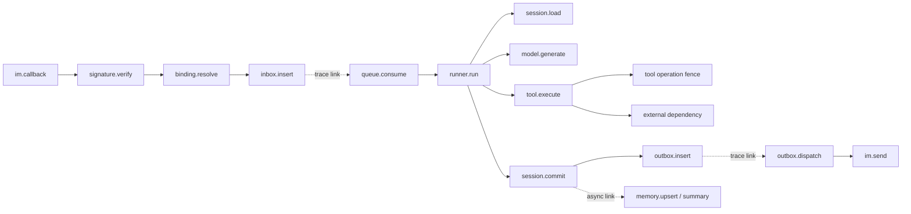
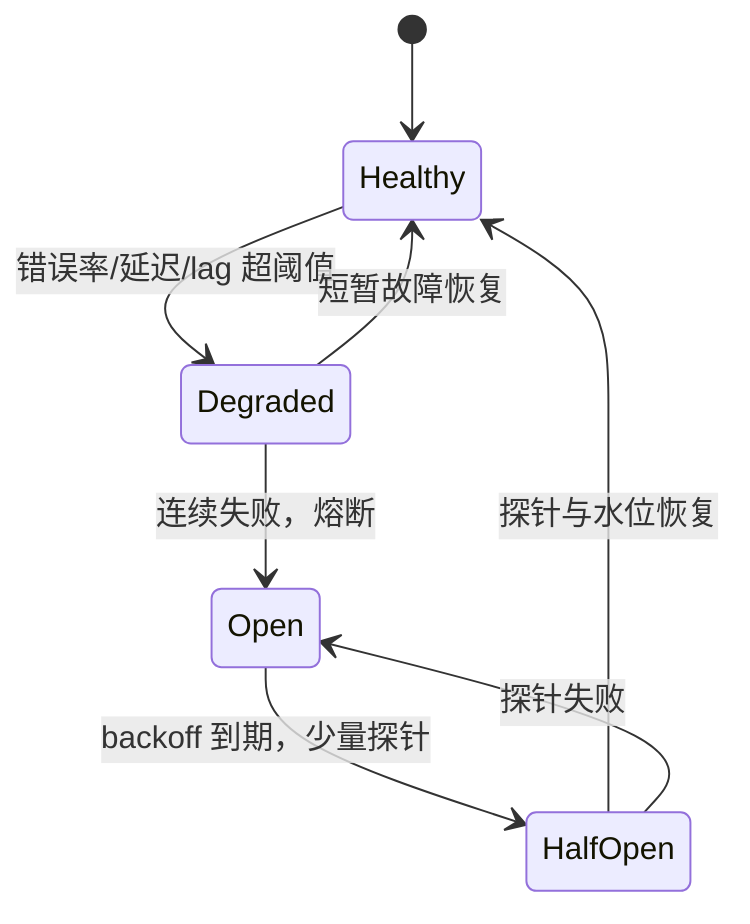

# 治理、安全、可观测与运维设计

本文以“默认拒绝、最小权限、可恢复、可证明”为原则，说明当前最小实现的真实边界和生产强化方案。数据一致性与迁移细节见 [data-consistency.md](data-consistency.md)，IM 协议细节见 [im-adapters.md](im-adapters.md)。

## 1. 信任边界与威胁模型

主要信任边界包括：公网 IM callback → Gateway、Gateway → Queue/Worker、Worker → 模型/工具、Worker → 各数据后端、Admin → 配置控制面、服务 → Telemetry/Audit。重点威胁为：伪造/重放 callback、绑定枚举、跨租户 IDOR、prompt/tool 越权、恶意附件、SSRF、secret 泄漏、重复消息造成重复副作用、陈旧锁写入、配额争抢、日志/trace 暴露 PII，以及配置供应链被篡改。

安全不变量：

1. 先由服务端 binding 确定租户，再验签，再做任何解析后副作用。
2. tenant scope 由平台注入并贯穿队列、Runner、存储、工具、审计；外部参数不能覆盖。
3. 模型提出工具调用不等于授权；执行点必须重新计算有效权限。
4. 原始 secret、私有下载 URL、模型正文默认不进入日志、指标、trace 或错误响应。
5. IM/模型/数据库暂时故障不能驱动系统静默降级到非持久或跨租户共享后端。

## 2. Filter 治理链

### 2.1 当前最小实现

当前治理发生在模型和 Session 调用之前或工具执行点：

| 策略 | 当前行为 | 保证边界 |
| --- | --- | --- |
| IM 用户权限 | binding 的 `allowed_users` 与原始外部用户 ID 精确比较 | 本进程即可判断；未接企业目录/组角色 |
| 输入大小 | 对模型实际收到的正文、群 sender 标注和安全附件元数据按 Unicode rune 计入 `max_input_chars`；附件最多 8 个且 name/MIME/type 分别限长 | 不等于模型 tokenizer；附件字节、下载和病毒扫描仍需独立限制 |
| 请求预算 | Redis 服务端时间驱动的每租户固定 60 秒窗口 RPM；Lua 原子递增与限额判断 | Redis 故障 fail-closed；InMemory 仅测试/demo，不能跨节点共享 |
| 月成本预算 | PostgreSQL 006 用量账本按每个真实 provider 调用预留/结算；固定点 1e-8 USD，按预留时 UTC 月份归属 | 预估仍受动态上下文影响；可靠 usage 才 settle，unknown 不退款并继续占用额度 |
| 工具白名单 | `ToolFilter` 隐藏非 allow 工具，deny 优先 | 只控制可见性，不作为唯一授权 |
| 工具执行权限 | 组合后的 `PermissionPolicy` 在每次调用重验 allow/deny/confirmation，且只在最终 allow 后进入副作用 guard | 覆盖框架动态注入工具，默认拒绝未知工具；工具自身资源级授权仍由后端实施 |
| 危险工具确认 | 一次性 nonce，绑定租户、revision、用户、session、工具和参数 hash，5 分钟过期 | `coordination=redis` 复用共享 Redis、TTL 与原子消费；`inmemory` 才是进程内，Redis 丢失/消费结果不确定时拒绝授权 |
| 工具副作用账本 | `tools.side_effects` 显式分类；tenant/app/session/稳定 turn/config revision/tool/规范参数生成 revision-scoped intent key。最终授权后才 reserve/lease/mark executing，成功结果落 `confirmed`；普通错误、崩溃或结果落账失败停在 `unknown`，只有明确“未应用”的 typed error 可重试 | PostgreSQL Queue 使用 003 持久账本，Memory 模式不跨重启；它是 dispatch fence，不与外部 provider 原子提交，也不能代替 provider 原生幂等键或查询接口 |
| 工具决策与结果观测 | observer 记录 allow/deny/ask、tool_name、参数 hash；side-effect guard 另记录 operation key、phase/state、指标、trace 与审计 | 不保存原始参数、owner、provider response；`unknown` 仍需平台查询、对账或人工 CAS 决议 |
| 敏感信息 | 审计 Reason/Error 脱敏；内容只记 hash；trace 丢弃 LLM 消息正文 | 已增加租户级入模 redact/block 和出站规则 DLP，见 [文本治理与后端指标](privacy-and-storage-metrics.md)；可逆 tokenization/语义 DLP 尚未实现 |

### 2.2 生产 Filter 顺序

```mermaid
flowchart LR
    I[Verified Inbound] --> AUTH[Binding + User/AuthZ]
    AUTH --> SIZE[Size/MIME/Attachment limits]
    SIZE --> RATE[Distributed Rate Limit]
    RATE --> BUDGET[Atomic Cost Reservation]
    BUDGET --> PII[PII classify / redact / tokenize]
    PII --> PROMPT[Prompt Injection Policy]
    PROMPT --> RUN[Runner]
    RUN --> TF[Tool visibility filter]
    TF --> TP[Execution permission policy]
    TP --> CONFIRM[Scoped confirmation]
    CONFIRM --> FENCE[Side-effect lookup / reserve / dispatch fence]
    FENCE --> EXEC[Tool execution]
    EXEC --> FINALIZE[Result hash + confirmed / unknown]
    RUN --> DLP[Output DLP / policy]
    DLP --> OUT[Outbox]
```



有效工具权限计算为：

```text
effective = platform_allow ∩ tenant_allow ∩ actor_role_allow ∩ resource_policy
effective = effective - (platform_deny ∪ tenant_deny ∪ incident_deny)
```

deny 永远优先。工具服务使用租户专属短期凭据，声明副作用等级、超时、最大输出、可重试性和 idempotency 支持；网络通过 egress allowlist，代码/浏览器类工具在独立沙箱运行。资源级授权例如“只能读取本人订单”必须由工具后端根据不可伪造的 actor/tenant claims 实施，不能依赖 LLM 参数。

PII Filter 按租户选择 `block`、`mask`、`tokenize` 或经审批的 `allow`。可逆 token 保存在租户 KMS 加密 vault；送模型前最小化字段，模型输出和工具结果在进入 Outbox 前再做 DLP。审计记录规则 ID、动作和内容 hash，不记录被脱敏正文。

### 2.3 分布式预算

当前实现的职责边界是：Redis 只做共享请求限流，PostgreSQL Queue 数据库只做持久模型用量账本；二者都不可用时分别 fail-closed，不能静默降级到本地计数器或内存账本。

PostgreSQL 预算采用行锁事务做原子 reserve：

1. 以模型上限估算 `reserved_cost`，执行 `spent + reserved + estimate <= limit`。
2. 模型结束按 provider usage 原子 settle，多退少补；实际费用超过预估时保留完整实际费用，不丢失超额。
3. 超时、断流、响应缺失 usage 或费用无法确认转 `unknown`，金额继续计入已用额度，不自动退款；只有确认 provider 请求尚未发出才能 `released`。
4. 设置每分钟请求、并发 run、token/min、工具调用、出站发送和月成本多维限制。

配额 key 包含 tenant 和 UTC billing period，保留账本/审计，不以进程内缓存为事实源。每次实际 provider 调用使用新的 `run_id + call_no`/`call_id`；消息 replay 只读取已持久化结果不扣费，实际 retry/failover/第二次调用生成新记录并计费。结算永远写回调用预留时的原账期，即使跨月完成。

## 3. 密钥管理与脱敏

### 3.1 当前最小实现

- YAML 只保存 `ADMIN_TOKEN`、模型 key、IM token/signing secret、Redis/DB DSN 的**环境变量名**；缺失值在运行时返回错误。
- Telegram secret header 使用常量时间比较；Slack 使用带 5 分钟时间窗的 HMAC；Admin Bearer token 也常量时间比较。
- HTTP helper 不向上返回带 Telegram bot token 的 URL，也把底层网络错误归一成安全文本。
- 审计默认只写 `content_hash`/`tool_args_hash`，Reason 与 ErrorType 经过邮箱、手机号、常见 secret 模式和已配置 secret 值替换。
- `trpc-agent-go` 的 Chat/InvokeAgent/ExecuteTool/Workflow spans 在源端 Drop LLM request/response、输入输出消息、system instruction、tool definitions/arguments/results 与 workflow payload；其中 system instruction 的框架直写路径已改为 policy-aware 并有回归测试。Collector 按框架实际属性名再次删除，并通过 transform 清空 status message 与 exception message/stack。

限制：环境变量对同一进程可见，真正的 Vault/云 Secret Manager 轮换由部署侧 SecretResolver 实现；Telegram token 仍出现在出站 URL，反向代理/access log 必须特别处理；自定义错误文本或第三方 SDK 日志仍需审计。生产配置拒绝共享 Bearer token，改用 OIDC/JWKS 的 viewer/operator/security-admin 角色和 tenant scope；local/demo 才保留单 token 兼容路径。

### 3.2 生产方案

- 使用 Vault/云 Secret Manager + Workload Identity，配置只存不可逆 secret reference 和 version；禁止把 secret 值写回配置 API。
- 每租户/每 binding 独立 token、数据库角色、对象存储前缀和 KMS key；服务账号只读所需 secret。
- 轮换采用 `next` 预热、短期双验签、切 active、撤销 previous 四阶段；模型/API 凭据支持无重启刷新。
- 服务间 mTLS、NetworkPolicy、egress allowlist；Admin 使用 OIDC + RBAC（viewer/operator/security-admin）+ MFA，高风险变更四眼审批。
- Collector、日志 SDK 和错误上报出口做二次 redaction；禁止 query string、Authorization、Cookie、完整 webhook body 和私有文件 URL。
- 对 core dump、profiling、debug endpoint 和 support bundle 做访问控制；备份与审计导出同样加密和按租户授权。

## 4. 指标设计

### 4.1 当前暴露指标

当前 `/metrics` 提供依赖较少的 Prometheus 文本 exporter：

| 指标 | 含义 |
| --- | --- |
| `im_callbacks_total` | callback accepted/invalid_signature |
| `agent_requests_total` | Worker success/error |
| `agent_request_latency_seconds_sum/count` | 端到端 Worker 耗时 |
| `im_delivery_total` | IM 投递 success/error |
| `queue_outbox_attempts_total` | provider operation attempt 的 confirmed/retryable_not_sent/permanent_rejected/unknown |
| `queue_outbox_uncertain_total` | 新增的未知投递结果；必须告警并进入对账/人工决议 |
| `queue_outbox_resolutions_total` | unknown 的 assume_delivered/retry/cancel 人工决议 |
| `queue_depth{component="outbox_uncertain"}` | 当前停车且阻塞 Session lane 的 operation 数 |
| `queue_inbox_legacy_pipeline_total` | 以 `pipeline_schema_version=0` 兼容双事务排空的遗留 Inbox |
| `queue_inbox_pipeline_rejected_total` | 因当前协议格式或 Task/Inbox 元数据漂移而被永久拒绝的 Inbox |
| `queue_inbox_pipeline_blocked_total` | 因未来版本、required 能力暂缺或数据库 identity 不匹配而停放的 Inbox；不消耗死信尝试预算 |
| `queue_inbox_processing_blocked_total` | 因工具结果 unknown、同 intent 执行中或等待 confirmed replay 而停放的 Inbox；与 pipeline rollout 指标分离且不消耗死信尝试预算 |
| `model_tokens_total` | 已结算实际 provider prompt + completion token；replay 不重复增加 |
| `tenant_cost_usd_total` | 已结算实际 usage 成本；每个真实 model call 更新一次 |
| `model_usage_unknown_total` / `tenant_unknown_cost_usd_total` | provider usage/费用未知的调用和其保留金额；unknown 不自动退款 |
| `tool_permission_total` | 工具 allow/deny/ask 决策 |
| `tool_side_effect_operations_total` | 副作用工具 dispatch/confirmed/unknown/replay/resolve 等低基数阶段与结果 |

Exporter 只接受 `tenant/component/result/channel/backend` 标签，主动丢弃 request/user/session/trace ID，避免高基数。`Observe` 当前只有 sum/count，不是可计算 P95/P99 的 histogram。配置 OTLP 后还会初始化 `trpc-agent-go` MeterProvider，把模型 operation duration、TTFT、token usage、Agent 与工具 duration histogram 发往 Collector 的 OTLP metrics pipeline，并由 `:9464` Prometheus exporter 暴露；平台 `/metrics` 与这组框架指标是两个互补出口。

### 4.2 生产指标清单

| 范畴 | 指标建议 |
| --- | --- |
| 请求/IM | callback RPS、验签失败、Inbox duplicate、ACK latency、queue lag、投递 success rate、429、重试/DLQ、outbox age |
| Runner/模型 | run count、first-token/total latency histogram、timeout/fallback、prompt/completion/cache token、provider quota |
| 工具 | calls、permission decisions、duration histogram、timeout/error、sandbox kill、side-effect reconciliation |
| Session/Memory | backend operation latency/error、CAS conflict、lock wait/lost、summary lag、memory visibility/index lag、cache hit |
| 租户成本 | request/token/tool/storage/egress cost、reserved/spent/budget ratio |
| 资源 | CPU、RSS、goroutine、GC、FD、HTTP connections、worker busy、queue utilization |

低基数 label 仅使用 tenant（租户数过大时改用分层/哈希或 exemplar）、channel、provider、model family、tool catalog name、backend、operation、result、revision cohort。具体 request/trace 通过 exemplar 或日志关联，绝不做 label。成本指标以账本为事实源，Exporter 累加值只用于近实时观察。

建议 SLO：

- 已验签 callback 持久 ACK 可用性 ≥ 99.95%，P99 小于平台 deadline 的 30%。
- 非模型依赖的系统错误率 < 0.5%；Outbox 5 分钟内最终投递率 ≥ 99.9%。
- 无未解释的跨租户访问，目标为 0；审计丢失目标为 0。
- P95 完整响应延迟按模型/业务分层定义，不用全租户单一阈值掩盖慢租户。

## 5. OpenTelemetry 链路

当前启动时设置 W3C TraceContext + Baggage；配置 OTLP endpoint 后启动 `trpc-agent-go` trace exporter。Gateway 从 HTTP header 提取 context，入队前注入 carrier，队列 Worker 恢复；显式 span 包含 `im.callback`、`signature.verify`、`worker.process`、`im.send`，Runner/模型/工具可使用框架自身 instrumentation。当前代码没有为 binding lookup、queue publish/consume、每个 Session/Memory Adapter 操作逐一创建平台 span，因此不能声称所有目标节点都已完整观测。

生产目标链路：



跨 durable queue/Outbox 的异步 span 使用原 trace 的 **link**，同时创建新的消费 trace，避免把数小时重试做成一个超长 parent-child trace。传播字段写消息 header，不把 Baggage 中的用户正文传播。允许的 span 属性包括 tenant（可按策略 hash）、channel、revision cohort、backend、operation、result、retry count；禁止 raw user/session、prompt、tool args、token、DSN、文件 URL。对 error trace 尾采样，对成功流量低比例采样，审计日志始终独立保留。

## 6. 审计日志

当前 `audit.Entry` 字段已覆盖赛题要求：

```text
timestamp, tenant_id, channel, binding_id, user_id, session_id,
agent_name, tool_name, decision, reason, latency_ms, error_type,
cost_usd, trace_id, request_id, config_revision,
content_hash, tool_args_hash, operation_key, operation_phase, operation_state
```

用户/Session 是租户作用域的伪匿名 ID；正文和工具参数只存 SHA-256 hash。入站 deny、完整 Agent allow、工具 permission decision 和副作用 operation 状态都有写入路径；operation key 是不含明文参数的 opaque hash。stdout/file Router 使用请求固定 revision 的策略与动态解析的该 revision secret 引用，reload 不会把在途旧请求路由到新 sink；file 权限为 `0600`。SQL sink 使用 008 `audit_records` 追加 hash chain；数据库不可用时只把已脱敏记录写入 `0600` JSONL spool 并 fsync，启动/后台 drain 在数据库提交后删除，损坏行隔离到 `.corrupt`。数据库与 spool 同时失败时 Worker 返回可重试错误，不确认消息完成；replay 使用稳定 audit ID 补写而不重复落账。

生产审计必须包含：事件/工具 call ID、actor 类型、资源 scope、policy/rule version、输入输出 hash、approval ID/approver、工具副作用结果、重试次数和前一记录 hash。008 sink 已提供本地耐久 spool 与 SQL append-only chain；高风险工具对数据库与 spool 双失败 fail closed。中心存储仍应配置 WORM/RBAC/保留期/legal hold，使用链式 hash 检测篡改，并定期对“业务完成数、工具调用数、审计记录数”做对账。

## 7. 故障恢复与降级

### 7.1 原则

降级必须维持隔离与数据正确性。不能因为 Redis/SQL 不可用就自动退到本机 Memory/Session，也不能跨租户复用模型 key、工具凭据或缓存。优先级为：持久接收 → 保持幂等 → 延迟处理 → 明确安全失败；体验优化排在数据安全之后。

| 故障 | 当前最小实现 | 生产检测与处理 | 恢复/对账 |
| --- | --- | --- | --- |
| Gateway 节点退出 | `inmemory` 已 202 任务可能丢；`postgres` 仅在 Inbox 提交后 202 | LB 摘流；持久 Inbox + 多 AZ 副本 | 扫描 accepted/未 dispatch Inbox |
| Worker 节点退出 | `inmemory` 任务丢；Durable lease 过期后按 PostgreSQL 时钟 reclaim；同 DSN strict SQL 组合把 Session/Outbox/Inbox 一次提交，已 committed Turn 的补齐复用 canonical replay | queue attempt fencing、strict Session version/fencing、Inbox owner/attempt/身份/deadline 复核与组合事务已实现；仍需 SIGKILL、网络分区和 COMMIT ACK 不确定演练 | 查 processing/active turn 超时、canonical replay、tool ledger 和 Outbox |
| IM 重投 | claim 去重；pending result 复用 | Inbox 唯一约束；已完成返回 ACK；Outbox 独立重试 | message/outbox ID 对账，未知发送结果人工判定 |
| IM 429/5xx/响应丢失 | `inmemory` 只在整个任务仍安全时重试 typed safe outcome，前序分片已确认则禁止整任务 replay；Durable 解析 Retry-After，429/明确未受理才退避，通用 5xx/网络/畸形成功响应转 unknown 停车 | binding 令牌桶；attempt/resolution ledger；unknown 告警与 CAS 决议；熔断/DLQ | 先查平台 message/request ID 或控制台，再确认、显式接受重复风险重试或取消；禁止全量盲 replay |
| Session DB 短暂不可用 | Process 返回错误，队列短重试后仅记录日志 | 不运行模型；queue NACK/backoff；连接池隔离、熔断；可发持久化的延迟提示 | DB 恢复后按 session 顺序 drain，验证 event sequence |
| Redis 协调不可用/锁丢失 | 请求失败；续约失败会取消 run。InMemory/Redis Session 仍有取消与落库竞态；strict SQL Session 在 Commit 再校验 version/fence | SQL Session 路径已拒绝 takeover 后的陈旧 Handle；与同 DSN PostgreSQL Queue 组合时 Inbox lease owner/attempt/身份/deadline 也直接参与同一 Commit，其他组合没有此保证 | 检测 fence/version/lease conflict，从 committed replay 对账 |
| Memory/向量不可用 | InMemory 不依赖远端；Redis Memory 操作会受 Redis 故障影响 | 对话可标记 degraded 并跳过非关键召回；显式“记住”按策略 fail | durable extraction 重放、检查 watermark/index lag |
| 模型超时/429 | run timeout 默认 90 秒；整体任务可能短重试 | cancellation；只对未产生副作用且错误可重试的调用重试；同等级备用模型/安全模板 | 记录 provider request ID/usage；避免双计费，探针半开 |
| 工具失败 | 只读工具沿 Runner 错误返回；副作用工具在最终 allow 后先写 dispatch fence。成功确认后同一 intent 返回脱敏 replay；普通错误、执行中 lease 过期或确认落账失败转 `unknown` 并阻塞自动重做，明确未应用的 typed error 才转安全重试 | 工具独立超时/熔断；工具后端接收 operation key 作为 provider 幂等键；`tool_side_effect_operations_total` unknown 告警 | 先用 provider 查询接口核实，再通过 tenant-scoped Admin API 做带 expected version/resolution ID 的 confirm、retry_not_applied 或 reject；无查询能力时人工补偿 |
| Audit 后端失败 | SQL sink 失败转入 `0600`、fsync 的本地 spool，后台/重启后 drain；SQL 与 spool 双失败时 fail-closed | 部署侧提供卷加密、WORM 与容量告警 | spool replay 与数量/hash 对账 |
| 配置服务失败 | 使用本进程最近快照 | 使用已验证 last-known-good，有 TTL 和 revision；禁止无配置启动新租户 | 服务恢复后签名校验、差异审计，不盲目覆盖 |

故障状态可统一为：



## 8. 灰度发布与租户级回滚

### 8.1 当前最小实现

`control_plane.backend=postgres` 时，Queue PostgreSQL 的 007 migration 是配置事实源。`POST /admin/v1/reload` 导入 YAML 并创建持久 full release，`POST /admin/v1/tenants/{tenant}/rollback` 创建新的 rollback release；revision、generation、release/event、node ACK 和 heartbeat 都跨重启保留。`LISTEN/NOTIFY` 提供及时刷新，5 秒级轮询在通知连接故障时兜底。`inmemory` 仅供本地/demo/单元测试，生产 PostgreSQL 不可用或迁移校验失败会阻止启动。

发布先等待全部目标节点 `prepared`，再推进 generation；节点应用 active/canary 后写 `applied`，只有全部 applied 才显示 `verified`。稳定灰度使用 `tenant + app + session` 的 SHA-256 分桶；在途 Task 保存完整 revision 快照，refresh/rollback 不改变其路由。节点故障、错误 boot、超时或加载错误不会伪造成功，Admin 以异步 pending/failed 状态返回。

### 8.2 生产发布流程

1. 生成不可变、签名 revision；schema、secret ref、模型连通性、工具权限和迁移兼容性 dry-run。
2. 影子评估固定脱敏数据集，不产生工具副作用和真实 IM 投递。
3. 先内部 tenant，再按 `H(tenant, session_id)` 稳定分桶 1%→5%→25%→50%→100%；同一 session 不跨版本漂移。
4. 每阶段至少覆盖一个业务高峰/约定窗口，检查系统错误、P95/P99、工具 deny/ask 异常、token/成本、内容安全、投递率和人工质量集。
5. 超阈值自动冻结扩量并把 `desired_revision` 原子切回上一版；旧 Runtime、schema、secret previous 和双写路径保留至 drain 完成。
6. 回滚后扫描新 revision 的 Inbox/Outbox/tool ledger，补偿其外部副作用；配置回滚不能自动撤销已发生业务操作。

示例门禁（应按 SLO 配置而非硬编码）：新版本系统错误率较基线增加 >1 个百分点、P95 增加 >30%、每请求成本增加 >25%、IM 投递率低于 99%、任一跨租户/审计完整性告警，立即回滚。模型输出质量采用离线评测和人工抽检，不能只看基础设施指标。

### 8.3 原子流水线滚动发布门禁

Runtime Queue/strict Session 使用不可变 [002_runtime_pipeline.sql](../migrations/002_runtime_pipeline.sql)，副作用工具账本使用追加式 [003_tool_operations.sql](../migrations/003_tool_operations.sql)，后端数据迁移状态使用 [004_data_migrations.sql](../migrations/004_data_migrations.sql)，Artifact 恢复账本使用 [005_artifact_objects.sql](../migrations/005_artifact_objects.sql)，模型用量预算使用 [006_usage_budget.sql](../migrations/006_usage_budget.sql)，配置控制面使用 [007_config_control_plane.sql](../migrations/007_config_control_plane.sql)，Summary/Memory watermark/Audit/迁移对账使用 [008_data_lifecycle.sql](../migrations/008_data_lifecycle.sql)，生产内容安全租约使用 [009_production_safety.sql](../migrations/009_production_safety.sql)。独立 `trpc-migrate` 在共同的 transaction-scoped advisory lock 下按序执行 `ApplyAll` 并登记 SHA-256 checksum；Queue、Session、工具账本、用量账本、控制面、生命周期和内容安全业务启动只执行只读 `VerifyAll`，Artifact 还校验表结构、强制 RLS 与 DML 权限，缺失即 fail-closed，不会使用运行账号补建表。传入 `-config` 时，migrator 会使用只挂载到 Job 的 Artifact `migration_dsn_env` 迁移元数据库，并用 Knowledge `migration_dsn_env` 创建 PGVector extension/表；业务进程只持有各自 `dsn_env`。Compose 以 migration/runtime 两个 DSN 演示职责分离，并清除 runtime 角色的 superuser/createdb/createrole/inherit/bypassrls 及 `PUBLIC` schema/temp create，再显式授予 migration ledger SELECT 和 data-plane DML；Kubernetes 应先完成 migration Job，再发布具备等价最小授权的业务 Pod。生产凭据与授权仍需由 Secret Manager/IaC 管理，不能把 Compose 的本地口令或初始化脚本直接视为生产方案。

推荐顺序：迁移身份执行 `trpc-migrate` 至 `LatestVersion`（当前为 009）→ 发布能读 legacy/v2、识别未来协议且具 side-effect guard 的 reader/Worker → 确认 strict SQL transaction participant、database identity、工具账本、用量账本、配置控制面、Summary jobs、watermark、Audit spool 和 content-safety lease backlog 健康 → 才启用 v2 required/副作用写路径 → 等 legacy backlog 归零后禁用旧 writer。回滚 binary 不回滚 schema，也不得修改已经登记 checksum 的迁移文件。

Redis Session → SQL 的 `trpc-data-migrate` 只能使用一次性、具 004 ledger DML 权限的 `TRPC_AGENT_DATA_MIGRATION_DSN`，不要把该权限授予长驻 Runtime。开始前必须确认所有 Worker 已升级为会读取 coordination Redis tenant freeze 的版本；命令创建的 freeze 无 TTL，所有新任务以 blocked 停放，至少等待三分钟 drain 后才允许复制。每次恢复都会校验 migration ID、tenant、派生 app namespace、源环境变量名、Redis key prefix 和目标环境变量名与 ledger 一致。进入 `cutover` 后先在发布系统部署 SQL 路由，再推进验证；只有 complete/rolled_back 才能解冻。Redis Cluster、零停机双写和旧 Worker 混跑不在当前保证范围内。

发布期间按以下状态处理和告警：

- Task 无 pipeline 且 Inbox 为 `pipeline_schema_version=0`、模式/identity 为空时才是 legacy；允许以“Session Turn 事务 → canonical replay → Inbox/Outbox 事务”的兼容路径排空，观察 `queue_inbox_legacy_pipeline_total` 与 backlog，归零前不得删除兼容 reader。
- v2 required 必须保持 Task/Inbox 元数据完全一致，并让 Queue、Session、事务连接的 database identity 一致。未来 schema version、required 能力暂缺、identity 不匹配应停放并延迟重试，不运行模型且不消耗死信尝试预算；`queue_inbox_pipeline_blocked_total` 持续增长或最老 parked Inbox 超阈值时冻结扩量，修复实例版本/能力/数据库路由后再 drain。
- 部分空字段、非法 mode/identity 组合或当前 v2 的 Task/Inbox 漂移属于不可由滚动部署自行恢复的记录损坏，直接进入 dead letter 并告警；不得通过覆写元数据或降级为 legacy 来“修复”。

真实 PostgreSQL 发布门禁必须显式提供隔离数据库并执行 `TEST_POSTGRES_DSN=... ./scripts/postgres-acceptance.sh`；脚本覆盖 migrations、Queue、Session、用量账本、配置控制面、数据迁移、Artifact、Agent、Worker、工具账本、Memory visibility、SQL Audit 和 Content Safety 共 14 个包，遇到任何 `SKIP`、失败或未执行均返回失败。未配置 `TEST_POSTGRES_DSN` 时集成用例会 skip，该结果不能当作 002–009 migration、同库身份、组合事务、预算账本、配置控制面、生命周期账本、内容安全或 PostgreSQL 工具账本已通过。

2026-09-10 已使用任务专用临时 PostgreSQL 实际执行该门禁：14 个包全部 `PASS`，无 `SKIP`，容器在验收后已清理。

## 9. 容量评估

定义：

- `λ_cb`：峰值 callback/s；`b`：每 callback 平均规范消息数；`p`：验签/过滤后接受比例。
- `λ = λ_cb × b × p`：进入 Worker 的消息/s。
- `T_run`：一次 Runner 的目标 P95 秒数；`C_node`：单节点允许的并发 run；`U`：目标利用率（通常留 20%～40% 余量）。
- `Tin/Tout`：每请求平均输入/输出 token；`Lout`：输出字符；`Lplatform`：平台每段安全长度。

核心公式：

```text
并发中的 run 数          R = λ × T_run                 (Little's Law)
Worker 节点数            N = ceil(R / (C_node × U))
单节点稳态吞吐           μ_node = C_node / T_run
突发队列容量             B >= max(0, λ_peak - N×μ_node) × D_burst × safety
积压清空时间             T_drain = backlog / (N×μ_node - λ_normal)
模型 token/s             Q_token = λ × (Tin + Tout)
每月模型成本             Cost = M × (Tin×Pin + Tout×Pout) / 1,000,000
IM send op/s              Q_im = λ × (ceil(Lout/Lplatform) + edits + uploads)
Redis command/s           Q_redis = λ × (dedupe_ops + lock_ops + renewals + cache_ops)
SQL transaction/s         Q_sql_tx = λ × (inbox_tx + turn_tx + outbox_delivery_tx)
```

`renewals ≈ ceil(T_run / (lock_ttl/3))`。SQL 还需用每事务语句数估算 statement QPS、WAL、索引和连接池；连接数不是越多越好，Worker 通过并发 semaphore 与 DB pool 容量联动。存储容量按原始/规范消息、事件、summary、memory、artifact、审计的日增量 × 保留天数 × 副本/索引/压缩系数计算。

一个仅用于演示计算方法的样例：峰值 `λ=20 msg/s`、`T_run=4s`、`C_node=32`、`U=0.7`，则 `R=80`，至少 `ceil(80/22.4)=4` 个 Worker 节点。若 60 秒突发为 40 msg/s，4 节点理论服务率 32 msg/s，取 safety=2，队列至少 `(40-32)×60×2=960` 条。平均 800 input + 200 output token 时模型配额需至少 20,000 token/s；若平均 1.1 个文本分片，则 IM 出站约 22 op/s，尚未计流式编辑和文件上传。

容量压测必须覆盖：单 hot session（验证排队而非并发写）、多租户公平性、大输出拆包、模型尾延迟、数据库故障恢复、IM 429 和 2 倍预期峰值。HPA 以 busy runs、queue lag、callback RPS 联合扩容，不能只看 CPU，因为模型等待型 Worker CPU 可能很低。

## 10. 部署与运行手册

### 10.1 生产部署验收与故障恢复

生产 Compose overlay 位于 `deploy/compose.production.yaml`，由 HAProxy 接入两个 service 副本，并配套独立 migration/runtime PostgreSQL 凭据、Redis、MinIO、OTel Collector、Jaeger 和 OIDC fixture。Kubernetes 清单使用 RollingUpdate、PDB、节点/区域拓扑约束、`/-/drain` preStop、纯 liveness `/healthz` 和依赖感知 `/readyz`；SecretProviderClass 只提供引用，不把值写入 ConfigMap。

`scripts/production-acceptance.sh` 必须无条件执行节点退出/reclaim、PostgreSQL 断连、提交 ACK 丢失 replay、内容安全租约接管、RBAC、依赖详情、trace 查询和 canary 扫描。任何 `SKIP`、失败、超时或未执行都返回非零，只有脚本成功后才可标记生产部署验收通过。审计 SQL/spool、预算、Session、Outbox、Safety 状态需要逐对象计数/hash 对账；replay 不再次运行模型、不重复扣费，真实 retry 才产生新调用记录。

2026-09-10 的任务专用 Compose 演练已通过：双副本退出/reclaim、PostgreSQL 断连恢复、提交确认丢失 replay、内容安全租约接管、OIDC/RBAC、依赖健康、Jaeger storage 链路和 Secret canary 扫描均成功，`skips=0`、`unexecuted=0`。脱敏 summary：[production acceptance evidence](../evidence/production/summary-trpc-prod-acceptance-2392023385.txt)。

管理端生产模式只接受 OIDC/JWKS：viewer 只读，operator 负责发布/回滚和受限运维，security-admin 才能管理密钥、审计和安全策略；URL tenant 必须落在 token scope 内。SecretResolver 只解析外部引用并 fail-closed，revision、数据库、audit、log、metrics 和 trace 只保存引用、版本或 hash。Collector 和应用共同删除 Authorization、Cookie、DSN、provider 原文、prompt/response/tool 参数；storage span 只允许 backend、operation、tenant hash、revision cohort、result、retry 和耗时等低基数属性。

### 10.1 最小可运行

- 单 `platform` 进程 + mock 模型；InMemory coordination/session/memory/artifact；审计 stdout。
- 可选 Redis coordination/Memory、Redis 或 strict SQL Session，以及 OTel Collector；若启动多个副本，所有运行状态必须使用共享后端，secret 通过环境变量注入。
- `/healthz`、`/readyz`、`/metrics` 和 Admin reload/rollback 可用。

`/readyz` 会在进程进入 drain、队列不可用、控制面未同步、内容安全/审计不可持久化，或生产配置中的 Session/Memory/Summary/Artifact/Knowledge 后端探测失败时返回 503；`/healthz` 只表示进程存活。受保护的依赖详情接口只返回低基数组件状态、epoch、延迟和稳定错误类别，探测同时刷新健康和 `queue_depth` 指标。local/demo 的按需展示租户后端作为可选 degraded 状态，不阻塞零依赖冒烟；production mode 对所有已配置必需后端 fail-closed。单机模式不能通过加 LB 或 sticky session 获得持久高可用。

### 10.2 生产推荐

- Kubernetes 至少两个可用区：Gateway、Worker、Outbox dispatcher、Channel Adapter 各自 Deployment；PDB、反亲和、requests/limits、HPA/KEDA。
- SQL 多 AZ + PITR，durable queue 三副本，Redis HA，向量/对象存储跨区策略按 RPO/RTO 选择。
- `startupProbe` 检查配置/secret 装载；`readinessProbe` 检查能否接收并持久化 Inbox；`livenessProbe` 只判断死锁/事件循环，不因外部 DB 抖动反复杀进程。
- 优雅停机：先 readiness=false、停止新任务、延长/转移 lease、等待在途 run 或到 hard deadline、持久化状态，再退出。
- IaC、镜像签名/SBOM、非 root/read-only rootfs、seccomp、NetworkPolicy、定期漏洞和恢复演练。

### 10.3 告警与首响动作

| 告警 | 首响 |
| --- | --- |
| Inbox/queue lag 持续增长 | 冻结非必要灰度；确认模型/DB/Worker瓶颈；扩 Worker；保护 callback ACK |
| Outbox 429/失败率上升 | 按 binding 熔断/降速；检查 Retry-After/token；禁止全量快速 replay |
| Session CAS conflict/失锁 | 检查分区键和 consumer rebalance；暂停受影响 session；重放并校验事件序号 |
| 成本预算异常 | 冻结高成本模型/工具；检查 token 激增、回环、重试；以账本而非指标估算对账 |
| 审计写失败 | 启用本地 WAL；高风险工具 fail closed；扩容/恢复审计存储后有序 replay |
| 跨租户过滤测试/告警 | 立即隔离相关 backend/版本和撤销凭据；保全证据；按事件响应流程通知与修复 |

每季度至少做节点 kill、DB 30 秒不可用、模型超时、IM 429、secret 轮换、配置回滚和备份恢复演练，并记录实际 RTO/RPO。恢复完成的标准是业务状态、Outbox、工具副作用和审计全部对账，而不只是 Pod 恢复 Running。
