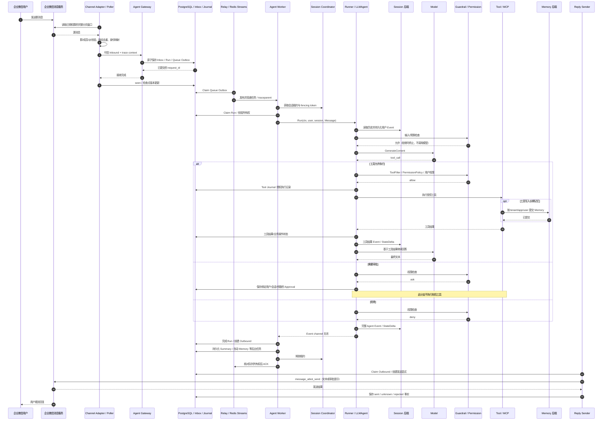

# 核心消息时序

以已实现的企业微信群消息 MCP 为例。Telegram 和企业微信自建应用在接收/发送协议上不同，进入 Gateway 后复用同一链路，见[通道接入](im-channels.md)。

## 1. 企业微信 → Agent → Tool / 存储 → 回复

图中的 Memory 写入是已授权 memory 工具分支；未启用该工具时不会每轮自动写长期记忆。自动提取、Summary 和知识入库由独立 Jobs 执行，不应把“任务已提交”当作“后端已更新”。

审批后用户在原会话发送严格批准/拒绝命令，Gateway 校验绑定、身份、参数与有效期，生成幂等 continuation；模型文字本身不能代替平台审批。副作用工具已有未知结果时不得盲目重跑。

## 2. 其他入站方式

Telegram Webhook 验证 Secret，企业微信自建应用 callback 验签并解密，随后规范化到同一 Inbound。回调必须先持久化，再快速 ACK，不能阻塞等待 Runner。托管消息 MCP 为主动读取，没有加密 callback 或对用户消息的 HTTP ACK。

HTTP 调试入口先执行 Bearer 与租户/Binding/用户授权，不允许冒充 IM Binding。其 202 响应表示可靠接收，不代表模型执行或 IM 投递完成。

## 3. request_id 与 trace_id

request_id 标识逻辑请求及其恢复/去重；trace_id 关联观测链路，两者不能互换。外部 IM 没有可信 W3C context 时由入口创建根 span，Queue Outbox、AgentTask、Outbound 保存传播信息。

Runner、模型、Tool/MCP、Session/Memory/Knowledge、Sender 都继承或关联该 context；审批继续执行可通过 span link 关联原请求。重试与异步处理不能依赖上游 HTTP 请求仍存活。

span 只记录必要类型、耗时、状态和关联 ID，不记录完整输入/输出、用户原文、密钥、数据库 DSN 或 MCP URL。对外 MCP 不传播 baggage。

## 4. 取消、故障和并发

服务根 Context 随 SIGINT/SIGTERM 取消，各角色循环可取消等待并由 errgroup 回收。Runner 的 Event channel 持续消费到关闭，错误事件不应导致消费者直接退出而让发送方永久阻塞。

会话租约和队列所有权丢失会取消执行；旧 Worker 即使恢复也不能提交新 owner 的结果。相同会话的执行由 Coordinator 保护，不依赖 Redis Streams 按会话分区。不同 Worker 可并行处理不同会话。

数据库失败不创建空 Session 降级；任务保留在持久化链路退避恢复。模型/工具超时必须区别是否可能已发生副作用。IM 发送结果 unknown 时停止自动重发，查询业务事实或供应商证据后处理，不把超时误当作回滚。
