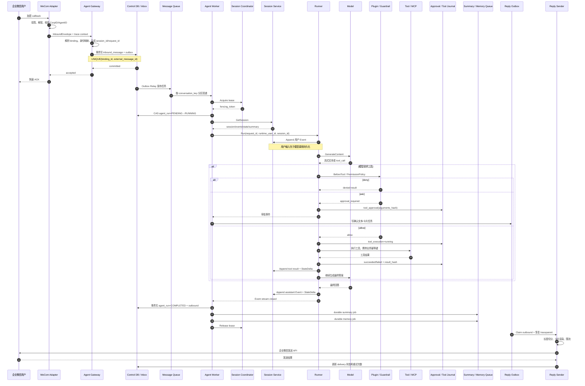

# 核心消息时序

本文是原始生产方案时序，包含计划中的队列分区、卡片和自建应用回调；不是当前每条真实请求的逐步代码记录。当前实际队列为 Redis Streams 消费组，不保证按 conversation 分区；同 Session 依靠 Coordinator 协调。已真实接入的企业微信群采用主动消息 MCP，实际接收/发送顺序见[运行链路](wecom-mcp-runtime.md)，没有加密 callback。当前 Sender 只发文本，不能把图中的卡片渲染视为已实现。

## 1. 企业微信消息完整链路



## 2. trace_id 和 request_id

外部 IM 通常不会携带可复用的 W3C trace context，因此 Channel Adapter 在收到 callback 时创建根 span。`trace_id` 贯穿可观测链路，`request_id` 负责业务幂等，两者不能互相替代。

建议在 context、消息头和任务 payload 中传播以下字段：

```text
trace_id
request_id
tenant_id
app_id
revision_id
channel_binding_id
session_id
runtime_user_id
actor_user_id
fencing_token
```

Worker 调用 Runner 时使用 `agent.WithRequestID`。Tool、Session、Memory、Knowledge、Artifact Router 都从 context 创建子 span；Worker 把当前 `traceparent` 写入 outbound payload，Reply Sender 恢复父上下文后再调用 IM API。跨 Agent Queue 和 Background Job 同样持久化 traceparent。

## 3. 事件消费与流式回复

Runner 返回的 Event channel 必须由一个 goroutine 持续读取到关闭。IM 平台的发送速度不能反向阻塞 Runner，因此 Worker 内部需要一个小型聚合器：

- partial text 合并为较大的 delta；
- tool call、tool result、error 和最终事件单独保留；
- 对不支持流式的通道只保留最终回复；
- 对支持编辑消息的通道按最小更新时间间隔推送预览；
- 传输断开时取消 run context，但继续排空 Event channel。

推荐结构如下：

```go
events, err := r.Run(runCtx, userID, sessionID, msg, opts...)
if err != nil {
    return err
}

for evt := range events {
    accumulator.Consume(evt)
    publisher.TryPublish(evt) // 有界、可合并，不能阻塞事件消费
}
```

客户端断开或 IM 发送失败后，`publisher` 可以停止发送，但 Event 消费 goroutine 仍要运行。取消后超过 drain timeout 仍未关闭时记录错误指标，并由 Worker 生命周期管理器等待或强制回收。

## 4. callback 数据库不可用

如果 Gateway 无法把 inbound message 和 outbox 可靠提交，就不能向 IM 返回成功。应返回协议允许的失败状态，让上游重试。为了降低数据库抖动造成的回调风暴，可以设置短超时、连接池隔离和入口限流，但不能用内存队列替代持久化确认。

如果写入成功但 ACK 丢失，上游会重投相同消息。唯一索引返回已有记录，Gateway 再次返回成功，不创建第二个 Agent run。

## 5. Worker 故障恢复

Worker 取得租约后定期续租。节点崩溃时租约过期，队列任务会被重新投递。新 Worker 先查询 `agent_run` 和 Session Event：

- run 已完成：复用已保存的 outbound reply；
- 已有 terminal Event，但 run 状态未提交：重建结果并补写状态；
- 仅有用户 Event：根据 Agent 类型决定安全重跑或 `WithResume(true)`；
- 已产生副作用工具调用：先查询 tool execution journal，禁止盲目重放；
- 没有任何 Event：重新执行。

旧 Worker 恢复后即使仍持有本地结果，也会因 fencing token 落后而无法提交状态和回复。

## 6. 用户取消

取消请求通过 `request_id` 路由到当前 Worker。若 Runner 实现 `ManagedRunner`，调用 `Cancel(request_id)`；同时把 `agent_run.cancel_requested_at` 持久化，避免取消 RPC 丢失。Worker 收到 context cancellation 后继续排空 Event channel，再根据租户策略决定是否保存已经产生的 assistant partial text。

取消不等于回滚工具副作用。已经提交的外部操作进入补偿或人工对账流程，审计日志记录 `decision=cancel_after_side_effect`。
