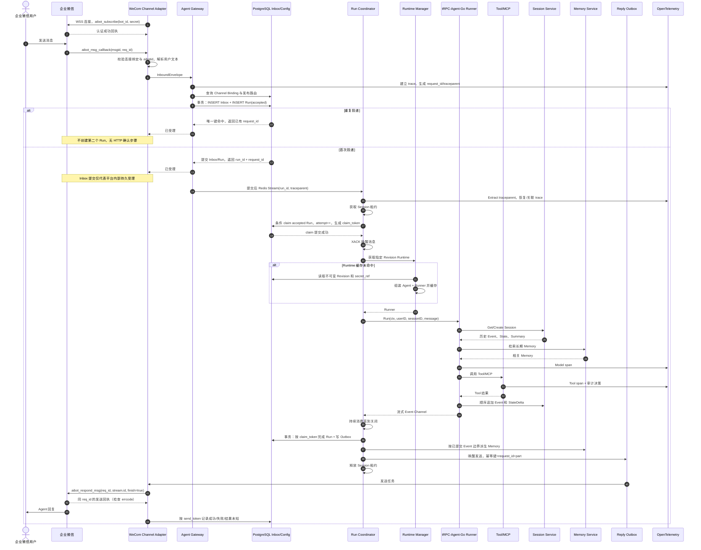
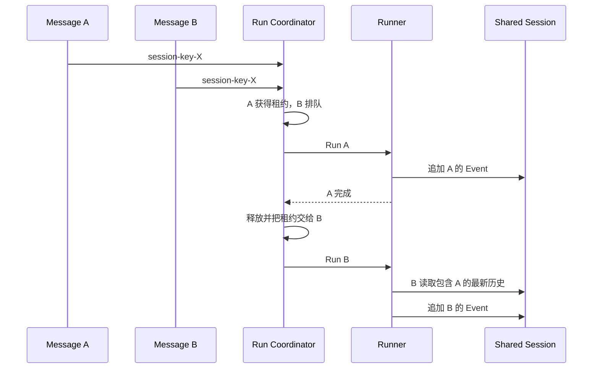

# 核心消息时序

## 1. 企业微信完整链路

以下图示为生产目标架构，含通用 Worker、Redis 唤醒、Memory 和完整 OTel。当前企微与飞书通过公共 Consumer 接通真实 Runner 和 PostgreSQL Inbox/Run/Outbox；正常单聊证据见[实现与验证](acceptance.md#验证结果)。Webhook 的持久受理后 HTTP 确认不能套到企微长连接。

当前运行顺序是：受信任连接的单聊文本 → 静态 Binding/用户映射 → Store.Accept 持久受理 → Tenant/Binding 范围内 ClaimNextRun → 共享 Session Run 获取租约、Pin 和 Runtime → MarkRunStarted → Runner → 排空 Event 并筛选最终文本 → Close Handle → FinishRun 原子写终态与一个 Outbox → 最多一次 `finish=true` 回复 → 记录成功/失败/未知。Memory、Redis 通知及完整 OTel 仍为设计；当前没有实时增量、卡片或媒体回复。

目标设计使 `trace_id` 从 Gateway 传入 Runner、Model、Tool、Session、Memory 和出站 Span，Outbox 持久化 `traceparent`；完整 Trace 传播尚未实现。当前企微 Consumer 生成并持久化 `request_id`，传入共享 Session Run 关联执行；HTTP 使用 `X-Request-ID`。企微 `msgid` 用于去重，`req_id` 只用于回复关联，均不替代平台请求 ID；结果查询、取消接口及成本聚合仍是目标设计。真实样例中的 `sent` 仅证明收到平台 `errcode=0` 回执，不表示用户已读。

## 2. 关键顺序规则

生产目标的一次 Run 按以下顺序处理；当前 Consumer 与第 3、7、8 项的差异分别注明：

1. 长连接认证且机器人账号匹配后才解析租户和身份；Webhook 模式先验签解密。
2. Inbox 提交后才启动 Run。长连接不虚构入站 ACK 或断线回放保证；Webhook 仅在持久受理后返回成功确认。
3. 生产 Worker 获取租约并 claim 后确认 Redis 唤醒；当前 Consumer 先 claim PostgreSQL Run，再经共享 `sessionrun.Start` 获取 Session 租约、Pin 和 Runtime，在剩余预算内等待 Web 租约，成功 MarkRunStarted 后才执行，其后不得 Yield 或第二次调用 Runner。
4. Runner 顺序持久化用户输入、模型输出、Tool 调用和 Tool 结果 Event。
5. StateDelta 与对应 Event 由具体 Session Backend 在同一原子操作中处理；平台不拆开写入。
6. Run 完成后，以当前 `claim_token` 做 CAS，在一个 PostgreSQL 事务内写入终态和 Outbox；迟到的旧 attempt 无权覆盖。
7. 生产目标以已提交 Event 边界触发 Summary 和 Memory 更新；当前企微没有接入这些派生服务。
8. 回复先进入 Outbox，再调用 IM API；生产仅在平台允许时重试发送。当前企微最多一次终态发送，拒绝、未知或目标过期不自动重发，也不重新运行 Agent。

Summary 是派生数据，必须记录输入 Event 边界。旧 Summary 生成任务晚到时，如果其边界小于当前版本，只保存历史版本或丢弃，不能覆盖更新的 Summary。

图中 Memory 为默认异步模式，任务由独立 `derived_jobs` 持久登记并由后台补扫。启用写后可检索模式时，必须在成功完成 Run 和产生成功回复之前等待 Memory/索引达到要求版本，并约束后续读路径，不能只等待 Upsert；条件见[Memory 可见性](storage-and-consistency.md#53-memory)。

## 3. 同一 Session 同时收到两条消息

上图是同 Session 顺序执行的目标示意，不表示租约对象直接传给下一请求。生产队列还需容量和等待上限；当前 HTTP 拿不到租约时返回 `409 session_busy`，企微以 PostgreSQL 受理序逐条执行并先结束前一条回复的发送处理，再执行下一条。

生产 IM 的租约忙、超配额和前序未完成不会转换成发给平台的 HTTP 409；持久延迟记录、XACK 时机、到期补扫和按 `accept_sequence` claim 的条件见[生产调度规则](storage-and-consistency.md#61-入站)。

当前企微 Consumer 已验证同 Session 顺序，以及 Web 占用同一 Session 租约后在预算内等待继续；每次仍须独立获取租约，不提供通用有界队列或跨 Session 并行。租约只在 Run 入口互斥，不阻止旧 Worker 的存储写入，见 [Session Run Lease](session-lease.md)。

## 4. Worker 故障与重试

以下恢复表属于生产目标，包含结果对账和 Redis 唤醒。当前公共 Consumer 只在可信 Tenant/Binding 范围扫描：未启动任务可继续，已启动的中断任务明确失败，不重放模型或 Tool；企微旧连接目标和未知发送终态结束，不承诺跨重启最终送达。恢复策略见 [IM 指南](im-channels.md#恢复与平台限制)。

| 故障点 | 恢复方式 |
| --- | --- |
| PostgreSQL claim 前 | Redis PEL 认领未确认唤醒；扫描器也会重新投递长期 `accepted` 的 Run |
| claim 后、确认尚未启动执行 | Run deadline 扫描器条件检查持久执行开始标记，将未启动的过期 `running` attempt 重置为 `accepted`；旧 `claim_token` 随即失效 |
| Runner 已开始但结果未知 | 先检查完整结果证据；无法确认时终止并记录未知，不自动续跑。无 Tool 或 Tool 可重放本身不足以证明重跑不会重复追加用户历史 |
| Tool 结果未知且不满足重放条件 | Run 以 `tool_outcome_unknown` 失败并进入人工/显式错误处理；不能仅凭 Session 中还只有用户 Event 判断可重跑 |
| Session 已有最终结果、Run/Outbox 未提交 | 从已持久化结果对账并生成 Outbox，不重跑 Agent；终态仍须通过当前 `claim_token` CAS 提交 |
| 回复请求超时、结果未知 | 仅在平台支持时查询状态或使用幂等接口；企微回复引用跨连接有效性未核实，不默认重试成功。目标失效时记录失败，不能改为重跑 Agent |

生产设计中 Redis PEL 只覆盖“Worker 尚未成功 claim PostgreSQL Run”的唤醒窗口，claim 后由 PostgreSQL deadline 扫描器接管。当前专用 Consumer 不使用 Redis PEL、Waker 或通用 Scanner；同数据库对象重建测试不等于真实平台故障验证，也没有实现“已有最终 Session 结果但 Outbox 未提交”窗口的答案重建。

结果重建以完整租户/Session 作用域、持久 `request_id` 和 Event 的 `InvocationID` 为关联依据，并核验完整终态及 Tool 调用/结果配对。上游支持 `agent.WithRequestID` 并在 Event 保留 RequestID，但 InvocationID 由 Runner 创建，不能假设调用前可自行指定。归属、完整性或来源顺序不能证明时保持失败，不拼接不同 Invocation 的结果，也不重新调用 Runner；未来允许同一业务请求多次实际执行前，必须另行建立持久执行级 ID 映射和历史处理契约。当前参考实现仍采用未知执行失败策略。

## 5. HTTP 流式链路差异

HTTP/SSE 不需要 Channel Outbox 才能逐片返回：Worker Event 可以由 Gateway 实时转发给客户端，同时把稳定 Event 写入 Session。客户端断开时由策略决定取消 Run或转为后台运行；无论哪种方式，都必须取消无主 goroutine，并允许客户端使用 `request_id` 查询最终状态。
