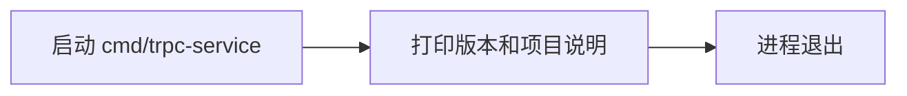
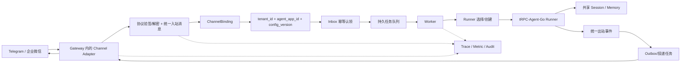
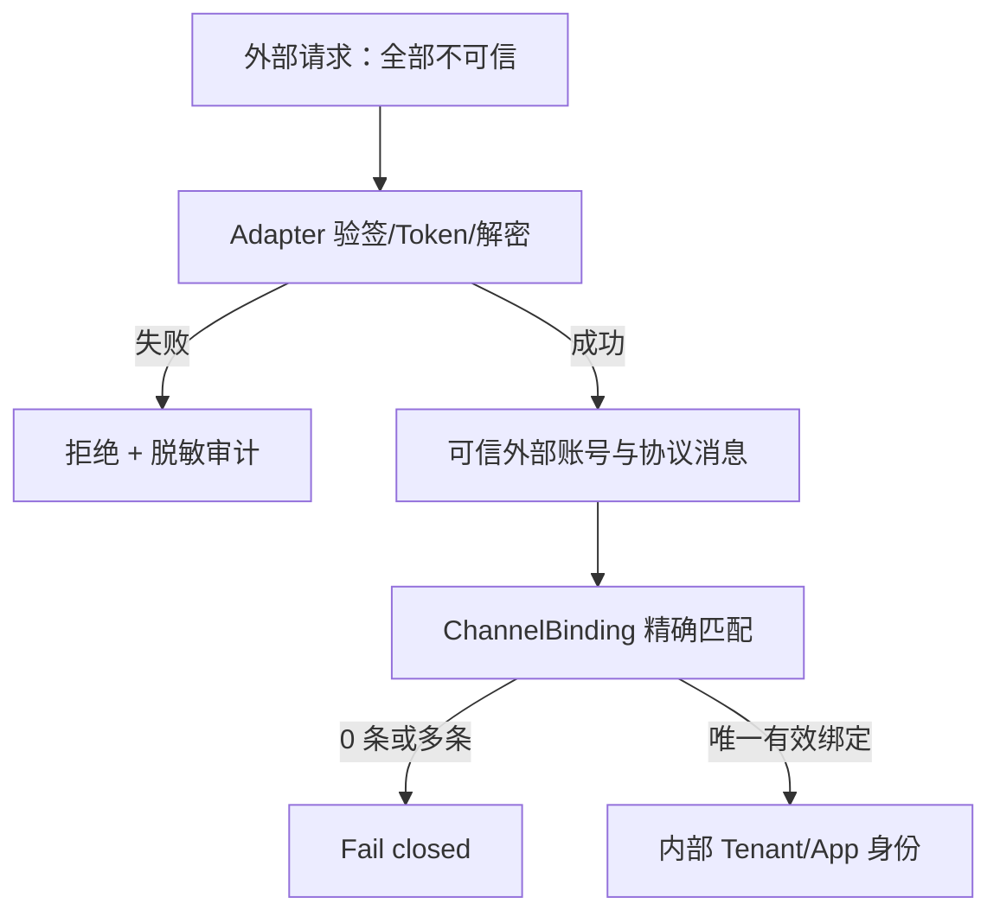

# 阶段 0：平台主链路与契约草案

> 核对日期：2026-08-24  
> 性质：阶段 0 架构草案，接口名称和字段可在实现前调整

## 1. 现状流程

当前仓库没有消息处理链路：



`trpcservice/*` 只有包注释，没有 IM、Gateway、Worker、Runner、Session/Memory、存储或 Web UI 实现。

## 2. 目标主链路



Channel Adapter 跟随 Gateway，Worker 不直接持有 Telegram token 或企业微信 callback handler。Worker 输出平台统一出站事件，再由 Gateway 侧渠道发送器完成实际投递。这样可以把渠道限流、凭据、重试和 SDK 依赖留在可信入口边界。

### 一条消息的顺序

1. Adapter 从可信 HTTP 路由、polling client 或 callback 配置确定渠道外部账号。
2. Adapter 完成协议验签/解密，再把平台负载转换为统一入站消息。
3. Gateway 通过 ChannelBinding 得到唯一的 `tenant_id + agent_app_id`；外部负载中的同名字段一律不可信。
4. Gateway 以候选唯一键原子认领 Inbox，并把已发布的精确 `config_version` 固化到任务。
5. 任务持久化成功后，Gateway 按渠道协议及时确认 callback/polling offset。
6. Worker 认领任务，选择/创建目标 Runner，调用 `Runner.Run` 并持续消费 Event channel。
7. Session/Memory 只写共享后端；Worker 本地缓存不是唯一业务状态。
8. Worker 将 progress/partial/final/error 转为统一出站事件并持久化投递状态。
9. Gateway 渠道发送器按能力聚合、编辑或拆分消息，执行限流和重试。
10. “Agent 已执行”和“渠道已送达”分别记录；投递失败不能默认重跑 Agent 或副作用 Tool。

## 3. 信任边界



以下字段不得直接由浏览器、Telegram 消息、企业微信明文内容或自定义 HTTP Header 决定：

- `tenant_id`；
- `agent_app_id`；
- `config_version`；
- 后端配置或 credential reference；
- 工具白名单和权限。

即使 Web UI 让用户选择“租户/Agent”，浏览器提交的也应是一个预置模拟渠道账号或短期绑定令牌，服务端仍通过 ChannelBinding 解析真实内部身份。

## 4. 统一入站消息契约

下面是语义草案，不是阶段 0 要提交的 Go 代码：

```go
type InboundMessage struct {
    Channel           string
    ExternalAccountID string
    PlatformMessageID string
    ExternalUserID    string
    ConversationID    string
    ConversationType  string // direct, group, thread
    ThreadID           string
    EventType          string // message, edit, callback, etc.
    Text               string
    Attachments        []InboundAttachment
    ReplyToMessageID   string
    OccurredAt         time.Time
    ReceivedAt         time.Time
    Metadata           map[string]json.RawMessage
}

type InboundAttachment struct {
    PlatformFileID string
    Kind           string // image, file, audio, video
    FileName       string
    ContentType    string
    Size           int64
    DownloadRef    string // 内部短期引用，不暴露渠道凭据
    Checksum       string
}
```

约束：

- `Channel` 使用平台枚举，不接受任意自由文本。
- `ExternalAccountID` 必须来自已验证的 Adapter 配置/路由上下文，不只信任消息体。
- `PlatformMessageID` 必须采用渠道稳定重投 ID。某类事件没有 ID 时，Adapter 应按官方稳定字段生成确定性指纹，不能每次随机生成。
- 原始 metadata 只保留排障和协议转换真正需要的字段，设大小上限，并在日志/审计前脱敏。
- 附件先保存平台 file ID 或内部短期引用；下载需有大小、类型、超时和恶意内容限制。
- 租户身份不属于 InboundMessage 的外部协议字段。绑定解析后可生成单独的 `ResolvedInbound`，避免混淆信任级别。

建议解析后的内部信封增加：

```text
channel_binding_id
tenant_id
agent_app_id
config_version
inbox_id
trace_id
actor_user_id
runner_user_id
session_id
```

## 5. 统一出站消息契约

```go
type OutboundMessage struct {
    DeliveryID        string
    ChannelBindingID  string
    ConversationID    string
    Kind              string // progress, partial, final, error
    Sequence          int64
    Text              string
    Attachments       []OutboundAttachment
    ReplyToMessageID  string
    CorrelationInboxID string
    IdempotencyKey    string
    Metadata          map[string]json.RawMessage
}

type OutboundAttachment struct {
    Kind        string
    FileName    string
    ContentType string
    SourceRef   string // 平台内部对象/临时文件引用
    Size        int64
}
```

约束：

- `DeliveryID` 标识一次投递记录，`IdempotencyKey` 防止渠道重试造成重复发送。
- partial/progress 是能力提示，不保证每个 IM 原样支持。Adapter 可以聚合、编辑上一条消息、按节流窗口更新，或只发送 final。
- 文本长度、Markdown/HTML、图片/文件大小和 reply 语义由 Adapter 做渠道降级。
- 出站 metadata 不能成为绕过 ChannelBinding 或替换 credential 的入口。
- final 已生成但发送失败时，只重试投递；除非明确证明 Agent 执行无副作用且无结果持久化，否则不重跑 Runner。

## 6. ChannelBinding 草案

最小字段：

```text
id
channel
external_account_id
external_scope_id       # 可选：特定群/空间；首版可只做账号级绑定
tenant_id
agent_app_id
credential_ref
status                  # active, disabled
version
created_at / updated_at
```

查找规则：

1. 先由已验证 Adapter 得到 `channel + external_account_id`，必要时加受信的外部 scope。
2. 必须恰好匹配一条 active binding。
3. 0 条表示未知绑定；多条表示配置冲突；两者都 fail closed。
4. `credential_ref` 只指向密钥管理系统，不把 token/secret/AESKey 放入任务、日志或普通配置表。
5. 一个外部账号若要服务多个租户，必须设计明确的、已验证的 scope 绑定规则；不能读取用户正文中的 `tenant_id` 路由。

建议唯一约束从简单场景开始：

```text
UNIQUE active (channel, external_account_id, external_scope_id)
```

## 7. Inbox 幂等与状态草案

候选唯一键：

```text
tenant_id + channel_binding_id + platform_message_id
```

`channel_binding_id` 已能间接确定租户，但保留 `tenant_id` 有利于分区、审计和防御性校验。最终建表时应确保 binding 的 tenant 与键中的 tenant 一致。

建议状态分离：

```text
received
  -> enqueued
  -> processing (worker_id + lease_until + attempt)
  -> executed
  -> delivery_pending
  -> completed

失败分支：retry_wait / failed_terminal / dead_letter
```

关键语义：

- 唯一键和首次认领必须原子化；先查再写会产生并发重复。
- callback 应在“消息已持久并可继续处理”后尽快响应，不等待模型执行。
- 相同平台消息重复到达时返回协议允许的成功确认，并引用现有 Inbox，不创建第二次执行。
- Worker 使用有期限租约；只有租约过期且状态允许时才能被另一 Worker 接管。
- 执行结果和投递结果分开。`executed` 后只重试 Outbox，不回到 `processing`。
- 乱序消息需按渠道时间和同 Session 序列处理；首版至少要对同 Session 串行认领或使用版本条件写入。

## 8. UserID 与 Session ID 规则

外部 ID 不直接作为数据库主键或框架全局 ID。建议使用带版本的 HMAC/不可逆规范化：

```text
actor_user_id = hmac(v1, channel_binding_id | external_user_id)
```

### 单聊

```text
runner_user_id = actor_user_id
session_id = hmac(v1, channel_binding_id | direct | conversation_id | thread_id)
```

同一用户跨渠道、跨绑定默认是不同身份和不同 Session。只有经过显式、审计过的账号合并流程才能合并，不能靠昵称或手机号猜测。

### 群聊/话题

tRPC-Agent-Go 的 Session key 同时包含 `UserID + SessionID`。如果群里每个发送者都把自己的 actor ID 传给 Runner，即使 SessionID 相同，也会形成不同 Session。因此共享群上下文建议：

```text
runner_user_id = hmac(v1, channel_binding_id | group-principal | conversation_id)
session_id = hmac(v1, channel_binding_id | group | conversation_id | thread_id)
actor_user_id = 当前真实发送者，放入受控 RuntimeState/审计，不替代 runner_user_id
```

这意味着首版群聊中的框架 Memory 也是“群主体”作用域，而不是每个成员的私人 Memory。若以后要求“共享群 Session + 个人 Memory”，需要增加经过审查的 Memory 作用域设计，不能悄悄复用同一个 Runner userID。阶段 0 已确认首版明确：单聊使用个人 Session/Memory，群聊使用群级 Session/Memory，工具权限仍按 actor_user_id 校验。

## 9. 组件职责边界

| 组件 | 负责 | 不负责 |
| --- | --- | --- |
| Channel Adapter | SDK/协议、验签解密、消息转换、渠道错误分类、限流与格式降级 | 租户自报身份、Agent 执行、Session/Memory |
| Gateway | ChannelBinding、Inbox、任务固化、快速 callback、Outbox 渠道投递、入口 Trace | 模型/Tool 执行、保存唯一会话状态 |
| Worker | 任务租约、Runner 选择、Event 消费、统一出站事件、执行审计 | 直接监听 IM callback、持有渠道明文凭据、保存唯一 Session |
| Runner 管理器 | 按确认方案创建/缓存/排空 Runner，管理后端资源引用 | 解析外部租户身份、消息去重 |
| tRPC-Agent-Go Runner | Agent 调用、Event、Session/Memory 框架交互、context 取消 | ChannelBinding、跨 Worker 任务租约、IM 投递 |
| Session/Memory 后端 | 跨 Worker 共享状态和持久化 | 判断渠道可信身份、消息投递 |
| Admin/配置层 | Tenant/AgentApp/Binding/配置版本发布与回滚 | 在请求中临时覆盖未发布配置 |
| Telemetry/Audit | 全链路 trace、租户指标、脱敏审计 | 存储密钥或完整敏感内容 |

## 10. Fail-closed 矩阵

| 场景 | 行为 |
| --- | --- |
| 验签/解密失败 | 拒绝，不创建 Inbox；记录脱敏安全审计 |
| 未知或冲突 ChannelBinding | 拒绝处理，不回退默认租户/App |
| 平台消息 ID 无法稳定生成 | 不进入普通执行；记录协议错误，避免无法幂等 |
| Inbox/队列不可用 | 不假装已接收；按渠道协议返回可重试结果或保持 offset 未提交 |
| 未知 Agent App/配置版本 | 任务失败关闭，不自动使用“最新”或其他 App |
| Session/Memory 后端不可用 | 不降级到 Worker 本地 InMemory；按策略重试/终止 |
| Runner 创建冲突或密钥不可用 | 不创建半配置 Runner，不执行工具 |
| Worker 租约丢失 | 停止继续产生副作用，取消 context，并由协调层判定是否接管 |
| Agent 已执行、IM 发送失败 | 保留执行结果，只重试 Outbox 投递 |
| Attachment 超限/类型禁止 | 拒绝该附件或整条消息，给出渠道可展示的安全错误 |

## 11. Trace、审计和敏感信息

同一 `trace_id` 应串联：

```text
IM receive -> verify/decrypt -> binding -> inbox claim -> enqueue
-> worker claim -> runner -> model/tool -> session/memory
-> outbound persist -> channel send
```

审计至少记录：`tenant_id`、`channel_binding_id`、`inbox_id`、`agent_app_id`、`config_version`、`actor_user_id`、`runner_user_id`、`session_id`、`tool_name`、`decision`、`latency`、`error_type`、`cost`、`trace_id`。

禁止记录：Bot token、CorpSecret、AESKey、模型 API key、数据库密码、完整 Authorization、可直接下载的长期附件 URL。用户正文和附件 metadata 是否记录必须由租户审计策略控制并做脱敏/保留期限制。

## 12. 阶段 0 已确认项与后续技术项

- Runner 已确认采用每个 Worker 按 `tenant_id + agent_app_id + config_version` 的有界本地缓存；目标图中的 Runner 管理器仍需阶段 1 实现。
- Gateway/Worker 队列可选 Redis Streams 或其他持久机制，阶段 0 不锁定。
- Inbox/Outbox 最终落 Redis、SQL 或组合方案需结合一致性和演示复杂度决定。
- 企业微信首版协议已确认按内部自建应用验证；绑定锚点和消息 ID 字段仍要随 SDK Spike 细化。
- 群聊首版已确认使用群级 Session/Memory，真实 actor 仅用于权限和审计；个人 Memory 不纳入首版承诺。
- 流式回复如何在每个渠道降级，需要最终 SDK Spike 后确定。
