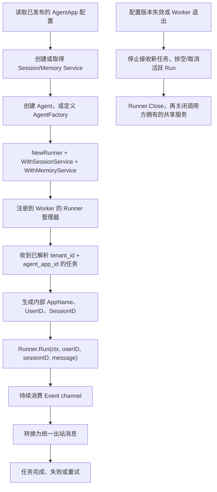

# 阶段 0：仓库与 tRPC-Agent-Go 基线

> 核对日期：2026-08-24  
> 性质：调研结论，不包含生产功能实现  
> 当前实施仓库：`D:\project\OpensourceTencent\trpc-agent-service`

## 1. 范围结论

阶段 0 只回答五个问题：当前仓库有什么、还缺什么、tRPC-Agent-Go 如何真实接入、IM SDK 有哪些可行候选、Runner 生命周期应该如何选择。本阶段不引入依赖，不修改服务仓库 `go.mod`，不实现 Gateway、Worker、IM Adapter、Redis、SQL 或 Web UI。

OpenClaw 已排除为本项目的直接 API 依赖。它只用于参考 Telegram 分层、插件注册、消息转换、附件处理和重试思路；平台必须定义自己的 Channel Adapter 和统一消息契约。

## 2. Git 与依赖基线

| 项目 | 当前值 |
| --- | --- |
| 分支 | `main`，跟踪 `origin/main` |
| HEAD | `aa000c8 Clarify that the listed code layout is only an example.` |
| origin | `https://github.com/Spock12138/trpc-agent-service.git` |
| upstream | 尚未配置 |
| module | `github.com/liuzengh/trpc-agent-service` |
| `go` 指令 | `1.21` |
| 已声明依赖 | 无 |
| tRPC-Agent-Go | 尚未写入服务仓库 `go.mod` |

工作区存在用户已有的未跟踪文档和阶段 0 工作记录。后续不得使用会误纳入或删除这些文件的批量 Git 操作。

### tRPC-Agent-Go 版本事实

浏览器查看的仓库地址和 Go 引用路径不同：

```text
GitHub 仓库：https://github.com/trpc-group/trpc-agent-go
Go module：  trpc.group/trpc-go/trpc-agent-go
```

截至 2026-08-24，Go module proxy 返回的最新稳定标签为 `v1.11.2`，发布时间为 2026-08-20，模块声明最低 Go 版本为 1.21。阶段 0 推荐后续开发锁定：

```text
trpc.group/trpc-go/trpc-agent-go v1.11.2
```

本阶段仅验证信息，没有在服务仓库执行 `go get`。进入实现阶段后应先重新运行：

```bash
go list -m -versions trpc.group/trpc-go/trpc-agent-go
go get trpc.group/trpc-go/trpc-agent-go@v1.11.2
```

若重新查询时出现更新版本，应先检查 release notes、Go 版本和 API 变化，不能自动漂移到新版本。

## 3. 当前仓库真实能力

| 位置 | 当前能力 | 判断 |
| --- | --- | --- |
| `cmd/trpc-service/main.go` | 打印版本与项目说明，支持简单 `-h` | 可编译的 CLI 骨架，不是服务 |
| `trpcservice/version.go` | 静态版本字段 | 占位能力 |
| `trpcservice/agent` | 包注释 | 未创建 Agent 或 Runner |
| `trpcservice/channels` | 包注释 | 未实现统一消息或 IM Adapter |
| `trpcservice/config` | 包注释 | 未实现配置加载、校验或版本化 |
| `trpcservice/tenant` | 包注释 | 未实现 Tenant、AgentApp、ChannelBinding |
| `trpcservice/metrics` | 包注释 | 未接入 Metrics 或 Trace |
| `trpcservice/log` | 包注释 | 未实现脱敏日志 |
| `trpcservice/tool`、`skill`、`workspace`、`web` | 包注释 | 均为占位 |
| 启停与质量脚本 | 基础 shell 脚本 | 尚未证明 Windows/容器/生产部署可用 |
| `docs/README.md` | 文档目录提示 | 尚无架构、时序、数据模型或风险文档 |

基线命令结果：

- `go test ./...`：通过，但所有包均为 `[no test files]`。
- `go build ./...`：通过。

这两个结果只证明当前骨架能编译，不证明题目中的任何业务能力已经完成。

## 4. 当前缺口与目标差距

### 4.1 运行链路缺失

- 没有可调用的真实 tRPC-Agent-Go Agent/Runner。
- 没有 HTTP、IM callback 或队列入口。
- 没有 Gateway/Worker 启动角色、任务协议和故障接管。
- 没有统一入站/出站消息，也没有流式 Event 到渠道回复的转换。

### 4.2 多租户与数据缺失

- 没有 Tenant、AgentApp、配置版本、ChannelBinding 和外部用户映射。
- 没有可信租户解析；也没有未知绑定或冲突配置的 fail-closed 行为。
- 没有 Inbox 幂等、Session ID 规则、任务租约或重试状态。
- 没有 Redis、SQL、共享 Session/Memory 或数据迁移边界。

### 4.3 IM、治理与运维缺失

- 没有 Telegram 或企业微信 SDK/协议实现。
- 没有验签、解密、限流、消息长度处理、附件、回复失败重试。
- 没有工具白名单、审计、脱敏、Trace、指标或成本记录。
- 没有 Web UI、Compose、多 Worker 演示或故障验证。

因此，后续工作属于从骨架建立最小真实平台，不是在已有平台上做局部补丁。

## 5. tRPC-Agent-Go 真实 API

### 5.1 已编译验证的入口

阶段 0 在独立临时模块中编译验证了以下 API，未修改服务仓库 `go.mod`：

```go
runner.NewRunner(appName, agent, opts...)
runner.NewRunnerWithAgentFactory(appName, defaultAgentName, factory, opts...)
runner.WithSessionService(sessionService)
runner.WithMemoryService(memoryService)
sessioninmemory.NewSessionService()
memoryinmemory.NewMemoryService()
runner.Close()
```

`runner.Runner` 的核心接口为：

```go
Run(ctx, userID, sessionID, message, runOptions...) (<-chan *event.Event, error)
Close() error
```

`Run` 返回 Event channel，调用方必须持续消费到关闭，并在请求取消、模型超时或进程退出时正确传播 `context.Context`。平台层负责把 Event 转换成进度、流式片段、最终回复或错误。

### 5.2 AppName 与状态键

Runner 构造时接收默认 `appName`。单次 `Run` 也可通过 `agent.RunOptions.AppName` 覆盖有效 AppName。有效 AppName 会用于 Session key、Memory key 和事件过滤命名空间。

```text
session.Key = AppName + UserID + SessionID
memory.Key  = AppName + UserID + MemoryID
```

平台不能只在外围保存 `tenant_id`，还必须保证框架内部使用的 AppName 是稳定且租户隔离的命名空间。建议平台生成不可由外部请求直接指定的值，例如：

```text
tenant/{tenant_id}/app/{agent_app_id}
```

### 5.3 Session 与 Memory 接口宽度

`session.Service` 不只是“读写聊天记录”，还覆盖：

- Session 创建、读取、列举和删除；
- App、User、Session 三个层级的 State；
- Event 追加；
- Summary 创建、异步任务和读取；
- `Close` 生命周期。

`memory.Service` 不只是简单 KV，也覆盖：

- Memory 增加、更新、删除、清理和搜索；
- Memory Tools；
- 自动 Memory 异步任务；
- `Close` 生命周期。

这正是旧“路由 Wrapper”方案成本较高的源码依据：Wrapper 需要完整、持续地代理这些方法和未来扩展能力。这里不把“AppName 一定会漏传或错传”当作已证实缺陷。

### 5.4 Runner 生命周期与并发

- Runner 内部维护运行中的请求，并用锁保护运行表；源码显示其设计目标包含并发 Run 和按 RequestID 取消/查询。
- `Close` 可重复调用，会取消该 Runner 中的活跃运行并关闭插件。
- Runner 只关闭它自己创建的 SessionService；通过 Option 传入的服务由调用方拥有并负责关闭。
- MemoryService 等外部传入服务也不能假定由 Runner 自动关闭。
- 框架提供 `NewRunnerWithAgentFactory`，可在每次 Run 时按请求创建 Agent；它能降低启动时重对象初始化，但不自动解决平台的配置缓存、服务连接复用和淘汰问题。

“可以并发调用”仍应在本项目选定 Agent、Plugin、Tool 和后端后执行 `go test -race` 与并发压力验证；阶段 0 不把源码设计意图扩大为所有组合都已证明线程安全。

## 6. 框架与平台职责边界

| 能力 | 直接使用框架 | 平台必须新增 |
| --- | --- | --- |
| Agent 编排 | Agent、LLMAgent/GraphAgent、Tool、Plugin | AgentApp 注册、配置发布、租户工具权限 |
| 执行 | Runner、Event channel、context 取消 | Runner 选择/缓存、任务超时、Event 到统一回复 |
| Session/Memory | Service 接口及具体后端 | 租户级后端选择、共享实例生命周期、迁移与隔离 |
| Telemetry | 框架已有 span/指标能力 | 从 IM 到回复的 trace 串联、租户审计与成本维度 |
| IM | 不依赖 OpenClaw API | 自有 Adapter、SDK 包装、验签、绑定、幂等、重试 |
| 多节点 | 无状态执行所需基础接口 | Gateway/Worker 协议、任务租约、故障接管、部署 |

## 7. 创建与调用流程



## 8. Go 最低版本建议

阶段 0 建议继续使用 Go 1.21 作为最低版本：

- 当前服务仓库声明 Go 1.21；
- tRPC-Agent-Go `v1.11.2` 声明 Go 1.21；
- 当前优先 Telegram 候选声明 Go 1.18；
- 当前企业微信主要候选声明 Go 1.16。

本机 Go 版本更高不构成提升项目最低版本的理由。进入阶段 1 引入全部确认依赖后，必须用 Go 1.21 工具链或 CI/容器实际构建一次，才能最终确认最低版本；若最终 SDK 改变，则重新计算。

## 9. 阶段 0 风险记录

- GitHub 页面可访问，但本轮 GitHub REST API 曾出现连接关闭，搜索页出现 secondary rate limit；版本和 module Go 要求以 Go module proxy 为主要依据，README 与许可证通过仓库页面交叉核对。
- 当前编译 Spike 只证明核心构造 API 可导入，不包含真实模型调用、并发、共享后端或 Event 排空测试。
- 企业微信是多个不同协议的集合，在接入类型确认前不能声称 SDK 已覆盖最终需求。
- Runner 和 IM SDK 方向已于 2026-08-24 确认；本文仍不能替代阶段 1 的依赖 Spike、版本复核和生产实现规格。

## 10. 参考来源

- [tRPC-Agent-Go GitHub](https://github.com/trpc-group/trpc-agent-go)
- [tRPC-Agent-Go Go package](https://pkg.go.dev/trpc.group/trpc-go/trpc-agent-go)
- 本地只读源码：`runner/runner.go`、`agent/invocation.go`、`session/session.go`、`memory/memory.go`
- 服务仓库 `README.md`、题目、交接摘要和旧工作区施工计划
