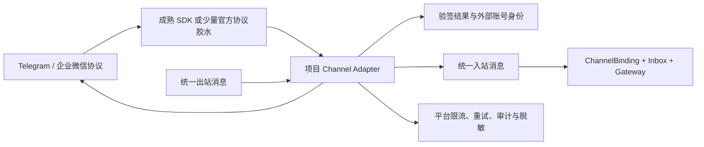

# 阶段 0：IM SDK 候选对比

> 核对日期：2026-08-24  
> 本阶段完成选型确认，不引入 SDK  
> 目标渠道：Telegram + 企业微信（首版企业微信按内部自建应用验证）

## 1. 选型原则

SDK 只负责降低对接平台底层 API 的成本，不负责平台自己的多租户、安全和可靠性。候选统一按以下条件判断：

- 维护状态、稳定标签和许可证；
- 最低 Go 版本是否兼容项目 Go 1.21；
- 收发文字、图片、文件和事件的能力；
- Telegram polling/webhook 或企业微信 callback 的覆盖；
- 验签、解密、API 错误、限流与重试支持；
- 能否替换 HTTP Client/endpoint，是否方便 `httptest` 和 Mock；
- 是否暴露公共 API，是否强绑定某种运行时；
- 转换为平台统一消息的复杂度和未来替换成本。

维护活跃度不能只看 Star 数。本次优先采用稳定标签、module 元数据、README 能力和仓库维护声明；GitHub REST API 曾出现连接关闭和限流，因此没有把精确 Star 数或“最近一次 commit 时间”写成稳定结论。

## 2. Telegram 候选

| 候选 | 稳定版本 / Go | 许可证 | 收发与运行方式 | Mock/替换能力 | 结论 |
| --- | --- | --- | --- | --- | --- |
| `github.com/go-telegram/bot` | `v1.23.0` / Go 1.18 | MIT | README 标明覆盖 Bot API 10.2；支持长轮询、Webhook、handler、middleware、worker；Bot API 方法覆盖完整 | 支持自定义 `http.Client`，可用自定义 `RoundTripper` 或 `httptest.Server`；业务 handler 可独立测 | **首选候选**。API 新、运行分层完整，与项目 Go 1.21 兼容 |
| `github.com/go-telegram-bot-api/telegram-bot-api/v5` | `v5.5.1` / Go 1.16 | MIT | 成熟的 Bot API wrapper；README 有 `GetUpdatesChan` polling 和 webhook 示例；文字、媒体和文件 API 齐全 | 支持自定义 Client/API endpoint，容易做 HTTP 假服务；上层 handler/worker 需项目组织 | **备选候选**。使用广、简单，但最新稳定 tag 相对旧，平台需要自己补更多运行层结构 |
| `github.com/mymmrac/telego` | `v1.11.2` / Go 1.25.7 | MIT | 完整 Bot API、长轮询、Webhook，支持替换 HTTP 实现 | 可测试性好，生成式 API 较完整 | **当前不采用**。最低 Go 版本高于项目和 tRPC-Agent-Go 基线，升级成本没有阶段 0 已知收益 |

### Telegram 推荐

推荐在审阅后以 `github.com/go-telegram/bot` 做第一个编译和契约 Spike，`telegram-bot-api/v5` 保留为备选。推荐不是因为平台责任可以交给 SDK，而是因为它同时提供较新的 Bot API 覆盖、polling/webhook、middleware/handler 和可替换 HTTP Client，适合做薄 Adapter。

进入实现前仍要验证：

- `Update` 到统一入站消息的文字、照片、文档、reply、群组和 topic 映射；
- webhook secret/token 校验能力与项目自己的入口鉴权如何组合；
- Bot API `retry_after`、429、5xx 和网络错误如何转为统一可重试错误；
- polling 退出时 goroutine、HTTP 请求和 handler worker 能否随 context 正常停止；
- SDK 是否会记录 token、请求体或附件 URL，日志必须脱敏。

无论选择哪个 SDK，Telegram token、Webhook 路由、租户绑定、Inbox 幂等、出站重试和审计都属于平台层。

## 3. 企业微信首先要选“协议类型”

“企业微信”不是一个单一接口。下列类型不能混成一个 Adapter：

| 接入类型 | 典型能力 | 是否适合作为本项目主候选 | 关键限制/待确认 |
| --- | --- | --- | --- |
| 企业内部自建应用 | 企业成员向应用发送消息/事件；callback 验签解密；应用消息 API 主动回复 | **当前推荐协议候选** | 需要 CorpID、应用 AgentID/Secret、callback Token/AESKey 和可用企业环境 |
| 微信客服 | 面向外部联系人；事件 callback、拉取消息、客服消息发送 | 可作为后续候选 | 身份、会话与回复窗口规则不同，SDK 包结构也不同 |
| 企业微信群机器人 Webhook | 向群 webhook 发送消息简单 | 不适合作为完整双向主链路 | 传统群机器人 webhook 主要解决发送，不能代替完整入站 callback |
| 企业微信智能机器人等新协议 | 机器人回调或长连接能力取决于具体产品版本 | 待负责人确认 | 必须以当时官方文档和 SDK 实际覆盖为准，不能套用内部应用协议 |
| 微信公众号 | 公众号 callback 与客服消息 | 不属于“企业微信内部应用” | 账号体系、验签和回复时限均不同，应单独 Adapter |

阶段 0 已确认首版先把“企业内部自建应用”作为验证范围，因为它有明确的收消息、事件、验签解密和发应用消息闭环。负责人若提供其他企业微信产品线，必须在阶段 1 重新核对协议，不能把不同产品线合并为同一个 Adapter。

## 4. 企业微信 SDK 候选

| 候选 | 稳定版本 / Go | 许可证 | 覆盖与边界 | Mock/替换能力 | 结论 |
| --- | --- | --- | --- | --- | --- |
| `github.com/silenceper/wechat/v2` | `v2.1.14` / Go 1.16 | Apache-2.0 | 综合微信 SDK，包含 `work` 企业微信模块、配置、应用消息、素材，以及部分 callback/客服/加解密代码 | 可以把 SDK client 包在项目接口后并用假服务验证；具体 endpoint/HTTP 注入便利性要在协议确定后做小 Spike | **主要候选**。版本与 Go 兼容，覆盖面广，但必须只选择与最终企业微信类型匹配的子模块 |
| `github.com/chanxuehong/wechat` | 无适合新项目锁定的当前建议 | 仓库声明为准 | README 明确写“暂时停止维护” | 即使可 Mock，也存在后续协议跟进风险 | **不采用**，不作为新项目首选依赖 |
| 官方协议 + 项目薄实现 | 非第三方 SDK | 以官方文档为准 | 只实现最终选定协议所需验签、解密、解析和发送 | 可用官方固定向量、`httptest` 完全控制 | **备选路线**。只在成熟 SDK 缺失关键协议或难以测试时使用，不能在阶段 0 擅自转为从头实现全部协议 |

### 企业微信推荐

在企业微信接入类型确认后，先验证 `silenceper/wechat/v2` 对该协议的四项能力：callback URL 验证、POST 消息验签解密、消息/事件解析、出站发送。若其中任何一项缺失，可采用“SDK 负责 API client + 项目实现少量官方协议胶水”，而不是把不同产品线的包拼接到同一个 Adapter。

真实环境不是单元测试前提。阶段 1/3 可先使用：

- 官方文档的验签/加解密示例或 SDK 生成的固定测试向量；
- 本地 `httptest.Server` 模拟 access token、发消息、限流和 5xx；
- 固定时间、nonce 和密文验证重复消息与错误路径；
- 后续仅替换凭据和 callback 地址完成真实联调。

## 5. 能力维度对比

| 维度 | Telegram | 企业微信内部应用候选 |
| --- | --- | --- |
| 入站 | polling 或 webhook `Update` | HTTP callback，先验签再解密 XML/协议负载 |
| 出站 | Bot API，通常用 chat ID | access token + 应用消息 API，按用户/部门/标签等目标 |
| 身份锚点 | bot/token 对应的外部账号 + chat/user | CorpID + AgentID/应用身份 |
| 平台消息 ID | Update/message ID 组合，需按 Bot API 语义确认 | 协议消息 ID/事件字段，需按最终消息类型确认 |
| 重复与乱序 | polling 重启、webhook 重投都可能产生重复 | callback 重试、异步拉取/发送也可能重复 |
| 响应窗口 | webhook 要快速确认，实际回复可走 API | callback 要快速返回，Agent 执行应异步化 |
| 流式回复 | Bot API 非模型原生流；可编辑消息或分段发送 | 通常需聚合、进度卡片或分段发送，取决于协议 |
| 限流 | 解析 API 错误和 `retry_after` | 解析企业微信 errcode、token 失效和频控 |

结论：统一消息契约可以共享，但验签、身份锚点、回复目标、限流和流式降级必须留在各自 Adapter 中。

## 6. SDK 与平台 Adapter 的边界

SDK 可以负责：

- 协议类型、JSON/XML 编解码和 Bot/API 方法；
- 官方算法已有成熟实现时的验签、加解密；
- polling/webhook 基础运行器和 API 错误类型；
- 上传下载媒体等底层调用。

平台必须负责：

- Channel Adapter 接口和统一消息转换；
- `ChannelBinding` 解析可信 `tenant_id + agent_app_id`；
- 凭据引用、密钥管理与日志脱敏；
- Inbox 唯一键、幂等认领、租约、重试和死信；
- 渠道级限流、退避、消息拆分和流式能力降级；
- trace、metrics、audit 以及统一错误分类；
- SDK client factory，使每个外部账号可以独立配置且测试可替换。

业务包不得在 Gateway/Worker 各处直接调用具体 SDK。SDK import 应集中在渠道实现内部；上层只依赖项目接口和统一消息类型。这样替换 SDK 时，不会改动 ChannelBinding、Inbox、Runner 或 Worker。

## 7. 建议的最小 SDK 验证规格

审阅确认后，每个最终候选在独立临时模块完成以下验证，仍不连接真实账号：

1. 锁定具体版本并用 Go 1.21 编译。
2. 构造一条文字、一条图片/文件、一条群聊或事件入站消息。
3. 转为统一消息，再构造文字和附件出站请求。
4. 用自定义 HTTP Client 或 `httptest.Server` 模拟 200、429/频控、5xx、超时和无效响应。
5. 对企业微信增加正确签名、错误签名、正确密文、错误密文固定向量。
6. 验证 shutdown 不遗留 polling/handler goroutine。
7. 静态检查日志中不会出现 token、secret、AESKey 或完整敏感原文。

## 8. 已确认的阶段 0 选择及阶段 1 动作

- Telegram 已确认首选 `go-telegram/bot v1.23.0`，`telegram-bot-api/v5 v5.5.1` 保留为备选。
- 企业微信首版先按“企业内部自建应用”收敛协议；负责人若提供其他产品线，必须重新进行协议核对。
- `silenceper/wechat/v2 v2.1.14` 先做协议匹配 Spike，不在阶段 0 写入生产 `go.mod`。
- 两种真实 Adapter 都必须有代码；企业微信真实账号联调后置，可追溯 Mock 可作为阶段 0/CI 验证依据。
- 阶段 1 先在独立临时模块用 Go 1.21 验证版本、消息结构、HTTP 可替换性、错误重试和退出行为，再接入平台 Adapter。

## 9. 参考来源

- [go-telegram/bot](https://github.com/go-telegram/bot)
- [go-telegram-bot-api/telegram-bot-api](https://github.com/go-telegram-bot-api/telegram-bot-api)
- [mymmrac/telego](https://github.com/mymmrac/telego)
- [silenceper/wechat](https://github.com/silenceper/wechat)
- [chanxuehong/wechat](https://github.com/chanxuehong/wechat)
- [Telegram Bot API](https://core.telegram.org/bots/api)
- [企业微信开发者中心](https://developer.work.weixin.qq.com/)
