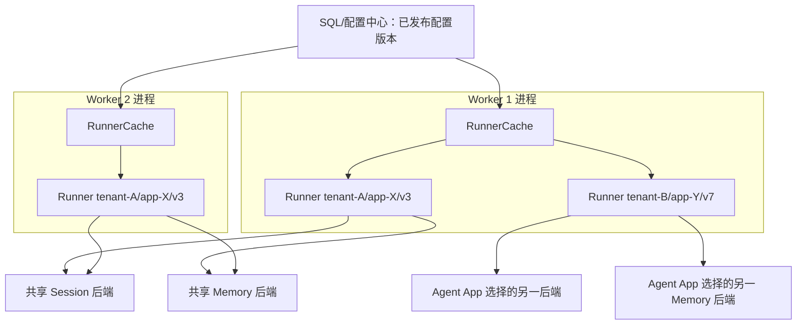

# 阶段 0：Runner 生命周期方案比较

> 核对日期：2026-08-24  
> 状态：方向已确认（2026-08-24），尚未实现

## 1. 两个方案的通俗定义

旧方案：所有请求先进入同一个 Runner。Runner 在读写 Session/Memory 时，路由 Wrapper 再根据服务端内部路由信息选择租户或 Agent App 对应的后端。

```text
多个租户/Agent App
  -> 一个 Runner
  -> Session/Memory 路由 Wrapper
  -> 不同后端
```

新候选方案：Gateway 已经确定 `tenant_id + agent_app_id + config_version`，Worker 执行前据此查找或创建这个配置版本专属的 Runner。

```text
先确定 tenant_id + agent_app_id + config_version
  -> Worker Runner 缓存
  -> 对应 Runner
  -> 已配置好的 Session/Memory Service
```

“专属 Runner”不是每条消息创建一个 Runner，也不是整个集群只有一个对象。它表示：每个 Worker 进程可以为同一个 Agent App 配置版本各有一个本地 Runner 实例；Session/Memory 的唯一状态仍在共享后端。

## 2. 框架源码事实

以下事实来自当前调研的 tRPC-Agent-Go 源码和独立编译验证：

- `NewRunner` 在构造时接收 AppName、Agent、SessionService、MemoryService 和 Plugins 等依赖。
- `NewRunnerWithAgentFactory` 允许每次 Run 延迟创建 Agent，但 Runner 的服务和插件仍在构造时确定。
- `Run` 支持以 `agent.RunOptions.AppName` 覆盖默认 AppName。
- Session 和 Memory 的 key 都包含 AppName。
- `session.Service` 和 `memory.Service` 是宽接口，包含状态、事件、Summary/异步任务、Tools 和 Close 等能力。
- Runner 内部用锁维护活跃请求，并提供基于 RequestID 的取消/状态能力。
- `Runner.Close` 会取消该实例中的活跃 Run，关闭插件，以及关闭它自己创建的 SessionService。
- 通过 Option 传入的 Session/Memory 等外部服务由调用方管理生命周期，不能依赖 Runner 自动关闭。

这些事实说明两种方案都能建立，但平台复杂度落点不同。

## 3. 方案对比

| 维度 | 单 Runner + 路由 Wrapper | 每 Worker 按 Agent App 缓存 Runner |
| --- | --- | --- |
| Runner 数量 | 进程内很少，理想情况下一个 | 大约是该 Worker 近期服务的 `AgentApp × 活跃配置版本`，必须设上限 |
| 创建成本 | 集中创建一次 | 首次命中时创建；可预热热点 App，或用 AgentFactory 延迟重对象 |
| 内存/连接 | Runner 对象少，但 Wrapper 仍要维护多后端 bundle | Runner 对象多；底层 DB/HTTP Client 可由 Worker 级资源池共享，不能每个 Runner 无界建连接池 |
| Agent 配置隔离 | 需在单 Runner 内注册/选择 Agent，或使用 request-scoped factory | Agent、模型、Prompt、Tool、Plugin 在构造时天然绑定到 App 配置版本 |
| Tool/Plugin 隔离 | 路由或 factory 必须保证每次选择正确能力面 | 每个缓存项拥有明确能力面，更容易审计和测试 |
| Session/Memory 选择 | Wrapper 每个方法根据内部路由上下文选择后端 | Runner 构造时注入已选定 Service；执行时不再动态切后端 |
| 接口覆盖 | Wrapper 必须完整代理 Session/Memory 当前和未来方法 | 平台使用框架接口，不需要为路由重写一套宽接口 |
| 可选能力 | Wrapper 可能需要继续暴露扩展/可选接口，否则能力被截断 | 直接传具体 Service，框架可按真实类型发现能力 |
| 生命周期 | Wrapper 要协调多个后端的创建、复用、关闭和局部故障 | Runner 缓存管理器负责缓存项；共享 Service 由独立资源管理器负责 |
| 配置更新 | Wrapper/Factory 内部路由表热更新，旧请求与新请求边界需要自定义 | 配置版本进入 key，新旧 Runner 可短暂并存；新任务明确选新版本 |
| 跨 Worker | 每个 Worker 仍各有自己的单 Runner/Wrapper | 每个 Worker 各自懒创建缓存；不共享 Runner 对象 |
| 共享状态 | 两方案都必须用共享 Session/Memory 后端 | 两方案都必须用共享 Session/Memory 后端 |
| 故障接管 | Worker 失败后另一 Worker 依赖任务租约和共享状态重试 | 同左；目标 Worker 可按任务配置版本重建 Runner |
| 框架侵入 | 较高：平台长期跟进宽接口和扩展能力 | 较低：主要在框架外管理 Runner 和资源 |
| 测试成本 | 每个 Wrapper 方法、路由上下文、扩展接口、关闭语义都要覆盖 | 重点测试 cache key、并发创建、淘汰、版本切换和资源所有权 |
| 主要风险 | Wrapper 漏覆盖能力或生命周期语义，升级框架时维护负担大 | 缓存无界增长、创建风暴、旧版本未排空、共享资源误关闭 |

## 4. 对旧方案的准确评价

旧方案不是“不能做”，也不能因为一句“AppName 可能漏传或错传”就判定有缺陷。框架本身明确支持每次 Run 覆盖 AppName；平台也可以在服务端完成内部路由，不让外部用户提供它。

当前已经能由源码证实的主要负担是：

1. Session/Memory 不是只有两三个 CRUD 方法，Wrapper 必须完整覆盖宽接口。
2. 框架若增加新方法或通过具体类型发现扩展能力，Wrapper 要同步更新，否则会产生行为差异。
3. Wrapper 需要安全地把一次 Run 的内部路由信息传到同步、异步和后台任务中。
4. 多个后端 bundle 的复用、局部故障和 Close 所有权仍然存在，并没有因为只有一个 Runner 消失。
5. 不同 Agent App 的 Agent、Tool、Plugin 和模型配置仍需另一套路由/Factory 机制。

它的优势是 Runner 对象数量少，且在大量 App 配置高度同构时可以统一复用。但对当前“租户可选不同 Agent 配置、工具和数据后端”的题目，它把复杂度集中到了最难验证的动态路由层。

## 5. 新候选方案的实例关系



这里有三个容易误解的点：

- Worker 1 和 Worker 2 不共享内存中的 Runner；它们只使用相同配置快照创建行为等价的 Runner。
- 同一个 Session 的下一条消息可以落到另一 Worker，因为框架状态在共享 Session/Memory 后端，而不是只在 Runner 内存中。
- Runner 内仍有“当前正在执行的 Run”等短期进程状态。Worker 突然退出时，这部分不能透明搬家；Gateway 的任务租约、Inbox 状态和幂等设计决定是否以及如何重试。

## 6. 建议的缓存身份和平台 AppName

建议缓存 key 使用不可变值：

```text
RunnerCacheKey = tenant_id + agent_app_id + config_version
```

建议框架 AppName 使用稳定业务身份，不包含配置版本：

```text
AppName = tenant/{tenant_id}/app/{agent_app_id}
```

两者目的不同：

- `config_version` 放入缓存 key，是为了让新旧运行环境短暂并存并安全排空。
- AppName 不放版本，是为了配置升级后仍能继续同一个 Session/Memory 命名空间。

如果某次配置更新明确要求切断历史会话，应通过发布策略显式改变数据命名空间或执行迁移，不能把所有升级默认变成新 Session。

## 7. 缓存和资源管理草案

阶段 0 不写实现，但后续方案至少需要以下规则：

1. Gateway 任务携带服务端解析并固化的 `tenant_id`、`agent_app_id` 和 `config_version`；Worker 不自行猜“最新版本”。
2. Worker 对同一 cache key 使用 singleflight/互斥创建，防止并发首请求引发创建风暴。
3. 缓存设置最大项数、空闲 TTL 和指标；不能无界保存每个历史版本。
4. 配置发布后，新任务使用新版本；旧 Runner 停止接收新任务，等待活跃 Run 归零后关闭。
5. 达到排空超时时，先取消 context，再消费/关闭 Event 流并调用 `Runner.Close`；失败要记录审计和指标。
6. Session/Memory Service、数据库连接池和 HTTP Client 由 Worker 级资源管理器按后端配置复用并引用计数。
7. Runner 只借用外部 Service。关闭 Runner 时不得误关仍被其他缓存项使用的共享 Service；最后一个引用释放后再由资源管理器 Close。
8. 配置失效通知可以加速淘汰，但正确性依赖任务携带的精确版本和 Worker 按版本加载，而不能只依赖广播恰好送达。
9. 找不到指定版本、配置冲突、密钥不可用或后端初始化失败时 fail closed，不回退到默认 App/默认租户。

## 8. 跨 Worker、错误与重试

两个 Worker 的期望行为是“配置等价、状态共享、实例独立”：

- 任一 Worker 都能用同一配置版本构造等价 Runner。
- Session/Memory 写入共享后端后，后续 Worker 可见。
- 同 Session 的并发顺序不能靠 Runner 缓存保证；需要共享 Session 锁、队列分区或带版本的条件写入。
- Worker 崩溃后，Inbox/任务租约过期，另一 Worker 才能认领；不能两个 Worker 同时盲目重跑。
- 模型或 Tool 是否可安全重试要分类。外部副作用 Tool 必须使用业务幂等键或二次确认，不能仅凭消息去重假设安全。
- 重试任务必须继续使用原 config version，除非有明确的迁移/回滚规则。
- 发送回复失败和 Agent 执行失败是两个状态；已执行完成时不能因为出站失败重新调用模型或 Tool。

## 9. 已确认方向

阶段 0 已确认后续采用“每个 Worker 按 Agent App 配置版本缓存 Runner”，理由是：

- 它与“执行前已通过 ChannelBinding 确定 Agent App”的主链路一致；
- Agent、模型、Tool、Plugin 和后端选择在执行前冻结，更容易解释和审计；
- 不需要长期维护 Session/Memory 宽接口路由 Wrapper，对框架侵入较低；
- 配置版本可通过新旧缓存项并存实现明确的发布和排空边界。

这是已确认的架构方向，但不是已经完成的功能实现。它成立的前提是 Runner 缓存有界、底层资源可共享、配置版本可重建、共享状态后端正确，并必须通过下面的阶段 1 入口验证。

## 10. 阶段 1 入口技术问题

- 真实 Agent/模型/Tool 的 Runner 创建耗时、每实例内存和连接数尚未测量。
- 最终 Agent 是否使用固定实例还是 `NewRunnerWithAgentFactory`，需要根据模型 client、sandbox 和 prompt 动态程度决定。
- 框架 Runner 与所有最终 Plugin/Tool 组合的并发安全仍需 race test。
- App 规模和 Worker 数未知，无法在阶段 0 给出缓存容量；需要用容量假设和指标校准。
- 配置存储/通知机制尚未选择，SQL 与 Redis 的职责要在后续阶段锁定。
- 同 Session 串行化、任务队列、租约和副作用 Tool 的重试语义属于后续平台设计，不由缓存方案自动解决。
- Runner 排空期间长流式请求、用户取消和进程优雅退出的最大等待时间尚未定。

## 11. 最小可行性验证规格

该验证在临时目录完成，不修改生产代码和服务仓库 `go.mod`：

1. 用两个 AgentApp、两个配置版本创建假 Agent 和计数型 Session/Memory Service。
2. 实现仅用于 Spike 的内存 RunnerCache：按 `tenant + app + version` singleflight 创建并记录引用。
3. 模拟两个 Worker，各自创建同一个 App/version 的 Runner，证明 Runner 实例不同而共享后端可见。
4. 并发 100 次获取同一 key，断言每个 Worker 只创建一次。
5. 发布新版本，证明新任务使用新 Runner，旧任务完成后旧 Runner 只 Close 一次。
6. 模拟创建失败、配置版本不存在、后端不可用、排空超时，全部 fail closed。
7. 运行 `go test -race`，检查并发 map、引用计数和 Close。
8. 记录每 Runner 创建耗时、增量内存、goroutine 数和后端 client 数。
9. 对比一个最小路由 Wrapper 需要实现的 Session/Memory 方法数量和扩展接口，形成维护成本证据。

通过门槛不是“缓存能跑”，而是：无重复创建、无跨 App 路由、无共享资源误关闭、版本更新可排空、两个 Worker 能从共享状态继续同一 Session。

## 12. 已确认的执行边界

- 采用新候选方案作为后续实现方向。
- cache key 含 `config_version`，框架 AppName 不含 config version。
- Worker 各有本地 Runner，Session/Memory 位于共享后端。
- 阶段 1 先完成上述临时 Spike，再固定缓存容量、AgentFactory 使用方式和资源排空参数。
